<properties
	pageTitle="Analyse de la disponibilité et de la réactivité d’un site Web | Microsoft Azure"
	description="Configurez des tests web dans Application Insights. Recevez des alertes si un site web devient indisponible ou répond lentement."
	services="application-insights"
    documentationCenter=""
	authors="alancameronwills"
	manager="douge"/>

<tags
	ms.service="application-insights"
	ms.workload="tbd"
	ms.tgt_pltfrm="ibiza"
	ms.devlang="na"
	ms.topic="get-started-article"
	ms.date="03/01/2016"
	ms.author="awills"/>

# Analyse de la disponibilité et de la réactivité d'un site Web

Après avoir déployé votre application web, vous pouvez configurer des tests web pour analyser sa disponibilité et sa réactivité. Application Insights envoie des demandes web à intervalles réguliers à partir de différents points dans le monde et vous alerte si votre application réagit lentement ou pas du tout.

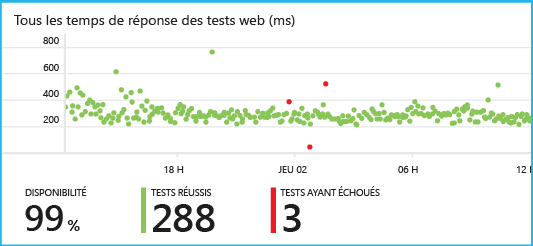

Vous pouvez configurer des tests web pour n'importe quel point de terminaison HTTP ou HTTPS accessible à partir du réseau Internet public.

Il existe deux types de tests web :

* [Test ping d’URL](#set-up-a-url-ping-test) : un test simple que vous pouvez créer dans le portail Azure.
* [Test web multi-étapes](#multi-step-web-tests) : que vous créez dans Visual Studio Ultimate ou Visual Studio Enterprise et que vous chargez sur le portail.

Vous pouvez créer jusqu’à 10 tests web par ressource d’application.


## Configuration d’un test ping d’URL

### <a name="create"></a>1. Création d'une nouvelle ressource ?

Ignorez cette étape si vous avez déjà [configuré une ressource Application Insights][start] pour cette application et que vous souhaitez afficher les données de disponibilité au même endroit.

Inscrivez-vous à [Microsoft Azure](http://azure.com), accédez au [portail Azure](https://portal.azure.com), et créez une nouvelle ressource Application Insights.

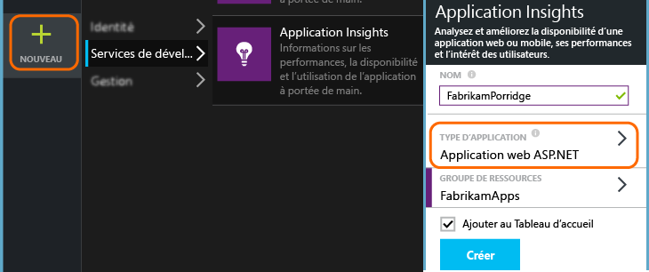

Le panneau Vue d’ensemble de la nouvelle ressource s’ouvre. Pour le trouver à tout moment dans le [portail Azure](https://portal.azure.com), cliquez sur **Parcourir**.

### <a name="setup"></a>2. Créer un test web

Dans votre ressource Application Insights, recherchez la vignette de disponibilité. Cliquez dessus pour ouvrir le panneau des tests web de votre application et ajouter un test web.

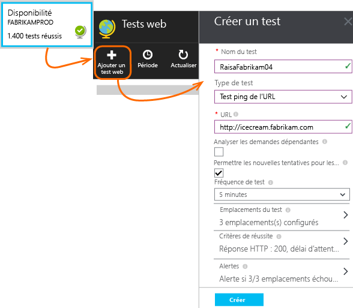

- **L’URL** doit être visible à partir de l’Internet public. Elle peut inclure une chaîne de requête, par exemple pour vous permettre de tester un peu votre base de données. Si l’URL correspond à une redirection, nous allons la suivre, jusqu’à 10 redirections.
- **Analyser les demandes dépendantes** : les images, scripts, fichiers de style et autres ressources de la page sont demandés dans le cadre du test. Le test échouera si toutes ces ressources ne peuvent pas être téléchargées avec succès dans le délai imparti pour l’ensemble du test.
- **Autoriser de nouvelles tentatives** : une nouvelle tentative de test sera effectuée après un court intervalle en cas d’échec du test. L’échec est signalé uniquement après trois tentatives infructueuses. Les tests suivants sont ensuite effectués selon la fréquence de test habituelle. La nouvelle tentative est temporairement suspendue jusqu’à la réussite de la tentative suivante. Cette règle est appliquée indépendamment à chaque emplacement de test. (Nous recommandons ce paramètre. En moyenne, environ 80 % des échecs disparaissent lors de la nouvelle tentative.)
- **Fréquence de test** : définit la fréquence selon laquelle le test est exécuté à partir de chaque emplacement de test. Avec une fréquence de 5 minutes et cinq emplacements de test, votre site sera testé en moyenne chaque minute.
- Les **emplacements de test** sont les lieux d’où nos serveurs envoient des requêtes web à votre URL. Choisissez-en plusieurs de façon à distinguer les problèmes de votre site web des problèmes de réseau. Vous pouvez sélectionner jusqu’à 16 emplacements.

- **Critères de réussite** :

    **Délai d’expiration de test** : diminuez cette valeur pour être averti des réponses lentes. Le test est compté comme une erreur si des réponses de votre site n’ont pas été reçues pendant cette période. Si vous avez sélectionné **Analyser les demandes dépendantes**, l’ensemble des images, fichiers de style, scripts et autres ressources dépendantes ont dû être reçus pendant cette période.

    **Réponse HTTP** : le code d’état retourné est comptabilisé comme un succès. 200 est le code qui indique qu’une page web normale a été retournée.

    **Correspondance de contenu** : une chaîne telle que « Bienvenue ! » Nous allons vérifier qu'elle est présente dans chaque réponse. Il doit s'agir d'une chaîne standard sans caractère générique. N'oubliez pas que si votre contenu change, vous devrez peut-être l'actualiser.


- Des **alertes** vous sont envoyées par défaut, en cas de défaillance dans trois emplacements en cinq minutes. Une défaillance dans un emplacement est susceptible d’être un problème réseau et non un problème relatif à votre site. Cependant, vous pouvez modifier le seuil de manière à ce qu’il soit plus ou moins sensible. Vous pouvez également modifier les destinataires des courriers électroniques.

#### Test d'autres URL

Ajoutez d’autres tests. Exemple : outre le test de votre page d’accueil, vous pouvez vérifier que votre base de données fonctionne correctement en testant une recherche sur l’URL.


### <a name="monitor"></a>3. Afficher les rapports de disponibilité

Après 1 à 2 minutes, cliquez sur **Actualiser** dans le panneau de disponibilité/tests web. Il n’est pas automatiquement actualisé.

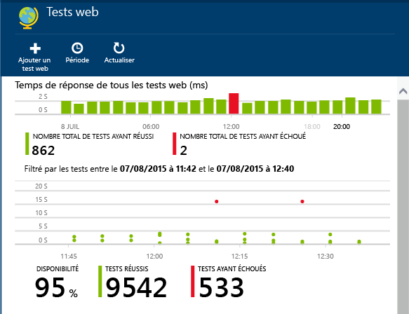

Cliquez sur une barre du graphique de synthèse en haut pour obtenir une vue plus détaillée de cette période.

Ces graphiques combinent les résultats de tous les tests web de cette application.

#### Composants de votre page web

Les images, les feuilles de style, les scripts et les autres composants statiques de la page web que vous testez sont demandés dans le cadre du test.

Le temps de réponse enregistré est la durée que prend le chargement complet de tous les composants.

Si le chargement d'un composant échoue, le test est marqué comme ayant échoué.

## <a name="failures"></a>Si vous constatez des erreurs...

Cliquez sur un point rouge.

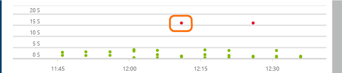

Ou, faites défiler et cliquez sur un test affichant moins de 100 % de réussite.

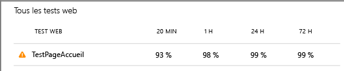

Cela permet d’afficher les résultats de ce test.

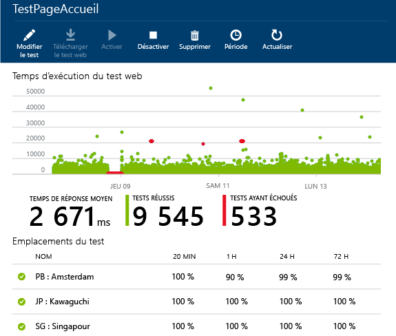

Le test est exécuté à partir de plusieurs emplacements : choisissez-en un dont les résultats sont inférieurs à 100 %.

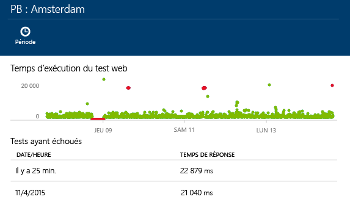


Faites défiler l’écran jusqu’à **Échecs de tests** et choisissez un résultat.

Cliquez sur le résultat pour l’évaluer dans le portail et savoir pourquoi il a échoué.

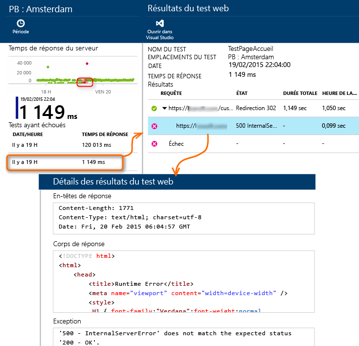


Vous pouvez aussi télécharger le fichier de résultats et l’examiner dans Visual Studio.


*Le résultat semble correct, mais une erreur est signalée ?* Vérifiez toutes les images, les scripts, les feuilles de style et tout autre fichier chargé par la page. Si l’un d’eux échoue, le test signalera une erreur, même si la page html principale se charge correctement.


## Tests web à plusieurs étapes

Vous pouvez analyser un scénario qui implique une séquence d'URL. Par exemple, si vous analysez un site Web commercial, vous pouvez vérifier que l’ajout d’articles au panier d’achat fonctionne correctement.

Pour créer un test à plusieurs étapes, vous enregistrez le scénario à l'aide de Visual Studio et téléchargez ensuite l'enregistrement dans Application Insights. Application Insights relit le scénario à intervalles réguliers et vérifie les réponses.

Notez que vous ne pouvez pas utiliser de fonctions codées dans vos tests : les étapes du scénario doivent figurer sous forme de script dans le fichier .webtest.

#### 1\. Enregistrement d’un scénario

Utilisez Visual Studio Enterprise ou Ultimate pour enregistrer une session web.

1. Créez un projet de test de performances web.

    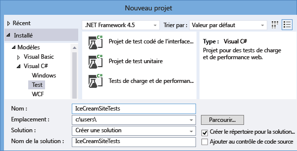

2. Ouvrez le fichier .webtest et lancez l'enregistrement.

    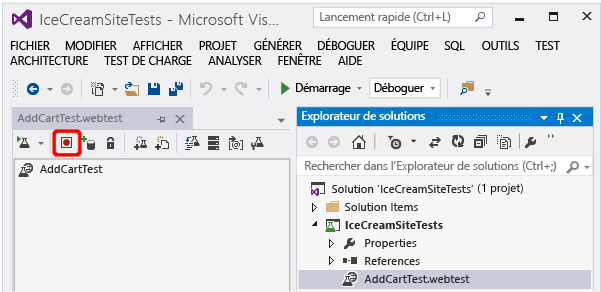

3. Effectuez les actions utilisateur que vous voulez simuler lors de votre test : ouvrez votre site web, ajoutez un produit au panier d’achat etc. Ensuite, arrêtez le test.

    

    Ne créez pas de scénario long. La limite est de 100 étapes et 2 minutes.

4. Modifiez le test pour :
 - ajouter des validations en vue de vérifier le texte reçu et les codes de réponse ;
 - supprimer les interactions superflues. Vous pouvez aussi supprimer les demandes dépendantes d’images ou celles à destination de sites AD ou de suivi.

    Ne perdez pas de vue que vous pouvez modifier uniquement le script de test. Vous ne pouvez pas ajouter de code personnalisé ni appeler d’autres tests web. N’insérez pas de boucles dans le test. Vous pouvez utiliser des plug-ins de test web standard.

5. Exécutez le test dans Visual Studio pour vérifier qu'il fonctionne.

    Le test runner web ouvre un navigateur web et répète les actions enregistrées. Assurez-vous qu’il fonctionne comme prévu.

    


#### 2\. Chargement du test web dans Application Insights

1. Dans le portail Application Insights, créez un test web.

    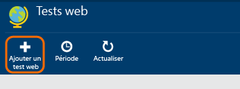

2. Sélectionnez le test à plusieurs étapes et téléchargez le fichier .webtest.

    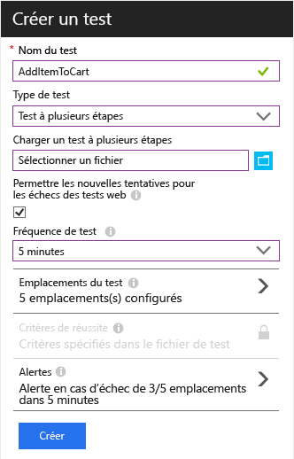

    Définissez les emplacements de test, la fréquence et les paramètres d’alerte comme pour les tests ping.

Affichez les résultats de votre test et les échecs éventuels de la même manière que pour les tests d'URL unique.

Un échec est souvent dû à un test trop long. Le test ne doit pas durer plus de deux minutes.

N’oubliez pas que toutes les ressources d’une page doivent se charger correctement pour que le test réussisse, y compris les scripts, les feuilles de style, les images etc.

Notez que le test web doit être entièrement contenu dans le fichier .webtest : vous ne pouvez pas utiliser de fonctions codées dans le test.


### Ajout de plug-ins de temps et de nombres aléatoires à votre test à plusieurs étapes

Supposons que vous testiez un outil qui obtient des données temporelles, telles que des actions à partir d’un flux externe. Lorsque vous enregistrez votre test web, vous devez utiliser des heures spécifiques, mais vous les définissez en tant que paramètres de test, à savoir StartTime et EndTime.


Lorsque vous exécutez le test, vous souhaitez que le paramètre EndTime corresponde systématiquement à l’heure actuelle et le paramètre StartTime à l’heure d’il y a 15 minutes.

Les plug-ins de test web vous permettent d'y parvenir.

1. Ajoutez un plug-in de test web pour chaque valeur de paramètre variable souhaitée. Dans la barre d’outils de test web, sélectionnez **Ajouter un plug-in de test web**.

    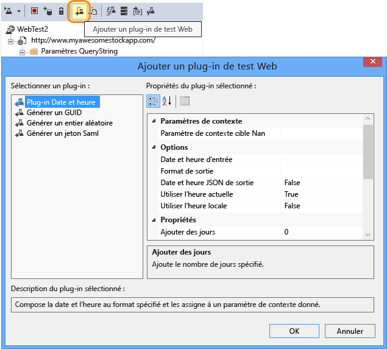

    Dans cet exemple, nous allons utiliser deux instances du plug-in Date Time. Une instance est pour « il y a 15 minutes » et l’autre pour « maintenant ».

2. Ouvrez les propriétés de chaque plug-in. Donnez-lui un nom et configurez-le de manière à utiliser l’heure actuelle. Pour l'un d'eux, définissez Ajouter des minutes = -15.

    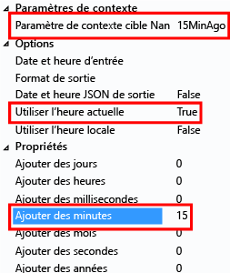

3. Dans les paramètres de test web, utilisez {{nom du plug-in}} pour référencer un nom de plug-in.

    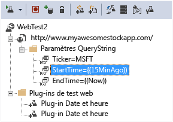

Maintenant, téléchargez votre test sur le portail. Il va utiliser les valeurs dynamiques à chaque exécution du test.

## Gestion de la connexion

Si vos utilisateurs se connectent à votre application, vous disposez de plusieurs options pour simuler la connexion et tester les pages suivant la connexion. L’approche que vous utilisez dépend du type de sécurité fourni par l’application.

Dans tous les cas, vous devez créer un compte uniquement à des fins de test. Si possible, limitez les autorisations afin qu’il soit accessible en lecture seulement.

* Nom d’utilisateur et mot de passe simples : enregistrez simplement un test web de la manière habituelle. Supprimez d’abord les cookies
* Authentification SAML. Pour ce faire, vous pouvez utiliser le plug-in SAML qui est disponible pour les tests web.
* Clé secrète client : si le mode de connexion de votre application implique une clé secrète client, utilisez-la. Azure Active Directory permet de faire cela. 
* Authentification ouverte - par exemple, connexion à l’aide de votre compte Microsoft ou Google. De nombreuses applications utilisant OAuth fournissent l’alternative de la clé secrète client. Donc, commencez par rechercher cela. Si votre test doit se connecter à l’aide d’OAuth, l’approche générale est la suivante :
 * Utilisez un outil tel que Fiddler pour examiner le trafic entre votre navigateur web, le site d’authentification et votre application. 
 * Effectuez deux connexions ou plus à l’aide d’ordinateurs ou de navigateurs différents, ou à des intervalles longs (pour que les jetons arrivent à expiration).
 * En comparant les différentes sessions, identifiez le jeton retransmis à partir du site d’authentification, qui est ensuite transmis à votre serveur d’application après la connexion. 
 * Enregistrez un test web à l’aide de Visual Studio. 
 * Paramétrez les jetons, en définissant le paramètre lorsque le jeton est retourné par l’authentificateur et en l’utilisant dans la requête soumise sur le site. (Visual Studio va tenter de paramétrer le test, mais ne va pas paramétrer correctement les jetons.)


## <a name="edit"></a>Modification ou désactivation d’un test

Ouvrez un test à modifier ou à désactiver.

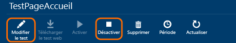

Vous pouvez par exemple désactiver des tests web lorsque vous effectuez des opérations de maintenance sur votre service.

## Des questions ? Des problèmes ?

* *Puis-je appeler du code à partir de mon test web ?*

    Non. Les étapes du test doivent se trouver dans le fichier .webtest. Et vous ne pouvez pas appeler d’autres tests web ou utiliser des boucles. En revanche, il existe un certain nombre de plug-ins qui peuvent s’avérer utiles.

* *Le protocole HTTPS est-il pris en charge ?*

    Nous prenons actuellement en charge SSL 3.0 et TLS 1.0.

* *Quelle est la différence entre les « tests Web » et les « tests de disponibilité » ?*

    Nous utilisons ces deux termes indifféremment.

* *J’aimerais utiliser les tests de disponibilité sur notre serveur interne qui s’exécute derrière un pare-feu.*

    Configurez votre pare-feu pour autoriser les demandes provenant des adresses IP dans la liste à la fin de cet article.

## <a name="video"></a>Vidéo

> [AZURE.VIDEO monitoring-availability-with-application-insights]

## <a name="next"></a>Étapes suivantes

[Recherche des journaux de diagnostic][diagnostic]

[Résolution des problèmes][qna]


## Adresses IP des tests web

Si vous devez ouvrir un pare-feu pour permettre les tests web, voici la liste actuelle des adresses IP. Elle peut évoluer de temps à autre.

Ouvrez les ports 80 (http) et 443 (https).

```

213.199.178.54
213.199.178.55
213.199.178.56
213.199.178.61
213.199.178.57
213.199.178.58
213.199.178.59
213.199.178.60
213.199.178.63
213.199.178.64
207.46.98.158
207.46.98.159
207.46.98.160
207.46.98.157
207.46.98.152
207.46.98.153
207.46.98.156
207.46.98.162
207.46.98.171
207.46.98.172
65.55.244.40
65.55.244.17
65.55.244.42
65.55.244.37
65.55.244.15
65.55.244.16
65.55.244.44
65.55.244.18
65.55.244.46
65.55.244.47
207.46.14.60
207.46.14.61
207.46.14.62
207.46.14.55
207.46.14.63
207.46.14.64
207.46.14.51
207.46.14.52
207.46.14.56
207.46.14.65
157.55.14.60
157.55.14.61
157.55.14.62
157.55.14.47
157.55.14.64
157.55.14.65
157.55.14.43
157.55.14.44
157.55.14.49
157.55.14.50
65.54.66.56
65.54.66.57
65.54.66.58
65.54.66.61
207.46.71.54
207.46.71.52
207.46.71.55
207.46.71.38
207.46.71.51
207.46.71.57
207.46.71.58
207.46.71.37
202.89.228.67
202.89.228.68
202.89.228.69
202.89.228.57
65.54.78.49
65.54.78.50
65.54.78.51
65.54.78.54
94.245.82.32
94.245.82.33
94.245.82.37
94.245.82.38
94.245.72.44
94.245.72.45
94.245.72.46
94.245.72.49
207.46.56.57
207.46.56.58
207.46.56.59
207.46.56.67
207.46.56.61
207.46.56.62
207.46.56.63
207.46.56.64
65.55.82.84
65.55.82.85
65.55.82.86
65.55.82.81
65.55.82.87
65.55.82.88
65.55.82.89
65.55.82.90
65.55.82.91
65.55.82.92
94.245.78.40
94.245.78.41
94.245.78.42
94.245.78.45
70.37.147.43
70.37.147.44
70.37.147.45
70.37.147.48
94.245.66.43
94.245.66.44
94.245.66.45
94.245.66.48

```


<!--Link references-->

[azure-availability]: ../insights-create-web-tests.md
[diagnostic]: app-insights-diagnostic-search.md
[qna]: app-insights-troubleshoot-faq.md
[start]: app-insights-overview.md

<!---HONumber=AcomDC_0302_2016-->