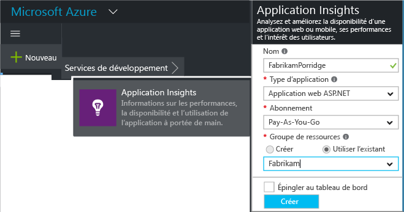
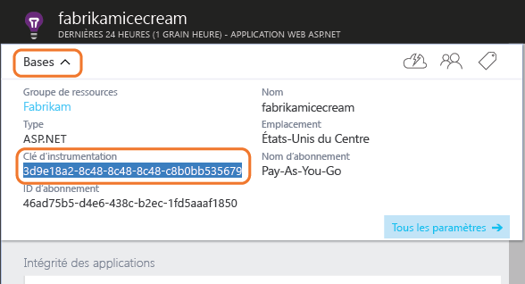

# <a name="add-application-insights-sdk-to-monitor-your-nodejs-app"></a>Ajout du Kit de développement logiciel (SDK) Application Insights à votre application Node.js


[Azure Application Insights](app-insights-overview.md) surveille votre application en direct pour vous aider à [détecter et diagnostiquer les problèmes de performances et les exceptions](app-insights-detect-triage-diagnose.md), mais aussi [découvrir comment votre application est utilisée](app-insights-overview-usage.md). Il fonctionne pour les applications hébergées sur vos propres serveurs locaux IIS ou sur les machines virtuelles Azure, ainsi que les applications Web Azure.

Le SDK collecte automatiquement les taux de demandes HTTP entrantes et les réponses, les compteurs de performances (processeur, mémoire, RPS) et les exceptions non prises en charge. Vous pouvez également ajouter des appels personnalisés pour effectuer le suivi des dépendances, mesures ou autres événements.


#### <a name="before-you-start"></a>Avant de commencer
Ce dont vous avez besoin :

* Un abonnement à [Microsoft Azure](http://azure.com). Si votre équipe ou votre organisation dispose d’un abonnement Azure, le propriétaire peut vous y ajouter à l’aide de votre [compte Microsoft](http://live.com).

## <a name="a-nameaddacreate-an-application-insights-resource"></a><a name="add"></a>Créer une ressource Application Insights
Connectez-vous au [portail Azure][portal] et créez une ressource Application Insights. Dans Azure, une [ressource][roles] correspond à l’instance d’un service. Cette ressource correspond à l’emplacement où les données de télémétrie de votre application sont analysées avant de vous être présentées.



Choisissez le type d’application Général. Le choix du type d’application définit le contenu par défaut des panneaux de ressource et les propriétés visibles dans [Metrics Explorer][metrics].

#### <a name="copy-the-instrumentation-key"></a>Copie de la clé d'instrumentation
La clé identifie la ressource. Vous allez bientôt l’installer dans le Kit de développement logiciel (SDK) pour diriger les données vers la ressource.



## <a name="a-namesdka-install-the-sdk-in-your-application"></a><a name="sdk"></a> Installer le Kit de développement logiciel (SDK) dans votre application
```
npm install applicationinsights --save
```

## <a name="usage"></a>Utilisation
Ceci permet de prendre en charge la surveillance des demandes, le suivi des exceptions non prises en charge et l’analyse des performances du système (processeur, mémoire/RPS).

```javascript

var appInsights = require("applicationinsights");
appInsights.setup("<instrumentation_key>").start();
```

La clé d’instrumentation peut également être définie dans la variable d’environnement APPINSIGHTS_INSTRUMENTATIONKEY. Dans ce cas, aucun argument n’est requis lors de l’appel de `appInsights.setup()` ou `appInsights.getClient()`.

Vous pouvez tester le SDK sans envoyer de données de télémétrie, en définissant la clé d’instrumentation sur une chaîne non vide.

## <a name="a-nameruna-run-your-project"></a><a name="run"></a> Exécution de votre projet
Exécutez votre application et essayez-la : ouvrez différentes pages pour générer des données de télémétrie.

## <a name="a-namemonitora-view-your-telemetry"></a><a name="monitor"></a> Affichage de vos données de télémétrie
Revenez au [portail Azure](https://portal.azure.com) et accédez à votre ressource Application Insights.

Recherchez des données dans la page de présentation. Au début, seuls un ou deux points s'affichent. Par exemple :


Cliquez sur un des graphiques pour afficher des mesures plus détaillées. [En savoir plus sur les mesures.][perf]

#### <a name="no-data"></a>Pas de données ?
* Utilisez l'application en ouvrant différentes pages pour générer des données de télémétrie.
* Ouvrez la vignette [Rechercher](app-insights-diagnostic-search.md) pour afficher les événements individuels. Parfois, les événements mettent un peu plus de temps pour parcourir le pipeline de métriques.
* Attendez quelques secondes, puis cliquez sur **Actualiser**. Les graphiques s’actualisent à intervalles réguliers, mais vous pouvez les actualiser manuellement si vous attendez que certaines données s’affichent.
* Consultez la rubrique [Résolution des problèmes][qna].

## <a name="publish-your-app"></a>Publier votre application
À présent, déployez votre application sur IIS ou Azure et regardez les données s’accumuler.

#### <a name="no-data-after-you-publish-to-your-server"></a>Les données n’apparaissent pas après leur publication sur votre serveur ?
Ouvrez ces ports pour le trafic sortant dans le pare-feu de votre serveur :

* `dc.services.visualstudio.com:443`
* `f5.services.visualstudio.com:443`

#### <a name="trouble-on-your-build-server"></a>Vous rencontrez des problèmes sur votre serveur de builds ?
Consultez cet article de [résolution des problèmes](app-insights-asp-net-troubleshoot-no-data.md#NuGetBuild).

## <a name="customized-usage"></a>Utilisation personnalisée
### <a name="disabling-auto-collection"></a>Désactivation de la collecte automatique
```javascript
import appInsights = require("applicationinsights");
appInsights.setup("<instrumentation_key>")
    .setAutoCollectRequests(false)
    .setAutoCollectPerformance(false)
    .setAutoCollectExceptions(false)
    // no telemetry will be sent until .start() is called
    .start();
```

### <a name="custom-monitoring"></a>Surveillance personnalisée
```javascript
import appInsights = require("applicationinsights");
var client = appInsights.getClient();

client.trackEvent("custom event", {customProperty: "custom property value"});
client.trackException(new Error("handled exceptions can be logged with this method"));
client.trackMetric("custom metric", 3);
client.trackTrace("trace message");
```

[En savoir plus sur l’API de télémesure](app-insights-api-custom-events-metrics.md).

### <a name="using-multiple-instrumentation-keys"></a>Utilisation de plusieurs clés d’instrumentation
```javascript
import appInsights = require("applicationinsights");

// configure auto-collection with one instrumentation key
appInsights.setup("<instrumentation_key>").start();

// get a client for another instrumentation key
var otherClient = appInsights.getClient("<other_instrumentation_key>");
otherClient.trackEvent("custom event");
```

## <a name="examples"></a>Exemples
### <a name="tracking-dependency"></a>Suivi des dépendances
```javascript
import appInsights = require("applicationinsights");
var client = appInsights.getClient();

var startTime = Date.now();
// execute dependency call
var endTime = Date.now();

var elapsedTime = endTime - startTime;
var success = true;
client.trackDependency("dependency name", "command name", elapsedTime, success);
```


### <a name="manual-request-tracking-of-all-get-requests"></a>Suivi manuel de toutes les demandes « GET »
```javascript
var http = require("http");
var appInsights = require("applicationinsights");
appInsights.setup("<instrumentation_key>")
    .setAutoCollectRequests(false) // disable auto-collection of requests for this example
    .start();

// assign common properties to all telemetry sent from the default client
appInsights.client.commonProperties = {
    environment: process.env.SOME_ENV_VARIABLE
};

// track a system startup event
appInsights.client.trackEvent("server start");

// create server
var port = process.env.port || 1337
var server = http.createServer(function (req, res) {
    // track all "GET" requests
    if(req.method === "GET") {
        appInsights.client.trackRequest(req, res);
    }

    res.writeHead(200, { "Content-Type": "text/plain" });
    res.end("Hello World\n");
}).listen(port);

// track startup time of the server as a custom metric
var start = +new Date;
server.on("listening", () => {
    var end = +new Date;
    var duration = end - start;
    appInsights.client.trackMetric("StartupTime", duration);
});
```

## <a name="next-steps"></a>Étapes suivantes
* [Navigation et tableaux de bord dans le portail Application Insights](app-insights-dashboards.md)
* [Écrire des requêtes Analytics via vos données de télémétrie](app-insights-analytics-tour.md)

<!--Link references-->

[knowUsers]: app-insights-overview-usage.md
[metrics]: app-insights-metrics-explorer.md
[perf]: app-insights-web-monitor-performance.md
[portal]: http://portal.azure.com/
[qna]: app-insights-troubleshoot-faq.md
[roles]: app-insights-resources-roles-access-control.md

