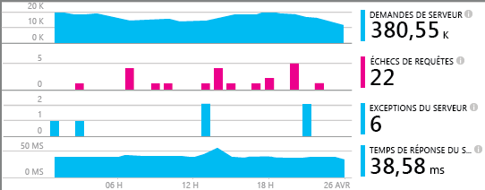
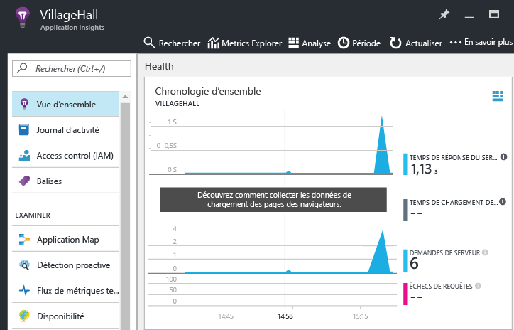

# <a name="monitor-your-nodejs-services-and-apps-with-application-insights"></a>Surveiller vos services et applications Node.js avec Application Insights

[Azure Application Insights](app-insights-overview.md) surveille vos services et composants principaux après leur déploiement pour vous permettre de [détecter et diagnostiquer rapidement les problèmes de performances et autres](app-insights-detect-triage-diagnose.md). Utilisez ce service pour les services Node.js, où qu’ils soient hébergés : dans votre centre de données, des machines virtuelles Azure et des applications Web, voire d’autres clouds publics.

Pour recevoir, stocker et explorer vos données d’analyse, suivez les instructions ci-après afin d’inclure un agent dans votre code et de configurer une ressource Application Insights correspondante dans Azure. L’agent envoie les données à cette ressource pour une analyse et une exploration plus approfondies.

L’agent Node.js peut automatiquement analyser les demandes HTTP entrantes et sortantes, plusieurs mesures du système, ainsi que les exceptions. Depuis la version 0.20, il peut également analyser certains packages tiers courants, tels que `mongodb`, `mysql` et `redis`. Tous les événements liés à une demande HTTP entrante sont mis en corrélation pour une résolution des problèmes plus rapide.

Vous pouvez surveiller un plus grand nombre d’aspects de votre application et de votre système par le biais d’une instrumentation manuelle, et ce, grâce à l’API de l’agent décrite plus loin.



## <a name="getting-started"></a>Mise en route

Voyons comment configurer l’analyse d’une application ou d’un service.

### <a name="resource"></a> Configurer une ressource Application Insights

**Avant de commencer**, assurez-vous que vous disposez d’un abonnement Azure ou [obtenez-en un gratuitement][azure-free-offer]. Si votre organisation possède déjà un abonnement Azure, un administrateur peut suivre [ces instructions][add-aad-user] pour vous y ajouter.

[azure-free-offer]: https://azure.microsoft.com/en-us/free/
[add-aad-user]: https://docs.microsoft.com/en-us/azure/active-directory/active-directory-users-create-azure-portal

À présent, connectez-vous au [portail Azure][portal] et créez une ressource Application Insights, comme illustré ci-après : cliquez sur Nouveau > Outils de développement > Application Insights. La ressource inclut un point de terminaison permettant de recevoir les données de télémétrie, le stockage pour ces données, les rapports et tableaux de bord enregistrés, la configuration des règles et des alertes, etc.


Sur la page de création de ressource, sélectionnez Application Node.js dans la liste déroulante comportant les types d’application. Le type d’application détermine l’ensemble des tableaux de bord et rapports créés pour vous par défaut. Ne vous inquiétez pas : toutes les ressources Application Insights peuvent collecter des données à partir de n’importe quel langage et n’importe quelle plateforme.


### <a name="agent"></a> Configurer l’agent Node.js

Il est maintenant temps d’inclure l’agent dans votre application afin qu’il collecte des données.
Copiez la clé d’instrumentation de votre ressource (ci-après dénommée `ikey`) à partir du portail, comme indiqué ci-dessous. Le système Application Insights utilise cette clé pour mettre en correspondance des données avec votre ressource Azure. Vous devez donc l’indiquer dans une variable d’environnement ou dans votre code pour que l’agent l’utilise.  


Ajoutez ensuite la bibliothèque d’agents Node.js aux dépendances de votre application par le biais de package.json. À partir du dossier racine de votre application, exécutez :

```bash
npm install applicationinsights --save
```

À présent, vous devez charger explicitement la bibliothèque dans votre code. Étant donné que l’agent injecte l’instrumentation dans beaucoup d’autres bibliothèques, vous devez la charger dès que possible, même avant les autres instructions `require`. Pour commencer, en haut de votre premier fichier .js, ajoutez :

```javascript
const appInsights = require("applicationinsights");
appInsights.setup("<instrumentation_key>");
appInsights.start();
```

La méthode `setup` configure l’instrumentation clé (et donc la ressource Azure) à utiliser par défaut pour tous les éléments suivis. Appelez `start` une fois la configuration terminée pour commencer la collecte et l’envoi des données de télémétrie.

Vous pouvez également fournir une clé d’instrumentation par le biais de la variable d’environnement APPINSIGHTS\_INSTRUMENTATIONKEY au lieu de la transférer manuellement vers `setup()` ou `getClient()`. Cela vous permet de conserver les clés d’instrumentation en dehors du code source dédié et de spécifier des clés d’instrumentation différentes selon les environnements.

Des options de configuration supplémentaires sont présentées ci-dessous.

Vous pouvez tester l’agent sans envoyer de données de télémétrie, en définissant la clé d’instrumentation sur une chaîne non vide.

### <a name="monitor"></a> Surveiller votre application

L’agent recueille automatiquement les données de télémétrie sur le runtime Node.js et certains modules tiers courants. À présent, votre application permet de générer certaines de ces données.

Dans le [portail Azure][portal], accédez à la ressource Application Insights que vous venez de créer et recherchez vos premiers points de données dans la chronologie d’ensemble, comme illustré ci-après. Cliquez sur les graphiques pour plus de détails.



Cliquez sur le bouton Mise en correspondance d’applications afin d’afficher la topologie détectée pour votre application, comme illustré ci-après. Cliquez sur les composants de la mise en correspondance pour plus de détails.


Pour en savoir plus sur votre application et pour résoudre d’éventuels problèmes, utilisez les autres vues disponibles sous la section Examiner.


#### <a name="no-data"></a>Pas de données ?

Étant donné que l’agent regroupe les données à envoyer, l’affichage des éléments dans le portail peut prendre un certain temps. Si les données n’apparaissent pas dans votre ressource, essayez ce qui suit :

* Utilisez un peu plus l’application : effectuez d’autres actions pour générer plus de télémétrie.
* Cliquez sur **Actualiser** dans l’affichage des ressources du portail. Les graphiques s’actualisent régulièrement, mais cette option force les graphiques à s’actualiser instantanément.
* Vérifiez que les [ports sortants requis](app-insights-ip-addresses.md) sont ouverts.
* Ouvrez la mosaïque [Rechercher](app-insights-diagnostic-search.md) et recherchez les événements individuels.
* Consultez les [FAQ][].


## <a name="agent-configuration"></a>Configuration de l’agent

Voici les méthodes de configuration de l’agent et leurs valeurs par défaut.

Pour mettre pleinement en corrélation les événements dans un service, veillez à définir `.setAutoDependencyCorrelation(true)`. L’agent peut ainsi effectuer le suivi de contexte entre les rappels asynchrones dans Node.js.

```javascript
const appInsights = require("applicationinsights");
appInsights.setup("<instrumentation_key>")
    .setAutoDependencyCorrelation(false)
    .setAutoCollectRequests(true)
    .setAutoCollectPerformance(true)
    .setAutoCollectExceptions(true)
    .setAutoCollectDependencies(true)
    .start();
```

## <a name="agent-api"></a>API de l’agent

<!-- TODO: Fully document agent API. -->

L’API de l’agent .NET est décrite en détail [ici](app-insights-api-custom-events-metrics.md).

Vous pouvez suivre les demandes, les événements, les mesures ou les exceptions à l’aide du client Application Insights Node.js. L’exemple suivant présente certaines des API disponibles.

```javascript
let appInsights = require("applicationinsights");
appInsights.setup().start(); // assuming ikey in env var
let client = appInsights.getClient();

client.trackEvent("my custom event", {customProperty: "custom property value"});
client.trackException(new Error("handled exceptions can be logged with this method"));
client.trackMetric("custom metric", 3);
client.trackTrace("trace message");

let http = require("http");
http.createServer( (req, res) => {
  client.trackRequest(req, res); // Place at the beginning of your request handler
});
```

### <a name="track-your-dependencies"></a>Suivre les dépendances

```javascript
let appInsights = require("applicationinsights");
let client = appInsights.getClient();

var success = false;
let startTime = Date.now();
// execute dependency call here....
let duration = Date.now() - startTime;
success = true;

client.trackDependency("dependency name", "command name", duration, success);
```

### <a name="add-a-custom-property-to-all-events"></a>Ajouter une propriété personnalisée à tous les événements

```javascript
appInsights.client.commonProperties = {
    environment: process.env.SOME_ENV_VARIABLE
};
```

### <a name="track-http-get-requests"></a>Suivre les demandes HTTP GET

```javascript
var server = http.createServer((req, res) => {
    if ( req.method === "GET" ) {
            appInsights.client.trackRequest(req, res);
    }
    // other work here....
    res.end();
});
```

### <a name="track-server-startup-time"></a>Suivre le temps de démarrage du serveur

```javascript
let start = Date.now();
server.on("listening", () => {
    let duration = Date.now() - start;
    appInsights.client.trackMetric("server startup time", duration);
});
```

## <a name="more-resources"></a>Autres ressources

* [Navigation et tableaux de bord dans le portail Application Insights](app-insights-dashboards.md)
* [Écrire des requêtes Analytics via vos données de télémétrie](app-insights-analytics-tour.md)

<!--references-->

[portal]: https://portal.azure.com/
[FAQ]: app-insights-troubleshoot-faq.md

