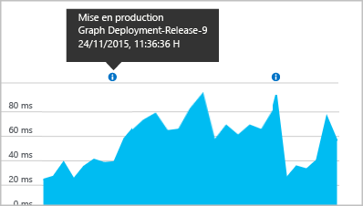

# <a name="separating-telemetry-from-development-test-and-production"></a>Séparation des télémétries de développement, de test et de production

Lorsque vous développez la prochaine version d’une application web, vous ne souhaitez pas mélanger les télémétries [Application Insights](app-insights-overview.md) de la nouvelle version et de la version déjà publiée. Pour éviter toute confusion, envoyez la télémétrie des différentes phases de développement à des ressources Application Insights séparées, avec des clés d’instrumentation (ikeys) distinctes. Pour faciliter la modification de la clé d’instrumentation à mesure qu’une version passe d’une étape à l’autre, il peut être utile de définir l’ikey dans le code plutôt que dans le fichier de configuration. 

(Si votre système est un service cloud Azure, il existe [une autre méthode pour configurer des iKeys distinctes](app-insights-cloudservices.md).)

## <a name="about-resources-and-instrumentation-keys"></a>À propos des ressources et des clés d’instrumentation

Lorsque vous définissez un suivi Application Insights pour votre application web, vous créez une *ressource* Application Insights dans Microsoft Azure. Vous ouvrez cette ressource dans le portail Azure pour afficher et analyser la télémétrie recueillie à partir de votre application. Chaque ressource est identifiée par une *clé d’instrumentation* (iKey). Lorsque vous installez le package Application Insights pour surveiller votre application, vous le configurez avec la clé d’instrumentation afin qu’il sache où envoyer la télémétrie.

En général, vous choisissez d’utiliser des ressources séparées ou une ressource partagée unique dans différents scénarios :

* Applications différentes, indépendantes : utilisez une ressource et une ikey séparées pour chaque application.
* Plusieurs composants ou rôles d’une application métier : utilisez une [ressource partagée unique](app-insights-monitor-multi-role-apps.md) pour toutes les applications de composant. La télémétrie peut être filtrée ou segmentée par la propriété cloud_RoleName.
* Développement, test et publication : utilisez une ressource et une ikey séparées pour les versions du système en « tampon » ou phase de production.
* Test A | B : utilisez une seule ressource. Créez un TelemetryInitializer pour ajouter une propriété à la télémétrie, qui identifie les variantes.


## <a name="dynamic-ikey"></a> Clé d'instrumentation dynamique

Pour faciliter la modification de l’ikey à mesure que le code se déplace entre les phases de production, définissez-la dans le code plutôt que dans le fichier de configuration.

Définissez la clé dans une méthode d'initialisation, par exemple global.aspx.cs dans un service ASP.NET :

*C#*

    protected void Application_Start()
    {
      Microsoft.ApplicationInsights.Extensibility.
        TelemetryConfiguration.Active.InstrumentationKey = 
          // - for example -
          WebConfigurationManager.AppSettings["ikey"];
      ...

Dans cet exemple, les ikeys des différentes ressources sont placées dans différentes versions du fichier de configuration web. Le remplacement du fichier de configuration web, que vous pouvez effectuer dans le cadre du script de lancement, remplacera la ressource cible.

### <a name="web-pages"></a>Pages web
L'iKey est également utilisée dans les pages web de votre application, dans le [script que vous avez obtenu à partir du panneau de démarrage rapide](app-insights-javascript.md). Au lieu de la coder littéralement dans le script, vous devez la générer à partir de l'état du serveur. Par exemple, dans une application ASP.NET :

*JavaScript dans Razor*

    <script type="text/javascript">
    // Standard Application Insights web page script:
    var appInsights = window.appInsights || function(config){ ...
    // Modify this part:
    }({instrumentationKey:  
      // Generate from server property:
      "@Microsoft.ApplicationInsights.Extensibility.
         TelemetryConfiguration.Active.InstrumentationKey"
    }) // ...


## <a name="create-additional-application-insights-resources"></a>Créer des ressource Application Insights supplémentaires
Pour séparer la télémétrie de différents composants d’applications ou de différents tampons (développement/test/production) du même composant, vous devez créer une ressource Application Insights.

Dans le portail [portal.azure.com](https://portal.azure.com), ajoutez une ressource Application Insights :


* **type d’application** définit le contenu du panneau de présentation et les propriétés disponibles dans [Metrics Explorer](app-insights-metrics-explorer.md)Microsoft Azure. Si vous ne voyez pas votre type d’application, choisissez un des types web pour les pages web.
* **Groupe de ressources** facilite la gestion des propriétés telles que le [contrôle d’accès](app-insights-resources-roles-access-control.md). Vous pouvez utiliser des groupes de ressources distincts pour le développement, le test et la production.
* **Abonnement** est votre compte de paiement dans Azure.
* **Emplacement** correspond à l’endroit où nous conservons vos données. Actuellement, il n’est pas possible de le modifier. 
* **Ajouter au tableau de bord** place une vignette d’accès rapide à votre ressource sur votre page d’accueil Azure. 

La création de la ressource prend quelques secondes. Une alerte vous prévient lorsque l’opération est terminée.

(Vous pouvez écrire un [script PowerShell](app-insights-powershell-script-create-resource.md) pour créer automatiquement une ressource.)

### <a name="getting-the-instrumentation-key"></a>Récupération de la clé d’instrumentation
La clé d'instrumentation identifie la ressource que vous avez créée. 


Vous avez besoin des clés d’instrumentation de toutes les ressources auxquelles votre application envoie des données.

## <a name="filter-on-build-number"></a>Filtrer sur le numéro de build
Quand vous publiez une nouvelle version de votre application, vous voulez pouvoir distinguer la télémétrie des différentes builds.

Vous pouvez définir la propriété Version de l’application pour filtrer les résultats de [recherche](app-insights-diagnostic-search.md) et de [Metrics Explorer](app-insights-metrics-explorer.md).


Il existe plusieurs méthodes de définition de la propriété Version de l’application.

* Définissez directement :

    `telemetryClient.Context.Component.Version = typeof(MyProject.MyClass).Assembly.GetName().Version;`
* Encapsulez cette ligne dans un [initialiseur de télémétrie](app-insights-api-custom-events-metrics.md#defaults) pour vous assurer que toutes les instances de TelemetryClient sont définies de manière cohérente.
* [ASP.NET] Définissez la version dans `BuildInfo.config`. Le module web sélectionnera la version dans le nœud BuildLabel. Incluez ce fichier dans votre projet et n’oubliez pas de définir la propriété Toujours copier dans l’Explorateur de solutions.

    ```XML

    <?xml version="1.0" encoding="utf-8"?>
    <DeploymentEvent xmlns:xsi="http://www.w3.org/2001/XMLSchema-instance" xmlns:xsd="http://www.w3.org/2001/XMLSchema" xmlns="http://schemas.microsoft.com/VisualStudio/DeploymentEvent/2013/06">
      <ProjectName>AppVersionExpt</ProjectName>
      <Build type="MSBuild">
        <MSBuild>
          <BuildLabel kind="label">1.0.0.2</BuildLabel>
        </MSBuild>
      </Build>
    </DeploymentEvent>

    ```
* [ASP.NET] Générez automatiquement BuildInfo.config dans MSBuild. Pour ce faire, ajoutez quelques lignes à votre fichier `.csproj` :

    ```XML

    <PropertyGroup>
      <GenerateBuildInfoConfigFile>true</GenerateBuildInfoConfigFile>    <IncludeServerNameInBuildInfo>true</IncludeServerNameInBuildInfo>
    </PropertyGroup>
    ```

    Cela génère un fichier appelé *Votre_nom_de_projet*.BuildInfo.config. Le processus de publication le renomme en BuildInfo.config.

    L’étiquette de build contient un espace réservé (AutoGen_...) quand vous effectuez la génération avec Visual Studio. Mais quand vous utilisez MSBuild, l’espace réservé est remplacé par le numéro de version correct.

    Pour permettre à MSBuild de générer des numéros de version, définissez la version comme `1.0.*` dans AssemblyReference.cs

## <a name="version-and-release-tracking"></a>Suivi de la version
Pour vérifier la version de l’application, assurez-vous que `buildinfo.config` est généré par votre processus Microsoft Build Engine. Dans votre fichier .csproj, ajoutez :  

```XML

    <PropertyGroup>
      <GenerateBuildInfoConfigFile>true</GenerateBuildInfoConfigFile>    <IncludeServerNameInBuildInfo>true</IncludeServerNameInBuildInfo>
    </PropertyGroup>
```

Quand il détient les informations de version, le module web Application Insights ajoute automatiquement la **version de l’application** en tant que propriété à chaque élément de télémétrie. Cela vous permet de filtrer par version lorsque vous effectuez des [recherches de diagnostic](app-insights-diagnostic-search.md) ou que vous [explorez les métriques](app-insights-metrics-explorer.md).

Toutefois, notez que le numéro de version de build est uniquement généré par Microsoft Build Engine, et non par la build de développement dans Visual Studio.

### <a name="release-annotations"></a>Annotations de version
Si vous utilisez Visual Studio Team Services, vous pouvez [obtenir un marqueur d’annotation](app-insights-annotations.md) ajouté à vos graphiques lorsque vous publiez une nouvelle version. L’illustration suivante montre l’aspect de ce marqueur.


## <a name="next-steps"></a>Étapes suivantes

* [Ressources partagées pour plusieurs rôles](app-insights-monitor-multi-role-apps.md)
* [Créer un initialiseur de télémétrie pour distinguer des variantes A|B](app-insights-api-filtering-sampling.md#add-properties)
