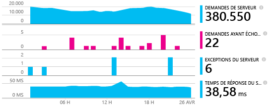
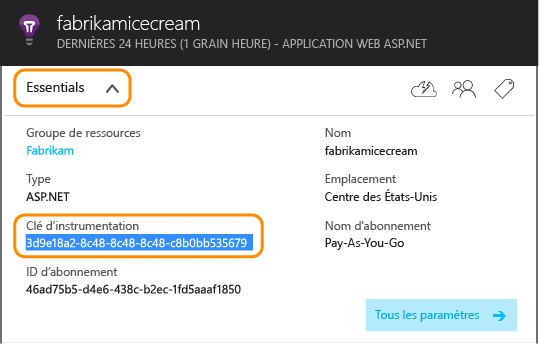
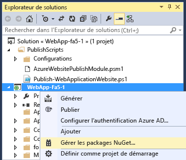
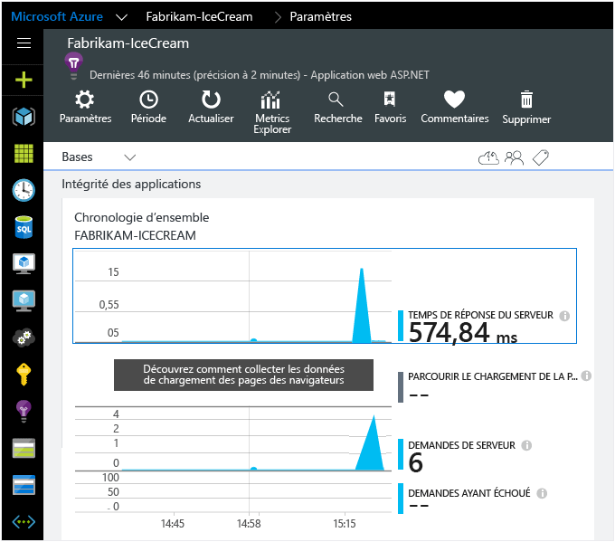
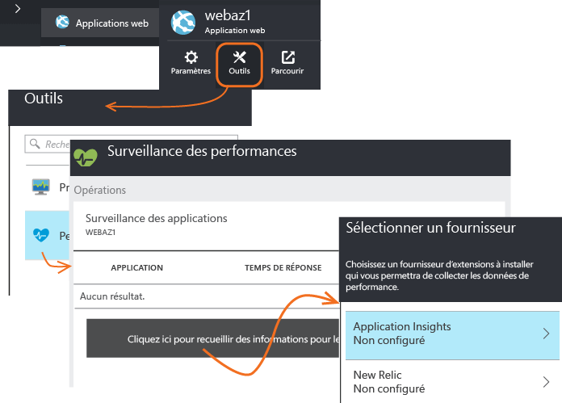
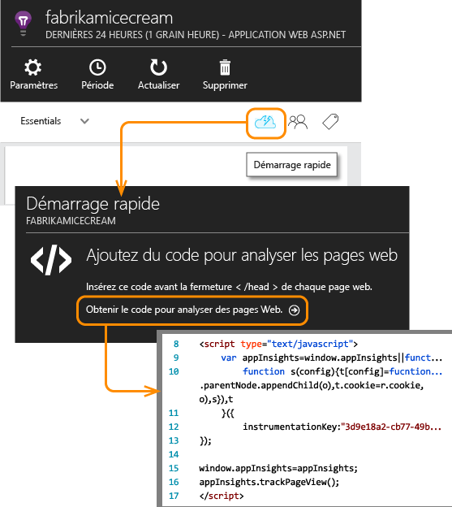

<properties 
	pageTitle="Ajout du Kit de développement logiciel (SDK) Application Insights à votre application ASP.NET" 
	description="Analysez l'utilisation, la disponibilité et les performances de votre application web locale ou Microsoft Azure avec Application Insights." 
	services="application-insights" 
    documentationCenter=".net"
	authors="alancameronwills" 
	manager="douge"/>

<tags 
	ms.service="application-insights" 
	ms.workload="tbd" 
	ms.tgt_pltfrm="ibiza" 
	ms.devlang="na" 
	ms.topic="article" 
	ms.date="07/08/2015" 
	ms.author="awills"/>

# Ajout du Kit de développement logiciel (SDK) Application Insights à votre application ASP.NET

*Application Insights est à l'état de version préliminaire.*

[AZURE.INCLUDE [app-insights-selector-get-started](../../includes/app-insights-selector-get-started.md)]

Visual Studio Application Insights surveille vos applications en direct pour vous aider à [détecter et diagnostiquer les problèmes de performances et les exceptions][detect], mais aussi [découvrir comment votre application est utilisée][knowUsers]. Il peut être utilisé avec de nombreux types d’application. Il fonctionne pour les applications hébergées sur vos propres serveurs locaux IIS ou sur les machines virtuelles Azure, ainsi que les applications Web Azure. ([Les applications pour appareils et les serveurs Java sont aussi compris][start].)

Pour de nombreux types d'application, [Visual Studio peut ajouter Application Insights à votre application](#ide) sans que vous remarquiez quoi que ce soit. Mais puisque vous lisez ceci pour mieux comprendre ce que cet ajout entraîne, nous vous proposons de suivre cette procédure, étape par étape.

#### Avant de commencer

Ce dont vous avez besoin :

* Un abonnement à [Microsoft Azure](http://azure.com). Si votre équipe ou votre organisation dispose d’un abonnement Azure, le propriétaire peut vous y ajouter à l’aide de votre [compte Microsoft](http://live.com).
* Visual Studio 2013 ou une version ultérieure.

##  1. Création d’une ressource Application Insights dans Azure

Connectez-vous au [portail Azure][portal] et créez une ressource Application Insights. Choisissez le type d’application ASP.NET.

Dans Azure, une [ressource][roles] correspond à l’instance d'un service. Cette ressource correspond à l’emplacement où les données de télémétrie de votre application sont analysées avant de vous être présentées.

Le choix du type d’application définit le contenu par défaut des panneaux de ressource et les propriétés visibles dans [Metrics Explorer][metrics].

####  Copiez la clé d'instrumentation.

La clé identifie la ressource. Vous allez bientôt l’installer dans le Kit de développement logiciel (SDK) pour diriger les données vers la ressource.

##  2. Installation du Kit de développement logiciel (SDK) dans votre application

1. Dans Visual Studio, modifiez les packages NuGet de votre projet d’application de bureau.

    

2. Installez le Kit de développement logiciel (SDK) Application Insights pour Web Apps.

    

3. Modifiez ApplicationInsights.config (qui a été ajouté par l'installation NuGet). Insérez ceci juste avant la balise de fermeture :

    `<InstrumentationKey>` *clé d’instrumentation que vous avez copiée* `</InstrumentationKey>`

    (Vous pouvez également [définir la clé avec du code][apikey] dans votre application.)

#### Pour passer aux versions ultérieures du Kit de développement logiciel (SDK)

Pour passer à la [nouvelle version du Kit de développement logiciel (SDK)](app-insights-release-notes-dotnet.md), ouvrez une nouvelle fois le gestionnaire de package NuGet et filtrez les packages qui ont été installés. Sélectionnez Microsoft.ApplicationInsights.Web et choisissez Mettre à niveau.

Si vous avez apporté des personnalisations à ApplicationInsights.config, conservez-en une copie avant d’effectuer la mise à niveau et fusionnez ensuite vos modifications dans la nouvelle version.

##  3. Exécution de votre projet

Exécutez votre application à l'aide de la touche F5 et essayez-la : ouvrez différentes pages pour générer des données de télémétrie.

Un décompte des événements envoyés s'affiche dans Visual Studio.

##  4. Affichage de vos données de télémétrie

Revenez au [portail Azure][portal] et accédez à vos ressources Application Insights.

Recherchez des données dans les graphiques de présentation. Au début, seuls un ou deux points s'affichent. Par exemple :

Cliquez sur un des graphiques pour afficher des métriques plus détaillées. [En savoir plus sur les métriques.][perf]

À présent, déployez votre application et regardez les données s'accumuler.

Lorsque vous exécutez l'application en mode débogage, la télémétrie est envoyée via le pipeline, ce qui vous permet d'accéder aux données en quelques secondes. Lorsque vous déployez votre application, les données s'accumulent plus lentement.

#### Pas de données ?

* Ouvrez la vignette [Rechercher][diagnostic] pour afficher les événements individuels.
* Utilisez l'application en ouvrant différentes pages pour générer des données de télémétrie.
* Attendez quelques secondes, puis cliquez sur Actualiser.
* Consultez la rubrique [Résolution des problèmes][qna].

#### Vous rencontrez des problèmes sur votre serveur de builds ?

Consultez cet article de [résolution des problèmes](app-insights-troubleshoot-faq.md#NuGetBuild).

## Ajout d’un suivi des dépendances

Le Kit de développement logiciel (SDK) a besoin d'un peu d'aide pour accéder à certaines données. En particulier, vous aurez besoin de cette étape supplémentaire pour mesurer automatiquement les appels de votre application vers des bases de données, des API REST et d’autres composants externes. Ces mesures de dépendance peuvent être très utiles pour vous aider à diagnostiquer les problèmes de performances.

#### Si votre application s'exécute sur votre serveur IIS

Connectez-vous à votre serveur avec des droits d'administrateur, puis installez [Application Insights Status Monitor](http://go.microsoft.com/fwlink/?LinkId=506648).

Vous pouvez également utiliser Status Monitor pour [instrumentaliser une application déjà en cours d’exécution](app-insights-monitor-performance-live-website-now.md), même si elle n'a pas été créée avec le Kit de développement logiciel (SDK).

#### Si votre application est une application web Azure

Dans le panneau de configuration de votre application web Azure, ajoutez l’extension Application Insights.

(L’extension s’applique uniquement à une application générée avec le Kit de développement logiciel. Contrairement à Status Monitor, elle ne peut pas instrumentaliser une application existante.)

## Ajout d’une surveillance côté client

Vous avez installé le Kit de développement logiciel (SDK) qui envoie des données de télémétrie de l'extrémité serveur de votre application. Vous pouvez maintenant ajouter une surveillance côté client. Cette surveillance vous fournit des données sur les utilisateurs, les sessions, les pages consultées et les exceptions ou incidents qui se produisent dans le client.

Vous pourrez également écrire votre propre code pour suivre la façon dont les utilisateurs travaillent avec votre application, même jusqu'au niveau du nombre de clics et de frappes sur les touches.

#### Si vos clients sont des navigateurs web

Si votre application affiche des pages web, ajoutez un extrait de code JavaScript à chaque page. Récupérez le code à partir de votre ressource Application Insights :

Notez que le code contient la clé d’instrumentation qui identifie la ressource de votre application.

[En savoir plus sur le suivi de page web.](app-insights-web-track-usage.md)

#### Si vos clients sont des applications pour appareil

Si votre application sert des clients tels que des téléphones ou autres appareils, ajoutez le [Kit de développement logiciel (SDK) correspondant](app-insights-platforms.md) à votre application pour appareil.

Si vous configurez le Kit de développement logiciel (SDK) client avec la même clé d'instrumentation que le SDK serveur, les deux flux sont intégrés et apparaissent ensemble.

## Terminez l’installation

Pour obtenir une vue à 360 degrés de votre application, vous devez effectuer quelques opérations :

* [Configurez les tests web][availability] pour vous assurer que votre application est bien active.
* [Capture du suivi du journal][netlogs] dans votre infrastructure de journalisation favorite
* [Suivez des événements et des métriques personnalisés][api] dans votre client ou votre serveur ou les deux, pour en savoir plus sur la façon dont votre application est utilisée.

##  Méthode automatisée

Si vous préférez utiliser Visual Studio pour la configuration, c’est très simple.

Vous aurez besoin des éléments suivants : [Visual Studio 2013 Update 3](http://go.microsoft.com/fwlink/?linkid=397827&clcid=0x409) (ou une version plus récente) ainsi qu'un compte [Microsoft Azure](http://azure.com).

#### S'il s'agit d'un nouveau projet...

Lorsque vous créez un projet dans Visual Studio, assurez-vous que Application Insights est sélectionné.

Visual Studio crée une ressource dans Application Insights, ajoute le Kit de développement logiciel (SDK) à votre projet et place la clé dans le fichier `.config`.

Si votre projet a des pages web, Visual Studio ajoute également le [Kit de développement logiciel (SDK) JavaScript][client] à la page web principale.

#### ... ou s'il s'agit d'un projet existant

Cliquez avec le bouton droit de la souris sur le projet dans l'Explorateur de solutions, puis sélectionnez Ajouter Application Insights.

Visual Studio crée une ressource dans Application Insights, ajoute le Kit de développement logiciel (SDK) à votre projet et place la clé dans le fichier `.config`.

Dans ce cas, il n'ajoute pas le [Kit de développement logiciel (SDK) JavaScript][client] à vos pages web : nous vous recommandons de le faire lors de l'étape suivante.

#### Options d'installation

S'il s'agit de votre toute première utilisation, vous êtes invité à vous connecter ou à vous inscrire à la version préliminaire de Microsoft Azure. (indépendamment de votre compte Visual Studio Online).

Si cette application fait partie d'une application plus importante, vous pouvez utiliser **Configurer les paramètres** pour la placer dans le même groupe de ressources que les autres composants.

*Aucune option Application Insights n'est disponible ? Vérifiez que vous utilisez Visual Studio 2013 Update 3 ou une version ultérieure, que les outils Application Insights sont activés dans Extensions et mises à jour, et que vous êtes en train de créer un projet web.*

#### Ouvrez Application Insights à partir de votre projet.

## Vidéo

> [AZURE.VIDEO getting-started-with-application-insights]

<!--Link references-->

[api]: app-insights-api-custom-events-metrics.md
[apikey]: app-insights-api-custom-events-metrics.md#ikey
[availability]: app-insights-monitor-web-app-availability.md
[azure]: ../insights-perf-analytics.md
[client]: app-insights-javascript.md
[detect]: app-insights-detect-triage-diagnose.md
[diagnostic]: app-insights-diagnostic-search.md
[knowUsers]: app-insights-overview-usage.md
[metrics]: app-insights-metrics-explorer.md
[netlogs]: app-insights-asp-net-trace-logs.md
[perf]: app-insights-web-monitor-performance.md
[portal]: http://portal.azure.com/
[qna]: app-insights-troubleshoot-faq.md
[redfield]: app-insights-monitor-performance-live-website-now.md
[roles]: app-insights-resources-roles-access-control.md
[start]: app-insights-get-started.md

 

<!---HONumber=July15_HO5-->