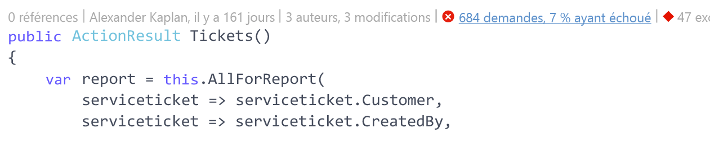
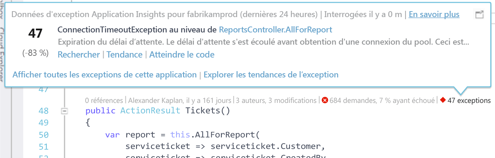
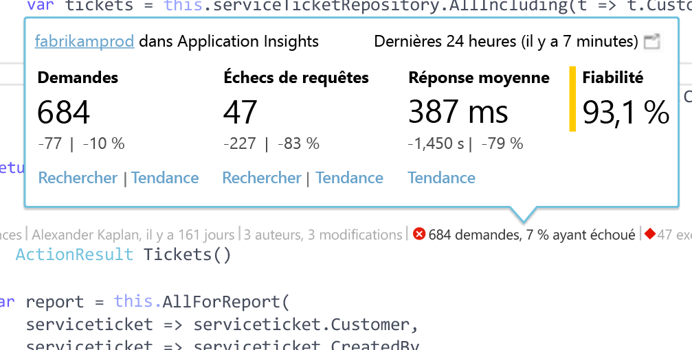

# Données de télémétrie Application Insights dans Visual Studio CodeLens
Les méthodes indiquées dans le code de votre application web peuvent être annotées avec des données de télémétrie sur les exceptions runtime et les temps de réponse des requêtes. Si vous installez [Azure Application Insights](app-insights-overview.md) dans votre application, les données de télémétrie s’affichent dans Visual Studio [CodeLens](https://msdn.microsoft.com/library/dn269218.aspx) ; il s’agit des notes en haut de chaque fonction où vous avez l’habitude de voir des informations utiles telles que le nombre d’emplacements dans lesquels la fonction est référencée ou la dernière personne à l’avoir modifiée.

> [!NOTE]
> Application Insights CodeLens est disponible dans Visual Studio 2015 Update 3 et ultérieur, ou avec la dernière version de [l’extension Developer Analytics Tools](https://visualstudiogallery.msdn.microsoft.com/82367b81-3f97-4de1-bbf1-eaf52ddc635a). CodeLens est disponible dans les éditions Enterprise et Professional de Visual Studio.
> 
> 

## Où trouver les données Application Insights
Recherchez les données de télémétrie Application Insights dans les indicateurs CodeLens des méthodes de requête publiques de votre application web. Les indicateurs CodeLens sont affichés au-dessus des déclarations de méthode et des autres déclarations en C# et Visual Basic. Si des données Application Insights sont disponibles pour une méthode, des indicateurs s’affichent pour les requêtes et les exceptions, par exemple « 100 requêtes, 1 % en échec » ou « 10 exceptions ». Cliquez sur un indicateur CodeLens pour en savoir plus. 

> [!TIP]
> Le chargement des indicateurs de requêtes et d’exceptions Application Insights peut prendre quelques secondes supplémentaires après l’affichage des autres indicateurs CodeLens.
> 
> 

## Exceptions dans CodeLens

L’indicateur CodeLens d’exceptions indique le nombre d’exceptions qui se sont produites au cours des dernières 24 heures parmi les 15 exceptions qui se sont produites le plus fréquemment dans votre application au cours de cette période, lors du traitement de la requête prise en charge par la méthode.

Pour plus d’informations, cliquez sur l’indicateur CodeLens d’exceptions :

* Modification en pourcentage du nombre d’exceptions qui se sont produites au cours des dernières 24 heures par rapport aux 24 heures précédentes.
* Choisissez **Accéder au code** pour atteindre le code source de la fonction levant l’exception.
* Choisissez **Rechercher** pour interroger toutes les instances de cette exception qui se sont produites au cours des dernières 24 heures.
* Choisissez **Tendance** pour afficher une visualisation de la tendance des occurrences de cette exception au cours des dernières 24 heures.
* Choisissez **Afficher toutes les exceptions de cette application** pour interroger toutes les exceptions qui se sont produites au cours des dernières 24 heures.
* Choisissez **Explorer les tendances de l’exception** pour afficher une visualisation de la tendance de toutes les exceptions qui se sont produites au cours des dernières 24 heures. 

> [!TIP]
> Si le message « 0 exception » s’affiche dans CodeLens alors que vous savez que des exceptions se sont produites, assurez-vous que la ressource Application Insights appropriée est sélectionnée dans CodeLens. Pour sélectionner une autre ressource, cliquez avec le bouton droit sur votre projet dans l’Explorateur de solutions, puis choisissez **Application Insights > Choisir la source de télémétrie**. CodeLens est affiché uniquement pour les 15 exceptions s’étant produites le plus souvent dans votre application au cours des dernières 24 heures ; si une exception est à la 16e place des exceptions se produisant le plus souvent, le message « 0 exception » s’affiche. Les exceptions des vues ASP.NET peuvent ne pas s’afficher dans les méthodes de contrôleur qui ont généré ces vues.
> 
> [!TIP]
> Si le message « ? exceptions » s’affiche dans CodeLens, vous devez associer votre compte Azure à Visual Studio, faute de quoi les informations d’identification de votre compte Azure risquent d’arriver à expiration. Dans ce cas, cliquez sur « ? exceptions » et choisissez **Ajouter un compte...** pour entrer vos informations d’identification.
> 
> 

## Requêtes dans CodeLens

L’indicateur CodeLens de requêtes indique le nombre de requêtes HTTP qui ont été traitées par une méthode au cours des dernières 24 heures, ainsi que le pourcentage de ces requêtes en échec.

Pour plus d’informations, cliquez sur l’indicateur CodeLens de requêtes :

* Modifications absolue et en pourcentage du nombre de requêtes, requêtes en échec et moyenne des temps de réponse au cours des dernières 24 heures par rapport aux 24 heures précédentes.
* Fiabilité de la méthode, calculée sous forme du pourcentage de requêtes n’ayant pas échoué au cours des dernières 24 heures.
* Choisissez **Rechercher** des requêtes ou des requêtes en échec pour interroger toutes les requêtes (en échec) qui se sont produites au cours des dernières 24 heures.
* Choisissez **Tendance** pour afficher une visualisation de la tendance des requêtes, des requêtes en échec ou de la moyenne des temps de réponse au cours des dernières 24 heures.
* Choisissez le nom de la ressource Application Insights dans le coin supérieur gauche du mode Détails de CodeLens pour modifier la ressource qui est source de données CodeLens.

## Étapes suivantes
|  |  |
| --- | --- |
| **[Utilisation d’Application Insights dans Visual Studio](app-insights-visual-studio.md)** Rechercher les données de télémétrie, voir les données dans CodeLens et configurer Application Insights. le tout dans Visual Studio. | |
| **[Ajouter des données](app-insights-asp-net-more.md)** Analysez l’utilisation, la disponibilité, les dépendances et les exceptions. Intégrer des traces à partir des frameworks de journalisation. Écrire des données de télémétrie personnalisées. | |
| **[Utilisation du portail Application Insights](app-insights-dashboards.md)** Tableaux de bord, puissants outils de diagnostic et d’analyse, alertes, mappage direct des dépendances de votre application et exportation des données de télémétrie. | |

