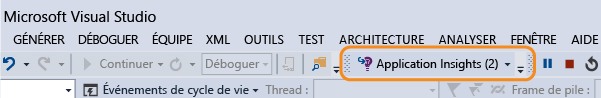
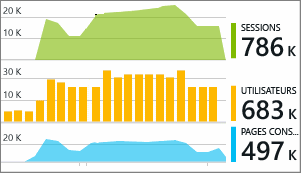

# Utilisation d’Application Insights dans Visual Studio
Visual Studio 2015 (et versions ultérieures) vous permet d’analyser les performances et de diagnostiquer les problèmes aussi bien en phase de débogage qu’en production, à l’aide des données de télémétrie de [Visual Studio Application Insights](app-insights-overview.md).

Si vous ne l’avez pas encore fait, [installez Application Insights dans votre application](app-insights-asp-net.md).

##  Débogage de votre projet
Exécutez votre application à l'aide de la touche F5 et essayez-la : ouvrez différentes pages pour générer des données de télémétrie.

Un décompte des événements consignés s’affiche dans Visual Studio.

Cliquez sur ce bouton pour ouvrir la recherche de diagnostic. 

## Recherche de diagnostic
La fenêtre de recherche présente les événements qui ont été consignés. (Si vous étiez connecté à Azure au moment de l’installation d’Application Insights, vous pouvez rechercher ces mêmes événements dans le portail.)

La recherche en texte libre fonctionne sur tous les champs des événements. Par exemple, vous pouvez effectuer une recherche sur une partie de l’URL d’une page, sur la valeur d’une propriété telle que la ville du client, ou encore sur des termes spécifiques contenus dans un journal de suivi.

Cliquez sur n’importe quel événement pour afficher le détail de ses propriétés.

Vous pouvez également ouvrir l’onglet Éléments connexes pour aider à repérer les demandes ayant échoué ou les exceptions.

## Concentrateur de diagnostic
Le concentrateur de diagnostic (Visual Studio 2015 ou version ultérieure) affiche les données de télémétrie du serveur Application Insights au moment où elles sont générées. Il fonctionne même si vous avez choisi d’installer le SDK sans le connecter à une ressource dans le portail Azure.

## Exceptions
Si vous avez [configuré l’analyse des exceptions](app-insights-asp-net-exceptions.md), les rapports d’exception s’afficheront dans la fenêtre de recherche. 

Cliquez sur une exception pour obtenir une trace de pile. Si le code de l’application est ouvert dans Visual Studio, vous pouvez utiliser la trace de pile pour accéder à la ligne de code recherchée.

En outre, le nombre d’exceptions enregistrées par Application Insights dans les dernières 24 heures est indiqué dans la ligne de filtre Code au-dessus de chaque méthode.

## Surveillance locale
(À partir de Visual Studio 2015 Mise à jour 2) Si vous n’avez pas configuré le Kit de développement logiciel pour envoyer les données de télémétrie au portail Application Insights (et qu’il n’existe donc aucune clé d’instrumentation dans ApplicationInsights.config), la fenêtre de diagnostic affichera les données de télémétrie de votre dernière session de débogage. 

C’est le comportement adéquat si vous avez déjà publié une version antérieure de votre application. Vous ne voulez pas que les données de télémétrie de vos sessions de débogage soient confondues avec les données de télémétrie sur le portail Application Insights de l’application publiée.

Cela est également utile si vous disposez de [données de télémétrie personnalisées](app-insights-api-custom-events-metrics.md) que vous souhaitez déboguer avant de les envoyer sur le portail.

* *Dans un premier temps, j’ai entièrement configuré Application Insights pour envoyer des données de télémétrie au portail. À présent, j’aimerais afficher ces données uniquement dans Visual Studio.*
  
  * Dans les paramètres de la fenêtre de recherche, il existe une option permettant de rechercher des diagnostics locaux même si votre application envoie des données de télémétrie au portail.
  * Pour arrêter l’envoi de données de télémétrie au portail, commentez la ligne `<instrumentationkey>...` du fichier ApplicationInsights.config. Lorsque vous êtes prêt à envoyer de nouveau les données de télémétrie au portail, supprimez les commentaires.

## Trends
Trends est un outil permettant de visualiser le comportement de votre application au fil du temps. 

Sélectionnez **Explorer les tendances de la télémétrie** à partir du bouton de la barre d’outils Application Insights ou de la fenêtre de recherche d’Application Insights. Sélectionnez l’une des cinq requêtes courantes pour commencer. Vous pouvez analyser différents jeux de données en fonction des types de télémétrie, des intervalles de temps ainsi que d’autres propriétés. 

Pour rechercher des anomalies dans vos données, sélectionnez l’une des options d’anomalie dans la liste déroulante « Type de vue ». Les options de filtrage en bas de la fenêtre facilitent l’obtention de sous-ensembles spécifiques de votre télémétrie.

[En savoir plus sur Tendances](app-insights-visual-studio-trends.md).

## Et ensuite ?
|  |  |
| --- | --- |
| **[Ajouter des données](app-insights-asp-net-more.md)** Analysez l’utilisation, la disponibilité, les dépendances et les exceptions. Intégrer des traces à partir des frameworks de journalisation. Écrire des données de télémétrie personnalisées. | |
| **[Utilisation du portail Application Insights](app-insights-dashboards.md)** Tableaux de bord, puissants outils de diagnostic et d’analyse, alertes, mappage direct des dépendances de votre application et exportation des données de télémétrie. | |

<!--HONumber=Nov16_HO2-->

