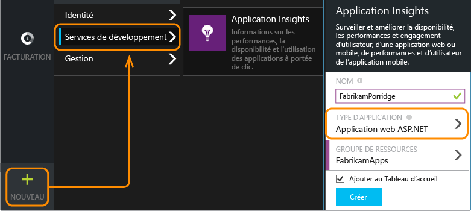
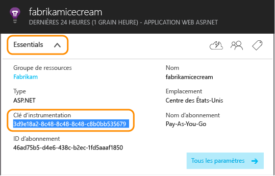
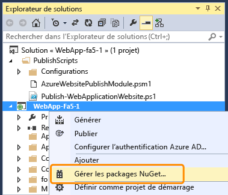
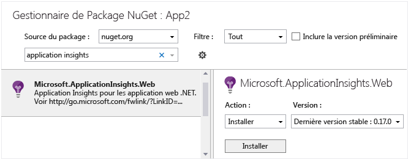
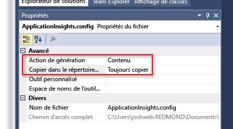
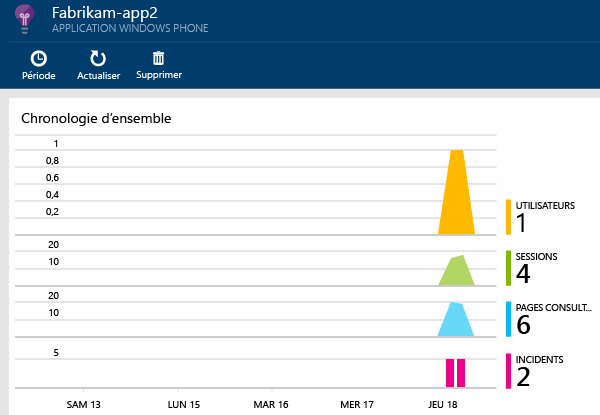
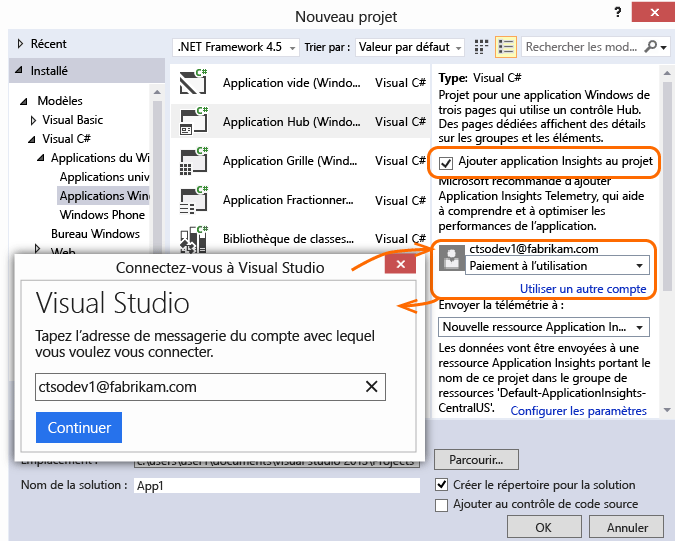
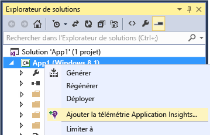

<properties 
	pageTitle="Application Insights pour Windows Phone et les applications du Windows Store" 
	description="Analysez l'utilisation et les performances de votre application pour appareil Windows avec Application Insights." 
	services="application-insights" 
    documentationCenter="windows"
	authors="alancameronwills" 
	manager="douge"/>

<tags 
	ms.service="application-insights" 
	ms.workload="tbd" 
	ms.tgt_pltfrm="ibiza" 
	ms.devlang="na" 
	ms.topic="get-started-article" 
	ms.date="06/16/2015" 
	ms.author="awills"/>

# Application Insights pour Windows Phone et les applications du Windows Store

*Application Insights est à l'état de version préliminaire.*

[AZURE.INCLUDE [app-insights-selector-get-started](../../includes/app-insights-selector-get-started.md)]

Visual Studio Application Insights vous permet d'analyser les points suivants de vos applications publiées :

* [**Utilisation**][windowsUsage] : découvrez le nombre de vos utilisateurs et ce qu'ils font avec votre application.
* [**Incidents**][windowsCrash] : récupérez des rapports de diagnostics des incidents et comprenez leur impact sur les utilisateurs.


Pour de nombreux types d'application, [Visual Studio peut ajouter Application Insights à votre application](#ide) sans que vous remarquiez quoi que ce soit. Mais puisque vous lisez ceci pour mieux comprendre ce que cet ajout entraîne, nous vous proposons de suivre cette procédure, étape par étape.

Vous devez avoir :

* Un abonnement à [Microsoft Azure][azure].
* Visual Studio 2013 ou une version ultérieure.

## 1\. Création d’une ressource Application Insights dans Azure 

Dans le [portail Azure][portal], créez une ressource Application Insights.



Dans Azure, une [ressource][roles] correspond à l’instance d'un service. Cette ressource correspond à l’emplacement où les données de télémétrie de votre application sont analysées avant de vous être présentées.

#### Copie de la clé d'instrumentation

Cette clé identifie la ressource. Vous en aurez besoin rapidement, pour configurer le Kit de développement logiciel (SDK) pour envoyer les données à la ressource.




## 2\. Ajout du Kit de développement logiciel (SDK) Application Insights à votre application

Dans Visual Studio, ajoutez le Kit de développement logiciel (SDK) approprié à votre projet.

S’il s’agit d’une application Windows Universal, répétez les étapes pour le projet Windows Phone et le projet Windows.

1. Cliquez avec le bouton droit sur le projet dans l'Explorateur de solutions, puis sélectionnez **Gérer les packages NuGet**.

    

2. Recherchez "Application Insights".

    

3. Sélectionnez **Application Insights pour les applications Windows**.

4. Ajoutez un fichier ApplicationInsights.config à la racine de votre projet et insérez la clé d’instrumentation copiée à partir du portail. Un exemple xml de ce fichier de configuration est présenté ci-dessous.

	```xml
		<?xml version="1.0" encoding="utf-8" ?>
		<ApplicationInsights>
			<InstrumentationKey>YOUR COPIED INSTRUMENTATION KEY</InstrumentationKey>
		</ApplicationInsights>
	```

    Définissez les propriétés du fichier ApplicationInsights.config : **Action de génération** == **Contenu** et **Copier dans le répertoire de sortie** == **Toujours copier**.
	
	

5. Ajoutez le code d’initialisation suivant. Il est préférable d’ajouter ce code au constructeur `App()`. Si vous le faites ailleurs, vous risquez de manquer la collecte automatique des premières pageviews.

```C#
	public App()
	{
	   // Add this initilization line. 
	   WindowsAppInitializer.InitializeAsync();
	
	   this.InitializeComponent();
	   this.Suspending += OnSuspending;
	}  
```

**Applications Windows universelles** : répétez les étapes pour les projets Windows Phone et Windows Store. [Exemple d’application universelle Windows 8.1](https://github.com/Microsoft/ApplicationInsights-Home/tree/master/Samples/Windows%208.1%20Universal).

## <a name="network"></a>3. Activation de l'accès réseau pour votre application

Si votre application n’a pas déjà [demandé un accès réseau sortant](https://msdn.microsoft.com/library/windows/apps/hh452752.aspx), vous devez ajouter ceci à son manifeste en tant que [capacité requise](https://msdn.microsoft.com/library/windows/apps/br211477.aspx).

## <a name="run"></a>4. Exécution de votre projet

[Exécutez votre application en appuyant sur F5](http://msdn.microsoft.com/library/windows/apps/bg161304.aspx) et utilisez-la pour générer des données de télémétrie.

Un décompte des événements qui ont été reçus s'affiche dans Visual Studio.


En mode débogage, les données de télémétrie sont envoyées dès qu'elles sont générées. En mode version finale, les données de télémétrie sont stockées sur le périphérique et envoyées uniquement lors de la reprise de l'application.


## <a name="monitor"></a>5. Affichage des données surveillées

Ouvrez Application Insights à partir de votre projet.


Au début, seuls un ou deux points s'affichent. Par exemple :



Après quelques secondes, cliquez sur Actualiser pour obtenir des données supplémentaires.

Cliquez sur n'importe quel graphique pour afficher plus de détails.


## <a name="deploy"></a>5. Publication de votre application dans Windows Store

[Publiez votre application](http://dev.windows.com/publish) et observez les données s'accumuler lorsque les utilisateurs la téléchargent et l'utilisent.

## Personnalisation de votre télémétrie

#### Sélection des collecteurs

Le SDK Application Insights inclut plusieurs collecteurs, qui recueillent automatiquement différents types de données à partir de votre application. Par défaut, ils sont tous actifs. Mais vous pouvez choisir les collecteurs à initialiser dans le constructeur de l’application :

    WindowsAppInitializer.InitializeAsync( "00000000-0000-0000-0000-000000000000",
       WindowsCollectors.Metadata
       | WindowsCollectors.PageView
       | WindowsCollectors.Session 
       | WindowsCollectors.UnhandledException);

#### Envoi de votre propre télémétrie

Utilisez l’[API][api] pour envoyer des événements, des métriques et des données de diagnostic à Application Insights. En résumé :

```C#

 var tc = new TelemetryClient(); // Call once per thread

 // Send a user action or goal:
 tc.TrackEvent("Win Game");

 // Send a metric:
 tc.TrackMetric("Queue Length", q.Length);

 // Provide properties by which you can filter events:
 var properties = new Dictionary{"game", game.Name};

 // Provide metrics associated with an event:
 var measurements = new Dictionary{"score", game.score};

 tc.TrackEvent("Win Game", properties, measurements);

```

Pour plus d’informations, consultez la rubrique [Événements et métriques personnalisés][api].

## Et ensuite ?

* [Détection et diagnostic des incidents touchant votre application][windowsCrash]
* [En savoir plus sur les métriques][metrics]
* [En savoir plus sur Diagnostic Search][diagnostic]


## <a name="ide"></a>Configuration automatisée

Si vous préférez utiliser Visual Studio pour effectuer les étapes de configuration, vous pouvez le faire avec Windows Phone, le Windows Store et de nombreux autres types d’application.

###<a name="new"></a> Si vous créez un nouveau projet d'application Windows...

Dans la boîte de dialogue Nouveau projet, sélectionnez Application Insights.

Si vous êtes invité à le faire, utilisez les informations d'identification de votre compte Azure (qui est distinct de votre compte Visual Studio Online).




###<a name="existing"></a> Ou s’il s’agit d’un projet existant...

Ajoutez Application Insights à partir de l'Explorateur de solutions.




## Pour mettre à niveau avec une nouvelle version du Kit de développement logiciel

Lorsqu'une [nouvelle version du Kit de développement logiciel est publiée](app-insights-release-notes-windows.md) : * cliquez avec le bouton droit de la souris sur votre projet et choisissez Gérer les packages NuGet. * Sélectionnez les packages Application Insights installés et choisissez Action : Mettre à niveau.


## <a name="usage"></a>Étapes suivantes


[Détection et diagnostic des incidents touchant votre application][windowsCrash]

[Capture et recherche des journaux de diagnostic][diagnostic]


[Suivi de l'utilisation de votre application][windowsUsage]

[Utiliser l'API pour envoyer des données de télémétrie personnalisées][api]

[Résolution des problèmes][qna]


<!--Link references-->

[api]: app-insights-api-custom-events-metrics.md
[azure]: ../insights-perf-analytics.md
[diagnostic]: app-insights-diagnostic-search.md
[metrics]: app-insights-metrics-explorer.md
[portal]: http://portal.azure.com/
[qna]: app-insights-troubleshoot-faq.md
[roles]: app-insights-resources-roles-access-control.md
[windowsCrash]: app-insights-windows-crashes.md
[windowsUsage]: app-insights-windows-usage.md

 

<!---HONumber=August15_HO6-->