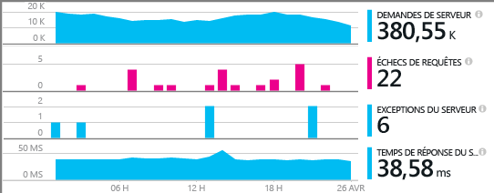
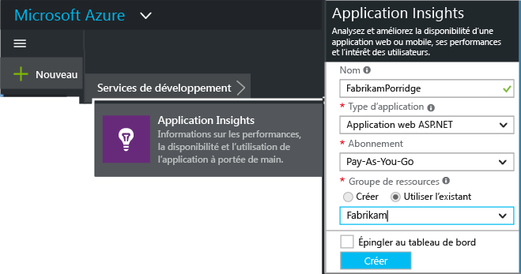
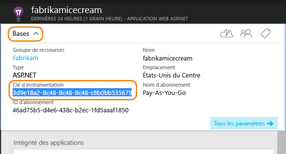
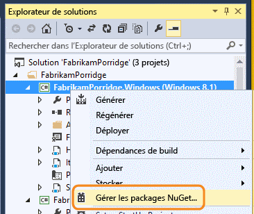
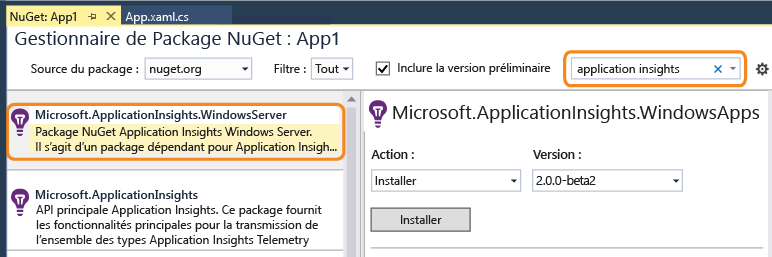
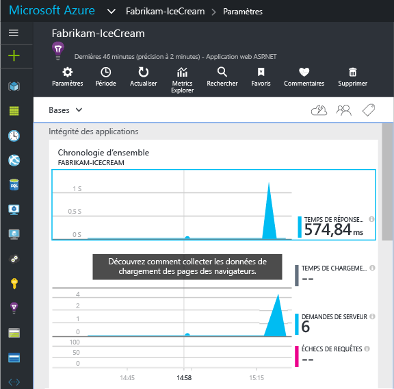
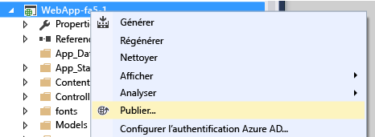

# Configurer manuellement Application Insights pour des applications ASP.NET
[Application Insights](app-insights-overview.md) est un outil extensible pour développeurs web qui vous permet de surveiller les performances et l’utilisation de votre application en direct. Vous pouvez le configurer manuellement pour surveiller les serveurs Windows, les rôles de travail et les autres applications ASP.NET. Pour les applications web, une configuration manuelle est une alternative à la [configuration automatique](app-insights-asp-net.md) proposée par Visual Studio.

#### Avant de commencer
Ce dont vous avez besoin :

* Un abonnement à [Microsoft Azure](http://azure.com). Si votre équipe ou votre organisation dispose d’un abonnement Azure, le propriétaire peut vous y ajouter à l’aide de votre [compte Microsoft](http://live.com).
* Visual Studio 2013 ou une version ultérieure.

## 1. Création d’une ressource Application Insights dans Azure
Connectez-vous au [portail Azure](https://portal.azure.com/)et créez une ressource Application Insights. Choisissez le type d'application ASP.NET.

Dans Azure, une [ressource](app-insights-resources-roles-access-control.md) correspond à l’instance d'un service. Cette ressource correspond à l’emplacement où les données de télémétrie de votre application sont analysées avant de vous être présentées.

Le choix du type d’application définit le contenu par défaut des panneaux de ressource et les propriétés visibles dans [Metrics Explorer](app-insights-metrics-explorer.md).

#### Copie de la clé d'instrumentation
La clé identifie la ressource. Vous allez bientôt l’installer dans le Kit de développement logiciel (SDK) pour diriger les données vers la ressource.

Les étapes que vous venez de suivre pour créer une nouvelle ressource sont un bon moyen de démarrer l'analyse de l’application de votre choix. Vous pouvez désormais envoyer des données vers celle-ci.

## 2. Installez le package Application Insights dans votre application
L’installation et la configuration du package d’Application Insights varient en fonction de la plateforme sur laquelle vous travaillez. Pour les applications ASP.NET, rien de plus simple.

1. Dans Visual Studio, modifiez les packages NuGet de votre projet d’application web.
   
    
2. Installez le package d’Application Insights pour les applications de serveur Windows.
   
    
   
    *Puis-je utiliser d’autres packages ?*
   
    Oui. Choisissez l’API de base (Microsoft.ApplicationInsights) si vous souhaitez uniquement utiliser l’API pour envoyer vos données de télémétrie. Le package Windows Server inclut automatiquement l'API de base ainsi qu’un certain nombre d’autres packages, tels que les packages de collecte des compteurs de performances et d’analyse de dépendance. 

#### Pour passer aux versions ultérieures du package
Nous sortons régulièrement une nouvelle version du kit de développement logiciel (SDK).

Pour passer à la [nouvelle version du package](https://github.com/Microsoft/ApplicationInsights-dotnet-server/releases/), ouvrez une nouvelle fois le gestionnaire de package NuGet et filtrez les packages qui ont été installés. Sélectionnez **Microsoft.ApplicationInsights.WindowsServer** et choisissez **Mettre à niveau**.

Si vous avez apporté des personnalisations à ApplicationInsights.config, conservez-en une copie avant d’effectuer la mise à niveau et fusionnez ensuite vos modifications dans la nouvelle version.

## 3. Envoyer des données de télémétrie
**Si vous avez installé uniquement le package de l’API de base :**

* Définissez la clé d’instrumentation dans le code, par exemple dans `main()`: 
  
    `TelemetryConfiguration.Active.InstrumentationKey = "` *votre clé* `";` 
* [Écrivez vos propres données de télémétrie à l’aide de l’API](app-insights-api-custom-events-metrics.md#ikey).

**Si vous avez installé d’autres packages Application Insights** , vous pouvez, si vous préférez, utiliser le fichier .config pour définir la clé d’instrumentation :

* Modifiez ApplicationInsights.config (qui a été ajouté par l’installation NuGet). Insérez ceci juste avant la balise de fermeture :
  
    `<InstrumentationKey>` *la clé d’instrumentation que vous avez copiée* `</InstrumentationKey>`
* Assurez-vous que les propriétés du fichier ApplicationInsights.config dans l’Explorateur de solutions sont définies sur **Build Action = Content, Copy to Output Directory = Copy**.

Ile est utile de définir la clé d’instrumentation dans le code si vous voulez [changer la clé pour différentes configurations de build](app-insights-separate-resources.md). Si vous définissez la clé dans le code, vous n’êtes pas obligé de la définir dans le fichier `.config`.

##  Exécution de votre projet
Exécutez votre application à l’aide de la touche **F5** et essayez-la : ouvrez différentes pages pour générer des données de télémétrie.

Un décompte des événements envoyés s'affiche dans Visual Studio.

##  Affichage de vos données de télémétrie
Revenez au [portail Azure](https://portal.azure.com/) et accédez à votre ressource Application Insights.

Recherchez des données dans les graphiques de présentation. Au début, seuls un ou deux points s'affichent. Par exemple :

Cliquez sur un des graphiques pour afficher des métriques plus détaillées. [En savoir plus sur les mesures.](app-insights-web-monitor-performance.md)

#### Pas de données ?
* Utilisez l'application en ouvrant différentes pages pour générer des données de télémétrie.
* Ouvrez la vignette [Rechercher](app-insights-diagnostic-search.md) pour afficher les événements individuels. Parfois, les événements mettent un peu plus de temps pour parcourir le pipeline de métriques.
* Attendez quelques secondes, puis cliquez sur **Actualiser**. Les graphiques s’actualisent à intervalles réguliers, mais vous pouvez les actualiser manuellement si vous attendez que certaines données s’affichent.
* Consultez la rubrique [Résolution des problèmes](app-insights-troubleshoot-faq.md).

## Publier votre application
À présent, déployez votre application sur votre serveur ou Azure, et regardez les données s’accumuler.

Lorsque vous exécutez l'application en mode débogage, la télémétrie est envoyée via le pipeline, ce qui vous permet d'accéder aux données en quelques secondes. Quand vous déployez votre application dans la configuration Release, les données s’accumulent plus lentement.

#### Les données n’apparaissent pas après leur publication sur votre serveur ?
Ouvrez les ports pour le trafic sortant dans le pare-feu de votre serveur. Consultez [cette page](https://docs.microsoft.com/azure/application-insights/app-insights-ip-addresses) pour obtenir la liste d’adresses requises 

#### Vous rencontrez des problèmes sur votre serveur de builds ?
Consultez cet article de [résolution des problèmes](app-insights-asp-net-troubleshoot-no-data.md#NuGetBuild).

> [!NOTE]
> Si votre application génère un volume important de télémétrie (et si vous utilisez le kit de développement logiciel ASP.NET version 2.0.0-beta3 ou ultérieure), le module d'échantillonnage adaptatiif réduit automatiquement le volume qui est envoyé vers le portail en envoyant uniquement une fraction représentative des événements. Cependant, les événements liés à la même demande seront activés ou désactivés en tant que groupe, afin que vous puissiez naviguer entre les événements connexes. 
> [En savoir plus sur l'échantillonnage](app-insights-sampling.md).
> 
> 

## Vidéo

> [!VIDEO https://channel9.msdn.com/events/Connect/2016/100/player]

## Étapes suivantes
* [Ajoutez des données de télémétrie](app-insights-asp-net-more.md) pour obtenir une vue à 360 degrés de votre application.

