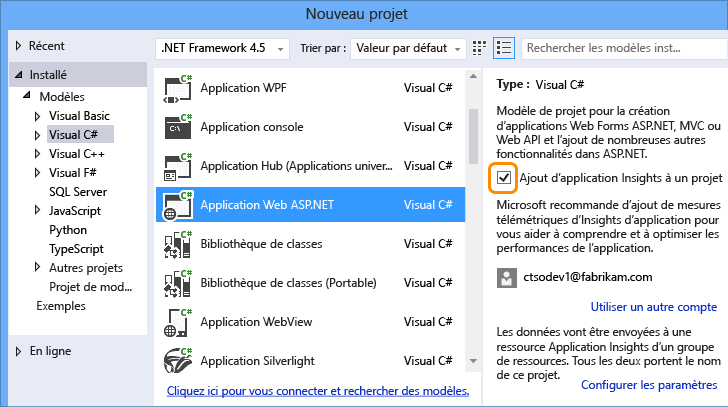
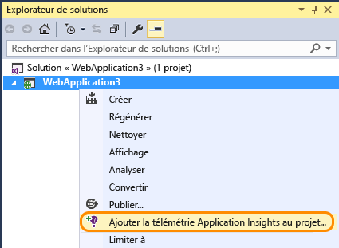
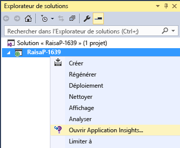
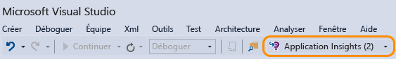

<properties 
	pageTitle="Surveillez les performances et l'utilisation de votre application avec Application Insights" 
	description="Analysez l'utilisation, la disponibilité et les performances de votre application web locale ou Microsoft Azure avec Application Insights." 
	services="application-insights" 
    documentationCenter=""
	authors="alancameronwills" 
	manager="ronmart"/>

<tags 
	ms.service="application-insights" 
	ms.workload="tbd" 
	ms.tgt_pltfrm="ibiza" 
	ms.devlang="na" 
	ms.topic="article" 
	ms.date="04/26/2015" 
	ms.author="awills"/>

# Surveillez les performances et l'utilisation de votre application avec Application Insights

*Application Insights est à l'état de version préliminaire*

Visual Studio Application Insights surveille vos applications en direct pour vous aider à [détecter et diagnostiquer les problèmes de performances et les exceptions][detect], mais aussi [découvrir comment votre application est utilisée][knowUsers]. Vous pouvez l’utiliser avec un large éventail de types d'applications : ASP.NET et Java web, iOS, Android, Windows et des applications pour d’autres appareils, ainsi que des applications HTML et JavaScript.

Dans cet article nous allons nous concentrer sur les types d'applications que vous pouvez développer dans Visual Studio. Il existe également des extensions d'Application Insights pour d'autres environnements IDE.

Vous aurez besoin des éléments suivants : [Visual Studio 2013 Update 3](http://go.microsoft.com/fwlink/?linkid=397827&clcid=0x409) (ou une version plus récente) ainsi qu'un compte [Microsoft Azure](http://azure.com).

## Ajout de Application Insights à votre projet

#### S'il s'agit d'un nouveau projet...

Lorsque vous créez un projet dans Visual Studio, assurez-vous que Application Insights est sélectionné.

Visual Studio crée une ressource dans Application Insights, ajoute le Kit de développement logiciel (SDK) à votre projet et place la clé dans le fichier `.config`.

Si votre projet a des pages web, Visual Studio ajoute également le [Kit de développement logiciel (SDK) JavaScript][client] à la page web principale.

#### ... ou s'il s'agit d'un projet existant

Cliquez avec le bouton droit de la souris sur le projet dans l'Explorateur de solutions, puis sélectionnez Ajouter Application Insights.

Visual Studio crée une ressource dans Application Insights, ajoute le Kit de développement logiciel (SDK) à votre projet et place la clé dans le fichier `.config`.

Dans ce cas, il n'ajoute pas le [Kit de développement logiciel (SDK) JavaScript][client] à vos pages web : nous vous recommandons de le faire lors de l'étape suivante.

#### Options d'installation

S'il s'agit de votre toute première utilisation, vous êtes invité à vous connecter ou à vous inscrire à la version préliminaire de Microsoft Azure. (indépendamment de votre compte Visual Studio Online).

Si cette application fait partie d'une application plus importante, vous pouvez utiliser **Configurer les paramètres** pour la placer dans le même groupe de ressources que les autres composants.

*Aucune option Application Insights n'est disponible ? Pour certains types de projet, vous pouvez utiliser Application Insights en [ajoutant manuellement le Kit de développement logiciel (SDK)][windows].*

#### Ouvrez Application Insights à partir de votre projet.

##  3. Exécution de votre projet

Exécutez votre application à l'aide de la touche F5 et essayez-la : ouvrez différentes pages pour générer des données de télémétrie.

Un décompte des événements envoyés s'affiche dans Visual Studio.

##  4. Affichage de vos données de télémétrie

Revenez au [portail Azure][portal] et accédez à vos ressources Application Insights.

Recherchez des données dans les graphiques de présentation. Au début, seuls un ou deux points s'affichent. Par exemple :

Cliquez sur un des graphiques pour afficher des métriques plus détaillées. [En savoir plus sur les métriques.][perf]

À présent, déployez votre application et regardez les données s'accumuler.

Lorsque vous exécutez l'application en mode débogage, la télémétrie est envoyée via le pipeline, ce qui vous permet d'accéder aux données en quelques secondes. Lorsque vous déployez votre application, les données s'accumulent plus lentement.

#### Pas de données ?

* Ouvrez la vignette [Recherche de diagnostic][diagnostic] pour afficher les événements individuels.
* Utilisez l'application en ouvrant différentes pages pour générer des données de télémétrie.
* Attendez quelques secondes, puis cliquez sur Actualiser.
* Consultez la rubrique [Résolution des problèmes][qna].

## Étapes suivantes

Maintenant que vous avez envoyé des données à partir du serveur de votre application, voici les étapes à suivre pour obtenir un plus large aperçu :

* [Configurez les tests web][availability] pour vous assurer que votre application est bien active.
* [Ajoutez le Kit de développement logiciel (SDK) JavaScript à vos pages web][client] pour obtenir des données de télémétrie basées sur votre navigateur, comme le nombre d'affichages de vos pages, les délais de chargement de vos pages, les exceptions de script, mais aussi les données de télémétries personnalisées que vous pouvez rédiger dans les scripts de vos pages.
* Ajoutez un suivi des dépendances pour diagnostiquer les problèmes provoqués par les bases de données ou les autres composants utilisés par votre application 
 * [Ajout d’un suivi des dépendances à votre serveur IIS][redfield]
 * [Ajout d’un suivi des dépendances à votre application web Azure][azure]
* [Capture du suivi du journal][netlogs] dans votre infrastructure de journalisation favorite
* [Suivez des événements et des métriques personnalisés][api] dans votre client ou votre serveur ou les deux, pour en savoir plus sur la façon dont votre application est utilisée.

<!--Link references-->

[api]: app-insights-api-custom-events-metrics.md
[availability]: app-insights-monitor-web-app-availability.md
[azure]: ../insights-perf-analytics.md
[client]: app-insights-javascript.md
[detect]: app-insights-detect-triage-diagnose.md
[diagnostic]: app-insights-diagnostic-search.md
[knowUsers]: app-insights-overview-usage.md
[netlogs]: app-insights-asp-net-trace-logs.md
[perf]: app-insights-web-monitor-performance.md
[portal]: http://portal.azure.com/
[qna]: app-insights-troubleshoot-faq.md
[redfield]: app-insights-monitor-performance-live-website-now.md
[windows]: app-insights-windows-get-started.md

 

<!---HONumber=62-->