<properties
	pageTitle="Prise en main d’Azure Automation | Microsoft Azure"
	description="Découvrez comment importer et exécuter une tâche d'automatisation dans Azure."
	services="automation"
	documentationCenter=""
	authors="bwren"
	manager="stevenka"
	editor=""/>

<tags
	ms.service="automation"
	ms.workload="tbd"
	ms.tgt_pltfrm="na"
	ms.devlang="na"
	ms.topic="hero-article" 
	ms.date="09/08/2015"
	ms.author="bwren"/>

# Prise en main d'Azure Automation

## Qu'est-ce qu'Azure Automation ?

Microsoft Azure Automation permet aux développeurs d'automatiser les tâches répétitives, manuelles, de longue durée et susceptibles d'engendrer des erreurs, qui sont communément exécutées dans un environnement cloud. Vous pouvez créer, surveiller, gérer et déployer les ressources dans votre environnement Azure à l'aide de Runbooks, basés sur les flux de travail Windows PowerShell. Dans cet article, vous allez suivre un didacticiel expliquant l'exécution d'un exemple simple de Runbook. Ensuite, vous trouverez les ressources destinées à l'exploration de fonctionnalités plus avancées du service.

## Didacticiel
Le didacticiel vous guide dans la création d'un compte Automation, l'importation d'un exemple de Runbook « HelloWorld » dans Azure Automation, l'exécution du Runbook et l'affichage de sa sortie.

Pour suivre le didacticiel, vous devez disposer d'un abonnement Azure. Si vous n'avez pas encore d'abonnement, vous pouvez [activer vos avantages abonnés MSDN](../pricing/member-offers/msdn-benefits-details/) ou vous [inscrire pour un essai gratuit](../pricing/free-trial.md)</a>.

[AZURE.INCLUDE [automation-note-authentication](../../includes/automation-note-authentication.md)]

## Vidéo de procédure pas à pas

Voici une procédure pas à pas de ce didacticiel.

[AZURE.VIDEO get-started-with-azure-automation]

## Créer un compte Automation

Un compte Automation est un conteneur pour vos ressources Azure Automation. Il fournit un moyen de séparer vos environnements ou de mieux organiser vos flux de travail. Pour plus d'informations, consultez [Comptes Automation](http://aka.ms/runbookauthor/azure/automationaccounts) dans la bibliothèque Automation. Si vous avez déjà créé un compte Automation, vous pouvez ignorer cette étape.

1.	Connectez-vous au [portail Azure](http://manage.windowsazure.com).

2.	Dans le portail Azure, cliquez sur **Créer un compte Automation**.

	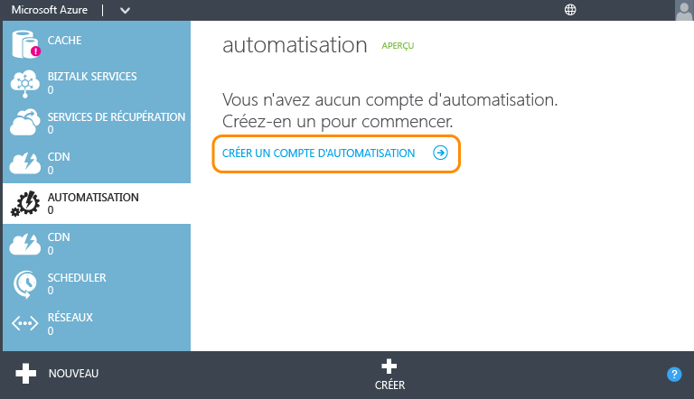

3.	Dans la page **Ajouter un nouveau compte Automation**, entrez un nom pour le compte et sélectionnez une région. La région spécifie où sont stockées les ressources Automation du compte. Les fonctionnalités de votre compte n'en sont pas affectées, mais vos Runbooks peuvent s'exécuter plus rapidement si la région de votre compte est proche de l'emplacement où sont stockées vos autres ressources Azure. Lorsque vous êtes prêt, cliquez sur la coche.

	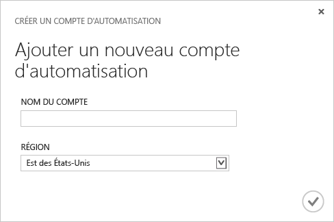

## Importer le Runbook depuis la galerie de Runbooks

La [galerie de Runbooks](http://aka.ms/runbookgallery) inclut des exemples de Runbook que vous pouvez importer directement dans un compte Azure Automation, ce qui vous permet de réutiliser le travail des autres utilisateurs Azure Automation et PowerShell. Dans cette étape, vous allez utiliser la galerie pour importer l'exemple de Runbook « Hello World ».

4.	Dans la page **Automation**, cliquez sur le compte que vous venez de créer.

	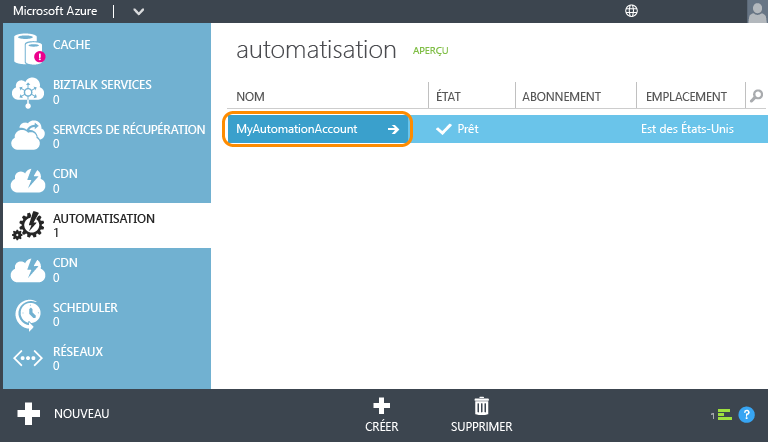

5.	Cliquez sur **RUNBOOKS**.

	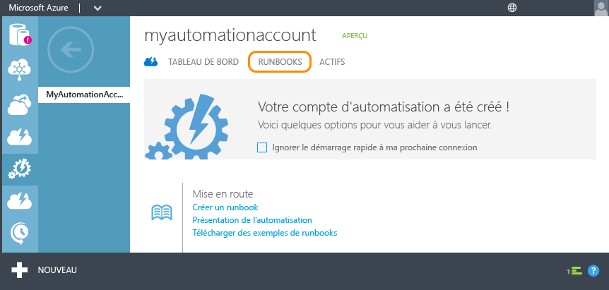

6.	Cliquez sur **Nouveau** > **Runbook** > **À partir de la galerie**.

	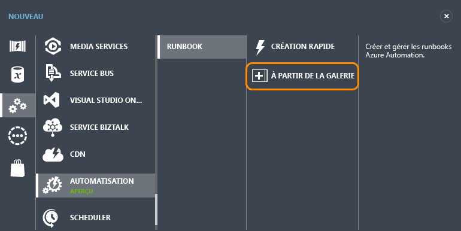

7.  Sélectionnez la catégorie **Didacticiel**, puis **Hello World pour Azure Automation**. Cliquez sur le bouton avec la flèche vers la droite.

	

8.  Vérifiez le contenu du Runbook, puis cliquez sur la flèche droite.

	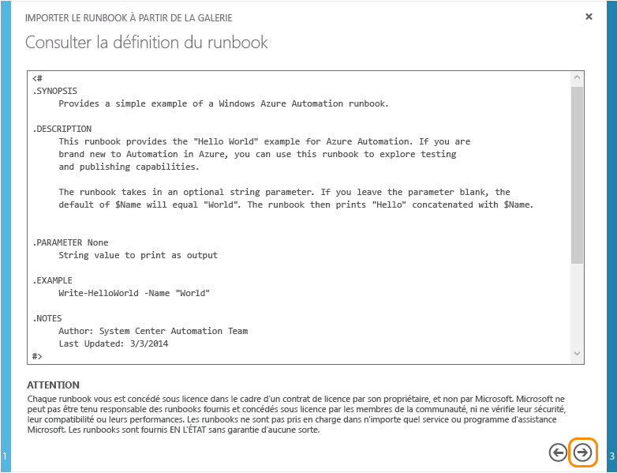

8.	Relisez les détails du Runbook, puis cliquez sur la coche.

	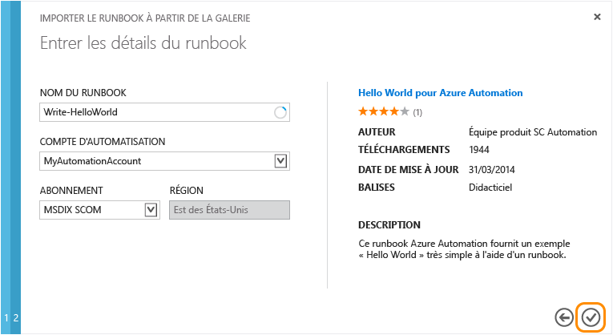

## Publier le Runbook

Le Runbook est d'abord importé en mode Brouillon. Vous pouvez ainsi continuer à y travailler avant de l'autoriser en tant que nouvelle version exécutable. Comme cet exemple de Runbook ne requiert aucune configuration supplémentaire, vous allez le publier en l'état. Pour plus d'informations, consultez [Publication d'un Runbook](http://aka.ms/runbookauthor/azure/publishrunbook).

9.	Une fois le Runbook importé, cliquez sur **Write-HelloWorld**.

	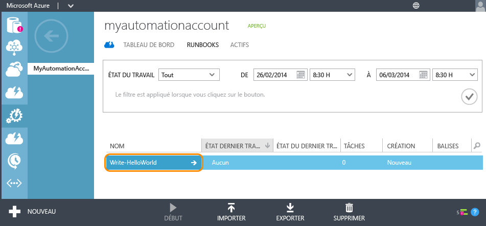

9.	Cliquez sur **AUTHOR**, puis sur **DRAFT**.

	Vous pouvez modifier le contenu d'un Runbook en mode Brouillon. Vous n'avez aucune modification à apporter à ce Runbook.

	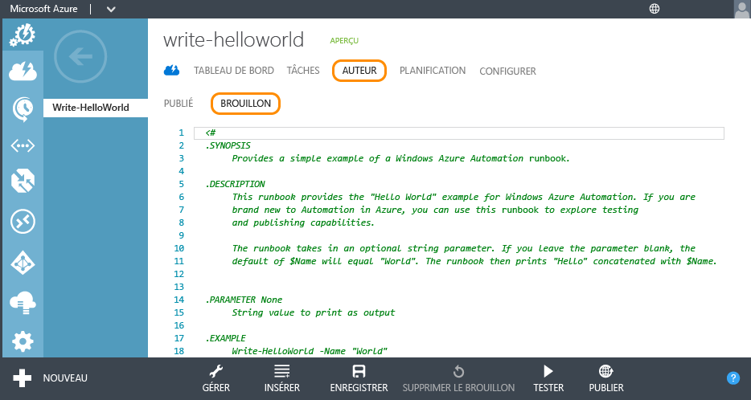

10.	Cliquez sur **PUBLIER** pour promouvoir le Runbook et le marquer comme prêt à être utilisé en production.

	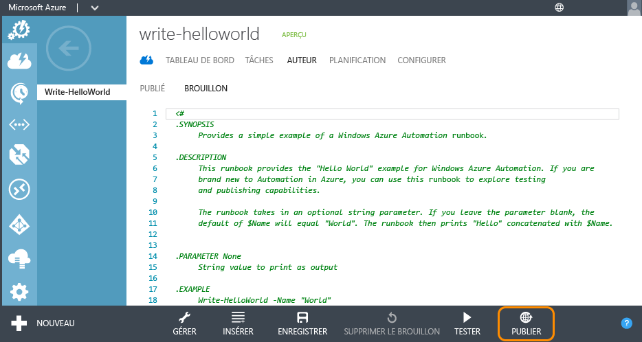

11.	Lorsque vous êtes invité à confirmer l'opération, cliquez sur **Oui**.

	

## Démarrer le Runbook

Une fois le Runbook importé et publié, vous pouvez l'exécuter, puis examiner la sortie. Pour plus d'informations, consultez [Démarrage d'un Runbook](http://aka.ms/runbookauthor/azure/startrunbook) et [Sortie d'un Runbook et Messages](http://aka.ms/runbookauthor/azure/runbookoutput).

12.	Lorsque le Runbook **Write-HelloWorld** est ouvert, cliquez sur **START**.

	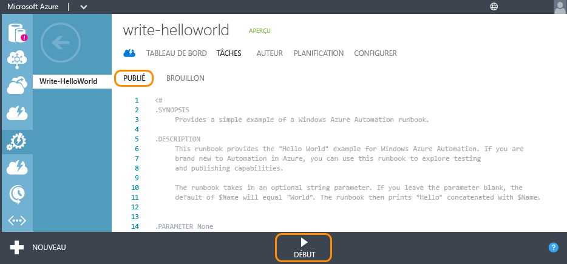

13.	Dans la page **Spécifier les valeurs de paramètres de Runbook**, tapez un **nom** qui servira de paramètre d'entrée pour le script Write-HelloWorld.ps1 et cliquez sur la coche.

	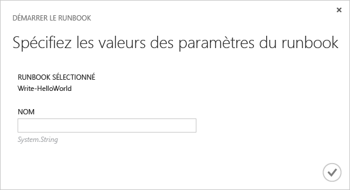

14.	Cliquez sur **JOBS** pour vérifier l'état de la tâche de Runbook que vous venez de commencer, et cliquez sur l'horodatage dans la colonne **JOB START** pour afficher le résumé de la tâche.

	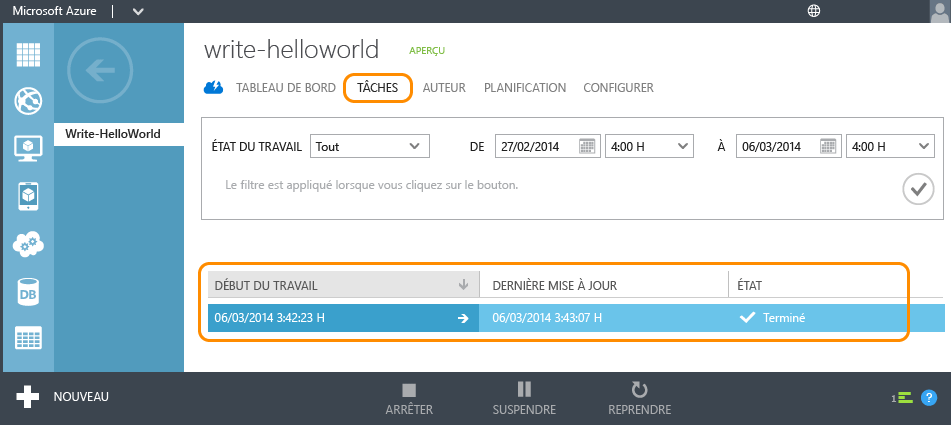

15.	Dans la page **SUMMARY** sont affichés le résumé, les paramètres d'entrée et la sortie de la tâche.

	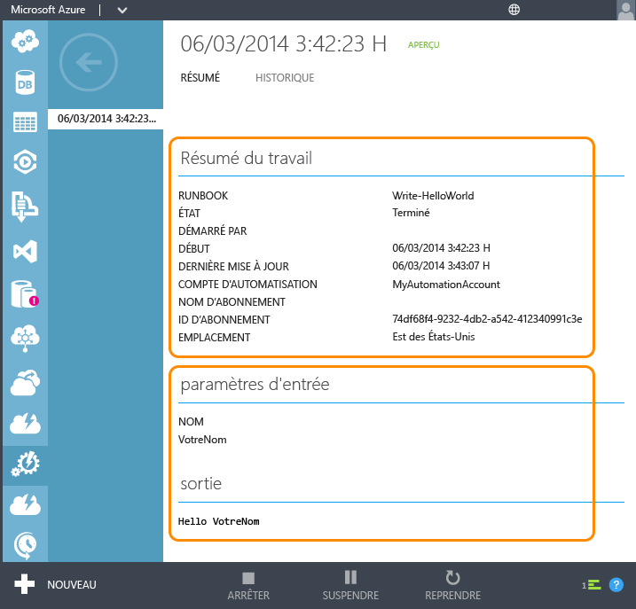

Félicitations ! Vous avez fini le didacticiel.

## Étapes suivantes
1. Le simple Runbook de ce didacticiel *ne gère pas les services Azure*. La plupart des Runbooks utilisent à cette fin les [applets de commande Azure](http://msdn.microsoft.com/library/jj156055.aspx), qui nécessitent l'authentification de votre abonnement Azure. Suivez les instructions de [Configuration d'Azure pour la gestion par les Runbooks](http://aka.ms/azureautomationauthentication) afin de configurer votre abonnement Azure pour l'utiliser avec ces applets de commande.  
2. Pour plus d'informations sur les fonctionnalités d'Azure Automation, consultez les [Ressources](#resources) répertoriées ci-dessous.
3. Abonnez-vous au [blog Azure Automation](http://azure.microsoft.com/blog/tag/azure-automation) pour rester à jour avec la dernière version de l'équipe Azure Automation.

## Ressources

D'autres ressources sont disponibles pour vous permettre d'en savoir plus sur Azure Automation et de créer vos propres Runbooks.

- La [bibliothèque Azure Automation](http://go.microsoft.com/fwlink/p/?LinkId=392860) fournit une documentation complète sur la configuration et l'administration d'Azure Automation et pour la création de vos propres Runbooks.
- Les [applets de commande Azure PowerShell](http://msdn.microsoft.com/library/jj156055.aspx) fournissent des informations sur les opérations Azure Automation à l'aide de Windows PowerShell. Les Runbooks recourent à ces applets de commande pour utiliser les ressources Azure.
- Le [blog Azure Automation](http://azure.microsoft.com/blog/tag/azure-automation) fournit les dernières informations Microsoft sur Azure Automation.
- Le [forum Automation Forum](http://go.microsoft.com/fwlink/p/?LinkId=390561) vous permet de publier des questions sur Azure Automation à destination de Microsoft et de la communauté Automation.

## Exemples et Runbooks utilitaires

Microsoft et la communauté Azure Automation fournissent des exemples de Runbooks qui peuvent vous aider à commencer à créer vos propres solutions et Runbooks utilitaires, que vous pouvez ensuite utiliser comme composantes pour les tâches d'automatisation plus importantes. Vous pouvez aussi télécharger ces Runbooks depuis le [Centre de scripts](http://azure.microsoft.com/documentation/scripts/) ou les importer directement dans Azure Automation à l'aide de la [galerie de Runbooks](http://aka.ms/runbookgallery).

## Commentaires

**Envoyez-nous vos commentaires !** Si vous recherchez un module d'intégration ou une solution de Runbook Azure Automation, envoyez une demande de script au Centre de scripts. Le cas échéant, publiez vos commentaires ou demandes de fonctionnalités pour Azure Automation sur [User Voice](http://feedback.windowsazure.com/forums/34192--general-feedback). Merci !

<!---HONumber=Sept15_HO4-->