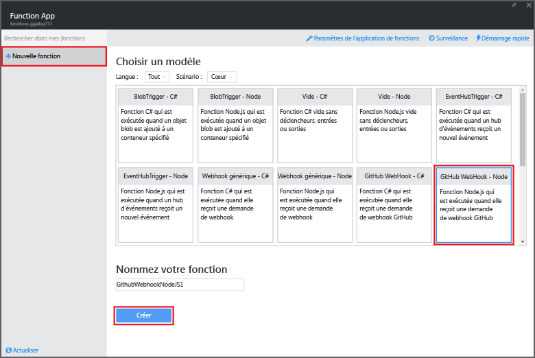
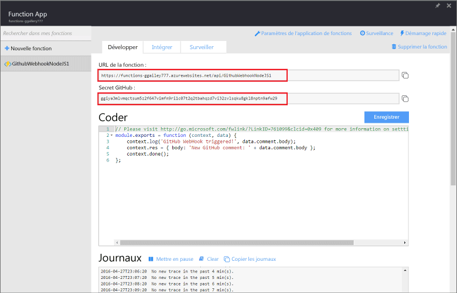

<properties
   pageTitle="Créer une fonction Azure d’API ou de webhook | Microsoft Azure"
   description="Utilisez Azure Functions pour créer une fonction appelée par un appel webhook ou API."
   services="azure-functions"
   documentationCenter="na"
   authors="ggailey777"
   manager="erikre"
   editor=""
   tags=""
   />

<tags
   ms.service="functions"
   ms.devlang="multiple"
   ms.topic="article"
   ms.tgt_pltfrm="multiple"
   ms.workload="na"
   ms.date="04/29/2016"
   ms.author="glenga"/>
   
# Créer une fonction Azure d’API ou de webhook

Faites l’expérience du calcul à la demande piloté par les événements d’Azure Functions qui vous permet de créer des unités de code planifiées ou déclenchées, et de les implémenter dans différents langages de programmation. Pour en savoir plus sur Azure Functions, consultez [Vue d’ensemble d’Azure Functions](functions-overview.md).

Cette rubrique vous montre comment créer une nouvelle fonction Node.js qui est appelée par un webhook GitHub. La nouvelle fonction est créée selon un modèle prédéfini dans le portail Azure Functions. Vous pouvez également regarder une courte vidéo décrivant comment effectuer ces étapes dans le portail.

## Regarder la vidéo

La vidéo suivante montre comment effectuer les étapes de base de ce didacticiel

[AZURE.VIDEO create-a-web-hook-or-api-azure-function]

##Créer une fonction déclenchée par webhook à partir du modèle

Une application de fonction héberge l’exécution de vos fonctions dans Azure. Pour créer une fonction, vous devez avoir un compte Azure actif. Si tel n’est pas le cas, des [comptes gratuits sont disponibles](https://azure.microsoft.com/free/).

1. Accédez au [portail Azure Functions](https://functions.azure.com/signin) et connectez-vous avec votre compte Azure.

2. Si vous avez une application de fonction existante à utiliser, sélectionnez-la à partir de **vos applications de fonction**, puis cliquez sur **Ouvrir**. Pour créer une nouvelle application de fonction, dans **Nom**, indiquez le nom unique de votre nouvelle fonction ou acceptez le nom généré, sélectionnez votre **Région**, puis cliquez sur **Créer + Prise en main**.

3. Dans votre application de fonction, cliquez sur **+ Nouvelle fonction** > **Webhook GitHub - Nœud** > **Créer**. Cela crée une fonction avec un nom par défaut basé sur le modèle spécifié.

	

4. Dans l’onglet **Développer**, notez l’exemple de fonction express.js dans la fenêtre **Code**. Cette fonction reçoit une demande GitHub à partir d’un webhook de commentaire du problème, enregistre le texte du problème et envoie une réponse au webhook au format `New GitHub comment: <Your issue comment text>`.

	

5. Copiez les valeurs **URL de fonction** et **Secret GitHub**. Vous en aurez besoin lors de la création du webhook dans GitHub.

6. Faites défiler jusqu’à **Exécuter**, notez le corps JSON prédéfini d’un commentaire du problème dans le corps de la demande, puis cliquez sur **Exécuter**.
 
	Vous pouvez toujours tester une nouvelle fonction basée sur un modèle dans l’onglet **Développer** en fournissant un corps de données JSON attendu et en cliquant sur le bouton **Exécuter**. Dans ce cas, le modèle a un corps prédéfini pour un commentaire de problème.
 
Ensuite, vous allez créer le webhook lui-même dans votre référentiel GitHub.

##Configurer le webhook

1. Dans GitHub, accédez à un référentiel que vous possédez. Cela inclut tous les référentiels que vous avez dupliqués.
 
2. Cliquez sur **Paramètres** > **Webhooks & services** > **Ajouter un webhook**.

	

3. Collez l’URL et le secret de votre fonction dans **URL de la charge utile** et **Secret**, puis cliquez sur **Me laisser choisir les événements individuels**, sélectionnez **Émettre un commentaire** et cliquez sur **Ajouter un webhook**.

	

À ce stade, le webhook GitHub est configuré pour déclencher votre fonction lors de l’ajout d’un nouveau commentaire de problème. À présent, il est temps de tout tester.

##Tester la fonction

1. Dans votre référentiel GitHub, ouvrez l’onglet **Problèmes** dans une nouvelle fenêtre de navigateur, cliquez sur **Nouveau problème**, tapez un titre, puis cliquez sur **Envoyer nouveau problème**. Vous pouvez également ouvrir un problème existant.

2. Dans le problème, entrez un commentaire et cliquez sur **Commentaire**. À ce stade, vous pouvez revenir à votre nouveau webhook dans GitHub et sous **Dernières livraisons** vous verrez qu’une demande de webhook a été envoyée et que le corps de la réponse est `New GitHub comment: <Your issue comment text>`.

3. Dans le portail Functions, faites défiler jusqu’aux journaux et vous verrez que la fonction a été déclenchée et que la valeur `New GitHub comment: <Your issue comment text>` est écrite dans les journaux de diffusion en continu.

##Étapes suivantes

Pour plus d’informations sur Azure Functions, consultez ces rubriques.

+ [Référence du développeur Azure Functions](functions-reference.md) Référence du programmeur pour le codage de fonctions et la définition de déclencheurs et de liaisons.
+ Le didacticiel [Test d’Azure Functions](functions-test-a-function.md) décrit plusieurs outils et techniques permettant de tester vos fonctions.
+ La rubrique [Comment mettre à l’échelle Azure Functions](functions-scale.md) présente les plans de services disponibles dans Azure Functions, dont le plan de service dynamique, et explique comment choisir le plan adapté à vos besoins.  

[AZURE.INCLUDE [Remarque relative à la prise en main](../../includes/functions-get-help.md)]

<!---HONumber=AcomDC_0504_2016-->