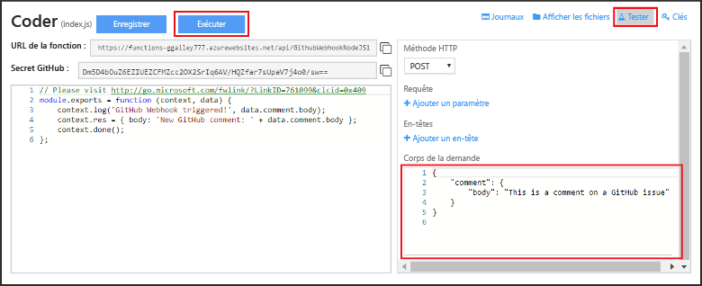

# Créer une fonction Azure d’API ou de webhook
Faites l’expérience du calcul à la demande piloté par les événements d’Azure Functions qui vous permet de créer des unités de code planifiées ou déclenchées, et de les implémenter dans différents langages de programmation. Pour en savoir plus sur Azure Functions, consultez [Vue d’ensemble d’Azure Functions](functions-overview.md).

Cette rubrique vous montre comment créer une fonction JavaScript appelée par un webhook GitHub. La nouvelle fonction est créée selon un modèle prédéfini dans le portail Azure Functions. Vous pouvez également regarder une courte vidéo décrivant comment effectuer ces étapes dans le portail.

Les étapes générales de ce didacticiel peuvent également être utilisées pour créer une fonction en C# ou F# au lieu de JavaScript. 

## Regarder la vidéo
La vidéo suivante montre comment effectuer les étapes de base de ce didacticiel 

>[!VIDEO https://channel9.msdn.com/Series/Windows-Azure-Web-Sites-Tutorials/Create-a-Web-Hook-or-API-Azure-Function/player]
>
>

## Composants requis

Pour réaliser ce didacticiel, vous avez besoin des éléments suivants :

+ Un compte Azure actif. Si vous ne possédez pas encore de compte Azure, vous pouvez [vous inscrire pour en obtenir un gratuitement](https://azure.microsoft.com/free/).  
 Vous pouvez également utiliser l’expérience [Essayer Functions](https://functions.azure.com/try) pour suivre les étapes de ce didacticiel sans compte Azure.
+ Un compte GitHub. Si vous ne possédez pas encore de compte GitHub, vous pouvez [vous inscrire pour en obtenir un gratuitement](https://github.com/join). 

## Créer une fonction déclenchée par webhook à partir du modèle
Une application de fonction héberge l’exécution de vos fonctions dans Azure. 

1. Accédez au [Portail Azure Functions](https://functions.azure.com/signin) et connectez-vous avec votre compte Azure.

2. Si vous avez une application de fonction existante à utiliser, sélectionnez-la à partir de vos **applications de fonction**, puis cliquez sur **Ouvrir**. Pour créer un conteneur de fonctions, dans **Nom**, tapez le nom unique de votre nouveau conteneur de fonctions ou acceptez le nom généré, sélectionnez votre **Région**, puis cliquez sur **Créer + Prise en main**. 

3. Dans votre Function App, cliquez sur **+ Nouvelle fonction** > **GitHub Webhook - JavaScript** > **Créer**. Cette étape crée une fonction avec un nom par défaut basé sur le modèle spécifié. Vous pouvez également créer une fonction C# ou F#.
   
     

4. Dans **Développer**, notez l’exemple de fonction express.js dans la fenêtre **Code**. Cette fonction reçoit une demande GitHub à partir d’un webhook de commentaire du problème, enregistre le texte du problème et envoie une réponse au webhook au format `New GitHub comment: <Your issue comment text>`.

     

1. Copiez et enregistrez les valeurs **URL de la fonction** et **Secret GitHub**. Vous utiliserez ces valeurs dans la section suivante pour configurer le webhook dans GitHub. 

2. Cliquez sur **Tester**, notez le corps JSON prédéfini d’un commentaire du problème dans le **corps de la demande**, puis cliquez sur **Exécuter**. 

    
   
    > [!NOTE]
    > Vous pouvez toujours tester une nouvelle fonction basée sur un modèle dans l’onglet **Développer** en fournissant un corps de données JSON attendu et en cliquant sur le bouton **Exécuter**. Dans ce cas, le modèle a un corps prédéfini pour un commentaire de problème. 

Ensuite, vous allez créer le webhook lui-même dans votre référentiel GitHub.

## Configurer le webhook
1. Dans GitHub, accédez à un référentiel que vous possédez. Vous pouvez également utiliser les référentiels que vous avez dupliqués.
 
2. Cliquez sur **Paramètres** > **Webhooks & services** > **Ajouter un webhook**.
   
       

3. Collez l’URL de votre fonction et le secret dans **Payload URL** (URL de la charge utile) et **Secret** puis sélectionnez **application/json** pour **Type de contenu**.

4. Cliquez sur **Let me select individual events** (Me laisser choisir des événements individuels), sélectionnez **Commentaire sur le problème**, puis cliquez sur **Ajouter webhook**.
   
     

À ce stade, le webhook GitHub est configuré pour déclencher votre fonction lors de l’ajout d’un nouveau commentaire de problème.  
À présent, il est temps de tout tester.

## Tester la fonction
1. Dans votre référentiel GitHub, ouvrez l’onglet **Problèmes** dans une nouvelle fenêtre de navigateur.

2. Dans la nouvelle fenêtre, cliquez sur **Nouveau problème**, saisissez un titre, puis cliquez sur **Submit new issue** (Envoyer nouveau problème). Vous pouvez également ouvrir un problème existant.

2. Dans le problème, entrez un commentaire et cliquez sur **Commentaire**. 

3. Dans l’autre fenêtre de GitHub, cliquez sur **Modifier** à côté de votre nouveau webhook, faites défiler jusqu’à **Recent Deliveries** (Dernières livraisons), puis vérifiez qu’une demande de webhook a été envoyée et que le corps de réponse est `New GitHub comment: <Your issue comment text>`.

3. Dans le portail Functions, faites défiler jusqu’aux journaux et vous verrez que la fonction a été déclenchée et que la valeur `New GitHub comment: <Your issue comment text>` est écrite dans les journaux de diffusion en continu.

## Étapes suivantes
Pour plus d’informations sur Azure Functions, consultez ces rubriques.

* [Référence du développeur Azure Functions](functions-reference.md)  
  Référence du programmeur pour le codage de fonctions.
* [Test d’Azure Functions](functions-test-a-function.md)  
  décrit plusieurs outils et techniques permettant de tester vos fonctions.
* [Comment mettre à l’échelle Azure Functions](functions-scale.md)  
  Présente les plans de service disponibles pour Azure Functions, dont le plan d’hébergement de consommation, et explique comment choisir le plan adapté à vos besoins.  

[!INCLUDE [Getting Started Note](../../includes/functions-get-help.md)]

