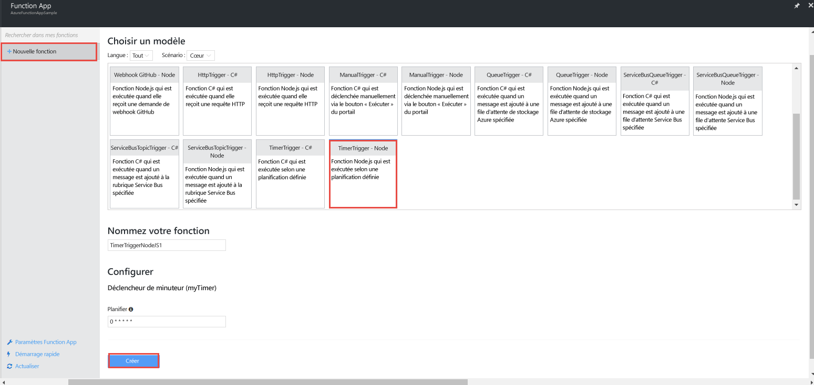
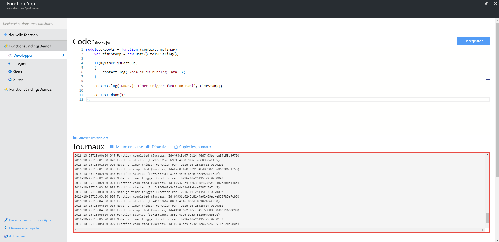
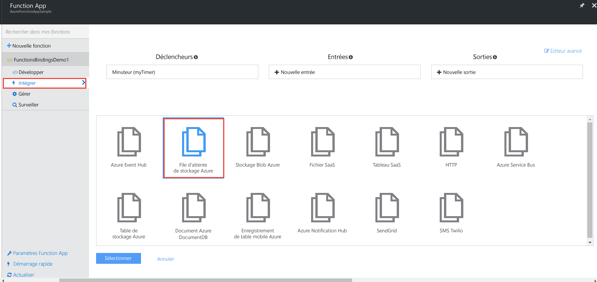
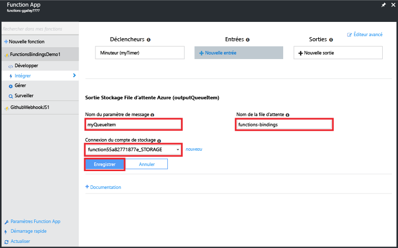
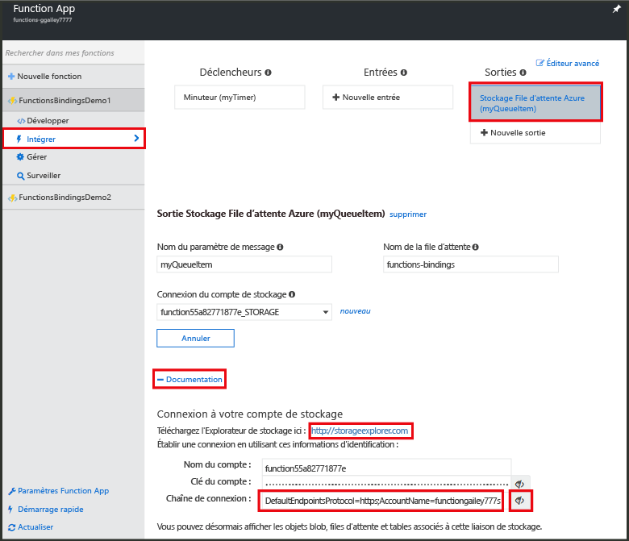
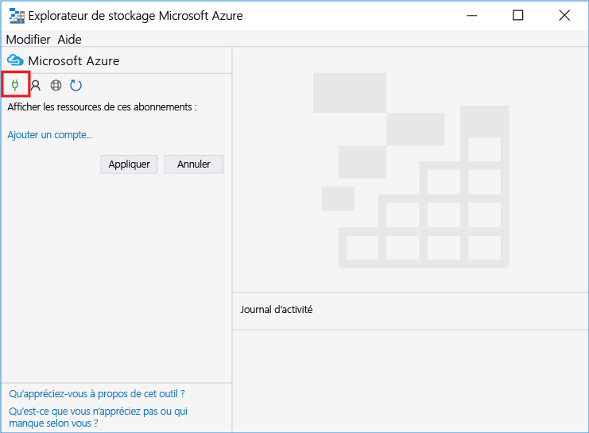
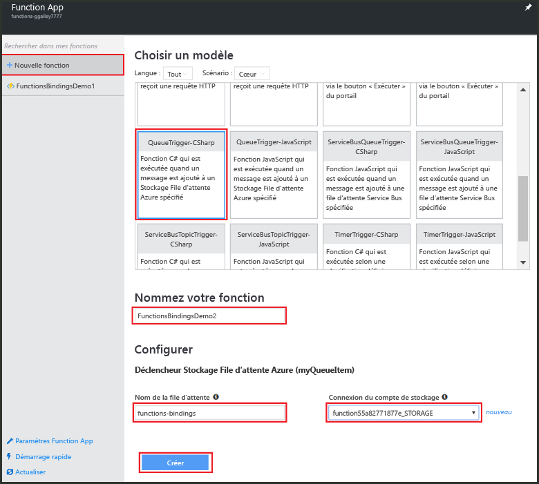
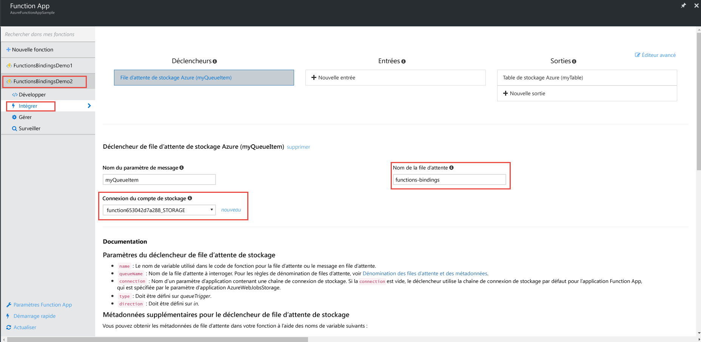
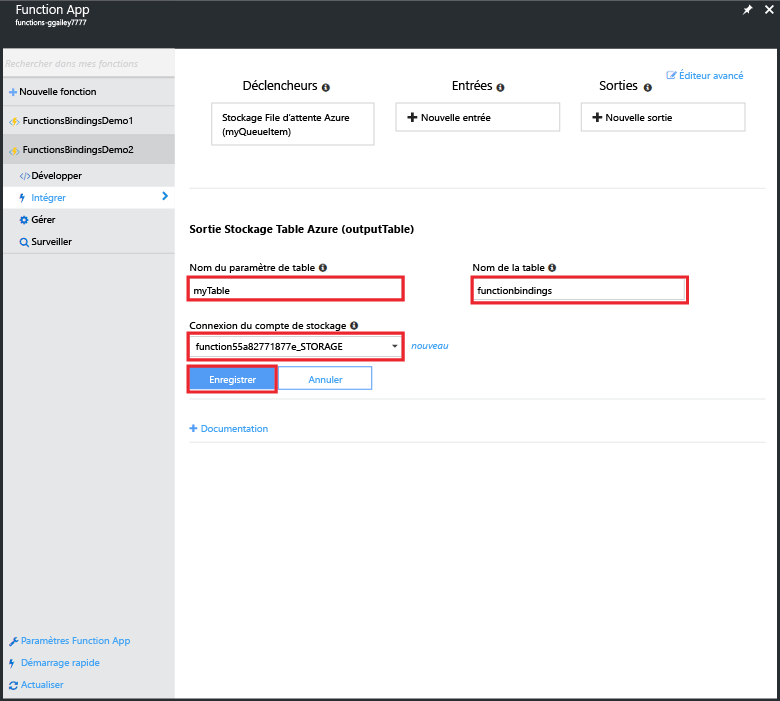
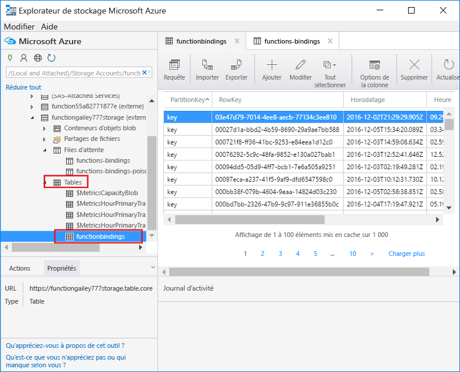

# <a name="use-azure-functions-to-create-a-function-that-connects-to-other-azure-services"></a>Utiliser les fonctions Azure pour créer une fonction qui se connecte à d’autres services Azure

Cette rubrique vous explique comment créer une fonction Azure qui écoute les messages dans une file d’attente de stockage Azure et copie les messages dans les lignes d’une table de stockage Azure. Une fonction de minuteur déclencheur est utilisée pour charger des messages dans la file d’attente. Une deuxième fonction lit la file d’attente et écrit les messages dans la table. La file d’attente et la table sont créées pour vous par les fonctions Azure basées sur les définitions de liaison. 

Pour rendre les choses plus intéressantes, une fonction est écrite en JavaScript et l’autre est écrite en script C#. Cela montre qu’une Function App peut avoir des fonctions dans différentes langues. 

Vous pouvez voir la démonstration de ce scénario dans une [vidéo sur Channel 9](https://channel9.msdn.com/Series/Windows-Azure-Web-Sites-Tutorials/Create-an-Azure-Function-which-binds-to-an-Azure-service/player).

## <a name="create-a-function-that-writes-to-the-queue"></a>Créer une fonction qui écrit dans la file d’attente

Avant de vous connecter à une file d’attente de stockage, vous devez créer une fonction qui charge la file d’attente de messages. Cette fonction JavaScript utilise un minuteur déclencheur qui écrit un message dans la file d’attente toutes les 10 secondes. Si vous ne disposez pas d’un compte Azure, vivez l’expérience [Try Azure Functions](https://functions.azure.com/try) (Essayer Azure Functions) ou [créez un compte Azure gratuit](https://azure.microsoft.com/free/).

1. Accédez au portail Azure et recherchez votre application de fonction.

2. Cliquez sur **Nouvelle fonction** > **TimerTrigger-JavaScript**. 

3. Nommez la fonction **FunctionsBindingsDemo1**, entrez une valeur d’expression CRON `0/10 * * * * *` pour **Schedule** (Planification), puis cliquez sur **Create** (Créer).
   
    

    Vous venez de créer une fonction de minuteur déclencheur qui s’exécute toutes les 10 secondes.

5. Sur l’onglet **Développement** , cliquez sur **Journaux** et consultez l’activité dans le journal. Les entrées de journal que vous consultez ont été écrites toutes les 10 secondes.
   
    

## <a name="add-a-message-queue-output-binding"></a>Ajouter une liaison de sortie de file d’attente de messages

1. Dans l’onglet **Intégration**, choisissez **Nouvelle sortie** > **Stockage File d’attente Azure** > **Sélectionner**.

    

2. Entrez `myQueueItem` pour **Nom du paramètre de message** et `functions-bindings` pour **Nom de la file d’attente**, sélectionnez une **connexion du compte de stockage** existante ou cliquez sur **nouveau** pour créer une connexion du compte de stockage, puis cliquez sur **Enregistrer**.  

    

1. Dans l’onglet **Développement**, ajoutez le code suivant à la fonction :
   
    ```javascript
   
    function myQueueItem() 
    {
        return {
            msg: "some message goes here",
            time: "time goes here"
        }
    }
   
    ```
2. Repérez l’instruction *if* près de la ligne 9 de la fonction, et insérez le code suivant après cette instruction.
   
    ```javascript
   
    var toBeQed = myQueueItem();
    toBeQed.time = timeStamp;
    context.bindings.myQueueItem = toBeQed;
   
    ```  
   
    Ce code crée un élément **myQueueItem** et définit sa propriété **time** sur l’horodatage actuel. Il ajoute ensuite le nouvel élément de file d’attente à la liaison **myQueueItem** du contexte.

3. Cliquez sur **Enregistrer et exécuter**.

## <a name="view-storage-updates-by-using-storage-explorer"></a>Afficher les mises à jour du stockage à l’aide de l’Explorateur de stockage
Vous pouvez vérifier le bon fonctionnement de votre fonction en consultant les messages dans la file d’attente que vous avez créée.  Vous pouvez vous connecter à votre file d’attente de stockage à l’aide de Cloud Explorer dans Visual Studio. Toutefois, le portail facilite votre connexion au compte de stockage à l’aide de l’Explorateur de stockage Microsoft Azure.

1. Dans l’onglet **Intégration**, cliquez sur la liaison de sortie de file d’attente > **Documentation**, puis affichez la chaîne de connexion de votre compte de stockage et copiez la valeur. Cette valeur vous permet de vous connecter à votre compte de stockage.

    


2. Si ce n’est déjà fait, téléchargez et installez [l’Explorateur de stockage Microsoft Azure](http://storageexplorer.com). 
 
3. Dans l’Explorateur de stockage, cliquez sur l’icône de connexion au stockage Azure, collez la chaîne de connexion dans le champ et fermez l’Assistant.

    

4. Sous **Local and attached** (Locale et connectée), développez **Comptes de stockage** > votre compte de stockage > **Files d’attente** > **functions-bindings** et vérifiez que les messages sont écrits dans la file d’attente.

    

    Si la file d’attente n’existe pas ou est vide, il y a probablement un problème au niveau de la liaison ou du code de la fonction.

## <a name="create-a-function-that-reads-from-the-queue"></a>Créer une fonction qui lit à partir de la file d’attente

Maintenant que les messages s’ajoutent dans la file d’attente, vous pouvez créer une autre fonction qui lit à partir de la file d’attente et écrit définitivement les messages dans une table de stockage Azure.

1. Cliquez sur **Nouvelle fonction** > **QueueTrigger-CSharp**. 
 
2. Nommez la fonction `FunctionsBindingsDemo2`, entrez **functions-bindings** dans le champ **Nom de la file d’attente**, sélectionnez un compte de stockage existant ou créez-en un, puis cliquez sur **Créer**.

     

3. (Facultatif) Vous pouvez vérifier le bon fonctionnement de la fonction en consultant la nouvelle file d’attente dans l’Explorateur de stockage comme auparavant. Vous pouvez également utiliser Cloud Explorer dans Visual Studio.  

4. (Facultatif) Actualisez la file d’attente **functions-bindings** et notez que les éléments ont été supprimés de la file d’attente. Cette suppression a lieu car la fonction est liée à la file d’attente **functions-bindings** comme un déclencheur d’entrée et la fonction lit la file d’attente. 
 
## <a name="add-a-table-output-binding"></a>Ajouter une liaison de sortie de table

1. Dans FunctionsBindingsDemo2, cliquez sur **Intégrer** > **Nouvelle sortie** > **Table de stockage Azure** > **Sélectionner**.

     

2. Entrez `functionbindings` pour **Nom de la table** et `myTable` pour **Nom du paramètre de table**, choisissez une **Connexion du compte de stockage** ou créez-en une, puis cliquez sur **Enregistrer**.

    
   
3. Dans l’onglet **Développement** , remplacez le code existant de la fonction par le code suivant :
   
    ```cs
    
    using System;
    
    public static void Run(QItem myQueueItem, ICollector<TableItem> myTable, TraceWriter log)
    {    
        TableItem myItem = new TableItem
        {
            PartitionKey = "key",
            RowKey = Guid.NewGuid().ToString(),
            Time = DateTime.Now.ToString("hh.mm.ss.ffffff"),
            Msg = myQueueItem.Msg,
            OriginalTime = myQueueItem.Time    
        };
        
        // Add the item to the table binding collection.
        myTable.Add(myItem);
    
        log.Verbose($"C# Queue trigger function processed: {myItem.RowKey} | {myItem.Msg} | {myItem.Time}");
    }
    
    public class TableItem
    {
        public string PartitionKey {get; set;}
        public string RowKey {get; set;}
        public string Time {get; set;}
        public string Msg {get; set;}
        public string OriginalTime {get; set;}
    }
    
    public class QItem
    {
        public string Msg { get; set;}
        public string Time { get; set;}
    }
    ```
    La classe **TableItem** représente une ligne dans la table de stockage, et vous ajoutez l’élément à la collection `myTable` d’objets **TableItem**. Vous devez définir les propriétés **PartitionKey** et **RowKey** pour permettre les insertions dans la table.

4. Cliquez sur **Save**.  Enfin, vous pouvez vérifier le bon fonctionnement de la fonction en consultant la table dans l’Explorateur de stockage ou Visual Studio Cloud Explorer.

5. (Facultatif) Dans votre compte de stockage au sein de l’Explorateur de stockage, développez **Tables** > **functionsbindings** et vérifiez que les lignes sont ajoutées à la table. Vous pouvez procéder de la même manière dans Visual Studio Cloud Explorer.

    

    Si la table n’existe pas ou est vide, il y a probablement un problème au niveau de la liaison ou du code de la fonction. 
 
[!INCLUDE [More binding information](../../includes/functions-bindings-next-steps.md)]

## <a name="next-steps"></a>Étapes suivantes
Pour plus d’informations sur Azure Functions, consultez les rubriques suivantes :

* [Informations de référence pour les développeurs sur Azure Functions](functions-reference.md)  
  Référence du programmeur pour le codage de fonctions et la définition de déclencheurs et de liaisons.
* [Test d’Azure Functions](functions-test-a-function.md)  
  décrit plusieurs outils et techniques permettant de tester vos fonctions.
* [Comment mettre à l’échelle Azure Functions](functions-scale.md)  
  Présente les plans de service disponibles pour Azure Functions, dont le plan d’hébergement de consommation, et explique comment choisir le plan adapté à vos besoins. 

[!INCLUDE [Getting help note](../../includes/functions-get-help.md)]

