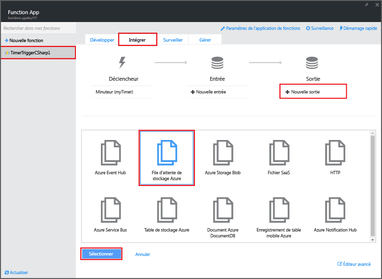
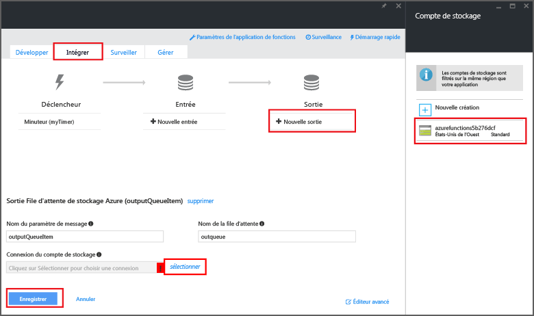

# <a name="create-an-event-processing-azure-function"></a>Créer une fonction de traitement d’événement Azure
Faites l’expérience du calcul à la demande piloté par les événements d’Azure Functions qui vous permet de créer des unités de code planifiées ou déclenchées, et de les implémenter dans différents langages de programmation. Pour en savoir plus sur Azure Functions, consultez [Vue d’ensemble d’Azure Functions](functions-overview.md).

Cette rubrique explique comment créer une nouvelle fonction en C# qui s’exécute selon un compteur d’événements afin d’ajouter des messages à une file d’attente de stockage. 

## <a name="prerequisites"></a>Composants requis
Une application de fonction héberge l’exécution de vos fonctions dans Azure. Si vous ne disposez pas d’un compte Azure, vivez l’expérience [Try Functions](https://functions.azure.com/try) ou [créez un compte Azure gratuit](https://azure.microsoft.com/free/). 

## <a name="create-a-timer-triggered-function-from-the-template"></a>Créer une fonction déclenchée par un minuteur à partir du modèle
Une application de fonction héberge l’exécution de vos fonctions dans Azure. Pour créer une fonction, vous devez avoir un compte Azure actif. Si tel n’est pas le cas, des [comptes gratuits sont disponibles](https://azure.microsoft.com/free/). 

1. Accédez au [Portail Azure Functions](https://functions.azure.com/signin) et connectez-vous avec votre compte Azure.
2. Si vous avez une application de fonction existante à utiliser, sélectionnez-la à partir de vos **applications de fonction**, puis cliquez sur **Ouvrir**. Pour créer un nouveau conteneur de fonctions, dans **Nom**, tapez le nom unique de votre nouveau conteneur de fonctions ou acceptez le nom généré, sélectionnez votre **Région**, puis cliquez sur **Créer + Prise en main**. 
3. Dans votre conteneur de fonctions, cliquez sur **+ Nouvelle fonction** > **TimerTrigger - C#** > **Créer**. Cela crée une fonction avec un nom par défaut, qui s’exécute selon la planification par défaut, c’est-à-dire une fois par minute. 
   
    
4. Dans votre nouvelle fonction, cliquez sur l’onglet **Intégrer** > **Nouvelle sortie** > **File d’attente de stockage Azure** > **Sélectionner**.
   
    
5. Dans la **Sortie de file d’attente de stockage Azure**, sélectionnez une **connexion au compte de stockage** existante ou créez-en une, puis cliquez sur **Enregistrer**. 
   
    
6. Dans l’onglet **Développer**, remplacez le script C# existant dans la fenêtre **Code** par le code suivant :
    ```cs   
    using System;

    public static void Run(TimerInfo myTimer, out string outputQueueItem, TraceWriter log)
    {
        // Add a new scheduled message to the queue.
        outputQueueItem = $"Ping message added to the queue at: {DateTime.Now}.";

        // Also write the message to the logs.
        log.Info(outputQueueItem);
    }
    ```
   
    Ce code ajoute un nouveau message à la file d’attente avec la date et l’heure d’exécution de la fonction.
7. Cliquez sur **Enregistrer** et observez les fenêtres **Journaux** lors de la prochaine exécution de la fonction.
8. (Facultatif) Accédez au compte de stockage et vérifiez que les messages sont ajoutés à la file d’attente.
9. Revenez à l’onglet **Intégrer** et remplacez le champ de planification par `0 0 * * * *`. La fonction s’exécute maintenant toutes les heures. 

Il s’agit d’un exemple très simplifié de déclenchement de minuteur et de liaison de sortie de file d’attente de stockage. Pour plus d’informations, consultez les rubriques [Déclencheur de minuteur Azure Functions](functions-bindings-timer.md) et [Déclencheurs et liaisons Azure Functions pour Stockage Azure](functions-bindings-storage.md).

## <a name="next-steps"></a>Étapes suivantes
Pour plus d’informations sur Azure Functions, consultez ces rubriques.

* [Référence du développeur Azure Functions](functions-reference.md)  
   Référence du programmeur pour le codage de fonctions et la définition de déclencheurs et de liaisons.
* [Test d’Azure Functions](functions-test-a-function.md)  
   décrit plusieurs outils et techniques permettant de tester vos fonctions.
* [Comment mettre à l’échelle Azure Functions](functions-scale.md)  
  Présente les plans de service disponibles pour Azure Functions, dont le plan d’hébergement de consommation, et explique comment choisir le plan adapté à vos besoins.  

[!INCLUDE [Getting Started Note](../../includes/functions-get-help.md)]


<!--HONumber=Feb17_HO3-->


