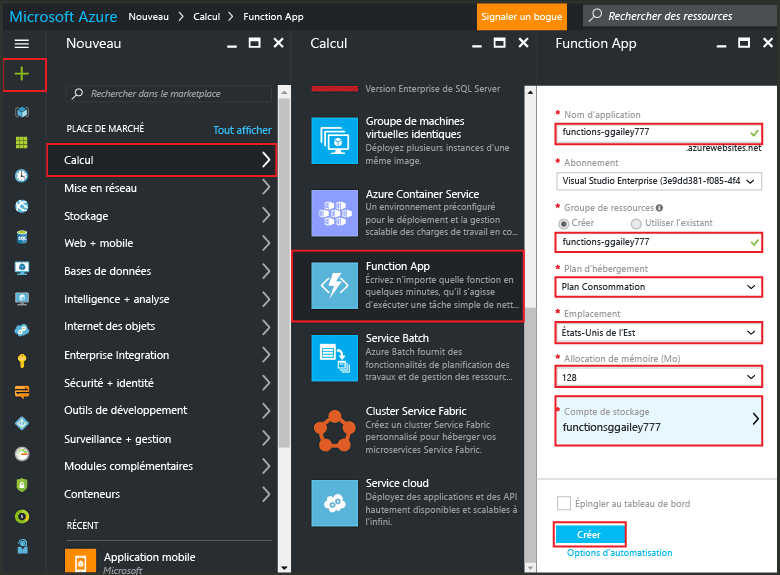

# Créer une fonction à l’aide du Portail Azure
## Vue d’ensemble
Azure Functions est une expérience de calcul à la demande pilotée par les événements, qui étend la plateforme d’application Azure existante avec des capacités d’implémenter du code déclenché par des événements se produisant dans d’autres services Azure, dans les produits SaaS et dans les systèmes locaux. Avec Azure Functions, vos applications sont mises à l’échelle à la demande, et vous payez uniquement pour les ressources que vous utilisez. Azure Functions vous permet de créer des unités de code planifiées ou déclenchées, et de les implémenter dans divers langages de programmation. Pour en savoir plus sur Azure Functions, consultez [Vue d’ensemble d’Azure Functions](functions-overview.md).

Cette rubrique indique comment utiliser le Portail Azure pour créer une fonction Azure Node.js « Hello World » simple, appelée par un déclencheur HTTP. Avant de pouvoir créer une fonction dans le Portail Azure, vous devez créer explicitement une Function App dans Azure App Service. Pour que la Function App soit créée automatiquement pour vous, consultez [le didacticiel de démarrage rapide des autres Azure Functions](functions-create-first-azure-function.md), une expérience de démarrage rapide plus simple, incluant une vidéo.

## Créer une Function App
Une application de fonction héberge l’exécution de vos fonctions dans Azure. Si vous ne disposez pas d’un compte Azure, vivez l’expérience [Try Functions](https://functions.azure.com/try) ou [créez un compte Azure gratuit](https://azure.microsoft.com/free/). Suivez ces étapes pour créer une Function App dans le portail Azure.

1. Accédez au [Portail Azure](https://portal.azure.com) et connectez-vous avec votre compte Azure.
2. Cliquez sur **+Nouveau** > **Calculer** > **Function App**, sélectionnez votre **Abonnement**, tapez dans le champ **Nom de l’application** un nom identifiant de manière unique votre Function App, puis spécifiez les paramètres suivants :
   
   * **[Groupe de ressources](../azure-resource-manager/resource-group-overview.md)** : sélectionnez **Créer** et entrez un nom pour votre nouveau groupe de ressources. Vous pouvez également choisir un groupe de ressources existant, mais vous ne serez peut-être pas en mesure de créer un plan App Service basé sur la consommation pour votre Function App.
   * **[Plan d’hébergement](../app-service/azure-web-sites-web-hosting-plans-in-depth-overview.md)** : vous pouvez définir ce paramètre sur l’une des valeurs suivantes : 
     * **Plan de consommation** : type de plan par défaut pour Azure Functions. Lorsque vous choisissez un plan de consommation, vous devez également renseigner le champ **Emplacement** et définir la valeur du champ **Allocation de mémoire** (en Mo). Pour plus d’informations sur les répercussions de l’allocation de mémoire sur les coûts, consultez [tarification Azure Functions](https://azure.microsoft.com/pricing/details/functions/). 
     * **Plan App Service** : un plan App Service exige de créer un **Plan App Service/Emplacement** ou d’en sélectionner un existant. Ces paramètres déterminent [l’emplacement, les fonctionnalités, les coûts et les ressources de calcul](https://azure.microsoft.com/pricing/details/app-service/) associés à votre application.  
   * **Compte de stockage**: chaque Function App nécessite un compte de stockage. Vous pouvez choisir un compte de stockage existant ou en créer un. 
     
     

    Notez que vous devez entrer un **nom d’application** valide, qui peut seulement contenir des lettres, des chiffres et des traits d’union. Le trait de soulignement (**_**) n’est pas un caractère autorisé.

3. Cliquez sur **Créer** pour configurer et déployer la nouvelle Function App.  

### Conditions requises pour le compte de stockage

Lorsque vous créez une application de fonction, vous devez créer ou lier un compte de stockage Azure à usage général qui prend en charge le stockage Blob, File d’attente et Table. En interne, les fonctions Azure utilise le stockage Azure pour les opérations telles que la gestion des déclencheurs et la journalisation des exécutions de fonctions. Certains comptes de stockage ne prennent pas en charge les files d’attente et les tables, comme les comptes de stockage Blob uniquement (notamment le stockage Premium) et les comptes de stockage à usage général avec la réplication ZRS. Ces comptes sont filtrés à partir du panneau du compte de stockage lors de la création d’une nouvelle application de fonction.
Lorsque vous utilisez le plan d’hébergement de la consommation, le contenu de l’application de fonction (par exemple, les fichiers de code de fonction et la configuration de liaison) est stocké sur des partages de fichiers Azure dans le compte de stockage principal. Si vous supprimez le compte de stockage principal, ce contenu sera supprimé et ne peut pas être récupéré.

Pour en savoir plus sur les types de compte de stockage, consultez la page [Présentation des services de stockage Azure] (.. / storage/storage-introduction.md#introducing-the-azure-storage-services).

## Créer une fonction
Les étapes suivantes permettent de créer une fonction à partir du démarrage rapide Azure Functions.

1. Dans l’onglet **Démarrage rapide**, cliquez sur **WebHook + API** et **JavaScript**, puis cliquez sur **Créer une fonction**. Une fonction Node.js prédéfinie est créée. 
   
    

2. (Facultatif) À ce stade du démarrage rapide, vous pouvez suivre une visite rapide des fonctionnalités Azure Functions dans le portail.    Après avoir terminé ou ignoré la visite, vous pouvez tester votre nouvelle fonction à l’aide du déclencheur HTTP.

## Tester la fonction
[!INCLUDE [Functions quickstart test](../../includes/functions-quickstart-test.md)]

## Étapes suivantes
[!INCLUDE [Functions quickstart next steps](../../includes/functions-quickstart-next-steps.md)]

[!INCLUDE [Getting Started Note](../../includes/functions-get-help.md)]

