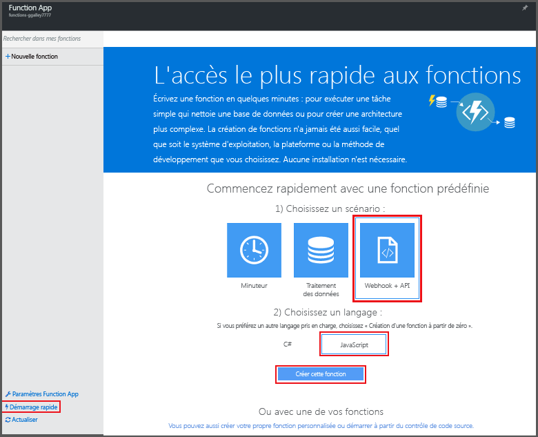
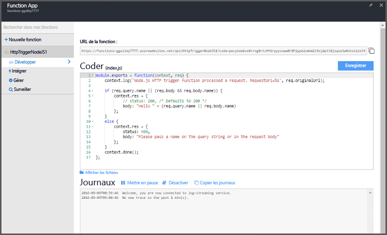

# Créer votre première fonction à l’aide du Portail Azure

Cette rubrique vous explique comment utiliser Azure Functions pour créer une fonction Azure « Hello World » appelée par une requête HTTP. Avant de pouvoir créer une fonction dans le portail Azure, vous devez créer une Function App pour héberger l’exécution sans serveur de votre fonction.

Pour suivre cette procédure de démarrage rapide, vous avez besoin d’un compte Azure. Vous pouvez obtenir un [compte gratuit](https://azure.microsoft.com/free/). Vous pouvez également [essayer Azure Functions](https://azure.microsoft.com/try/app-service/functions/) sans vous inscrire auprès d’Azure.

## Connexion à Azure

Connectez-vous au [portail Azure](https://portal.azure.com/).

## Créer une Function App

[!INCLUDE [functions-create-function-app-portal](../../includes/functions-create-function-app-portal.md)]

Pour plus d’informations, consultez [Créer une Function App à l’aide du Portail Azure](functions-create-function-app-portal.md).

## Créer une fonction
Ces étapes permettent de créer une fonction dans la nouvelle Function App à l’aide du démarrage rapide Azure Functions.

1. Cliquez sur le bouton **Nouveau**, cliquez sur **WebHook + API**, choisissez le langage de votre fonction, puis cliquez sur **Créer une fonction**. Une fonction est créée dans le langage que vous avez choisi à l’aide du modèle de fonction déclenché via HTTP.  
   
    

Une fois que la fonction est créée, vous pouvez la tester en envoyant une requête HTTP.

## Tester la fonction

Comme le modèle de fonction contient du code fonctionnel, vous pouvez tester votre nouvelle fonction immédiatement, directement dans le portail.

1. Dans votre Function App, cliquez sur la nouvelle fonction et examinez le code du modèle. Notez que la fonction attend une requête HTTP avec un *nom* transmis dans le corps du message ou dans une chaîne de requête. Lorsque la fonction s’exécute, cette valeur est renvoyée dans le message de réponse. L’exemple affiché est une fonction JavaScript.
   
2. Cliquez sur **Exécuter** pour exécuter la fonction. Vous voyez que l’exécution est déclenchée par une requête HTTP de test, que des informations sont écrites dans les journaux et que la réponse « Hello... » s’affiche dans la **sortie** dans l’onglet **Test**.
 
    

3. Dans la zone de texte **Corps de la demande**, remplacez la valeur de la propriété *name* par votre nom, puis cliquez de nouveau sur **Exécuter**. Cette fois, la réponse de la **sortie** contient votre nom.   

4. Pour déclencher l’exécution de la même fonction à partir d’un outil de test HTTP ou d’une autre fenêtre de navigateur, cliquez sur **</>Obtenir l’URL de la fonction**, copiez l’URL de la requête puis collez-la dans la barre d’adresse de l’outil ou d’un navigateur. Ajoutez la valeur de chaîne de requête `&name=yourname` à l’URL et exécutez la requête. Les mêmes informations sont écrites dans les journaux et la même chaîne est contenue dans le corps du message de réponse.

    

## Étapes suivantes
[!INCLUDE [Functions quickstart next steps](../../includes/functions-quickstart-next-steps.md)]

[!INCLUDE [Getting Started Note](../../includes/functions-get-help.md)]

