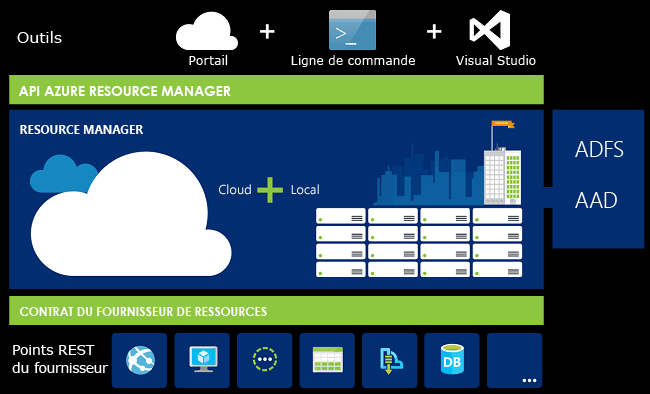
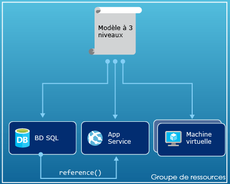
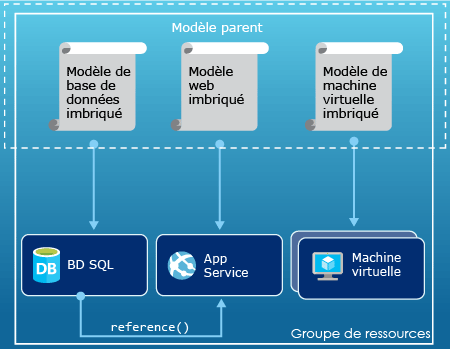
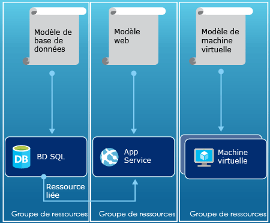

# <a name="azure-resource-manager-overview"></a>Présentation d’Azure Resource Manager
L’infrastructure de votre application est généralement constituée de plusieurs composants (peut-être une machine virtuelle, un compte de stockage et un réseau virtuel ou une application web, une base de données, un serveur de base de données et 3 services de tiers). Vous ne voyez pas ces composants comme des entités distinctes, mais plutôt comme des parties associées et interdépendantes d’une seule et même entité. Vous avez alors besoin de regrouper le déploiement, la gestion et la surveillance de ces différentes parties. Azure Resource Manager vous permet de travailler avec les ressources de solution sous forme de groupe. Vous pouvez déployer, mettre à jour ou supprimer toutes les ressources de votre solution dans le cadre d’une opération unique et coordonnée. Vous utilisez un modèle de déploiement pouvant fonctionner avec différents environnements (environnements de test, intermédiaire et de production). Le gestionnaire de ressources assure la sécurité, les fonctions d’audit et de balisage pour vous aider à gérer vos ressources après le déploiement. 

## <a name="terminology"></a>Terminologie
Si vous êtes un nouvel utilisateur d’Azure Resource Manager, vous pouvez ne pas connaître certains termes.

* **ressource** : élément gérable disponible dans Azure. Les ressources telles que les machines virtuelles, les comptes de stockage, les applications web, les bases de données et les réseaux virtuels sont courantes, mais il en existe beaucoup d’autres.
* **groupe de ressources** : conteneur réunissant les ressources associées d’une solution Azure. Le groupe de ressources peut inclure toutes les ressources de la solution, ou uniquement celles que vous souhaitez gérer en tant que groupe. Pour déterminer comment allouer des ressources aux groupes de ressources, choisissez l’approche la plus pertinente pour votre organisation. Voir [Groupes de ressources](#resource-groups).
* **fournisseur de ressources** : un service qui fournit les ressources que vous pouvez déployer et gérer via Resource Manager. Chaque fournisseur de ressources propose des opérations pour travailler avec les ressources déployées. Parmi les fournisseurs de ressources courants figurent Microsoft.Compute, qui fournit la ressource de machine virtuelle ; Microsoft.Storage, qui fournit la ressource du compte de stockage ; et Microsoft.Web, qui fournit des ressources liées aux applications web. Voir [Fournisseurs de ressources](#resource-providers).
* **Modèle Resource Manager** : fichier JSON (JavaScript Objet Notation) qui définit une ou plusieurs ressources à déployer vers un groupe de ressources. Il définit également les dépendances entre les ressources déployées. Le modèle peut être utilisé pour déployer les ressources de manière cohérente et répétée. Voir [Déploiement de modèle](#template-deployment).
* **syntaxe déclarative** : syntaxe qui vous permet de déclarer « Voici ce que je souhaite créer » sans avoir à écrire la séquence de commandes de programmation pour le créer. Le modèle Resource Manager est un exemple de syntaxe déclarative. Dans le fichier, vous définissez les propriétés afin de déployer l’infrastructure vers Azure. 

## <a name="the-benefits-of-using-resource-manager"></a>Avantages de l’utilisation de Resource Manager
Resource Manager offre plusieurs avantages :

* Vous pouvez déployer, gérer et surveiller toutes les ressources de votre solution comme un groupe, plutôt que de les gérer individuellement.
* Vous pouvez déployer votre solution à plusieurs reprises tout au long du cycle de vie de développement et avoir ainsi l’assurance que vos ressources présentent un état cohérent lors de leur déploiement.
* Vous pouvez gérer votre infrastructure à l’aide de modèles déclaratifs plutôt que de scripts.
* Vous pouvez définir les dépendances entre les ressources afin de les déployer dans le bon ordre.
* Vous pouvez appliquer le contrôle d’accès à tous les services dans votre groupe de ressources, car le contrôle d’accès en fonction du rôle (RBAC) est intégré en mode natif à la plateforme de gestion.
* Vous pouvez appliquer des balises aux ressources pour organiser logiquement toutes les ressources de votre abonnement.
* Vous pouvez clarifier la facturation de votre organisation en affichant les coûts d’un groupe de ressources partageant la même balise.  

Resource Manager propose une nouvelle façon de déployer et de gérer vos solutions. Si vous avez utilisé un modèle de déploiement antérieur et souhaitez obtenir des informations sur les modifications, consultez [Présentation du déploiement de Resource Manager et du déploiement classique](resource-manager-deployment-model.md).

## <a name="consistent-management-layer"></a>Couche de gestion cohérente
Resource Manager fournit une couche de gestion cohérente pour les tâches à effectuer via Azure PowerShell, l’interface de ligne de commande Azure, le portail Azure, l’API REST et les outils de développement. Tous les outils utilisent un ensemble commun d’opérations. Vous utilisez les outils qui vous conviennent le mieux et vous pouvez les utiliser indifféremment sans risque de confusion. 

L’illustration suivante montre comment tous les outils interagissent avec la même API Azure Resource Manager. L’API transmet les requêtes au service Resource Manager, qui authentifie et autorise les requêtes. Ensuite, Resource Manager achemine les requêtes vers les fournisseurs de ressources appropriés.



## <a name="guidance"></a>Assistance
Les suggestions suivantes vous aideront à tirer le meilleur parti de Resource Manager lorsque vous travaillez avec vos solutions.

1. Définissez et déployez votre infrastructure via la syntaxe déclarative dans les modèles du Resource Manager, et non via des commandes impératives.
2. Définissez toutes les étapes de déploiement et de configuration dans le modèle. Aucune étape manuelle ne devrait intervenir dans la configuration de votre solution.
3. Exécutez des commandes impératives pour gérer vos ressources, par exemple démarrer ou arrêter une application ou une machine.
4. Organisez des ressources avec le même cycle de vie dans un groupe de ressources. Utilisez des balises pour toute organisation des ressources.

Pour des recommandations sur les modèles, voir [Bonnes pratiques relatives à la création de modèles Azure Resource Manager](resource-manager-template-best-practices.md).

Pour obtenir des conseils sur l’utilisation de Resource Manager par les entreprises pour gérer efficacement les abonnements, voir [Structure d’Azure Enterprise - Gouvernance normative de l’abonnement](resource-manager-subscription-governance.md).

## <a name="resource-groups"></a>Groupes de ressources
Lorsque vous définissez votre groupe de ressources, vous devez prendre en compte certains facteurs importants :

1. Toutes les ressources de votre groupe doivent partager le même cycle de vie. Les opérations de déploiement, de mise à jour et de suppression porteront sur toutes les ressources du groupe. Si l’une des ressources, comme un serveur de base de données, doit exister dans un autre cycle de déploiement, elle doit appartenir à un autre groupe de ressources.
2. Chaque ressource ne peut exister que dans un seul groupe de ressources.
3. Vous pouvez à tout moment ajouter ou supprimer une ressource au niveau d’un groupe de ressources.
4. Vous pouvez déplacer une ressource d’un groupe de ressources vers un autre groupe. Pour plus d’informations, consultez la page [Déplacement de ressources vers un nouveau groupe de ressources ou un abonnement](resource-group-move-resources.md).
5. Un groupe de ressources peut contenir des ressources figurant dans différentes régions.
6. Un groupe de ressources peut être utilisé pour définir l’étendue du contrôle d’accès des actions administratives.
7. Une ressource peut interagir avec celles d’autres groupes de ressources. Cette interaction est courante lorsque les deux ressources sont liées, mais ne partagent pas le même cycle de vie (par exemple, applications Web connectées à une base de données).

Lorsque vous créez un groupe de ressources, vous devez indiquer un emplacement pour ce groupe. Vous vous demandez peut-être « Pourquoi un groupe de ressources a-t-il besoin un emplacement ? Et, si les ressources peuvent avoir des emplacements différents de celui du groupe de ressources, pourquoi l’emplacement du groupe de ressources a-t-il une importance ? ». Le groupe de ressources stocke des métadonnées sur les ressources. Par conséquent, lorsque vous spécifiez un emplacement pour le groupe de ressources, vous indiquez où stocker ces métadonnées. Pour des raisons de conformité, vous devrez peut-être vous assurer que vos données sont stockées dans une région particulière.

## <a name="resource-providers"></a>Fournisseurs de ressources
Chaque fournisseur de ressources propose un ensemble de ressources et d’opérations permettant de gérer un service Azure. Par exemple, si vous voulez stocker des clés et des secrets, vous travaillez avec le fournisseur de ressources **Microsoft.KeyVault** . Ce fournisseur de ressources offre un type de ressource appelé **coffres** pour créer le coffre de clés. 

Le nom d’un type de ressource est au format : **{fournisseur de ressources}/{type de ressource}**. Par exemple, le type de coffre de clés est **Microsoft.KeyVault\vaults**.

Avant de commencer à déployer vos ressources, vous devez connaître les fournisseurs de ressources disponibles. Connaître les noms des fournisseurs de ressources et des ressources vous permettra de mieux définir les ressources que vous allez déployer dans Azure. En outre, vous devez connaître les emplacements valides et les versions d’API pour chaque type de ressource. Pour plus d’informations, consultez [les types et les fournisseurs de ressources](resource-manager-supported-services.md).

## <a name="template-deployment"></a>Déploiement de modèle
Avec Resource Manager, vous pouvez créer un modèle (au format JSON) définissant l’infrastructure et la configuration de votre solution Azure. Un modèle vous permet de déployer votre solution à plusieurs reprises tout au long de son cycle de vie pour avoir la garantie que vos ressources présentent un état cohérent lors de leur déploiement. Lorsque vous créez une solution à partir du portail, cette solution inclut automatiquement un modèle de déploiement. Vous n’êtes pas contraint de créer votre modèle à partir de zéro, car vous pouvez partir du modèle de votre solution et le personnaliser en fonction de vos besoins spécifiques. Vous pouvez récupérer un modèle pour un groupe de ressources existant en exportant l’état actuel du groupe de ressources ou en affichant le modèle utilisé pour un déploiement particulier. L’affichage du [modèle exporté](resource-manager-export-template.md) est un moyen utile pour en découvrir plus sur sa syntaxe.

Pour en savoir plus sur le format du modèle et comment le construire, voir [Créer votre premier modèle Azure Resource Manager](resource-manager-create-first-template.md). Pour afficher la syntaxe JSON pour les types de ressources, voir [Définir des ressources dans les modèles Azure Resource Manager](/azure/templates/).

Resource Manager traite le modèle comme toute autre requête (voir l’image [Couche de gestion cohérente](#consistent-management-layer)). Il analyse le modèle et convertit sa syntaxe en opérations API REST pour les fournisseurs de ressources appropriés. Par exemple, lorsque Resource Manager reçoit un modèle avec la définition de ressource suivante :

```json
"resources": [
  {
    "apiVersion": "2016-01-01",
    "type": "Microsoft.Storage/storageAccounts",
    "name": "mystorageaccount",
    "location": "westus",
    "sku": {
      "name": "Standard_LRS"
    },
    "kind": "Storage",
    "properties": {
    }
  }
]
```

Il convertit la définition en opération API REST suivante, qui est envoyée au fournisseur de ressources Microsoft.Storage :

```HTTP
PUT
https://management.azure.com/subscriptions/{subscriptionId}/resourceGroups/{resourceGroupName}/providers/Microsoft.Storage/storageAccounts/mystorageaccount?api-version=2016-01-01
REQUEST BODY
{
  "location": "westus",
  "properties": {
  }
  "sku": {
    "name": "Standard_LRS"
  },   
  "kind": "Storage"
}
```

La manière dont vous définissez les modèles et les groupes de ressources dépend entièrement de vous et de la façon dont vous voulez gérer votre solution. Par exemple, vous pouvez déployer votre application à trois niveaux via un modèle unique pour un groupe de ressources unique.



Cependant, il est inutile de définir toute votre infrastructure dans un seul modèle. Il peut être judicieux de diviser les exigences de votre déploiement dans un ensemble de modèles ciblés destinés à un usage particulier. Vous pouvez facilement réutiliser ces modèles pour différentes solutions. Pour déployer une solution particulière, créez un modèle de référence qui relie tous les modèles requis. L’illustration suivante montre comment déployer une solution à trois niveaux via un modèle parent qui inclut trois modèles imbriqués.



Si vos niveaux vont avoir des cycles de vie distincts, vous pouvez déployer les trois niveaux dans des groupes de ressources séparés. Notez que les ressources peuvent toujours être liées aux ressources dans d’autres groupes.



Pour obtenir plus de conseils sur la conception de vos modèles, consultez [Schémas de conception des modèles Azure Resource Manager](best-practices-resource-manager-design-templates.md). Pour plus d’informations sur les modèles imbriqués, consultez [Utilisation de modèles liés avec Azure Resource Manager](resource-group-linked-templates.md).

Pour consulter une série en quatre parties sur l’automatisation du déploiement, consultez [Automatisation des déploiements d’applications sur des machines virtuelles Azure](../virtual-machines/windows/dotnet-core-1-landing.md?toc=%2fazure%2fvirtual-machines%2fwindows%2ftoc.json). Cette série couvre l’architecture, l’accès, la sécurité, la disponibilité, la mise à l’échelle et le déploiement des applications.

Azure Resource Manager analyse les dépendances pour vérifier que les ressources sont créées dans l’ordre approprié. Si une ressource dépend d’une valeur d’une autre ressource (par exemple, une machine virtuelle ayant besoin d’un compte de stockage pour les disques), vous devez définir une dépendance. Pour plus d’informations, consultez [Définition de dépendances dans des modèles Azure Resource Manager](resource-group-define-dependencies.md).

Vous pouvez également utiliser le modèle pour les mises à jour de l’infrastructure. Par exemple, vous pouvez ajouter une ressource à votre solution et ajouter des règles de configuration pour les ressources qui sont déjà déployées. Si le modèle spécifie de créer une ressource, mais que cette ressource existe déjà, Azure Resource Manager effectue une mise à jour au lieu de créer une autre ressource. Azure Resource Manager met à jour l’actif existant vers l’état qu’il présenterait s’il s’agissait d’une nouvelle ressource.  

Resource Manager fournit des extensions pour les cas qui nécessitent des opérations supplémentaires, comme l’installation d’un logiciel spécifique non inclus dans la configuration. Si vous utilisez déjà un service de gestion de configuration, comme DSC, Chef ou Puppet, vous pouvez continuer à travailler avec ce service en utilisant des extensions. Pour plus d’informations sur les extensions de machines virtuelles, consultez la page [À propos des extensions et des fonctionnalités des machines virtuelles](../virtual-machines/windows/extensions-features.md?toc=%2fazure%2fvirtual-machines%2fwindows%2ftoc.json). 

Pour finir, le modèle devient partie intégrante du code source de votre application. Vous pouvez l’archiver dans votre référentiel de code source et le mettre à jour à mesure que votre application évolue. Le modèle est modifiable par le biais de Visual Studio.

Une fois votre modèle défini, vous êtes prêt à déployer vos ressources dans Azure. Pour accéder aux commandes de déploiement des ressources, consultez les articles suivants :

* [Déployer des ressources à l’aide de modèles Resource Manager et d’Azure PowerShell](resource-group-template-deploy.md)
* [Déployer des ressources à l’aide de modèles Resource Manager et de l’interface de ligne de commande Azure](resource-group-template-deploy-cli.md)
* [Déployer des ressources à l’aide de modèles Resource Manager et du Portail Azure](resource-group-template-deploy-portal.md)
* [Déployer des ressources à l’aide de modèles Resource Manager et de l’API REST Resource Manager](resource-group-template-deploy-rest.md)

## <a name="tags"></a>Tags
Resource Manager fournit une fonctionnalité de balisage vous permettant de catégoriser les ressources en fonction de vos exigences de gestion ou de facturation. Utilisez des balises lorsque vous disposez d’un ensemble complexe de groupes de ressources et de ressources et que vous souhaitez les visualiser de la façon qui vous convient le mieux. Par exemple, vous pouvez baliser des ressources qui jouent un rôle similaire dans votre organisation ou qui appartiennent au même département. Sans balises, les utilisateurs de votre organisation peuvent créer plusieurs ressources qui peuvent s’avérer difficiles à identifier et à gérer ultérieurement. Par exemple, vous pouvez souhaiter supprimer toutes les ressources d’un projet particulier. Si ces ressources ne sont pas balisées pour le projet, vous devez les rechercher manuellement. Le balisage constitue un levier important pour réduire les coûts inutiles dans votre abonnement. 

Les ressources ne doivent pas nécessairement appartenir au même groupe de ressources pour partager une balise. Vous pouvez créer votre propre taxonomie de balise pour vous assurer que tous les utilisateurs de votre organisation utiliseront des balises communes plutôt que d’appliquer par inadvertance des balises légèrement différentes (telles que « dépt » au lieu de « département »).

L’exemple suivant présente une balise appliquée à une machine virtuelle.

```json
"resources": [    
  {
    "type": "Microsoft.Compute/virtualMachines",
    "apiVersion": "2015-06-15",
    "name": "SimpleWindowsVM",
    "location": "[resourceGroup().location]",
    "tags": {
        "costCenter": "Finance"
    },
    ...
  }
]
```

Pour récupérer toutes les ressources avec une valeur de balise, utilisez l’applet de commande PowerShell suivante :

```powershell
Find-AzureRmResource -TagName costCenter -TagValue Finance
```

Vous pouvez également exécuter la commande CLI Azure 2.0 suivante :

```azurecli
az resource list --tag costCenter=Finance
```

Vous avez également la possibilité de consulter les ressources balisées via le portail Azure.

Le [rapport d’utilisation](../billing/billing-understand-your-bill.md) de votre abonnement inclut les noms et valeurs de balises, ce qui vous permet de répartir les coûts en fonction des balises. Pour plus d’informations sur les balises, voir [Organisation des ressources Azure à l’aide de balises](resource-group-using-tags.md).

## <a name="access-control"></a>Contrôle d’accès
Resource Manager vous permet de déterminer les utilisateurs qui sont autorisés à exécuter des actions spécifiques pour votre organisation. Il intègre en mode natif le contrôle d’accès en fonction du rôle (RBAC) à la plate-forme de gestion et applique ce contrôle d’accès à tous les services de votre groupe de ressources. 

Il existe deux principaux concepts à comprendre lorsque vous travaillez avec le contrôle d’accès en fonction du rôle :

* Définitions des rôles : décrivent un jeu d’autorisations et peuvent être utilisées dans plusieurs affectations.
* Attributions de rôles : associer une définition à une identité (utilisateur ou groupe) pour une portée spécifique (abonnement, groupe de ressources ou ressource). Les portées inférieures héritent de la même attribution.

Vous pouvez ajouter des utilisateurs à des rôles prédéfinis spécifiques à la plate-forme et à la ressource. Par exemple, vous pouvez tirer parti du rôle prédéfini appelé Lecteur pour autoriser les utilisateurs à consulter des ressources sans pouvoir les modifier. Vous pouvez attribuer le rôle Lecteur aux utilisateurs de votre organisation qui ont besoin de ce type d’accès, puis appliquer ce rôle à l’abonnement, au groupe de ressources ou à la ressource.

Azure propose quatre rôles de plateforme :

1. Propriétaire : peut tout gérer, y compris les accès
2. Collaborateur : peut tout gérer, sauf les accès
3. Lecteur : peut tout afficher sans pouvoir apporter de modifications
4. Administrateur de l’accès utilisateur : peut gérer l’accès des utilisateurs aux ressources Azure

Azure fournit également plusieurs rôles spécifiques à la ressource, notamment :

1. Collaborateur de machine virtuelle : peut gérer des machines virtuelles, mais pas y accorder l’accès ; ne peut pas gérer le réseau virtuel ou le compte de stockage auquel elles sont connectées
2. Collaborateur de réseau : peut gérer toutes les ressources réseau, mais pas y accorder l’accès
3. Collaborateur de compte de stockage - peut gérer les comptes de stockage, mais pas y accorder l’accès
4. Collaborateur de serveurs SQL : peut gérer les serveurs et bases de données SQL, mais pas leurs stratégies de sécurité
5. Collaborateur de sites web : peut gérer les sites web, mais pas les plans web auxquels ils sont liés

Pour obtenir la liste complète des rôles et actions autorisés, consultez la page [RBAC : rôles intégrés](../active-directory/role-based-access-built-in-roles.md). Pour plus d’informations sur le contrôle d’accès en fonction du rôle, consultez [Contrôle d’accès en fonction du rôle d’Azure](../active-directory/role-based-access-control-configure.md). 

Dans certains cas, vous souhaiterez exécuter un code ou un script permettant d’accéder aux ressources, sans avoir à utiliser les informations d’identification d’un utilisateur. Vous pouvez choisir de créer une identité appelée « principal de service » de l’application et lui attribuer le rôle approprié. Resource Manager vous permet de créer des informations d’identification pour l’application et d’authentifier cette application par le biais d’une programmation. Pour en savoir plus sur la création de principaux de service, consultez l’une des rubriques suivantes :

* [Créer un principal du service pour accéder aux ressources à l’aide d’Azure PowerShell](resource-group-authenticate-service-principal.md)
* [Créer un principal du service pour accéder aux ressources à l’aide de l’interface de ligne de commande (CLI) Azure](resource-group-authenticate-service-principal-cli.md)
* [Utiliser le portail pour créer une application et un principal du service Azure Active Directory pouvant accéder aux ressources](resource-group-create-service-principal-portal.md)

Vous pouvez également verrouiller explicitement les ressources essentielles afin d’empêcher les utilisateurs de les supprimer ou de les modifier. Pour plus d’informations, consultez [Verrouiller des ressources avec Azure Resource Manager](resource-group-lock-resources.md).

## <a name="activity-logs"></a>Journaux d’activité
Resource Manager consigne dans un journal toutes les opérations de création, de modification ou de suppression d’une ressource. Vous pouvez utiliser les journaux d’activité pour rechercher une erreur lors de la résolution de problèmes ou pour surveiller la manière dont un utilisateur de votre organisation modifie une ressource. Pour afficher les journaux, sélectionnez **Journaux d’activité** dans le panneau **Paramètres** d’un groupe de ressources. Vous pouvez filtrer les journaux selon différentes valeurs, notamment en fonction de l’utilisateur ayant initié l’opération. Pour en savoir plus sur l’utilisation des journaux d’activité, voir [Opérations d’audit avec Resource Manager](resource-group-audit.md).

## <a name="customized-policies"></a>Stratégies personnalisées
Resource Manager vous permet de créer des stratégies personnalisées pour gérer vos ressources. Les types de stratégies que vous créez peuvent inclure divers scénarios. Vous pouvez appliquer une convention de dénomination des ressources, limiter les types et les instances de ressources qui peuvent être déployées ou limiter les régions qui peuvent héberger un type de ressource. Vous pouvez demander une valeur de balise sur les ressources pour organiser la facturation par service. Vous créez des stratégies pour vous aider à réduire les coûts et à assurer la cohérence de votre abonnement. 

Vous pouvez définir des stratégies au format JSON, puis les appliquer à votre abonnement ou dans un groupe de ressources. Il convient de faire une distinction entre les stratégies et le contrôle d’accès en fonction du rôle, car les stratégies sont en fait appliquées aux types de ressources.

L’exemple suivant illustre une stratégie qui garantit la cohérence des balises en spécifiant que toutes les ressources incluent une balise costCenter.

```json
{
  "if": {
    "not" : {
      "field" : "tags",
      "containsKey" : "costCenter"
    }
  },
  "then" : {
    "effect" : "deny"
  }
}
```

Il existe de nombreux autres types de stratégies que vous pouvez créer. Pour plus d'informations, consultez [Utiliser le service Policy pour gérer les ressources et contrôler l'accès](resource-manager-policy.md).

## <a name="sdks"></a>Kits de développement logiciel (SDK)
Des kits de développement logiciel (SDK) Azure sont disponibles en plusieurs langues sur plusieurs plates-formes.
Chacune de ces langues est disponible via le gestionnaire de package d’écosystème correspondant et GitHub.

Le code dans chaque kit de développement logiciel (SDK) est généré à partir de spécifications de l’API Azure RESTful.
Disponibles en open source, ces spécifications sont basées sur la spécification Swagger 2.0.
Le code des kits de développement logiciel (SDK) est généré par le biais d’un projet open source appelé AutoRest.
AutoRest transforme ces spécifications d’API RESTful en bibliothèques clientes dans plusieurs langues.
Si vous souhaitez améliorer des aspects du code généré dans les Kits de développement logiciel (SDK), l’ensemble des outils permettant de créer les Kits de développement logiciel (SDK) sont ouverts, disponibles gratuitement et basés sur un format de spécification d’API largement répandu.

Voici nos référentiels de Kit de développement logiciel (SDK) open source. N’hésitez pas à nous faire part de vos commentaires, des problèmes rencontrés et de vos demandes d’extraction.

[.NET](https://github.com/Azure/azure-sdk-for-net) | [Java](https://github.com/Azure/azure-sdk-for-java) | [Node.js](https://github.com/Azure/azure-sdk-for-node) | [PHP](https://github.com/Azure/azure-sdk-for-php) | [Python](https://github.com/Azure/azure-sdk-for-python) | [Ruby](https://github.com/Azure/azure-sdk-ruby)

> [!NOTE]
> Si le Kit de développement logiciel (SDK) ne fournit pas la fonctionnalité requise, vous pouvez également appeler l’ [API REST Azure](https://docs.microsoft.com/rest/api/resources/) directement.
> 
> 

## <a name="samples"></a>Exemples
### <a name="net"></a>.NET
* [Manage Azure resources and resource groups with .NET (Gérer des ressources et des groupes de ressources Azure avec .NET)](https://azure.microsoft.com/documentation/samples/resource-manager-dotnet-resources-and-groups/)
* [Deploy an SSH Enabled VM with a Template (Déployer une machine virtuelle compatible SSH à l’aide d’un modèle)](https://azure.microsoft.com/documentation/samples/resource-manager-dotnet-template-deployment/)

### <a name="java"></a>Java
* [Manage Azure resources (Gérer des ressources Azure)](https://azure.microsoft.com/documentation/samples/resources-java-manage-resource/)
* [Manage Azure resource groups (Gérer des groupes de ressources Azure)](https://azure.microsoft.com/documentation/samples/resources-java-manage-resource-group/)
* [Deploy an SSH Enabled VM with a Template (Déployer une machine virtuelle compatible SSH à l’aide d’un modèle)](https://azure.microsoft.com/documentation/samples/resources-java-deploy-using-arm-template/)

### <a name="nodejs"></a>Node.js
* [Manage Azure resources and resource groups with .NET (Gérer des ressources et des groupes de ressources Azure avec .NET)](https://azure.microsoft.com/documentation/samples/resource-manager-node-resources-and-groups/)
* [Deploy an SSH Enabled VM with a Template (Déployer une machine virtuelle compatible SSH à l’aide d’un modèle)](https://azure.microsoft.com/documentation/samples/resource-manager-node-template-deployment/)

### <a name="python"></a>Python
* [Manage Azure resources and resource groups with .NET (Gérer des ressources et des groupes de ressources Azure avec .NET)](https://azure.microsoft.com/documentation/samples/resource-manager-python-resources-and-groups/)
* [Deploy an SSH Enabled VM with a Template (Déployer une machine virtuelle compatible SSH à l’aide d’un modèle)](https://azure.microsoft.com/documentation/samples/resource-manager-python-template-deployment/)

### <a name="ruby"></a>Ruby
* [Manage Azure resources and resource groups with .NET (Gérer des ressources et des groupes de ressources Azure avec .NET)](https://azure.microsoft.com/documentation/samples/resource-manager-ruby-resources-and-groups/)
* [Deploy an SSH Enabled VM with a Template (Déployer une machine virtuelle compatible SSH à l’aide d’un modèle)](https://azure.microsoft.com/documentation/samples/resource-manager-ruby-template-deployment/)

Outre ces modèles, vous pouvez parcourir les modèles de la galerie.

[.NET](https://azure.microsoft.com/documentation/samples/?service=azure-resource-manager&platform=dotnet) | [Java](https://azure.microsoft.com/documentation/samples/?service=azure-resource-manager&platform=java) | [Node.js](https://azure.microsoft.com/documentation/samples/?service=azure-resource-manager&platform=nodejs) | [Python](https://azure.microsoft.com/documentation/samples/?service=azure-resource-manager&platform=python) | [Ruby](https://azure.microsoft.com/documentation/samples/?service=azure-resource-manager&platform=ruby)

## <a name="next-steps"></a>Étapes suivantes
* Pour une présentation simple de l’utilisation des modèles, consultez [Exporter un modèle Azure Resource Manager à partir de ressources existantes](resource-manager-export-template.md).
* Pour une procédure plus détaillée de création d’un modèle, voir [Créer votre premier modèle Azure Resource Manager](resource-manager-create-first-template.md).
* Pour comprendre les fonctions que vous pouvez utiliser dans un modèle, consultez [Fonctions de modèle](resource-group-template-functions.md)
* Pour plus d’informations sur l’utilisation de Visual Studio avec Resource Manager, consultez [Création et déploiement de groupes de ressources Azure à l’aide de Visual Studio](vs-azure-tools-resource-groups-deployment-projects-create-deploy.md).

Voici une vidéo de cette présentation :

>[!VIDEO https://channel9.msdn.com/Blogs/Azure-Documentation-Shorts/Azure-Resource-Manager-Overview/player]


[powershellref]: https://docs.microsoft.com/powershell/resourcemanager/azurerm.resources/v3.2.0/azurerm.resources

