# <a name="export-an-azure-resource-manager-template-from-existing-resources"></a>Exporter un modèle Azure Resource Manager à partir de ressources existantes
Resource Manager vous permet d’exporter un modèle Resource Manager à partir de ressources existantes de votre abonnement. Vous pouvez utiliser le modèle généré pour découvrir la syntaxe du modèle, ou pour automatiser le redéploiement de votre solution en fonction des besoins.

Il est important de noter qu’il existe deux façons différentes d’exporter un modèle :

* Vous pouvez exporter le modèle actuel que vous avez utilisé pour un déploiement. Le modèle exporté inclut l’ensemble des paramètres et des variables exactement comme ils apparaissent dans le modèle d’origine. Cette approche est utile lorsque vous avez déployé des ressources via le portail. À présent, vous souhaitez apprendre à définir le modèle pour créer ces ressources.
* Vous pouvez exporter le modèle qui représente l’état actuel du groupe de ressources. Le modèle exporté n’est pas basé sur un modèle utilisé pour le déploiement. Au lieu de cela, il crée un modèle qui est un instantané du groupe de ressources. Le modèle exporté a probablement de nombreuses valeurs codées en dur et pas autant de paramètres que vous pourriez généralement définir. Cette approche est utile lorsque vous avez modifié le groupe de ressources par le biais du portail ou de scripts. Vous devez maintenant capturer le groupe de ressources en tant que modèle.

Cette rubrique illustre les deux approches.

Dans ce didacticiel, vous allez vous connecter au portail Azure, créer un compte de stockage et exporter le modèle pour ce dernier. Vous allez ajouter un réseau virtuel pour modifier le groupe de ressources. Enfin, vous allez exporter un nouveau modèle qui représente son état actuel. Bien que cet article présente le cas d’une infrastructure simplifiée, vous pouvez suivre les mêmes étapes pour exporter un modèle dédié à une solution plus complexe.

## <a name="create-a-storage-account"></a>Créez un compte de stockage.
1. Dans le [Portail Azure](https://portal.azure.com), sélectionnez **Nouveau** > **Stockage** > **Compte de stockage**.
   
      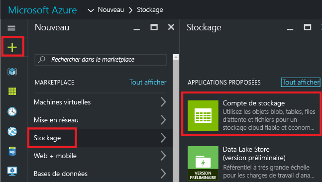
2. Créez un compte de stockage portant le nom **stockage**, vos initiales et la date. Le nom du compte de stockage doit être unique dans Azure. Si le nom est déjà utilisé, un message d’erreur s’affiche. Choisissez-en un autre. Concernant le groupe de ressources, sélectionnez **Créer**, puis appelez-le **ExportGroup**. Vous pouvez utiliser les valeurs par défaut des autres propriétés. Sélectionnez **Créer**.
   
      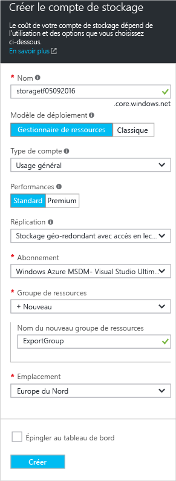

Ce déploiement peut prendre une minute. Une fois le déploiement terminé, votre abonnement contient le compte de stockage.

## <a name="view-a-template-from-deployment-history"></a>Afficher un modèle de l’historique de déploiement
1. Accédez au panneau de groupe de ressources de votre nouveau groupe de ressources. Vous pouvez voir que le panneau affiche le résultat du dernier déploiement. Sélectionnez ce lien.
   
      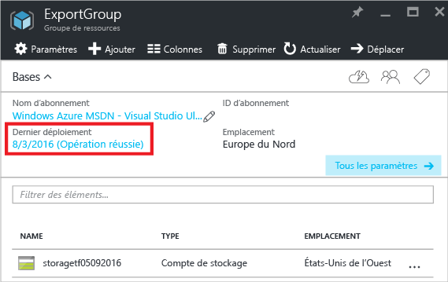
2. Un historique des déploiements du groupe s’affiche. Dans votre cas, le panneau affiche certainement un seul déploiement. Sélectionnez ce déploiement.
   
     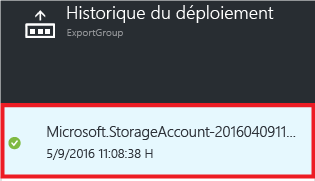
3. Le panneau affiche un résumé du déploiement. Le résumé inclut l’état du déploiement et ses opérations, ainsi que les valeurs de paramètres que vous avez fournies. Pour voir le modèle utilisé pour le déploiement, sélectionnez **Afficher le modèle**.
   
     
4. Resource Manager récupère pour vous les six fichiers ci-dessous :
   
   1. **Modèle** - Modèle définissant l’infrastructure de votre solution. Lorsque vous avez créé le compte de stockage via le portail, Resource Manager a utilisé un modèle pour le déployer et a enregistré ce modèle pour référence ultérieure.
   2. **Paramètres** - Fichier de paramètres que vous pouvez utiliser pour transmettre des valeurs au cours du déploiement. Il contient les valeurs que vous avez fournies lors du premier déploiement, mais vous pouvez modifier ces valeurs lors du redéploiement du modèle.
   3. **CLI** - Fichier de script d’interface de ligne de commande Azure que vous pouvez utiliser pour déployer le modèle.
   3. **CLI 2.0** - Fichier script d’interface de ligne de commande Azure que vous pouvez utiliser pour déployer le modèle.
   4. **PowerShell** - Fichier de script Azure PowerShell que vous pouvez utiliser pour déployer le modèle.
   5. **.NET** - Classe .NET que vous pouvez utiliser pour déployer le modèle.
   6. **Ruby** - Classe Ruby que vous pouvez utiliser pour déployer le modèle.
      
      Les fichiers sont disponibles via des liens dans le panneau. Par défaut, le panneau affiche le modèle.
      
       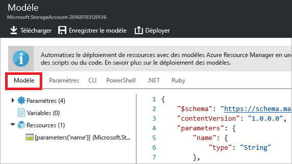
      
      Regardons de plus près le modèle. Ce modèle doit ressembler à ce qui suit :
      
      ```json
      {
        "$schema": "https://schema.management.azure.com/schemas/2015-01-01/deploymentTemplate.json#",
        "contentVersion": "1.0.0.0",
        "parameters": {
          "name": {
            "type": "String"
          },
          "accountType": {
            "type": "String"
          },
          "location": {
            "type": "String"
          },
          "encryptionEnabled": {
            "defaultValue": false,
            "type": "Bool"
          }
        },
        "resources": [
          {
            "type": "Microsoft.Storage/storageAccounts",
            "sku": {
              "name": "[parameters('accountType')]"
            },
            "kind": "Storage",
            "name": "[parameters('name')]",
            "apiVersion": "2016-01-01",
            "location": "[parameters('location')]",
            "properties": {
              "encryption": {
                "services": {
                  "blob": {
                    "enabled": "[parameters('encryptionEnabled')]"
                  }
                },
                "keySource": "Microsoft.Storage"
              }
            }
          }
        ]
      }
      ```

Il s’agit du modèle réel utilisé pour créer votre compte de stockage. Notez qu’il contient des paramètres qui vous permettent de déployer différents types de comptes de stockage. Pour plus d’informations sur la structure du modèle, consultez [Création de modèles Azure Resource Manager](resource-group-authoring-templates.md). Pour obtenir la liste complète des fonctions que vous pouvez utiliser dans un modèle, consultez [Fonctions des modèles Azure Resource Manager](resource-group-template-functions.md).

## <a name="add-a-virtual-network"></a>Ajouter un réseau virtuel
Le modèle que vous avez téléchargé dans la section précédente représentait l’infrastructure de ce déploiement d’origine. Toutefois, il ne sera pas pris en compte dans les modifications que vous apporterez après le déploiement.
Pour illustrer ce problème, modifions le groupe de ressources en ajoutant un réseau virtuel via le portail.

1. Dans le volet du groupe de ressources, sélectionnez **Ajouter**.
   
      
2. Sélectionnez **Réseau virtuel** à partir des ressources disponibles.
   
      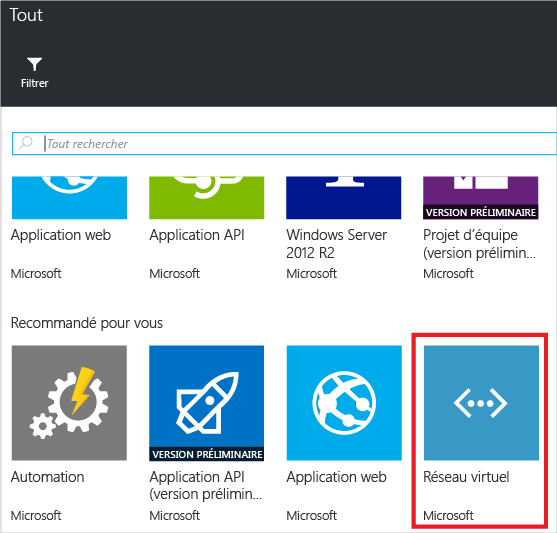
3. Nommez votre réseau virtuel **VNET**et utilisez les valeurs par défaut pour les autres propriétés. Sélectionnez **Créer**.
   
      
4. Une fois le réseau virtuel correctement déployé vers votre groupe de ressources, examinez à nouveau l’historique de déploiement. Vous voyez maintenant deux déploiements. Si le second déploiement ne s’affiche pas, vous devrez peut-être fermer le volet du groupe de ressources et le réouvrir. Sélectionnez un déploiement plus récent.
   
      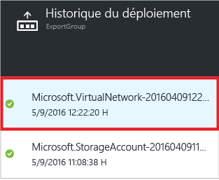
5. Affichez le modèle de ce déploiement. Vous remarquerez qu’il définit uniquement le réseau virtuel. Il n’inclut pas le compte de stockage déployé précédemment. Vous n’avez plus de modèle qui représente toutes les ressources de votre groupe de ressources.

## <a name="export-the-template-from-resource-group"></a>Exportation du modèle à partir d’un groupe de ressources
Pour connaître l’état actuel de votre groupe de ressources, exportez un modèle qui affiche un instantané du groupe de ressources.  

> [!NOTE]
> Vous ne pouvez pas exporter un modèle pour un groupe de ressources qui contient plus de 200 ressources.
> 
> 

1. Pour afficher le modèle pour un groupe de ressources, sélectionnez **Script d’automatisation**.
   
      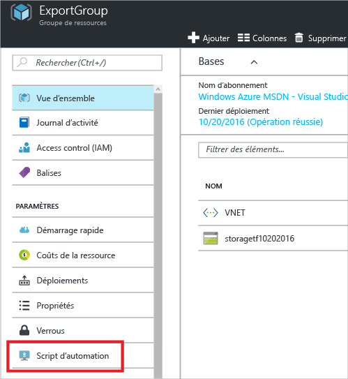
   
     Tous les types de ressources prennent en charge la fonction de modèle d’exportation. Si votre groupe de ressources contient uniquement le compte de stockage et le réseau virtuel indiqués dans cet article, aucune erreur ne s’affiche. Cependant, si vous avez créé d’autres types de ressources, vous pouvez rencontrer une erreur indiquant qu’il existe un problème avec l’exportation. Vous allez apprendre à gérer ces problèmes dans la section [Résoudre les problèmes d’exportation](#fix-export-issues) .
2. Vous voyez à nouveau les six fichiers que vous pouvez utiliser pour redéployer la solution, mais cette fois le modèle est un peu différent. Ce modèle comporte seulement&2; paramètres : un pour le nom du compte de stockage et un pour le nom du réseau virtuel.

  ```json
  "parameters": {
    "virtualNetworks_VNET_name": {
      "defaultValue": "VNET",
      "type": "String"
    },
    "storageAccounts_storagetf05092016_name": {
      "defaultValue": "storagetf05092016",
      "type": "String"
    }
  },
  ```
   
     Resource Manager n’a pas récupéré les modèles que vous avez utilisés pendant le déploiement. Au lieu de cela, il a généré un nouveau modèle basé sur la configuration actuelle des ressources. Par exemple, le modèle définit l’emplacement et la valeur de réplication du compte de stockage sur :

  ```json 
  "location": "northeurope",
  "tags": {},
  "properties": {
    "accountType": "Standard_RAGRS"
  },
  ```
3. Vous avez deux possibilités pour continuer à travailler avec ce modèle. Vous pouvez d’une part télécharger le modèle et travailler dessus en local avec un éditeur JSON. Vous pouvez également enregistrer le modèle dans votre bibliothèque et travailler dessus au moyen du portail.
   
     Si vous êtes habitué à utiliser un éditeur JSON comme [VS Code](resource-manager-vs-code.md) ou [Visual Studio](vs-azure-tools-resource-groups-deployment-projects-create-deploy.md), il peut être intéressant de télécharger le modèle en local et d’utiliser cet éditeur. Si vous ne disposez pas d’un éditeur JSON, vous préférerez peut-être modifier le modèle sur le portail. Le reste de cette rubrique suppose que vous avez enregistré le modèle dans votre bibliothèque sur le portail. Toutefois, les modifications que vous apportez à la syntaxe du modèle sont les mêmes en local avec un éditeur JSON et sur le portail.
   
     Pour travailler en local, sélectionnez **Télécharger**.
   
      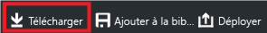
   
     Pour travailler sur le portail, sélectionnez **Ajouter à la bibliothèque**.
   
      
   
     Lorsque vous ajoutez un modèle à la bibliothèque, donnez-lui un nom et une description. Sélectionnez ensuite **Enregistrer**.
   
     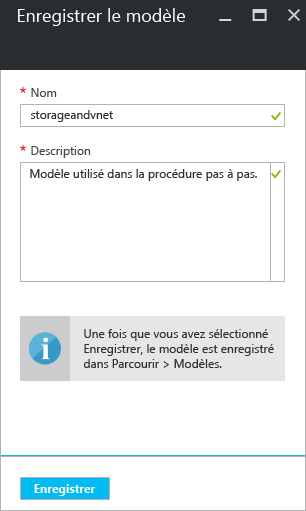
4. Pour afficher un modèle enregistré dans votre bibliothèque, sélectionnez **Plus de services**, tapez **Modèles** pour filtrer les résultats et sélectionnez **Modèles**.
   
      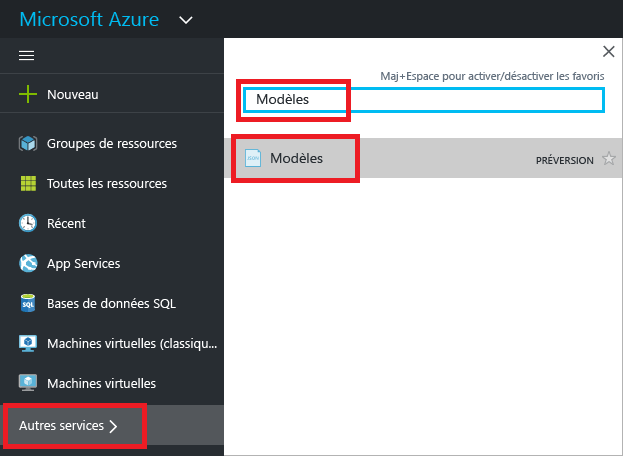
5. Sélectionnez le modèle possédant le nom que vous avez enregistré.
   
      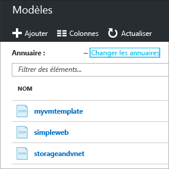

## <a name="customize-the-template"></a>Personnaliser le modèle
Le modèle exporté fonctionne bien si vous souhaitez créer le même compte de stockage et le même réseau virtuel pour tous les déploiements. Toutefois, Resource Manager propose des options permettant de déployer des modèles avec une plus grande flexibilité. Par exemple, pendant le déploiement, vous pouvez si vous le souhaitez spécifier le type de compte de stockage à créer ou les valeurs à utiliser pour le préfixe d’adresse de réseau virtuel et le préfixe de sous-réseau.

Dans cette section, vous ajoutez des paramètres au modèle exporté pour pouvoir réutiliser le modèle lors du déploiement de ces ressources vers d’autres environnements. Vous ajoutez également des fonctionnalités à votre modèle pour diminuer la probabilité de rencontrer une erreur lors du déploiement de votre modèle. Vous n’avez plus à trouver un nom unique pour votre compte de stockage. C’est le modèle qui le crée. Vous restreignez les valeurs pouvant être spécifiées pour le type de compte de stockage aux options valides seulement.

1. Sélectionnez **Modifier** pour personnaliser le modèle.
   
     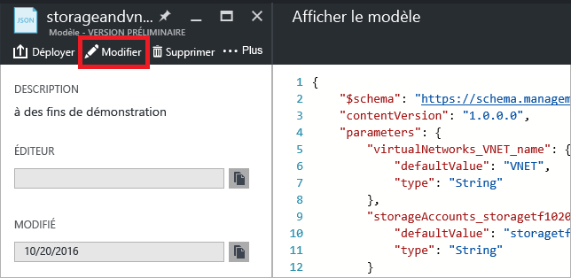
2. Sélectionnez le modèle.
   
     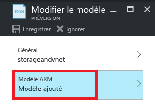
3. Pour permettre la transmission des valeurs à spécifier pendant le déploiement, remplacez la section **parameters** par les nouvelles définitions de paramètres. Notez les valeurs autorisées de **allowedValues** pour **storageAccount_accountType**. Si vous fournissez accidentellement une valeur non valide, cette erreur est reconnue avant le début du déploiement. Notez que vous devez uniquement fournir un préfixe comme nom du compte de stockage, et que ce préfixe est limité à 11 caractères. En limitant le préfixe à 11 caractères, vous êtes certain que le nom complet ne dépasse pas le nombre maximal de caractères pour un compte de stockage. Le préfixe vous permet d’appliquer une convention d’affectation de noms pour vos comptes de stockage. Vous allez apprendre à créer un nom unique à l’étape suivante.

  ```json
  "parameters": {
    "storageAccount_prefix": {
      "type": "string",
      "maxLength": 11
    },
    "storageAccount_accountType": {
      "defaultValue": "Standard_RAGRS",
      "type": "string",
      "allowedValues": [
        "Standard_LRS",
        "Standard_ZRS",
        "Standard_GRS",
        "Standard_RAGRS",
        "Premium_LRS"
      ]
    },
    "virtualNetwork_name": {
      "type": "string"
    },
    "addressPrefix": {
      "defaultValue": "10.0.0.0/16",
      "type": "string"
    },
    "subnetName": {
      "defaultValue": "subnet-1",
      "type": "string"
    },
    "subnetAddressPrefix": {
      "defaultValue": "10.0.0.0/24",
      "type": "string"
    }
  },
  ```

4. La section **variables** de votre modèle est actuellement vide. La section **variables** vous permet de créer des valeurs qui simplifient la syntaxe pour le reste de votre modèle. Remplacez cette section par une nouvelle définition de variable. La variable **storageAccount_name** concatène le préfixe du paramètre en une chaîne unique générée en se basant sur l’identificateur du groupe de ressources. Vous n’avez plus à trouver un nom unique lorsque vous fournissez une valeur de paramètre.

  ```json
  "variables": {
    "storageAccount_name": "[concat(parameters('storageAccount_prefix'), uniqueString(resourceGroup().id))]"
  },
  ```

5. Pour utiliser les paramètres et la variable dans les définitions de ressources, remplacez la section **resources** par les nouvelles définitions de ressources. Notez que peu de choses ont changé dans les définitions de ressources, en dehors de la valeur affectée à la propriété de ressource. Les propriétés sont les mêmes que celles du modèle exporté. Vous affectez simplement des propriétés aux valeurs de paramètres, au lieu de valeurs codées en dur. L’emplacement des ressources est défini pour utiliser le même emplacement que le groupe de ressources via l’expression **resourceGroup().location** . La variable que vous avez créée pour le nom de compte de stockage est référencée via l’expression **variables** .

  ```json
  "resources": [
    {
      "type": "Microsoft.Network/virtualNetworks",
      "name": "[parameters('virtualNetwork_name')]",
      "apiVersion": "2015-06-15",
      "location": "[resourceGroup().location]",
      "properties": {
        "addressSpace": {
          "addressPrefixes": [
            "[parameters('addressPrefix')]"
          ]
        },
        "subnets": [
          {
            "name": "[parameters('subnetName')]",
            "properties": {
              "addressPrefix": "[parameters('subnetAddressPrefix')]"
            }
          }
        ]
      },
      "dependsOn": []
    },
    {
      "type": "Microsoft.Storage/storageAccounts",
      "name": "[variables('storageAccount_name')]",
      "apiVersion": "2015-06-15",
      "location": "[resourceGroup().location]",
      "tags": {},
      "properties": {
        "accountType": "[parameters('storageAccount_accountType')]"
      },
      "dependsOn": []
    }
  ]
  ```

6. Sélectionnez **OK** lorsque vous avez terminé la modification du modèle.
7. Sélectionnez **Enregistrer** pour enregistrer les modifications apportées au modèle.
   
     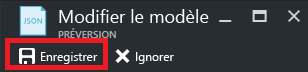
8. Pour déployer le modèle mis à jour, sélectionnez **Déployer**.
   
     
9. Fournissez des valeurs de paramètres, puis sélectionnez le nouveau groupe de ressources sur lequel vous souhaitez déployer les ressources.

## <a name="update-the-downloaded-parameters-file"></a>Mettre à jour le fichier de paramètres téléchargé
Si vous travaillez avec les fichiers téléchargés (et non la bibliothèque du portail), vous devez mettre à jour le fichier de paramètres téléchargé. Il ne correspond plus aux paramètres de votre modèle. Vous n’avez pas à utiliser un fichier de paramètres, mais cela peut simplifier le processus de redéploiement d’un environnement. Utilisez les valeurs par défaut définies dans le modèle pour la plupart des paramètres, de manière à ce que votre fichier de paramètres ait uniquement besoin de deux valeurs.

Remplacez le contenu du fichier parameters.json par :

```json
{
  "$schema": "https://schema.management.azure.com/schemas/2015-01-01/deploymentParameters.json#",
  "contentVersion": "1.0.0.0",
  "parameters": {
    "storageAccount_prefix": {
      "value": "storage"
    },
    "virtualNetwork_name": {
      "value": "VNET"
    }
  }
}
```

Le fichier de paramètres mis à jour fournit seulement des valeurs pour les paramètres qui n’ont pas de valeur par défaut. Vous pouvez fournir des valeurs pour les autres paramètres si vous voulez une autre valeur que la valeur par défaut.

## <a name="fix-export-issues"></a>Résoudre les problèmes d’exportation
Tous les types de ressources prennent en charge la fonction de modèle d’exportation. Resource Manager n’exporte pas certains types de ressources spécifiques, afin d’empêcher l’exposition de données sensibles. Par exemple, si vous avez une chaîne de connexion dans la configuration de votre site, vous souhaitez probablement qu’il ne s’affiche pas explicitement dans un modèle exporté. Pour contourner ce problème, ajoutez manuellement les ressources manquantes à votre modèle.

> [!NOTE]
> Vous rencontrerez des problèmes d’exportation uniquement lors de l’exportation à partir d’un groupe de ressources et non à partir de votre historique de déploiement. Si votre dernier déploiement représente précisément l’état actuel du groupe de ressources, vous devez exporter le modèle à partir de l’historique de déploiement, plutôt que depuis le groupe de ressources. Procédez à une exportation à partir d’un groupe de ressources lorsque vous avez apporté des modifications au groupe de ressources qui ne sont pas définies dans un modèle unique.
> 
> 

Par exemple, si vous exportez un modèle pour un groupe de ressources contenant une application web, une base de données SQL et une chaîne de connexion dans la configuration de site, le message suivant s’affiche :

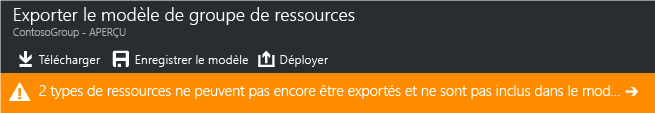

La sélection du message vous montre exactement les types de ressources qui n’ont pas été exportés. 

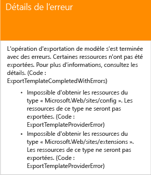

Cette rubrique présente les correctifs courants.

### <a name="connection-string"></a>Chaîne de connexion
Dans la ressource de sites web, ajoutez une définition pour la chaîne de connexion à la base de données :

```json
{
  "type": "Microsoft.Web/sites",
  ...
  "resources": [
    {
      "apiVersion": "2015-08-01",
      "type": "config",
      "name": "connectionstrings",
      "dependsOn": [
          "[concat('Microsoft.Web/Sites/', parameters('<site-name>'))]"
      ],
      "properties": {
          "DefaultConnection": {
            "value": "[concat('Data Source=tcp:', reference(concat('Microsoft.Sql/servers/', parameters('<database-server-name>'))).fullyQualifiedDomainName, ',1433;Initial Catalog=', parameters('<database-name>'), ';User Id=', parameters('<admin-login>'), '@', parameters('<database-server-name>'), ';Password=', parameters('<admin-password>'), ';')]",
              "type": "SQLServer"
          }
      }
    }
  ]
}
```    

### <a name="web-site-extension"></a>Extension du site web
Dans la ressource de sites web, ajoutez une définition à installer par le biais de code :

```json
{
  "type": "Microsoft.Web/sites",
  ...
  "resources": [
    {
      "name": "MSDeploy",
      "type": "extensions",
      "location": "[resourceGroup().location]",
      "apiVersion": "2015-08-01",
      "dependsOn": [
        "[concat('Microsoft.Web/sites/', parameters('<site-name>'))]"
      ],
      "properties": {
        "packageUri": "[concat(parameters('<artifacts-location>'), '/', parameters('<package-folder>'), '/', parameters('<package-file-name>'), parameters('<sas-token>'))]",
        "dbType": "None",
        "connectionString": "",
        "setParameters": {
          "IIS Web Application Name": "[parameters('<site-name>')]"
        }
      }
    }
  ]
}
```

### <a name="virtual-machine-extension"></a>Extension de machine virtuelle
Pour obtenir des exemples d’extensions de machine virtuelle, consultez [Exemples de configuration d’extension de machine virtuelle Azure Windows](../virtual-machines/virtual-machines-windows-extensions-configuration-samples.md?toc=%2fazure%2fvirtual-machines%2fwindows%2ftoc.json).

### <a name="virtual-network-gateway"></a>Passerelle de réseau virtuel
Ajoutez un type de ressource de passerelle de réseau virtuel.

```json
{
  "type": "Microsoft.Network/virtualNetworkGateways",
  "name": "[parameters('<gateway-name>')]",
  "apiVersion": "2015-06-15",
  "location": "[resourceGroup().location]",
  "properties": {
    "gatewayType": "[parameters('<gateway-type>')]",
    "ipConfigurations": [
      {
        "name": "default",
        "properties": {
          "privateIPAllocationMethod": "Dynamic",
          "subnet": {
            "id": "[resourceId('Microsoft.Network/virtualNetworks/subnets', parameters('<vnet-name>'), parameters('<new-subnet-name>'))]"
          },
          "publicIpAddress": {
            "id": "[resourceId('Microsoft.Network/publicIPAddresses', parameters('<new-public-ip-address-Name>'))]"
          }
        }
      }
    ],
    "enableBgp": false,
    "vpnType": "[parameters('<vpn-type>')]"
  },
  "dependsOn": [
    "Microsoft.Network/virtualNetworks/codegroup4/subnets/GatewaySubnet",
    "[concat('Microsoft.Network/publicIPAddresses/', parameters('<new-public-ip-address-Name>'))]"
  ]
},
```

### <a name="local-network-gateway"></a>Passerelle de réseau local
Ajoutez un type de ressource de passerelle de réseau local.

```json
{
    "type": "Microsoft.Network/localNetworkGateways",
    "name": "[parameters('<local-network-gateway-name>')]",
    "apiVersion": "2015-06-15",
    "location": "[resourceGroup().location]",
    "properties": {
      "localNetworkAddressSpace": {
        "addressPrefixes": "[parameters('<address-prefixes>')]"
      }
    }
}
```

### <a name="connection"></a>Connexion
Ajoutez un type de ressource de connexion.

```json
{
    "apiVersion": "2015-06-15",
    "name": "[parameters('<connection-name>')]",
    "type": "Microsoft.Network/connections",
    "location": "[resourceGroup().location]",
    "properties": {
        "virtualNetworkGateway1": {
        "id": "[resourceId('Microsoft.Network/virtualNetworkGateways', parameters('<gateway-name>'))]"
      },
      "localNetworkGateway2": {
        "id": "[resourceId('Microsoft.Network/localNetworkGateways', parameters('<local-gateway-name>'))]"
      },
      "connectionType": "IPsec",
      "routingWeight": 10,
      "sharedKey": "[parameters('<shared-key>')]"
    }
},
```


## <a name="next-steps"></a>Étapes suivantes
Félicitations ! Vous avez appris comment exporter un modèle à partir des ressources que vous avez créées dans le portail.

* Vous pouvez déployer un modèle avec [PowerShell](resource-group-template-deploy.md), [l’interface de ligne de commande Azure](resource-group-template-deploy-cli.md) ou [l’API REST](resource-group-template-deploy-rest.md).
* Pour savoir comment exporter un modèle via PowerShell, consultez [Utilisation d’Azure PowerShell avec Azure Resource Manager](powershell-azure-resource-manager.md).
* Pour savoir comment exporter un modèle via l’interface de ligne de commande Azure, consultez [Utiliser l’interface de ligne de commande Azure pour Mac, Linux et Windows avec Azure Resource Manager](xplat-cli-azure-resource-manager.md).


