# Création et déploiement de groupes de ressources Azure à l’aide de Visual Studio
Avec Visual Studio et les [Kits de développement logiciel (SDK) Azure](https://azure.microsoft.com/downloads/), vous pouvez créer un projet qui déploie votre infrastructure et votre code sur Azure. Par exemple, vous pouvez définir l’hôte web, le site web et la base de données de votre application, et déployer cette infrastructure parallèlement au code. Ou bien, vous pouvez définir une machine virtuelle, le réseau virtuel et le compte de stockage, puis déployer cette infrastructure parallèlement à un script exécuté sur la machine virtuelle. Le projet de déploiement du **Groupe de ressources Azure** vous permet de déployer toutes les ressources nécessaires en une seule opération reproductible. Pour plus d’informations sur le déploiement et la gestion des ressources, consultez [Présentation d’Azure Resource Manager](resource-group-overview.md).

Les projets de groupe de ressources Azure contiennent des modèles JSON Azure Resource Manager, qui définissent les ressources que vous déployez sur Azure. Pour en savoir plus sur les éléments du modèle Resource Manager, consultez [Création de modèles Azure Resource Manager](resource-group-authoring-templates.md). Visual Studio vous permet de modifier ces modèles et fournit des outils qui simplifient l’utilisation des modèles.

Dans cette rubrique, vous déployez une application web et SQL Database. Toutefois, les étapes sont presque identiques pour tous les types de ressources. Vous pouvez tout aussi facilement déployer une machine virtuelle et ses ressources associées. Visual Studio fournit de nombreux modèles de démarrage différents pour déployer des scénarios courants.

Cet article présente Visual Studio 2015 Update 2 et le Kit de développement logiciel (SDK) Microsoft Azure pour .NET 2.9. Si vous utilisez Visual Studio 2013 avec le Kit de développement logiciel (SDK) Azure 2.9, votre expérience sera en grande partie la même. Vous pouvez également utiliser la version 2.6 ou les versions ultérieures du Kit de développement logiciel (SDK) Azure, mais l’interface utilisateur que vous verrez peut différer de celle illustrée dans cet article. Nous vous recommandons fortement d’installer la dernière version du [Kit de développement logiciel (SDK) Azure](https://azure.microsoft.com/downloads/) avant de commencer à suivre les étapes. 

## Créer un projet de groupe de ressources Azure
Au cours de cette procédure, vous allez apprendre à créer un projet de groupe de ressources Azure avec un modèle **Application web + SQL** .

1. Dans Visual Studio, sélectionnez **Fichier**, **Nouveau projet**, puis choisissez **C#** ou **Visual Basic**. Choisissez ensuite **Cloud** et le projet de **Groupe de ressources Azure**.
   
    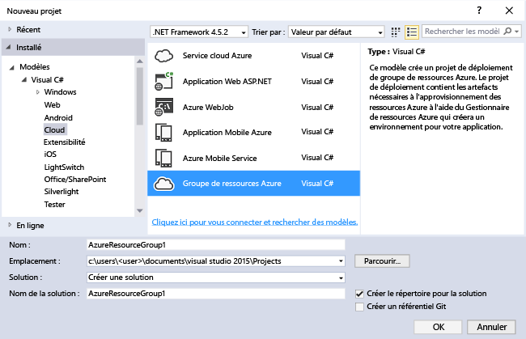
2. Choisissez le modèle à déployer sur Azure Resource Manager. Notez qu’il existe de nombreuses options différentes selon le type de projet que vous voulez déployer. Pour cet exemple, sélectionnez le modèle **Application web + SQL** .
   
    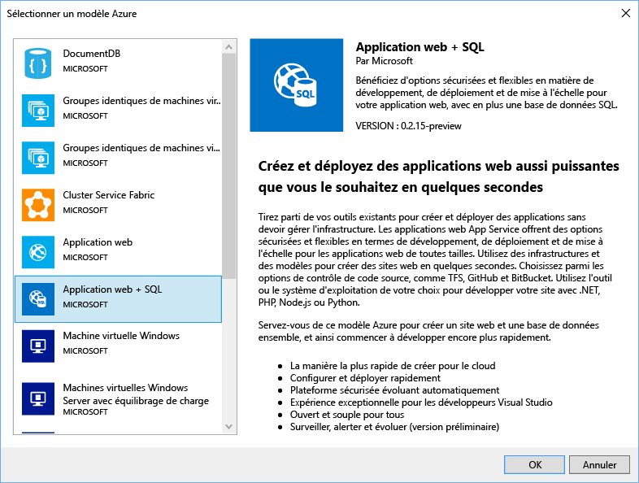
   
    Le modèle que vous choisissez est seulement un point de départ ; vous pouvez ajouter et supprimer des ressources en fonction des besoins de votre scénario.
   
   > [!NOTE]
   > Visual Studio extrait une liste des modèles disponibles en ligne. La liste peut évoluer.
   > 
   > 
   
    Visual Studio crée un projet de déploiement de groupe de ressources Azure pour une application web et une base de données SQL.
3. Pour voir les éléments créés, développez les nœuds du projet de déploiement.
   
    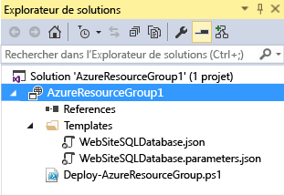
   
    Puisque nous avons choisi le modèle Application web + SQL pour cet exemple, vous voyez les fichiers suivants : 
   
   | Nom de fichier | Description |
   | --- | --- |
   | Deploy-AzureResourceGroup.ps1 |Script PowerShell qui appelle des commandes PowerShell à déployer sur Azure Resource Manager. **Remarque** Visual Studio utilise ce script PowerShell pour déployer votre modèle. Les modifications apportées à ce script affectent également le déploiement dans Visual Studio. Par conséquent, modifiez ce script avec prudence. |
   | WebSiteSQLDatabase.json |Le modèle Resource Manager qui définit l’infrastructure que vous voulez déployer sur Azure, et les paramètres que vous pouvez fournir au cours du déploiement. Il définit également les dépendances entre les ressources de manière à ce que Resource Manager les déploie dans le bon ordre. |
   | WebSiteSQLDatabase.parameters.json |Un fichier de paramètres qui contient les valeurs requises par le modèle. Vous transmettez des valeurs de paramètres pour personnaliser chaque déploiement. |
   
    Tous les projets de déploiement de groupe de ressources Azure contiennent ces fichiers de base. D'autres projets peuvent contenir des fichiers supplémentaires pour prendre en charge d'autres fonctionnalités.

## Personnaliser le modèle de gestionnaire de ressources
Vous pouvez personnaliser un projet de déploiement en modifiant les modèles JSON qui décrivent les ressources à déployer. JSON signifie JavaScript Object Notation. Il s'agit d'un format de données sérialisées facile à utiliser. Les fichiers JSON utilisent un schéma que vous référencez au début de chaque fichier. Si vous souhaitez comprendre le schéma, vous pouvez le télécharger et l’analyser. Le schéma définit les éléments valides, les types et les formats des champs, les valeurs énumérées possibles, etc. Pour en savoir plus sur les éléments du modèle Resource Manager, consultez [Création de modèles Azure Resource Manager](resource-group-authoring-templates.md).

Pour travailler sur votre modèle, ouvrez **WebSiteSQLDatabase.json**.

L’éditeur Visual Studio fournit des outils pour vous aider à modifier le modèle Resource Manager. La fenêtre **Structure JSON** permet de voir facilement les éléments définis dans votre modèle.

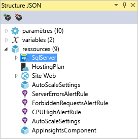

Il vous suffit de sélectionner l’un des éléments de la structure pour accéder à cette partie du modèle et mettre en évidence le JSON correspondant.

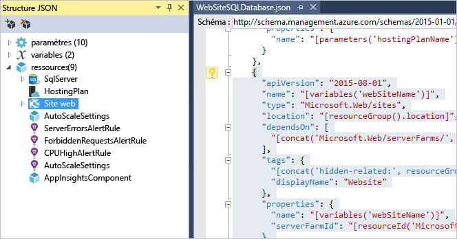

Vous pouvez ajouter une ressource en sélectionnant le bouton **Ajouter une ressource** en haut de la fenêtre Structure JSON, ou en double-cliquant sur **ressources** et en sélectionnant **Ajouter une nouvelle ressource**.

Pour ce didacticiel, sélectionnez **Compte de stockage** et donnez-lui un nom. Choisissez un nom qui ne contient pas plus de 11 caractères et uniquement des chiffres et des lettres minuscules.

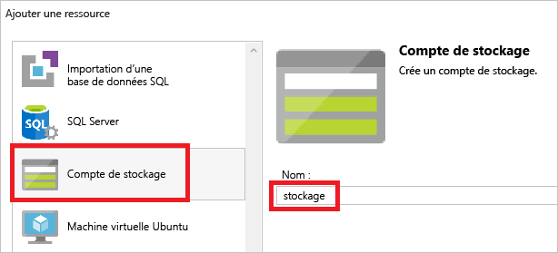

Notez qu’en plus de la ressource, un paramètre pour le compte de stockage de type et une variable pour le nom du compte de stockage ont été ajoutés.

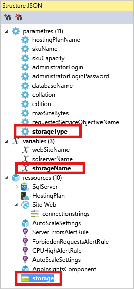

Le paramètre **storageType** est prédéfini avec des types autorisés et un type par défaut. Vous pouvez laisser ces valeurs ou les modifier pour votre scénario. Si vous ne souhaitez autoriser personne à déployer un compte de stockage **Premium_LRS** via ce modèle, supprimez ce dernier des types autorisés. 

    "storageType": {
      "type": "string",
      "defaultValue": "Standard_LRS",
      "allowedValues": [
        "Standard_LRS",
        "Standard_ZRS",
        "Standard_GRS",
        "Standard_RAGRS"
      ]
    }

Visual Studio fournit également des fonctionnalités intellisense pour vous aider à comprendre quelles propriétés sont disponibles lors de la modification du modèle. Par exemple, pour modifier les propriétés de votre plan App Service, accédez à la ressource **HostingPlan** et ajoutez une valeur pour les **propriétés**. Notez qu’intellisense affiche les valeurs disponibles et fournit une description de cette valeur.

Vous pouvez définir **numberOfWorkers** sur 1.

    "properties": {
      "name": "[parameters('hostingPlanName')]",
      "numberOfWorkers": 1
    }

## Déployer le projet de groupe de ressources sur Azure
Vous êtes maintenant prêt à déployer votre projet. Lorsque vous déployez un projet de groupe de ressources Azure, vous le déployez dans un groupe de ressources Azure. Un groupe de ressources est un regroupement logique de ressources qui partagent un cycle de vie commun.

1. Dans le menu contextuel du nœud du projet de déploiement, choisissez **Déployer** > **New Déployerment**.
   
    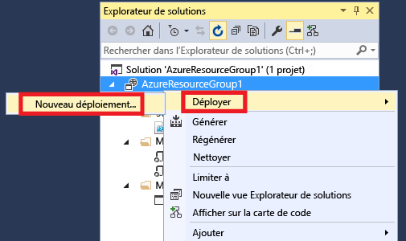
   
    La boîte de dialogue **Déployer vers le groupe de ressources** s’affiche.
   
    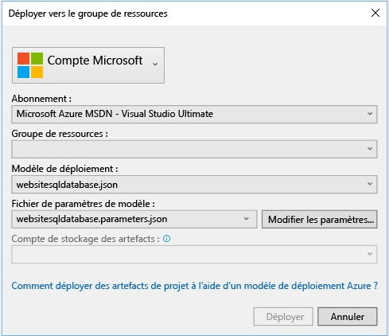
2. Dans la zone de liste déroulante **Groupe de ressources** , sélectionnez un groupe de ressources existant ou créez-en un. Pour créer un groupe de ressources, ouvrez la zone de liste déroulante **Groupe de ressources** et sélectionnez **Créer**.
   
    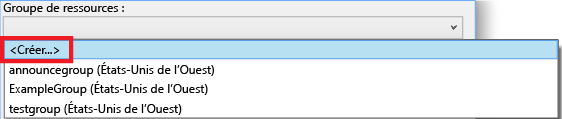
   
    La boîte de dialogue **Créer un groupe de ressources** s’affiche. Donnez à votre groupe un nom et un emplacement, puis sélectionnez le bouton **Créer** .
   
    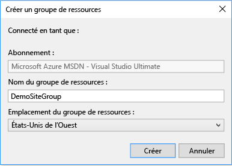
3. Modifiez les paramètres du déploiement en sélectionnant le bouton **Modifier les paramètres** .
   
    
4. Fournissez des valeurs pour les paramètres vides et sélectionnez le bouton **Enregistrer** . Les paramètres vides sont **hostingPlanName**, **administratorLogin**, **administratorLoginPassword** et **databaseName**.
   
    **hostingPlanName** spécifie le nom du [plan App Service](../app-service/azure-web-sites-web-hosting-plans-in-depth-overview.md) à créer. 
   
    **administratorLogin** spécifie le nom d’utilisateur de l’administrateur SQL Server. N’utilisez pas de noms d’administrateur communs comme **sa** ou **admin**. 
   
    **administratorLoginPassword** spécifie le mot de passe d’administrateur SQL Server. L’option **Enregistrer les mots de passe en texte brut dans le fichier de paramètres** n’est pas sécurisée. Ne sélectionnez pas cette option. Étant donné que le mot de passe n’est pas enregistré en texte brut, vous devrez indiquer ce mot de passe à nouveau lors du déploiement. 
   
    **databaseName** spécifie le nom de la base de données à créer. 
   
    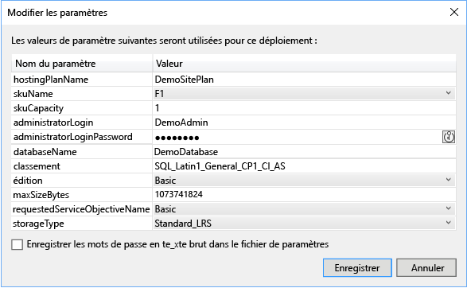
5. Sélectionnez le bouton **Déployer** pour déployer le projet dans Azure. Une console PowerShell s’ouvre en dehors de l’instance de Visual Studio. Entrez le mot de passe d’administrateur SQL Server dans la console PowerShell lorsque vous y êtes invité. **Votre console PowerShell peut être masquée par d’autres éléments ou réduite dans la barre des tâches.**  Recherchez-la et sélectionnez-la pour indiquer le mot de passe.
   
   > [!NOTE]
   > Il se peut que Visual Studio vous invite à installer les applets de commande Azure PowerShell. Vous devez disposer des applets de commande Azure PowerShell pour déployer des groupes de ressources. Si vous y êtes invité, installez-les.
   > 
   > 
6. Ce déploiement peut prendre quelques minutes. La fenêtre **Sortie** indique l’état du déploiement. Lorsque le déploiement est terminé, le dernier message indique que le déploiement a été réalisé avec succès :
   
        ... 
        18:00:58 - Successfully deployed template 'c:\users\user\documents\visual studio 2015\projects\azureresourcegroup1\azureresourcegroup1\templates\websitesqldatabase.json' to resource group 'DemoSiteGroup'.
7. Dans un navigateur, ouvrez le [portail Azure](https://portal.azure.com/) et connectez-vous à votre compte. Pour afficher le groupe de ressources, sélectionnez **Groupes de ressources** et le groupe de ressources vers lequel vous avez effectué le déploiement.
   
    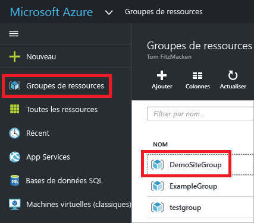
8. Vous verrez toutes les ressources déployées. Notez que le nom du compte de stockage n’est pas exactement celui spécifié lors de l’ajout de cette ressource. Le compte de stockage doit être unique. Le modèle ajoute automatiquement une chaîne de caractères au nom que vous avez spécifié pour créer un nom unique. 
   
    
9. Si vous modifiez et redéployez votre projet, choisissez le groupe de ressources existant dans le menu contextuel du projet de groupe de ressources Azure. Dans le menu contextuel, sélectionnez **Déployer**, puis le groupe de ressources que vous avez déployé.
   
    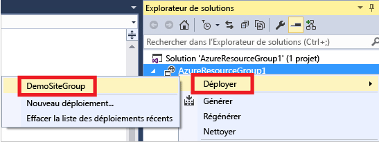

## Déployer le code avec votre infrastructure
À ce stade, vous avez déployé l’infrastructure de votre application, mais aucun code réel n’est déployé avec le projet. Cette rubrique montre comment déployer une application web et des tables SQL Database lors du déploiement. Si vous déployez une machine virtuelle au lieu d’une application web, vous devrez exécuter du code sur la machine dans le cadre du déploiement. Le processus de déploiement du code pour une application web ou pour la configuration d’une machine virtuelle est quasiment le même.

1. Ajoutez un projet à votre solution Visual Studio. Cliquez avec le bouton droit sur la solution et sélectionnez **Ajouter** > **Nouveau projet**.
   
    
2. Ajoutez une **application web ASP.NET**. 
   
    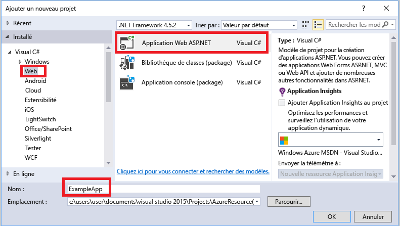
3. Sélectionnez **MVC** et effacez le champ **Héberger dans le cloud** car le projet de groupe de ressources effectue cette tâche.
   
    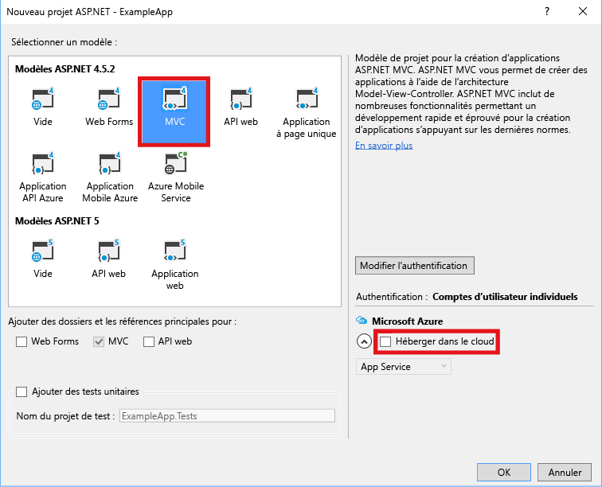
4. Une fois votre application web créée par Visual Studio, vous voyez les deux projets dans la solution.
   
    
5. À présent, vous devez vous assurer que votre projet de groupe de ressources est informé du nouveau projet. Revenez à votre projet de groupe de ressources (AzureResourceGroup1). Cliquez avec le bouton droit sur **Références** et sélectionnez **Ajouter une référence**.
   
    
6. Sélectionnez le projet d’application web que vous avez créé.
   
    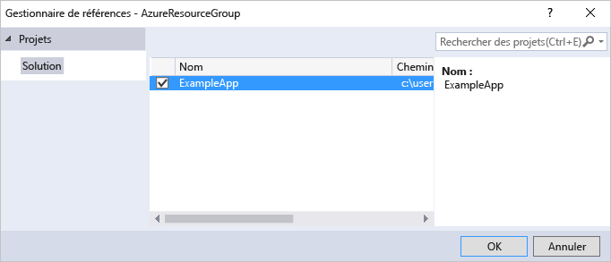
   
    En ajoutant une référence, vous liez le projet d’application web au projet de groupe de ressources et définissez automatiquement trois propriétés clés. Vous voyez ces propriétés dans la fenêtre **Propriétés** de la référence.
   
      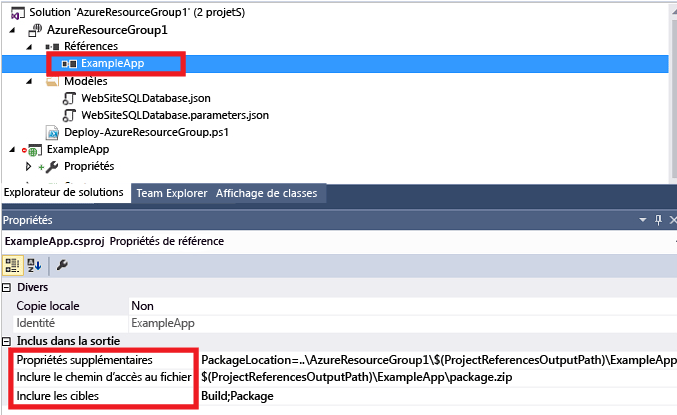
   
    Les propriétés sont les suivantes :
   
   * **Propriétés supplémentaires** contient l’emplacement intermédiaire du package de déploiement web qui est envoyé vers Azure Storage. Notez le dossier (ExampleApp) et le fichier (package.zip). Vous fournirez ces valeurs en tant que paramètres lors du déploiement de l’application. 
   * **Inclure le chemin d’accès au fichier** contient le chemin d’accès à l’emplacement de création du package. **Inclure les cibles** contient la commande que ce déploiement exécute. 
   * La valeur par défaut **Build;Package** permet au déploiement de construire et créer un package de déploiement web (package.zip).  
     
     Vous n’avez pas besoin de profil de publication, car le déploiement obtient les informations nécessaires à partir des propriétés pour créer le package.
7. Ajoutez une ressource au modèle.
   
    
8. Cette fois-ci, sélectionnez **Web Deploy pour les applications Web**. 
   
    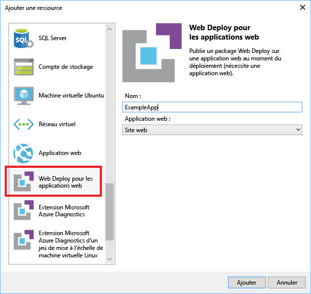
9. Redéployez votre projet de groupe de ressources vers le groupe de ressources. Cette fois, il y a de nouveaux paramètres. Vous n’avez pas besoin de fournir des valeurs pour **_artifactsLocation** ou **_artifactsLocationSasToken** car Visual Studio les génère automatiquement. Toutefois, vous devez définir le dossier et le nom de fichier sur le chemin d’accès qui contient le package de déploiement (présenté comme **ExampleAppPackageFolder** et **ExampleAppPackageFileName** dans l’image suivante). Indiquez les valeurs que vous avez vues précédemment dans les propriétés de référence (**ExampleApp** et **package.zip**).
   
    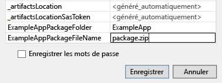
   
    Pour le **compte de stockage des artefacts**, sélectionnez celui déployé avec ce groupe de ressources.
10. Une fois le déploiement terminé, sélectionnez votre application web dans le portail. Sélectionnez l’URL pour accéder au site.
    
     
11. Notez que vous avez déployé avec succès l’application ASP.NET par défaut.
    
     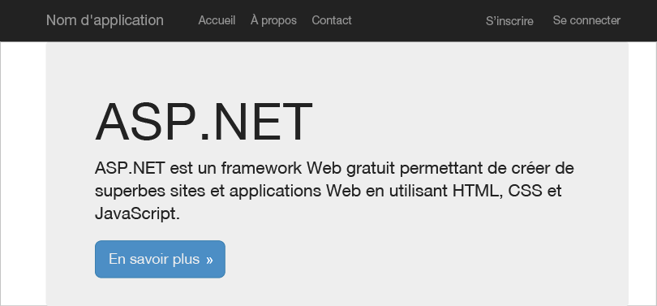

## Étapes suivantes
* Pour plus d’informations sur la gestion des ressources via le portail, voir [Utilisation du portail Azure pour gérer vos ressources Azure](resource-group-portal.md).
* Pour en savoir plus sur les modèles, voir [Création de modèles Azure Resource Manager](resource-group-authoring-templates.md).

<!--HONumber=Nov16_HO3-->

