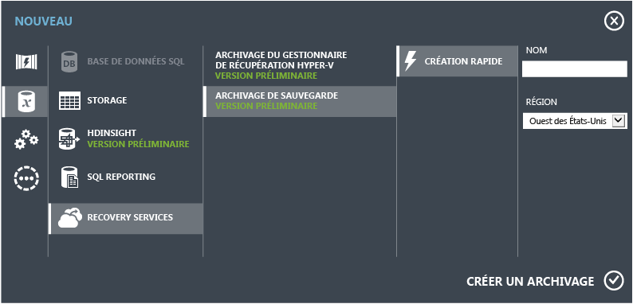
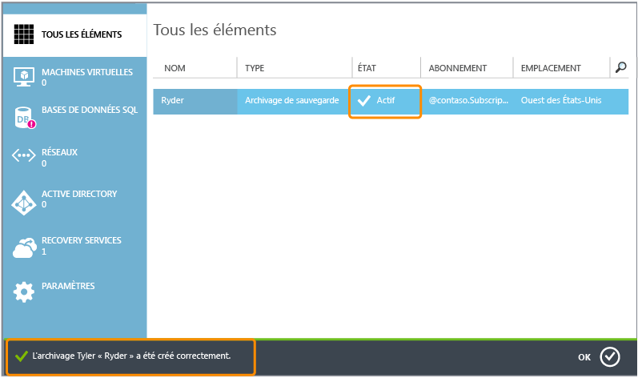
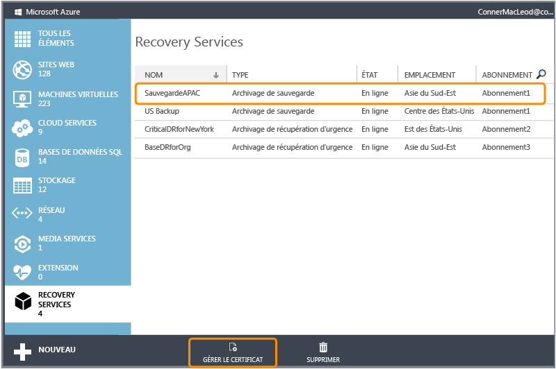
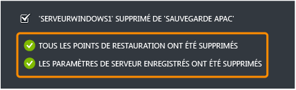

<properties linkid="manage-services-recovery-configure-backup-vault" urlDisplayName="Configure a Backup Vault" pageTitle="Configure Azure Recovery Services to quickly and easily back-up Windows Server" metaKeywords="disaster recovery" description="Use this tutorial to learn how to use the Backup service in Microsoft's Azure cloud offering to back up Windows Server to the cloud." metaCanonical="" services="recovery-services" documentationCenter="" title="Configure Azure Backup to quickly and easily back-up Windows Server" authors="starra" solutions="" manager="cynthn" editor="tysonn" />

Configuration d'Azure Backup pour sauvegarder rapidement et facilement Windows Server
=====================================================================================

**Remarque**

Pour suivre ce didacticiel, vous devez disposer d'un compte Azure pour lequel la fonctionnalité Azure Backup est activée.

-   Si vous ne possédez pas de compte, vous pouvez créer un compte d'évaluation gratuit en quelques minutes. Pour plus d'informations, consultez la page [Version d'évaluation gratuite d'Azure](/en-us/pricing/free-trial/).
-   Si vous disposez d'un compte, mais que vous devez activer la version préliminaire d'Azure Backup, consultez la rubrique [Activation des fonctionnalités préliminaires d'Azure](/en-us/develop/net/tutorials/create-a-windows-azure-account/#enable).

Une fois que vous avez envoyé une demande de participation au programme préliminaire Backup, patientez jusqu'à ce que votre statut soit activé. Comme nous approuvons automatiquement tous les clients, cela ne prendra pas longtemps.

Pour sauvegarder des fichiers et données de votre serveur Windows Server vers Azure, vous devez créer un coffre de sauvegarde dans la région géographique où vous souhaitez stocker les données. Ce didacticiel va vous guider lors de la création du coffre de stockage des sauvegardes, du téléchargement d'un certificat dans le coffre, de l'installation de l'agent de sauvegarde. Il va également vous présenter les tâches de gestion de sauvegarde disponibles dans le portail de gestion.

**Avant de commencer**

Pour effectuer correctement ce didacticiel, vous devez posséder un certificat X.509 v3 pour inscrire vos serveurs auprès des coffres de sauvegarde. Le certificat doit avoir une longueur de clé minimale de 2048 bits et résider dans le magasin de certificats personnels de votre ordinateur local. Lorsque le certificat est installé sur votre serveur, il doit contenir la clé privée associée. Pour télécharger le certificat dans le portail de gestion Azure, vous devez exporter la clé publique au format .cer.

Vous pouvez :

-   utiliser votre propre certificat auto-signé créé à l'aide de l'outil makecert ou
-   un certificat SSL valide émis par une autorité de certification approuvée par Microsoft et dont les certificats racines sont distribués via le programme de certificat racine Microsoft. Pour plus d'informations sur ce programme, consultez la page [Membres du programme de certificat racine Windows](http://go.microsoft.com/fwlink/p/?LinkId=294666).

Voici certains des autres attributs nécessaires aux certificats :

-   Utilisation améliorée de la clé ClientAuthentication valide
-   Est actuellement valide pendant une période qui ne dépasse pas 3 ans

Pour utiliser vos propres certificats auto-signés, procédez comme suit :

1.  Téléchargez l'[outil de création de certificat (MakeCert.exe)](http://go.microsoft.com/fwlink/p/?LinkID=294662).
2.  Ouvrez l'invite de commandes (cmd.exe) avec des privilèges d'administrateur et exécutez la commande suivante en remplaçant *CertificateName* par le nom de votre certificat et en spécifiant sa date d'expiration réelle après -e : `makecert.exe -r -pe -n CN=CertificateName -ss my -sr localmachine -eku 1.3.6.1.5.5.7.3.2 -len 2048 -e 01/01/2016 CertificateName.cer`

Si vous prévoyez d'inscrire un serveur différent de celui ayant servi à générer le certificat, vous devez exporter le fichier .pfx (contenant la clé privée), le copier sur l'autre serveur et l'importer dans le magasin de certificats personnels de ce serveur.

Pour obtenir des instructions pas à pas sur le téléchargement de certificats de coffre et pour plus d'informations sur l'exportation et l'importation de fichiers .pfx, consultez la page [Gérer les certificats de coffre](http://go.microsoft.com/fwlink/p/?LinkID=294662).

Création d'un coffre de sauvegarde
----------------------------------

1.  Connectez-vous au [portail de gestion](https://manage.windowsazure.com).

    [WACOM.INCLUDE [disclaimer](../includes/disclaimer.md)]

2.  Cliquez sur **Recovery Services**, sur **Create New**, **Coffre de sauvegarde**, puis sur **Quick Create**.

    

3.  Dans **Nom**, entrez un nom convivial permettant d'identifier le coffre de sauvegarde.

4.  Dans **Région**, sélectionnez la région géographique du coffre de sauvegarde.

5.  Dans **Abonnement**, entrez l'abonnement Azure à utiliser avec le coffre de sauvegarde.

6.  Cliquez sur **Create Backup vault**.

    La création du coffre de sauvegarde peut prendre du temps. Pour vérifier son statut, vous pouvez surveiller les notifications en bas du portail. Lorsque le coffre de sauvegarde est créé, un message vous en informe et le coffre est répertorié dans les ressources de Recovery Services sous le statut **En ligne**.

    

Téléchargement d'un certificat
------------------------------

1.  Connectez-vous au [portail de gestion](https://manage.windowsazure.com).

2.  Cliquez sur **Recovery Services**, puis sur le nom du coffre de sauvegarde qui sera identifié par le certificat, puis cliquez sur **Manage certificate**.

    

3.  Dans la boîte de dialogue **Manage Certificate**, accédez à votre ordinateur pour rechercher le fichier .cer à utiliser avec ce coffre de sauvegarde.

    Téléchargement et installation d'un agent de sauvegarde
    -------------------------------------------------------

4.  Connectez-vous au [portail de gestion](https://manage.windowsazure.com).

5.  Cliquez sur **Recovery Services**, puis sur le nom du coffre de sauvegarde pour afficher le tableau de bord associé.

6.  Cliquez sur **Installer l'agent**

    

7.  Dans la boîte de dialogue qui s'affiche, choisissez l'agent à télécharger :
    -   Agent pour Windows Server 2012 et System Center 2012 SP1 - Data Protection Manager
    -   Agent pour Windows Server 2012 Essentials

8.  Sélectionnez l'agent adéquat. Vous êtes ensuite redirigé vers le centre de téléchargement Microsoft où vous pouvez télécharger le logiciel associé. Pour plus d'informations, consultez les pages suivantes :

    -   [Installer l'agent Azure Backup pour Windows Server 2012 et System Center 2012 SP1 - Data Protection Manager](http://technet.microsoft.com/en-us/library/hh831761.aspx#BKMK_installagent)
    -   [Installer l'agent Azure Backup pour Windows Server 2012 Essentials](http://technet.microsoft.com/en-us/library/jj884318.aspx)

Une fois l'agent installé, vous pouvez utiliser l'interface de gestion locale appropriée (telle que le composant logiciel enfichable Microsoft Management Console, la console System Center Data Protection Manager ou le tableau de bord Windows Server Essentials) pour configurer la stratégie de sauvegarde pour le serveur.

Gestion des coffres et serveurs de sauvegarde
---------------------------------------------

1.  Connectez-vous au [portail de gestion](https://manage.windowsazure.com).

2.  Cliquez sur **Recovery Services**, puis sur le nom du coffre de sauvegarde pour afficher le tableau de bord associé. Exécutez ensuite les tâches suivantes :
    -   **Manage certificate**. Permet de mettre à jour le certificat téléchargé précédemment.
    -   **Supprimer**. Permet de supprimer le coffre de sauvegarde actuel. Si un coffre de sauvegarde n'est plus utilisé, vous pouvez le supprimer pour libérer de l'espace de stockage. L'option **Supprimer** est disponible uniquement une fois que tous les serveurs inscrits ont été supprimés du coffre.

3.  Cliquez sur **Éléments protégés** pour afficher les éléments sauvegardés à partir des serveurs. Cette liste est fournie à titre d'information uniquement.
     

4.  Cliquez sur **Serveurs** pour afficher le nom des serveurs inscrits auprès de ce coffre. Exécutez ensuite les tâches suivantes :
    -   **Allow Re-register**. Lorsque cette option est sélectionnée pour un serveur, vous pouvez utiliser l'Assistant Inscription dans l'agent pour inscrire à nouveau le serveur auprès du coffre de sauvegarde. Vous devrez peut-être effectuer cette nouvelle inscription en raison d'une erreur dans le certificat ou de la nécessité de régénérer un serveur. La réinscription est autorisée une seule fois par nom de serveur.
    -   **Supprimer**. Permet de supprimer un serveur du coffre de sauvegarde. Toutes les données stockées associées au serveur sont immédiatement supprimées.

        

Étapes suivantes
----------------

-   Pour en savoir plus sur Azure Backup, consultez la page [Présentation de la Sauvegarde Windows Azure](http://go.microsoft.com/fwlink/p/?LinkId=222425).

-   Consultez le [forum Azure Backup](http://go.microsoft.com/fwlink/p/?LinkId=290933).

