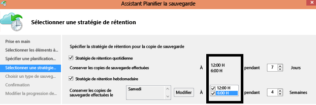

<properties
   pageTitle="Azure Backup - Forum aux questions | Microsoft Azure"
   description="Forum aux questions sur le service Azure Backup"
   services="backup"
   documentationCenter=""
   authors="Jim-Parker"
   manager="shreeshd"
   editor=""/>

<tags ms.service="backup" ms.workload="storage-backup-recovery" ms.tgt_pltfrm="na" ms.devlang="na" ms.topic="article" ms.date="08/26/2015" ms.author="trinadhk";"giridham"; "arunak"; "jimpark"; "aashishr"/>

# Azure Backup - Forum Aux Questions
Voici une liste de questions fréquemment posées sur Azure Backup. Si vous avez d’autres questions sur Azure Backup, veuillez accéder au [forum de discussion](https://social.msdn.microsoft.com/forums/azure/home?forum=windowsazureonlinebackup) et publier vos questions. Un membre de notre communauté vous aidera à obtenir vos réponses. Si une question est fréquemment posée, nous l’ajoutons à cet article pour qu’elle puisse être trouvée rapidement et facilement.

## Installation et configuration
**Q1. Quelle est la liste des systèmes d’exploitation pris en charge à partir desquels je peux sauvegarder des fichiers dans Azure à l’aide d’Azure Backup ?** <br/> R1. La liste suivante de systèmes d’exploitation est prise en charge par Azure Backup


| Système d’exploitation | Plateforme | SKU |
| :------------- |-------------| :-----|
| Windows 8 et derniers Service Packs | 64 bits | Entreprise, Professionnel |
| Windows 7 et derniers Service Packs | 64 bits | Édition Intégrale, Entreprise, Professionnel, Édition Familiale Premium, Édition Familiale Basique, Édition Starter |
| Windows 8.1 et derniers Service Packs | 64 bits | Entreprise, Professionnel |
| Windows 10 | 64 bits | Entreprise, Professionnel, Familiale |
|Windows Server 2012 R2 et derniers Service Packs|	64 bits|	Standard, Datacenter, Foundation|
|Windows Server 2012 et derniers Service Packs|	64 bits|	Datacenter, Foundation, Standard|
|Windows Storage Server 2012 R2 et derniers Service Packs |64 bits|	Standard, Workgroup|
|Windows Storage Server 2012 et derniers Service Packs |64 bits |Standard, Workgroup
|Windows Server 2012 R2 et derniers Service Packs |64 bits|	Essential|
|Windows Server 2008 R2 SP1 |64 bits|	Standard, Entreprise, Datacenter, Foundation|
|Windows Server 2008 SP2 |64 bits|	Standard, Entreprise, Datacenter, Foundation|

**Q2. Où puis-je télécharger le dernier agent Azure Backup ?** <br/> R2. Vous pouvez télécharger le dernier agent [ici](http://aka.ms/azurebackup_agent). Il peut être installé sur Windows Server, SCDPM ou un client Windows

**Q3. Quelle version du serveur SCDPM est prise en charge ?** <br/> R3. Nous vous recommandons d’installer le [dernier](http://aka.ms/azurebackup_agent) agent Azure Backup sur le dernier correctif cumulatif de SCDPM (UR6 depuis juillet 2015)

**Q4. Pendant la configuration de l’agent Azure Backup, je suis invité à entrer les « informations d’identification de coffre ». Ces informations d’identification de coffre ont-elles une date d’expiration ?** <br/> R4. Oui, les informations d’identification de coffre expirent au bout de 48 heures. Si le fichier expire, connectez-vous au portail Azure et téléchargez les fichiers d’informations d’identification de coffre à partir de votre archivage de sauvegarde.

**Q5. Le nombre d’archivages de sauvegarde pouvant être créés dans chaque abonnement Azure est-il limité ?** <br/> R5. Oui. Depuis juillet 2015, vous pouvez créer 25 archivages par abonnement. Si vous avez besoin de plus d’archivages, créez un autre abonnement.

**Q6. Les archivages sont-ils des entités de facturation ?** <br/> R6. Même s’il est possible d’obtenir une facture détaillée pour chaque archivage, nous vous recommandons vivement de considérer l’abonnement Azure comme entité de facturation. Il est cohérent sur tous les services et est plus facile à gérer.

**Q7. Le nombre de serveurs/ordinateurs pouvant être inscrits pour chaque archivage est-il limité ?** <br/> R7. Oui, vous pouvez inscrire un maximum de 50 ordinateurs par archivage. Pour les machines virtuelles Azure IaaS, la limite est de 100 machines virtuelles par coffre. Si vous avez besoin d’inscrire davantage d’ordinateurs, créez un autre archivage.

**Q8. La quantité de données pouvant être sauvegardées à partir d’un serveur/client Windows ou d’un serveur SCDPM est-elle limitée ?** <br/> R8. Non.

**Q9. Comment inscrire mon serveur dans un autre centre de données ?**<br/> R9. En général, les données de sauvegarde sont envoyées au centre de données du service Azure Backup dans lequel elles sont inscrites. Le moyen le plus simple de modifier le centre de données est de désinstaller/réinstaller l’agent et de l’inscrire dans un nouveau centre de données.

**Q10. Que se passe-t-il si je renomme un serveur Windows qui sauvegarde des données dans Azure ?** <br/> R10. Toutes les sauvegardes actuellement configurées seront interrompues. Vous devrez réenregistrer le serveur dans l’archivage de sauvegarde et il sera considéré comme un nouveau serveur par Recovery Services. La première opération de sauvegarde qui se produira après l’inscription sera donc une sauvegarde complète de toutes les données incluses dans la sauvegarde, au lieu d’une sauvegarde des modifications uniquement depuis la dernière sauvegarde. Toutefois, si vous devez effectuer une opération de récupération, vous pouvez récupérer les données qui ont été sauvegardées à l’aide de l’option Récupérer les données d’une autre récupération de serveur. Pour plus d’informations, consultez Renommer un serveur.

**Q11. À partir de quels types de lecteurs puis-je sauvegarder des fichiers et des dossiers ?** <br/> R11. L’ensemble suivant de lecteurs/volumes ne peut pas être sauvegardé :

- Support amovible : le lecteur doit être déclaré fixe pour être utilisé comme source d’éléments de sauvegarde.
- Volumes en lecture seule : le volume doit être accessible en écriture pour que le service VSS puisse fonctionner.
- Volumes déconnectés : le volume doit être en ligne pour que le service VSS puisse fonctionner.
- Partage réseau : le volume doit être local sur le serveur à sauvegarder à l’aide de la sauvegarde en ligne.
- Volumes protégés par BitLocker : le volume doit être déverrouillé pour pouvoir effectuer la sauvegarde.
- Identification du système de fichiers : NTFS est le seul système de fichiers pris en charge pour cette version du service de sauvegarde en ligne.

**Q12. Quels types de fichier et dossier puis-je sauvegarder à partir de mon serveur ?**<br/> R12. Les types suivants sont pris en charge :

- Chiffré
- Compressé
- Partiellement alloué
- Compressé + partiellement alloué
- Liens physiques : non pris en charge, ignorés
- Point d’analyse : non pris en charge, ignoré
- Chiffré + compressé : non pris en charge, ignoré
- Chiffré + partiellement alloué : non pris en charge, ignoré
- Flux compressé : non pris en charge, ignoré
- Flux partiellement alloué : non pris en charge, ignoré

**Q13. Quelle est la taille minimale requise du dossier du cache ?** <br/> R13. La taille du dossier du cache est déterminée par la quantité de données que vous sauvegardez. En général, 10 à 15 % de l’espace requis pour le stockage de données est alloué au dossier du cache.

**Q14. Comment empêcher les données d’un serveur spécifique d’être récupérées par d’autres serveurs de mon organisation ?**<br/> R14. Tous les serveurs inscrits dans le même archivage sont en mesure de récupérer les données sauvegardées par d’autres serveurs qui utilisent la même phrase secrète. Si vous voulez que la récupération ne concerne que certains serveurs de votre organisation, vous devez utiliser une phrase secrète distincte pour ces serveurs. Par exemple, les serveurs des ressources humaines peuvent utiliser une phrase secrète de chiffrement, les serveurs de comptabilité peuvent en utiliser une autre et les serveurs de stockage une troisième.

**Q15. Puis-je « migrer » mes données de sauvegarde entre les abonnements ?** <br/> R15 : non

**Question 16. Puis-je « migrer » mon archivage de sauvegarde entre les abonnements ?** <br/> R16 : non. L’archivage est créé au niveau de l’abonnement et ne peut pas être réaffecté à un autre abonnement une fois créé.

**Question 17. L’agent Azure Backup fonctionne-t-il sur un serveur qui utilise la déduplication Windows Server 2012 ?** <br/>R17 : oui. Le service de l’agent convertit les données dédupliquées en données normales lorsqu'il prépare l'opération de sauvegarde. Il optimise ensuite les données pour la sauvegarde, chiffre les données, puis envoie les données chiffrées au service de sauvegarde en ligne.

**Question 18. Les données de sauvegarde sont-elles supprimées si j’annule une sauvegarde après qu’elle a démarré ?** <br/>R18 : non. L’archivage de sauvegarde stocke les données sauvegardées qui avaient été transférées jusqu’au moment de l’annulation. Azure Backup utilise un mécanisme de point de contrôle afin que les données de sauvegarde soient régulièrement contrôlées pendant la sauvegarde avant que le processus de sauvegarde suivant puisse valider l'intégrité des fichiers. La sauvegarde suivante est déclenchée de manière incrémentielle sur les données qui avaient été sauvegardées précédemment. Cette procédure optimise l’utilisation de la bande passante, ce qui vous évite d’avoir à transférer les mêmes données à plusieurs reprises.

**Question 19. Pourquoi l’avertissement « Les sauvegardes Azure n’ont pas été configurées pour ce serveur » apparaît-il alors que j’avais planifié des sauvegardes standard ?** <br/>R19 : cela peut se produire quand les paramètres de planification de la sauvegarde stockés sur le serveur local diffèrent des paramètres stockés dans l’archivage de sauvegarde. Lorsque le serveur ou les paramètres ont été restaurés à un état correct connu, les planifications de sauvegarde peuvent se désynchroniser. Si cela s’est produit, vous devez reconfigurer la stratégie de sauvegarde, puis **exécuter la sauvegarde** pour resynchroniser le serveur local avec Azure.

**Question 20. Quelles règles de pare-feu doivent être configurées pour la sauvegarde d’Azure Backup ?** <br/>R20. Vérifiez que les règles de pare-feu permettent la communication avec les URL ci-dessous pour la sauvegarde transparente du serveur local vers Azure et la protection de la charge de travail sur Azure :

- www.msftncsi.com
- *.Microsoft.com
- *.MicrosoftAzure.com
- *.microsoftonline.com
- *.windows.net


## Sauvegarde et rétention
**Q1. La taille de chaque source de données sauvegardée est-elle limitée ?** <br/> R1. Depuis août 2015, la taille maximale de la source de données est comme indiqué ci-dessous pour les différents systèmes d’exploitation.

|N° |	Système d’exploitation |	Taille maximale de la source de données |
| :-------------: |:-------------| :-----|
|1| Windows Server 2012 ou version ultérieure| 54 400 Go|
|2| Windows Server 8 ou version ultérieure| 54 400 Go|
|3| Windows Server 2008, Windows Server 2008 R2 | 1 700 Go|
|4| Windows 7 | 1 700 Go|
 
La taille de la source de données est mesurée comme indiqué ci-dessous.

|	Source de données |	Détails |
| :-------------: |:-------------|
|Volume |Quantité de données sauvegardées à partir d’un volume unique d’un ordinateur. Ceci s’applique pour les volumes protégés sur les ordinateurs serveur et client.|
|Machine virtuelle Hyper-V|Somme des données de tous les disques durs virtuels de la machine virtuelle en cours de sauvegarde|
|Base de données Microsoft SQL Server|Taille d’une base de données SQL unique en cours de sauvegarde |
|Microsoft SharePoint|Somme des bases de données de contenu et de configuration dans une batterie de serveurs SharePoint en cours de sauvegarde|
|Microsoft Exchange|Somme de toutes les bases de données Exchange sur un serveur Exchange en cours de sauvegarde|
|État système/récupération complète|Chaque copie individuelle de l’état système/récupération complète de l’ordinateur en cours de sauvegarde|

**Q2. Le nombre de planifications de sauvegarde par jour est-il limité ?**<br/> R2. Oui, Azure Backup autorise 3 copies de sauvegarde par jour via un client/serveur Windows, 2 copies de sauvegarde par jour via SCDPM et une sauvegarde par jour pour les machines virtuelles IaaS.

**Q3. Existe-t-il une différence entre les stratégies de planification de sauvegarde de DPM et d’Azure Backup (par ex., sur Windows Server sans DPM) ?** <br/> R3. Oui. À l’aide de DPM, vous pouvez spécifier une planification quotidienne, hebdomadaire, mensuelle, annuelle tandis qu’avec un Windows Server (sans DPM), vous pouvez spécifier uniquement des planifications quotidiennes et hebdomadaires.

**Q4. Existe-t-il une différence entre les stratégies de rétention de DPM et d’Azure Backup (par ex., sur Windows Server sans DPM) ?**<br/> R4. Non, vous avez les mêmes fonctionnalités. Vous pouvez spécifier des stratégies de rétention quotidiennes, hebdomadaires, mensuelles et annuelles.

**Q5. Puis-je configurer mes stratégies de rétention de manière sélective (par exemple, configurer des stratégies hebdomadaires et quotidiennes, mais pas annuelles et mensuelles) ?**<br/> R5. Vous disposez d’un jeu complet de boutons pour définir des stratégies qui définissent au mieux vos exigences en matière de conformité et de rétention.

**Q6. Puis-je « planifier une sauvegarde » à 18 h 00 et spécifier des « stratégies de rétention » à une autre heure ?**<br/> R6. Non. Les stratégies de rétention ne peuvent être appliquées que sur les points de sauvegarde. Dans l’image ci-dessous, la stratégie de rétention est spécifiée sur les sauvegardes effectuées à minuit et 18:00. <br/>

 <br/>

**Q7. Une copie incrémentielle est-elle transférée pour les stratégies de rétention planifiées ?** <br/> R7. Non, la copie incrémentielle est envoyée en fonction de l’heure mentionnée dans la page de planification de sauvegarde. Les points qui peuvent être conservés sont déterminés par la stratégie de rétention.

**Q8. Si la sauvegarde est conservée sur une longue durée, la récupération des données prend-elle plus de temps (par exemple, la récupération du point le plus ancien) ?** <br/> R8. Non. Le temps de récupération est le même pour le point le plus ancien ou le dernier point. Chaque point de récupération se comporte comme un point complet.

**Q9. Si chaque point de récupération est un point complet, a-t-il un impact sur la quantité totale de stockage de sauvegarde facturable ?**<br/> R9. Les produits classiques de points de rétention à long terme stockent les données de sauvegarde en tant que points complets. Toutefois, même si ces points occupent de l’espace de stockage, ils sont plus faciles et plus rapides à récupérer. Les copies incrémentielles occupent moins d’espace de stockage, mais vous devez restaurer une chaîne de données qui rallonge le temps de récupération. L’architecture de stockage unique d’Azure Backup vous offre le meilleur des deux en stockant les données de manière optimale pour des restaurations rapides et des coûts de stockage faibles. Cette approche garantit que votre bande passante (entrante et sortante) est utilisée efficacement et que l’espace de stockage occupé ainsi que le temps de récupération restent minimes.

**Q10. Le nombre de points de récupération pouvant être créés est-il limité ?**<br/> R10. Non. Nous avons éliminé les limites sur les points de récupération. Vous pouvez créer autant de points de récupération que vous le souhaitez.

**Q11. Pourquoi la quantité de données transférée dans la sauvegarde est-elle différente de la quantité de données que j’ai sauvegardée ?**<br/> R11. Toutes les données sauvegardées sont compressées et chiffrées avant d’être transférées. Vous pouvez gagner 30 à 40 % d’espace de compression en fonction du type de données à sauvegarder.

## Récupérer
**Q1. Combien de récupérations puis-je effectuer sur les données sauvegardées dans Azure ?**<br/> R1. Il n’existe aucune limite concernant le nombre de récupérations dans Azure Backup.

**Q2. Le trafic sortant du centre de données Azure m’est-il facturé pendant les récupérations ?**<br/> R2. Non. Vos récupérations sont gratuites et le trafic sortant ne vous est pas facturé.

## Sécurité
**Q1. Les données envoyées à Azure sont-elles chiffrées ?** <br/> R1. Oui. Les données sont chiffrées sur l’ordinateur client/serveur/SCDPM local avec AES256 et sont envoyées via une connexion HTTPS sécurisée.

**Q2. Les données de sauvegarde sont-elles également chiffrées dans Azure ?**<br/> R2. Oui. Les données envoyées à Azure restent chiffrées (au repos). Microsoft ne déchiffre les données de sauvegarde à aucun moment.

**Q3. Quelle est la longueur minimale de la clé de chiffrement utilisée pour chiffrer les données de sauvegarde ?** <br/> R3. La clé de chiffrement doit contenir au moins 16 caractères.

**Q4. Que se passe-t-il si j’ai égaré la clé de chiffrement ? Puis-je récupérer des données (ou) Microsoft peut-il récupérer les données ?** <br/> R4. La clé utilisée pour chiffrer les données de sauvegarde est présente uniquement localement chez le client. Microsoft ne conserve pas de copie dans Azure et n’a pas accès à la clé. Si le client égare la clé, Microsoft ne peut pas récupérer les données de sauvegarde.

## Cache de sauvegarde

**Q1. Comment puis-le modifier l’emplacement du cache spécifié pour l’agent Azure Backup ?**

+ Arrêtez le service OBEngine en exécutant la commande ci-après dans une invite de commandes avec élévation de privilèges :

  ```PS C:\> Net stop obengine```

+ Copiez le dossier d’espace de cache dans un autre lecteur disposant d’un espace suffisant. Nous vous recommandons de copier les fichiers du dossier d’espace de cache au lieu de les déplacer ; vous pourrez ainsi supprimer l’espace de cache d’origine après avoir vérifié que les sauvegardes fonctionnent avec le nouvel espace de cache.

+ Mettez à jour les entrées de Registre ci-après avec le chemin d’accès au nouveau dossier d’espace de cache :


	| Chemin d’accès au Registre | Clé de Registre | Valeur |
	| ------ | ------- | ------ |
	| `HKEY_LOCAL_MACHINE\SOFTWARE\Microsoft\Windows Azure Backup\Config` | ScratchLocation | <i>Emplacement du nouveau dossier de cache</i> |
	| `HKEY_LOCAL_MACHINE\SOFTWARE\Microsoft\Windows Azure Backup\Config\CloudBackupProvider` | ScratchLocation | <i>Emplacement du nouveau dossier de cache</i> |


+ Démarrez le service OBEngine en exécutant la commande ci-après dans une invite de commandes avec élévation de privilèges :

  ```PS C:\> Net start obengine```

Une fois les sauvegardes correctement effectuées avec le nouvel emplacement de cache, vous pouvez supprimer le dossier de cache d’origine.

<!---HONumber=Sept15_HO3-->