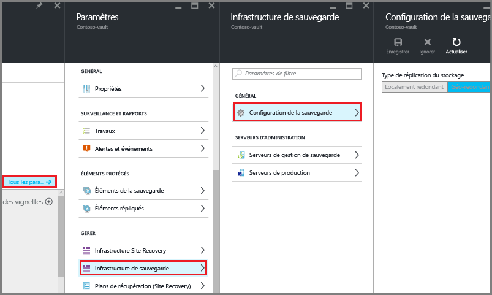
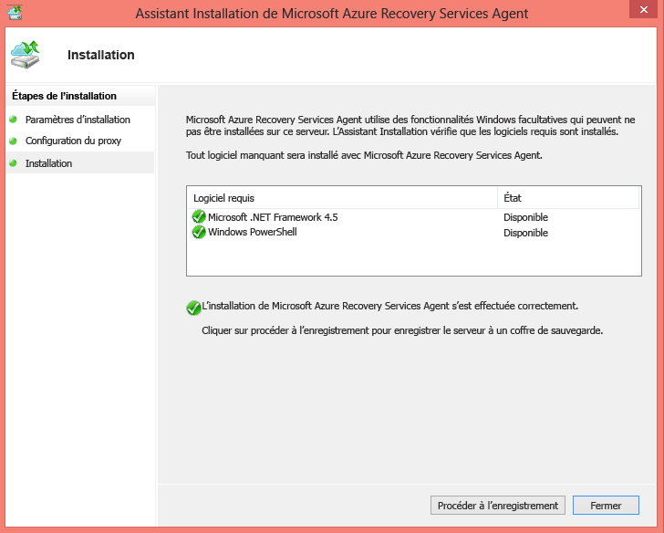
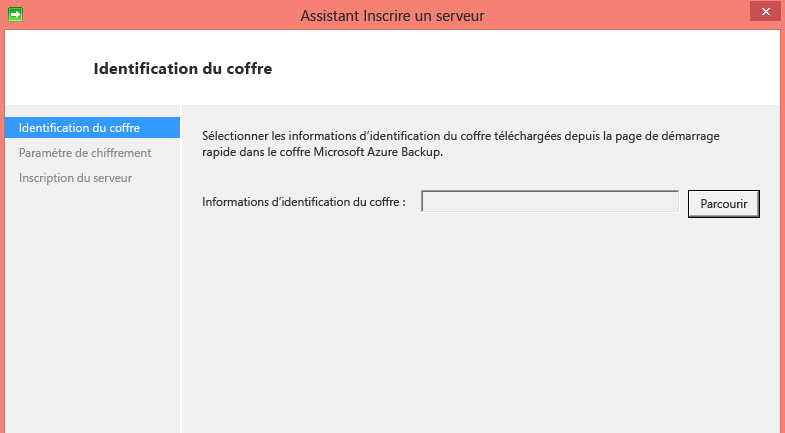
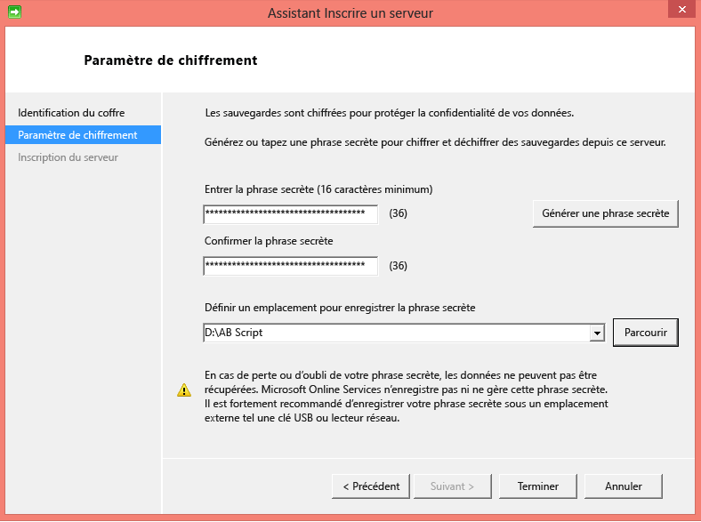
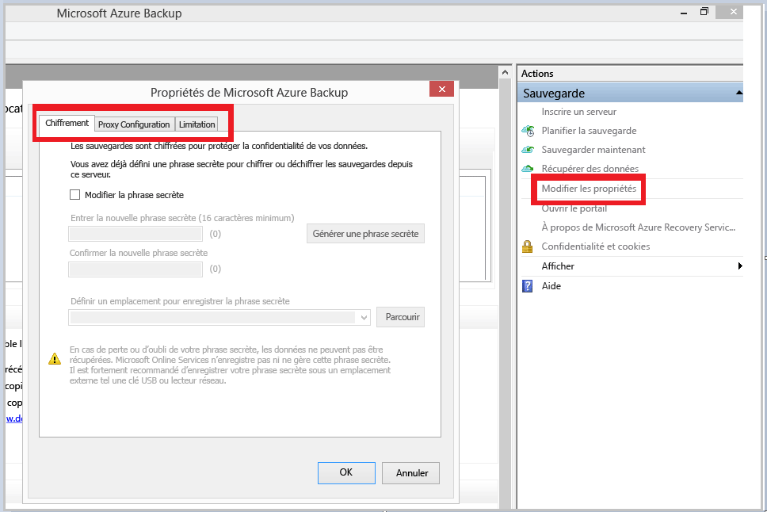
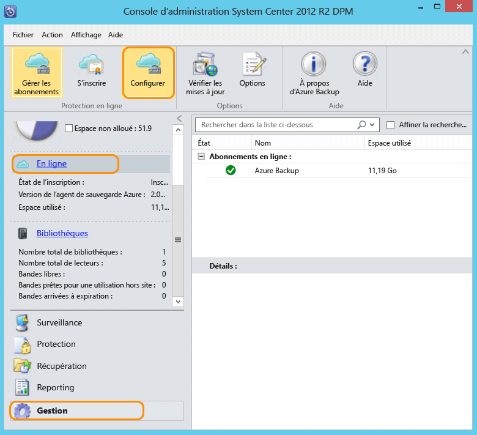

<properties
	pageTitle="Présentation d'Azure DPM Backup | Microsoft Azure"
	description="Présentation de la sauvegarde de serveurs DPM à l'aide du service Azure Backup"
	services="backup"
	documentationCenter=""
	authors="trinadhk"
	manager="shreeshd"
	editor=""
	keywords="System Center Data Protection Manager, Data Protection Manager, sauvegarde DPM"/>

<tags
	ms.service="backup"
	ms.workload="storage-backup-recovery"
	ms.tgt_pltfrm="na"
	ms.devlang="na"
	ms.topic="article"
	ms.date="05/10/2016"
	ms.author="trinadhk;giridham;jimpark"/>

# Préparation de la sauvegarde des charges de travail dans Azure avec DPM

> [AZURE.SELECTOR]
- [Azure Backup Server](backup-azure-microsoft-azure-backup.md)
- [SCDPM](backup-azure-dpm-introduction.md)
- [Azure Backup Server (Classic)](backup-azure-microsoft-azure-backup-classic.md)
- [SCDPM (Classic)](backup-azure-dpm-introduction-classic.md)

Cet article présente l'utilisation de Microsoft Azure Backup pour protéger vos serveurs System Center Data Protection Manager (DPM) et vos charges de travail. En le lisant, vous comprendrez :

- le fonctionnement de la sauvegarde du serveur Azure DPM ;
- les conditions requises pour une expérience de sauvegarde fluide ;
- les erreurs classiques rencontrées et comment les gérer ;
- Scénarios pris en charge

> [AZURE.NOTE] Azure dispose de deux modèles de déploiement pour créer et utiliser des ressources : [Resource Manager et Classique](../resource-manager-deployment-model.md). Cet article fournit les informations et les procédures relatives à la restauration des machines virtuelles déployées à l’aide du modèle Resource Manager.

System Center DPM sauvegarde les données des fichiers et des applications. Les données sauvegardées dans DPM peuvent être stockées sur bande, sur disque, ou sauvegardées dans Azure avec Microsoft Azure Backup. DPM interagit avec Azure Backup comme suit :

- **DPM déployé comme un serveur physique ou une machine virtuelle en local** : si DPM est déployé comme un serveur physique ou comme une machine virtuelle Hyper-V en local, vous pouvez sauvegarder les données dans un coffre Recovery Services en plus d’une sauvegarde sur disque et sur bande.
- **DPM déployé comme une machine virtuelle Azure** : depuis la mise à jour 3 de System Center 2012 R2, DPM peut être déployé comme une machine virtuelle Azure. Si DPM est déployé comme une machine virtuelle Azure, vous pouvez sauvegarder les données sur des disques Azure connectés à la machine virtuelle DPM Azure, ou décharger le stockage de données en les sauvegardant dans un coffre Recovery Services.

## Pourquoi sauvegarder vos serveurs DPM ?

Les avantages commerciaux de l'utilisation d'Azure Backup pour la sauvegarde de serveurs DPM sont les suivants :

- Pour le déploiement DPM en local, vous pouvez utiliser Azure au lieu d’un déploiement à long terme sur bande.
- Pour les déploiements DPM dans Azure, Azure Backup vous permet de décharger le stockage du disque Azure et ainsi d’évoluer en stockant les données plus anciennes dans un coffre Recovery Services et les nouvelles données sur un disque.

## Comment fonctionne la sauvegarde d'un serveur DPM ?
Pour fournir une protection des données basée sur disque, le serveur DPM crée et gère un réplica, ou une copie, des données sur les serveurs protégés. Les réplicas sont stockés dans le pool de stockage qui se compose d’un ensemble de disques sur le serveur DPM ou sur un volume personnalisé. Que vous protégiez des données de fichier ou des données d’application, la protection commence par la création du réplica de la source de données. Le réplica est synchronisé, ou mis à jour, à intervalles réguliers conformément aux paramètres que vous configurez. Lorsque vous utilisez la protection basée sur disque à court terme et à long terme dans le cloud, DPM peut sauvegarder des données du volume de réplica dans le coffre Recovery Services afin qu’il n’existe aucun impact sur l’ordinateur protégé.

## Composants requis
Préparer Azure Backup pour sauvegarder des données DPM comme suit :

1. **Créer un coffre Recovery Services** : créez un coffre dans le portail Azure.
2. **Télécharger les informations d’identification de coffre** : télécharger les informations d’identification qui vous permettent d’enregistrer le serveur DPM dans le coffre Recovery Services.
3. **Installer l’Agent Azure Backup et inscrire le serveur** : à partir d’Azure Backup, installez l’agent sur chaque serveur DPM et inscrivez le serveur DPM dans le coffre Recovery Services.

### 1\. Créer un coffre Recovery Services
Pour créer un coffre Recovery Services :

1. Connectez-vous au [portail Azure](https://portal.azure.com/).

2. Dans le menu Hub, cliquez sur **Parcourir** et, dans la liste des ressources, tapez **Recovery Services**. Au fur et à mesure des caractères saisis, la liste est filtrée. Cliquez sur **Coffre Recovery Services**.

    

    La liste des coffres Recovery Services est affichée.

3. Dans le menu **Coffres Recovery Services**, cliquez sur **Ajouter**.

    

    Le panneau du coffre Recovery Services s’affiche et vous invite à renseigner les champs **Nom**, **Abonnement**, **Groupe de ressources** et **Emplacement**.

    

4. Sous **Nom**, entrez un nom convivial permettant d’identifier le coffre. Le nom doit être unique pour l’abonnement Azure. Tapez un nom contenant entre 2 et 50 caractères. Il doit commencer par une lettre, et ne peut contenir que des lettres, des chiffres et des traits d’union.

5. Cliquez sur **Abonnement** pour afficher la liste des abonnements disponibles. Si vous n’êtes pas sûr de l’abonnement à utiliser, utilisez l’abonnement par défaut (ou suggéré). Vous ne disposez de plusieurs choix que si votre compte professionnel est associé à plusieurs abonnements Azure.

6. Cliquez sur **Groupe de ressources** pour afficher la liste des groupes de ressources disponibles ou sur **Nouveau** pour en créer un. Pour plus d’informations sur les groupes de ressources, consultez la section [Utilisation du portail Azure pour déployer et gérer vos ressources Azure](../azure-portal/resource-group-portal.md).

7. Cliquez sur **Emplacement** pour sélectionner la région géographique du coffre.

8. Cliquez sur **Create**. La création de l’archivage de Recovery Services peut prendre un certain temps. Surveillez les notifications d'état dans l'angle supérieur droit du portail. Une fois votre archivage créé, il s'ouvre dans le portail.

### Définir la réplication du stockage

L’option de réplication du stockage vous permet de choisir entre stockage géo-redondant et stockage localement redondant. Par défaut, votre archivage utilise un stockage géo-redondant. Si vous utilisez Azure comme sauvegarde principale, laissez cette option inchangée. Choisissez Stockage localement redondant si vous souhaitez une option plus économique, mais moins durable. Pour en savoir plus sur les options de stockage [géo-redondant](../storage/storage-redundancy.md#locally-redundant-storage) et [localement redondant](../storage/storage-redundancy.md), consultez l’article [Réplication Azure Storage](../storage/storage-redundancy.md#geo-redundant-storage).

Pour modifier le paramètre de réplication du stockage :

1. Sélectionnez votre archivage pour ouvrir le tableau de bord associé et le panneau Paramètres. Si le panneau **Paramètres** ne s’ouvre pas, cliquez sur **Tous les paramètres** dans le tableau de bord du coffre.

2. Dans le panneau **Paramètres**, cliquez sur **Backup Infrastructure** (Infrastructure de sauvegarde) > **Configuration de la sauvegarde** pour ouvrir le panneau **Configuration de la sauvegarde**. Dans le panneau **Configuration de la sauvegarde**, choisissez l’option de réplication du stockage à appliquer à votre coffre.

    

    Après avoir sélectionné l’option de stockage pour votre archivage, vous pouvez associer la machine virtuelle à l’archivage. Pour commencer l’association, vous devez découvrir et enregistrer les machines virtuelles Azure.

### 2\. Télécharger les informations d'identification de coffre

Le fichier d’informations d’identification de coffre est un certificat qui est généré par le portail pour chaque archivage de sauvegarde. Le portail télécharge ensuite la clé publique pour le Service de contrôle d’accès (ACS). La clé privée du certificat est accessible à l’utilisateur dans le cadre du flux de travail donné comme entrée dans le flux de travail d’inscription de machine. Cela authentifie l’ordinateur pour envoyer des données de sauvegarde dans un archivage identifié dans le service Azure Backup.

Les informations d’identification de coffre sont utilisées uniquement pendant le flux de travail d’inscription. Il est de la responsabilité de l’utilisateur de s’assurer que le fichier d’informations d’identification de coffre n’est pas compromis. S’il tombe entre les mains d’un utilisateur non autorisé, le fichier d’informations d’identification de coffre peut servir à inscrire d’autres ordinateurs pour le même archivage. Toutefois, comme les données de sauvegarde sont chiffrées à l’aide d’une phrase secrète qui appartient au client, les données de sauvegarde existantes ne peuvent pas être compromises. Pour atténuer ce problème, les informations d’identification de coffre sont configurées pour expirer sous 48 heures. Vous pouvez télécharger les informations d’identification d’un coffre Recovery Services autant de fois que vous le souhaitez, mais seul le dernier fichier d’informations d’identification de coffre est applicable pendant le flux de travail d’inscription.

Le fichier d’informations d’identification de coffre est téléchargé via un canal sécurisé depuis le portail Azure. Le service Azure Backup n’a pas connaissance de la clé privée du certificat et cette dernière n’est pas conservée dans le portail ou le service. Procédez comme suit pour télécharger les informations d’identification de coffre sur un ordinateur local.

1. Connectez-vous au [portail Azure](https://portal.azure.com/).

2. Ouvrez le coffre Recovery Services sur lequel vous voulez enregistrer l’ordinateur DPM.

3. Le panneau Paramètres s’ouvre par défaut. S’il est fermé, cliquez sur **Paramètres** dans le tableau de bord du coffre pour ouvrir le panneau Paramètres. Dans le panneau Paramètres, cliquez sur **Propriétés**.

	

4. Dans la page Propriétés, cliquez sur **Télécharger** sous **Informations d’identification de la sauvegarde**. Le portail génère le fichier d’informations d’identification de coffre que vous pouvez télécharger.

    

Le portail générera une information d'identification de coffre en combinant le nom du coffre et la date actuelle. Cliquez sur **Enregistrer** pour télécharger les informations d’identification de coffre dans le dossier de téléchargements du compte local, ou sélectionnez Enregistrer sous dans le menu Enregistrer pour spécifier un emplacement pour les informations d’identification du coffre. La création du fichier peut prendre jusqu’à une minute.

### Remarque
- Vérifiez que le fichier des informations d’identification de coffre est enregistré dans un emplacement accessible à partir de votre ordinateur. Si elles sont stockées dans un partage de fichiers/SMB, vérifiez les autorisations d’accès.
- Le fichier d’informations d’identification de coffre est utilisé uniquement pendant le flux de travail d’inscription.
- Le fichier d’informations d’identification de coffre expire au bout de 48 heures et peut être téléchargé à partir du portail.

### 3\. Installer l’agent de sauvegarde

Après avoir créé l’archivage de sauvegarde Azure, un agent doit être installé sur chacune de vos machines Windows (Windows Server, client Windows, System Center Data Protection Manager ou Azure Backup Server) pour permettre la sauvegarde des données et des applications dans Azure.

1. Ouvrez le coffre Recovery Services sur lequel vous voulez enregistrer l’ordinateur DPM.

2. Le panneau Paramètres s’ouvre par défaut. S’il est fermé, cliquez sur **Paramètres** pour ouvrir le panneau Paramètres. Dans le panneau Paramètres, cliquez sur **Propriétés**.

	

3. Dans la page Paramètres, cliquez sur **Télécharger** sous **Agent Azure Backup**.

    

   Une fois l’agent téléchargé, double-cliquez sur MARSAgentInstaller.exe pour lancer l’installation de l’agent Azure Backup. Choisissez le dossier d’installation et le dossier de travail requis pour l’agent. L’emplacement du cache spécifié doit avoir un espace libre équivalent à au moins 5 % du volume des données de sauvegarde.

4.	Si vous utilisez un serveur proxy pour vous connecter à Internet, dans l’écran **Configuration du proxy**, entrez les détails du serveur proxy. Si vous utilisez un proxy authentifié, entrez les informations de nom d’utilisateur et mot de passe dans cet écran.

5.	L’agent Azure Backup installe .NET Framework 4.5 et Windows PowerShell (s’il n’est pas déjà disponible) pour terminer l’installation.

6.	Une fois l’agent installé, cliquez sur le bouton **Procéder à l’inscription** pour continuer le flux de travail.

    

7. Dans l’écran d’informations d’identification de l’archivage, recherchez et sélectionnez le fichier d’informations d’identification d’archivage téléchargé précédemment.

    

    Le fichier d’informations d’identification d’archivage est valide uniquement pendant 48 heures (à partir de son téléchargement depuis le portail). Si vous rencontrez une erreur dans cet écran (par exemple, « Le fichier d’informations d’identification de coffre fourni a expiré »), connectez-vous au portail Azure et téléchargez de nouveau le fichier d’informations d’identification du coffre.

    Assurez-vous que le fichier d’informations d’identification d’archivage se trouve dans un emplacement accessible par l’application d’installation. Si vous rencontrez des erreurs liées à l’accès, copiez le fichier d’informations d’identification d’archivage dans un emplacement temporaire sur cet ordinateur et recommencez l’opération.

    Si vous rencontrez une erreur d’informations d’identification de coffre non valides (par exemple, « Les informations d’identification de coffre fournies ne sont pas valides »), cela signifie que le fichier est endommagé ou qu’il ne possède pas les dernières informations d’identification associées au service de récupération. Recommencez l’opération après avoir téléchargé un nouveau fichier d’informations d’identification de coffre à partir du portail. Cette erreur se produit généralement si l’utilisateur clique sur l’option **Télécharger les informations d’identification de coffre** trop rapidement dans le portail Azure. Dans ce cas, seul le deuxième fichier d’informations d’identification de coffre est valide.

8. Sur l’écran **Paramètre de chiffrement**, vous pouvez générer ou fournir une phrase secrète (16 caractères minimum). Pensez à enregistrer le mot de passe dans un emplacement sécurisé.

    

    > [AZURE.WARNING] Si la phrase secrète est perdue ou oubliée, Microsoft ne peut pas vous aider à récupérer les données de sauvegarde. L’utilisateur final détient la phrase secrète de chiffrement et Microsoft n’a aucune visibilité sur cette dernière. Enregistrez le fichier dans un emplacement sécurisé, car il vous sera demandé pour les opérations de récupération.

9. Quand vous cliquez sur le bouton **Terminer**, l’ordinateur est correctement inscrit dans l’archivage et vous êtes désormais prêt à démarrer la sauvegarde dans Microsoft Azure.

10. Lorsque vous utilisez Microsoft Azure Backup en autonome, vous pouvez modifier les paramètres spécifiés pendant le flux de travail d’inscription en cliquant sur l’option **Modifier les propriétés** dans le composant logiciel enfichable MMC d’Azure Backup.

    

    Lorsque vous utilisez Data Protection Manager, vous pouvez également modifier les paramètres spécifiés pendant le flux de travail d’inscription en cliquant sur l’option **Configurer** et en sélectionnant **En ligne** sous l’onglet **Gestion**.

    

## Spécifications (et limitations)

- DPM peut s'exécuter en tant que serveur physique ou machine virtuelle Hyper-V installée sur System Center 2012 SP1 ou System Center 2012 R2. DPM peut également s'exécuter en tant que machine virtuelle Azure sur System Center 2012 R2 avec au moins le correctif cumulatif 3 pour DPM 2012 R2, ou en tant que machine virtuelle Windows dans VMWare sur System Center 2012 R2 avec au moins le correctif cumulatif 5.
- Si vous exécutez DPM avec System Center 2012 SP1, vous devez installer le correctif cumulatif 2 pour System Center Data Protection Manager SP1. Cette opération est nécessaire avant d'installer l'agent Azure Backup.
- Windows PowerShell et .Net Framework 4.5 doivent être installés sur le serveur DPM.
- DPM permet de sauvegarder la plupart des charges de travail dans Azure Backup. Pour une liste complète des éléments pris en charge par Azure Backup, consultez la liste ci-dessous.
- Des données stockées dans Azure Backup ne peuvent pas être récupérées avec l'option « Copie sur bande ».
- Vous devez posséder un compte Azure avec la fonctionnalité Azure Backup activée. Si vous ne possédez pas de compte, vous pouvez créer un compte d'évaluation gratuit en quelques minutes. En savoir plus sur la [tarification d'Azure Backup](https://azure.microsoft.com/pricing/details/backup/).
- L'utilisation d'Azure Backup nécessite l'installation de l'agent Azure Backup sur les serveurs que vous souhaitez sauvegarder. Chaque serveur doit disposer d'au moins 5 % de la taille des données en cours de sauvegarde en tant que stockage local libre. Par exemple, la sauvegarde de 100 Go de données nécessite un minimum de 5 Go d'espace libre dans l'emplacement temporaire.
- Les données seront stockées dans le coffre Azure. Il n'existe aucune limite à la quantité de données que vous pouvez sauvegarder dans un coffre Azure Backup, mais la taille d'une source de données (par exemple, une machine virtuelle ou une base de données) ne doit pas dépasser 54 400 Go.

Les types de fichiers suivants sont pris en charge pour une sauvegarde vers Azure :

- Chiffré (sauvegardes complètes uniquement)
- Compressé (sauvegardes incrémentielles prises en charge)
- Partiellement alloué (sauvegardes incrémentielles prises en charge)
- Compressé et partiellement alloué (traité comme partiellement alloué)

Et les types suivants ne sont pas pris en charge :

- Les serveurs sur des systèmes de fichiers respectant la casse ne sont pas pris en charge.
- Liens physiques (ignorés)
- Points d'analyse (ignorés)
- Chiffré et compressé (ignoré)
- Chiffré et partiellement alloué (ignoré)
- Flux compressé
- Flux partiellement alloué

>[AZURE.NOTE] À partir de System Center 2012 DPM avec SP1, vous pouvez sauvegarder dans Azure des charges de travail protégées par DPM grâce à Microsoft Azure Backup.

<!---HONumber=AcomDC_0713_2016-->