# <a name="back-up-windows-system-state-in-resource-manager-deployment"></a>Sauvegarder l’état du système Windows dans un déploiement Resource Manager
Cet article explique comment sauvegarder l’état du système Windows Server vers Azure. Il s’agit d’un didacticiel destiné à vous présenter les notions de base.

Si vous souhaitez en savoir plus sur Sauvegarde Azure, lisez cette [présentation](backup-introduction-to-azure-backup.md).

Si vous ne disposez pas d’un abonnement Azure, créez un [compte gratuit](https://azure.microsoft.com/free/) pour accéder à n’importe quel service Azure.

## <a name="create-a-recovery-services-vault"></a>Créer un coffre Recovery Services
Pour sauvegarder vos fichiers et dossiers, vous devez créer un archivage de Recovery Services dans la région où vous souhaitez stocker les données. Vous devez également spécifier le mode de réplication de votre stockage.

### <a name="to-create-a-recovery-services-vault"></a>Pour créer un coffre Recovery Services
1. Si ce n’est pas déjà fait, connectez-vous au [portail Azure](https://portal.azure.com/) à l’aide de votre abonnement Azure.
2. Dans le menu Hub, cliquez sur **Plus de services**. Dans la liste de ressources, saisissez **Recovery Services** et cliquez sur **Coffres Recovery Services**.

    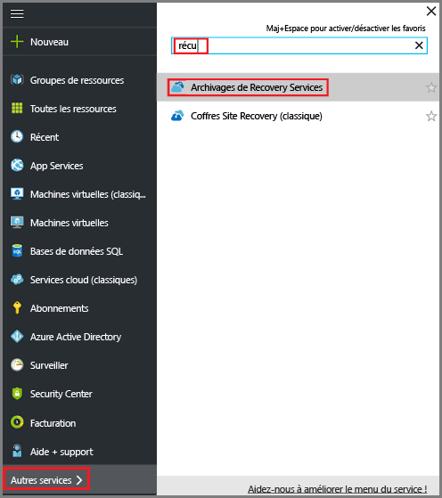 <br/>

    Si l’abonnement inclut des coffres Recovery Services, ces derniers sont répertoriés.
3. Dans le menu **Coffres Recovery Services**, cliquez sur **Ajouter**.

    

    Le panneau du coffre Recovery Services s’affiche et vous invite à renseigner les champs **Nom**, **Abonnement**, **Groupe de ressources** et **Emplacement**.

    

4. Sous **Nom**, entrez un nom convivial permettant d’identifier le coffre. Le nom doit être unique pour l’abonnement Azure. Tapez un nom contenant entre 2 et 50 caractères. Il doit commencer par une lettre, et ne peut contenir que des lettres, des chiffres et des traits d’union.

5. Dans la section **Abonnement**, utilisez le menu déroulant pour choisir l’abonnement Azure. Si vous n’utilisez qu’un seul abonnement, ce dernier s’affiche et vous pouvez passer directement à l’étape suivante. Si vous n’êtes pas sûr de l’abonnement à utiliser, utilisez l’abonnement par défaut (ou suggéré). Vous ne disposez de plusieurs choix que si votre compte professionnel est associé à plusieurs abonnements Azure.

6. Dans la section **Groupe de ressources** :

    * Sélectionnez **Créer** si vous voulez créer un groupe de ressources.
    Ou
    * sélectionnez **Utiliser existant** et cliquez sur le menu déroulant pour afficher la liste des groupes de ressources disponibles.

  Pour plus d’informations sur les groupes de ressources, consultez [Vue d’ensemble d’Azure Resource Manager](../azure-resource-manager/resource-group-overview.md).

7. Cliquez sur **Emplacement** pour sélectionner la région géographique du coffre. Ce choix définit la région géographique où vos données de sauvegarde sont envoyées.

8. En bas du panneau du coffre Recovery Services, cliquez sur **créer**.

    La création du coffre Recovery Services peut prendre plusieurs minutes. Surveillez les notifications d'état dans l'angle supérieur droit du portail. Une fois votre archivage créé, il apparaît dans la liste des archivages de Recovery Services. Si vous ne voyez pas votre coffre après quelques minutes, cliquez sur **Actualiser**.

    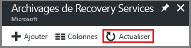</br>

    Une fois que votre coffre apparaît dans la liste des coffres Recovery Services, vous êtes prêt à définir la redondance du stockage.

### <a name="set-storage-redundancy-for-the-vault"></a>Définir la redondance du stockage pour un coffre
Lorsque vous créez un coffre Recovery Services, vérifiez que la redondance du stockage est configurée comme vous le souhaitez.

1. Dans le panneau **Coffres Recovery Services**, cliquez sur le nouveau coffre.

    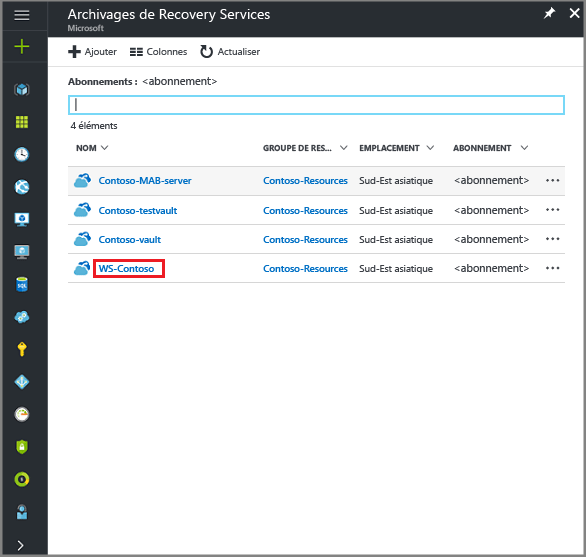

    Lorsque vous sélectionnez le coffre, le panneau **Coffre Recovery Services** se réduit et le panneau Paramètres (*qui porte le nom du coffre en haut*) ainsi que le panneau des détails du coffre s’ouvrent.

    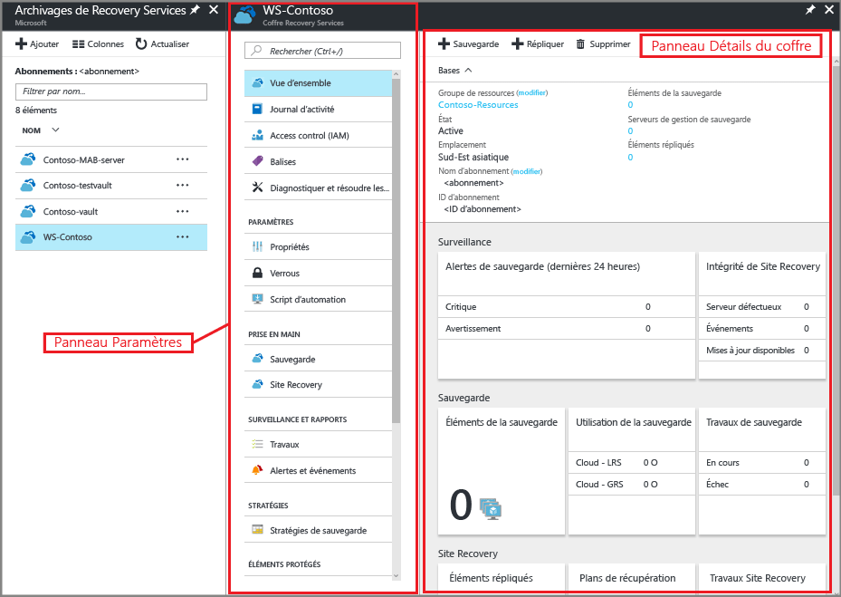
2. Dans le panneau Paramètres du nouveau coffre, utilisez le curseur vertical pour faire défiler l’écran jusqu'à la section Gestion, puis cliquez sur **Infrastructure de sauvegarde**.
    Le panneau Infrastructure de sauvegarde s’ouvre.
3. Dans le panneau Infrastructure de sauvegarde, cliquez sur **Configuration de la sauvegarde** pour ouvrir le panneau **Configuration de la sauvegarde**.

    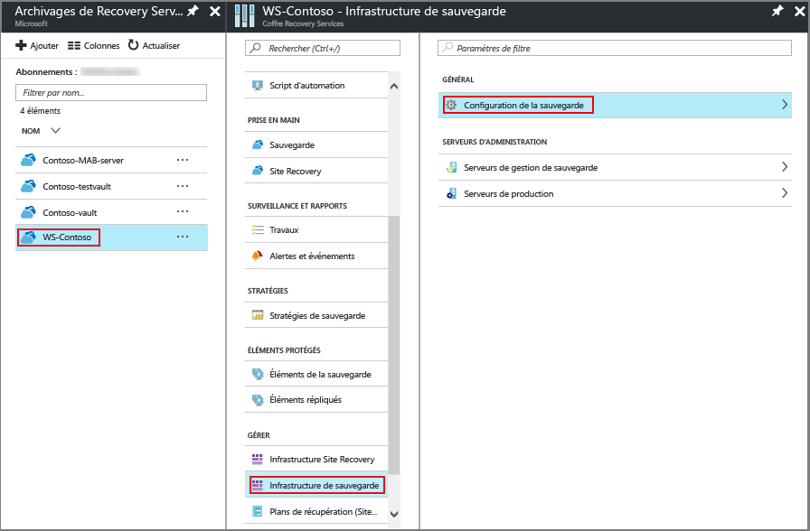
4. Choisissez l’option de réplication de stockage à appliquer à votre archivage.

    

    Par défaut, votre archivage utilise un stockage géo-redondant. Si vous utilisez Azure comme principal point de terminaison du stockage de sauvegarde, laissez cette option **inchangée**. Sinon, choisissez l’option **Localement redondant**, qui réduit les coûts de stockage Azure. Pour en savoir plus sur les options de stockage [géo-redondant](../storage/common/storage-redundancy.md#geo-redundant-storage) et [localement redondant](../storage/common/storage-redundancy.md#locally-redundant-storage), consultez la [présentation de la redondance du stockage](../storage/common/storage-redundancy.md).

Une fois votre coffre créé, vous devez le configurer pour la sauvegarde de l’état du système Windows.

## <a name="configure-the-vault"></a>configuration du coffre
1. Dans le panneau du coffre Recovery Services que vous venez de créer, accédez à la section Prise en main, puis cliquez sur **Sauvegarde** ; dans le panneau **Prise en main de la sauvegarde**, sélectionnez **Objectif de la sauvegarde**.

    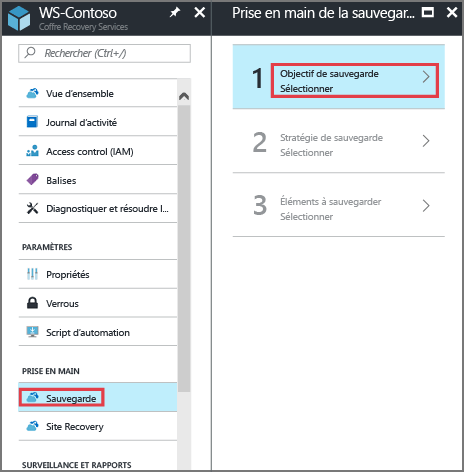

    Le panneau **Objectif de la sauvegarde** s’ouvre.

    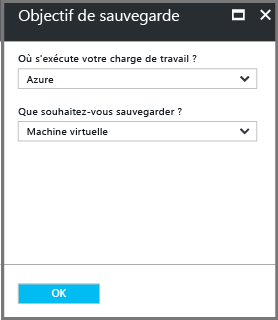

2. Dans la liste déroulante **Où s’exécute votre charge de travail ?**, sélectionnez **Local**.

    En effet, vous devez choisir l’option **Local**, car votre ordinateur Windows Server ou Windows est une machine physique, qui ne se trouve donc pas dans Azure.

3. Dans le menu **Que voulez-vous sauvegarder ?**, sélectionnez **État du système** et cliquez sur **OK**.

    

    Lorsque vous cliquez sur OK, une coche apparaît en regard de la zone **Objectif de la sauvegarde** et le volet **Préparer l’infrastructure** s’ouvre.

    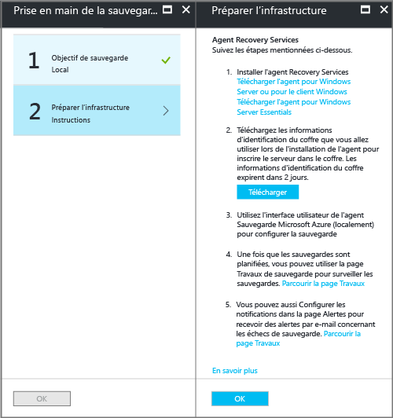

4. Dans le panneau **Préparer l’infrastructure**, cliquez sur **Télécharger l’agent pour Windows Server ou pour le client Windows**.

    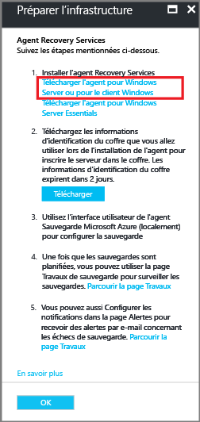

    Si vous utilisez Windows Server Essentials, puis choisissez de télécharger l’agent associé à ce produit, un menu contextuel vous invite à exécuter ou enregistrer le fichier MARSAgentInstaller.exe.

    

5. Dans le menu contextuel de téléchargement, cliquez sur **Enregistrer**.

    Par défaut, le fichier **MARSagentinstaller.exe** est enregistré dans le dossier Téléchargements. Une fois l’exécution du programme d’installation terminée, une fenêtre contextuelle s’affiche, vous demandant si vous voulez lancer ce programme ou ouvrir le dossier.

    

    Vous n’avez pas besoin d’installer l’agent à cette étape ; Vous pouvez installer l’agent après avoir téléchargé les informations d’identification du coffre.

6. Dans le panneau **Préparer l’infrastructure**, cliquez sur **Télécharger**.

    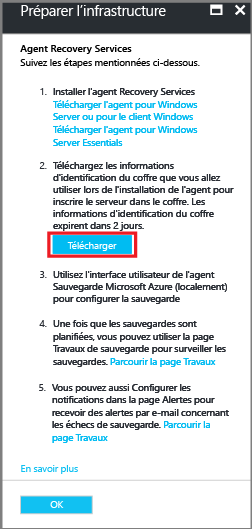

    Les informations d’identification du coffre sont téléchargées dans le dossier Téléchargements. Une fois cette opération terminée, une fenêtre contextuelle s’affiche, vous demandant si vous voulez ouvrir ou enregistrer ces informations. Cliquez sur **Save**. Si vous cliquez sur **Ouvrir** par erreur, attendez que la boîte de dialogue qui s’affiche annonce l’échec de la tentative d’ouverture des informations d’identification du coffre. En effet, vous ne pouvez pas les ouvrir. Passez à l'étape suivante. Les informations d’identification du coffre se trouvent dans le dossier Téléchargements.   

    

## <a name="install-and-register-the-agent"></a>Installer et inscrire l’agent

> [!NOTE]
> La fonction de sauvegarde via le portail Azure n’est pas disponible pour le moment. Utilisez l’agent Microsoft Azure Recovery Services pour sauvegarder l’état du système Windows Server.
>

1. Recherchez et double-cliquez sur **MARSagentinstaller.exe** dans le dossier Téléchargements (ou tout autre emplacement d’enregistrement).

    Le programme d’installation affiche différents messages au fur et à mesure qu’il extrait, installe et enregistre l’agent Recovery Services.

    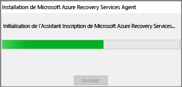

2. Exécutez l’Assistant Installation de l’Agent Microsoft Azure Recovery Services. Pour terminer l’Assistant, vous devez :

   * Choisir un emplacement pour le dossier d’installation et de cache.
   * Fournir les informations relatives au serveur proxy, si vous en utilisez un pour vous connecter à Internet.
   * Fournir votre nom d’utilisateur et votre mot de passe si vous utilisez un proxy authentifié.
   * Fournir les informations d’identification de l’archivage téléchargées.
   * Enregistrer la phrase secrète de chiffrement dans un emplacement sécurisé.

     > [!NOTE]
     > En cas de perte ou d’oubli de la phrase secrète, Microsoft ne pourra pas vous aider à récupérer les données de sauvegarde. Enregistrez le fichier dans un emplacement sécurisé. Il est nécessaire pour restaurer une sauvegarde.
     >
     >

L’agent est désormais installé et votre ordinateur est inscrit dans le coffre. Vous êtes prêt à configurer et à planifier votre sauvegarde.

## <a name="back-up-windows-server-system-state-preview"></a>Sauvegarder l’état du système Windows Server (préversion)
La sauvegarde initiale comprend trois tâches :

* Activer la sauvegarde de l’état du système à l’aide de l’agent de sauvegarde Azure
* Planifier la sauvegarde
* Sauvegarder les fichiers et dossiers pour la première fois

Pour effectuer la sauvegarde initiale, utilisez l’agent Microsoft Azure Recovery Services.

### <a name="to-enable-system-state-backup-using-the-azure-backup-agent"></a>Pour activer la sauvegarde de l’état du système à l’aide de l’agent de sauvegarde Azure

1. Dans une session PowerShell, exécutez la commande suivante pour arrêter le moteur de sauvegarde Azure.

  ```
  PS C:\> Net stop obengine
  ```

2. Ouvrez le Registre Windows.

  ```
  PS C:\> regedit.exe
  ```

3. Ajoutez la clé de Registre suivante avec la valeur DWord spécifiée.

  | Chemin d’accès au Registre | Clé de Registre | Valeur DWord |
  |---------------|--------------|-------------|
  | HKEY_LOCAL_MACHINE\SOFTWARE\Microsoft\Windows Azure Backup\Config\CloudBackupProvider | TurnOffSSBFeature | 2 |

4. Redémarrez le moteur de sauvegarde en exécutant la commande suivante à partir d’une invite de commandes avec élévation de privilèges.

  ```
  PS C:\> Net start obengine
  ```

### <a name="to-schedule-the-backup-job"></a>Pour planifier un travail de sauvegarde

1. Ouvrez l’agent Microsoft Azure Recovery Services. Vous pouvez le trouver en recherchant **Sauvegarde Microsoft Azure**sur votre ordinateur.

    

2. Dans l’agent Recovery Services, cliquez sur **Planifier la sauvegarde**.

    

3. Sur la page Mise en route de l’Assistant Planifier la sauvegarde, cliquez sur **Suivant**.

4. Sur la page Sélectionner les éléments à sauvegarder, cliquez sur **Ajouter des éléments**.

5. Sélectionnez **État du système**, puis cliquez sur **OK**.

6. Cliquez sur **Suivant**.

7. La planification de sauvegarde et de rétention de l’état du système est configurée automatiquement pour effectuer une sauvegarde tous les dimanches à 21h00 heure locale, et la période de rétention est définie sur 60 jours.

   > [!NOTE]
   > La stratégie de sauvegarde et de rétention de l’état du système est configurée automatiquement. Si vous sauvegardez Fichiers et dossiers en plus de l’état du système Windows Server, spécifiez uniquement la stratégie Sauvegarde et rétention pour les sauvegardes de fichiers à partir de l’Assistant. 
   >

8. Sur la page Confirmation, passez en revue les informations, puis cliquez sur **Terminer**.

9. Lorsque l’Assistant a terminé la création de la planification de la sauvegarde, cliquez sur **Fermer**.

### <a name="to-back-up-windows-server-system-state-for-the-first-time"></a>Pour sauvegarder l’état du système Windows Server pour la première fois

1. Vérifiez qu’aucune mise à jour de Windows Server nécessitant un redémarrage n’est en attente.

2. Dans l’agent Recovery Services, cliquez sur **Sauvegarder maintenant** pour effectuer l’amorçage initial sur le réseau.

    

3. Sur la page Confirmation, vérifiez les paramètres utilisés par l’Assistant Sauvegarder maintenant pour sauvegarder les données de l’ordinateur, puis cliquez sur **Sauvegarder**.

4. Cliquez sur **Fermer** pour fermer l’assistant. Si vous fermez l’Assistant avant la fin du processus de sauvegarde, celui-ci continuera de s’exécuter en arrière-plan.

5. Si vous sauvegardez Fichiers et dossiers sur votre serveur, en plus de l’état du système Windows Server, l’Assistant Sauvegarder maintenant sauvegardera uniquement les fichiers. Pour effectuer une sauvegarde ad hoc de l’état du système, exécutez la commande PowerShell suivante :

    ```
    PS C:\> Start-OBSystemStateBackup
    ```

  Une fois la sauvegarde initiale terminée, le statut **Tâche terminée** apparaît dans la console Backup.

  

## <a name="frequently-asked-questions"></a>Forum Aux Questions

Les questions et réponses suivantes fournissent des informations supplémentaires.

### <a name="what-is-the-staging-volume"></a>Qu’est-ce que le volume intermédiaire ?

Le volume intermédiaire représente l’emplacement intermédiaire où la Sauvegarde Windows Server disponible en mode natif prépare la sauvegarde de l’état du système. Ensuite, l’agent de sauvegarde Azure compresse et chiffre cette sauvegarde intermédiaire, et il l’envoie au coffre Recovery Services configuré par le biais du protocole HTTPS sécurisé. **Nous vous recommandons vivement d’établir le volume intermédiaire sur un volume autre qu’un volume de système d’exploitation Windows. Si vous observez des problèmes avec les sauvegardes de l’état du système, la vérification de l’emplacement de votre volume intermédiaire est la première étape de dépannage.** 

### <a name="how-can-i-change-the-staging-volume-path-specified-in-the-azure-backup-agent"></a>Comment faire pour modifier le chemin du volume intermédiaire spécifié dans l’agent de sauvegarde Azure ?

Le volume intermédiaire se trouve par défaut dans le dossier de cache. 

1. Pour changer cet emplacement, exécutez la commande suivante (à partir d’une invite de commandes avec élévation de privilèges) :
  ```
  PS C:\> Net stop obengine
  ```

2. Ensuite, mettez à jour les entrées de Registre suivantes avec le chemin du nouveau dossier de volume intermédiaire.

  |Chemin d’accès au Registre|Clé de Registre|Valeur|
  |-------------|------------|-----|
  |HKEY_LOCAL_MACHINE\Software\Microsoft\Windows Azure Backup\Config\CloudBackupProvider | SSBStagingPath | nouvel emplacement du volume intermédiaire |

Le chemin intermédiaire respecte la casse et doit avoir exactement la même casse que ce qui existe sur le serveur. 

3. Une fois que vous avez changé le chemin du volume intermédiaire, redémarrez le moteur de sauvegarde :
  ```
  PS C:\> Net start obengine
  ```
4. Pour récupérer le chemin modifié, ouvrez l’agent Microsoft Azure Recovery Services et déclenchez une sauvegarde ad hoc de l’état du système.

### <a name="why-is-the-system-state-default-retention-set-to-60-days"></a>Pourquoi la rétention par défaut de l’état du système est-elle définie sur 60 jours ?

La durée de vie utile d’une sauvegarde de l’état du système est identique au paramètre « durée de vie de temporisation » pour le rôle Windows Server Active Directory. La valeur par défaut pour l’entrée de durée de vie de temporisation est de 60 jours. Cette valeur peut être définie sur l’objet de configuration du Service d’annuaire (NTDS).

### <a name="how-do-i-change-the-default-backup-and-retention-policy-for-system-state"></a>Comment faire pour changer la stratégie de sauvegarde et de rétention par défaut pour l’état du système ?

Pour changer la stratégie de sauvegarde et de rétention par défaut pour l’état du système
1. Arrêtez le moteur de sauvegarde. Exécutez la commande suivante à partir d’une invite de commandes avec élévation de privilèges.

  ```
  PS C:\> Net stop obengine
  ```

2. Ajoutez ou mettez à jour les entrées de clés de Registre suivantes dans HKEY_LOCAL_MACHINE\SOFTWARE\Microsoft\Windows Azure Backup\Config\CloudBackupProvider.

  |Nom de Registre|Description|Valeur|
  |-------------|-----------|-----|
  |SSBScheduleTime|Permet de configurer l’heure de la sauvegarde. La valeur par défaut est 21h00 heure locale.|DWord : format HHMM (décimal), par exemple 2130 pour 21h30 heure locale.|
  |SSBScheduleDays|Permet de configurer les jours pendant lesquels la sauvegarde de l’état du système doit être effectuée à l’heure spécifiée. Les chiffres spécifient les jours de la semaine. 0 représente le dimanche, 1 le lundi, et ainsi de suite. Le jour de sauvegarde par défaut est le dimanche.|DWord : jours de la semaine pendant lesquels effectuer une sauvegarde (décimal). Par exemple, 1230 planifie les sauvegardes le lundi, le mardi, le mercredi et le dimanche.|
  |SSBRetentionDays|Permet de configurer le nombre de jours pendant lesquels conserver la sauvegarde. La valeur par défaut est 60. La valeur maximale autorisée est 180.|DWord : nombre de jours pendant lesquels conserver la sauvegarde (décimal).|

3. Exécutez la commande suivante pour redémarrer le moteur de sauvegarde.
    ```
    PS C:\> Net start obengine
    ```

4. Ouvrez l’agent Microsoft Recovery Services.

5. Cliquez sur **Planifier la sauvegarde**, puis sur **Suivant** jusqu’à ce que les changements soient reflétés.

6. Cliquez sur **Terminer** pour appliquer les modifications.


## <a name="questions"></a>Des questions ?
Si vous avez des questions ou si vous souhaitez que certaines fonctionnalités soient incluses, [envoyez-nous vos commentaires](http://aka.ms/azurebackup_feedback).

## <a name="next-steps"></a>Étapes suivantes
* Approfondissez vos connaissances sur la [sauvegarde de machines Windows](backup-configure-vault.md).
* Maintenant que vous avez sauvegardé vos fichiers et vos dossiers, vous pouvez [gérer vos archivages et vos serveurs](backup-azure-manage-windows-server.md).
* Si vous avez besoin de restaurer une sauvegarde, utilisez cet article pour [restaurer des fichiers sur un ordinateur Windows](backup-azure-restore-windows-server.md).
