# Sauvegarde de machines virtuelles Azure dans des coffres Recovery Services
> [!div class="op_single_selector"]
> * [Protéger les machines virtuelles avec un coffre Recovery Services](backup-azure-vms-first-look-arm.md)
> * [Protéger les machines virtuelles avec un coffre de sauvegarde](backup-azure-vms-first-look.md)
>
>

Ce didacticiel détaille les procédures de création d’un coffre Recovery Services et de sauvegarde d’une machine virtuelle Azure. Les coffres Recovery Services protègent :

* Machines virtuelles déployées à l’aide de Resource Manager
* les machines virtuelles Classic,
* les machines virtuelles de stockage standard,
* les machines virtuelles Premium Storage.
* Machines virtuelles exécutées sur des disques gérés
* Les machines virtuelles chiffrées à l’aide d’Azure Disk Encryption
* Sauvegarde cohérente des applications des machines virtuelles Windows à l’aide de machines virtuelles VSS et Linux avec des scripts pré et post-instantané personnalisés

Pour plus d’informations sur la protection des machines virtuelles Stockage Premium, consultez la section [Sauvegarder et restaurer des machines virtuelles Stockage Premium](backup-introduction-to-azure-backup.md#using-premium-storage-vms-with-azure-backup). Pour plus d’informations sur la prise en charge des machines virtuelles sur disques gérés, consultez la section [Back up and restore VMs on managed disks](backup-introduction-to-azure-backup.md#using-managed-disk-vms-with-azure-backup) (Sauvegarder et restaurer des machines virtuelles sur des disques gérés). Pour plus d’informations sur l’infrastructure pré et post-script pour la sauvegarde de machine virtuelle Linux, consultez l’article [Sauvegarde de machine virtuelle Linux cohérente dans l’application à l’aide de pré/post-scripts] (https://docs.microsoft.com/azure/backup/backup-azure-linux-app-consistent).

Pour plus d’informations sur ce que vous pouvez ou non sauvegarder, consultez [cette section](backup-azure-vms-prepare.md#limitations-when-backing-up-and-restoring-a-vm).

> [!NOTE]
> Dans ce didacticiel, nous partons du principe que vous disposez déjà d’une machine virtuelle dans votre abonnement Azure et que vous avez autorisé le service de sauvegarde à accéder à la machine virtuelle.
>
>

[!INCLUDE [learn-about-Azure-Backup-deployment-models](../../includes/backup-deployment-models.md)]

Votre point de départ varie selon le nombre de machines virtuelles que vous souhaitez protéger. Si vous voulez sauvegarder plusieurs machines virtuelles en une seule opération, accédez au coffre Recovery Services et [lancez la sauvegarde à partir du tableau de bord du coffre](backup-azure-vms-first-look-arm.md#configure-the-backup-job-from-the-recovery-services-vault). Si vous ne voulez sauvegarder qu’une seule machine virtuelle, vous pouvez effectuer la sauvegarde directement dans le panneau de gestion de la machine virtuelle.

## Configurer la sauvegarde à partir du panneau de gestion de la machine virtuelle

La procédure ci-après vous guide dans la configuration du travail de sauvegarde à partir du panneau de gestion des machines virtuelles du portail Azure. Cette procédure ne s’applique pas aux machines virtuelles dans le Portail Azure Classic.

1. Connectez-vous au [portail Azure](https://portal.azure.com/).
2. Dans le Menu hub, cliquez sur **Autres services** et, dans la boîte de dialogue Filtrer, tapez **Machines virtuelles**. Lorsque vous tapez cette chaîne, la liste des ressources est filtrée en conséquence. Dès que vous voyez apparaître le service Machines virtuelles, sélectionnez-le.

  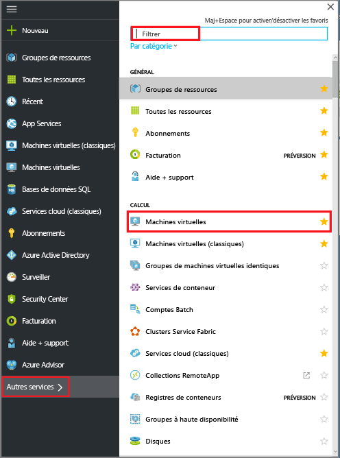

  La liste des machines virtuelles de l’abonnement apparaît.

  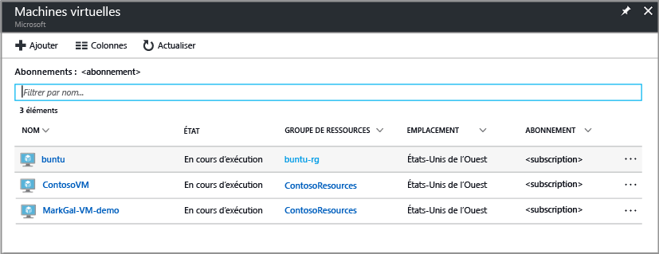

3. Dans la liste, sélectionnez la machine virtuelle que vous souhaitez sauvegarder.

  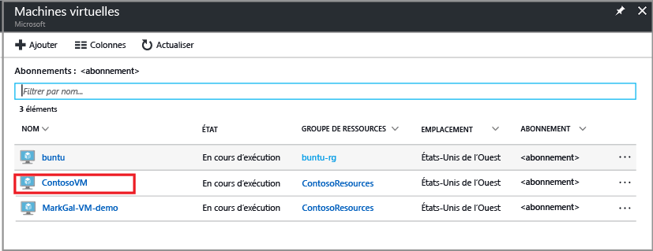

  Lorsque vous sélectionnez la machine virtuelle, la liste des machines virtuelles se déplace vers la gauche, tandis que le panneau de gestion et le tableau de bord de la machine virtuelle s’affichent.  
 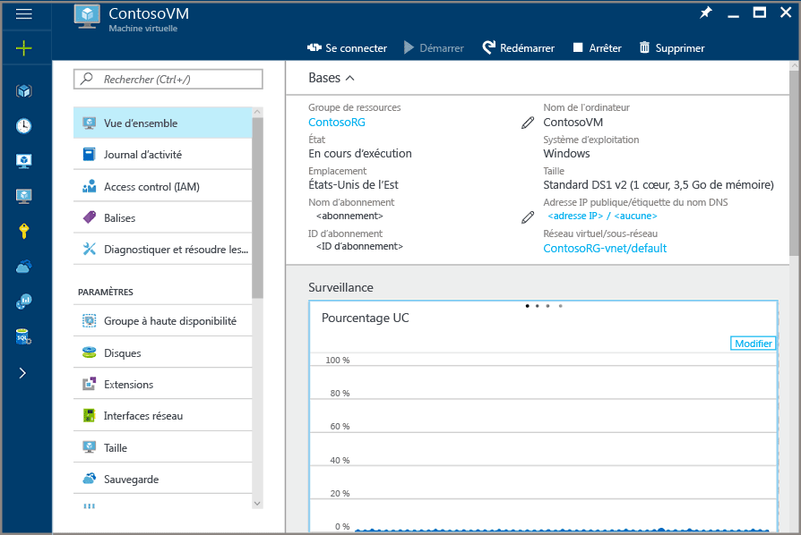

4. Dans le panneau de gestion de la machine virtuelle, au niveau de la section **Paramètres**, cliquez sur **Sauvegarde**.  

  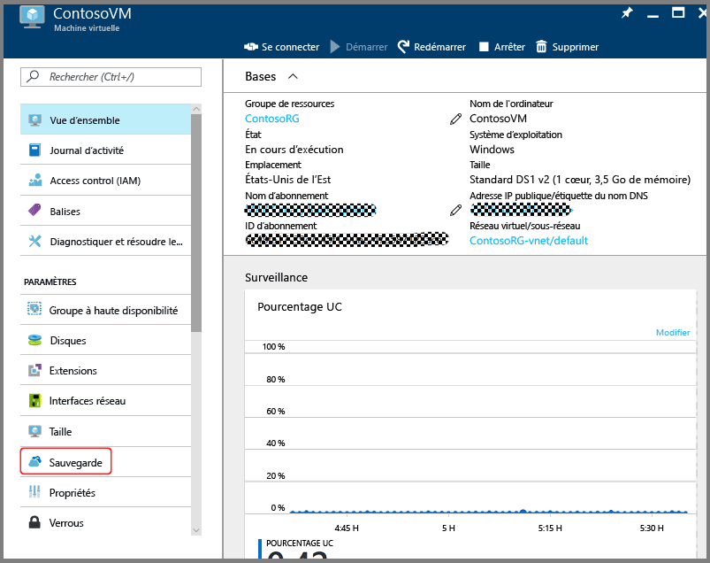

  Le panneau Activer la sauvegarde s’ouvre.

  

5. Pour le coffre Recovery Services, cliquez sur **Sélectionner**, puis choisissez le coffre dans la liste déroulante.

  

  S’il n’existe aucun coffre Recovery Services ou que vous souhaitez utiliser un nouveau coffre, cliquez sur **Créer** et fournissez le nom du nouveau coffre. Un coffre est créé dans le même groupe de ressources et au même emplacement que la machine virtuelle. Si vous souhaitez créer un coffre Recovery Services avec d’autres valeurs, consultez la section décrivant comment [créer un coffre Recovery Services](backup-azure-vms-first-look-arm.md#create-a-recovery-services-vault-for-a-vm).

6. Pour visualiser les détails de la stratégie de sauvegarde, cliquez sur **Stratégie de sauvegarde**.

  Le panneau **Stratégie de sauvegarde** s’affiche en présentant les détails de la stratégie sélectionnée. Si d’autres stratégies de sauvegarde existent, utilisez le menu déroulant pour choisir une autre stratégie. Pour créer une stratégie, sélectionnez **Créer** dans le menu déroulant. Pour savoir comment définir une stratégie de sauvegarde, consultez la section [Définition d’une stratégie de sauvegarde](backup-azure-vms-first-look-arm.md#defining-a-backup-policy). Pour enregistrer les modifications de la stratégie de sauvegarde et revenir au panneau Activer la sauvegarde, cliquez sur **OK**.

  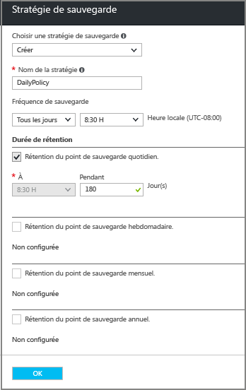

7. Dans le panneau Activer la sauvegarde, cliquez sur **Activer la sauvegarde** pour déployer la stratégie. En déployant la stratégie, vous l’associez au coffre et aux machines virtuelles.

  

8. Vous pouvez suivre la progression de la configuration par le biais des notifications qui apparaissent dans le portail. L’exemple ci-après indique que le déploiement a démarré.

  

9. Une fois la configuration terminée, cliquez sur **Sauvegarde** dans le panneau de gestion de la machine virtuelle pour ouvrir le panneau Éléments de sauvegarde et en visualiser les détails.

  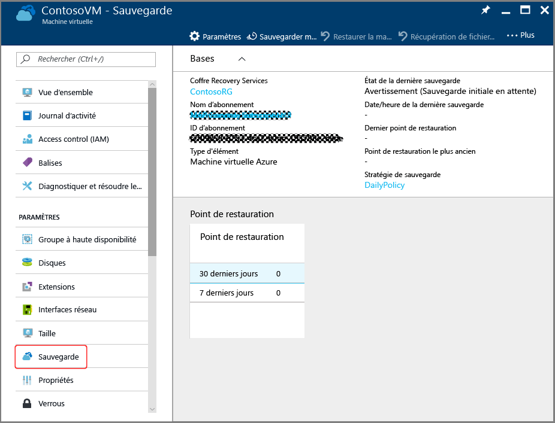

  Jusqu’à la fin de la sauvegarde initiale, la zone **État de la dernière sauvegarde** présente la valeur **Avertissement (Sauvegarde initiale en attente)**. Pour connaître l’heure du prochain travail de sauvegarde planifié, sous **Stratégie de sauvegarde**, cliquez sur le nom de la stratégie. Le panneau Stratégie de sauvegarde s’affiche et indique l’heure de la sauvegarde planifiée.

10. Pour exécuter un travail de sauvegarde et créer le point de récupération initial, dans le panneau Archivage de sauvegarde, cliquez sur **Sauvegarder maintenant**.

  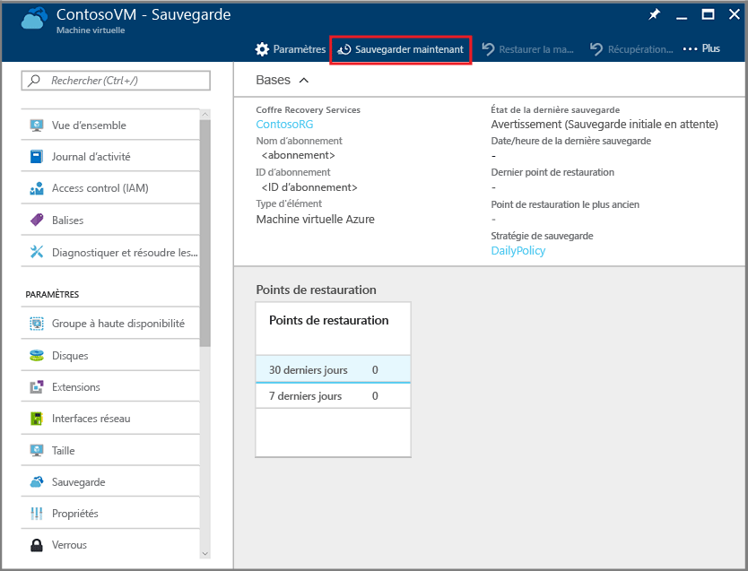

  Le panneau Sauvegarder maintenant s’affiche.

  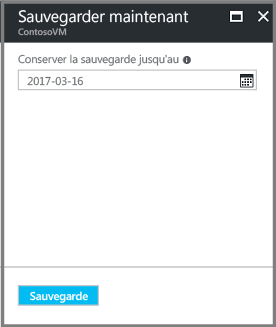

11. Dans le panneau Sauvegarder maintenant, cliquez sur l’icône de calendrier. Utilisez le contrôle de calendrier pour sélectionner le dernier jour de conservation de ce point de récupération, puis cliquez sur **Sauvegarder**.

  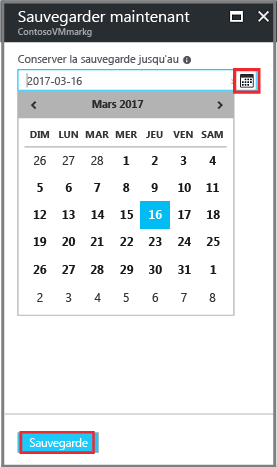

  Les notifications de déploiement vous informent que la sauvegarde a été déclenchée et que vous pouvez surveiller la progression du travail sur la page Travaux de sauvegarde.

## Configurer le travail de sauvegarde à partir du coffre Recovery Services
Pour configurer la tâche de sauvegarde, vous procédez comme suit.  

1. Vous créez un coffre Recovery Services pour une machine virtuelle.
2. Utilisez le portail Azure pour sélectionner un scénario, définir une stratégie de sauvegarde, puis identifier les éléments à protéger.
3. Effectuez la sauvegarde initiale.

## Création d’un coffre Recovery Services pour une machine virtuelle
Un archivage de Recovery Services est une entité qui stocke l’ensemble des sauvegardes et des points de récupération créés au fil du temps. L’archivage de Recovery Services contient également la stratégie de sauvegarde appliquée aux machines virtuelles protégées.

> [!NOTE]
> La sauvegarde de machines virtuelles est un processus local. Vous ne pouvez pas sauvegarder de machines virtuelles d’un emplacement dans un archivage de Recovery Services situé dans un autre emplacement. Donc, dans chaque emplacement Azure contenant des machines virtuelles à sauvegarder, il doit exister au moins un archivage de Recovery Services.
>
>

Pour créer un archivage de Recovery Services :

1. Si ce n’est pas déjà fait, connectez-vous au [portail Azure](https://portal.azure.com/) à l’aide de votre abonnement Azure.
2. Dans le Menu hub, cliquez sur **Autres services** et, dans la boîte de dialogue Filtrer, tapez **Recovery Services**. Lorsque vous tapez cette chaîne, la liste des ressources est filtrée en conséquence. Dès que vous voyez la ressource Archivages de Recovery Services apparaître dans la liste, cliquez dessus.

      

    Si l’abonnement inclut des coffres Recovery Services, ces derniers sont répertoriés.

    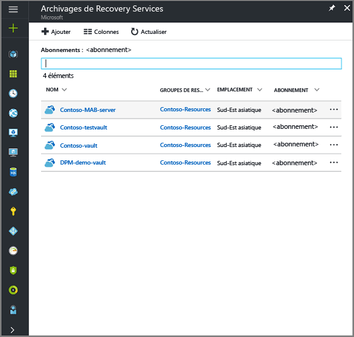
3. Dans le menu **Coffres Recovery Services**, cliquez sur **Ajouter**.

    

    Le panneau du coffre Recovery Services s’affiche et vous invite à renseigner les champs **Nom**, **Abonnement**, **Groupe de ressources** et **Emplacement**.

    

4. Sous **Nom**, entrez un nom convivial permettant d’identifier le coffre. Le nom doit être unique pour l’abonnement Azure. Tapez un nom contenant entre 2 et 50 caractères. Il doit commencer par une lettre, et ne peut contenir que des lettres, des chiffres et des traits d’union.

5. Dans la section **Abonnement**, utilisez le menu déroulant pour choisir l’abonnement Azure. Si vous n’utilisez qu’un seul abonnement, ce dernier s’affiche et vous pouvez passer directement à l’étape suivante. Si vous n’êtes pas sûr de l’abonnement à utiliser, utilisez l’abonnement par défaut (ou suggéré). Vous ne disposez de plusieurs choix que si votre compte professionnel est associé à plusieurs abonnements Azure.

6. Dans la section **Groupe de ressources** :

    * Sélectionnez **Créer** si vous voulez créer un groupe de ressources.
    Ou
    * sélectionnez **Utiliser existant** et cliquez sur le menu déroulant pour afficher la liste des groupes de ressources disponibles.

  Pour plus d’informations sur les groupes de ressources, consultez [Vue d’ensemble d’Azure Resource Manager](../azure-resource-manager/resource-group-overview.md).

7. Cliquez sur **Emplacement** pour sélectionner la région géographique du coffre. Ce choix définit la région géographique où vos données de sauvegarde sont envoyées.

  > [!IMPORTANT]
  > Si vous ne savez pas où se trouve votre machine virtuelle, fermez la boîte de dialogue de création d’archivage et accédez à la liste des machines virtuelles dans le portail. Si vous possédez des machines virtuelles dans plusieurs régions, créez un coffre Recovery Services dans chacune d’entre elles. Créez l’archivage dans le premier emplacement avant de passer à l'emplacement suivant. Il est inutile de spécifier les comptes de stockage dans lesquels stocker les données de sauvegarde : le coffre Recovery Services et le service de sauvegarde Azure gèrent cela automatiquement.
  >

8. En bas du panneau du coffre Recovery Services, cliquez sur **créer**.

    La création du coffre Recovery Services peut prendre plusieurs minutes. Surveillez les notifications d'état dans l'angle supérieur droit du portail. Une fois votre archivage créé, il apparaît dans la liste des archivages de Recovery Services. Si vous ne voyez pas votre coffre après quelques minutes, cliquez sur **Actualiser**.

     

    Une fois que votre coffre apparaît dans la liste des coffres Recovery Services, vous êtes prêt à définir la redondance du stockage.

Maintenant que vous avez créé votre archivage, découvrez comment définir la réplication du stockage.

### Définir la réplication du stockage
L’option de réplication du stockage vous permet de choisir entre stockage géo-redondant et stockage localement redondant. Par défaut, votre archivage utilise un stockage géo-redondant. Si le coffre Recovery Services est votre sauvegarde principale, laissez l’option de réplication de stockage définie sur le stockage géoredondant. Choisissez Stockage localement redondant si vous souhaitez une option plus économique, mais moins durable. Pour en savoir plus sur les options de stockage [géo-redondant](../storage/common/storage-redundancy.md#geo-redundant-storage) et [localement redondant](../storage/common/storage-redundancy.md#locally-redundant-storage), consultez l’article [Réplication Azure Storage](../storage/common/storage-redundancy.md).

Pour modifier le paramètre de réplication du stockage :

1. Dans le panneau **Archivages de Recovery Services**, sélectionnez le nouveau coffre.

  

  Lorsque vous cliquez sur le coffre, le panneau Paramètres (*dont la partie supérieure porte le nom du coffre*) et le panneau des détails du coffre s’ouvrent.

  

2. Dans le panneau Paramètres du nouveau coffre, utilisez le curseur vertical pour faire défiler l’écran jusqu'à la section Gestion, puis cliquez sur **Infrastructure de sauvegarde**.
    Le panneau Infrastructure de sauvegarde s’ouvre.
3. Dans le panneau Infrastructure de sauvegarde, cliquez sur **Configuration de la sauvegarde** pour ouvrir le panneau **Configuration de la sauvegarde**.

    
4. Choisissez l’option de réplication de stockage à appliquer à votre archivage.

    

    Par défaut, votre archivage utilise un stockage géo-redondant. Si vous utilisez Azure comme principal point de terminaison du stockage de sauvegarde, laissez cette option **inchangée**. Sinon, choisissez l’option **Redondant en local** qui réduit les coûts de stockage Azure. Pour en savoir plus sur les options de stockage [géo-redondant](../storage/common/storage-redundancy.md#geo-redundant-storage) et [localement redondant](../storage/common/storage-redundancy.md#locally-redundant-storage), consultez la [présentation de la redondance du stockage](../storage/common/storage-redundancy.md).

## Sélectionner l’objectif d’une sauvegarde, définir la stratégie et définir les éléments à protéger
Avant d’enregistrer une machine virtuelle dans un coffre, lancez le processus de découverte pour vérifier que les nouvelles machines virtuelles ajoutées à l’abonnement sont bien identifiées. Le processus interroge Azure pour obtenir la liste des machines virtuelles de l’abonnement ainsi que des informations supplémentaires, comme le nom du service cloud et la région. Dans le portail Azure, l’objectif fait référence à ce que vous allez placer dans l’archivage de Recovery Services. La stratégie permet de planifier la fréquence et l’heure de la création des points de récupération. Elle inclut également la durée de rétention de ces derniers.

1. Si l’un de vos coffres Recovery Services est déjà ouvert, passez à l’étape 2. Dans le cas contraire, dans le Menu hub, cliquez sur **Autres services**, puis dans la liste des ressources, tapez **Recovery Services** et cliquez sur **Archivages de Recovery Services**.

      

    La liste des coffres Recovery Services s’affiche.

    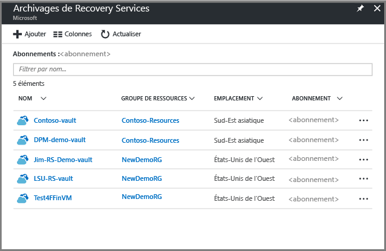

    Dans la liste des coffres Recovery Services, sélectionnez un coffre pour ouvrir son tableau de bord.

     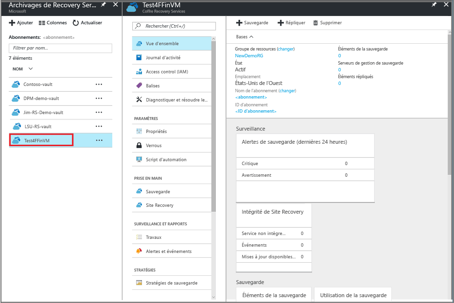

2. Dans le menu du tableau de bord du coffre, cliquez sur **Sauvegarder** pour ouvrir le panneau Sauvegarde.

    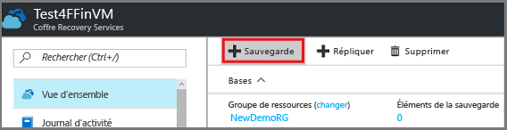

    Les panneaux Sauvegarde et Objectif de sauvegarde s’ouvrent.

    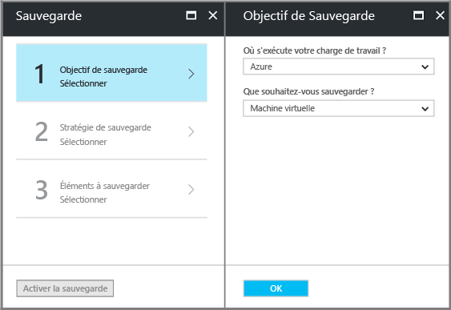
3. Dans le panneau Objectif de sauvegarde, au niveau du menu déroulant **Où s’exécute votre charge de travail ?**, sélectionnez Azure. Au niveau du menu déroulant **Que voulez-vous sauvegarder ?**, sélectionnez Machine virtuelle, puis cliquez sur **OK**.

    Ces actions ont pour conséquence d’inscrire l’extension de machine virtuelle avec le coffre. Le panneau Objectif de sauvegarde se ferme et le panneau **Stratégie de sauvegarde** s’ouvre.

    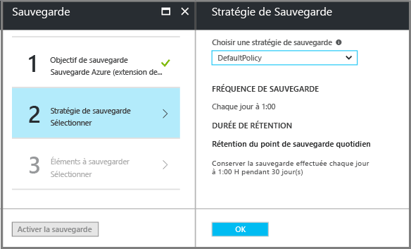

4. Dans le panneau Stratégie de sauvegarde, sélectionnez la stratégie de sauvegarde à appliquer au coffre.

    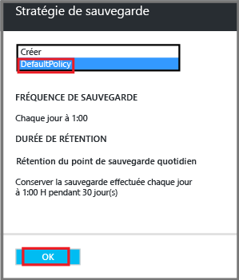

    Les détails de la stratégie par défaut sont répertoriés dans le menu déroulant à l’écran. Pour créer une stratégie, sélectionnez **Créer** dans le menu déroulant. Pour savoir comment définir une stratégie de sauvegarde, consultez la section [Définition d’une stratégie de sauvegarde](backup-azure-vms-first-look-arm.md#defining-a-backup-policy).
    Cliquez sur **OK** pour associer la stratégie de sauvegarde au coffre.

    Le panneau Stratégie de sauvegarde se ferme et le panneau **Sélectionner les machines virtuelles** s’ouvre.
5. Dans le panneau **Sélectionner les machines virtuelles**, sélectionnez les machines virtuelles à associer à la stratégie spécifiée, puis cliquez sur **OK**.

    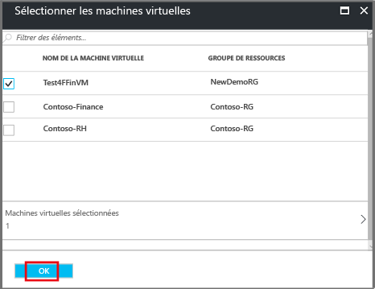

    La machine virtuelle sélectionnée est validée. Si les machines virtuelles que vous attendiez ne sont pas affichées, vérifiez qu’elles existent au même emplacement Azure que le coffre Recovery Services. L’emplacement du coffre Recovery Services est indiqué dans le tableau de bord associé.

6. Maintenant que vous avez défini tous les paramètres du coffre, cliquez sur **Activer la sauvegarde** dans le panneau Sauvegarde pour déployer la stratégie au coffre et aux machines virtuelles. Le déploiement de la stratégie de sauvegarde ne crée pas le point de récupération initial pour la machine virtuelle.

    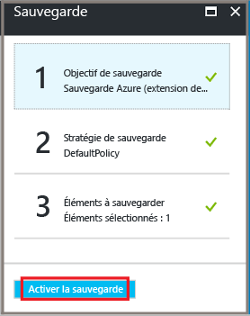

Après l’activation de la sauvegarde, votre stratégie de sauvegarde s’exécutera selon la planification. Toutefois, procédez au lancement du premier travail de sauvegarde.

## Sauvegarde initiale
Le déploiement d’une stratégie de sauvegarde sur la machine virtuelle ne signifie pas que les données ont été sauvegardées. Par défaut, la première sauvegarde planifiée (définie dans la stratégie de sauvegarde) est la sauvegarde initiale. Jusqu’à celle-ci, l’état de la dernière sauvegarde dans le panneau **Travaux de sauvegarde** est défini sur **Avertissement (sauvegarde initiale en attente)**.

À moins que votre sauvegarde initiale ne soit prévue prochainement, il est recommandé de sélectionner l’option **Sauvegarder maintenant**.

Pour exécuter le travail de sauvegarde initial :

1. Dans le tableau de bord du coffre, cliquez sur le numéro sous **Éléments de sauvegarde** ou cliquez sur la vignette **Éléments de sauvegarde**.  
  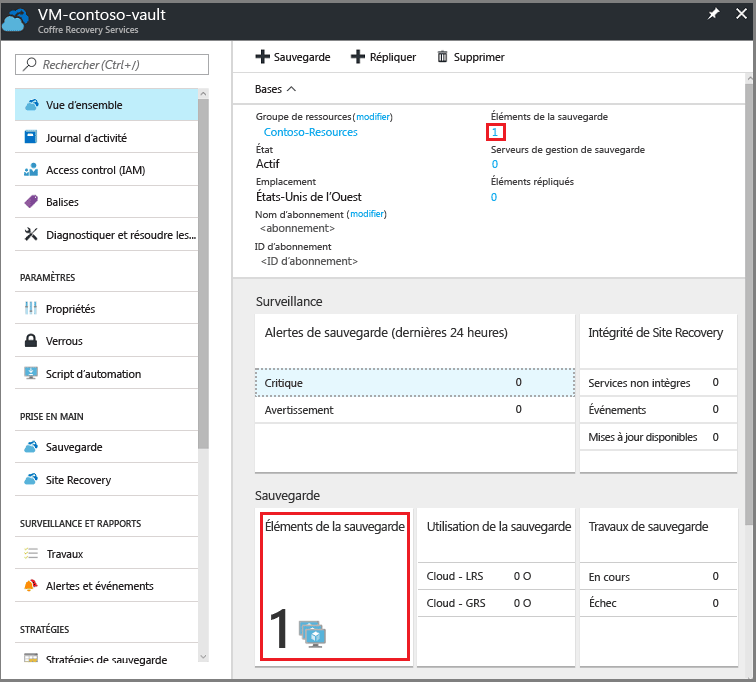

  Le panneau **Éléments de sauvegarde** s’ouvre.

  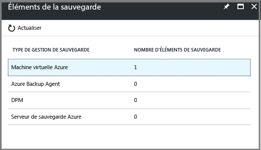

2. Dans le panneau **Éléments de sauvegarde**, sélectionnez l’élément.

  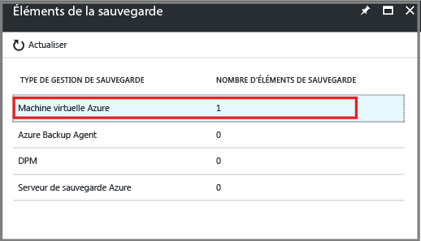

  La liste **Éléments de sauvegarde** s’affiche.  

  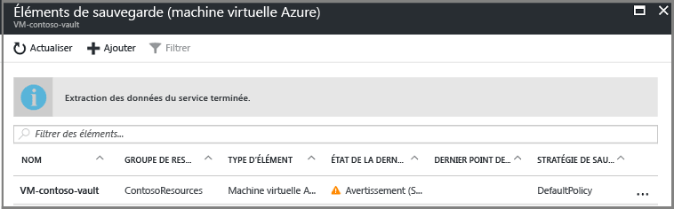

3. Dans la liste **Éléments de sauvegarde**, cliquez sur le bouton de sélection **...** pour ouvrir le menu contextuel.

  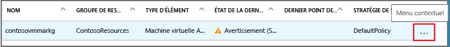

  Le menu contextuel s’affiche.

  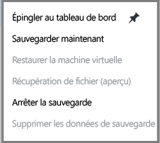

4. Dans le menu contextuel, cliquez sur **Sauvegarder maintenant**.

  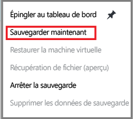

  Le panneau Sauvegarder maintenant s’affiche.

  

5. Dans le panneau Sauvegarder maintenant, cliquez sur l’icône de calendrier. Utilisez le contrôle de calendrier pour sélectionner le dernier jour de conservation de ce point de récupération, puis cliquez sur **Sauvegarder**.

  

  Les notifications de déploiement vous informent que la sauvegarde a été déclenchée et que vous pouvez surveiller la progression du travail sur la page Travaux de sauvegarde. Selon la taille de votre machine virtuelle, la création de la sauvegarde initiale peut prendre un certain temps.

6. Pour afficher ou suivre l’état de la sauvegarde initiale, dans le tableau de bord du coffre, au niveau de la vignette **Travaux de sauvegarde**, cliquez sur **En cours**.

  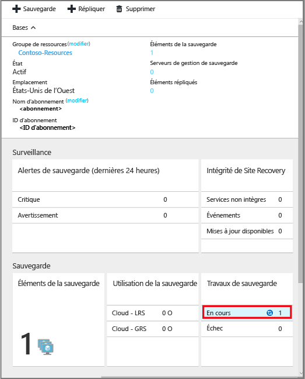

  Le panneau Travaux de sauvegarde s’ouvre.

  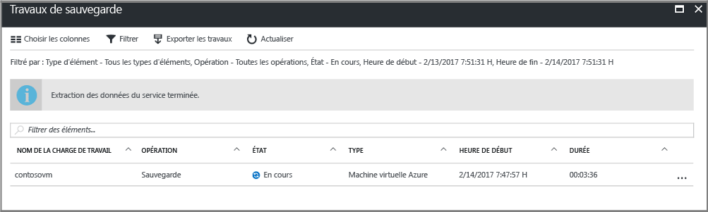

  Le panneau **Travaux de sauvegarde** indique l’état de tous les travaux. Vérifiez si le travail de sauvegarde de votre machine virtuelle est en cours d’exécution ou s’il est terminé. Lorsqu’un travail de sauvegarde est achevé, il présente l’état *Terminé*.

  > [!NOTE]
  > Dans le cadre de l’opération de sauvegarde, le service Azure Backup émet une commande vers l’extension de sauvegarde de chaque machine virtuelle pour vider toutes les écritures et prendre un instantané cohérent.
  >
  >

[!INCLUDE [backup-create-backup-policy-for-vm](../../includes/backup-create-backup-policy-for-vm.md)]

## Installer l’agent de machine virtuelle sur la machine virtuelle
Ces informations sont fournies en cas de nécessité. L’agent de machine virtuelle Azure doit être installé sur la machine virtuelle Azure pour permettre la prise en charge de l’extension Backup. Cependant, si votre machine virtuelle a été créée à partir de la galerie Azure, l’agent y est déjà installé. L’agent de machine virtuelle n’est pas préinstallé sur les machines virtuelles qui ont été migrées à partir de centres de données locaux. Dans ce cas, il faut l’installer de manière explicite. Si vous rencontrez des problèmes de sauvegarde de la machine virtuelle Azure, vérifiez que l’agent de machine virtuelle Azure est correctement installé sur celle-ci (voir le tableau ci-dessous). Si vous créez une machine virtuelle personnalisée, [vérifiez que la case **Installer l’agent de machine virtuelle** est bien cochée](../virtual-machines/windows/classic/agents-and-extensions.md?toc=%2fazure%2fvirtual-machines%2fwindows%2fclassic%2ftoc.json) avant de mettre en service la machine virtuelle.

En savoir plus sur l’[agent de machine virtuelle](https://go.microsoft.com/fwLink/?LinkID=390493&clcid=0x409) et [comment l’installer](../virtual-machines/windows/classic/manage-extensions.md?toc=%2fazure%2fvirtual-machines%2fwindows%2fclassic%2ftoc.json).

Le tableau suivant fournit des informations supplémentaires sur l’agent de machine virtuelle pour les machines virtuelles Windows et Linux.

| **Opération** | **Windows** | **Linux** |
| --- | --- | --- |
| Installation de l’agent de machine virtuelle |<li>Téléchargez et installez le fichier [MSI de l’agent](http://go.microsoft.com/fwlink/?LinkID=394789&clcid=0x409). Vous avez besoin de privilèges d’administrateur pour terminer l’installation. <li>[Mettez à jour la propriété de la machine virtuelle](http://blogs.msdn.com/b/mast/archive/2014/04/08/install-the-vm-agent-on-an-existing-azure-vm.aspx) pour indiquer que l’agent est installé. |<li> Installez l’ [agent Linux](https://github.com/Azure/WALinuxAgent) le plus récent à partir de GitHub. Vous avez besoin de privilèges d’administrateur pour terminer l’installation. <li> [Mettez à jour la propriété de la machine virtuelle](http://blogs.msdn.com/b/mast/archive/2014/04/08/install-the-vm-agent-on-an-existing-azure-vm.aspx) pour indiquer que l’agent est installé. |
| Mise à jour de l’agent de machine virtuelle |La mise à jour de l’agent de machine virtuelle est aussi simple que la réinstallation des [fichiers binaires de l’agent de machine virtuelle](http://go.microsoft.com/fwlink/?LinkID=394789&clcid=0x409).  Vérifiez qu’aucune opération de sauvegarde n’est en cours pendant la mise à jour de l’agent de machine virtuelle. |Suivez les instructions fournies dans l’article [Mise à jour d’un agent de machine virtuelle Linux ](../virtual-machines/linux/update-agent.md?toc=%2fazure%2fvirtual-machines%2flinux%2ftoc.json).  Vérifiez qu’aucune opération de sauvegarde n’est en cours pendant la mise à jour de l’agent de machine virtuelle. |
| Validation de l’installation de l’agent de machine virtuelle |<li>Accédez au dossier *C:\WindowsAzure\Packages* sur la machine virtuelle Azure. <li>Le fichier WaAppAgent.exe doit être présent.<li> Cliquez avec le bouton droit sur le fichier, accédez à **Propriétés**, puis sélectionnez l’onglet **Détails**. Le champ Version du produit doit être défini sur 2.6.1198.718 ou une version ultérieure. |N/A |

### Extension de sauvegarde
Une fois l’agent de machine virtuelle installé sur la machine virtuelle, le service Azure Backup installe l’extension de sauvegarde vers l’agent de machine virtuelle. Le service Azure Backup met à niveau et corrige en toute transparence l'extension de sauvegarde sans intervention supplémentaire de l'utilisateur.

Le service de sauvegarde installe l’extension de sauvegarde, même si la machine virtuelle n’est pas en cours d’exécution. Une machine virtuelle en cours d’exécution offre le plus de chance d’obtenir un point de récupération d’application cohérent. Toutefois, le service Azure Backup poursuit la sauvegarde de la machine virtuelle, même si elle est éteinte et si l’extension n’a pas été installée, Ce type de sauvegarde est appelé sauvegarde en mode hors connexion de machine virtuelle, et le point de récupération est *cohérent en cas d’incident*.

## Résolution de problèmes
Si vous rencontrez des problèmes pour accomplir certaines tâches décrites dans cet article, consultez les [instructions pour la résolution des problèmes](backup-azure-vms-troubleshoot.md).

## Tarification
Le coût de la sauvegarde des machines virtuelles Azure dépend du nombre d’instances protégées. Pour obtenir une définition d’une instance protégée, voir [Qu’est-ce qu’une instance protégée](backup-introduction-to-azure-backup.md#what-is-a-protected-instance). Pour obtenir un exemple de calcul du coût de la sauvegarde d’une machine virtuelle, voir [Mode de calcul des instances protégées](backup-azure-vms-introduction.md#calculating-the-cost-of-protected-instances). Pour plus d’informations sur la [tarification de la sauvegarde](https://azure.microsoft.com/pricing/details/backup/), voir la page de la tarification de la sauvegarde Azure.

## Des questions ?
Si vous avez des questions ou si vous souhaitez que certaines fonctionnalités soient incluses, [envoyez-nous vos commentaires](http://aka.ms/azurebackup_feedback).
