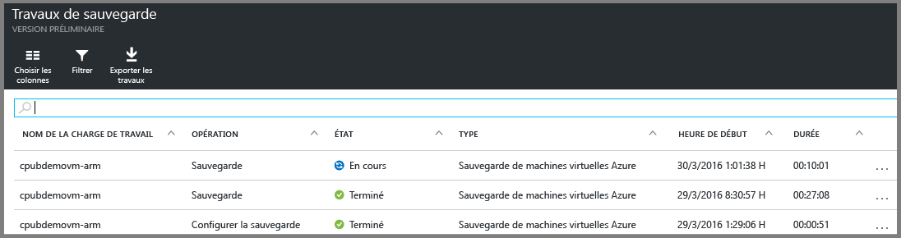

<properties
	pageTitle="Découverte : Protéger les machines virtuelles Azure avec un coffre Recovery Services | Microsoft Azure"
	description="Protégez les machines virtuelles Azure avec un coffre Recovery Services. Utilisez les sauvegardes des machines virtuelles déployées à l’aide de Resource Manager, des machines virtuelles déployées à l’aide du modèle Classic et des machines virtuelles Premium Storage pour protéger vos données. Créez et enregistrez un coffre Recovery Services. Enregistrez des machines virtuelles, créez une stratégie et protégez des machines virtuelles dans Azure."
	services="backup"
	documentationCenter=""
	authors="markgalioto"
	manager="cfreeman"
	editor=""
	keyword="backups; vm backup"/>

<tags
	ms.service="backup"
	ms.workload="storage-backup-recovery"
	ms.tgt_pltfrm="na"
	ms.devlang="na"
	ms.topic="hero-article"
	ms.date="09/15/2016"
	ms.author="markgal; jimpark"/>

# Découverte : Protéger les machines virtuelles Azure avec un coffre Recovery Services

> [AZURE.SELECTOR]
- [Protéger les machines virtuelles avec un coffre Recovery Services](backup-azure-vms-first-look-arm.md)
- [Protéger les machines virtuelles avec un coffre de sauvegarde](backup-azure-vms-first-look.md)

Ce didacticiel détaille les procédures de création d’un coffre Recovery Services et de sauvegarde d’une machine virtuelle Azure. Les coffres Recovery Services protègent :

- Machines virtuelles déployées à l’aide de Resource Manager
- les machines virtuelles Classic,
- les machines virtuelles de stockage standard,
- les machines virtuelles Premium Storage.
- les machines virtuelles chiffrées à l’aide d’Azure Disk Encryption, avec des clés BEK et KEK (prises en charge à l’aide de PowerShell).

Pour plus d’informations sur la protection des machines virtuelles Premium Storage, consultez [Sauvegarder et restaurer des machines virtuelles Premium Storage](backup-introduction-to-azure-backup.md#back-up-and-restore-premium-storage-vms)

>[AZURE.NOTE] Dans ce didacticiel, nous partons du principe que vous disposez déjà d’une machine virtuelle dans votre abonnement Azure et que vous avez autorisé le service de sauvegarde à accéder à la machine virtuelle.

[AZURE.INCLUDE [learn-about-Azure-Backup-deployment-models](../../includes/backup-deployment-models.md)]

Voici globalement les étapes que vous allez suivre.

1. Créez un coffre Recovery Services pour une machine virtuelle.
2. Utilisez le portail Azure pour sélectionner un scénario, définir la stratégie et identifier les éléments à protéger.
3. Effectuez la sauvegarde initiale.

## Création d’un coffre Recovery Services pour une machine virtuelle

Un coffre Recovery Services est une entité qui stocke l’ensemble des sauvegardes et des points de récupération créés au fil du temps. Le coffre Recovery Services contient également la stratégie de sauvegarde appliquée aux machines virtuelles protégées.

>[AZURE.NOTE] La sauvegarde de machines virtuelles est un processus local. Vous ne pouvez pas sauvegarder de machines virtuelles d’un emplacement dans un coffre Recovery Services situé à un autre emplacement. Un coffre Recovery Services doit donc exister à chaque emplacement Azure contenant des machines virtuelles à sauvegarder.

Pour créer un coffre Recovery Services :

1. Connectez-vous au [portail Azure](https://portal.azure.com/).

2. Dans le menu Hub, cliquez sur **Parcourir** et, dans la liste des ressources, tapez **Recovery Services**. Au fur et à mesure de la saisie, la liste est filtrée. Cliquez sur **Coffre Recovery Services**.

      

    La liste des coffres Recovery Services s’affiche.

3. Dans le menu **Coffres Recovery Services**, cliquez sur **Ajouter**.

    

    Le panneau du coffre Recovery Services s’affiche et vous invite à renseigner les champs **Nom**, **Abonnement**, **Groupe de ressources** et **Emplacement**.

    

4. Sous **Nom**, entrez un nom convivial permettant d’identifier le coffre. Le nom doit être unique pour l’abonnement Azure. Tapez un nom contenant entre 2 et 50 caractères. Il doit commencer par une lettre, et ne peut contenir que des lettres, des chiffres et des traits d’union.

5. Cliquez sur **Abonnement** pour afficher la liste des abonnements disponibles. Si vous n’êtes pas sûr de l’abonnement à utiliser, utilisez l’abonnement par défaut (ou suggéré). Vous ne disposez de plusieurs choix que si votre compte professionnel est associé à plusieurs abonnements Azure.

6. Cliquez sur **Groupe de ressources** pour afficher la liste des groupes de ressources disponibles ou sur **Nouveau** pour en créer un. Pour plus d’informations sur les groupes de ressources, consultez [Vue d’ensemble d’Azure Resource Manager](../resource-group-overview.md)

7. Cliquez sur **Emplacement** pour sélectionner la région géographique du coffre. Le coffre **doit** se trouver dans la même région que les machines virtuelles que vous souhaitez protéger.

    >[AZURE.IMPORTANT] Si vous ne savez pas où se trouve votre machine virtuelle, fermez la boîte de dialogue de création d’archivage et accédez à la liste des machines virtuelles dans le portail. Si vous disposez de machines virtuelles dans plusieurs régions, créez un coffre Recovery Services dans chacune de ces régions. Créez l’archivage dans le premier emplacement avant de passer à l'emplacement suivant. Il est inutile de spécifier des comptes de stockage dans lesquels stocker les données de sauvegarde : le coffre Recovery Services et le service Azure Backup gèrent cela automatiquement.

8. Cliquez sur **Create**. La création du coffre Recovery Services peut prendre un certain temps. Surveillez les notifications d'état dans l'angle supérieur droit du portail. Une fois votre coffre créé, il apparaît dans la liste des coffres Recovery Services.

    

Maintenant que vous avez créé votre archivage, découvrez comment définir la réplication du stockage.

### Définir la réplication du stockage

L’option de réplication du stockage vous permet de choisir entre stockage géo-redondant et stockage localement redondant. Par défaut, votre archivage utilise un stockage géo-redondant. Si vous utilisez Azure comme sauvegarde principale, laissez cette option inchangée. Choisissez Stockage localement redondant si vous souhaitez une option plus économique, mais moins durable. Pour en savoir plus sur les options de stockage [géoredondant](../storage/storage-redundancy.md#locally-redundant-storage) et [localement redondant](../storage/storage-redundancy.md), consultez l’article [Réplication Azure Storage](../storage/storage-redundancy.md#geo-redundant-storage).

Pour modifier le paramètre de réplication du stockage :

1. Sélectionnez votre archivage pour ouvrir le tableau de bord associé et le panneau Paramètres. Si le panneau **Paramètres** ne s’ouvre pas, cliquez sur **Tous les paramètres** dans le tableau de bord du coffre.

2. Dans le panneau **Paramètres**, cliquez sur **Infrastructure de sauvegarde** > **Configuration de la sauvegarde** pour ouvrir le panneau **Configuration de la sauvegarde**. Dans le panneau **Configuration de la sauvegarde**, choisissez l’option de réplication du stockage à appliquer à votre coffre.

    

    Après avoir sélectionné l’option de stockage pour votre archivage, vous pouvez associer la machine virtuelle à l’archivage. Pour commencer l’association, vous devez découvrir et enregistrer les machines virtuelles Azure.

## Sélectionner l’objectif d’une sauvegarde, définir la stratégie et définir les éléments à protéger

Avant d’enregistrer une machine virtuelle dans un coffre, lancez le processus de découverte pour vérifier que les nouvelles machines virtuelles ajoutées à l’abonnement sont bien identifiées. Le processus interroge Azure pour obtenir la liste des machines virtuelles de l’abonnement ainsi que des informations supplémentaires, comme le nom du service cloud et la région. Dans le portail Azure, l’objectif fait référence à ce que vous allez placer dans l’archivage de Recovery Services. La stratégie permet de planifier la fréquence et l’heure de la création des points de récupération. Elle inclut également la durée de rétention de ces derniers.

1. Si l’un de vos coffres Recovery Services est déjà ouvert, passez à l’étape 2. Si vous n’avez aucun coffre Recovery Services ouvert alors que vous vous trouvez dans le portail Azure, cliquez sur **Parcourir** dans le menu Hub.

  - Dans la liste des ressources, tapez **Recovery Services**.
  - Au fur et à mesure de la saisie, la liste est filtrée. Lorsque vous voyez **Coffres Recovery Services**, cliquez dessus.

      

    La liste des coffres Recovery Services s’affiche.
  - Dans la liste des coffres Recovery Services, sélectionnez un coffre.

    Le tableau de bord de l’archivage sélectionné s'ouvre.

    

2. Dans le menu du tableau de bord du coffre, cliquez sur **Sauvegarder** pour ouvrir le panneau Sauvegarde.

    

    Lorsque le panneau s’ouvre, le service Backup recherche les nouvelles machines virtuelles dans l’abonnement.

    

3. Dans le panneau Sauvegarde, cliquez sur **Objectif de sauvegarde** pour ouvrir le panneau Objectif de sauvegarde.

    

4. Dans le panneau Objectif de sauvegarde, définissez **Où s’exécute votre charge de travail ?** sur Azure et **Que souhaitez-vous sauvegarder ?** sur Machine virtuelle, puis cliquez sur **OK**.

    Le panneau Backup Goal (Objectif de la sauvegarde) se ferme et le panneau Stratégie de sauvegarde s’ouvre.

    

5. Dans le panneau Stratégie de sauvegarde, sélectionnez la stratégie de sauvegarde à appliquer au coffre, puis cliquez sur **OK**.

    

    Les détails de la stratégie par défaut sont indiqués à l’écran. Pour créer une stratégie, sélectionnez **Créer** dans le menu déroulant. Le menu déroulant offre également une option permettant de définir l’heure de prise de l’instantané sur 19 h 00. Pour savoir comment définir une stratégie de sauvegarde, consultez la section [Définition d’une stratégie de sauvegarde](backup-azure-vms-first-look-arm.md#defining-a-backup-policy). Lorsque vous cliquez sur **OK**, la stratégie de sauvegarde est associée au coffre.

    Ensuite, choisissez les machines virtuelles à associer à l'archivage.

6. Sélectionnez les machines virtuelles à associer à la stratégie spécifiée, puis cliquez sur **Sélectionner**.

    

    Si vous ne voyez pas la machine virtuelle souhaitée, vérifiez qu’elle existe dans le même emplacement Azure que l’archivage de Recovery Services.

7. Maintenant que vous avez défini tous les paramètres du coffre, dans le panneau Sauvegarde, cliquez sur **Activer la sauvegarde** en bas de la page. La stratégie est déployée dans l’archivage et les machines virtuelles.

    

## Sauvegarde initiale

Le déploiement d’une stratégie de sauvegarde sur la machine virtuelle ne signifie pas que les données ont été sauvegardées. Par défaut, la première sauvegarde planifiée (définie dans la stratégie de sauvegarde) est la sauvegarde initiale. Jusqu’à celle-ci, l’état de la dernière sauvegarde dans le panneau **Travaux de sauvegarde** est défini sur **Avertissement (sauvegarde initiale en attente)**.

À moins que votre sauvegarde initiale ne soit prévue prochainement, il est recommandé de sélectionner l’option **Sauvegarder maintenant**.

Pour utiliser l’option **Sauvegarder maintenant** :

1. Dans la vignette **Sauvegarde** du tableau de bord du coffre, cliquez sur **Machines virtuelles Azure**.   

    Le panneau **Éléments de sauvegarde** s’ouvre.

2. Dans le panneau **Éléments de sauvegarde**, cliquez avec le bouton droit sur le coffre à sauvegarder, puis cliquez sur **Sauvegarder maintenant**.

    

    Le travail de sauvegarde est déclenché.  

    

3. Pour vérifier si votre sauvegarde initiale est terminée, dans la vignette **Travaux de sauvegarde** du tableau de bord du coffre, cliquez sur **Machines virtuelles Azure**.

    

    Le panneau Travaux de sauvegarde s’ouvre.

4. Le panneau Travaux de sauvegarde indique l’état de tous les travaux.

    

    >[AZURE.NOTE] Dans le cadre de l’opération de sauvegarde, le service Azure Backup émet une commande vers l’extension de sauvegarde de chaque machine virtuelle pour vider toutes les écritures et prendre un instantané cohérent.

    Lorsque le travail de sauvegarde est terminé, l’état affiché est *Terminé*.

[AZURE.INCLUDE [backup-create-backup-policy-for-vm](../../includes/backup-create-backup-policy-for-vm.md)]

## Installer l’agent de machine virtuelle sur la machine virtuelle

Ces informations sont fournies en cas de nécessité. L’agent de machine virtuelle Azure doit être installé sur la machine virtuelle Azure pour permettre la prise en charge de l’extension Backup. Cependant, si votre machine virtuelle a été créée à partir de la galerie Azure, l’agent y est déjà installé. L’agent de machine virtuelle n’est pas préinstallé sur les machines virtuelles qui ont été migrées à partir de centres de données locaux. Dans ce cas, il faut l’installer de manière explicite. Si vous rencontrez des problèmes de sauvegarde de la machine virtuelle Azure, vérifiez que son agent est correctement installé sur celle-ci (reportez-vous au tableau ci-dessous). Si vous créez une machine virtuelle personnalisée, [vérifiez que la case **Installer l’agent de machine virtuelle** est bien cochée](../virtual-machines/virtual-machines-windows-classic-agents-and-extensions.md) avant de mettre en service la machine virtuelle.

En savoir plus sur l’[agent de machine virtuelle](https://go.microsoft.com/fwLink/?LinkID=390493&clcid=0x409) et [comment l’installer](../virtual-machines/virtual-machines-windows-classic-manage-extensions.md).

Le tableau suivant fournit des informations supplémentaires sur l’agent de machine virtuelle pour les machines virtuelles Windows et Linux.

| **Opération** | **Windows** | **Linux** |
| --- | --- | --- |
| Installation de l’agent de machine virtuelle | <li>Téléchargez et installez le fichier [MSI de l’agent](http://go.microsoft.com/fwlink/?LinkID=394789&clcid=0x409). Vous avez besoin de privilèges d’administrateur pour terminer l’installation. <li>[Mettez à jour la propriété de la machine virtuelle](http://blogs.msdn.com/b/mast/archive/2014/04/08/install-the-vm-agent-on-an-existing-azure-vm.aspx) pour indiquer que l’agent est installé. | <li>Installez l’[agent Linux](https://github.com/Azure/WALinuxAgent) le plus récent à partir de GitHub. Vous avez besoin de privilèges d’administrateur pour terminer l’installation. <li> [Mettez à jour la propriété de la machine virtuelle](http://blogs.msdn.com/b/mast/archive/2014/04/08/install-the-vm-agent-on-an-existing-azure-vm.aspx) pour indiquer que l’agent est installé. |
| Mise à jour de l’agent de machine virtuelle | La mise à jour de l’agent de machine virtuelle est aussi simple que la réinstallation des [fichiers binaires de l’agent de machine virtuelle](http://go.microsoft.com/fwlink/?LinkID=394789&clcid=0x409).  Vérifiez qu’aucune opération de sauvegarde n’est en cours pendant la mise à jour de l’agent de machine virtuelle. | Suivez les instructions fournies dans l’article [Mise à jour d’un agent de machine virtuelle Linux](../virtual-machines-linux-update-agent.md).  Vérifiez qu’aucune opération de sauvegarde n’est en cours pendant la mise à jour de l’agent de machine virtuelle. |
| Validation de l’installation de l’agent de machine virtuelle | <li>Accédez au dossier *C:\\WindowsAzure\\Packages* sur la machine virtuelle Azure. <li>Le fichier WaAppAgent.exe doit être présent.<li> Cliquez avec le bouton droit sur le fichier, accédez à **Propriétés**, puis sélectionnez l’onglet **Détails**. Le champ Version du produit doit être défini sur 2.6.1198.718 ou une version ultérieure. | N/A |

### Extension de sauvegarde

Une fois l’agent de machine virtuelle installé sur la machine virtuelle, le service Azure Backup installe l’extension de sauvegarde vers l’agent de machine virtuelle. Le service Azure Backup met à niveau et corrige en toute transparence l'extension de sauvegarde sans intervention supplémentaire de l'utilisateur.

Le service Backup installe l’extension de sauvegarde si machine virtuelle est en cours d’exécution. Une machine virtuelle en cours d’exécution offre le plus de chance d’obtenir un point de récupération d’application cohérent. Toutefois, le service Azure Backup poursuit la sauvegarde de la machine virtuelle, même si elle est éteinte et si l’extension n’a pas été installée, autrement dit si la machine virtuelle est hors connexion. Dans ce cas, le point de récupération sera *cohérent en cas d’incident*.

## Résolution de problèmes
Si vous rencontrez des problèmes pour accomplir certaines tâches décrites dans cet article, consultez les [instructions pour la résolution des problèmes](backup-azure-vms-troubleshoot.md).

## Des questions ?
Si vous avez des questions ou si vous souhaitez que certaines fonctionnalités soient incluses, [envoyez-nous vos commentaires](http://aka.ms/azurebackup_feedback).

<!---HONumber=AcomDC_0921_2016-->