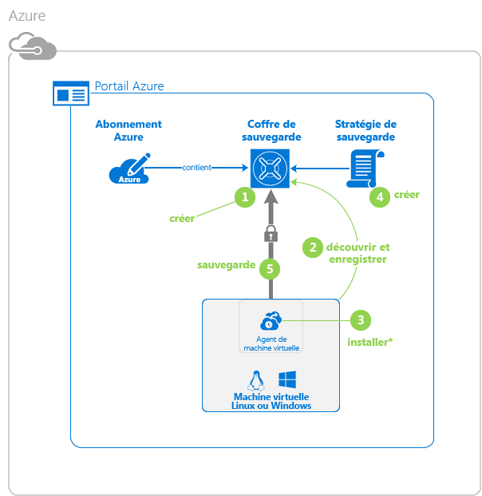
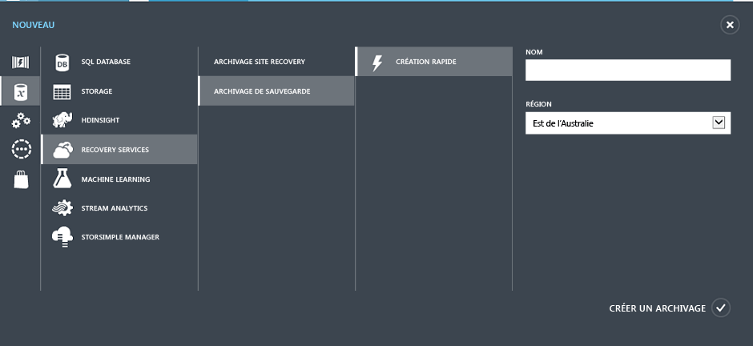

<properties
	pageTitle="Protection des machines virtuelles dans Azure avec Azure Backup | Microsoft Azure"
	description="Protégez vos machines virtuelles Azure à l’aide du service Azure Backup. Ce didacticiel explique comment créer un archivage, inscrire des machines virtuelles, créer des stratégies et protéger des machines virtuelles dans Azure."
	services="backup"
	documentationCenter=""
	authors="markgalioto"
	manager="jwhit"
	editor=""/>

<tags
	ms.service="backup"
	ms.workload="storage-backup-recovery"
	ms.tgt_pltfrm="na"
	ms.devlang="na"
	ms.topic="hero-article"
	ms.date="04/12/2016"
	ms.author="markgal; jimpark"/>

# Découverte : sauvegarde des machines virtuelles Azure

> [AZURE.SELECTOR]
- [Sauvegarder des machines virtuelles ARM](backup-azure-vms-first-look-arm.md)
- [Sauvegarder des machines virtuelles en mode Classique](backup-azure-vms-first-look.md)

Ce didacticiel vous accompagne tout au long de la procédure de sauvegarde d'une machine virtuelle Azure. Pour pouvoir suivre ce didacticiel, ces conditions préalables doivent être réunies :

- Vous avez créé une machine virtuelle dans votre abonnement Azure.
- Le service de sauvegarde peut accéder à votre machine virtuelle.

Voici les principales étapes du didacticiel.

1. Créez un coffre de sauvegarde ou identifiez un coffre de sauvegarde existant *dans la même région que votre machine virtuelle*.
2. Utiliser le portail Azure pour découvrir et inscrire les machines virtuelles dans votre abonnement.
3. Installez l’agent sur la machine virtuelle (si vous utilisez une machine virtuelle de la galerie Azure, l’agent de machine virtuelle est déjà présent).
4. Créez la stratégie servant à protéger les machines virtuelles.
5. Exécuter la sauvegarde.

>[AZURE.NOTE] Azure propose deux modèles de déploiement pour créer et utiliser des ressources : [Resource Manager et Classique](../resource-manager-deployment-model.md). Le service Azure Backup prend en charge les machines virtuelles Azure Resource Manager (ARM), également appelées machines virtuelles IaaS V2. Ce didacticiel est destiné aux machines virtuelles qui peuvent être créées dans le portail Azure Classic.

## Étape 1 : création d’un archivage (ou coffre) de sauvegarde pour une machine virtuelle

Un coffre de sauvegarde est une entité qui stocke les sauvegardes et les points de récupération créés au fil du temps. Le coffre de sauvegarde contient également les stratégies de sauvegarde qui sont appliquées aux machines virtuelles en cours de sauvegarde.

Cette image illustre les relations entre les différentes entités Azure Backup : 

Pour créer un archivage de sauvegarde :

1. Connectez-vous au [portail Azure](http://manage.windowsazure.com/).

2. En bas à gauche du portail Azure, cliquez sur **Nouveau**

    

3. Dans l’Assistant de création rapide, cliquez sur **Data Services** -> **Recovery Services** -> **Coffre de sauvegarde** > **Création rapide**.

    

    L'Assistant vous invite à entrer le **Nom** et la **Région**. Si vous gérez plusieurs abonnements, une boîte de dialogue de choix de l'abonnement s'affiche.

4. Sous **Nom**, entrez un nom convivial permettant d’identifier le coffre. Le nom doit être unique pour l’abonnement Azure. Tapez un nom comprenant entre 2 et 50 caractères. Il doit commencer par une lettre, et ne peut contenir que des lettres, des chiffres et des traits d’union.

5. Dans **Region**, sélectionnez la région géographique du coffre. Le coffre **doit** se trouver dans la même région que les machines virtuelles à protéger.

    Si vous ne connaissez pas la région dans laquelle se trouve votre machine virtuelle, fermez cet Assistant et cliquez sur Virtual Machines dans la liste des services Azure. La colonne Emplacement fournit le nom de la région. Si vous avez des machines virtuelles dans plusieurs régions, créez un coffre de sauvegarde par région.

6. Si la boîte de dialogue de l’Assistant ne contient aucun **Abonnement**, passez à l'étape suivante. Si vous travaillez avec plusieurs abonnements, sélectionnez un abonnement à associer au coffre de sauvegarde.

    

7. Cliquez sur **Create vault**. La création du coffre de sauvegarde peut prendre du temps. Surveillez les notifications d'état en bas du portail.

    

    Un message confirme que le coffre a été correctement créé. Celui-ci est répertorié sur la page **Recovery Services** comme étant **Actif**.

    

8. Dans la liste des coffres de la page **Recovery Services**, sélectionnez le coffre que vous avez créé pour ouvrir la page **Démarrage rapide**.

    

9. Sur la page **Démarrage rapide**, cliquez sur **Configurer** pour accéder à l’option de réplication du stockage. 

10. Sous l’option **Réplication du stockage**, choisissez l’option de réplication correspondant à votre coffre de sauvegarde.

    

    Par défaut, votre archivage utilise un stockage géo-redondant. Si vous utilisez Azure comme principal point de terminaison du stockage de sauvegarde, nous vous recommandons de continuer d’utiliser le stockage géo-redondant. Si vous utilisez Azure comme point de terminaison secondaire du stockage de sauvegarde, envisagez de choisir un stockage localement redondant, de manière à réduire les coûts du stockage de données dans Azure. Pour en savoir plus sur les options de stockage [géo-redondant](../storage/storage-redundancy.md#geo-redundant-storage) et [localement redondant](../storage/storage-redundancy.md#locally-redundant-storage), consultez cette [présentation](../storage/storage-redundancy.md).

Après avoir sélectionné l’option de stockage pour votre archivage, vous pouvez associer la machine virtuelle à l’archivage. Pour commencer l’association, vous devez découvrir et enregistrer les machines virtuelles Azure.

## Étape 2 : découverte et enregistrement des machines virtuelles Azure
Avant d’enregistrer la machine virtuelle dans un coffre, lancez le processus de découverte pour identifier les nouvelles machines virtuelles éventuelles. Le processus interroge Azure pour obtenir la liste des machines virtuelles de l’abonnement et des informations supplémentaires, comme le nom du service cloud et la région.

1. Connectez-vous au [portail Azure](http://manage.windowsazure.com/).

2. Dans le portail Azure Classic, cliquez sur **Recovery Services** pour ouvrir la liste des coffres Recovery Services. 

3. Dans la liste des coffres, sélectionnez le coffre de sauvegarde d’une machine virtuelle.

    Une fois votre coffre sélectionné, vous accédez à la page **Démarrage rapide**.

4. Dans le menu du coffre, cliquez sur **Éléments enregistrés**.

    

5. Dans le menu **Type**, sélectionnez **Machine virtuelle Azure**.

    

6. Cliquez sur **DÉCOUVRIR** en bas de la page. 

    Le processus de découverte peut durer quelques minutes, le temps que les machines virtuelles soient affichées sous forme de tableau. Une notification affichée en bas de l’écran vous informe que le processus est en cours d’exécution.

    

    La notification change lorsque le processus est terminé.

    

7. Cliquez sur **INSCRIRE** en bas de la page. 

8. Dans le menu contextuel **Inscrire les éléments**, choisissez les machines virtuelles que vous souhaitez inscrire. Si au moins deux machines virtuelles portent le même nom, utilisez le service cloud pour les distinguer.

    >[AZURE.TIP] Plusieurs machines virtuelles peuvent être inscrites en même temps.

    Un travail est créé pour chaque machine virtuelle sélectionnée.

9. Cliquez sur **Afficher le travail** dans la notification pour accéder à la page **Travaux**.

    

    La machine virtuelle est également affichée dans la liste des éléments inscrits avec l’état de l’opération d’inscription.

    

    Une fois l’opération terminée, l’état change pour refléter l’état *inscrit*.

    

## Étape 3 : installation de l’agent de machine virtuelle sur la machine virtuelle

L’agent de machine virtuelle Azure doit être installé sur la machine virtuelle Azure pour permettre la prise en charge de l’extension Backup. Si votre machine virtuelle a été créée à partir de la galerie Azure, l’agent est déjà installé sur la machine virtuelle ! Vous pouvez passer à la [protection de vos machines virtuelles](backup-azure-vms-first-look.md#step-4---protect-azure-virtual-machines).

Si votre machine virtuelle a migré à partir d'un centre de données local, il est probable que l’agent de machine virtuelle n’y soit pas installé. Vous devez installer l'agent sur la machine virtuelle avant de passer à l’étape de protection de la machine virtuelle. Pour obtenir des instructions détaillées sur l'installation de l'agent de machine virtuelle, consultez la [section Agent de machine virtuelle dans l'article sur les machines virtuelles de sauvegarde](backup-azure-vms-prepare.md#vm-agent).

## Étape 4 : protection des machines virtuelles Azure
Vous pouvez désormais configurer une stratégie de sauvegarde et de rétention pour la machine virtuelle. Plusieurs machines virtuelles peuvent être protégées par la même action de protection. Les archivages Azure Backup créés après mai 2015 sont livrés avec une stratégie par défaut intégrée. Cette stratégie par défaut est fournie avec une durée de conservation par défaut de 30 jours et une fréquence de sauvegarde quotidienne d’une fois par jour.

1. Accédez à l’archivage de sauvegarde se trouvant sous **Services de récupération** dans le portail Azure, puis cliquez sur **Éléments inscrits**.
2. Sélectionnez **Machine virtuelle Azure** dans le menu déroulant.

    

3. En bas de la page, cliquez sur **PROTÉGER**. 

    L’**Assistant Protéger des éléments** s’affiche et répertorie *uniquement* les machines virtuelles inscrites qui ne sont pas protégées.

    

4. Sélectionnez les machines virtuelles que vous souhaitez protéger.

    Si au moins deux machines virtuelles portent le même nom, utilisez le service cloud pour les distinguer.

5. Dans le menu **Configurer la protection**, sélectionnez une stratégie existante ou créez-en une pour protéger les machines virtuelles que vous avez identifiées.

    Vous pouvez associer plusieurs machines virtuelles à chaque stratégie de sauvegarde. Toutefois, vous ne pouvez associer votre machine virtuelle qu’à une seule stratégie à la fois.

    

    >[AZURE.NOTE] Une stratégie de sauvegarde inclut le schéma de rétention des sauvegardes planifiées. Si vous sélectionnez une stratégie de sauvegarde existante, vous ne pourrez pas modifier les options de rétention à l’étape suivante.

6. Dans le champ **Durée de rétention**, définissez l’intervalle des points de sauvegarde spécifiques (quotidien, hebdomadaire, mensuel ou annuel).

    

    La stratégie de rétention spécifie la durée de stockage d’une sauvegarde. Vous pouvez spécifier des stratégies de rétention différentes en fonction de la date à laquelle la sauvegarde est effectuée.

7. Cliquez sur **Travaux** pour afficher la liste des travaux **Configurer la Protection**.

    

    Maintenant que vous avez créé la stratégie, passez à l'étape suivante et lancez la sauvegarde initiale.

## Étape 5 : sauvegarde initiale

Une fois la machine virtuelle protégée par une stratégie, vous pouvez afficher cette relation sous l’onglet **Éléments protégés**. Avant l’exécution de la sauvegarde initiale, la valeur **État de la protection** s’affiche sous la forme **Protégé (en attente de sauvegarde initiale)**. Par défaut, la première sauvegarde planifiée est la *sauvegarde initiale*.

Pour déclencher la sauvegarde initiale immédiatement après la configuration de la protection :

1. Cliquez sur le bouton **Sauvegarder maintenant** en bas de la page **Éléments protégés**. 

    Le service Azure Backup crée un travail de sauvegarde pour l’opération de sauvegarde initiale.

2. Cliquez sur l’onglet **Travaux** pour afficher la liste des travaux.

    

    Une fois la sauvegarde initiale terminée, l’état de la machine virtuelle présente dans l’onglet **Éléments protégés** s’affiche en tant que *Protégé*.

    

    >[AZURE.NOTE] La sauvegarde des machines virtuelles est un processus local. Vous ne pouvez pas sauvegarder les machines virtuelles d’une région donnée vers un archivage de sauvegarde d’une autre région. Par conséquent, il faut créer au moins un archivage pour chaque région Azure équipée de machines virtuelles nécessitant une sauvegarde.

## Étapes suivantes
Maintenant que vous êtes parvenu à sauvegarder une machine virtuelle, d’autres étapes peuvent vous intéresser. L’étape la plus logique consiste à vous familiariser avec la restauration des données sur une machine virtuelle. Toutefois, certaines tâches de gestion vous aideront à comprendre comment protéger vos données et réduire les coûts.

- [Gestion et surveillance de vos machines virtuelles](backup-azure-manage-vms.md)
- [Restauration des machines virtuelles](backup-azure-restore-vms.md)
- [Instructions pour la résolution des problèmes](backup-azure-vms-troubleshoot.md)

## Des questions ?
Si vous avez des questions ou si vous souhaitez que certaines fonctionnalités soient incluses, [envoyez-nous vos commentaires](http://aka.ms/azurebackup_feedback).

<!---HONumber=AcomDC_0420_2016-->