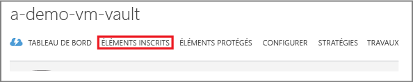
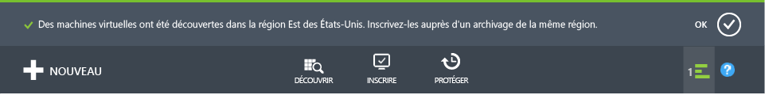

# Découverte : sauvegarde des machines virtuelles Azure
> [!div class="op_single_selector"]
> * [Protéger les machines virtuelles avec un coffre Recovery Services](backup-azure-vms-first-look-arm.md)
> * [Protéger les machines virtuelles Azure avec un coffre de sauvegarde](backup-azure-vms-first-look.md)
>
>

Ce didacticiel vous accompagne tout au long de la procédure de sauvegarde d’une machine virtuelle Azure vers un archivage de sauvegarde dans Azure. Cet article décrit le modèle classique ou le modèle de déploiement Service Manager, pour la sauvegarde des machines virtuelles. Les étapes suivantes s’appliquent uniquement aux coffres de sauvegarde créés dans le portail classique. Pour les nouveaux déploiements, Microsoft recommande d’utiliser le modèle Resource Manager.

Si vous souhaitez sauvegarder une machine virtuelle dans un coffre Recovery Services qui appartient à un groupe de ressources, consultez l’article [Découverte : Protéger les machines virtuelles avec un coffre Recovery Services](backup-azure-vms-first-look-arm.md).

Pour pouvoir suivre ce didacticiel, les conditions préalables ci-après doivent être réunies :

* Vous avez créé une machine virtuelle dans votre abonnement Azure.
* La machine virtuelle dispose d’une connectivité à des adresses IP publiques Azure. Pour plus d’informations, consultez la rubrique [Connectivité réseau](backup-azure-vms-prepare.md#network-connectivity).

> [!NOTE]
> Azure dispose de deux modèles de déploiement pour créer et utiliser des ressources : [Azure Resource Manager et Azure Classic](../azure-resource-manager/resource-manager-deployment-model.md). Ce didacticiel est destiné aux machines virtuelles créées dans le portail classique.
>
>

## Créer un coffre de sauvegarde
Un coffre de sauvegarde est une entité qui stocke les sauvegardes et les points de récupération créés au fil du temps. Le coffre de sauvegarde contient également les stratégies de sauvegarde qui sont appliquées aux machines virtuelles en cours de sauvegarde.

> [!IMPORTANT]
> Depuis mars 2017, vous ne pouvez plus utiliser le portail Classic pour créer des coffres de sauvegarde.
> Vous pouvez mettre à niveau vos coffres de sauvegarde vers des coffres Recovery Services. Pour en savoir plus, consultez l’article [Mettre à niveau un coffre de sauvegarde vers un coffre Recovery Services](backup-azure-upgrade-backup-to-recovery-services.md). Microsoft vous recommande de mettre à niveau vos coffres de sauvegarde vers des coffres Recovery Services.  Au-delà du 15 octobre 2017, vous ne pouvez plus vous servir de PowerShell pour créer des coffres de sauvegarde. **D’ici le 1er novembre 2017** :
>- Tous les coffres de sauvegarde restants seront automatiquement mis à niveau vers des coffres Recovery Services.
>- Vous ne pourrez plus accéder à vos données de sauvegarde depuis le portail Classic. Au lieu de cela, vous devrez utiliser le portail Azure pour accéder à ces données au sein de coffres Recovery Services.
>

## Découverte et inscription des machines virtuelles Azure
Avant d’enregistrer la machine virtuelle dans un coffre, lancez le processus de découverte pour identifier les nouvelles machines virtuelles éventuelles. Ce dernier renvoie la liste des machines virtuelles de l’abonnement et des informations supplémentaires, comme le nom du service cloud et la région.

1. Connectez-vous au [portail Azure Classic](http://manage.windowsazure.com/)
2. Dans le portail Azure Classic, cliquez sur **Recovery Services** pour ouvrir la liste des coffres Recovery Services.
    
3. Dans la liste des coffres, sélectionnez le coffre de sauvegarde d’une machine virtuelle.

    Votre coffre sélectionné s’ouvre à la page **Démarrage rapide** .
4. Dans le menu du coffre, cliquez sur **Éléments inscrits**.

    
5. Dans le menu **Type**, sélectionnez **Machine virtuelle Azure**.

    
6. Cliquez sur **DÉCOUVRIR** en bas de la page.
    

    Le processus de découverte peut durer quelques minutes, le temps que les machines virtuelles soient affichées sous forme de tableau. Une notification affichée en bas de l’écran vous informe que le processus est en cours d’exécution.

    

    La notification change lorsque le processus est terminé.

    
7. Cliquez sur **INSCRIRE** en bas de la page.
    
8. Dans le menu contextuel **Inscrire les éléments** , choisissez les machines virtuelles que vous souhaitez inscrire.

   > [!TIP]
   > Plusieurs machines virtuelles peuvent être inscrites en même temps.
   >
   >

    Un travail est créé pour chaque machine virtuelle sélectionnée.
9. Cliquez sur **Afficher le travail** dans la notification pour accéder à la page **Travaux**.

    

    La machine virtuelle est également affichée dans la liste des éléments inscrits avec l’état de l’opération d’inscription.

    

    Une fois l’opération terminée, l’état change pour refléter l’état *inscrit* .

    

## Installer l’agent de machine virtuelle sur la machine virtuelle
L’agent de machine virtuelle Azure doit être installé sur la machine virtuelle Azure pour permettre la prise en charge de l’extension Backup. Si votre machine virtuelle a été créée à partir de la galerie Azure, l’agent de machine virtuelle est déjà installé sur la machine virtuelle. Vous pouvez directement passer à l’étape de [protection de vos machines virtuelles](backup-azure-vms-first-look.md#create-the-backup-policy).

Si votre machine virtuelle a migré à partir d'un centre de données local, il est probable que l’agent de machine virtuelle n’y soit pas installé. Vous devez installer l'agent sur la machine virtuelle avant de passer à l’étape de protection de la machine virtuelle. Pour obtenir des instructions détaillées sur l’installation de l’agent de machine virtuelle, consultez la [section Agent VM de l’article sur la sauvegarde des machines virtuelles](backup-azure-vms-prepare.md#vm-agent).

## Création de la stratégie de sauvegarde
Avant de déclencher le travail de sauvegarde initiale, définissez la planification des instantanés de sauvegarde. La planification des instantanés de sauvegarde et la durée de rétention de ces instantanés constituent la stratégie de sauvegarde. Les informations de rétention sont basées sur le schéma de rotation des sauvegardes grand-père-père-fils.

1. Accédez au coffre de sauvegarde qui se trouve sous **Recovery Services** dans le portail Azure Classic, puis cliquez sur **Éléments inscrits**.
2. Sélectionnez **Machine virtuelle Azure** dans le menu déroulant.

    
3. En bas de la page, cliquez sur **PROTÉGER** .
    

    **L’Assistant Protection des éléments** s’affiche et répertorie *uniquement* les machines virtuelles inscrites qui ne sont pas protégées.

    
4. Sélectionnez les machines virtuelles que vous souhaitez protéger.

    Si au moins deux machines virtuelles portent le même nom, utilisez le service cloud pour les distinguer.
5. Dans le menu **Configurer la protection** , sélectionnez une stratégie existante ou créez-en une pour protéger les machines virtuelles que vous avez identifiées.

    Les nouveaux coffres de sauvegarde ont une stratégie par défaut associée au coffre. Cette stratégie prend un instantané chaque soir ; celui-ci est conservé pendant 30 jours. Vous pouvez associer plusieurs machines virtuelles à chaque stratégie de sauvegarde. Toutefois, vous ne pouvez associer votre machine virtuelle qu’à une seule stratégie à la fois.

    

   > [!NOTE]
   > Une stratégie de sauvegarde inclut le schéma de rétention des sauvegardes planifiées. Si vous sélectionnez une stratégie de sauvegarde existante, vous ne pourrez pas modifier les options de rétention à l’étape suivante.
   >
   >
6. Dans le champ **Durée de rétention** , définissez l’intervalle des points de sauvegarde spécifiques (quotidien, hebdomadaire, mensuel ou annuel).

    

    La stratégie de rétention spécifie la durée de stockage d’une sauvegarde. Vous pouvez spécifier des stratégies de rétention différentes en fonction de la date à laquelle la sauvegarde est effectuée.
7. Cliquez sur **Travaux** pour afficher la liste des travaux **Configurer la protection**.

    

    Maintenant que vous avez créé la stratégie, passez à l'étape suivante et lancez la sauvegarde initiale.

## Sauvegarde initiale
Une fois la machine virtuelle protégée par une stratégie, vous pouvez afficher cette relation dans l’onglet **Éléments protégés** . Avant l’exécution de la sauvegarde initiale, la valeur **Protégé (en attente de sauvegarde initiale)** s’affiche sous **État de la protection**. Par défaut, la première sauvegarde planifiée est la *sauvegarde initiale*.

Pour lancer la sauvegarde initiale :

1. Cliquez sur le bouton **Sauvegarder maintenant** en bas de la page **Éléments protégés**.
    

    Le service Azure Backup crée un travail de sauvegarde pour l’opération de sauvegarde initiale.
2. Cliquez sur l’onglet **Travaux** pour afficher la liste des travaux.

    

    Une fois la sauvegarde initiale terminée, l’état de la machine virtuelle indiquée dans l’onglet **Éléments protégés** est défini sur la valeur *Protégé*.

    

   > [!NOTE]
   > La sauvegarde des machines virtuelles est un processus local. Vous ne pouvez pas sauvegarder les machines virtuelles d’une région donnée vers un archivage de sauvegarde d’une autre région. Par conséquent, il faut créer au moins un archivage pour chaque région Azure équipée de machines virtuelles nécessitant une sauvegarde.
   >
   >

## Étapes suivantes
Maintenant que vous êtes parvenu à sauvegarder une machine virtuelle, d’autres étapes peuvent vous intéresser. L’étape la plus logique consiste à vous familiariser avec la restauration des données sur une machine virtuelle. Toutefois, certaines tâches de gestion vous aideront à comprendre comment protéger vos données et réduire les coûts.

* [Gestion et surveillance de vos machines virtuelles](backup-azure-manage-vms.md)
* [Restauration des machines virtuelles](backup-azure-restore-vms.md)
* [Instructions pour la résolution des problèmes](backup-azure-vms-troubleshoot.md)

## Des questions ?
Si vous avez des questions ou si vous souhaitez que certaines fonctionnalités soient incluses, [envoyez-nous vos commentaires](http://aka.ms/azurebackup_feedback).

