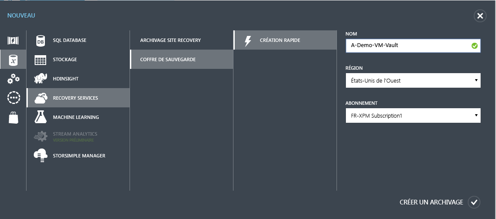
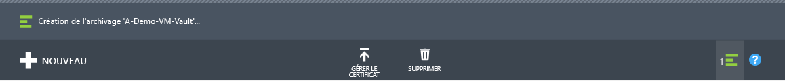
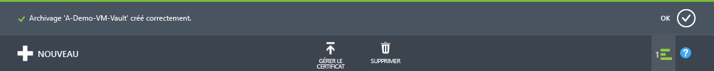
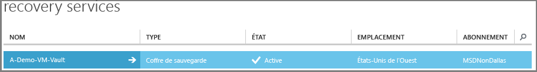
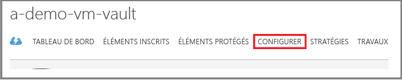
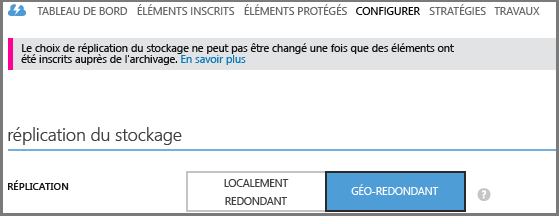

<properties
	pageTitle="Protection des machines virtuelles dans Azure avec Azure Backup | Microsoft Azure"
	description="Protégez vos machines virtuelles Azure à l’aide du service Azure Backup. Ce didacticiel explique comment créer un archivage, inscrire des machines virtuelles, créer des stratégies et protéger des machines virtuelles dans Azure."
	services="backup"
	documentationCenter=""
	authors="markgalioto"
	manager="jwhit"
	editor=""/>

<tags
	ms.service="backup"
	ms.workload="storage-backup-recovery"
	ms.tgt_pltfrm="na"
	ms.devlang="na"
	ms.topic="hero-article"
	ms.date="03/30/2016"
	ms.author="markgal; jimpark"/>

# Découverte : sauvegarde des machines virtuelles Azure

> [AZURE.SELECTOR]
- [Sauvegarder des machines virtuelles ARM](backup-azure-vms-first-look-arm.md)
- [Sauvegarder des machines virtuelles en mode Classique](backup-azure-vms-first-look.md)

Ce didacticiel vous guide tout au long des étapes de préparation de votre environnement Azure et vous explique comment sauvegarder une machine virtuelle Azure. Dans ce didacticiel, nous partons du principe que vous disposez déjà d’une machine virtuelle dans votre abonnement Azure et que vous avez autorisé le service de sauvegarde à accéder à la machine virtuelle. Voici globalement les étapes que vous allez suivre.

1. Créez ou connectez-vous à l’abonnement Azure.
2. Créez un archivage de sauvegarde ou identifiez un archivage de sauvegarde existant *dans la même région que votre machine virtuelle*.
3. Utiliser le portail Azure pour découvrir et inscrire les machines virtuelles dans votre abonnement.
4. Installez l’Agent de machine virtuelle sur l’ordinateur virtuel (si vous utilisez une machine virtuelle à partir de la galerie Azure, l’Agent de machine virtuelle sera déjà présent).
5. Créez la stratégie servant à protéger les machines virtuelles.
6. Exécuter la sauvegarde.

>[AZURE.NOTE] Azure dispose de deux modèles de déploiement pour créer et utiliser des ressources : [Resource Manager et Classique](../resource-manager-deployment-model.md). Actuellement, le service Azure Backup ne prend pas en charge les machines virtuelles basées sur le modèle Azure Resource Manager (ARM), que l’on appelle également machines virtuelles IaaS V2. Étant donné que les machines virtuelles IaaS V2 ont été développées en même temps que la version du nouveau portail Azure, ce didacticiel a été rédigé pour les types de machines virtuelles compatibles avec le portail Azure Classic.

## Étape 1 : création d’un archivage (ou coffre) de sauvegarde pour une machine virtuelle

Un coffre de sauvegarde est une entité qui stocke les sauvegardes et les points de récupération créés au fil du temps. Le coffre de sauvegarde contient également les stratégies de sauvegarde qui seront appliquées aux machines virtuelles en cours de sauvegarde.

Cette image illustre les relations entre les différentes entités Azure Backup : 

Pour créer un archivage de sauvegarde :

1. Connectez-vous au [portail Azure](http://manage.windowsazure.com/).

2. Dans le portail Azure, cliquez sur **Nouveau** > **Services de données** > **Recovery Services** > **Archivage de sauvegarde** > **Création rapide** (voir l’image ci-dessous).

    

3. Sous **Nom**, entrez un nom convivial permettant d’identifier l’archivage. Le nom doit être unique pour l’abonnement Azure. Tapez un nom contenant entre 2 et 50 caractères. Il doit commencer par une lettre, et ne peut contenir que des lettres, des chiffres et des traits d’union.

4. Dans **Region**, sélectionnez la région géographique du coffre. L’archivage **doit** se trouver dans la même région que les machines virtuelles que vous souhaitez protéger.

    Si vous ne connaissez pas la région dans laquelle se trouve votre machine virtuelle, fermez la boîte de dialogue de création d’archivage et accédez à la liste des machines virtuelles du portail. Si vos machines virtuelles se trouvent dans plusieurs régions, vous devez créer un archivage de sauvegarde dans chaque région ; pour autant, vous devez veiller à terminer le processus de création de l’archivage dans la première région avant de passer à la suivante. Il est inutile de spécifier des comptes de stockage pour stocker les données de sauvegarde : l’archivage de sauvegarde et le service Azure Backup s’en chargent automatiquement.

5. Sous **Abonnement**, sélectionnez l’abonnement à associer à l’archivage de sauvegarde. Vous ne disposez de plusieurs choix que si votre compte professionnel est associé à plusieurs abonnements Azure.

6. Cliquez sur **Create vault**. La création du coffre de sauvegarde peut prendre du temps. Surveillez les notifications d'état en bas du portail.

    

    Un message confirme que l’archivage a été correctement créé. Celui-ci est répertorié dans la page **Recovery Services** comme étant **Actif**.

    

7. Dans la liste des archivages de la page **Recovery Services**, cliquez sur l’archivage que vous avez créé pour ouvrir la page **Démarrage rapide**.

    

8. Sur la page **Démarrage rapide**, cliquez sur **Configurer** pour accéder à l’option de réplication du stockage. 

9. Sous l’option **Réplication du stockage**, choisissez l’option de réplication correspondant à votre coffre de sauvegarde.

    

    Par défaut, votre archivage utilise un stockage géo-redondant. Si vous utilisez Azure comme principal point de terminaison du stockage de sauvegarde, nous vous recommandons de continuer d’utiliser le stockage géo-redondant. Si vous utilisez Azure comme point de terminaison secondaire du stockage de sauvegarde, vous pouvez envisager de choisir un stockage redondant en local, de manière à réduire les coûts du stockage de données dans Azure. Pour en savoir plus sur les options de stockage [géo-redondant](../storage/storage-redundancy.md#geo-redundant-storage) et [localement redondant](../storage/storage-redundancy.md#locally-redundant-storage), consultez cette [présentation](../storage/storage-redundancy.md).

Après avoir sélectionné l’option de stockage pour votre archivage, vous pouvez associer la machine virtuelle à l’archivage. Pour commencer l’association, vous devez découvrir et enregistrer les machines virtuelles Azure.

## Étape 2 : découverte et enregistrement des machines virtuelles Azure
Avant d’inscrire la machine virtuelle auprès d’un archivage, exécutez le processus de découverte pour vous assurer que les nouvelles machines virtuelles ajoutées à l’abonnement sont bien identifiées. Le processus interroge Azure pour obtenir la liste des machines virtuelles de l’abonnement et des informations supplémentaires, comme le nom du service cloud et la région.

1. Connectez-vous au [portail Azure](http://manage.windowsazure.com/).

2. Dans le portail Azure Classic, cliquez sur **Recovery Services** pour ouvrir la liste des archivages Recovery Services. 

3. Dans la liste des archivages **Recovery Services**, sélectionnez celui que vous souhaitez utiliser pour sauvegarder une machine virtuelle.

    Une fois l’archivage sélectionné, vous accédez à la page **Démarrage rapide**.

4. Dans le menu de l’affichage (en haut de la page), cliquez sur **Éléments inscrits**.

5. Dans le menu **Type**, sélectionnez **Machine virtuelle Azure**.

    

6. Cliquez sur **DÉCOUVRIR** en bas de la page. 

    Le processus de découverte peut durer quelques minutes, le temps que les machines virtuelles soient affichées sous forme de tableau. Une notification affichée en bas de l’écran vous informe que le processus est en cours d’exécution.

    

    La notification change lorsque le processus est terminé.

    

7. Cliquez sur **INSCRIRE** en bas de la page. 

8. Dans le menu contextuel **Inscrire les éléments**, choisissez les machines virtuelles que vous souhaitez inscrire. Si au moins deux machines virtuelles portent le même nom, utilisez le service cloud pour les distinguer.

    >[AZURE.TIP] Plusieurs machines virtuelles peuvent être inscrites en même temps.

    Un travail est créé pour chaque machine virtuelle sélectionnée.

9. Cliquez sur **Afficher le travail** dans la notification pour accéder à la page **Travaux**.

    

    La machine virtuelle est également affichée dans la liste des éléments inscrits avec l’état de l’opération d’inscription.

    

    Une fois l’opération terminée, l’état change pour refléter l’état *inscrit*.

    

## Étape 3 : installation de l’agent de machine virtuelle sur la machine virtuelle

L’agent de machine virtuelle Azure doit être installé sur la machine virtuelle Azure pour permettre la prise en charge de l’extension Backup. Si votre machine virtuelle a été créée à partir de la galerie Azure, l’agent y est déjà installé. Cependant, l’agent de machine virtuelle n’est pas préinstallé sur les machines virtuelles qui ont été migrées à partir de centres de données locaux. Dans ce cas, l’agent de machine virtuelle doit être installé de manière explicite. Avant de tenter de sauvegarder la machine virtuelle Azure, vérifiez que l’agent de machine virtuelle Azure est correctement installé sur la machine virtuelle (reportez-vous au tableau ci-dessous). Si vous créez une machine virtuelle personnalisée, [assurez-vous que la case **Installer l’agent de machine virtuelle** est bien cochée](../virtual-machines/virtual-machines-windows-classic-agents-and-extensions.md) avant de commencer à configurer la machine virtuelle.

En savoir plus sur l’[agent de machine virtuelle](https://go.microsoft.com/fwLink/?LinkID=390493&clcid=0x409) et [comment l’installer](../virtual-machines/virtual-machines-windows-classic-manage-extensions.md).

Le tableau suivant fournit des informations supplémentaires sur l’agent de machine virtuelle pour les machines virtuelles Windows et Linux.

| **Opération** | **Windows** | **Linux** |
| --- | --- | --- |
| Installation de l’agent de machine virtuelle | <li>Téléchargez et installez le fichier [MSI de l’agent](http://go.microsoft.com/fwlink/?LinkID=394789&clcid=0x409). Vous aurez besoin de privilèges d’administrateur pour terminer l’installation. <li>[Mettez à jour la propriété de la machine virtuelle](http://blogs.msdn.com/b/mast/archive/2014/04/08/install-the-vm-agent-on-an-existing-azure-vm.aspx) pour indiquer que l’agent est installé. | <li>Installez l’[agent Linux](https://github.com/Azure/WALinuxAgent) le plus récent à partir de GitHub. Vous aurez besoin de privilèges d’administrateur pour terminer l’installation. <li> [Mettez à jour la propriété de la machine virtuelle](http://blogs.msdn.com/b/mast/archive/2014/04/08/install-the-vm-agent-on-an-existing-azure-vm.aspx) pour indiquer que l’agent est installé. |
| Mise à jour de l’agent de machine virtuelle | La mise à jour de l’agent de machine virtuelle est aussi simple que la réinstallation des [fichiers binaires de l’agent de machine virtuelle](http://go.microsoft.com/fwlink/?LinkID=394789&clcid=0x409).  Vérifiez qu’aucune opération de sauvegarde n’est en cours pendant la mise à jour de l’agent de machine virtuelle. | Suivez les instructions fournies dans la section [Mise à jour de l’agent de machine virtuelle Linux](../virtual-machines-linux-update-agent.md).  Vérifiez qu’aucune opération de sauvegarde n’est en cours pendant la mise à jour de l’agent de machine virtuelle. |
| Validation de l’installation de l’agent de machine virtuelle | <li>Accédez au dossier *C:\\WindowsAzure\\Packages* sur la machine virtuelle Azure. <li>Le fichier WaAppAgent.exe doit être présent.<li> Cliquez avec le bouton droit sur le fichier, accédez à **Propriétés**, puis sélectionnez l’onglet **Détails**. Le champ Version du produit doit être défini sur 2.6.1198.718 ou une version ultérieure. | N/A |

### Extension de sauvegarde

Une fois l’agent de machine virtuelle installé sur la machine virtuelle, le service Azure Backup installe l’extension de sauvegarde vers l’agent de machine virtuelle. Le service Azure Backup met à niveau et corrige en toute transparence l'extension de sauvegarde sans intervention supplémentaire de l'utilisateur.

Le service Backup installe l’extension de sauvegarde que la machine virtuelle soit ou non en cours d’exécution. Une machine virtuelle en cours d’exécution offre le plus de chance d’obtenir un point de récupération d’application cohérent. Toutefois, le service Azure Backup poursuit la sauvegarde de la machine virtuelle, même si elle est éteinte et si l’extension n’a pas été installée, autrement dit si la machine virtuelle est hors connexion. Dans ce cas, le point de récupération sera *cohérent en cas d’incident*.

## Étape 4 : protection des machines virtuelles Azure
Vous pouvez désormais configurer une stratégie de sauvegarde et de rétention pour la machine virtuelle. Plusieurs machines virtuelles peuvent être protégées par la même action de protection. Les archivages Azure Backup créés après mai 2015 sont livrés avec une stratégie par défaut intégrée. Cette stratégie par défaut est fournie avec une durée de conservation par défaut de 30 jours et une fréquence de sauvegarde quotidienne d’une fois par jour.

1. Accédez à l’archivage de sauvegarde se trouvant sous **Services de récupération** dans le portail Azure, puis cliquez sur **Éléments inscrits**.
2. Sélectionnez **Machine virtuelle Azure** dans le menu déroulant.

    

3. En bas de la page, cliquez sur **PROTÉGER**. 

    L’**assistant Protéger des éléments** s’affiche et répertorie *uniquement* les machines virtuelles inscrites qui ne sont pas protégées.

    

4. Sélectionnez les machines virtuelles que vous souhaitez protéger.

    Si au moins deux machines virtuelles portent le même nom, utilisez le service cloud pour les distinguer.

5. Sous **Configurer la protection**, sélectionnez une stratégie existante ou créez-en une pour protéger les machines virtuelles que vous avez identifiées.

    Vous pouvez associer plusieurs machines virtuelles à chaque stratégie de sauvegarde. Toutefois, vous ne pouvez associer votre machine virtuelle qu’à une seule stratégie à un moment donné.

    

    >[AZURE.NOTE] Une stratégie de sauvegarde inclut le schéma de rétention des sauvegardes planifiées. Si vous sélectionnez une stratégie de sauvegarde existante, vous ne pourrez pas modifier les options de rétention à l’étape suivante.

6. Dans le champ **Durée de rétention**, définissez l’intervalle des points de sauvegarde spécifiques (quotidien, hebdomadaire, mensuel ou annuel).

    

    La stratégie de rétention spécifie la durée de stockage d’une sauvegarde. Vous pouvez spécifier des stratégies de rétention différentes en fonction de la date à laquelle la sauvegarde est effectuée. Par exemple, il se peut que vous deviez conserver plus longtemps le point de sauvegarde effectué à la fin de chaque trimestre à des fins d’audit, là où vous pouvez conserver pendant seulement 90 jours le point de sauvegarde effectué quotidiennement (qui fait office de point de récupération opérationnel).

    

    Dans cet exemple :

    - **Stratégie de rétention quotidienne** : les sauvegardes effectuées quotidiennement sont stockées pendant 30 jours.
    - **Stratégie de rétention hebdomadaire** : les sauvegardes effectuées tous les dimanches sont conservées pendant 104 semaines.
    - **Stratégie de rétention mensuelle** : les sauvegardes effectuées le dernier dimanche de chaque mois sont conservées pendant 120 mois.
    - **Stratégie de rétention annuelle** : les sauvegardes effectuées le premier dimanche de janvier de chaque année sont conservées pendant 99 ans.

    Un travail est créé pour configurer la stratégie de protection et associer à celle-ci les machines virtuelles sélectionnées.

6. Cliquez sur **Travaux** et sélectionnez le filtre approprié pour afficher la liste des travaux **Configurer la protection**.

    

## Étape 5 : sauvegarde initiale

Une fois la machine virtuelle protégée par une stratégie, vous pouvez afficher cette relation sous l’onglet **Éléments protégés**. Avant l’exécution de la sauvegarde initiale d’une machine virtuelle, la valeur **État de la protection** s’affiche sous la forme **Protégé (en attente de sauvegarde initiale)**. Par défaut, la première sauvegarde planifiée est la *sauvegarde initiale*.

Pour déclencher la sauvegarde initiale immédiatement après la configuration de la protection :

1. En bas de la page **Éléments protégés**, cliquez sur le bouton**Sauvegarder maintenant**. 

    Le service Azure Backup crée un travail de sauvegarde pour l’opération de sauvegarde initiale.

2. Cliquez sur l’onglet **Travaux** pour afficher la liste des travaux.

    

    >[AZURE.NOTE] Dans le cadre de l’opération de sauvegarde, le service Azure Backup émet une commande vers l’extension de sauvegarde de chaque machine virtuelle pour vider toutes les écritures et prendre un instantané cohérent.

    Une fois la sauvegarde initiale terminée, l’état de la machine virtuelle présente dans l’onglet **Éléments protégés** s’affiche en tant que *Protégé*.

    

    >[AZURE.NOTE] La sauvegarde des machines virtuelles est un processus local. Vous ne pouvez pas sauvegarder les machines virtuelles d’une région donnée vers un archivage de sauvegarde d’une autre région. Par conséquent, il faut créer au moins un archivage pour chaque région Azure équipée de machines virtuelles nécessitant une sauvegarde.

## Étapes suivantes
Maintenant que vous êtes parvenu à sauvegarder une machine virtuelle, d’autres étapes peuvent vous intéresser. La plus logique consiste à vous familiariser avec la restauration des données dans une machine virtuelle, mais vous pouvez aussi exécuter des tâches de gestion pour mieux comprendre comment protéger vos données et réduire vos coûts.

- [Gestion et surveillance de vos machines virtuelles](backup-azure-manage-vms.md)
- [Restauration des machines virtuelles](backup-azure-restore-vms.md)
- [Instructions pour la résolution des problèmes](backup-azure-vms-troubleshoot.md)

## Des questions ?
Si vous avez des questions ou si vous souhaitez que certaines fonctionnalités soient incluses, [envoyez-nous vos commentaires](http://aka.ms/azurebackup_feedback).

<!---HONumber=AcomDC_0406_2016-->