<properties
	pageTitle="Sauvegarde des machines virtuelles Azure | Microsoft Azure"
	description="Découvrez, inscrivez et sauvegardez vos machines virtuelles avec ces procédures pour la sauvegarde de la machine virtuelle Azure."
	services="backup"
	documentationCenter=""
	authors="markgalioto"
	manager="jwhit"
	editor=""
	keywords="sauvegarde de machine virtuelle ; sauvegarder la machine virtuelle ; sauvegarde et récupération d’urgence ; sauvegarde de machine virtuelle"/>

<tags
	ms.service="backup"
	ms.workload="storage-backup-recovery"
	ms.tgt_pltfrm="na"
	ms.devlang="na"
	ms.topic="article"
	ms.date="07/01/2016"
	ms.author="trinadhk; jimpark; markgal;"/>

# Sauvegarde des machines virtuelles Azure

> [AZURE.SELECTOR]
- [Sauvegarde des machines virtuelles ARM dans Azure](backup-azure-arm-vms.md)
- [Sauvegarde des machines virtuelles Azure](backup-azure-vms.md)

Cet article fournit les procédures de sauvegarde de vos machines virtuelles Azure.

Tout d’abord, vous devez prendre en compte certains éléments avant de sauvegarder une machine virtuelle Azure. Si vous ne l’avez pas déjà fait, effectuez la [configuration requise](backup-azure-vms-prepare.md) pour préparer votre environnement pour la sauvegarde de vos machines virtuelles.

Pour obtenir des informations supplémentaires, consultez les articles sur la [planification de votre infrastructure de sauvegarde des machines virtuelles dans Azure](backup-azure-vms-introduction.md) et les [machines virtuelles Azure](https://azure.microsoft.com/documentation/services/virtual-machines/).

Les trois principales étapes de la sauvegarde des machines virtuelles sont les suivantes :

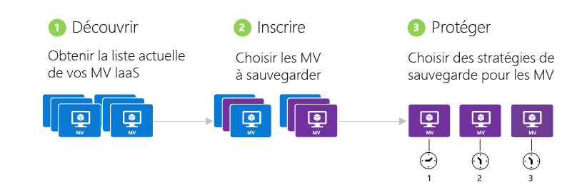

>[AZURE.NOTE] La sauvegarde des machines virtuelles est un processus local. Vous ne pouvez pas sauvegarder les machines virtuelles dans une région donnée vers un archivage de sauvegarde d’une autre région. Par conséquent, vous devez créer un archivage de sauvegarde dans chaque région Azure dans laquelle des machines virtuelles seront sauvegardées.

## Étape 1 - Découverte des machines virtuelles Azure
Exécutez le processus de découverte pour vous assurer que les nouvelles machines virtuelles ajoutées à l’abonnement sont bien identifiées avant l’inscription. Le processus interroge Azure pour obtenir la liste des machines virtuelles de l’abonnement et des informations supplémentaires, comme le nom du service cloud et la région.

1. Connectez-vous au [portail Classic](http://manage.windowsazure.com/)

2. Dans la liste des services Azure, cliquez sur **Recovery Services** pour ouvrir la liste des coffres de sauvegarde et Site Recovery. 

3. Dans la liste des archivages de sauvegarde, sélectionnez le coffre pour sauvegarder une machine virtuelle.

    S’il s’agit d’un nouveau coffre, le portail affiche la page **Démarrage rapide**.

    

    Si le coffre a été précédemment configuré, le portail ouvre le dernier menu utilisé.

4. Dans le menu du coffre (en haut de la page), cliquez sur **Éléments inscrits**.

    

5. Dans le menu **Type**, sélectionnez **Machine virtuelle Azure**.

    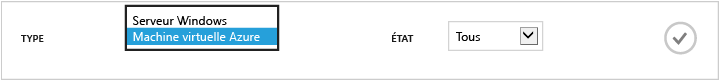

6. Cliquez sur **DÉCOUVRIR** en bas de la page. 

    Le processus de découverte peut durer quelques minutes, le temps que les machines virtuelles soient affichées sous forme de tableau. Une notification affichée en bas de l’écran vous informe que le processus est en cours d’exécution.

    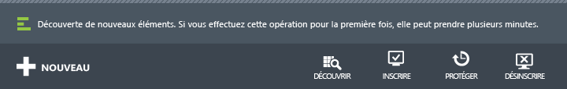

    La notification change lorsque le processus est terminé. Si le processus de découverte n’a pas trouvé les machines virtuelles, vérifiez tout d’abord que les machines virtuelles existent. Si les machines virtuelles existent, vérifiez qu’elles se situent dans la même région que le coffre de sauvegarde. Si les machines virtuelles existent et se situent dans la même région, vérifiez qu’elles ne sont pas déjà inscrites dans un coffre de sauvegarde. Si une machine virtuelle est assignée à un coffre de sauvegarde, elle ne peut pas être affectée à d’autres coffres de sauvegarde.

    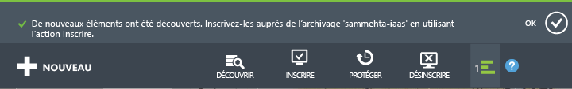

    Une fois les nouveaux éléments découverts, passez à l’étape 2 et inscrivez vos machines virtuelles.

##  Étape 2 - Inscription des machines virtuelles Azure
Vous inscrivez une machine virtuelle Azure pour l’associer au service Azure Backup. L’inscription est généralement une activité unique.

1. Accédez à l’archivage de sauvegarde se trouvant sous **Services de récupération** dans le portail Azure, puis cliquez sur **Éléments inscrits**.

2. Sélectionnez **Machine virtuelle Azure** dans le menu déroulant.

    

3. Cliquez sur **INSCRIRE** en bas de la page. 

4. Dans le menu contextuel **Inscrire les éléments**, choisissez les machines virtuelles que vous souhaitez inscrire. Si au moins deux machines virtuelles portent le même nom, utilisez le service cloud pour les distinguer.

    >[AZURE.TIP] Plusieurs machines virtuelles peuvent être inscrites en même temps.

    Un travail est créé pour chaque machine virtuelle sélectionnée.

5. Cliquez sur **Afficher le travail** dans la notification pour accéder à la page **Travaux**.

    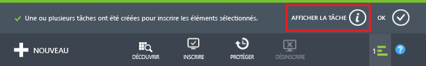

    La machine virtuelle est également affichée dans la liste des éléments inscrits avec l’état de l’opération d’inscription.

    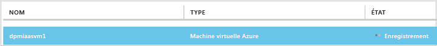

    Une fois l’opération terminée, l’état change pour refléter l’état *inscrit*.

    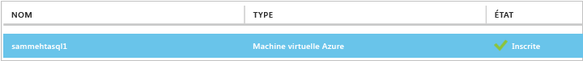

## Étape 3 - Protection des machines virtuelles Azure
Vous pouvez désormais configurer une stratégie de sauvegarde et de rétention pour la machine virtuelle. Plusieurs machines virtuelles peuvent être protégées par la même action de protection.

Les archivages Azure Backup créés après mai 2015 sont livrés avec une stratégie par défaut intégrée. Cette stratégie par défaut est fournie avec une durée de conservation par défaut de 30 jours et une fréquence de sauvegarde quotidienne d’une fois par jour.

1. Accédez à l’archivage de sauvegarde se trouvant sous **Services de récupération** dans le portail Azure, puis cliquez sur **Éléments inscrits**.
2. Sélectionnez **Machine virtuelle Azure** dans le menu déroulant.

    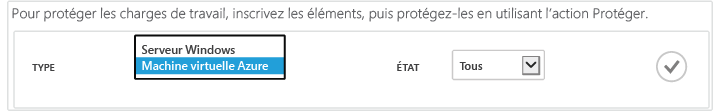

3. En bas de la page, cliquez sur **PROTÉGER**.

    L’Assistant **Protection des éléments** s’affiche. Cet Assistant ne répertorie que les machines virtuelles qui sont inscrites et non protégées. Sélectionnez les machines virtuelles que vous souhaitez protéger.

    Si au moins deux machines virtuelles portent le même nom, utilisez le service cloud pour les distinguer.

    >[AZURE.TIP] Vous pouvez protéger plusieurs machines virtuelles en même temps.

    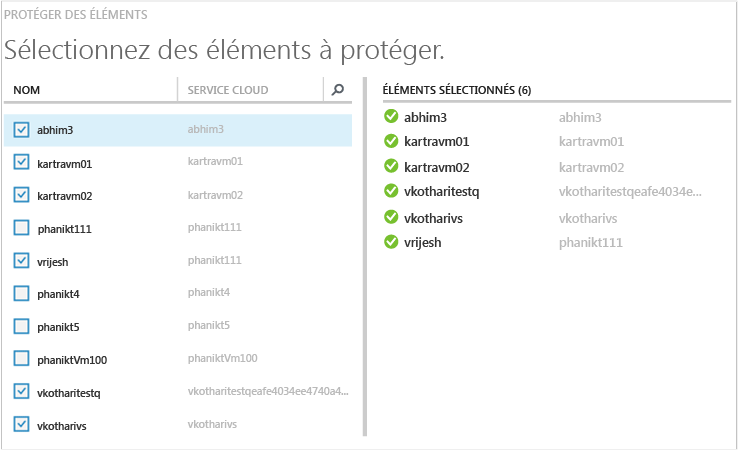

4. Choisissez une **Planification de sauvegarde** pour sauvegarder les machines virtuelles que vous avez sélectionnées. Vous pouvez sélectionner un ensemble de stratégies existant ou en définir un nouveau.

    Vous pouvez associer plusieurs machines virtuelles à chaque stratégie de sauvegarde. Toutefois, vous ne pouvez associer votre machine virtuelle qu’à une seule stratégie à un moment donné.

    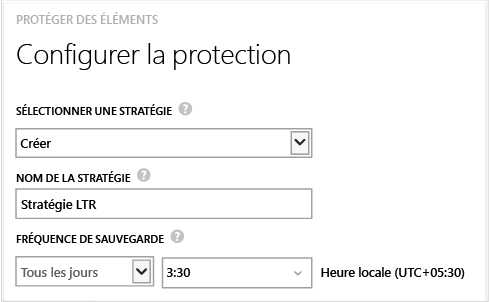

    >[AZURE.NOTE] Une stratégie de sauvegarde inclut le schéma de rétention des sauvegardes planifiées. Si vous sélectionnez une stratégie de sauvegarde existante, vous ne pourrez pas modifier les options de rétention à l’étape suivante.

5. Choisissez une **plage de rétention** à associer aux sauvegardes.

    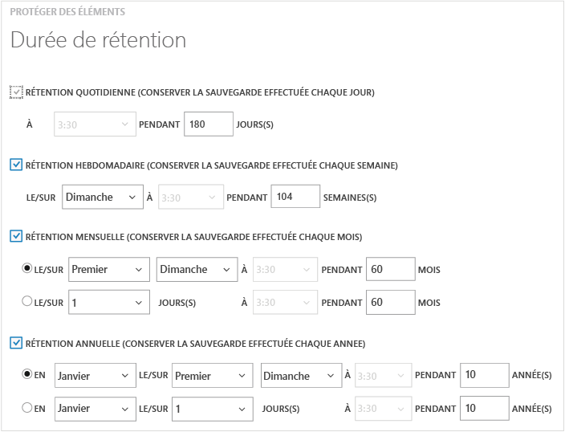

    La stratégie de rétention spécifie la durée de stockage d’une sauvegarde. Vous pouvez spécifier des stratégies de rétention différentes en fonction de la date à laquelle la sauvegarde est effectuée. Par exemple, un point de sauvegarde effectué quotidiennement (qui sert de point de récupération opérationnel) peut être conservé pendant 90 jours. En comparaison, un point de sauvegarde effectué à la fin de chaque trimestre (à des fins d'audit) devra peut-être être conservé pendant des mois ou des années.

    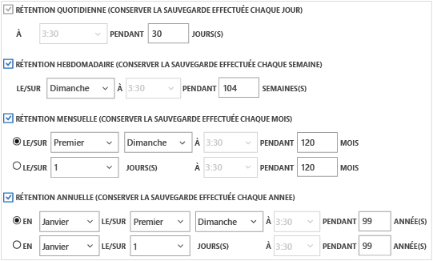

    Dans cet exemple :

    - **Stratégie de rétention quotidienne** : les sauvegardes effectuées quotidiennement sont stockées pendant 30 jours.
    - **Stratégie de rétention hebdomadaire** : les sauvegardes effectuées tous les dimanches sont conservées pendant 104 semaines.
    - **Stratégie de rétention mensuelle** : les sauvegardes effectuées le dernier dimanche de chaque mois sont conservées pendant 120 mois.
    - **Stratégie de rétention annuelle** : les sauvegardes effectuées le premier dimanche de janvier de chaque année sont conservées pendant 99 ans.

    Un travail est créé pour configurer la stratégie de protection et associer à celle-ci les machines virtuelles sélectionnées.

6. Pour afficher la liste des travaux **Configurer la protection**, dans le menu d’archivage, cliquez sur **Travaux** et sélectionnez **Configurer la protection** dans le filtre **Opération**.

    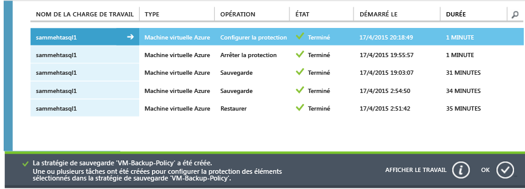

## Sauvegarde initiale
Une fois la machine virtuelle protégée par une stratégie, elle apparaît sous l’onglet **Éléments protégés** avec l’état *Protégé (sauvegarde initiale en attente)*. Par défaut, la première sauvegarde planifiée est la *sauvegarde initiale*.

Pour déclencher la sauvegarde initiale immédiatement après la configuration de la protection :

1. Cliquez sur le bouton **Sauvegarder maintenant** en bas de la page **Éléments protégés**.

    Le service Azure Backup crée un travail de sauvegarde pour l’opération de sauvegarde initiale.

2. Cliquez sur l’onglet **Travaux** pour afficher la liste des travaux.

    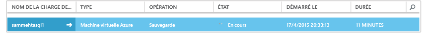

>[AZURE.NOTE] Pendant l’opération de sauvegarde, le service Azure Backup émet une commande vers l’extension de sauvegarde de chaque machine virtuelle pour vider tous les travaux d’écriture et prendre un instantané cohérent.

Une fois la sauvegarde initiale terminée, l’état de la machine virtuelle présente dans l’onglet **Éléments protégés** s’affiche en tant que *Protégé*.

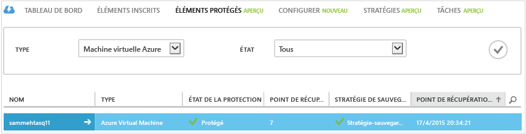

## Affichage des détails et de l’état de sauvegarde
Une fois la protection appliquée, le nombre de machines virtuelles augmente également sur la page de synthèse nommée **Tableau de bord**. La page **Tableau de bord** affiche également le nombre de travaux des dernières 24 heures ayant *réussi*, ayant *échoué* ou *en cours*. Sur la page **Travaux**, utilisez les menus **État**, **Opération**, ou **De** et **À** pour filtrer les travaux.

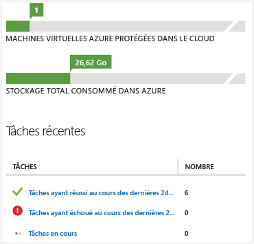

Les valeurs du tableau de bord sont actualisées toutes les 24 heures.

## Résolution des erreurs
Si vous rencontrez des problèmes pendant la sauvegarde de votre machine virtuelle, consultez l’[article sur le dépannage des machines virtuelles](backup-azure-vms-troubleshoot.md) pour obtenir de l’aide.

## Étapes suivantes

- [Gestion et surveillance de vos machines virtuelles](backup-azure-manage-vms.md)
- [Restauration des machines virtuelles](backup-azure-restore-vms.md)

<!---HONumber=AcomDC_0706_2016-->