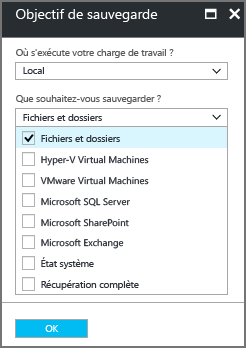

# Sauvegarder un client Windows ou un serveur Windows Server dans Azure et le modèle de déploiement Resource Manager
> [!div class="op_single_selector"]
> * [Portail Azure](backup-configure-vault.md)
> * [Portail classique](backup-configure-vault-classic.md)
>
>

Cet article explique comment sauvegarder vos fichiers et dossiers Windows Server (ou d’un client Windows) sur Azure avec Azure Backup et le modèle de déploiement Resource Manager.

[!INCLUDE [learn-about-deployment-models](../../includes/backup-deployment-models.md)]

## Avant de commencer
Pour sauvegarder un serveur ou un client sur Azure, vous devez disposer d’un compte Azure. Si vous n’en possédez pas, vous pouvez créer un [compte gratuit](https://azure.microsoft.com/free/) en quelques minutes.

## Créer un coffre Recovery Services
Un coffre Recovery Services est une entité qui stocke l’ensemble des sauvegardes et des points de récupération créés au fil du temps. Le coffre Recovery Services contient également la stratégie de sauvegarde appliquée aux fichiers et aux dossiers protégés. Lorsque vous créez un coffre Recovery Services, vous devez également sélectionner l’option de redondance de stockage appropriée.

### Pour créer un archivage de Recovery Services
1. Si ce n’est pas déjà fait, connectez-vous au [portail Azure](https://portal.azure.com/) à l’aide de votre abonnement Azure.
2. Dans le menu Hub, cliquez sur **Plus de services**. Dans la liste de ressources, saisissez **Recovery Services** et cliquez sur **Coffres Recovery Services**.

      

    Si l’abonnement inclut des coffres Recovery Services, ces derniers sont répertoriés.

3. Dans le menu **Coffres Recovery Services**, cliquez sur **Ajouter**.

    

    Le panneau du coffre Recovery Services s’affiche et vous invite à renseigner les champs **Nom**, **Abonnement**, **Groupe de ressources** et **Emplacement**.

    

4. Sous **Nom**, entrez un nom convivial permettant d’identifier le coffre. Le nom doit être unique pour l’abonnement Azure. Tapez un nom contenant entre 2 et 50 caractères. Il doit commencer par une lettre, et ne peut contenir que des lettres, des chiffres et des traits d’union.

5. Dans la section **Abonnement**, utilisez le menu déroulant pour choisir l’abonnement Azure. Si vous n’utilisez qu’un seul abonnement, ce dernier s’affiche et vous pouvez passer directement à l’étape suivante. Si vous n’êtes pas sûr de l’abonnement à utiliser, utilisez l’abonnement par défaut (ou suggéré). Vous ne disposez de plusieurs choix que si votre compte professionnel est associé à plusieurs abonnements Azure.

6. Dans la section **Groupe de ressources** :

    * sélectionnez **Créer** si vous voulez créer un groupe de ressources.
    Ou
    * sélectionnez **Utiliser existant** et cliquez sur le menu déroulant pour afficher la liste des groupes de ressources disponibles.

  Pour plus d’informations sur les groupes de ressources, consultez [Vue d’ensemble d’Azure Resource Manager](../azure-resource-manager/resource-group-overview.md).

7. Cliquez sur **Emplacement** pour sélectionner la région géographique du coffre. Ce choix définit la région géographique où vos données de sauvegarde sont envoyées.

8. En bas du panneau du coffre Recovery Services, cliquez sur **créer**.

  La création du coffre Recovery Services peut prendre plusieurs minutes. Surveillez les notifications d'état dans l'angle supérieur droit du portail. Une fois votre archivage créé, il apparaît dans la liste des archivages de Recovery Services. Si vous ne voyez pas votre coffre après quelques minutes, cliquez sur **Actualiser**.

   

  Une fois que votre coffre apparaît dans la liste des coffres Recovery Services, vous êtes prêt à définir la redondance du stockage.

### Définir la redondance du stockage
Lorsque vous créez un archivage de Recovery Services pour la première fois, vous devez spécifier le mode de réplication du stockage.

1. Dans le panneau **Coffres Recovery Services**, cliquez sur le nouveau coffre.

    

    Lorsque vous sélectionnez le coffre, le panneau **Coffre Recovery Services** se réduit et le panneau Paramètres (*qui porte le nom du coffre en haut*) ainsi que le panneau des détails du coffre s’ouvrent.

    

2. Dans le panneau Paramètres du nouveau coffre, utilisez le curseur vertical pour faire défiler l’écran jusqu'à la section Gestion, puis cliquez sur **Infrastructure de sauvegarde**.

  Le panneau Infrastructure de sauvegarde s’ouvre.

3. Dans le panneau Infrastructure de sauvegarde, cliquez sur **Configuration de la sauvegarde** pour ouvrir le panneau **Configuration de la sauvegarde**.

  

4. Choisissez l’option de réplication de stockage à appliquer à votre archivage.

  

  Par défaut, votre archivage utilise un stockage géo-redondant. Si vous utilisez Azure comme principal point de terminaison du stockage de sauvegarde, laissez cette option **inchangée**. Sinon, choisissez l’option **Localement redondant**, qui réduit les coûts de stockage Azure. Pour en savoir plus sur les options de stockage [géo-redondant](../storage/common/storage-redundancy.md#geo-redundant-storage) et [localement redondant](../storage/common/storage-redundancy.md#locally-redundant-storage), consultez la [présentation de la redondance du stockage](../storage/common/storage-redundancy.md).

Maintenant que vous avez créé un coffre, préparez votre infrastructure de sauvegarde des fichiers et des dossiers en téléchargeant et en installant l’agent Microsoft Azure Recovery Services, en téléchargeant les informations d’identification du coffre et en utilisant ces informations pour enregistrer l’agent auprès du coffre.

## configuration du coffre

1. Dans le panneau du coffre Recovery Services que vous venez de créer, accédez à la section Prise en main, puis cliquez sur **Sauvegarde** ; dans le panneau **Prise en main de la sauvegarde**, sélectionnez **Objectif de la sauvegarde**.

  

  Le panneau **Objectif de la sauvegarde** s’ouvre. Si vous avez déjà configuré Recovery Services, le panneau **Objectif de sauvegarde** s’ouvre lorsque vous cliquez sur **Sauvegarde** dans le panneau Coffre Recovery Services.

  

2. Dans la liste déroulante **Où s’exécute votre charge de travail ?**, sélectionnez **Local**.

  En effet, vous devez choisir l’option **Local**, car votre ordinateur Windows Server ou Windows est une machine physique, qui ne se trouve donc pas dans Azure.

3. Dans le menu **Que voulez-vous sauvegarder ?**, sélectionnez **Fichiers et dossiers** et cliquez sur **OK**.

  

  Lorsque vous cliquez sur OK, une coche apparaît en regard de la zone **Objectif de la sauvegarde** et le volet **Préparer l’infrastructure** s’ouvre.

  

4. Dans le panneau **Préparer l’infrastructure**, cliquez sur **Télécharger l’agent pour Windows Server ou pour le client Windows**.

  

  Si vous utilisez Windows Server Essentials, puis choisissez de télécharger l’agent associé à ce produit, un menu contextuel vous invite à exécuter ou enregistrer le fichier MARSAgentInstaller.exe.

  

5. Dans le menu contextuel de téléchargement, cliquez sur **Enregistrer**.

  Par défaut, le fichier **MARSagentinstaller.exe** est enregistré dans le dossier Téléchargements. Une fois l’exécution du programme d’installation terminée, une fenêtre contextuelle s’affiche, vous demandant si vous voulez lancer ce programme ou ouvrir le dossier.

  

  Vous n’avez pas besoin d’installer l’agent à cette étape ; Vous pouvez installer l’agent après avoir téléchargé les informations d’identification du coffre.

6. Dans le panneau **Préparer l’infrastructure**, cliquez sur **Télécharger**.

  

  Les informations d’identification du coffre sont téléchargées dans le dossier Téléchargements. Une fois cette opération terminée, une fenêtre contextuelle s’affiche, vous demandant si vous voulez ouvrir ou enregistrer ces informations. Cliquez sur **Save**. Si vous cliquez sur **Ouvrir** par erreur, attendez que la boîte de dialogue qui s’affiche annonce l’échec de la tentative d’ouverture des informations d’identification du coffre. En effet, vous ne pouvez pas les ouvrir. Passez à l'étape suivante. Les informations d’identification du coffre se trouvent dans le dossier Téléchargements.   

  

## Installer et inscrire l’agent

> [!NOTE]
> La fonction de sauvegarde via le portail Azure n’est pas disponible pour le moment. Utilisez l’agent Microsoft Azure Recovery Services pour sauvegarder vos fichiers et dossiers.
>

1. Recherchez et double-cliquez sur **MARSagentinstaller.exe** dans le dossier Téléchargements (ou tout autre emplacement d’enregistrement).

  Le programme d’installation affiche différents messages au fur et à mesure qu’il extrait, installe et enregistre l’agent Recovery Services.

  

2. Exécutez l’Assistant Installation de l’Agent Microsoft Azure Recovery Services. Pour terminer l’Assistant, vous devez :

  * Choisir un emplacement pour le dossier d’installation et de cache.
  * Fournir les informations relatives au serveur proxy, si vous en utilisez un pour vous connecter à Internet.
  * Fournir votre nom d’utilisateur et votre mot de passe si vous utilisez un proxy authentifié.
  * Fournir les informations d’identification de l’archivage téléchargées.
  * Enregistrer la phrase secrète de chiffrement dans un emplacement sécurisé.

  > [!NOTE]
  > En cas de perte ou d’oubli de la phrase secrète, Microsoft ne pourra pas vous aider à récupérer les données de sauvegarde. Enregistrez le fichier dans un emplacement sécurisé. Il est nécessaire pour restaurer une sauvegarde.
  >
  >

L’agent est désormais installé et votre ordinateur est inscrit dans le coffre. Vous êtes prêt à configurer et à planifier votre sauvegarde.

## Conditions de connectivité et réseau

Si votre ordinateur/proxy a un accès à Internet limité, assurez-vous que les paramètres du pare-feu sur l’ordinateur/le proxy sont configurés pour autoriser les URL suivantes :  
    1. www.msftncsi.com
    2. *.Microsoft.com
    3. *.MicrosoftAzure.com
    4. *.microsoftonline.com
    5. *.windows.ne

## Création de la stratégie de sauvegarde
La stratégie de sauvegarde couvre a planification d’exécution des points de récupération et la durée de rétention de ces points de récupération. Utilisez l’agent Microsoft Azure Backup pour créer la stratégie de sauvegarde de vos fichiers et dossiers.

### Pour créer une planification de sauvegarde
1. Ouvrez l’agent Microsoft Azure Backup. Vous pouvez le trouver en recherchant **Microsoft Azure Backup**sur votre ordinateur.

    
2. Dans le panneau **Actions** de l’agent Backup, cliquez sur **Planifier la sauvegarde** pour lancer l’Assistant Planifier la sauvegarde.

    

3. Sur la page **Mise en route** de l’Assistant Planifier la sauvegarde, cliquez sur **Suivant**.
4. Sur la page **Sélectionner les éléments à sauvegarder**, cliquez sur **Ajouter des éléments**.

  La boîte de dialogue Sélectionner les éléments s’ouvre.

5. Sélectionnez les fichiers et les dossiers que vous souhaitez protéger, puis cliquez sur **OK**.
6. Sur la page **Sélectionner les éléments à sauvegarder**, cliquez sur **Suivant**.
7. Sur la page **Spécifier la planification de sauvegarde**, spécifiez la planification de sauvegarde, puis cliquez sur **Suivant**.

    Vous pouvez planifier des sauvegardes quotidiennes (au maximum 3 fois par jour) ou hebdomadaires.

    

   > [!NOTE]
   > Pour plus d’informations sur la spécification de la planification de la sauvegarde, consultez l’article [Utilisation d’Azure Backup pour remplacer votre infrastructure sur bande](backup-azure-backup-cloud-as-tape.md).
   >
   >

8. Sur la page **Sélectionner une stratégie de rétention**, choisissez les stratégies de rétention spécifiques pour la copie de sauvegarde et cliquez sur **Suivant**.

    La stratégie de rétention spécifie la durée de stockage de la sauvegarde. Au lieu de simplement spécifier une même stratégie pour tous les points de sauvegarde, vous pouvez spécifier différentes stratégies de rétention en fonction du moment où est effectuée la sauvegarde. Vous pouvez modifier les stratégies de rétention quotidiennes, hebdomadaires, mensuelles et annuelles pour répondre à vos besoins.
9. Sur la page Choisir un type de sauvegarde initiale, sélectionnez le type de sauvegarde initiale. Laissez l’option **Automatiquement sur le réseau** sélectionnée, puis cliquez sur **Suivant**.

    Vous pouvez effectuer des sauvegardes automatiques sur le réseau ou vous pouvez sauvegarder en mode hors connexion. Le reste de cet article décrit le processus de sauvegarde automatique. Si vous préférez effectuer une sauvegarde en mode hors connexion, consultez l’article [Flux de travail de la sauvegarde hors connexion dans Azure Backup](backup-azure-backup-import-export.md) pour plus d’informations.
10. Sur la page Confirmation, passez en revue les informations, puis cliquez sur **Terminer**.
11. Lorsque l’Assistant a terminé la création de la planification de la sauvegarde, cliquez sur **Fermer**.

### Activation de la limitation du réseau
L’agent Microsoft Azure Backup prend en charge la limitation du réseau. La limitation contrôle l’utilisation de la bande passante réseau durant le transfert de données. Cela peut s’avérer utile si vous avez besoin de sauvegarder des données pendant les heures de travail, mais ne souhaitez pas que le processus de sauvegarde interfère avec le reste du trafic internet. La limitation s’applique aux activités de sauvegarde et de restauration.

> [!NOTE]
> La limitation du réseau n’est pas disponible sur Windows Server 2008 R2 SP1, Windows Server 2008 SP2 ou Windows 7 (avec service packs). La fonctionnalité de limitation du réseau Azure Backup implique une qualité de Service (QoS) sur le système d’exploitation local. Même si Azure Backup est en mesure de protéger ces systèmes d’exploitation, la version de la qualité de service disponible sur ces plates-formes ne fonctionne pas avec la fonctionnalité de limitation du réseau Azure Backup. La limitation du réseau peut être utilisée sur tous les autres [systèmes d’exploitation pris en charge](backup-azure-backup-faq.md).
>
>

**Pour activer la limitation du réseau**

1. Dans l’agent Microsoft Azure Backup, cliquez sur **Modifier les propriétés**.

    
2. Dans l’onglet **Limitation**, activez la case à cocher **Activer la limitation de la bande passante sur Internet pour les opérations de sauvegarde**.

    
3. Une fois que vous avez activé la limitation, spécifiez la bande passante autorisée pour le transfert des données de sauvegarde durant les **Heures de travail** et les **Heures chômées**.

    Les valeurs de bande passante, qui démarrent à 512 kilo-octets par seconde, peuvent aller jusqu’à 1 023 mégaoctets par seconde. Vous pouvez également définir le début et la fin des **Heures de travail**et identifier les jours de la semaine considérés comme des jours de travail. Les heures non comprises dans les heures de travail définies sont considérées comme des heures chômées.
4. Cliquez sur **OK**.

### Pour sauvegarder les fichiers et dossiers pour la première fois
1. Dans l’agent Backup, cliquez sur **Sauvegarder maintenant** pour effectuer l’amorçage initial sur le réseau.

    
2. Sur la page Confirmation, vérifiez les paramètres utilisés par l’Assistant Sauvegarder maintenant pour sauvegarder les données de l’ordinateur, puis cliquez sur **Sauvegarder**.
3. Cliquez sur **Fermer** pour fermer l’assistant. Si vous fermez l’Assistant avant la fin du processus de sauvegarde, celui-ci continuera de s’exécuter en arrière-plan.

Une fois la sauvegarde initiale terminée, le statut **Tâche terminée** apparaît dans la console Backup.

## Des questions ?
Si vous avez des questions ou si vous souhaitez que certaines fonctionnalités soient incluses, [envoyez-nous vos commentaires](http://aka.ms/azurebackup_feedback).

## Étapes suivantes
Pour plus d’informations sur la sauvegarde des machines virtuelles ou d’autres charges de travail, consultez les références suivantes :

* Maintenant que vous avez sauvegardé vos fichiers et vos dossiers, vous pouvez [gérer vos coffres et vos serveurs](backup-azure-manage-windows-server.md).
* Si vous avez besoin de restaurer une sauvegarde, utilisez cet article pour [restaurer des fichiers sur un ordinateur Windows](backup-azure-restore-windows-server.md).
