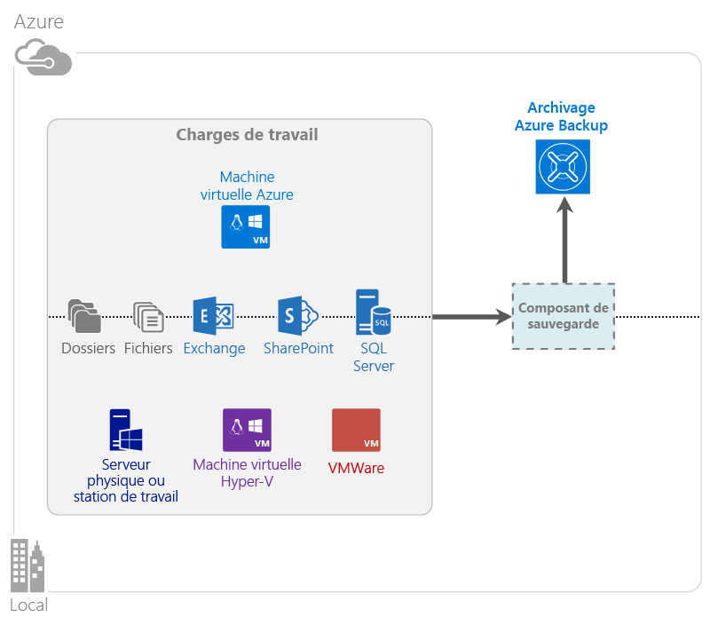

<properties
	pageTitle="Qu’est-ce qu’Azure Backup ? | Microsoft Azure"
	description="Grâce aux services de sauvegarde et de récupération d’Azure, vous pouvez sauvegarder et restaurer des données et des applications à partir de serveurs Windows, d’ordinateurs clients Windows, de serveurs System Center DPM ou de machines virtuelles Azure."
	services="backup"
	documentationCenter=""
	authors="Jim-Parker"
	manager="jwhit"
	editor="tysonn"
	keywords="sauvegarde et restauration ; services de restauration ; solutions de sauvegarde"/>

<tags
	ms.service="backup"
	ms.workload="storage-backup-recovery"
	ms.tgt_pltfrm="na"
	ms.devlang="na"
	ms.topic="get-started-article"
	ms.date="03/02/2016"
	ms.author="trinadhk;jimpark"/>

# Qu’est-ce qu’Azure Backup ?
Azure Backup est un service qui vous permet de sauvegarder et restaurer vos données dans le cloud Microsoft. Il remplace votre solution de sauvegarde locale ou hors site par une solution basée dans le cloud à la fois fiable, sécurisée et économique. Ce service vous permet également de protéger les ressources exécutées dans le cloud. Azure Backup fournit des services de récupération reposant sur une infrastructure de classe mondiale extensible, durable et hautement disponible.

[Regarder une vidéo de présentation d’Azure Backup](https://azure.microsoft.com/documentation/videos/what-is-azure-backup/)

## Pourquoi utiliser Azure Backup ?
Les solutions de sauvegarde traditionnelles ont évolué et considèrent désormais le cloud comme un point de terminaison similaire aux disques ou bandes. Bien que simple, cette approche présente des limites. Elle ne pas tire pleinement parti d’une plate-forme de cloud sous-jacente, ce qui se traduit par une solution inefficace et coûteuse. Azure Backup offre, en revanche, tous les avantages d’une solution de sauvegarde cloud puissante et abordable. Voici quelques-uns des principaux avantages offerts par Azure Backup :

| Fonctionnalité | Avantage |
| ------- | ------- |
| Gestion automatique du stockage | Aucune dépense d’investissement n’est nécessaire pour l’achat de périphériques de stockage en local. Azure Backup alloue et gère automatiquement le stockage de sauvegarde sur la base d’un modèle de paiement à l’utilisation. |
| Mise à l’échelle illimitée | Bénéficiez de garanties de haute disponibilité sans frais de gestion et de surveillance. Azure Backup utilise la puissance sous-jacente et la mise à l’échelle du cloud Azure, offrant des capacités d’évolution automatique non intrusives. |
| Diverses options de stockage | Choisissez le stockage de sauvegarde adapté à vos besoins : <li>un objet blob de blocs LRS (stockage localement redondant), idéal pour les clients qui cherchent à réduire leurs coûts tout en protégeant leurs données contre les défaillances matérielles locales ; <li>un objet blob de blocs de stockage par géo-réplication, qui fournit trois copies supplémentaires dans un centre de données associé afin de garantir la haute disponibilité de vos données de sauvegarde, même en cas de sinistre au niveau du site Azure. |
| Transfert de données illimité | Aucuns frais ne sont facturés pour le transfert de données sortant pendant une opération de restauration à partir du coffre Azure Backup. Les données entrantes transférées vers Azure sont également gratuites. |
| Gestion centralisée | Le portail Azure allie simplicité et convivialité. À mesure de l’évolution du service, des fonctionnalités comme la gestion centralisée vous permettront de gérer votre infrastructure de sauvegarde depuis un emplacement unique. |
| Chiffrement des données | Le chiffrement des données garantit une transmission et un stockage sécurisés des données client dans le cloud public. La phrase secrète de chiffrement est stockée au niveau de la source et n’est jamais transmise ou stockée dans Azure. La clé de chiffrement est nécessaire pour restaurer les données et seul le client dispose d’un accès complet aux données du service. |  
| Sauvegarde cohérente avec les applications | L’exécution de sauvegardes cohérentes au niveau applicatif sur Windows évite d’avoir à appliquer des correctifs au moment de la restauration. Cela permet de réduire l’objectif de temps de restauration et de rétablir plus rapidement l’environnement du client. |
| Rétention à long terme | Plutôt que de payer pour des solutions de sauvegarde sur bande hors site, les clients peuvent utiliser les fonctionnalités de sauvegarde d’Azure et bénéficier ainsi d’une solution attractive avec une sémantique de type bande à moindres coûts. |

## Composants d’Azure Backup
Azure Backup est une solution de sauvegarde hybride qui intègre donc plusieurs composants agissant de concert pour garantir une sauvegarde et une restauration de bout en bout des flux de travail.

## Scénarios de déploiement

| Composant | Déploiement possible dans Azure ? | Déploiement possible localement ? | Stockage cible pris en charge|
| --- | --- | --- | --- |
| Agent Azure Backup | 
**Oui**
 
L’agent Azure Backup peut être déployé sur n’importe quelle machine virtuelle Windows Server exécutée dans Azure.
 | 
**Oui**
 
L’agent Azure Backup peut être déployé sur n’importe quelle machine virtuelle ou physique Windows Server.
 | 
Coffre Azure Backup
 |
| System Center Data Protection Manager (DPM) | 
**Oui**
 
En savoir plus sur la [protection des charges de travail dans Azure à l’aide de System Center DPM](http://blogs.technet.com/b/dpm/archive/2014/09/02/azure-iaas-workload-protection-using-data-protection-manager.aspx).
 | 
**Oui**
 
En savoir plus sur la [protection des charges de travail et des machines virtuelles dans votre centre de données](https://technet.microsoft.com/library/hh758173.aspx).
 | 
Disque connecté localement,
 
coffre Azure Backup,
 
bande (en local uniquement)
 |
| Azure Backup Server | 
**Oui**
 
En savoir plus sur la [protection des charges de travail dans Azure à l’aide d’Azure Backup Server](backup-azure-microsoft-azure-backup.md).
 | 
**Oui**
 
En savoir plus sur la [protection des charges de travail dans Azure à l’aide d’Azure Backup Server](backup-azure-microsoft-azure-backup.md).
 | 
Coffre Azure Backup
 |
| Azure Backup (extension de machine virtuelle) | 
Oui
 
Spécialisé dans la [sauvegarde des machines virtuelles Azure IaaS (infrastructure-as-a-service)](backup-azure-vms-introduction.md).
 | 
**Non**
 
Utilisez System Center DPM pour sauvegarder des machines virtuelles dans votre centre de données.
 | 
Coffre Azure Backup
 |

## Quelles applications et charges de travail est-il possible de sauvegarder ?

| Charge de travail | Machine source | Solution Azure Backup |
| --- | --- |---|
| Fichiers et dossiers | Windows Server | 
[Agent Azure Backup](backup-configure-vault.md),
 
[System Center DPM](backup-azure-dpm-introduction.md),
 
[Azure Backup Server](backup-azure-microsoft-azure-backup.md)
 |
| Fichiers et dossiers | Client Windows | 
[Agent Azure Backup](backup-configure-vault.md),
 
[System Center DPM](backup-azure-dpm-introduction.md),
 
[Azure Backup Server](backup-azure-microsoft-azure-backup.md)
 |
| Machine virtuelle Hyper-V (Windows) | Windows Server | 
[System Center DPM](backup-azure-backup-sql.md),
 
[Azure Backup Server](backup-azure-microsoft-azure-backup.md)
 |
| Machine virtuelle Hyper-V (Linux) | Windows Server | 
[System Center DPM](backup-azure-backup-sql.md),
 
[Azure Backup Server](backup-azure-microsoft-azure-backup.md)
 |
| Microsoft SQL Server | Windows Server | 
[System Center DPM](backup-azure-backup-sql.md),
 
[Azure Backup Server](backup-azure-microsoft-azure-backup.md)
 |
| Microsoft SharePoint | Windows Server | 
[System Center DPM](backup-azure-backup-sql.md),
 
[Azure Backup Server](backup-azure-microsoft-azure-backup.md)
 |
| Microsoft Exchange | Windows Server | 
[System Center DPM](backup-azure-backup-sql.md),
 
[Azure Backup Server](backup-azure-microsoft-azure-backup.md)
 |
| Azure IaaS VMs (Windows)| - | [Azure Backup (extension de machine virtuelle)](backup-azure-vms-introduction.md) |
| Azure IaaS VMs (Linux) | - | [Azure Backup (extension de machine virtuelle)](backup-azure-vms-introduction.md) |

## Fonctionnalités
Ces cinq tableaux récapitulent la manière dont les fonctionnalités Azure Backup sont gérées dans chaque composant :

### Storage

| Fonctionnalité | Agent Azure Backup | System Center DPM | Azure Backup Server | Azure Backup (extension de machine virtuelle) |
| ------- | --- | --- | --- | ---- |
| Archivage de sauvegarde Azure | ![Oui][green] | ![Oui][green] | ![Oui][green] | ![Oui][green] |
| Stockage sur disque | | ![Oui][green] | ![Oui][green] | |
| Stockage sur bande | | ![Oui][green] | | |
| Compression (dans le coffre de sauvegarde) | ![Oui][green] | ![Oui][green]| ![Oui][green] | |
| Sauvegarde incrémentielle | ![Oui][green] | ![Oui][green] | ![Oui][green] | ![Oui][green] |
| Déduplication de disque | | ![Partiellement][yellow] | ![Partiellement][yellow]| | |

**Clé** &nbsp;&nbsp;&nbsp;&nbsp;&nbsp;&nbsp;
![Oui][green]= Prise en charge &nbsp;&nbsp;&nbsp;&nbsp;&nbsp;&nbsp; 
![Partiellement][yellow]= Prise en charge partielle &nbsp;&nbsp;&nbsp;&nbsp;&nbsp;&nbsp; *&lt;blank&gt;* = Pas de prise en charge

Le coffre Azure Backup est la cible de stockage par défaut sur tous les composants. System Center DPM et Azure Backup Server permettent également de disposer d’une copie du disque local, mais seul System Center DPM prend en charge l’écriture de données sur un périphérique de stockage à bande.

#### Sauvegarde incrémentielle
Quel que soit le stockage cible (disque, bande, coffre Azure Backup), chaque composant prend en charge la sauvegarde incrémentielle. Les sauvegardes sont ainsi efficaces en termes de stockage et de temps puisqu’elles se concentrent uniquement sur les modifications incrémentielles apportées depuis la dernière sauvegarde pour transférer ensuite ces modifications vers le stockage cible. Les sauvegardes sont également compressées afin de réduire l’encombrement du stockage.

L’extension de machine virtuelle est le seul composant qui n’effectue aucune compression. Toutes les données de sauvegarde sont copiées du compte de stockage client vers le coffre Azure Backup dans la même région, sans compression. Bien que cela augmente légèrement le stockage utilisé, le fait de stocker des données sans compression garantir des restaurations plus rapides.

#### Déduplication
La déduplication est prise en charge par System Center DPM et Azure Backup Server lorsqu’ils sont [déployés dans une machine virtuelle Hyper-V](http://blogs.technet.com/b/dpm/archive/2015/01/06/deduplication-of-dpm-storage-reduce-dpm-storage-consumption.aspx). La déduplication intervient au niveau de l’hôte grâce à la fonction de déduplication de Windows Server sur les disques durs virtuels attachés en tant que stockage de sauvegarde à la machine virtuelle.

>[AZURE.WARNING] La déduplication n’est en revanche pas disponible dans Azure pour aucun des composants d’Azure Backup. Lorsque System Center DPM et Azure Backup Server sont déployés dans Azure, les disques de stockage attachés à la machine virtuelle ne peuvent pas être dédupliqués.

### Sécurité

| Fonctionnalité | Agent Azure Backup | System Center DPM | Azure Backup Server | Azure Backup (extension de machine virtuelle) |
| ------- | --- | --- | --- | ---- |
| Sécurité du réseau (vers Azure) | ![Oui][green] |![Oui][green] | ![Oui][green] | ![Partiellement][yellow]|
| Sécurité des données (dans Azure) | ![Oui][green] |![Oui][green] | ![Oui][green] | ![Partiellement][yellow]|

**Clé** &nbsp;&nbsp;&nbsp;&nbsp;&nbsp;&nbsp;
![Oui][green]= Prise en charge &nbsp;&nbsp;&nbsp;&nbsp;&nbsp;&nbsp; 
![Partiellement][yellow]= Prise en charge partielle &nbsp;&nbsp;&nbsp;&nbsp;&nbsp;&nbsp; *&lt;blank&gt;* = Pas de prise en charge

L’ensemble du trafic de sauvegarde entre vos serveurs et le coffre Azure Backup est chiffré à l’aide du protocole AES (Advanced Encryption Standard) 256. Les données sont envoyées via une connexion HTTPS sécurisée. Les données de sauvegarde sont également stockées dans le coffre Azure Backup sous une forme chiffrée. Seul le client conserve le mot de passe pour déverrouiller ces données. Microsoft ne peut déchiffrer les données de sauvegarde à aucun moment.

>[AZURE.WARNING] La clé utilisée pour chiffrer les données de sauvegarde est disponible uniquement chez le client. Microsoft ne conserve pas de copie dans Azure et n’a pas accès à la clé. Si la clé est égarée, Microsoft ne peut pas récupérer les données de sauvegarde.

Pour la sauvegarde des machines virtuelles Azure, vous devez configurer explicitement le chiffrement *dans* la machine virtuelle. Utilisez BitLocker sur les machines virtuelles Windows et **dm-crypt** sur les machines virtuelles Linux. Azure Backup ne chiffre pas automatiquement les données de sauvegarde en provenance de ce chemin d’accès.

### Charges de travail prises en charge

| Fonctionnalité | Agent Azure Backup | System Center DPM | Azure Backup Server | Azure Backup (extension de machine virtuelle) |
| ------- | --- | --- | --- | ---- |
| Ordinateur Windows Server ; fichiers et dossiers | ![Oui][green] | ![Oui][green] | ![Oui][green] | |
| Ordinateur client Windows ; fichiers et dossiers | ![Oui][green] | ![Oui][green] | ![Oui][green] | |
| Machine virtuelle Hyper-V (Windows) | | ![Oui][green] | ![Oui][green] | |
| Machine virtuelle Hyper-V (Linux) | | ![Oui][green] | ![Oui][green] | |
| Microsoft SQL Server | | ![Oui][green] | ![Oui][green] | |
| Microsoft SharePoint | | ![Oui][green] | ![Oui][green] | |
| Microsoft Exchange | | ![Oui][green] | ![Oui][green] | |
| Machine virtuelle Azure (Windows) | | | | ![Oui][green] |
| Machine virtuelle Azure (Linux) | | | | ![Oui][green] |

**Clé** &nbsp;&nbsp;&nbsp;&nbsp;&nbsp;&nbsp;
![Oui][green]= Prise en charge &nbsp;&nbsp;&nbsp;&nbsp;&nbsp;&nbsp; *&lt;blank&gt;* = Pas de prise en charge

### Réseau

| Fonctionnalité | Agent Azure Backup | System Center DPM | Azure Backup Server | Azure Backup (extension de machine virtuelle) |
| ------- | --- | --- | --- | ---- |
| Compression réseau (sur le serveur de sauvegarde) | | ![Oui][green] | ![Oui][green] | |
| Compression réseau (sur le coffre de sauvegarde) | ![Oui][green] | ![Oui][green] | ![Oui][green] | |
| Protocole réseau (sur le serveur de sauvegarde) | | TCP | TCP | |
| Protocole réseau (sur le coffre de sauvegarde) | HTTPS | HTTPS | HTTPS | HTTPS |

**Clé** &nbsp;&nbsp;&nbsp;&nbsp;&nbsp;&nbsp;
![Oui][green]= Prise en charge &nbsp;&nbsp;&nbsp;&nbsp;&nbsp;&nbsp; *&lt;blank&gt;* = Pas de prise en charge

Étant donné que l’extension de machine virtuelle lit directement les données à partir du compte Azure Storage via le réseau de stockage, il n’est pas nécessaire d’optimiser ce trafic. Comme le trafic transite sur le réseau de stockage local dans le centre de données Azure, la question de la compression liée aux problèmes de bande passante ne se pose pas véritablement.

Pour les clients qui protègent leurs données sur un serveur de sauvegarde (System Center DPM ou Azure Backup Server), le trafic généré entre le serveur principal et le serveur de sauvegarde peut également être compressé afin d’économiser de la bande passante.

### Sauvegarde et rétention

| | Agent Azure Backup | System Center DPM et Azure Backup Server | Azure Backup (extension de machine virtuelle) |
| --- | --- | --- | --- |
| Fréquence de sauvegarde (sur le coffre de sauvegarde) | Trois sauvegardes par jour | Deux sauvegardes par jour | Une sauvegarde par jour |
| Fréquence de sauvegarde (sur disque) | Non applicable | 
Toutes les 15 minutes pour SQL Server
 
Toutes les heures pour les autres charges de travail
 | Non applicable |
| Options de rétention | Quotidienne, hebdomadaire, mensuelle, annuelle | Quotidienne, hebdomadaire, mensuelle, annuelle | Quotidienne, hebdomadaire, mensuelle, annuelle |
| Période de rétention | Jusqu’à 99 ans | Jusqu’à 99 ans | Jusqu’à 99 ans |
| Points de récupération dans le coffre Azure Backup | Illimité | Illimité | Illimité |
| Points de récupération sur le disque local | Non applicable | Non applicable | Non applicable |
| Points de récupération sur bande | Non applicable | Non applicable | Non applicable |

## Qu’est-ce que le fichier d’informations d’identification de coffre ?

Le fichier d’informations d’identification de coffre est un certificat qui est généré par le portail pour chaque archivage de sauvegarde. Le portail télécharge ensuite la clé publique pour le Service de contrôle d’accès (ACS). La clé privée du certificat est accessible à l’utilisateur dans le cadre du flux de travail donné comme entrée dans le flux de travail d’inscription de machine. Cela authentifie l’ordinateur pour envoyer des données de sauvegarde dans un archivage identifié dans le service Azure Backup.

Les informations d’identification de coffre sont utilisées uniquement pendant le flux de travail d’inscription. Il est de la responsabilité de l’utilisateur de s’assurer que le fichier d’informations d’identification de coffre n’est pas compromis. S’il tombe entre les mains d’un utilisateur non autorisé, le fichier d’informations d’identification de coffre peut servir à inscrire d’autres ordinateurs pour le même archivage. Toutefois, comme les données de sauvegarde sont chiffrées à l’aide d’une phrase secrète qui appartient au client, les données de sauvegarde existantes ne peuvent pas être compromises. Pour atténuer ce problème, les informations d’identification de coffre sont configurées pour expirer sous 48 heures. Vous pouvez télécharger les informations d’identification d’un archivage de sauvegarde autant de fois que vous le souhaitez, mais seul le dernier fichier d’informations d’identification de coffre est applicable pendant le flux de travail d’inscription.

## Quelle est la différence entre Azure Backup et Azure Site Recovery ?
De nombreux clients ont tendance à confondre récupération de sauvegarde et récupération d’urgence. Les deux opérations capturent des données et fournissent une sémantique de restauration, mais chacune est associée à une proposition de valeur bien spécifique.

Azure Backup sauvegarde les données en local et dans le cloud. Azure Site Recovery coordonne la réplication, le basculement et la restauration automatique des machines virtuelles et des serveurs physiques. Ces deux services combinés offrent une solution de récupération d’urgence complète. Votre stratégie en la matière doit couvrir à la fois la protection et la récupération de vos données (Azure Backup) *et* la disponibilité et l’accessibilité de vos charges de travail (Azure Site Recovery) en cas de panne.

Avant de prendre toute décision en matière de sauvegarde et de récupération d’urgence, il est important de comprendre les concepts suivants :

| Concept | Détails | Sauvegarde | Récupération d’urgence |
| ------- | ------- | ------ | ----------------- |
| Objectif de point de récupération (RPO) | Quantité de perte de données acceptable dans l’éventualité où une restauration serait nécessaire. | Les solutions de sauvegarde offrent des RPO extrêmement variables. Les sauvegardes de machines virtuelles ont généralement un RPO d’un jour, contre seulement 15 minutes pour les sauvegardes de base de données. | Les solutions de récupération d’urgence ont un RPO extrêmement faible. La copie de récupération d’urgence peut devoir être prête en seulement quelques secondes ou quelques minutes. |
| Objectif de délai de récupération (RTO) | Quantité de temps nécessaire pour effectuer une récupération ou une restauration complète. | Un RPO plus long est généralement synonyme pour la solution de sauvegarde d’une bien plus grande quantité de données à traiter, ce qui allonge d’autant le RTO. Par exemple, il peut falloir plusieurs jours pour restaurer des données à partir de bandes, selon le temps nécessaire au transport de la bande depuis un site externe. | Les solutions de récupération d’urgence ont un RTO plus faible car elles sont davantage synchronisées avec la source et ont moins de modifications à traiter. |
| Rétention | Durée pendant laquelle les données doivent être stockées | 
Pour les scénarios qui requièrent une reprise des opérations (altération des données, suppression accidentelle de fichiers, défaillances du système d’exploitation), les données de sauvegarde sont généralement conservées pendant un maximum de 30 jours.
 
Du point de vue de la conformité, il peut être nécessaire de conserver les données pendant des mois, voire des années. Dans ce cas, les données de sauvegarde sont parfaitement adaptées aux besoins d’archivage.
 | La récupération d’urgence porte uniquement sur les données de récupération opérationnelle. Sa durée varie généralement de quelques heures à une journée. Puisque les solutions de récupération d’urgence sont conçues pour capturer les données à un niveau extrêmement précis, l’utilisation des données de récupération d’urgence n’est pas recommandée dans le cadre d’une rétention à long terme. |

## Étapes suivantes

- [Test d’Azure Backup](backup-try-azure-backup-in-10-mins.md)
- [Forum aux questions sur le service Azure Backup](backup-azure-backup-faq.md)
- Rendez-vous sur le [forum Azure Backup](http://go.microsoft.com/fwlink/p/?LinkId=290933).

[green]: ./media/backup-introduction-to-azure-backup/green.png
[yellow]: ./media/backup-introduction-to-azure-backup/yellow.png
[red]: ./media/backup-introduction-to-azure-backup/red.png

<!---HONumber=AcomDC_0302_2016-->