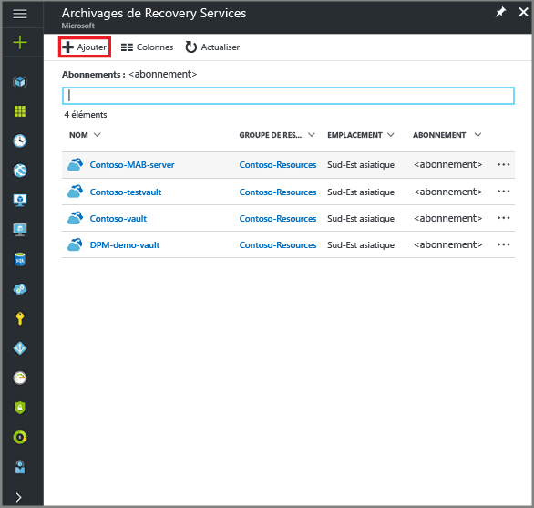
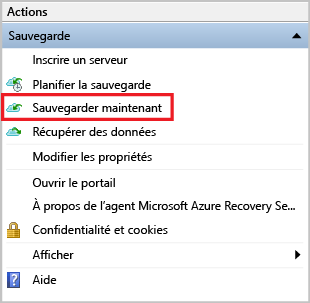

<properties
   pageTitle="Apprendre à sauvegarder des fichiers et dossiers d’un serveur Windows Server ou d’un client Windows sur Azure avec Azure Backup et le modèle de déploiement Resource Manager | Microsoft Azure"
   description="Apprenez à sauvegarder vos données Windows Server en créant un archivage, en installant l’agent de sauvegarde, puis en sauvegardant vos fichiers et dossiers dans Azure."
   services="backup"
   documentationCenter=""
   authors="markgalioto"
   manager="cfreeman"
   editor=""
   keywords="comment sauvegarder; procédure de sauvegarde"/>

<tags
   ms.service="backup"
   ms.workload="storage-backup-recovery"
   ms.tgt_pltfrm="na"
   ms.devlang="na"
   ms.topic="hero-article"
   ms.date="09/27/2016"
   ms.author="markgal;"/>

# Premier aperçu : sauvegarder des fichiers et dossiers avec Azure Backup et le modèle de déploiement Resource Manager

Cet article explique comment sauvegarder vos fichiers et dossiers Windows Server (ou d’un client Windows) sur Azure avec Azure Backup et Resource Manager. Il s’agit d’un didacticiel destiné à vous présenter les notions de base. Vous verrez qu’il est extrêmement simple d’utiliser Azure Backup.

Si vous souhaitez en savoir plus sur Azure Backup, lisez cette [présentation](backup-introduction-to-azure-backup.md).

La sauvegarde des fichiers et dossiers sur Azure nécessite les activités suivantes :

 Obtenir un abonnement Azure (si vous n’en avez pas encore).   Créer un archivage de Recovery Services.   Télécharger les fichiers nécessaires.   Installer et inscrire l’agent Recovery Services.   Sauvegarder vos fichiers et dossiers.

## Étape 1 : obtenir un abonnement Azure

Si vous ne disposez pas d’un abonnement Azure, créez un [compte gratuit](https://azure.microsoft.com/free/). Celui-ci vous permettra d’accéder à n’importe quel service Azure.

## Étape 2 : Création du coffre Recovery Services

Pour sauvegarder vos fichiers et dossiers, vous devez créer un archivage de Recovery Services dans la région où vous souhaitez stocker les données. Vous devez également spécifier le mode de réplication de votre stockage.

### Pour créer un archivage de Recovery Services

1. Si ce n’est pas déjà fait, connectez-vous au [portail Azure](https://portal.azure.com/) à l’aide de votre abonnement Azure.

2. Dans le menu hub, cliquez sur **Parcourir**. Dans la liste des ressources, tapez **Recovery Services**, puis cliquez sur **Archivages de Recovery Services**.

      

3. Dans le menu **Archivages de Recovery Services**, cliquez sur **Ajouter**.

    

    Le panneau du coffre Recovery Services s’affiche et vous invite à renseigner les champs **Nom**, **Abonnement**, **Groupe de ressources** et **Emplacement**.

    

4. Sous **Nom**, entrez un nom convivial permettant d’identifier l’archivage.

5. Cliquez sur **Abonnement** pour afficher la liste des abonnements disponibles.

6. Cliquez sur **Groupe de ressources** pour afficher la liste des groupes de ressources disponibles ou sur **Nouveau** pour en créer un.

7. Cliquez sur **Emplacement** pour sélectionner la région géographique de l’archivage. Ce choix définit la région géographique où vos données de sauvegarde sont envoyées.

8. Cliquez sur **Create**.

    Si votre archivage n’est pas répertorié après avoir été créé, cliquez sur **Actualiser**. Une fois la liste actualisée, cliquez sur le nom de l’archivage.

### Pour spécifier la redondance du stockage
Lorsque vous créez un archivage de Recovery Services pour la première fois, vous devez spécifier le mode de réplication du stockage.

1. Cliquez sur le nouvel archivage pour ouvrir le tableau de bord associé.

2. Dans le panneau **Paramètres** qui s’ouvre automatiquement avec le tableau de bord de votre archivage, cliquez sur **Infrastructure de sauvegarde**.

3. Dans le panneau Infrastructure de sauvegarde, cliquez sur **Configuration de la sauvegarde** pour afficher le paramètre **Type de réplication de stockage**.

    

4. Choisissez l’option de réplication de stockage à appliquer à votre archivage.

    

    Par défaut, votre archivage utilise un stockage géo-redondant. Si vous utilisez Azure comme principal point de terminaison du stockage de sauvegarde, laissez cette option inchangée. Si vous utilisez Azure comme point de terminaison secondaire du stockage de sauvegarde, choisissez le stockage localement redondant. Vous pourrez ainsi réduire les coûts du stockage de données dans Azure. Pour en savoir plus sur les options de stockage [géo-redondant](../storage/storage-redundancy.md#geo-redundant-storage) et [localement redondant](../storage/storage-redundancy.md#locally-redundant-storage), consultez cette [présentation](../storage/storage-redundancy.md).

Maintenant que vous avez créé un archivage, vous devez préparer votre infrastructure de sauvegarde des fichiers et des dossiers en téléchargeant l’agent Microsoft Azure Recovery Services agent et les informations d’identification de l’archivage.

## Étape 3 : télécharger les fichiers

1. Dans le tableau de bord de l’archivage de Recovery Services, cliquez sur **Paramètres**.

    

2. Dans le panneau Paramètres, cliquez sur **Mise en route > Sauvegarde**.

    

3. Dans le panneau Sauvegarde, cliquez sur **Objectif de la sauvegarde**.

    

4. Sélectionnez **Local** dans le menu « Where is you workload running? » (Où votre charge de travail s’exécute-t-elle ?).

5. Sélectionnez **Fichiers et dossiers** dans le menu « What do you want to backup? » (Que voulez-vous sauvegarder ?), puis cliquez sur **OK**.

### Télécharger l’agent Azure Recovery Services

1. Dans le panneau **Prepare infrastructure** (Préparer l’infrastructure), cliquez sur **Download Agent for Windows Server or Windows Client** (Télécharger l’agent pour Windows Server ou un client Windows).

    

2. Dans la fenêtre de téléchargement, cliquez sur **Enregistrer**. Par défaut, le fichier **MARSagentinstaller.exe** est enregistré dans le dossier Téléchargements.

### Télécharger les informations d'identification de coffre

1. Dans le panneau Préparer l’infrastructure, cliquez sur **Télécharger > Enregistrer**.

    

## Étape 4 : installer et inscrire l’agent

>[AZURE.NOTE] La sauvegarde via le portail Azure sera disponible prochainement. Pour l’instant, vous devez utiliser l’agent Microsoft Azure Recovery Services en local pour sauvegarder vos fichiers et dossiers.

1. Recherchez et double-cliquez sur **MARSagentinstaller.exe** dans le dossier Téléchargements (ou tout autre emplacement d’enregistrement).

2. Exécutez l’Assistant Installation de l’Agent Microsoft Azure Recovery Services. Pour terminer l’Assistant, vous devez :

    - Choisir un emplacement pour le dossier d’installation et de cache.
    - Fournir les informations relatives au serveur proxy, si vous en utilisez un pour vous connecter à Internet.
    - Fournir votre nom d’utilisateur et votre mot de passe si vous utilisez un proxy authentifié.
    - Fournir les informations d’identification de l’archivage téléchargées.
    - Enregistrer la phrase secrète de chiffrement dans un emplacement sécurisé.

    >[AZURE.NOTE] En cas de perte ou d’oubli de la phrase secrète, Microsoft ne pourra pas vous aider à récupérer les données de sauvegarde. Enregistrez le fichier dans un emplacement sécurisé. Il est nécessaire pour restaurer une sauvegarde.

L’agent est désormais installé et votre ordinateur est inscrit dans le coffre. Vous êtes prêt à configurer et à planifier votre sauvegarde.

## Étape 5 : sauvegarder vos fichiers et dossiers

La sauvegarde initiale comprend deux tâches principales :

- Planifier la sauvegarde
- Sauvegarder les fichiers et dossiers pour la première fois

Pour effectuer la sauvegarde initiale, vous devez utiliser l’agent Microsoft Azure Recovery Services.

### Pour planifier la sauvegarde

1. Ouvrez l’agent Microsoft Azure Recovery Services. Vous pouvez le trouver en recherchant **Microsoft Azure Backup** sur votre ordinateur.

    

2. Dans l’agent Recovery Services, cliquez sur **Planifier la sauvegarde**.

    

3. Sur la page Mise en route de l’Assistant Planifier la sauvegarde, cliquez sur **Suivant**.

4. Sur la page Sélectionner les éléments à sauvegarder, cliquez sur **Ajouter des éléments**.

5. Sélectionnez les fichiers et les dossiers que vous souhaitez sauvegarder, puis cliquez sur **OK**.

6. Cliquez sur **Next**.

7. Sur la page **Spécifier une planification de la sauvegarde**, spécifiez la **planification de la sauvegarde**, puis cliquez sur **Suivant**.

    Vous pouvez planifier des sauvegardes quotidiennes (au maximum 3 fois par jour) ou hebdomadaires.

    

    >[AZURE.NOTE] Pour plus d’informations sur la spécification de la planification de la sauvegarde, consultez l’article [Utilisation d’Azure Backup pour remplacer votre infrastructure sur bande](backup-azure-backup-cloud-as-tape.md).

8. Sur la page **Sélectionner une stratégie de rétention**, définissez la **stratégie de rétention** pour la copie de sauvegarde.

    La stratégie de rétention spécifie la durée de stockage de la sauvegarde. Au lieu de simplement spécifier une même stratégie pour tous les points de sauvegarde, vous pouvez spécifier différentes stratégies de rétention en fonction du moment où est effectuée la sauvegarde. Vous pouvez modifier les stratégies de rétention quotidiennes, hebdomadaires, mensuelles et annuelles pour répondre à vos besoins.

9. Sur la page Choisir un type de sauvegarde initiale, sélectionnez le type de sauvegarde initiale. Laissez l’option **Automatiquement sur le réseau** sélectionnée, puis cliquez sur **Suivant**.

    Vous pouvez effectuer des sauvegardes automatiques sur le réseau ou vous pouvez sauvegarder en mode hors connexion. Le reste de cet article décrit le processus de sauvegarde automatique. Si vous préférez effectuer une sauvegarde en mode hors connexion, consultez l’article [Flux de travail de la sauvegarde hors connexion dans Azure Backup](backup-azure-backup-import-export.md) pour plus d’informations.

10. Sur la page Confirmation, passez en revue les informations, puis cliquez sur **Terminer**.

11. Lorsque l’Assistant a terminé la création de la planification de la sauvegarde, cliquez sur **Fermer**.

### Pour sauvegarder les fichiers et dossiers pour la première fois

1. Dans l’agent Recovery Services, cliquez sur **Sauvegarder maintenant** pour effectuer l’amorçage initial sur le réseau.

    

2. Sur la page Confirmation, vérifiez les paramètres utilisés par l’Assistant Sauvegarder maintenant pour sauvegarder les données de l’ordinateur, puis cliquez sur **Sauvegarder**.

3. Cliquez sur **Fermer** pour fermer l’Assistant. Si vous fermez l’Assistant avant la fin du processus de sauvegarde, celui-ci continuera de s’exécuter en arrière-plan.

Une fois la sauvegarde initiale terminée, le statut **Tâche terminée** apparaît dans la console Backup.

## Des questions ?
Si vous avez des questions ou si vous souhaitez que certaines fonctionnalités soient incluses, [envoyez-nous vos commentaires](http://aka.ms/azurebackup_feedback).

## Étapes suivantes
- Approfondissez vos connaissances sur la [sauvegarde de machines Windows](backup-configure-vault.md).
- Maintenant que vous avez sauvegardé vos fichiers et vos dossiers, vous pouvez [gérer vos archivages et vos serveurs](backup-azure-manage-windows-server.md).
- Si vous avez besoin de restaurer une sauvegarde, utilisez cet article pour [restaurer des fichiers sur un ordinateur Windows](backup-azure-restore-windows-server.md).

<!---HONumber=AcomDC_0928_2016-->