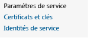

<properties linkid="provisioning-biztalk-service" urlDisplayName="Provision BizTalk Services in management portal" pageTitle="Provision BizTalk Services in management portal | Azure" metaKeywords="Get started Azure biztalk services, provision, Azure unstructured data" description="Learn how to provision a BizTalk service in the Azure Management Portal, as well as create an optional SQL database server and Storage account." metaCanonical="http://www.windowsazure.com/en-us/manage/services/biztalk-services/provisioning-biztalk-service" services="biztalk-services" documentationCenter="" title="BizTalk Services: Provisioning Using Azure Management Portal" authors="mandia" solutions="" manager="paulettm" editor="cgronlun" />

BizTalk Services : approvisionnement à l'aide du portail de gestion Azure
=========================================================================

**Conseil**

Pour vous connecter au portail de gestion Azure, vous devez disposer d'un compte et d'un abonnement Azure. Si vous ne possédez pas de compte, vous pouvez créer un compte d'évaluation gratuit en quelques minutes. Pour plus d'informations, consultez la page [Version d'évaluation gratuite d'Azure](http://go.microsoft.com/fwlink/p/?LinkID=239738).

Un service Azure BizTalk est constitué des composants suivants :

<table data-morhtml="true" border="1">
<tr data-morhtml="true" bgcolor="FAF9F9">
        <td data-morhtml="true"><strong data-morhtml="true">Pr&eacute;requis</strong></td>
        <td data-morhtml="true"><strong data-morhtml="true">Description</strong></td>
</tr>
<tr data-morhtml="true">
<td data-morhtml="true">Abonnement Azure</td>
<td data-morhtml="true">
L'abonnement r&eacute;git l'acc&egrave;s au portail de gestion Azure et est cr&eacute;&eacute; par le titulaire du compte Azure sur la page <a data-morhtml="true" href="https://account.windowsazure.com/Subscriptions">Abonnements Azure</a>.

Le compte Azure peut avoir plusieurs abonnements et il peut &ecirc;tre g&eacute;r&eacute; par le titulaire du compte Azure, par diff&eacute;rentes personnes ou par diff&eacute;rents groupes. Par exemple, le titulaire de votre compte Azure cr&eacute;e un abonnement nomm&eacute; <em data-morhtml="true">BizTalkServiceSubscription</em> et donne aux administrateurs BizTalk de votre soci&eacute;t&eacute; (par exemple, ContosoBTSAdmins@live.com) acc&egrave;s &agrave; cet abonnement. Dans ce sc&eacute;nario, les administrateurs BizTalk se connectent au portail de gestion Azure et disposent des droits d'administrateur complets pour tous les services h&eacute;berg&eacute;s dans l'abonnement, y compris Azure BizTalk Services. Comme ils ne sont pas les titulaires du compte Azure, ils n'ont aucun acc&egrave;s aux informations de facturation.

La rubrique <a data-morhtml="true" href="http://go.microsoft.com/fwlink/p/?LinkID=267577">G&eacute;rer les abonnements et les comptes de stockage dans le portail de gestion Azure</a> fournit plus d'informations sur les abonnements et les comptes Azure.
</td>
</tr>
<tr data-morhtml="true">
<td data-morhtml="true">Base de donn&eacute;es SQL Azure</td>
<td data-morhtml="true">
Une base de donn&eacute;es SQL stocke les tables, les vues et les proc&eacute;dures stock&eacute;es utilis&eacute;es par Azure BizTalk Services.

Lorsque vous approvisionnez un service BizTalk, vous pouvez utiliser un serveur SQL Azure existant, une base de donn&eacute;es SQL Azure existante ou cr&eacute;er automatiquement un serveur ou une base de donn&eacute;es. Lorsque vous choisissez de cr&eacute;er un serveur et une base de donn&eacute;es SQL Azure, les services Azure sont automatiquement activ&eacute;s.

Si vous cr&eacute;ez une base de donn&eacute;es SQL Azure sur un serveur SQL Azure existant, les r&egrave;gles de pare-feu du serveur ne sont pas modifi&eacute;es. Il est donc possible que d'autres services Azure ne soient pas autoris&eacute;s &agrave; acc&eacute;der aux bases de donn&eacute;es du serveur.

Il n'y a pas d'exigences de mise &agrave; l'&eacute;chelle minimales pour les param&egrave;tres de base de donn&eacute;es SQL.</td>
</tr>
<tr data-morhtml="true">
<td data-morhtml="true">Espace de noms de contr&ocirc;le d'acc&egrave;s Azure</td>
<td data-morhtml="true">L'espace de noms de contr&ocirc;le d'acc&egrave;s s'authentifie aupr&egrave;s d'Azure BizTalk Services. Lorsque vous d&eacute;ployez un projet BizTalk Services &agrave; partir de Visual Studio, vous entrez cet espace de noms de contr&ocirc;le d'acc&egrave;s. Lorsque vous approvisionnez un service BizTalk, l'espace de noms de contr&ocirc;le d'acc&egrave;s est automatiquement cr&eacute;&eacute;.</td>
</tr>

<tr data-morhtml="true">
<td data-morhtml="true">Compte Azure Storage</td>
<td data-morhtml="true">
Le compte Azure Storage donne acc&egrave;s aux tables, aux objets blob et aux files d'attente. Lorsque vous approvisionnez un service BizTalk, vous pouvez utiliser un compte de stockage existant ou en cr&eacute;er un automatiquement. Votre service BizTalk utilise les tables, les objets blob et les files d'attente pour effectuer ce qui suit&nbsp;:

<ul data-morhtml="true">
<li data-morhtml="true">Les fichiers journaux qui surveillent le service BizTalk sont stock&eacute;s. La sortie de la surveillance s'affiche &eacute;galement dans l'onglet Surveillance du portail de gestion Azure.</li>
<li data-morhtml="true">Lors de la cr&eacute;ation d'un contrat&nbsp;X12 ou&nbsp;AS2 entre des partenaires, vous pouvez activer la fonctionnalit&eacute; d'archivage pour stocker les propri&eacute;t&eacute;s des messages. Ces donn&eacute;es de suivi sont enregistr&eacute;es dans ce compte de stockage.</li>
</ul>
</td>
</tr>

<tr data-morhtml="true">
<td data-morhtml="true">Certificat priv&eacute; SSL</td>
<td data-morhtml="true">
Lorsque vous approvisionnez Azure BizTalk Services, vous cr&eacute;ez une URL qui inclut le nom de votre service BizTalk. Ce certificat SSL priv&eacute; (.pfx) est utilis&eacute; en tant que certificat d'authentification du serveur HTTPS lorsque des requ&ecirc;tes sont envoy&eacute;es &agrave; l'URL de votre service BizTalk. Lorsque vous approvisionnez un service BizTalk, un certificat auto-sign&eacute; est automatiquement cr&eacute;&eacute;. 

<strong data-morhtml="true">Informations importantes sur le certificat SSL</strong>

<ul data-morhtml="true">
<li data-morhtml="true">La date d'expiration du certificat doit &ecirc;tre comprise dans les 5&nbsp;prochaines ann&eacute;es.</li>
<li data-morhtml="true">Tous les certificats priv&eacute;s exigent un mot de passe. Retenez ce mot de passe. Il est &eacute;galement recommand&eacute; de communiquer ce mot de passe &agrave; vos administrateurs.</li>
<li data-morhtml="true">Les certificats auto-sign&eacute;s peuvent &ecirc;tre utilis&eacute;s dans un environnement de test ou de d&eacute;veloppement. Lorsque vous utilisez des certificats auto-sign&eacute;s, importez le certificat dans votre magasin de certificats personnels et dans le magasin de certificats Autorit&eacute;s de certification racines de confiance.</li>
</ul>
 Lorsque vous envoyez la demande de certificat de production &agrave; votre autorit&eacute; de certification, sp&eacute;cifiez les propri&eacute;t&eacute;s de certificat suivantes&nbsp;:  

<ul data-morhtml="true">
<li data-morhtml="true">
<strong data-morhtml="true">Utilisation avanc&eacute;e de la cl&eacute;</strong>&nbsp;: des utilisations de cl&eacute;s d'authentification du serveur suppl&eacute;mentaires peuvent &ecirc;tre activ&eacute;es sur le certificat. Au minimum, Azure BizTalk Services exige l'authentification du serveur.
</li>
<li data-morhtml="true">
<strong data-morhtml="true">Nom commun</strong>&nbsp;: entrez le nom de domaine complet (FQDN) de votre URL Azure BizTalk Services, qui est cr&eacute;&eacute;e lorsque vous approvisionnez le service BizTalk &agrave; l'&eacute;tape <a data-morhtml="true" href="#BizTalk">Approvisionnement d'un service BizTalk Services</a> dans cette rubrique.

Vous devez donc conna&icirc;tre votre URL lorsque vous envoyez la demande de certificat &agrave; votre autorit&eacute; de certification. Un certificat nouveau ou diff&eacute;rent peut &ecirc;tre ajout&eacute; apr&egrave;s l'approvisionnement du service BizTalk.
</li>
</ul>
 
</td>
</tr>
</table>

Cette rubrique répertorie les étapes permettant d'approvisionner Azure BizTalk Services, y compris :

-   [Étape 1 : approvisionnement d'un service BizTalk](#BizTalk)
-   [Étape 2 : étapes postérieures à l'approvisionnement](#PostProv)
-   [Facultatif : création du serveur de base de données SQL](#SQLDB)
-   [Facultatif : création d'un compte de stockage](#Storage)

Étape 1 : approvisionnement d'un service BizTalk
------------------------------------------------

Le service BizTalk héberge vos applications Azure BizTalk Services. Lorsque vous approvisionnez un service BizTalk, l'espace de noms de contrôle d'accès et le certificat SSL auto-signé sont automatiquement créés. Vous pouvez choisir de créer une base de données SQL Azure et un compte de stockage. Après l'approvisionnement du service BizTalk, certaines de ces exigences peuvent être mises à jour.

Les étapes suivantes approvisionnent un nouveau service Azure BizTalk Services :

1.  Connectez-vous au [portail de gestion Azure](http://go.microsoft.com/fwlink/p/?LinkID=213885).

2.  En bas du volet de navigation, sélectionnez **+NEW** :

    

3.  Sélectionnez **APP SERVICES**, **BIZTALK SERVICE**, puis **CUSTOM CREATE** :

    

4.  Entrez les paramètres BizTalk Services suivants :

    <table data-morhtml="true" border="1">
 <tr data-morhtml="true">
 <td data-morhtml="true"><strong data-morhtml="true">BizTalk Service Name</strong></td>
 <td data-morhtml="true">Entrez un nom pour votre service BizTalk. &laquo;&nbsp;.biztalk.windows.net&nbsp;&raquo; est automatiquement ajout&eacute; au nom que vous entrez. L'URL obtenue est utilis&eacute;e pour acc&eacute;der &agrave; votre service BizTalk. Vous pouvez entrer n'importe quel nom, mais il est pr&eacute;f&eacute;rable d'&ecirc;tre sp&eacute;cifique. Voici quelques exemples&nbsp;:   <em data-morhtml="true">masoci&eacute;t&eacute;</em>.biztalk.windows.net  <em data-morhtml="true">masoci&eacute;t&eacute;monapplication</em>.biztalk.windows.net  <em data-morhtml="true">monapplication</em>.biztalk.windows.net
 </td>
 </tr>
 <tr data-morhtml="true">
 <td data-morhtml="true"><strong data-morhtml="true">Domain URL</strong></td>
 <td data-morhtml="true"><strong data-morhtml="true">Facultatif</strong>. Par d&eacute;faut, l'URL du domaine est <em data-morhtml="true">YourBizTalkServiceName</em>.biztalk.windows.net. Un domaine personnalis&eacute; peut &eacute;galement &ecirc;tre entr&eacute;. Par exemple, si votre domaine est <em data-morhtml="true">contoso</em>, vous pouvez entrer&nbsp;:    <em data-morhtml="true">MaSoci&eacute;t&eacute;</em>.contoso.com  <em data-morhtml="true">MaSoci&eacute;t&eacute;MonApplication</em>.contoso.com  <em data-morhtml="true">MonApplication</em>.contoso.com  <em data-morhtml="true">NomDeVotreServiceBizTalkService</em>.contoso.com 
 </td>
 </tr>
 <tr data-morhtml="true">
 <td data-morhtml="true"><strong data-morhtml="true">&Eacute;dition</strong></td>
 <td data-morhtml="true">Les options incluent&nbsp;:
 <ul data-morhtml="true">
 <li data-morhtml="true">D&eacute;veloppeur</li>
 <li data-morhtml="true">Standard</li>
 <li data-morhtml="true">De base</li>
 <li data-morhtml="true">Premium</li>
 </ul>
 <a data-morhtml="true" href="http://go.microsoft.com/fwlink/p/?LinkID=302279">BizTalk Services&nbsp;: Tableau comparatif des &eacute;ditions D&eacute;veloppeur, De base, Standard, et Premium</a> r&eacute;pertorie les diff&eacute;rences entre les &eacute;ditions. Si vous &ecirc;tes en phase de test ou de d&eacute;veloppement, choisissez <strong data-morhtml="true">D&eacute;veloppeur</strong>. Si vous &ecirc;tes en phase de production, utilisez le tableau comparatif pour d&eacute;terminer si Premium, Standard ou De base est le bon choix pour votre sc&eacute;nario commercial.
 </td>
 </tr>
 <tr data-morhtml="true">
 <td data-morhtml="true"><strong data-morhtml="true">R&eacute;gion</strong></td>
 <td data-morhtml="true">S&eacute;lectionnez la r&eacute;gion g&eacute;ographique dans laquelle h&eacute;berger votre service BizTalk.</td>
 </tr>
 <tr data-morhtml="true">
 <td data-morhtml="true"><strong data-morhtml="true">Base de donn&eacute;es des suivis</strong></td>
 <td data-morhtml="true">
S&eacute;lectionnez votre base de donn&eacute;es SQL pour stocker les tables utilis&eacute;es par votre service BizTalk. Choisissez parmi les options suivantes&nbsp;:

 <ul data-morhtml="true">
 <li data-morhtml="true"><strong data-morhtml="true">Use an existing SQL Database instance</strong>&nbsp;: s&eacute;lectionnez cette option pour utiliser une base de donn&eacute;es SQL Azure existante. Cette derni&egrave;re peut &ecirc;tre utilis&eacute;e si elle n'est pas utilis&eacute;e par un autre service BizTalk. Vous devez disposer de l'identifiant et du mot de passe sp&eacute;cifi&eacute;s lors de la cr&eacute;ation de ce serveur de base de donn&eacute;es SQL Azure.</li>
 <li data-morhtml="true">
<strong data-morhtml="true">Create a new SQL Database instance</strong>&nbsp;: s&eacute;lectionnez cette option pour cr&eacute;er une base de donn&eacute;es SQL.
</li>
 
<strong data-morhtml="true">Remarque</strong>

 
Lorsque vous cr&eacute;ez une base de donn&eacute;es et un serveur SQL Azure, les services Azure sont automatiquement activ&eacute;s sur la base de donn&eacute;es SQL. Le service BizTalk exige que les services Azure soient activ&eacute;s sur la base de donn&eacute;es SQL Azure.

 
<strong data-morhtml="true">Conseil</strong>

 Cr&eacute;ez la base de donn&eacute;es des suivis et le compte de stockage de surveillance ou d'archive dans la m&ecirc;me r&eacute;gion que le service BizTalk.
 </ul>
 </td>
 </tr>
 <tr data-morhtml="true">
 <td data-morhtml="true"><strong data-morhtml="true">Abonnement</strong></td>
 <td data-morhtml="true"><strong data-morhtml="true">Facultatif</strong>. Disponible uniquement s'il y a plusieurs abonnements. S&eacute;lectionnez votre abonnement pour h&eacute;berger votre service BizTalk.</td>
 </tr>
 </table>

    Sélectionnez la flèche SUIVANT.

5.  Entrez les paramètres de la base de données :

     <table data-morhtml="true" border="1">
 <tr data-morhtml="true">
 <td data-morhtml="true"><strong data-morhtml="true">Abonnement</strong></td>
 <td data-morhtml="true"><strong data-morhtml="true">Facultatif</strong>. Disponible uniquement s'il y a plusieurs abonnements. S&eacute;lectionnez votre abonnement pour h&eacute;berger la base de donn&eacute;es SQL Azure.</td>
 </tr>
 <tr data-morhtml="true">
 <td data-morhtml="true"><strong data-morhtml="true">Base de donn&eacute;es</strong></td>
 <td data-morhtml="true">
Disponible lorsque l'option <strong data-morhtml="true">Use an existing SQL Database instance</strong> est s&eacute;lectionn&eacute;e dans l'&eacute;cran pr&eacute;c&eacute;dent.

 S&eacute;lectionnez votre base de donn&eacute;es SQL pour stocker les tables utilis&eacute;es par votre service BizTalk.
 </td>
 </tr>
 <tr data-morhtml="true">
 <td data-morhtml="true"><strong data-morhtml="true">Nom</strong></td>
 <td data-morhtml="true">
Disponible lorsque l'option <strong data-morhtml="true">Create a new SQL Database instance</strong> est s&eacute;lectionn&eacute;e dans l'&eacute;cran pr&eacute;c&eacute;dent.

 Entrez le nom de la base de donn&eacute;es SQL que votre service BizTalk doit utiliser. Par d&eacute;faut, <em data-morhtml="true">NomDeVotreServiceBizTalkService</em>_db est entr&eacute;.</td>
 </tr>
 <tr data-morhtml="true">
 <td data-morhtml="true"><strong data-morhtml="true">Serveur</strong></td>
 <td data-morhtml="true">
Disponible lorsque l'option <strong data-morhtml="true">Create a new SQL Database instance</strong> est s&eacute;lectionn&eacute;e dans l'&eacute;cran pr&eacute;c&eacute;dent.

 S&eacute;lectionnez un serveur de base de donn&eacute;es SQL existant. Sinon, s&eacute;lectionnez <strong data-morhtml="true">New SQL database server</strong> pour cr&eacute;er un serveur de base de donn&eacute;es SQL.</td>
 </tr>
 <tr data-morhtml="true">
 <td data-morhtml="true"><strong data-morhtml="true">Server Login Name</strong></td>
 <td data-morhtml="true">Entrez le nom d'utilisateur de connexion.</td>
 </tr>
 <tr data-morhtml="true">
 <td data-morhtml="true"><strong data-morhtml="true">Server Login Password</strong></td>
 <td data-morhtml="true">Entrez le mot de passe de connexion.</td>
 </tr>
 <tr data-morhtml="true">
 <td data-morhtml="true"><strong data-morhtml="true">R&eacute;gion</strong></td>
 <td data-morhtml="true">Disponible lorsque l'option <strong data-morhtml="true">Create a new SQL Database instance</strong> est s&eacute;lectionn&eacute;e. S&eacute;lectionnez la r&eacute;gion g&eacute;ographique dans laquelle h&eacute;berger votre base de donn&eacute;es SQL.</td>
 </tr>
 </table>

    Sélectionnez la flèche SUIVANT.

6.  Entrez les paramètres de surveillance Azure :

 <table data-morhtml="true" border="1">
 <tr data-morhtml="true">
 <td data-morhtml="true"><strong data-morhtml="true">Monitoring/Archiving Storage Account</strong></td>
 <td data-morhtml="true">S&eacute;lectionnez un compte de stockage existant ou s&eacute;lectionnez <strong data-morhtml="true">Cr&eacute;er un nouveau compte de stockage</strong>.</td>
 </tr><tr data-morhtml="true">
 <td data-morhtml="true"><strong data-morhtml="true">Nom du compte de stockage</strong></td>
 <td data-morhtml="true">Disponible lorsque l'option <strong data-morhtml="true">Cr&eacute;er un nouveau compte de stockage</strong> est s&eacute;lectionn&eacute;e. Entrez un nom pour le compte de stockage utilis&eacute; par votre service BizTalk.</td>
 </tr>
 </table>

Cliquez sur la coche pour terminer l'Assistant. Une fois que vous avez terminé, l'icône d'avancement affiche :

Une fois que vous avez terminé, un service Azure BizTalk est approvisionné et prêt pour vos applications.

Les paramètres par défaut sont suffisants. Si vous souhaitez modifier les paramètres par défaut, sélectionnez **BIZTALK SERVICES** dans le volet de navigation gauche, puis sélectionnez votre service BizTalk. Des paramètres supplémentaires sont affichés dans les onglets Tableau de bord, Surveiller et Mettre à l'échelle.

Selon l'état du service BizTalk, certaines opérations ne peuvent pas être effectuées. Pour en obtenir la liste, consultez la page [BizTalk Services : Tableau comparatif des états du service BizTalk](http://go.microsoft.com/fwlink/p/?LinkID=329870).

Étape 2 : étapes postérieures à l'approvisionnement
---------------------------------------------------

Cette section répertorie les étapes suivantes :

-   [Ajout d'un certificat privé](#AddCert)
-   [Récupération d'un espace de noms de contrôle d'accès](#ACS)

#### Ajout d'un certificat privé

Lorsque vous approvisionnez un service Azure BizTalk, une URL qui inclut son nom est créée. Un certificat SSL privé (.pfx) est utilisé en tant que certificat d'authentification du serveur HTTPS lorsque des requêtes sont envoyées à l'URL de votre service BizTalk.

Un certificat auto-signé est créé automatiquement pour votre service BizTalk. Celui-ci peut être téléchargé ou remplacé sur le tableau de bord du service BizTalk. Les certificats auto-signés sont utilisés dans les environnements de développement.

Pour ajouter un certificat prêt pour la production :

1.  Connectez-vous au [portail de gestion Azure](http://go.microsoft.com/fwlink/p/?LinkID=213885).
2.  Sélectionnez **BIZTALK SERVICES** dans le volet de navigation gauche, puis votre service BizTalk.
3.  Sélectionnez l'onglet **Tableau de bord**.
4.  Sélectionnez **Update SSL Certificate** :
	

5.  Accédez à votre certificat SSL privé (*NomCertificat*.pfx) qui inclut le nom de votre service BizTalk, puis entrez le mot de passe et cliquez sur la coche.

#### Récupération d'un espace de noms de contrôle d'accès

L'espace de noms de contrôle d'accès s'authentifie auprès d'Azure BizTalk Services. Lorsque vous déployez un projet BizTalk Services à partir de Visual Studio, vous entrez cet espace de noms de contrôle d'accès.

L'espace de noms de contrôle d'accès est automatiquement créé pour votre service BizTalk. Pour récupérer l'espace de noms de contrôle d'accès, l'émetteur par défaut et sa clé, sélectionnez le bouton **Informations de connexion** sur le tableau de bord du service BizTalk.

Pour récupérer l'espace de noms de contrôle d'accès :

1.  Connectez-vous au [portail de gestion Azure](http://go.microsoft.com/fwlink/p/?LinkID=213885).
2.  Sélectionnez **BIZTALK SERVICES** dans le volet de navigation gauche, puis votre service BizTalk.
3.  Dans la barre des tâches, sélectionnez **Informations de connexion** :

	

Vous pouvez copier-coller les valeurs de contrôle d'accès.

Lorsque l'espace de noms de contrôle d'accès est créé, les valeurs correspondantes peuvent être utilisées avec n'importe quelle application. Lorsqu'Azure BizTalk Services est approvisionné, cet espace de noms de contrôle d'accès contrôle l'authentification avec votre déploiement de service BizTalk. Si vous souhaitez modifier l'abonnement ou gérer l'espace de noms, sélectionnez **ACTIVE DIRECTORY** dans le volet de navigation gauche, puis votre espace de noms. Le volet de navigation inférieur répertorie vos options.

Cliquez sur **Manage** pour ouvrir le portail de gestion de contrôle d'accès. Dans ce dernier, le service BizTalk utilise **Identités de service** :
 

L'identité de service de contrôle d'accès est un ensemble d'informations d'identification qui permet aux applications ou aux clients de s'authentifier directement auprès du contrôle d'accès et de recevoir un jeton.

**Important**
 Le service BizTalk utilise **Propriétaire** comme identité de service par défaut et la valeur **Mot de passe**. Si vous utilisez la valeur Clé symétrique plutôt que la valeur Mot de passe, l'erreur suivante peut se produire :

*Impossible de se connecter au compte de service de gestion de contrôle d'accès avec les informations d'identification spécifiées.*

La rubrique [Gestion de votre espace de noms ACS](http://go.microsoft.com/fwlink/p/?LinkID=285670) répertorie quelques instructions et recommandations.

Facultatif : création du serveur de base de données SQL
-------------------------------------------------------

Lorsque vous approvisionnez un service Azure BizTalk Services, un serveur de base de données SQL est automatiquement créé. Si vous préférez créer un serveur de base de données SQL indépendant du service BizTalk, consultez la page [Utilisation d'une base de données SQL Azure dans des applications .NET](http://go.microsoft.com/fwlink/p/?LinkID=251285).

À la fin, une nouvelle base de données SQL Azure à laquelle vous pouvez vous connecter est créée. Elle vous sert à créer des tables, des vues et des procédures stockées.

Par défaut, la mise à l'échelle de la base de données SQL est configurée avec ce qui suit :

-   Édition Web
-   Taille de base de données de 1 Go

La configuration par défaut est suffisante pour un service BizTalk. Si vous souhaitez modifier les paramètres de configuration de mise à l'échelle, sélectionnez **Bases de données SQL** dans le volet de navigation gauche, double-cliquez sur votre base de données SQL, puis sélectionnez l'onglet **Configurer**. La modification de la mise à l'échelle peut avoir des conséquences sur la tarification. La rubrique [Comptes et facturation dans la base de données SQL Azure](http://go.microsoft.com/fwlink/p/?LinkID=234930) fournit des informations sur les éditions et la facturation.

Facultatif : création d'un compte de stockage
---------------------------------------------

Lorsque vous approvisionnez un service Azure BizTalk Services, un compte de stockage Azure est automatiquement créé. Si vous préférez créer un compte de stockage Azure indépendant du service BizTalk, consultez la page [Création d'un compte de stockage](http://go.microsoft.com/fwlink/p/?LinkID=279823).

À la fin, un nouveau compte de stockage Azure vous donne accès aux tables, aux objets blob et aux files d'attente.

Les paramètres par défaut sont suffisants pour un service BizTalk. Si vous souhaitez modifier les paramètres par défaut, sélectionnez **STORAGE** dans le volet de navigation gauche, puis sélectionnez votre compte de stockage. Les paramètres sont affichés dans les onglets Tableau de bord, Surveiller, Configurer et Conteneurs.

Lorsque vous créez un compte de stockage, une clé primaire et une clé secondaire sont automatiquement créées. Ces clés contrôlent l'accès à votre compte de stockage. Le service BizTalk utilise automatiquement la clé primaire.

La rubrique [Stockage](http://go.microsoft.com/fwlink/p/?LinkID=285671) fournit des informations sur votre compte de stockage.

Suivant
-------

Maintenant qu'un service BizTalk est approvisionné, vous pouvez découvrir les différents onglets sur la page [Onglets Tableau de bord, Surveiller et Mettre à l'échelle dans BizTalk Services](http://go.microsoft.com/fwlink/p/?LinkID=302281). Votre service BizTalk est prêt pour vos applications. Pour commencer à créer des applications, consultez la page [Azure BizTalk Services](http://go.microsoft.com/fwlink/p/?LinkID=235197).

Voir aussi
----------

-   [BizTalk Services : Tableau comparatif des éditions Développeur, De base, Standard, et Premium](http://go.microsoft.com/fwlink/p/?LinkID=302279)
-   [BizTalk Services : Tableau comparatif des états du service BizTalk](http://go.microsoft.com/fwlink/p/?LinkID=329870)
-   [BizTalk Services : Sauvegarde et restauration](http://go.microsoft.com/fwlink/p/?LinkID=329873)
-   [BizTalk Services : Limitation](http://go.microsoft.com/fwlink/p/?LinkID=302282)
-   [BizTalk Services : Nom et clé de l'émetteur](http://go.microsoft.com/fwlink/p/?LinkID=303941)
-   [Utilisation du Kit de développement logiciel (SDK) Azure BizTalk Services](http://go.microsoft.com/fwlink/p/?LinkID=302335)

