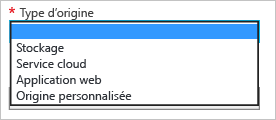

<properties 
	 pageTitle="Comment activer le réseau de distribution de contenu (CDN) pour Azure" 
	 description="Cette rubrique montre comment activer le réseau de distribution de contenu (CDN) pour Azure." 
	 services="cdn" 
	 documentationCenter="" 
	 authors="camsoper" 
	 manager="dwrede" 
	 editor=""/>
<tags 
	 ms.service="cdn" 
	 ms.workload="media" 
	 ms.tgt_pltfrm="na" 
	 ms.devlang="na" 
	 ms.topic="article" 
	 ms.date="12/02/2015" 
	 ms.author="casoper"/>

#Comment activer le réseau de distribution de contenu (CDN) pour Azure  

CDN peut être activé pour votre origine via le portail de gestion Azure. Plusieurs types d'origines Azure intégrées sont pris en charge, y compris les applications web, le stockage d'objets blob et les services cloud. Vous pouvez également activer CDN pour votre point de terminaison de diffusion en continu d’Azure Media Services. Si votre origine n'est pas l'un de ces services Azure, ou si elle est hébergée en dehors d'Azure, vous pouvez également créer une origine personnalisée. Dès que vous activez un point de terminaison CDN pour votre origine, tous les objets disponibles publiquement peuvent bénéficier de la mise en cache de proximité CDN.

## Créer un profil CDN

Un profil CDN est une collection de points de terminaison CDN. Chaque profil contient un ou plusieurs points de terminaison CDN. Vous pouvez utiliser plusieurs profils pour organiser vos points de terminaison CDN par domaine Internet, application web ou d'autres critères.

> [AZURE.NOTE]Un abonnement Azure unique est limité à quatre profils CDN. Chaque profil CDN est limité à quatre points de terminaison CDN.
>
> La tarification CDN est appliquée au niveau du profil CDN. Si vous souhaitez utiliser une combinaison de fonctionnalités CDN Standard et Premium, vous aurez besoin de plusieurs profils CDN.

**Pour créer un profil CDN**

1. Dans le [portail de gestion Azure](https://portal.azure.com), cliquez sur **Nouveau** dans l’angle supérieur gauche. Dans le panneau **Nouveau**, sélectionnez **Médias + CDN**, puis **CDN**.

    Le panneau du nouveau profil CDN s'affiche.
    
    ![Nouveau profil CDN][new-cdn-profile]

2. Entrez un nom pour votre profil CDN.

3. Sélectionnez un **niveau tarifaire** ou utilisez la valeur par défaut.

4. Sélectionnez ou créez un **groupe de ressources**. Pour plus d’informations sur les groupes de ressources, consultez [Vue d’ensemble d’Azure Resource Manager](resource-group-overview/#resource-groups).

5. Sélectionnez l’**abonnement** pour ce profil CDN.

6. Sélectionnez un **emplacement**. Il s'agit de l'emplacement Azure où seront stockées les informations de votre profil CDN. Cela n'a aucun impact sur les emplacements de point de terminaison CDN. Il n'est pas nécessaire que ce soit le même emplacement que celui du compte de stockage.

7. Cliquez sur le bouton **Créer** pour créer le profil.

## Créer un point de terminaison CDN

**Pour créer un point de terminaison CDN pour votre compte de stockage**

1. Dans le [portail de gestion Azure](https://portal.azure.com), accédez à votre profil CDN. Vous l'avez peut-être épinglé au tableau de bord à l'étape précédente. S’il est introuvable, vous le trouverez en cliquant sur **Parcourir**, sur **Profils CDN** et sur le profil auquel vous voulez ajouter le point de terminaison.

    Le panneau du profil CDN s'affiche.
    
    ![Profil CDN][cdn-profile-settings]
    
2. Cliquez sur le bouton **Ajouter un point de terminaison**.

    ![Bouton Ajouter un point de terminaison][cdn-new-endpoint-button]

    Le panneau **Ajouter un point de terminaison** s’affiche.
    
    ![Panneau Ajouter un point de terminaison][cdn-add-endpoint]

3. Entrez un **nom** pour ce point de terminaison CDN. Ce nom servira à accéder à vos ressources en cache au niveau du domaine `<EndpointName>.azureedge.net`.

4. Dans la liste déroulante **Type d’origine**, sélectionnez votre type d’origine.
	
	

5. Dans la liste déroulante **Nom d’hôte d’origine**, sélectionnez ou tapez votre domaine d’origine. La liste déroulante répertorie toutes les origines disponibles du type spécifié à l'étape 4. Si vous avez sélectionné *Origine personnalisée* comme **type d’origine**, tapez le domaine de votre origine personnalisée.

6. Dans la zone de texte **Chemin d’accès d’origine**, entrez le chemin d’accès aux ressources que vous souhaitez mettre en cache ou laissez cette zone vide pour autoriser la mise en cache de n’importe quelle ressource au niveau du domaine spécifié à l’étape 5.

7. Dans **En-tête de l’hôte d’origine**, entrez l’en-tête de l’hôte que le CDN doit envoyer avec chaque requête ou conservez la valeur par défaut.

8. Pour **Protocole** et **Port d’origine**, spécifiez les protocoles et les ports utilisés pour accéder à vos ressources à l’origine. Vos clients continueront à utiliser ces mêmes protocoles et ports lorsqu'ils accèdent aux ressources sur le CDN. Vous devez sélectionner au moins un protocole (HTTP ou HTTPS).

9. Cliquez sur le bouton **Ajouter** pour créer le point de terminaison.

10. Une fois le point de terminaison créé, il s'affiche dans la liste des points de terminaison pour le profil. L’affichage sous forme de liste montre l’URL à utiliser pour accéder au contenu mis en cache et le domaine d’origine.

    ![Point de terminaison CDN][cdn-endpoint-success]

    > [AZURE.NOTE]Le point de terminaison ne sera pas immédiatement disponible pour utilisation. La propagation de l'inscription à travers le réseau CDN peut prendre jusqu'à 90 minutes. Les utilisateurs qui tentent d'utiliser immédiatement le nom de domaine CDN peuvent recevoir le code d'état 404 jusqu'à ce que le contenu soit disponible via le CDN.

##Voir aussi
- [Comment mapper le contenu du réseau de distribution de contenu (CDN) à un domaine personnalisé](cdn-map-content-to-custom-domain.md)
- [Purger un point de terminaison CDN Azure](cdn-purge-endpoint.md)

[new-cdn-profile]: ./media/cdn-create-new-endpoint/cdn-new-profile.png
[cdn-profile-settings]: ./media/cdn-create-new-endpoint/cdn-profile-settings.png
[cdn-new-endpoint-button]: ./media/cdn-create-new-endpoint/cdn-new-endpoint-button.png
[cdn-add-endpoint]: ./media/cdn-create-new-endpoint/cdn-add-endpoint.png
[cdn-endpoint-success]: ./media/cdn-create-new-endpoint/cdn-endpoint-success.png
 

<!---HONumber=AcomDC_1210_2015-->