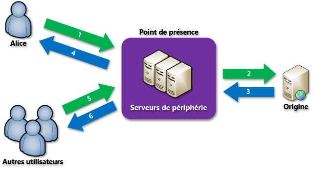

<properties
	pageTitle="Vue d’ensemble d’Azure CDN | Microsoft Azure"
	description="Découvrez le réseau de distribution de contenu (CDN) Azure et comment l'utiliser pour diffuser du contenu haut débit en mettant en cache les objets blob et le contenu statique."
	services="cdn"
	documentationCenter=""
	authors="camsoper"
	manager="erikre"
	editor=""/>

<tags
	ms.service="cdn"
	ms.workload="tbd"
	ms.tgt_pltfrm="na"
	ms.devlang="na"
	ms.topic="hero-article"
	ms.date="09/01/2016"
	ms.author="casoper"/>

# Vue d'ensemble du réseau de distribution de contenu (CDN) Azure

> [AZURE.NOTE] Ce document présente le réseau de distribution de contenu (CDN) d’Azure, son fonctionnement ainsi que les fonctionnalités de chaque produit Azure CDN. Si vous souhaitez ignorer ces informations et passer directement au didacticiel de création d’un point de terminaison CDN, voir [Utilisation d’Azure CDN](cdn-create-new-endpoint.md). Pour obtenir la liste actuelle des emplacements de nœuds CDN, consultez la page [Emplacements des points de présence CDN Azure](cdn-pop-locations.md).

Le réseau de distribution de contenu (CDN) Azure met en cache le contenu web statique à des emplacements stratégiques afin de fournir un débit maximal pour la distribution de contenu aux utilisateurs. Le CDN offre aux développeurs une solution globale pour la distribution de contenu haut débit en mettant en cache le contenu sur des nœuds physiques dans le monde entier.

Les avantages de l’utilisation du CDN pour mettre en cache les ressources de site web incluent :

- De meilleures performances et une expérience enrichie pour les utilisateurs finaux, en particulier ceux qui utilisent des applications ayant recours à de nombreux allers-retours pour charger le contenu.
- Une mise à grande échelle pour améliorer la gestion instantanée des charges importantes, par exemple au début de l'événement de lancement d'un produit.
- Si l’on répartit les requêtes utilisateur et que l’on diffuse du contenu à partir des serveurs Edge, le trafic transmis à l’origine est moins important.

## Fonctionnement

1. Un utilisateur (Alice) demande un fichier (également appelé ressource) à l’aide d’une URL avec un nom de domaine spécial, par exemple `<endpointname>.azureedge.net`. Le DNS achemine la demande à l’emplacement du point de présence (POP) le plus performant. Il s’agit en général du point de présence le plus proche géographiquement de l'utilisateur.

2. Si les serveurs Edge du point de présence ne disposent pas du fichier dans leur cache, le serveur Edge demande le fichier à l'origine. L'origine peut être une application web Azure, un service cloud Azure, un compte de stockage Azure ou n'importe quel serveur web accessible publiquement.

3. L'origine renvoie les fichiers sur le serveur Edge, notamment les en-têtes HTTP facultatifs décrivant la durée de vie du fichier.

4. Le serveur Edge met en cache le fichier et le renvoie au demandeur d'origine (Alice). Le fichier reste en cache sur le serveur Edge jusqu’à la fin de la durée de vie. Si l’origine n’a pas spécifié de durée de vie, elle est par défaut de 7 jours.

5. Des utilisateurs supplémentaires peuvent demander le même fichier à l’aide de la même URL et peuvent également être dirigés vers ce même point de présence.

6. Si la durée de vie du fichier n'a pas expiré, le serveur Edge renvoie le fichier à partir du cache. L’expérience utilisateur est en conséquence plus rapide et plus réactive.

## Fonctionnalités d’Azure CDN

Il existe trois produits Azure CDN : **Azure CDN Standard fourni par Akamai**, **Azure CDN Standard fourni par Verizon** et **Azure CDN Premium fourni par Verizon**. Le tableau suivant répertorie les fonctionnalités disponibles avec chaque produit.

| | Standard Akamai | Standard Verizon | Premium Verizon |
|-------|-----------------|------------------|-----------------|
| Intégration simple des services Azure tels que [Storage](cdn-create-a-storage-account-with-cdn.md), [Cloud Services](cdn-cloud-service-with-cdn.md), [Web Apps](../app-service-web/cdn-websites-with-cdn.md) et [Media Services](../media-services/media-services-manage-origins.md#enable_cdn) | **&#x2713;** | **&#x2713;** | **&#x2713;**|
| Gestion via [REST API](https://msdn.microsoft.com/library/mt634456.aspx), [.NET](./cdn-app-dev-net.md), [Node.js](./cdn-app-dev-node.md), ou [PowerShell](./cdn-manage-powershell.md). | **&#x2713;** | **&#x2713;** | **&#x2713;** |
| Prise en charge de HTTPS | **&#x2713;** | **&#x2713;** | **&#x2713;** |
| Équilibrage de la charge | **&#x2713;** | **&#x2713;** | **&#x2713;** |
| Protection [DDOS](https://www.us-cert.gov/ncas/tips/ST04-015) | **&#x2713;** | **&#x2713;** | **&#x2713;** |
| Double pile IPv4/IPv6 | **&#x2713;** | **&#x2713;** | **&#x2713;** |
| [Prise en charge du nom de domaine personnalisé](cdn-map-content-to-custom-domain.md) | **&#x2713;** | **&#x2713;** | **&#x2713;** |
| [Mise en cache des chaînes de requête](cdn-query-string.md) | **&#x2713;** | **&#x2713;** | **&#x2713;** |
| [Filtrage par pays](cdn-restrict-access-by-country.md) | | **&#x2713;** | **&#x2713;** |
| [Purge rapide](cdn-purge-endpoint.md) | **&#x2713;** | **&#x2713;** | **&#x2713;** |
| [Préchargement de ressources](cdn-preload-endpoint.md) | | **&#x2713;** | **&#x2713;** |
| [Analyse principale](cdn-analyze-usage-patterns.md) | | **&#x2713;** | **&#x2713;** |
| [Assistance HTTP/2](https://msdn.microsoft.com/library/mt762901.aspx) | **&#x2713;** | | |
| [Rapports HTTP avancés](cdn-advanced-http-reports.md) | | | **&#x2713;** |
| [Statistiques en temps réel](cdn-real-time-stats.md) | | | **&#x2713;** |
| [Alertes en temps réel](cdn-real-time-alerts.md) | | | **&#x2713;** |
| [Moteur de distribution de contenu personnalisable et basé sur des règles](cdn-rules-engine.md) | | | **&#x2713;** |
| Paramètres du cache/des en-têtes (à l’aide du [moteur de règles](cdn-rules-engine.md)) | | | **&#x2713;** |
| Redirection/réécriture d’URL (à l’aide du [moteur de règles](cdn-rules-engine.md)) | | | **&#x2713;** |
| Règles d’appareil mobile (à l’aide du [moteur de règles](cdn-rules-engine.md)) | | | **&#x2713;** |

>[AZURE.TIP] Une idée de fonctionnalité à ajouter à Azure CDN ? [Envoyez-nous vos commentaires](https://feedback.azure.com/forums/169397-cdn) !

## Étapes suivantes

Pour une prise en main du CDN, consultez [Utilisation d’Azure CDN](./cdn-create-new-endpoint.md).

Si vous êtes un client CDN existant, vous pouvez désormais gérer vos points de terminaison CDN via le [portail Microsoft Azure](https://portal.azure.com) ou avec [PowerShell](cdn-manage-powershell.md).

Pour voir le CDN à l’œuvre, regardez la [vidéo de notre session Build 2016](https://azure.microsoft.com/documentation/videos/build-2016-leveraging-the-new-azure-cdn-apis-to-build-wicked-fast-applications/).

Apprenez à automatiser Azure CDN avec [.NET](./cdn-app-dev-net.md) ou [Node.js](./cdn-app-dev-node.md).

Pour obtenir des informations sur la tarification, consultez la page [Prix appliqués au Réseau de distribution de contenu (CDN)](https://azure.microsoft.com/pricing/details/cdn/).

<!---HONumber=AcomDC_0907_2016-->