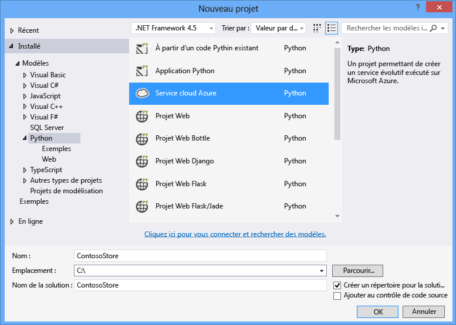
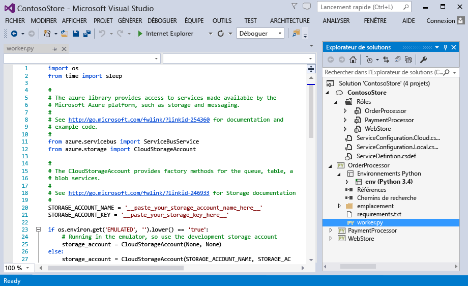
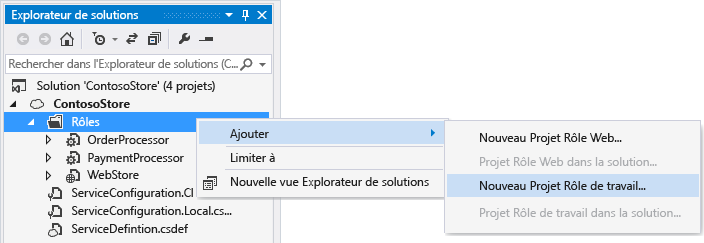
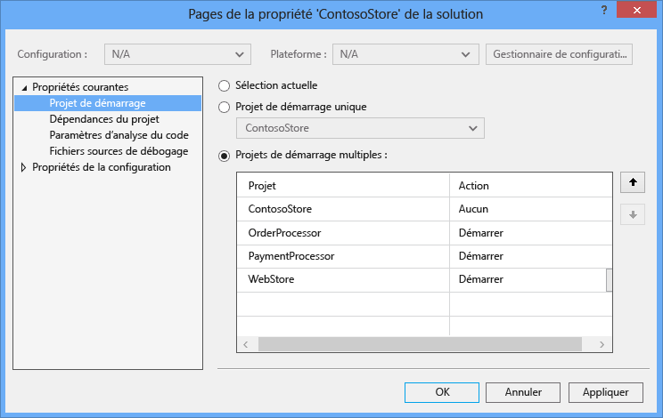
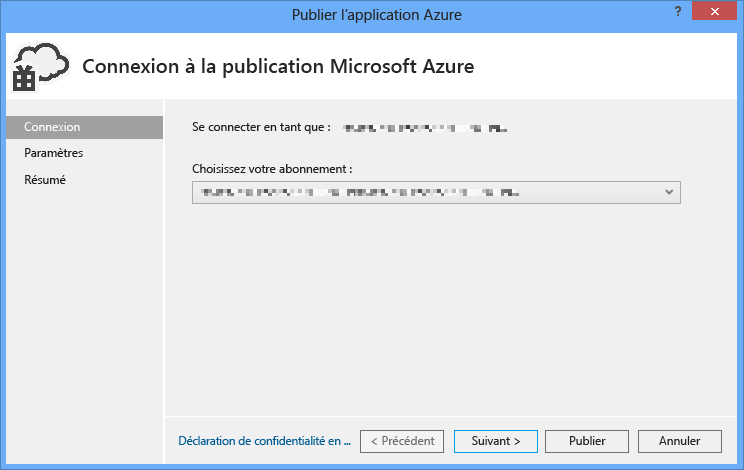
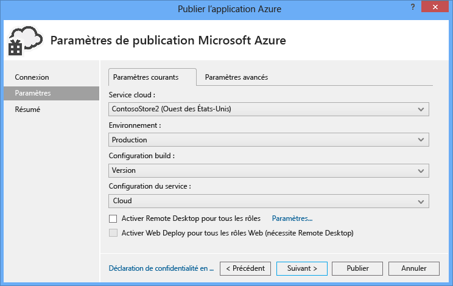
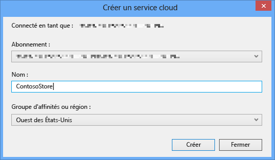
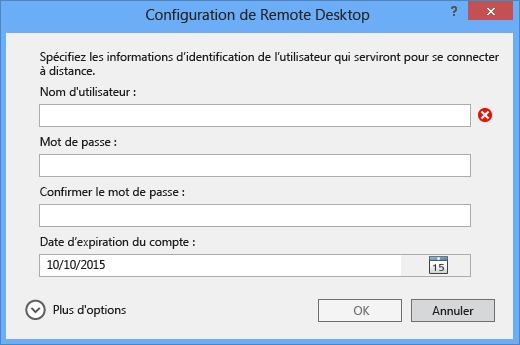
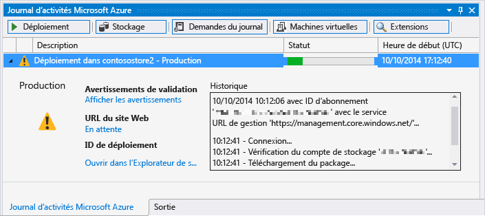

<properties
	pageTitle="Rôles web et rôles de travail Python avec Python Tools 2.2 pour Visual Studio | Microsoft Azure"
	description="Présentation des outils Python pour Visual Studio pour la création de services cloud Azure comprenant des rôles web et de travail."
	services="cloud-services"
	documentationCenter="python"
	authors="thraka"
	manager="wpickett"
	editor=""/>

<tags
	ms.service="cloud-services"
	ms.workload="tbd"
	ms.tgt_pltfrm="na"
	ms.devlang="python"
	ms.topic="hero-article"
	ms.date="08/30/2015"
	ms.author="adegeo"/>

# Rôles web et rôles de travail Python avec Python Tools 2.2 pour Visual Studio

Cet article fournit un aperçu de l'utilisation des rôles web et de travail Python avec [Python Tools pour Visual Studio][].

## Composants requis

 - Visual Studio 2013 ou 2015
 - [Python Tools 2.2 pour Visual Studio][] (PTVS)
 - [Outils du Kit de développement logiciel (SDK) Azure pour Visual Studio 2013][] ou [Outils du Kit de développement logiciel (SDK) Azure pour Visual Studio 2015][]
 - [Python 2.7 32 bits][] ou [Python 3.4 32 bits][]

[AZURE.INCLUDE [create-account-and-websites-note](../includes/create-account-and-websites-note.md)]

## Présentation des rôles web et de travail Python

Azure propose trois modèles de calcul pour l'exécution d'applications : [fonctionnalité Web Apps dans Azure App Service][execution model-web sites], [Azure Virtual Machines][execution model-vms] et [Azure Cloud Services][execution model-cloud services]. Ils prennent tous les trois en charge Python. Cloud Services, qui inclut les rôles web et de travail, fournit *PaaS (Platform as a Service)*. Au sein d'un service cloud, un rôle web fournit un serveur web IIS (Internet Information Services) dédié permettant d'héberger des applications web frontales, tandis qu'un rôle de travail peut exécuter des tâches asynchrones, de longue durée ou perpétuelles indépendamment des interactions ou saisies des utilisateurs.

Pour plus d'informations, consultez la page [Présentation d'un service cloud].

> [AZURE.NOTE] *Vous voulez créer un simple site web ?* Si votre scénario ne comporte qu'un simple composant frontal web, envisagez d'utiliser la fonctionnalité Web Apps légère dans Azure App Service. Vous pouvez facilement passer à un service cloud en fonction de l'évolution de votre site et de vos besoins. Consultez le <a href="/develop/python/">Centre de développement Python</a> pour découvrir des articles consacrés au développement de la fonctionnalité Web Apps dans Azure App Service.  

## Création du projet

Dans Visual Studio, vous pouvez sélectionner **Service cloud Azure** dans la boîte de dialogue **Nouveau projet**, sous **Python**.

Dans l'Assistant Service Cloud Azure, vous pouvez créer les rôles web et de travail.

Le modèle de rôle de travail est fourni avec du code réutilisable permettant la connexion à un compte de stockage Azure ou à Azure Service Bus.

Vous pouvez ajouter des rôles web ou des rôles de travail quand vous le souhaitez à un service cloud existant. Vous pouvez choisir d'ajouter des projets existants à votre solution ou bien d'en créer de nouveaux.

Votre service cloud peut contenir des rôles dans différents langages. Par exemple, vous pouvez avoir un rôle web Python implémenté à l'aide de Django, avec des rôles de travail Python ou C#. Vous pouvez assurer la communication entre les rôles grâce aux files d'attente Service Bus ou aux files d'attente de stockage.

## Exécution en local

Si vous définissez votre projet de service cloud comme projet de démarrage et que vous appuyez sur F5, le service cloud s'exécute dans l'émulateur Azure local.

Bien que PTVS puisse être lancé dans l'émulateur, le débogage (points d'arrêt, par exemple) ne fonctionne pas.

Pour déboguer vos rôles web et vos rôles de travail, vous pouvez définir le projet de rôle comme projet de démarrage, et déboguer ce projet. Vous pouvez aussi définir plusieurs projets de démarrage. Cliquez avec le bouton droit sur la solution, puis sélectionnez **Définir comme projet de démarrage**.

## Publication dans Azure

Pour la publication, cliquez avec le bouton droit sur le projet de service cloud dans la solution, puis sélectionnez **Publier**.

Dans la page des paramètres, sélectionnez le service cloud sur lequel vous voulez publier.

Vous pouvez créer un service cloud si vous n'en avez pas déjà un.

Il est aussi utile d'activer les connexions Bureau à distance sur la ou les machines afin de pouvoir déboguer les problèmes.

Une fois que vous avez terminé la configuration des paramètres, cliquez sur **Publier**.

La progression s'affiche alors dans la fenêtre de résultat, puis vous verrez la fenêtre Journal des activités Microsoft Azure.

Le déploiement prend plusieurs minutes. Ensuite, vos rôles web et de travail sont exécutés sur Azure.

## Étapes suivantes

Pour plus d'informations sur l'utilisation des rôles web et de travail dans les outils Python pour Visual Studio, consultez la documentation PTVS :

- [Projets de service cloud][]

Pour plus de détails sur l'utilisation des services Azure à partir de vos rôles web et de travail, par exemple pour utiliser le stockage Azure ou Service Bus, consultez les articles suivants.

- [Service BLOB][]
- [Service de Table][]
- [Service de File d’attente][]
- [Files d’attente de Service Bus][]
- [Rubriques de Service Bus][]

<!--Link references-->

[Présentation d'un service cloud]: ./cloud-services/cloud-services-choose-me.md
[execution model-web sites]: ./app-service-web/app-service-web-overview.md
[execution model-vms]: ./virtual-machines/virtual-machines-windows-about.md
[execution model-cloud services]: ./cloud-services/cloud-services-choose-me.md
[Python Developer Center]: /develop/python/

[Service BLOB]: ./storage/storage-python-how-to-use-blob-storage.md
[Service de File d’attente]: ./storage/storage-python-how-to-use-queue-storage.md
[Service de Table]: ./storage/storage-python-how-to-use-table-storage.md
[Files d’attente de Service Bus]: ./service-bus/service-bus-python-how-to-use-queues.md
[Rubriques de Service Bus]: ./service-bus/service-bus-python-how-to-use-topics-subscriptions.md

<!--External Link references-->

[Python Tools pour Visual Studio]: http://aka.ms/ptvs
[Python Tools for Visual Studio Documentation]: http://aka.ms/ptvsdocs
[Projets de service cloud]: http://go.microsoft.com/fwlink/?LinkId=624028
[Python Tools 2.2 pour Visual Studio]: http://go.microsoft.com/fwlink/?LinkID=624025
[Outils du Kit de développement logiciel (SDK) Azure pour Visual Studio 2013]: http://go.microsoft.com/fwlink/?LinkId=323510
[Outils du Kit de développement logiciel (SDK) Azure pour Visual Studio 2015]: http://go.microsoft.com/fwlink/?LinkId=518003
[Python 2.7 32 bits]: http://go.microsoft.com/fwlink/?LinkId=517190
[Python 3.4 32 bits]: http://go.microsoft.com/fwlink/?LinkId=517191

<!---HONumber=AcomDC_0420_2016-->