# <a name="get-started-with-azure-cloud-services-and-aspnet"></a>Prise en main des services cloud Azure et d'ASP.NET

## <a name="overview"></a>Vue d'ensemble
Ce didacticiel explique comment créer une application .NET multiniveau avec un composant frontal ASP.NET MVC et comment la déployer sur un [service cloud Azure](cloud-services-choose-me.md). L’application utilise la [Base de données SQL Azure](http://msdn.microsoft.com/library/azure/ee336279), le [service Blob Azure](http://www.asp.net/aspnet/overview/developing-apps-with-windows-azure/building-real-world-cloud-apps-with-windows-azure/unstructured-blob-storage) et le [service de File d'attente Azure](http://www.asp.net/aspnet/overview/developing-apps-with-windows-azure/building-real-world-cloud-apps-with-windows-azure/queue-centric-work-pattern). Vous pouvez [télécharger le projet Visual Studio](http://code.msdn.microsoft.com/Simple-Azure-Cloud-Service-e01df2e4) dans la galerie de code MSDN.

Le didacticiel vous apprend à générer et à exécuter l’application localement, à la déployer dans Azure, à l’exécuter dans le cloud et à la générer intégralement. Vous pouvez également démarrer à partir de zéro, puis effectuer les tests et le déploiement par la suite.

## <a name="contoso-ads-application"></a>Application Contoso Ads
L'application est un panneau d'affichage publicitaire. Les utilisateurs créent une publicité en entrant du texte et en téléchargeant une image. Ils peuvent voir une liste de publicités avec des images en miniature qu’ils peuvent agrandir en sélectionnant la publicité de leur choix.

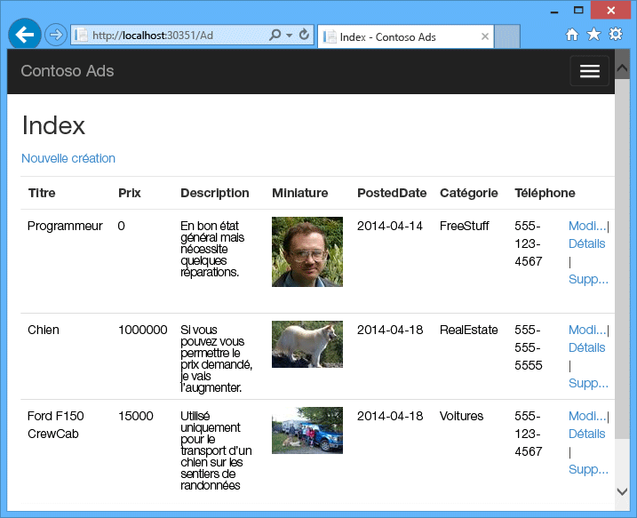

L'application utilise le [modèle de travail centré sur les files d'attente](http://www.asp.net/aspnet/overview/developing-apps-with-windows-azure/building-real-world-cloud-apps-with-windows-azure/queue-centric-work-pattern) pour décharger le travail de création de vignettes exigeant en ressources vers un processus principal.

## <a name="alternative-architecture-websites-and-webjobs"></a>Autre architecture : Sites Web et WebJobs
Ce didacticiel indique comment exécuter le composant frontal et le composant principal dans un service cloud Azure. Une alternative consiste à exécuter le composant frontal dans un [site web Azure](/services/web-sites/) et à utiliser la fonctionnalité [Tâches web](http://go.microsoft.com/fwlink/?LinkId=390226) (actuellement en version préliminaire) pour le composant principal. Pour un didacticiel qui utilise Tâches web, reportez-vous à la section [Prise en main du Kit de développement logiciel (SDK) Azure Tâches web](../app-service-web/websites-dotnet-webjobs-sdk-get-started.md). Pour plus d'informations sur le choix des meilleurs services pour votre scénario, reportez-vous à la rubrique [Comparaison entre Sites Web Azure, Azure Cloud Services et Azure Virtual Machines](../app-service-web/choose-web-site-cloud-service-vm.md).

## <a name="what-youll-learn"></a>Ce que vous allez apprendre
* configurer votre ordinateur pour le développement Azure en installant le Kit de développement logiciel (SDK) Azure ;
* créer un service de projet cloud Visual Studio avec un rôle web et un rôle de travail ASP.NET MVC ;
* tester localement le projet de service cloud en utilisant l'émulateur de stockage Azure ;
* publier le projet cloud dans un service cloud Azure et le tester avec un compte de stockage Azure ;
* télécharger des fichiers et les stocker dans le service Blob Azure ;
* utiliser le service de File d'attente Azure pour la communication entre tiers.

## <a name="prerequisites"></a>Composants requis
Pour utiliser ce didacticiel, vous devez maîtriser les [concepts de base des services cloud Azure](cloud-services-choose-me.md) et la terminologie afférente, par exemple les *rôles web* et *rôles de travail*.  Vous devez également savoir utiliser les projets [ASP.NET MVC](http://www.asp.net/mvc/tutorials/mvc-5/introduction/getting-started) ou [Web Forms](http://www.asp.net/web-forms/tutorials/aspnet-45/getting-started-with-aspnet-45-web-forms/introduction-and-overview) dans Visual Studio. L’exemple d’application utilise MVC, mais une grande part du didacticiel concerne également Web Forms.

Vous pouvez exécuter l’application localement sans abonnement Azure, mais il vous en faut un pour déployer l’application dans le cloud. Si vous n’avez pas de compte, vous pouvez [activer les avantages de votre abonnement MSDN](https://azure.microsoft.com/pricing/member-offers/msdn-benefits-details/?WT.mc_id=A55E3C668) ou [demander une évaluation gratuite](https://azure.microsoft.com/pricing/free-trial/?WT.mc_id=A55E3C668).

Les instructions du didacticiel sont valables pour les produits suivants :

* Visual Studio 2013
* Visual Studio 2015
* Visual Studio 2017

En l’absence d’un de ces produits, Visual Studio sera automatiquement installé à l’occasion de l’installation du kit de développement logiciel Azure.

## <a name="application-architecture"></a>Architecture de l'application
L'application stocke les publicités dans une base de données SQL et utilise Entity Framework Code First pour créer les tables et accéder aux données. Pour chaque publicité, la base de données stocke deux URL, une pour l’image à taille réelle et l’autre pour la miniature.

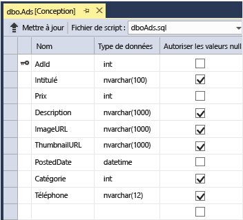

Lorsqu'un utilisateur télécharge une image, l'application frontale qui s'exécute dans un rôle web la stocke dans un [objet blob Azure](http://www.asp.net/aspnet/overview/developing-apps-with-windows-azure/building-real-world-cloud-apps-with-windows-azure/unstructured-blob-storage), et stocke les informations de la publicité dans la base de données avec une URL qui pointe vers l'objet blob. En même temps, il écrit un message dans une file d'attente Azure. Un processus principal qui s'exécute dans un rôle de travail interroge périodiquement la file d'attente pour connaître les nouveaux messages. Lorsqu'un nouveau message arrive, le rôle de travail crée une vignette pour cette image et met à jour le champ de la base de données des URL des vignettes pour cette publicité. Le diagramme suivant montre l'interaction des parties de l'application.

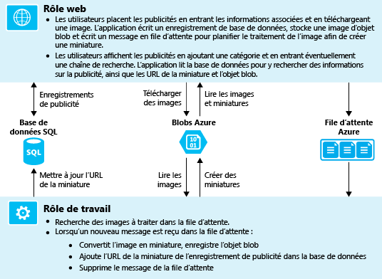

[!INCLUDE [install-sdk](../../includes/install-sdk-2017-2015-2013.md)]

## <a name="download-and-run-the-completed-solution"></a>Téléchargement et exécution de la solution terminée
1. Téléchargez et décompressez la [solution terminée](http://code.msdn.microsoft.com/Simple-Azure-Cloud-Service-e01df2e4).
2. Démarrez Visual Studio.
3. Dans le menu **Fichier**, choisissez **Ouvrir un projet**, accédez à l’emplacement où vous avez téléchargé la solution, puis ouvrez le fichier de solution.
4. Appuyez sur Ctrl+Maj+B pour générer la solution.

    Par défaut, Visual Studio restaure automatiquement le contenu du package NuGet, qui n'était pas inclus dans le fichier *.zip* . Si les packages ne sont pas restaurés, installez-les manuellement en ouvrant la boîte de dialogue **Gérer les packages NuGet pour la solution** et en cliquant sur le bouton **Restaurer** en haut à droite.
5. Dans **l’Explorateur de solutions**, assurez-vous que **ContosoAdsCloudService** est sélectionné comme projet de démarrage.
6. Si vous utilisez Visual Studio 2015 ou version ultérieure, modifiez la chaîne de connexion SQL Server dans le fichier d’application *Web.config* du projet ContosoAdsWeb et dans le fichier *ServiceConfiguration.Local.cscfg* du projet ContosoAdsCloudService. Dans tous les cas, changez « (localdb) \v11.0 » en « (localdb) \MSSQLLocalDB ».
7. Appuyez sur Ctrl+F5 pour exécuter l’application.

    Lorsque vous exécutez un projet de service cloud localement, Visual Studio appelle automatiquement *l’émulateur de calcul* Azure et *l’émulateur de stockage* Azure. L'émulateur de calcul utilise les ressources de votre ordinateur pour simuler les environnements de rôle Web et de rôle de travail. L'émulateur de stockage utilise une base de données [SQL Server Express LocalDB](http://msdn.microsoft.com/library/hh510202.aspx) pour simuler le stockage sur le cloud Azure.

    À la première exécution d'un projet de service cloud, le démarrage des émulateurs prend une ou deux minutes. Après le démarrage de l'émulateur, le navigateur par défaut s'ouvre sur la page d'accueil de l'application.

    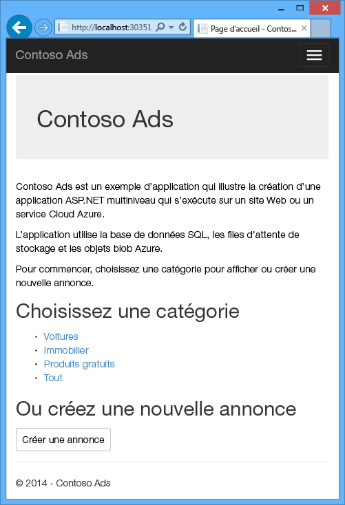
8. Cliquez sur **Créer une publicité**.
9. Entrez des données de test et sélectionnez une image *.jpg* à télécharger, puis cliquez sur **Créer**.

    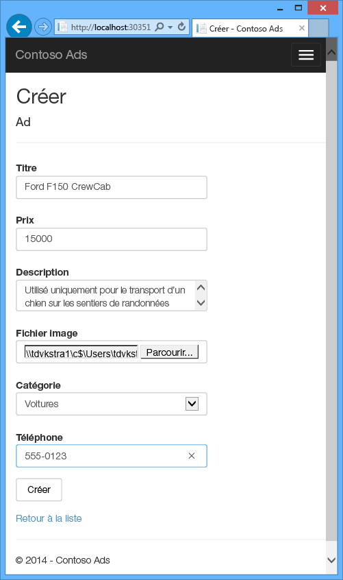

    L’application ouvre la page Index, mais n’affiche pas de miniature pour la nouvelle publicité, car le processus n’a pas encore eu lieu.
10. Attendez un instant, puis actualisez la page Index pour afficher la vignette.

     
11. Cliquez sur l'option **Détails** de votre publicité pour afficher l'image intégrale.

     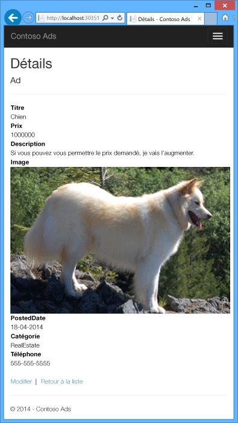

Vous avez exécuté l'application intégralement sur l'ordinateur local, sans connexion au cloud. L'émulateur de stockage stocke la file d'attente et les données blob dans une base de données SQL Server Express LocalDB, et l'application stocke les données de la publicité dans une autre base de données LocalDB. Entity Framework Code First crée automatiquement la base de données de publicités lorsque l'application web essaie pour la première fois d'y accéder.

Dans la section suivante, vous allez configurer la solution pour utiliser les ressources de cloud Azure pour les files d'attente, les objets blob et la base de données d'application lorsqu'elle est exécutée dans le cloud. Si vous souhaitiez continuer à l’exécuter localement, mais utiliser des ressources de stockage cloud et de base de données, vous pourriez le faire. Il suffit de définir des chaînes de connexion, ce que nous allez apprendre à faire.

## <a name="deploy-the-application-to-azure"></a>Déploiement de l'application dans Azure
Pour exécuter l'application dans le cloud, procédez comme suit :

* Créez un service cloud Azure.
* Créez une base de données SQL Azure.
* Créez un compte de stockage Azure.
* Configurez la solution pour utiliser votre base de données SQL Azure lorsqu'elle est exécutée dans Azure.
* Configurez la solution pour utiliser votre compte de stockage Azure lorsqu'il est exécuté dans Azure.
* Déployez le projet dans votre service cloud Azure.

### <a name="create-an-azure-cloud-service"></a>Création d'un service cloud Azure
Un service cloud Azure est l'environnement dans lequel l'application s'exécute.

1. Dans votre navigateur, ouvrez le [portail Azure](https://portal.azure.com).
2. Cliquez sur **Nouveau > Compute > Service cloud**.

3. Dans la zone de saisie du nom DNS, entrez un préfixe d’URL pour le service cloud.

    Cette URL doit être unique.  Un message d’erreur s’affiche si le préfixe que vous choisissez est déjà utilisé.
4. Spécifiez un nouveau groupe de ressources ou le service. Cliquez sur **Créer** puis tapez un nom dans la zone de saisie du groupe de ressources, CS_contososadsRG par exemple.

5. Choisissez la région dans laquelle vous souhaitez déployer l'application.

    Ce champ indique le centre de données dans lequel votre service cloud sera hébergé. Pour une application de production, vous devriez choisir la région la plus proche de vos clients. Pour ce didacticiel, choisissez la région la plus proche de vous.
5. Cliquez sur **Create**.

    Dans l’image suivante, un service cloud est créé avec l’URL CSvccontosoads.cloudapp.net.

    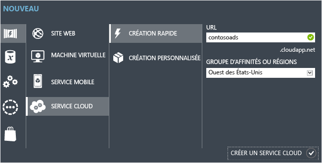

### <a name="create-an-azure-sql-database"></a>Création d’une base de données SQL Azure
Lorsque l'application s'exécute dans le cloud, elle utilise une base de données basée sur le cloud.

1. Dans le [portail Azure](https://portal.azure.com), cliquez sur **Nouveau > Bases de données > SQL Database**.
2. Dans la zone **Nom de la base de données** , entrez *contosoads*
3. Dans le **Groupe de ressources**, cliquez sur **Use existing** (Utiliser existant) et sélectionnez le groupe de ressources utilisé pour le service cloud.
4. Dans l’image suivante, cliquez sur **Serveur - Configurer les paramètres requis** et sur **Créer un serveur**.

    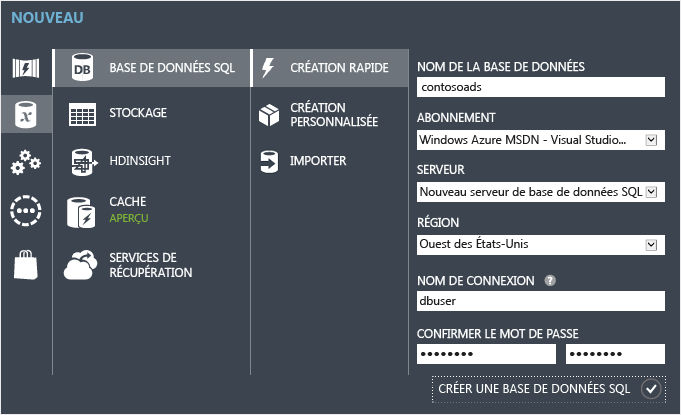

    Si votre abonnement a déjà un serveur, vous pouvez le sélectionner dans la liste déroulante.
5. Dans la zone **Nom du serveur**, entrez *csvccontosodbserver*.

6. Entrez un **Nom de connexion** et un **Mot de passe** d’administrateur.

    Si vous avez sélectionné **Créer un serveur**, vous ne devez pas entrer un nom et un mot de passe existants ici. Vous entrez de nouveaux nom et mot de passe que vous définissez maintenant pour les utiliser ultérieurement lorsque vous accédez à la base de données. Si vous avez sélectionné un serveur créé auparavant, vous devez entrer le mot de passe du compte d’utilisateur administratif déjà créé.
7. Choisissez le même **Emplacement** que celui choisi pour le service cloud.

    Lorsque le service cloud et la base de données se trouvent dans des centres de données différents (différentes régions), la latence augmente et la bande passante en dehors du centre de données vous est facturée, alors qu'elle est gratuite dans un centre de données.
8. Cochez **Autoriser les services Azure à accéder au serveur**.
9. Cliquez sur **Sélectionner** pour le nouveau serveur.

    
10. Cliquez sur **Create**.

### <a name="create-an-azure-storage-account"></a>Création d'un compte de stockage Azure
Un compte de stockage Azure fournit des ressources pour stocker les données de file d'attente et d'objet blob dans le cloud.

Dans une application réelle, on crée généralement des comptes distincts pour les données d'application et les données de journalisation, et des comptes distincts pour les données de test et les données de production. Pour ce didacticiel, vous allez utiliser un seul compte.

1. Dans le [portail Azure](https://portal.azure.com), cliquez sur **Nouveau > Stockage > Compte de stockage - blob, fichier, table, file d’attente**.
2. Dans la zone **Nom** , entrez un préfixe d’URL.

    Ce préfixe, associé au texte visible sous la zone, sera l'URL unique de votre compte de stockage. Si le préfixe que vous entrez est déjà utilisé, vous devez en choisir un autre.
3. Définissez le **Modèle de déploiement** sur *Classique*.

4. Dans la liste déroulante **Réplication**, sélectionnez **Stockage localement redondant**.

    Lorsque la géoréplication est activée pour un compte de stockage, le contenu stocké est répliqué dans un centre de données secondaire pour activer le basculement si un sinistre majeur se produit à l'emplacement principal. La géo-réplication peut engendrer des coûts supplémentaires. Dans le cas des comptes test et de développement, vous êtes en général peu enclin à payer pour la géo-réplication. Pour plus d’informations, consultez [Création, gestion ou suppression d’un compte de stockage](../storage/common/storage-create-storage-account.md).

5. Dans le **Groupe de ressources**, cliquez sur **Use existing** (Utiliser existant) et sélectionnez le groupe de ressources utilisé pour le service cloud.
6. Dans la liste déroulante **Emplacement**, sélectionnez la région choisie pour le service cloud.

    Lorsque le service cloud et le compte de stockage se trouvent dans des centres de données différents (différentes régions), la latence augmente et la bande passante en dehors du centre de données vous est facturée, alors qu'elle est gratuite dans un centre de données.

    Les groupes d'affinités Azure fournissent un mécanisme pour minimiser la distance entre les ressources dans un centre de données, ce qui peut réduire la latence. Ce didacticiel n'utilise pas de groupes d'affinités. Pour plus d'informations, consultez la page [Création d'un groupe d'affinités dans Azure](http://msdn.microsoft.com/library/jj156209.aspx).
7. Cliquez sur **Create**.

    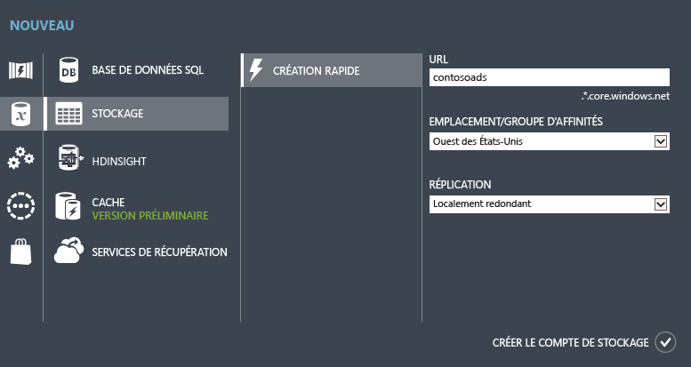

    Dans l’image, un compte de stockage est créé avec l’URL `csvccontosoads.core.windows.net`.

### <a name="configure-the-solution-to-use-your-azure-sql-database-when-it-runs-in-azure"></a>Configuration de la solution pour utiliser votre base de données SQL Azure lorsqu’elle est exécutée dans Azure
Le projet web et le projet de rôle de travail ont chacun leur chaîne de connexion à la base de données et doivent tous deux pointer vers la base de données SQL Azure lorsque l'application s'exécute dans Azure.

Utilisez une [transformation Web.config](http://www.asp.net/mvc/tutorials/deployment/visual-studio-web-deployment/web-config-transformations) pour le rôle web et un paramètre d'environnement de service cloud pour le rôle de travail.

> [!NOTE]
> Dans cette section et la suivante, vous allez stocker des informations d’identification dans des fichiers projet. [Ne stockez pas d'informations confidentielles dans des référentiels de code source publics](http://www.asp.net/aspnet/overview/developing-apps-with-windows-azure/building-real-world-cloud-apps-with-windows-azure/source-control#secrets).
>
>

1. Dans le projet ContosoAdsWeb, ouvrez le fichier de transformation *Web.Release.config* pour le fichier d’application *Web.config*, supprimez le bloc de commentaires qui contient un élément `<connectionStrings>`, puis collez le code suivant à la place.

    ```xml
    <connectionStrings>
        <add name="ContosoAdsContext" connectionString="{connectionstring}"
        providerName="System.Data.SqlClient" xdt:Transform="SetAttributes" xdt:Locator="Match(name)"/>
    </connectionStrings>
    ```

    Laissez le fichier ouvert pour le modifier.
2. Dans le [portail Azure](https://portal.azure.com), cliquez successivement sur **Bases de données SQL** dans le volet de gauche, sur la base de données que vous avez créée pour ce didacticiel, puis sur **Afficher les chaînes de connexion**.

    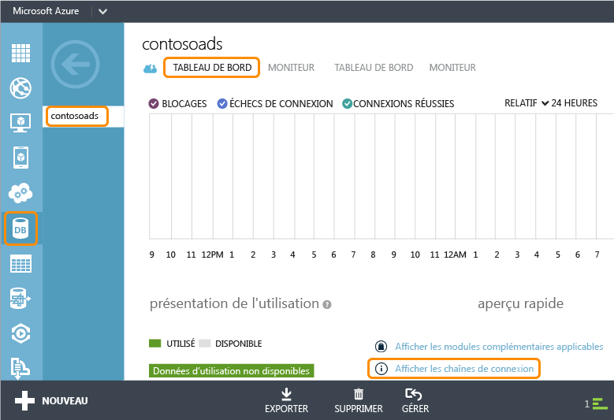

    Le portail affiche les chaînes de connexion, avec un espace réservé pour le mot de passe.

    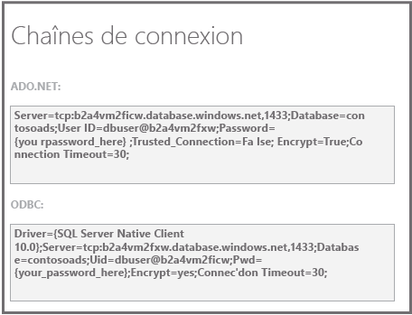
3. Dans le fichier de transformation *Web.Release.config*, supprimez `{connectionstring}` et collez à la place la chaîne de connexion ADO.NET du portail Azure.
4. Dans la chaîne de connexion que vous avez collée dans le fichier de transformation *Web.Release.config*, remplacez `{your_password_here}` par le mot de passe que vous avez créé pour la nouvelle base de données SQL.
5. Enregistrez le fichier.  
6. Sélectionnez et copiez la chaîne de connexion (sans les guillemets) pour l'utiliser dans les étapes suivantes de configuration du projet de rôle de travail.
7. Dans **l’Explorateur de solutions**, sous **Rôles** dans le projet de service cloud, cliquez avec le bouton droit sur **ContosoAdsWorker**, puis sélectionnez **Propriétés**.

    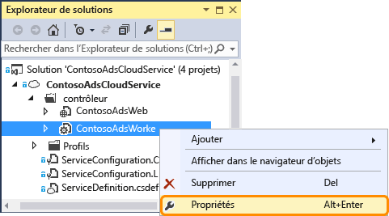
8. Cliquez sur l'onglet **Paramètres** .
9. Changez **Configuration du service** en **Cloud**.
10. Sélectionnez le champ **Valeur** du paramètre `ContosoAdsDbConnectionString`, puis collez la chaîne de connexion que vous avez copiée à partir de la section précédente du didacticiel.

     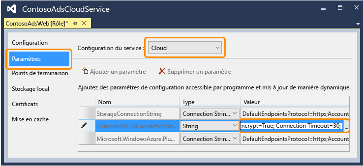
11. Enregistrez vos modifications.  

### <a name="configure-the-solution-to-use-your-azure-storage-account-when-it-runs-in-azure"></a>Configuration de la solution pour utiliser votre compte de stockage Azure lorsqu'elle est exécutée dans Azure
Les chaînes de connexion au compte de stockage Azure pour le projet de rôle web et le projet de rôle de travail sont stockées dans les paramètres d’environnement du projet de service cloud. Pour chaque projet, un ensemble distinct de paramètres doit être utilisé lorsque l’application s’exécute localement et dans le cloud. Vous allez mettre à jour les paramètres d'environnement de cloud pour les projets de rôle web et de travail.

1. Dans **l’Explorateur de solutions**, cliquez avec le bouton droit sur **ContosoAdsWeb** sous **Rôles** dans le projet **ContosoAdsCloudService**, puis cliquez sur **Propriétés**.

    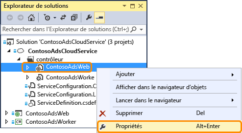
2. Cliquez sur l'onglet **Paramètres** . Dans la liste déroulante **Configuration du service**, sélectionnez **Cloud**.

    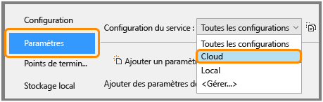
3. Sélectionnez l’entrée **StorageConnectionString**. Un bouton représentant des points de suspension (**...**) apparaît à l’extrémité droite de la ligne. Cliquez dessus pour ouvrir la boîte de dialogue **Créer une chaîne de connexion de compte de stockage**.

    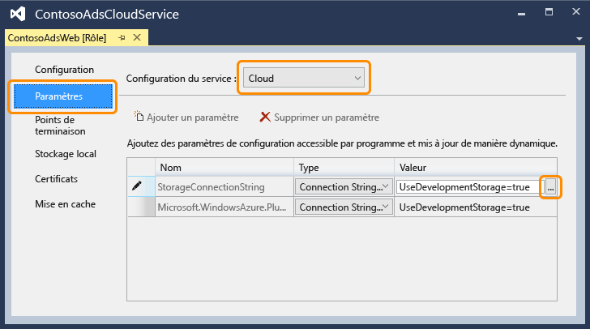
4. Dans la boîte de dialogue **Créer une chaîne de connexion de compte de stockage**, cliquez sur **Votre abonnement**, choisissez le compte de stockage que vous avez créé précédemment, puis cliquez sur **OK**. Si vous n'êtes pas déjà connecté, vous êtes invité à entrer vos informations d'identification de compte Azure.

    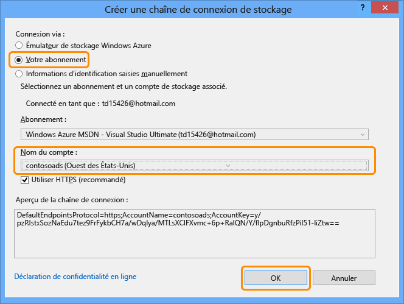
5. Enregistrez vos modifications.
6. Suivez la même procédure que celle que vous avez utilisée pour la chaîne de connexion `StorageConnectionString` pour définir la chaîne de connexion `Microsoft.WindowsAzure.Plugins.Diagnostics.ConnectionString`.

    Cette chaîne de connexion est utilisée pour la connexion.
7. Suivez la procédure utilisée pour le rôle **ContosoAdsWeb** pour définir les deux chaînes de connexion pour le rôle **ContosoAdsWorker**. Pensez à définir **Configuration du service** sur **Cloud**.

Les paramètres d'environnement de rôle configurés à l'aide de l'interface utilisateur de Visual Studio sont stockés dans les fichiers suivants du projet ContosoAdsCloudService :

* *ServiceDefinition.csdef* : définit les noms des paramètres.
* *ServiceConfiguration.Cloud.cscfg* : fournit des valeurs utilisées lorsque l'application s'exécute dans le cloud.
* *ServiceConfiguration.Local.cscfg* : fournit des valeurs utilisées lorsque l'application s'exécute localement.

Par exemple, le fichier ServiceDefinition.csdef inclut les définitions suivantes :

```xml
<ConfigurationSettings>
    <Setting name="StorageConnectionString" />
    <Setting name="ContosoAdsDbConnectionString" />
</ConfigurationSettings>
```

Et le fichier *ServiceConfiguration.Cloud.cscfg* inclut les valeurs entrées pour ces paramètres dans Visual Studio.

```xml
<Role name="ContosoAdsWorker">
    <Instances count="1" />
    <ConfigurationSettings>
        <Setting name="StorageConnectionString" value="{yourconnectionstring}" />
        <Setting name="ContosoAdsDbConnectionString" value="{yourconnectionstring}" />
        <!-- other settings not shown -->

    </ConfigurationSettings>
    <!-- other settings not shown -->

</Role>
```

Le paramètre `<Instances>` spécifie le nombre de machines virtuelles sur lesquelles Azure va exécuter le code du rôle de travail. La section [Étapes suivantes](#next-steps) inclut des liens vers d'autres informations sur la montée en charge d'un service cloud.

### <a name="deploy-the-project-to-azure"></a>Déployer le projet dans Azure
1. Dans **l’Explorateur de solutions**, cliquez avec le bouton droit sur le projet cloud **ContosoAdsCloudService** et sélectionnez **Publier**.

   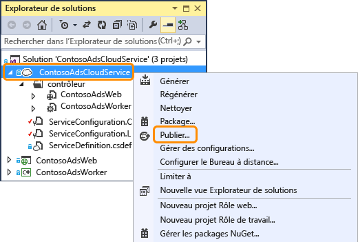
2. À l’étape **Se connecter** de l’Assistant **Publier l’application Azure**, cliquez sur **Suivant**.

    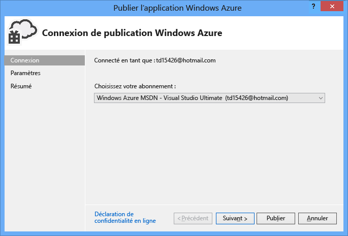
3. À l’étape **Paramètres** de l’Assistant, cliquez sur **Suivant**.

    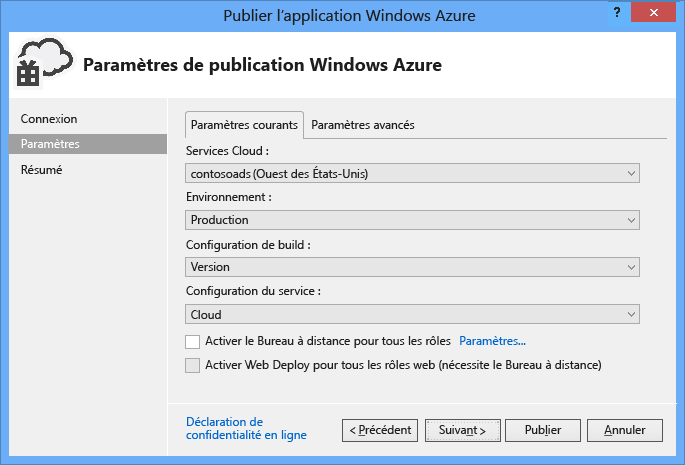

    Les paramètres par défaut sous l'onglet **Advanced** conviennent pour ce didacticiel. Pour plus d'informations sur l'onglet avancé, consultez la rubrique [Assistant Publication d'application Azure](http://msdn.microsoft.com/library/hh535756.aspx).
4. À l’étape **Résumé**, cliquez sur **Publier**.

    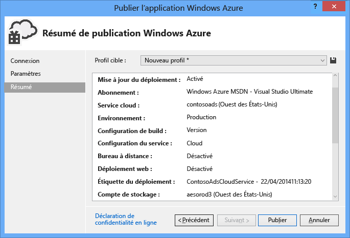

   La fenêtre **Journal des activités Azure** s'ouvre dans Visual Studio.
5. Cliquez sur l'icône représentant une flèche vers la droite pour développer les détails du déploiement.

    Le déploiement peut durer environ 5 minutes, voire plus.

    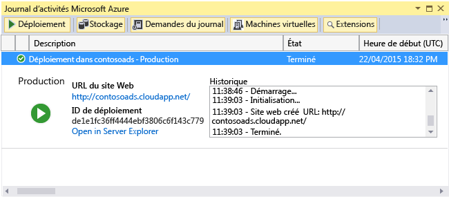
6. Une fois le déploiement terminé, cliquez sur l’ **URL d’application web** pour lancer l’application.
7. À ce stade, vous pouvez tester l'application en créant, affichant et modifiant des publicités, comme lorsque vous avez exécuté l'application localement.

> [!NOTE]
> À l'issue du test, supprimez ou arrêtez le service cloud. Même si vous n'utilisez pas le service cloud, il accumule des frais, car les ressources de la machine virtuelle lui sont réservées. Si vous le laissez s'exécuter, toute personne qui trouve votre URL peut créer et afficher des publicités. Dans le [portail Azure](https://portal.azure.com), ouvrez l’onglet **Vue d’ensemble** de votre service cloud, puis cliquez sur le bouton **Supprimer** en haut de la page. Si vous voulez juste empêcher temporairement l'accès au site, cliquez sur **Arrêter** . Dans ce cas, les frais continuent de s'accumuler. Vous pouvez suivre une procédure similaire pour supprimer la base de données SQL et le compte de stockage lorsque vous n'en avez plus besoin.
>
>

## <a name="create-the-application-from-scratch"></a>Créer l’application à partir de zéro
Si vous n'avez pas encore téléchargé [l'application terminée](http://code.msdn.microsoft.com/Simple-Azure-Cloud-Service-e01df2e4), faites-le maintenant. Vous allez copier les fichiers du projet téléchargé dans le nouveau projet.

La création de l'application Contoso Ads implique les étapes suivantes :

* création d'une solution Visual Studio de service cloud ;
* mise à jour et ajout de packages NuGet ;
* définition des références d'un projet ;
* configuration des chaînes de connexion ;
* ajout de fichiers de code.

Une fois la solution créée, vérifiez le code qui est propre aux projets de service cloud et aux objets blob et files d'attente Azure.

### <a name="create-a-cloud-service-visual-studio-solution"></a>Création d'une solution Visual Studio de service cloud
1. Dans Visual Studio, dans le menu **Nouveau projet** from the **Nouveau projet** .
2. Dans le volet gauche de la boîte de dialogue **Nouveau projet**, développez **Visual C#** et choisissez les modèles **Cloud**, puis le modèle **Azure Cloud Service**.
3. Nommez le projet et la solution ContosoAdsCloudService, puis cliquez sur **OK**.

    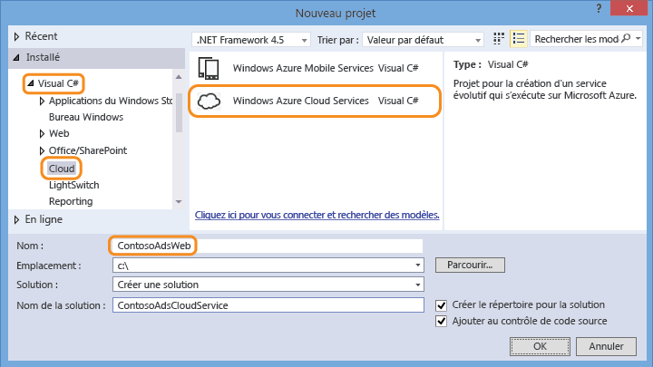
4. Dans la boîte de dialogue **Nouveau service cloud Azure**, ajoutez un rôle web et un rôle de travail. Nommez le rôle web ContosoAdsWeb, et le rôle de travail ContosoAdsWorker (pour modifier le nom par défaut des rôles, utilisez l'icône en forme de crayon dans le volet de droite).

    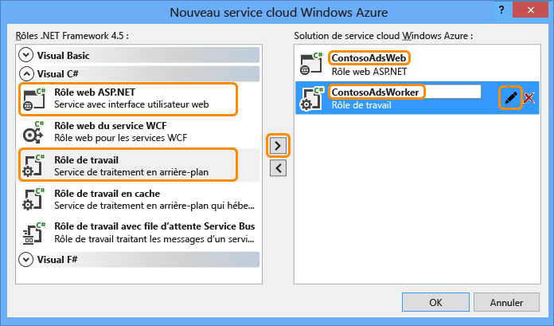
5. Lorsque la boîte de dialogue **Nouveau projet ASP.NET** est affichée pour le rôle web, choisissez le modèle MVC et cliquez sur **Modifier l’authentification**.

    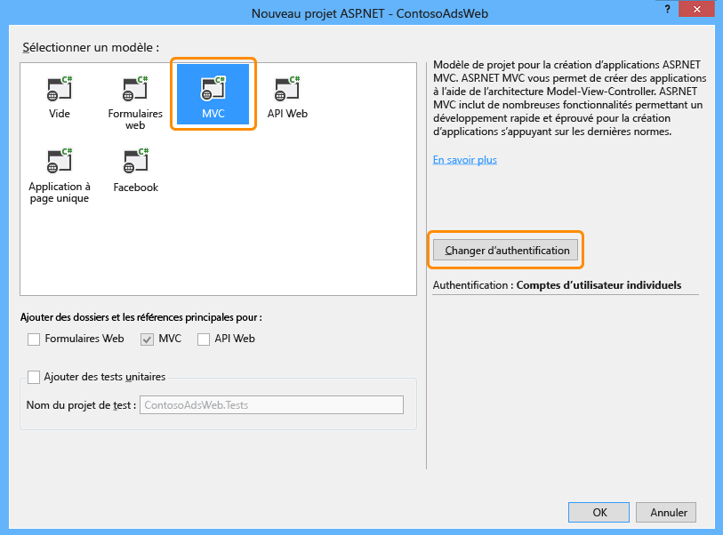
6. Dans la boîte de dialogue **Modifier l’authentification**, choisissez **Aucune authentification** et cliquez sur **OK**.

    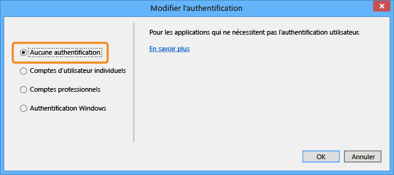
7. Dans la boîte de dialogue **Nouveau projet ASP.NET**, cliquez sur **OK**.
8. Dans **l’Explorateur de solutions**, cliquez avec le bouton droit sur la solution (pas sur l’un des projets) et choisissez **Ajouter - Nouveau projet**.
9. Dans la boîte de dialogue **Ajouter un nouveau projet**, choisissez **Windows** sous **Visual C#** dans le volet gauche, puis cliquez sur le modèle **Bibliothèque de classes**.  
10. Nommez le projet *ContosoAdsCommon*, puis cliquez sur **OK**.

    Vous devez indiquer le contexte Entity Framework et le modèle de données des projets des rôles web et de travail. Vous pouvez également définir les classes associées à Entity Framework dans le projet de rôle web et faire référence à ce projet dans le projet de rôle de travail. Mais dans l’approche alternative, votre projet de rôle de travail aura une référence inutile aux assemblys web.

### <a name="update-and-add-nuget-packages"></a>Mise à jour et ajout de packages NuGet
1. Ouvrez la boîte de dialogue **Gérer les packages NuGet** pour la solution.
2. En haut de la fenêtre, sélectionnez **Mises à jour**.
3. Recherchez le package *WindowsAzure.Storage* et, s’il se trouve dans la liste, sélectionnez-le, puis sélectionnez les projets web et de travail concernés par la mise à jour, puis cliquez sur **Mettre à jour**.

    La bibliothèque cliente de stockage est mise à jour plus souvent que les modèles de projet Visual Studio, ce qui explique pourquoi il faut effectuer la mise à jour dans un nouveau projet.
4. En haut de la fenêtre, sélectionnez **Parcourir**.
5. Recherchez le package NuGet *EntityFramework* et installez-le dans les trois projets.
6. Recherchez le package NuGet *Microsoft.WindowsAzure.ConfigurationManager* et installez-le dans le projet de rôle de travail.

### <a name="set-project-references"></a>Définition des références de projet
1. Dans le projet ContosoAdsWeb, définissez une référence au projet ContosoAdsCommon. Cliquez avec le bouton droit sur le projet ContosoAdsWeb, puis cliquez sur **Références** - **Ajouter des références**. Dans la boîte de dialogue **Gestionnaire de références**, dans le volet gauche, sélectionnez **Solution – Projets**, puis sélectionnez **ContosoAdsCommon** et cliquez sur **OK**.
2. Dans le projet ContosoAdsWorker, définissez une référence au projet ContosoAdsCommon.

    ContosoAdsCommon contient le modèle de données et la classe de contexte Entity Framework, qui seront utilisés par les applications frontale et principale.
3. Dans le projet ContosoAdsWorker, définissez une référence à `System.Drawing`.

    Cet assembly est utilisé par l'application principale pour convertir les images en vignettes.

### <a name="configure-connection-strings"></a>Configuration des chaînes de connexion
Dans cette section, vous allez configurer les chaînes de connexion Azure Storage et SQL pour un test local. Les instructions de déploiement données précédemment dans le didacticiel expliquent comment paramétrer les chaînes de connexion lorsque l'application s'exécute dans le cloud.

1. Dans le projet ContosoAdsWeb, ouvrez le fichier Web.config de l'application et insérez l'élément `connectionStrings` suivant après l'élément `configSections`.

    ```xml
    <connectionStrings>
        <add name="ContosoAdsContext" connectionString="Data Source=(localdb)\v11.0; Initial Catalog=ContosoAds; Integrated Security=True; MultipleActiveResultSets=True;" providerName="System.Data.SqlClient" />
    </connectionStrings>
    ```

    Si vous utilisez Visual Studio 2015 ou version ultérieure, remplacez « v11.0 » par « MSSQLLocalDB ».
2. Enregistrez vos modifications.
3. Dans le projet ContosoAdsCloudService, cliquez avec le bouton droit sur ContosoAdsWeb sous **Rôles**, puis cliquez sur **Propriétés**.

    
4. Dans la fenêtre des propriétés **ContosAdsWeb [Rôle]**, cliquez sur l’onglet **Paramètres**, puis sur **Ajouter un paramètre**.

    Laissez **Configuration du service** sur **Toutes les configurations**.
5. Ajoutez un paramètre nommé *StorageConnectionString*. Définissez **Type** sur *ConnectionString* et **Value** sur *UseDevelopmentStorage=true*.

    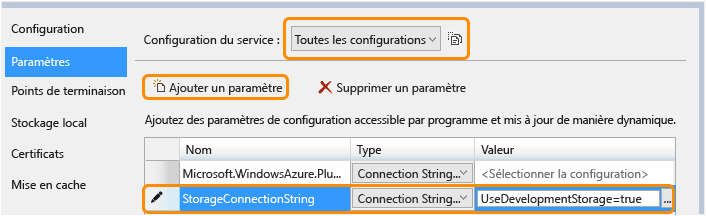
6. Enregistrez vos modifications.
7. Suivez la procédure utilisée pour ajouter une chaîne de connexion de stockage dans les propriétés du rôle ContosoAdsWorker.
8. Toujours dans la fenêtre des propriétés **ContosoAdsWorker [Rôle]** , ajoutez une chaîne de connexion :

   * Nom : ContosoAdsDbConnectionString
   * Type : string
   * Valeur : collez la même chaîne de connexion que celle utilisée pour le projet de rôle web. (L’exemple suivant concerne Visual Studio 2013. N’oubliez pas de modifier la source de données si vous copiez cet exemple et utilisez Visual Studio 2015 ou version ultérieure.)

       ```
       Data Source=(localdb)\v11.0; Initial Catalog=ContosoAds; Integrated Security=True; MultipleActiveResultSets=True;
       ```

### <a name="add-code-files"></a>Ajout de fichiers de code
Dans cette section, vous allez copier les fichiers de code de la solution téléchargée dans la nouvelle solution. Les sections suivantes montrent et expliquent les éléments essentiels de ce code.

Pour ajouter des fichiers à un projet ou à un dossier, cliquez avec le bouton droit sur le projet ou le dossier, puis cliquez sur **Ajouter** - **Élément existant**. Sélectionnez les fichiers et cliquez sur **Ajouter**. Si un message vous demande si vous souhaitez remplacer les fichiers existants, cliquez sur **Oui**.

1. Dans le projet ContosoAdsCommon, supprimez le fichier *Class1.cs* et ajoutez à la place les fichiers *Ad.cs* et *ContosoAdscontext.cs* du projet téléchargé.
2. Dans le projet ContosoAdsWeb, ajoutez les fichiers suivants du projet téléchargé.

   * *Global.asax.cs*.  
   * Dans le dossier *Views\Shared* : *\_Layout.cshtml*.
   * Dans le dossier *Views\Home* : *Index.cshtml*.
   * Dans le dossier *Controllers* : *AdController.cs*.
   * Dans le dossier *Views\Ad* (à créer) : cinq fichiers *.cshtml*.
3. Dans le projet ContosoAdsWorker, ajoutez le fichier *WorkerRole.cs* du projet téléchargé.

À ce stade, vous pouvez générer et exécuter l'application comme indiqué précédemment dans le didacticiel. L'application utilisera la base de données locale et les ressources de l'émulateur de stockage.

Les sections suivantes présentent le code utilisé dans l'environnement, les objets blob et les files d'attente Azure. Ce didacticiel ne montre pas comment créer des contrôleurs et des vues MVC à l'aide de la structure, comment écrire du code Entity Framework qui fonctionne avec les bases de données SQL Server, ni les bases de la programmation asynchrone dans ASP.NET 4.5. Pour plus d'informations sur ces sujets, consultez les ressources suivantes :

* [Prise en main de MVC 5](http://www.asp.net/mvc/tutorials/mvc-5/introduction/getting-started)
* [Prise en main d’EF 6 et de MVC 5](http://www.asp.net/mvc/tutorials/getting-started-with-ef-using-mvc)
* [Introduction à la programmation asynchrone dans .NET 4.5](http://www.asp.net/aspnet/overview/developing-apps-with-windows-azure/building-real-world-cloud-apps-with-windows-azure/web-development-best-practices#async).

### <a name="contosoadscommon---adcs"></a>ContosoAdsCommon - Ad.cs
Le fichier Ad.cs définit une énumération des catégories de publicité et une classe d'entité POCO pour les informations de publicité.

```csharp
public enum Category
{
    Cars,
    [Display(Name="Real Estate")]
    RealEstate,
    [Display(Name = "Free Stuff")]
    FreeStuff
}

public class Ad
{
    public int AdId { get; set; }

    [StringLength(100)]
    public string Title { get; set; }

    public int Price { get; set; }

    [StringLength(1000)]
    [DataType(DataType.MultilineText)]
    public string Description { get; set; }

    [StringLength(1000)]
    [DisplayName("Full-size Image")]
    public string ImageURL { get; set; }

    [StringLength(1000)]
    [DisplayName("Thumbnail")]
    public string ThumbnailURL { get; set; }

    [DataType(DataType.Date)]
    [DisplayFormat(DataFormatString = "{0:yyyy-MM-dd}", ApplyFormatInEditMode = true)]
    public DateTime PostedDate { get; set; }

    public Category? Category { get; set; }
    [StringLength(12)]
    public string Phone { get; set; }
}
```

### <a name="contosoadscommon---contosoadscontextcs"></a>ContosoAdsCommon - ContosoAdsContext.cs
La classe ContosoAdsContext spécifie que la classe Ad est utilisée dans une collection DbSet, qui est stockée par Entity Framework dans une base de données SQL.

```csharp
public class ContosoAdsContext : DbContext
{
    public ContosoAdsContext() : base("name=ContosoAdsContext")
    {
    }
    public ContosoAdsContext(string connString)
        : base(connString)
    {
    }
    public System.Data.Entity.DbSet<Ad> Ads { get; set; }
}
```

La classe a deux constructeurs. Le premier est utilisé par le projet web et spécifie le nom d'une chaîne de connexion stockée dans le fichier Web.config. Le second vous permet de passer la chaîne de connexion réelle utilisée par le projet de rôle de travail, car il n’a pas un fichier Web.config. Vous avez vu précédemment où est stockée cette chaîne de connexion, et vous allez voir comme le code la récupère quand il instancie la classe DbContext.

### <a name="contosoadsweb---globalasaxcs"></a>ContosoAdsWeb - Global.asax.cs
Le code appelé par la méthode `Application_Start` crée un conteneur d’objets blob *images* et une file d’attente *images*, s’ils n’existent pas déjà. Ainsi, à chaque fois que vous utilisez un nouveau compte de stockage ou l'émulateur de stockage sur un nouvel ordinateur, le conteneur d'objets blob et la file d'attente nécessaires sont créés automatiquement.

Le code a accès au compte de stockage en utilisant la chaîne de connexion du fichier *.cscfg* .

```csharp
var storageAccount = CloudStorageAccount.Parse
    (RoleEnvironment.GetConfigurationSettingValue("StorageConnectionString"));
```

Il obtient ensuite une référence au conteneur d'objets blob *images* , crée le conteneur s'il n'existe pas déjà et définit les autorisations d'accès au nouveau conteneur. Par défaut, les nouveaux conteneurs donnent accès aux objets blob uniquement aux clients possédant des informations d'identification de compte de stockage. Pour le site web, les objets blob doivent être publics pour afficher des images en utilisant des URL qui pointent vers les objets blob des images.

```csharp
var blobClient = storageAccount.CreateCloudBlobClient();
var imagesBlobContainer = blobClient.GetContainerReference("images");
if (imagesBlobContainer.CreateIfNotExists())
{
    imagesBlobContainer.SetPermissions(
        new BlobContainerPermissions
        {
            PublicAccess =BlobContainerPublicAccessType.Blob
        });
}
```

Du code similaire obtient une référence à la file d'attente *images* et crée une nouvelle file d'attente. Dans ce cas, aucune modification des autorisations n’est nécessaire.

```csharp
CloudQueueClient queueClient = storageAccount.CreateCloudQueueClient();
var imagesQueue = queueClient.GetQueueReference("images");
imagesQueue.CreateIfNotExists();
```

### <a name="contosoadsweb---layoutcshtml"></a>ContosoAdsWeb - \_Layout.cshtml
Le fichier *_Layout.cshtml* définit le nom de l’application dans l’en-tête et le pied de page, puis crée une entrée de menu « Ads ».

### <a name="contosoadsweb---viewshomeindexcshtml"></a>ContosoAdsWeb - Views\Home\Index.cshtml
Le fichier *Views\Home\Index.cshtml* affiche les liens de catégorie sur la page d'accueil. Les liens transmettent la valeur entière de l’énumération `Category` d’une variable querystring à la page Ads Index.

```razor
<li>@Html.ActionLink("Cars", "Index", "Ad", new { category = (int)Category.Cars }, null)</li>
<li>@Html.ActionLink("Real estate", "Index", "Ad", new { category = (int)Category.RealEstate }, null)</li>
<li>@Html.ActionLink("Free stuff", "Index", "Ad", new { category = (int)Category.FreeStuff }, null)</li>
<li>@Html.ActionLink("All", "Index", "Ad", null, null)</li>
```

### <a name="contosoadsweb---adcontrollercs"></a>ContosoAdsWeb - AdController.cs
Dans le fichier *AdController.cs*, le constructeur appelle la méthode `InitializeStorage` pour créer les objets de la bibliothèque cliente Azure Storage, qui fournissent une API pour les objets blob et les files d’attente.

Le code obtient ensuite une référence au conteneur d'objets blob *images* comme vu précédemment dans *Global.asax.cs*. Ce faisant, il définit une [stratégie de nouvelles tentatives](http://www.asp.net/aspnet/overview/developing-apps-with-windows-azure/building-real-world-cloud-apps-with-windows-azure/transient-fault-handling) par défaut appropriée pour une application web. La stratégie de nouvelles tentatives d'interruption exponentielle par défaut peut suspendre l'application web pendant plus d'une minute en cas de tentatives répétées pour une erreur temporaire. La stratégie de nouvelle tentative spécifiée ici laisse trois secondes après chaque nouvelle tentative, jusqu’à trois.

```csharp
var blobClient = storageAccount.CreateCloudBlobClient();
blobClient.DefaultRequestOptions.RetryPolicy = new LinearRetry(TimeSpan.FromSeconds(3), 3);
imagesBlobContainer = blobClient.GetContainerReference("images");
```

Un code similaire obtient une référence à la file d'attente *images* .

```csharp
CloudQueueClient queueClient = storageAccount.CreateCloudQueueClient();
queueClient.DefaultRequestOptions.RetryPolicy = new LinearRetry(TimeSpan.FromSeconds(3), 3);
imagesQueue = queueClient.GetQueueReference("images");
```

La plupart du code du contrôleur permet généralement d'utiliser un modèle de données Entity Framework en utilisant une classe DbContext. La méthode HttpPost `Create` est une exception, car elle télécharge un fichier et l’enregistre dans le stockage d’objets blob. Le classeur de modèles fournit un objet [HttpPostedFileBase](http://msdn.microsoft.com/library/system.web.httppostedfilebase.aspx) à la méthode.

```csharp
[HttpPost]
[ValidateAntiForgeryToken]
public async Task<ActionResult> Create(
    [Bind(Include = "Title,Price,Description,Category,Phone")] Ad ad,
    HttpPostedFileBase imageFile)
```

Si l'utilisateur a sélectionné un fichier à télécharger, le code met à jour le fichier, l'enregistre dans un objet blob et met à jour l'enregistrement de base de données AD avec une URL qui pointe vers l'objet blob.

```csharp
if (imageFile != null && imageFile.ContentLength != 0)
{
    blob = await UploadAndSaveBlobAsync(imageFile);
    ad.ImageURL = blob.Uri.ToString();
}
```

Le code qui procède au téléchargement se trouve dans la méthode `UploadAndSaveBlobAsync` . Il crée un nom GUID pour l’objet blob, télécharge et enregistre le fichier, et renvoie une référence vers l’objet blob enregistré.

```csharp
private async Task<CloudBlockBlob> UploadAndSaveBlobAsync(HttpPostedFileBase imageFile)
{
    string blobName = Guid.NewGuid().ToString() + Path.GetExtension(imageFile.FileName);
    CloudBlockBlob imageBlob = imagesBlobContainer.GetBlockBlobReference(blobName);
    using (var fileStream = imageFile.InputStream)
    {
        await imageBlob.UploadFromStreamAsync(fileStream);
    }
    return imageBlob;
}
```

Dès que la méthode `Create` HttpPost charge un objet blob et met à jour la base de données, elle crée un message de file d’attente pour informer ce processus de backend qu’une image est prête à être convertie en vignette.

```csharp
string queueMessageString = ad.AdId.ToString();
var queueMessage = new CloudQueueMessage(queueMessageString);
await queue.AddMessageAsync(queueMessage);
```

Le code de la méthode `Edit` HttpPost est similaire, mais si l’utilisateur sélectionne un nouveau fichier image, les objets blob existants doivent être supprimés.

```csharp
if (imageFile != null && imageFile.ContentLength != 0)
{
    await DeleteAdBlobsAsync(ad);
    imageBlob = await UploadAndSaveBlobAsync(imageFile);
    ad.ImageURL = imageBlob.Uri.ToString();
}
```

L'exemple suivant illustre le code qui supprime les objets blob lorsque vous supprimez une publicité.

```csharp
private async Task DeleteAdBlobsAsync(Ad ad)
{
    if (!string.IsNullOrWhiteSpace(ad.ImageURL))
    {
        Uri blobUri = new Uri(ad.ImageURL);
        await DeleteAdBlobAsync(blobUri);
    }
    if (!string.IsNullOrWhiteSpace(ad.ThumbnailURL))
    {
        Uri blobUri = new Uri(ad.ThumbnailURL);
        await DeleteAdBlobAsync(blobUri);
    }
}
private static async Task DeleteAdBlobAsync(Uri blobUri)
{
    string blobName = blobUri.Segments[blobUri.Segments.Length - 1];
    CloudBlockBlob blobToDelete = imagesBlobContainer.GetBlockBlobReference(blobName);
    await blobToDelete.DeleteAsync();
}
```

### <a name="contosoadsweb---viewsadindexcshtml-and-detailscshtml"></a>ContosoAdsWeb - Views\Ad\Index.cshtml et Details.cshtml
Le fichier *Index.cshtml* affiche des vignettes avec les autres données de publicité.

```razor

```

Le fichier *Details.cshtml* affiche l'image intégrale.

```razor

```

### <a name="contosoadsweb---viewsadcreatecshtml-and-editcshtml"></a>ContosoAdsWeb - Views\Ad\Create.cshtml et Edit.cshtml
Les fichiers *Create.cshtml* et *Edit.cshtml* spécifient l’encodage de formulaire qui permet au contrôleur d’obtenir l’objet `HttpPostedFileBase`.

```razor
@using (Html.BeginForm("Create", "Ad", FormMethod.Post, new { enctype = "multipart/form-data" }))
```

Un élément `<input>` indique au navigateur de fournir une boîte de dialogue de sélection de fichier.

```razor
<input type="file" name="imageFile" accept="image/*" class="form-control fileupload" />
```

### <a name="contosoadsworker---workerrolecs---onstart-method"></a>ContosoAdsWorker - WorkerRole.cs - Méthode OnStart
L’environnement du rôle de travail Azure appelle la méthode `OnStart` de la classe `WorkerRole` lorsque le rôle de travail est démarré, puis appelle la méthode `Run` à la fin de la méthode `OnStart`.

La méthode `OnStart` obtient la chaîne de connexion à la base de données à partir du fichier *.cscfg* et la transmet à la classe DbContext d’Entity Framework. Le fournisseur SQLClient est utilisé par défaut et n'a donc pas besoin d'être spécifié.

```csharp
var dbConnString = CloudConfigurationManager.GetSetting("ContosoAdsDbConnectionString");
db = new ContosoAdsContext(dbConnString);
```

La méthode obtient ensuite une référence au compte de stockage et crée le conteneur d’objets blob et la file d’attente s’ils n’existent pas déjà. Le code correspondant est celui que vous avez déjà vu dans la méthode `Application_Start` du rôle Web.

### <a name="contosoadsworker---workerrolecs---run-method"></a>ContosoAdsWorker - WorkerRole.cs - Méthode Run
La méthode `Run` est appelée lorsque la méthode `OnStart` a terminé son travail d’initialisation. La méthode exécute une boucle infinie qui recherche des messages de file d'attente et les traite lorsqu'ils arrivent.

```csharp
public override void Run()
{
    CloudQueueMessage msg = null;

    while (true)
    {
        try
        {
            msg = this.imagesQueue.GetMessage();
            if (msg != null)
            {
                ProcessQueueMessage(msg);
            }
            else
            {
                System.Threading.Thread.Sleep(1000);
            }
        }
        catch (StorageException e)
        {
            if (msg != null && msg.DequeueCount > 5)
            {
                this.imagesQueue.DeleteMessage(msg);
            }
            System.Threading.Thread.Sleep(5000);
        }
    }
}
```

Après chaque itération de la boucle, si aucun message de file d'attente n'a été trouvé, le programme se met en veille pendant une seconde. Cela évite au rôle de travail un temps processeur et des coûts de transaction de stockage trop élevés. L’équipe de conseil clientèle Microsoft raconte une anecdote sur un développeur qui, avant de partir en vacances, avait oublié d’inclure ce point et avait procédé au déploiement en production. À son retour, les coûts de surveillance étaient plus élevés que le coût de ses vacances.

Il arrive que le contenu d'un message de file d'attente provoque une erreur de traitement. On parle alors de *message empoisonné*, et si vous relancez la boucle après avoir consigné une erreur, vous risquez d'essayer sans fin de traiter ce message.  Le bloc catch inclut donc une instruction If qui vérifie combien de fois l'application a tenté de traiter le message actuel, et si le nombre de tentatives est supérieur à 5, le message est supprimé de la file d'attente.

`ProcessQueueMessage` est appelé lorsqu'un message de file d'attente est trouvé.

```csharp
private void ProcessQueueMessage(CloudQueueMessage msg)
{
    var adId = int.Parse(msg.AsString);
    Ad ad = db.Ads.Find(adId);
    if (ad == null)
    {
        throw new Exception(String.Format("AdId {0} not found, can't create thumbnail", adId.ToString()));
    }

    CloudBlockBlob inputBlob = this.imagesBlobContainer.GetBlockBlobReference(ad.ImageURL);

    string thumbnailName = Path.GetFileNameWithoutExtension(inputBlob.Name) + "thumb.jpg";
    CloudBlockBlob outputBlob = this.imagesBlobContainer.GetBlockBlobReference(thumbnailName);

    using (Stream input = inputBlob.OpenRead())
    using (Stream output = outputBlob.OpenWrite())
    {
        ConvertImageToThumbnailJPG(input, output);
        outputBlob.Properties.ContentType = "image/jpeg";
    }

    ad.ThumbnailURL = outputBlob.Uri.ToString();
    db.SaveChanges();

    this.imagesQueue.DeleteMessage(msg);
}
```

Ce code lit la base de données pour obtenir l'URL de l'image, convertit l'image en vignette, enregistre la vignette dans un objet blob, met à jour la base de données avec l'URL de l'objet blob de la vignette et supprime le message de la file d'attente.

> [!NOTE]
> Pour plus de simplicité, le code de la méthode `ConvertImageToThumbnailJPG` utilise des classes dans l’espace de noms System.Drawing. Cependant, les classes de cet espace de noms ont été conçues pour être utilisées avec Windows Forms. Elles ne sont pas prises en charge dans un service Windows ou ASP.NET. Pour plus d’informations sur les options de traitement d’images, consultez [Génération d’images dynamiques](http://www.hanselman.com/blog/BackToBasicsDynamicImageGenerationASPNETControllersRoutingIHttpHandlersAndRunAllManagedModulesForAllRequests.aspx) et [Redimensionnement d’images approfondi](http://www.hanselminutes.com/313/deep-inside-image-resizing-and-scaling-with-aspnet-and-iis-with-imageresizingnet-author-na).
>
>

## <a name="troubleshooting"></a>résolution des problèmes
Voici quelques erreurs courantes et leur solution en cas de problème lorsque vous suivez les instructions de ce didacticiel.

### <a name="serviceruntimeroleenvironmentexception"></a>ServiceRuntime.RoleEnvironmentException
L’objet `RoleEnvironment` est fourni par Azure lorsque vous exécutez une application dans Azure ou lorsque vous l’exécutez localement à l’aide de l’émulateur de calcul Azure.  Si vous obtenez cette erreur lors de l'exécution en local, vérifiez si le projet ContosoAdsCloudService est défini comme projet de démarrage. Cela permet au projet de s'exécuter avec l'émulateur de calcul Azure.

L'application utilise notamment la classe RoleEnvironment Azure pour obtenir les valeurs de chaîne de connexion qui sont stockées dans les fichiers *.cscfg* , et l'absence de chaîne de connexion est une autre cause de cette exception. Veillez à créer le paramètre StorageConnectionString pour les configurations cloud et locale dans le projet ContosoAdsWeb et créez les deux chaînes de connexion pour les deux configurations dans le projet ContosoAdsWorker. Si vous effectuez une recherche de type **Rechercher tout** pour StorageConnectionString dans toute la solution, vous devez la voir 9 fois dans 6 fichiers.

### <a name="cannot-override-to-port-xxx-new-port-below-minimum-allowed-value-8080-for-protocol-http"></a>Impossible de remplacer par le port xxx. La valeur du nouveau port est inférieure à la valeur minimale autorisée de 8080 pour le protocole http
Changez le numéro du port utilisé par le projet web. Cliquez avec le bouton droit sur le projet ContosoAdsWeb, puis cliquez sur **Propriétés**. Cliquez sur l’onglet **Web** et changez le numéro du port dans le paramètre **URL du projet**.

Vous trouverez une autre solution au problème dans la section suivante.

### <a name="other-errors-when-running-locally"></a>Autres erreurs lors de l'exécution locale
Par défaut, les nouveaux projets de service cloud utilisent l'émulateur de calcul Azure express pour simuler l'environnement Azure. Il s'agit d'une version légère de l'émulateur de calcul, mais il peut arriver que la version express ne fonctionne pas là où l'émulateur complet fonctionne.  

Pour que le projet utilise la version complète de l'émulateur, cliquez avec le bouton droit sur le projet ContosoAdsCloudService, puis cliquez sur **Propriétés**. Dans la fenêtre **Propriétés**, cliquez sur l’onglet **Web**, puis sur la case d’option **Utiliser l’émulateur complet**.

Pour exécuter l'application avec l'émulateur complet, vous devez ouvrir Visual Studio avec les privilèges d'administrateur.

## <a name="next-steps"></a>Étapes suivantes
L'application Contoso Ads est intentionnellement simple pour un didacticiel de prise en main. Par exemple, elle n’implémente pas [l’injection de dépendances](http://www.asp.net/mvc/tutorials/hands-on-labs/aspnet-mvc-4-dependency-injection) ni les [modèles de référentiel et d’élément de travail](http://www.asp.net/mvc/tutorials/getting-started-with-ef-using-mvc/advanced-entity-framework-scenarios-for-an-mvc-web-application#repo), elle [n’utilise pas d’interface pour la connexion](http://www.asp.net/aspnet/overview/developing-apps-with-windows-azure/building-real-world-cloud-apps-with-windows-azure/monitoring-and-telemetry#log), ni les [migrations Code First EF](http://www.asp.net/mvc/tutorials/getting-started-with-ef-using-mvc/migrations-and-deployment-with-the-entity-framework-in-an-asp-net-mvc-application) pour gérer les changements de modèles de données ou la [résilience des connexions EF](http://www.asp.net/mvc/tutorials/getting-started-with-ef-using-mvc/connection-resiliency-and-command-interception-with-the-entity-framework-in-an-asp-net-mvc-application) pour gérer les erreurs réseau temporaires, etc.

Voici quelques exemples d'applications de service cloud qui montrent des pratiques d'encodage réelles, de la plus simple à la plus complexe :

* [PhluffyFotos](http://code.msdn.microsoft.com/PhluffyFotos-Sample-7ecffd31). De conception identique à Contoso Ads, mais implémente plus de fonctionnalités et plus de pratiques d'encodage réelles.
* [Application multiniveau Azure Cloud Service avec tables, files d'attente et objets blob](http://code.msdn.microsoft.com/windowsazure/Windows-Azure-Multi-Tier-eadceb36). Présente les tables Azure Storage ainsi que des objets blob et des files d’attente. Si l’on se base sur une version plus ancienne du kit de développement logiciel Azure pour .NET, certaines modifications sont nécessaires pour travailler avec la version actuelle.
* [Concepts de base des services cloud dans Microsoft Azure](http://code.msdn.microsoft.com/Cloud-Service-Fundamentals-4ca72649). Cet exemple complet présente une grande variété de meilleures pratiques, produites par le groupe Microsoft Patterns and Practices.

Pour obtenir des informations générales sur le développement pour le cloud, consultez la rubrique [Création d’applications cloud réalistes avec Azure](http://www.asp.net/aspnet/overview/developing-apps-with-windows-azure/building-real-world-cloud-apps-with-windows-azure/introduction).

Pour voir une vidéo de présentation des meilleures pratiques et des modèles Azure Storage, consultez la rubrique [Microsoft Azure Storage – Nouveautés, meilleures pratiques et modèles](http://channel9.msdn.com/Events/Build/2014/3-628).

Pour plus d’informations, consultez les ressources suivantes :

* [Azure Cloud Services Partie 1 : Présentation](http://justazure.com/microsoft-azure-cloud-services-part-1-introduction/)
* [Gestion des services cloud](cloud-services-how-to-manage.md)
* [Azure Storage](/documentation/services/storage/)
* [Choix d’un fournisseur de services cloud](https://azure.microsoft.com/overview/choosing-a-cloud-service-provider/)

