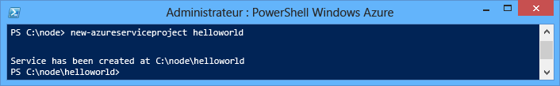
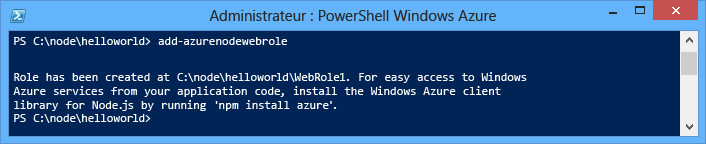
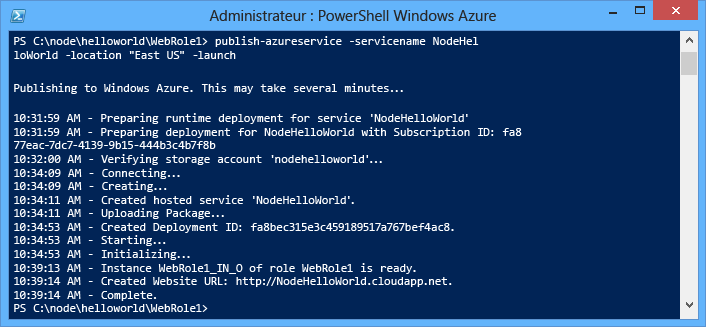
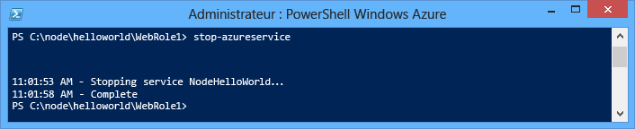
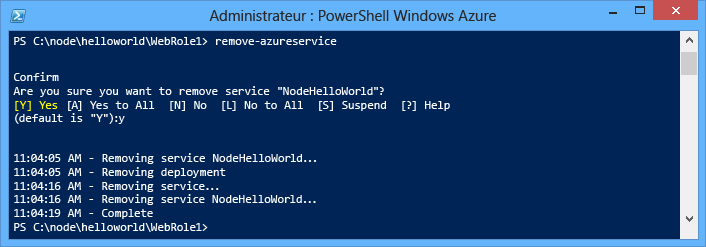

<properties
	pageTitle="Guide de démarrage Node.js | Microsoft Azure"
	description="Apprenez à créer une application web Node.js simple et à la déployer vers un service cloud Azure."
	services="cloud-services"
	documentationCenter="nodejs"
	authors="MikeWasson"
	manager="wpickett"
	editor=""/>

<tags
	ms.service="cloud-services"
	ms.workload="tbd"
	ms.tgt_pltfrm="na" 
	ms.devlang="nodejs"
	ms.topic="hero-article"
	ms.date="06/01/2015"
	ms.author="mwasson"/>

# Création et déploiement d'une application Node.js dans Azure Cloud Services

> [AZURE.SELECTOR]
- [Node.js](cloud-services-nodejs-develop-deploy-app.md)
- [.NET](cloud-services-dotnet-get-started.md)

Ce didacticiel explique comment créer une application Node.js simple s’exécutant dans Azure Cloud Services. Les services Cloud Services sont des composantes des applications cloud extensibles dans Azure. Ils permettent de séparer, de gérer et d'étendre de façon indépendante le composant frontal et le composant principal de votre application. Cloud Services héberge de façon fiable chaque rôle sur une machine virtuelle dédiée.

Pour plus d'informations sur les services cloud et pour connaître les différences avec les sites Web Azure et les machines virtuelles, consultez la page [Comparaison des sites Web Azure, des services cloud et des machines virtuelles](../choose-web-site-cloud-service-vm.md).

>[AZURE.TIP]Vous voulez créer un simple site Web ? Si votre scénario ne comporte qu’un simple composant frontal web, envisagez d’<a href="/documentation/articles/web-sites-nodejs-develop-deploy-mac/">utiliser une application web légère.</a> Vous pouvez facilement mettre à niveau vers un service cloud en fonction du développement de votre application et de vos besoins.

Dans ce didacticiel, vous allez créer une application Web simple, hébergée dans un rôle Web. Vous utiliserez l’émulateur de calcul pour tester votre application localement, puis déploierez cette dernière à l’aide d’outils en ligne de commande PowerShell.

Il s’agit d’une application « hello world » simple :

## Composants requis

> [AZURE.NOTE]Ce didacticiel utilise Azure PowerShell, qui nécessite Windows.

- Installez et configurez [Azure PowerShell](../install-configure-powershell.md).
- Téléchargez et installez le [Kit de développement logiciel (SDK) Azure pour .NET 2.5](http://go.microsoft.com/fwlink/?linkid=518091). Dans le programme d'installation, sélectionnez :
    - MicrosoftAzureAuthoringTools
    - MicrosoftAzureComputeEmulator

## Créer un projet Azure Cloud Services

Effectuez les tâches suivantes pour créer un projet Azure Cloud Services, avec la structure Node.js de base :

1. Exécutez **Azure PowerShell** en tant qu’administrateur. (À partir du **menu Démarrer** ou de l'**écran d'accueil**, recherchez **Azure PowerShell**.)

2.  Entrez l’applet de commande PowerShell suivante pour créer le projet :

        New-AzureServiceProject helloworld

	

	La cmdlet **New-AzureServiceProject** génère une structure de base pour publier une application Node.js dans un service cloud. Elle contient les fichiers de configuration nécessaires à la publication sur Azure. L'applet de commande change aussi votre répertoire de travail et le remplace par le répertoire du service.

	L’applet de commande crée les fichiers suivants :

	-   **ServiceConfiguration.Cloud.cscfg**, **ServiceConfiguration.Local.cscfg** et **ServiceDefinition.csdef** sont des fichiers propres à Azure, nécessaires à la publication de votre application. Pour plus d'informations, consultez la page [Présentation de la création d'un service hébergé pour Azure][].

	-   **deploymentSettings.json** stocke les paramètres locaux utilisés par les cmdlets de déploiement Azure PowerShell.

4.  Entrez la commande suivante pour ajouter un nouveau rôle Web :

        Add-AzureNodeWebRole

	

	La cmdlet **Add-AzureNodeWebRole** crée une application Node.js de base. Elle modifie également les fichiers **.csfg** et **.csdef** afin d’ajouter des entrées de configuration pour le nouveau rôle.

	> [AZURE.NOTE]Si vous ne spécifiez pas de nom de rôle, un nom par défaut est utilisé. Vous pouvez indiquer un nom comme premier paramètre de la cmdlet : `Add-AzureNodeWebRole MyRole`

L’application Node.js est définie dans le fichier **server.js**, situé dans le répertoire du rôle web (**WebRole1** par défaut). Voici le code :

	var http = require('http');
	var port = process.env.port || 1337;
	http.createServer(function (req, res) {
	    res.writeHead(200, { 'Content-Type': 'text/plain' });
	    res.end('Hello World\n');
	}).listen(port);

Ce code est essentiellement identique à l’exemple « Hello World » sur le site web [nodejs.org][], sauf qu’il utilise le numéro de port attribué par l’environnement de cloud.

## Déploiement de l’application dans Azure

	[AZURE.INCLUDE [create-account-note](../../includes/create-account-note.md)]

### Télécharger les paramètres de publication Azure

Pour déployer votre application sur Azure, vous devez télécharger les paramètres de publication de votre abonnement Azure.

1.  Exécutez l’applet de commande Azure PowerShell suivante :

        Get-AzurePublishSettingsFile

	Ceci utilise votre navigateur pour accéder à la page de téléchargement des paramètres de publication. Il est possible que vous soyez invité à vous connecter avec un compte Microsoft. Si c'est le cas, utilisez le compte associé à votre abonnement Azure.

	Enregistrez le profil téléchargé dans un emplacement auquel vous pouvez accéder facilement.

2.  Exécutez l’applet de commande suivante pour importer le profil de publication que vous avez téléchargé :

        Import-AzurePublishSettingsFile [path to file]

	> [AZURE.NOTE]Après l’importation des paramètres de publication, pensez à supprimer le fichier .publishSettings téléchargé, car il contient des informations qui pourraient permettre à d’autres personnes d’accéder à votre compte.

### Publication de l'application

Pour procéder à la publication, exécutez la cmdlet **Publish-AzureServiceProject** comme suit :

    Publish-AzureServiceProject -ServiceName NodeHelloWorld -Location "East US" -Launch

- Le paramètre **-ServiceName** indique le nom du déploiement. Ce nom doit être unique, sans quoi le processus de publication échouera.

- Le paramètre **-Emplacement** indique le centre de données dans lequel l'application sera hébergée. Pour afficher une liste des centres de données disponibles, utilisez la cmdlet **Get-AzureLocation**.

- Le paramètre **-Launch** ouvre une fenêtre de navigateur et accède au service hébergé une fois le déploiement terminé.

Une fois la publication effectuée, vous devez obtenir une réponse semblable à celle-ci :

> [AZURE.NOTE]Il peut s’écouler plusieurs minutes avant que l’application soit déployée et disponible lors de la première publication.

Une fois le déploiement terminé, une fenêtre de navigateur s'ouvre et accède au service cloud.

Votre application s'exécute maintenant sur Azure.

La cmdlet **Publish-AzureServiceProject** effectue les opérations suivantes :

1.  Elle crée un package à déployer. Ce package contient tous les fichiers de votre dossier d’application.

2.  Elle crée un **compte de stockage**, si celui-ci n'existe pas. Le compte de stockage Azure permet de stocker le package de l'application au cours du déploiement. Vous pouvez supprimer en toute sécurité le compte de stockage une fois le déploiement terminé.

3.  Elle crée un **service cloud**, si celui-ci n'existe pas. Le **service cloud** est le conteneur dans lequel votre application est hébergée lorsqu'elle est déployée sur Azure. Pour plus d'informations, consultez la page [Présentation de la création d'un service hébergé pour Azure][].

4.  Elle publie le package de déploiement sur Azure.

## Arrêt et suppression de votre application

Après avoir déployé votre application, vous pouvez la désactiver afin de vous éviter des coûts supplémentaires. Azure facture les instances de rôle Web par heure de serveur consommée. Une fois votre application déployée, elle consomme du temps de serveur, même si les instances ne sont pas exécutées et sont arrêtées.

1.  Dans la fenêtre Windows PowerShell, arrêtez le déploiement du service créé dans la section précédente à l'aide de la cmdlet suivante :

        Stop-AzureService

	L'arrêt du service peut prendre plusieurs minutes. Une fois le service arrêté, vous recevez un message confirmant l'arrêt du service.

	

2.  Pour supprimer le service, utilisez la cmdlet suivante :

        Remove-AzureService

	Lorsque vous y êtes invité, entrez **Y** pour supprimer le service.

	La suppression du service peut prendre plusieurs minutes. Une fois le service supprimé, vous recevez un message confirmant la suppression du service.

	

	> [AZURE.NOTE]La suppression du service ne supprime pas le compte de stockage qui a été créé lors de la publication initiale du service. Le stockage utilisé continuera à vous être facturé. Pour plus d'informations sur la suppression d'un compte de stockage, consultez la page [Suppression d'un compte de stockage d'un abonnement Azure](http://msdn.microsoft.com/library/windowsazure/hh531562.aspx).

[The Windows Start menu with the Azure SDK Node.js entry expanded]: ./media/cloud-services-nodejs-develop-deploy-app/azure-powershell-menu.png
[mkdir]: ./media/cloud-services-nodejs-develop-deploy-app/getting-started-6.png
[nodejs.org]: http://nodejs.org/
[A directory listing of the helloworld folder.]: ./media/cloud-services-nodejs-develop-deploy-app/getting-started-7.png
[Présentation de la création d'un service hébergé pour Azure]: http://msdn.microsoft.com/library/windowsazure/jj155995.aspx
[A directory listing of the WebRole1 folder]: ./media/cloud-services-nodejs-develop-deploy-app/getting-started-8.png
[The menu displayed when right-clicking the Azure emulator from the task bar.]: ./media/cloud-services-nodejs-develop-deploy-app/getting-started-11.png
[A browser window displaying http://www.windowsazure.com/ with the Free Trial link highlighted]: ./media/cloud-services-nodejs-develop-deploy-app/getting-started-12.png
[A browser window displaying the liveID sign in page]: ./media/cloud-services-nodejs-develop-deploy-app/getting-started-13.png
[Internet Explorer displaying the save as dialog for the publishSettings file.]: ./media/cloud-services-nodejs-develop-deploy-app/getting-started-14.png

[The full status output of the Publish-AzureService command]: ./media/cloud-services-nodejs-develop-deploy-app/node20.png
[How to Delete a Storage Account from an Azure Subscription]: https://www.windowsazure.com/manage/services/storage/how-to-manage-a-storage-account/
[powershell-menu]: ./media/cloud-services-nodejs-develop-deploy-app/azure-powershell-start.png
 

<!---HONumber=August15_HO7-->