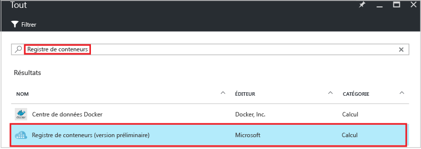
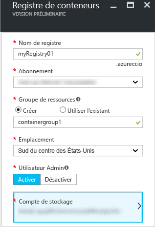
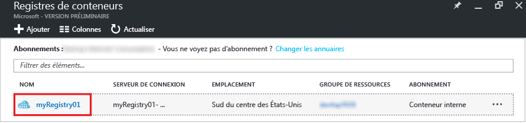
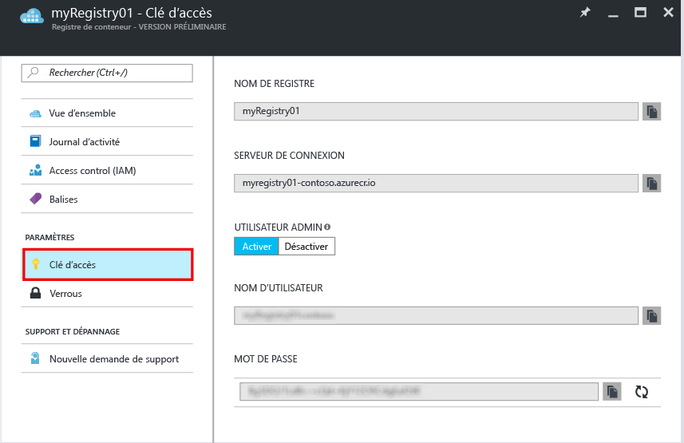

---
title: Créer un registre de conteneur Azure dans le portail | Microsoft Docs description: Prise en main de la création et de la gestion des registres de conteneur Azure avec le Portail Azure services: container-registry documentationcenter: '' author: stevelas manager: balans editor: dlepow tags: ''keywords: ''

ms.assetid: 53a3b3cb-ab4b-4560-bc00-366e2759f1a1 ms.service: container-registry ms.devlang: na ms.topic: get-started-article ms.tgt_pltfrm: na ms.workload: na ms.date: 11/14/2016 ms.author: stevelas ---# Créer un registre de conteneur à l’aide du Portail Azure Utilisez le Portail Azure pour créer un registre de conteneur et en gérer les paramètres. Vous pouvez également créer et gérer des registres de conteneur à l’aide des [commandes de d’Azure CLI 2.0](container-registry-get-started-azure-cli.md) ou par programme avec [l’API REST](https://go.microsoft.com/fwlink/p/?linkid=834376) de Container Registry.

Pour en savoir plus et connaître les concepts, consultez [What is Azure Container Registry?](container-registry-intro.md) (Qu’est-ce qu’Azure Container Registry ?)

> [!NOTE]
> Container Registry est actuellement en version préliminaire.

## Créer un registre de conteneur
1. Dans le [portail](https://portal.azure.com), cliquez sur **+ Nouveau**.
2. Recherchez **Container Registry** sur Marketplace.
3. Sélectionnez **Container Registry (version préliminaire)**, avec l’éditeur **Microsoft**. 
    
4. Cliquez sur **Create**. Le panneau **Container Registry** s’affiche.

    
5. Dans le panneau **Container Registry**, entrez les informations suivantes. Une fois ces opérations effectuées, cliquez sur **Créer**.
   
    a. **Nom du registre** : nom de domaine global unique de niveau supérieur pour votre registre spécifique. Dans cet exemple, le nom de registre est *myRegistry01*, mais vous pouvez le remplacer par un nom unique de votre choix. Le nom ne peut contenir que des lettres et des chiffres.
   
    b. **Groupe de ressources** : sélectionnez un [groupe de ressources](../azure-resource-manager/resource-group-overview.md#resource-groups) existant ou tapez le nom d’un nouveau groupe. 
   
    c. **Emplacement** : sélectionnez un emplacement de centre de données Azure où le service est [disponible](https://azure.microsoft.com/regions/services/), tel que **Sud du centre des États-Unis**. 
   
    d. **Utilisateur Admin** : si vous le souhaitez, vous pouvez activer un utilisateur Admin disposant d’un accès au registre. Vous pouvez modifier ce paramètre une fois le registre créé.
   
   > [!IMPORTANT]
   > En plus de fournir l’accès via un compte d’utilisateur Admin, les registres de conteneur prennent en charge l’authentification supportée par les principaux du service Azure Active Directory. Pour plus d’informations et pour connaître les éléments à prendre en considération, consultez la section relative à [l’authentification auprès d’un conteneur](container-registry-authentication.md).
   

    e. **Compte de stockage** : utilisez le paramètre par défaut pour créer un [compte de stockage](../storage/storage-introduction.md), ou sélectionnez un compte de stockage existant dans le même emplacement. Pour l’instant, l’offre Stockage Premium n’est pas prise en charge.

## Gérer les paramètres du registre
Après avoir créé le registre, recherchez ses paramètres en commençant par le panneau des **Registres de conteneur** dans le portail. Par exemple, vous aurez peut-être besoin des paramètres pour vous connecter à votre registre, ou vous souhaiterez peut-être activer ou désactiver l’utilisateur Admin.

1. Dans le panneau **Registres de conteneur**, cliquez sur le nom de votre registre.
   
    
2. Pour gérer les paramètres d’accès, cliquez sur **Clé d’accès**.
   
    
3. Notez les points suivants :
   
   * **Serveur de connexion** : le nom complet à utiliser pour se connecter au registre. Dans cet exemple, il s’agit de `myregistry01-contoso.azurecr.io`.
   * **Utilisateur Admin** : bascule pour activer ou désactiver le compte d’utilisateur Admin du registre.
   * **Nom d’utilisateur** et **Mot de passe** : informations d’identification du compte d’utilisateur Admin (si activé) que vous pouvez utiliser pour vous connecter au registre. Vous pouvez éventuellement régénérer le mot de passe.

## Étapes suivantes
* [Effectuer un push de votre première image à l’aide de l’interface CLI Docker](container-registry-get-started-docker-cli.md)

