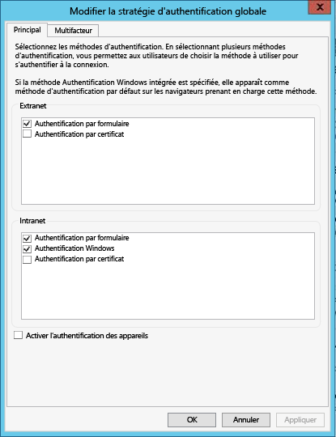

<properties
   pageTitle="Configuration requise pour Azure Data Catalog"
   description="Ce dont j’ai besoin pour démarrer avec Azure Data Catalog"
   services="data-catalog"
   documentationCenter=""
   authors="steelanddata"
   manager="NA"
   editor=""
   tags=""/>
<tags
   ms.service="data-catalog"
   ms.devlang="NA"
   ms.topic="article"
   ms.tgt_pltfrm="NA"
   ms.workload="data-catalog"
   ms.date="02/08/2016"
   ms.author="maroche"/>

# Ce dont j’ai besoin pour démarrer avec Azure Data Catalog

## Configuration requise pour Azure Data Catalog

Certains éléments sont à prendre en charge avant de configurer **Azure Data Catalog**. Ne vous inquiétez pas, cela ne prendra pas longtemps !

## Azure Active Directory

Azure Active Directory (Azure AD) permet à votre entreprise de gérer facilement les identités et les accès, à la fois dans le cloud et en local. Les utilisateurs peuvent utiliser un seul compte professionnel ou scolaire pour utiliser l'authentification unique sur n'importe quelle application web locale ou dans le cloud. Azure Data Catalog utilise Azure AD pour valider l’authentification. Pour plus d'informations, consultez la rubrique [Prise en main d’Azure AD](active-directory-get-started.md).

## Configuration de la stratégie Active Directory

Dans certains cas, il peut arriver que les utilisateurs parviennent à se connecter au portail Azure Data Catalog, mais quand ils essaient de se connecter à l’outil d’inscription des sources de données, ils obtiennent un message d’erreur qui les empêche de se connecter. Ce problème peut aussi survenir aussi bien quand l’utilisateur se trouve sur le réseau d’entreprise ou quand il se connecte en dehors du réseau d’entreprise.

L’outil d’inscription de sources de données utilise l’authentification par formulaire pour valider les ouvertures de session des utilisateurs avec Active Directory. Pour une ouverture de session réussie, l'authentification par formulaire doit être activée dans la stratégie d'authentification globale par un administrateur Active Directory.

La stratégie d’authentification globale permet d’activer séparément des méthodes d’authentification pour les connexions intranet et extranet, comme illustré ci-dessous. Des erreurs de connexion peuvent survenir si l'authentification par formulaire n'est pas activée pour le réseau à partir duquel l'utilisateur se connecte.

 

Pour plus d’informations, consultez [Configuration des stratégies d’authentification](https://technet.microsoft.com/library/dn486781.aspx).

## Abonnement Azure
Les abonnements Azure vous permettent d’organiser l'accès aux ressources du service cloud telles qu’Azure Data Catalog. Ils vous permettent également de contrôler le signalement, la facturation et le paiement des ressources utilisées. Chaque abonnement peut disposer d’une configuration de facturation et de paiement différente. Vous pouvez donc avoir différents abonnements et différents plans par département, projet, bureau régional, etc. Chaque service cloud appartient à un abonnement. Vous devez donc avoir un abonnement avant de configurer Azure Data Catalog. Pour plus d’informations, consultez [Gestion des comptes, des abonnements et des rôles d’administrateur](https://msdn.microsoft.com/library/azure/hh531793.aspx).

<!---HONumber=AcomDC_0211_2016-->