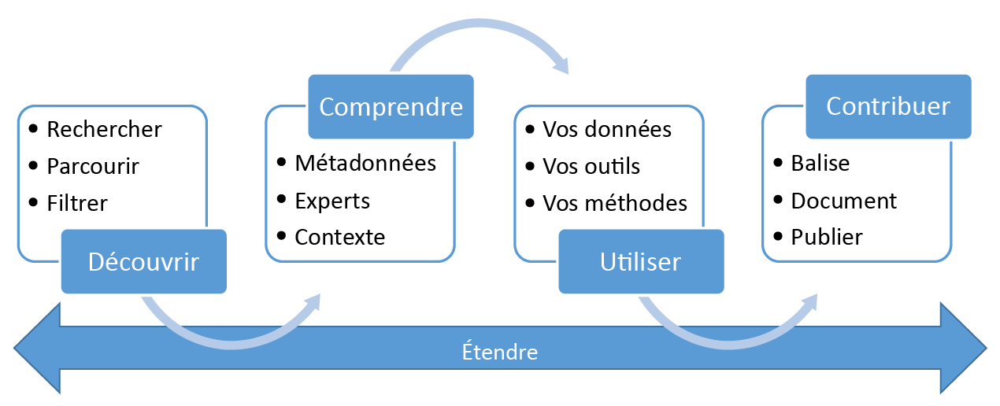

<properties
   pageTitle="Qu’est-ce qu’Azure Data Catalog | Microsoft Azure"
   description="Cet article présente Microsoft Azure Data Catalog, notamment ses fonctionnalités et les problèmes qu’il peut résoudre. Data Catalog fournit des fonctionnalités qui permettent à tous les utilisateurs (analystes, scientifiques, développeurs) d’enregistrer, découvrir, comprendre et utiliser des sources de données."
   services="data-catalog"
   documentationCenter=""
   authors="steelanddata"
   manager="NA"
   editor=""
   tags=""/>
<tags
   ms.service="data-catalog"
   ms.devlang="NA"
   ms.topic="get-started-article"
   ms.tgt_pltfrm="NA"
   ms.workload="data-catalog"
   ms.date="05/26/2016"
   ms.author="maroche"/>

# Qu’est-ce qu’Azure Data Catalog ?

Azure Data Catalog est un service cloud entièrement géré qui permet aux utilisateurs de découvrir les sources de données dont ils ont besoin et de comprendre celles qu’ils ont trouvées, tout en aidant les organisations à mieux exploiter leurs investissements existants. Data Catalog propose des fonctionnalités qui permettent à tous les utilisateurs (analystes, scientifiques, développeurs) de découvrir, comprendre et utiliser des sources de données. Data Catalog inclut un modèle de crowdsourcing des métadonnées et des annotations et permet à tous les utilisateurs d’apporter leurs connaissances pour créer une communauté et une culture des données.

## Défis des consommateurs de données en matière de découverte

La détection de sources de données d’entreprise est un processus organique basé sur des connaissances tribales. Elle présente de nombreux défis aux entreprises qui souhaitent tirer le meilleur parti de leurs informations.

-	Les utilisateurs ne savent pas que ces sources de données existent, sauf s’ils entrent en contact avec elle dans le cadre d'un autre processus ; aucun emplacement central ne leur permet d’inscrire des sources de données.
-	Un utilisateur ne peut pas se connecter aux données à l'aide d'une application cliente s’il ne connaît pas l’emplacement d’une source de données ; les expériences de consommation de données requièrent que les utilisateurs connaissent la chaîne de connexion ou le chemin d'accès.
-	L’utilisateur ne peut pas comprendre les utilisations prévues des données s’il ne connaît pas l’emplacement d’une source de données ; les sources de données et la documentation résident à des emplacements différents et elles sont consommées via différentes expériences.
-	Si un utilisateur souhaite obtenir des précisions sur une ressource d'informations, il doit localiser l’expert ou l'équipe responsable des données et solliciter ces experts en mode hors connexion ; aucune connexion explicite n’est établie entre les données et les personnes pouvant apporter leurs points de vue d’expert sur leurs utilisations.
-  Sauf si un utilisateur comprend le processus de demande d’accès à la source de données, la découverte de la source de données et de sa documentation ne lui permet toujours pas d'accéder aux données qu'il requiert.

## Défis des producteurs de données en matière de découverte

Pendant que les consommateurs de données relèvent ces défis, les utilisateurs responsables de la production et de la gestion des ressources d’informations relèvent, quant à eux, des défis qui leur sont propres.

-	Annoter des sources de données avec des métadonnées descriptives est souvent peine perdue, car les applications clientes ignorent généralement les descriptions stockées dans la source de données.
-	Créer une documentation sur les sources de données est souvent peine perdue, car sa synchronisation avec la source de données doit être permanente. De plus, les utilisateurs ne font généralement pas confiance aux documentations, car ils les considèrent comme obsolètes.
- Restreindre l'accès à la source de données et veiller à ce que les consommateurs de données sachent comment demander l'accès est un défi récurrent.

Créer et gérer une documentation sur une source de données est une tâche plutôt longue et complexe. Le défi consistant à rendre disponible cette documentation pour tous les utilisateurs de la source de données l’est souvent encore plus.

Lorsqu’ils sont combinés, ces défis représentent un obstacle majeur pour les entreprises qui souhaitent encourager et promouvoir l'utilisation et la compréhension des données d'entreprise.

## Azure Data Catalog peut être utile

Data Catalog est conçu pour résoudre ces problèmes et permettre aux entreprises de tirer le meilleur parti de leurs ressources d’informations existantes. Data Catalog permet de rendre les sources de données facilement détectables et compréhensibles par les utilisateurs qui ont besoin des données qu’ils gèrent.

Data Catalog fournit un service cloud dans lequel des données source peuvent être inscrites. Les données restent à leur emplacement existant, mais une copie des métadonnées, ainsi qu’une référence à l’emplacement de la source de données, sont ajoutées à Data Catalog. Ces métadonnées sont également indexées de manière à ce que chaque source de données soit facilement détectable via la recherche, et compréhensible pour les utilisateurs qui la découvrent.

Une fois qu'une source de données a été inscrite, ses métadonnées peuvent ensuite être enrichies, par l'utilisateur qui a réalisé l’inscription ou par d'autres utilisateurs de l'entreprise. Tous les utilisateurs peuvent annoter une source de données en fournissant des descriptions, des balises ou d'autres métadonnées, telles que de la documentation, et traiter la demande d’accès à la source de données. Ces métadonnées descriptives complètent les métadonnées structurelles (telles que les noms de colonnes et les types de données) inscrites à partir de la source de données.

La détection, la compréhension et l’utilisation des sources de données sont le principal objectif de l’inscription des sources. Lorsque les utilisateurs de l’entreprise ont besoin de données pour mener leurs efforts (aide à la décision, développement d’applications, science de données ou toute autre tâche qui nécessite des données spécifiques), ils peuvent utiliser l’expérience de détection de Data Catalog pour rechercher rapidement les données qui correspondent à leurs besoins, comprendre les données afin d’évaluer leur aptitude à l’emploi et utiliser ces données en ouvrant la source de données via l’outil de leur choix. Dans le même temps, Data Catalog permet aux utilisateurs de contribuer au catalogue, en balisant, en documentant et en annotant des sources de données qui ont déjà été inscrites, et en inscrivant les nouvelles sources de données qui peuvent alors être découvertes, comprises et consommées par la communauté des utilisateurs du catalogue.

## Prise en main de Data Catalog

Pour commencer à utiliser Data Catalog dès aujourd’hui, visitez [www.azuredatacatalog.com](https://www.azuredatacatalog.com).

Vous trouverez un guide de prise en main [ici](data-catalog-get-started.md).

## En savoir plus sur Data Catalog

Pour en savoir plus sur les fonctions de Data Catalog, voir :

* [Inscription de sources de données](data-catalog-how-to-register.md)
* [Détection de sources de données](data-catalog-how-to-discover.md)
* [Annotation de sources de données](data-catalog-how-to-annotate.md)
* [Comment documenter des sources de données](data-catalog-how-to-documentation.md)
* [Connexion aux sources de données](data-catalog-how-to-connect.md)
* [Travail avec du Big Data](data-catalog-how-to-big-data.md)
* [Gestion des ressources de données](data-catalog-how-to-manage.md)
* [Configuration du glossaire métier](data-catalog-how-to-business-glossary.md)
* [Forum Aux Questions (FAQ)](data-catalog-frequently-asked-questions.md)

<!---HONumber=AcomDC_0601_2016-->