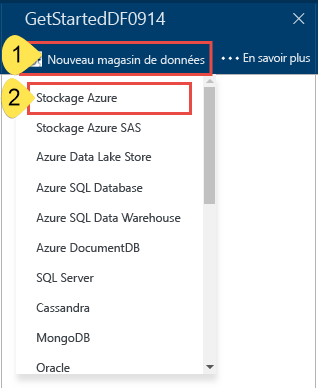
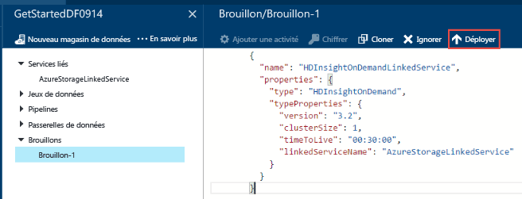

# Didacticiel : Créer votre première fabrique de données Azure à l’aide du portail Azure
> [!div class="op_single_selector"]
> * [Vue d’ensemble et étapes préalables requises](data-factory-build-your-first-pipeline.md)
> * [Portail Azure](data-factory-build-your-first-pipeline-using-editor.md)
> * [Visual Studio](data-factory-build-your-first-pipeline-using-vs.md)
> * [PowerShell](data-factory-build-your-first-pipeline-using-powershell.md)
> * [Modèle Resource Manager](data-factory-build-your-first-pipeline-using-arm.md)
> * [API REST](data-factory-build-your-first-pipeline-using-rest-api.md)
> 
> 

Dans cet article, vous allez utiliser le [portail Azure](https://portal.azure.com/) pour créer votre première fabrique de données Azure.

## Composants requis
1. Lisez l’article [Vue d’ensemble du didacticiel](data-factory-build-your-first-pipeline.md) et effectuez les **étapes préalables requises**.
2. Cet article ne fournit pas de vue d’ensemble conceptuelle du service Azure Data Factory. Nous vous recommandons de lire l’article [Introduction à Azure Data Factory](data-factory-introduction.md) pour une présentation détaillée du service.

## Créer une fabrique de données
Une fabrique de données peut avoir un ou plusieurs pipelines. Un pipeline peut contenir une ou plusieurs activités. Par exemple, une activité de copie pour copier des données d’une source vers un magasin de données de destination, et une activité Hive HDInsight pour exécuter un script Hive pour transformer des données d’entrée et produire des données de sortie. Commençons par la création de la fabrique de données dans cette étape.

1. Connectez-vous au [portail Azure](https://portal.azure.com/).
2. Cliquez sur **NOUVEAU** dans le menu de gauche, puis sur **Données et analyse** et sur **Data Factory**.
   
   
3. Dans le panneau **Nouvelle fabrique de données**, entrez **GetStartedDF** dans le champ Nom.
   
   
   
   > [!IMPORTANT]
   > Le nom de la fabrique de données Azure doit être un nom **global unique**. Si vous recevez l’erreur : **Le nom de fabrique de données « GetStartedDF » n’est pas disponible**. Modifiez le nom de la fabrique de données (par exemple, votrenomGetStartedDF) et réessayez. Consultez la rubrique [Data Factory - Règles d'affectation des noms](data-factory-naming-rules.md) pour savoir comment nommer les artefacts Data Factory.
   > 
   > Le nom de la fabrique de données pourra être enregistré en tant que nom **DNS** et devenir ainsi visible publiquement.
   > 
   > 
4. Sélectionnez l’**abonnement Azure** où vous voulez que la fabrique de données soit créée.
5. Sélectionnez un **groupe de ressources** existant ou créez-en un. Pour les besoins de ce didacticiel, créez un groupe de ressources nommé : **ADFGetStartedRG**.
6. Cliquez sur **Créer** dans le panneau **Nouvelle fabrique de données**.
   
   > [!IMPORTANT]
   > Pour créer des instances Data Factory, vous devez avoir un rôle de [collaborateur de fabrique de données](../active-directory/role-based-access-built-in-roles.md#data-factory-contributor) au niveau de l’abonnement/du groupe de ressources.
   > 
   > 
7. La fabrique de données apparaît comme étant en cours de création dans le **Tableau d’accueil** du portail Azure, comme suit :
   
   
8. Félicitations ! Vous avez créé votre première fabrique de données. Une fois la fabrique de données créée, la page correspondante s’affiche et indique son contenu.
   
    

Avant de créer un pipeline dans la fabrique de données, vous devez créer quelques entités Data Factory. Créez d’abord des services liés pour lier des magasins de données/calculs à votre magasin de données, définissez des jeux de données d’entrée et de sortie pour représenter les données d’entrée/sortie dans les magasins de données liés, puis créez le pipeline avec une activité qui utilise ces jeux de données.

## Créer des services liés
Dans cette étape, vous liez votre compte Stockage Azure et un cluster Azure HDInsight à la demande à votre fabrique de données. Le compte Stockage Azure contient les données d’entrée et de sortie pour le pipeline de cet exemple. Le service lié HDInsight est utilisé pour exécuter le script Hive spécifié dans l’activité du pipeline de cet exemple. Identifiez les [services de magasin de données](data-factory-data-movement-activities.md)/[de calcul](data-factory-compute-linked-services.md) qui sont utilisés dans votre scénario et liez-les à la fabrique de données en créant des services liés.

### Créer le service lié Azure Storage
Dans cette étape, vous liez votre compte Stockage Azure à votre fabrique de données. Dans de ce didacticiel, vous utilisez le même compte Stockage Azure pour stocker les données d’entrée/sortie et le fichier de script HQL.

1. Cliquez sur **Créer et déployer** dans le panneau **FABRIQUE DE DONNÉES** pour **GetStartedDF**. Vous devriez voir l’éditeur Data Factory Editor.
   
   
2. Cliquez sur **Nouveau magasin de données** et choisissez **Stockage Azure**.
   
   
3. Le script JSON de création d’un service lié Microsoft Azure Storage doit apparaître dans l’éditeur.
   
   
4. Remplacez **account name** par le nom de votre compte de stockage Azure et **account key** par sa clé d’accès. Pour découvrir comment obtenir votre clé d’accès de stockage, consultez [Affichage, copie et régénération de clés d’accès de stockage](../storage/storage-create-storage-account.md#view-copy-and-regenerate-storage-access-keys).
5. Cliquez sur l’option **Déployer** de la barre de commandes pour déployer le service lié.
   
    
   
   Une fois que le service lié est déployé, la fenêtre **Draft-1** doit disparaître tandis que **AzureStorageLinkedService** s’affiche dans l’arborescence sur la gauche. 

### Créer le service lié Azure HDInsight
Dans cette étape, vous liez un cluster HDInsight à la demande à votre fabrique de données. Le cluster HDInsight est automatiquement créé lors de l’exécution, puis supprimé une fois le traitement effectué et au terme du délai d’inactivité spécifié.

1. Dans **Data Factory Editor**, cliquez sur **... Plus**, puis sur **Nouveau calcul** et sélectionnez **Cluster à la demande HDInsight**.
   
    
2. Copiez et collez l’extrait ci-dessous dans la fenêtre **Draft-1**. L’extrait de code JSON décrit les propriétés permettant de créer le cluster HDInsight à la demande.
   
        {
          "name": "HDInsightOnDemandLinkedService",
          "properties": {
            "type": "HDInsightOnDemand",
            "typeProperties": {
              "version": "3.2",
              "clusterSize": 1,
              "timeToLive": "00:30:00",
              "linkedServiceName": "AzureStorageLinkedService"
            }
          }
        }
   
    Le tableau suivant décrit les propriétés JSON utilisées dans l'extrait de code :
   
   | Propriété | Description |
   |:--- |:--- |
   | Version |Indique que la version de service HDInsight doit être la version 3.2. |
   | ClusterSize |Spécifie la taille du cluster HDInsight. |
   | TimeToLive |Spécifie la durée d’inactivité du cluster HDInsight avant sa suppression. |
   | linkedServiceName |Spécifie le compte de stockage utilisé pour stocker les journaux générés par HDInsight. |
   
    Notez les points suivants :
   
   * La fabrique de données crée pour vous un cluster HDInsight **Windows** avec le code JSON. Vous pouvez également faire en sorte qu’elle crée un cluster HDInsight **Linux**. Pour plus d’informations, voir [Service lié à la demande Azure HDInsight](data-factory-compute-linked-services.md#azure-hdinsight-on-demand-linked-service).
   * Vous pouvez utiliser votre **propre cluster HDInsight** au lieu d’utiliser un cluster HDInsight à la demande. Pour plus d’informations, voir [Service lié Azure HDInsight](data-factory-compute-linked-services.md#azure-hdinsight-linked-service).
   * Le cluster HDInsight crée un **conteneur par défaut** dans le stockage d’objets blob que vous avez spécifié dans le code JSON (**linkedServiceName**). HDInsight ne supprime pas ce conteneur lorsque le cluster est supprimé. Ce comportement est normal. Avec le service lié HDInsight disponible à la demande, un cluster HDInsight est créé dès qu’une tranche est traitée, à moins qu’il n’existe un cluster actif (**timeToLive**). Ce cluster est supprimé, une fois le traitement terminé.
     
       Comme un nombre croissant de tranches sont traitées, vous voyez un grand nombre de conteneurs dans votre stockage d’objets blob Azure. Si vous n’en avez pas besoin pour dépanner les travaux, il se peut que vous deviez les supprimer pour réduire les frais de stockage. Le nom de ces conteneurs suit un modèle : « adf**yourdatafactoryname**-**linkedservicename**-datetimestamp ». Utilisez des outils tels que [Microsoft Storage Explorer](http://storageexplorer.com/) pour supprimer des conteneurs dans votre stockage d’objets blob Azure.
     
     Consultez [Service lié HDInsight à la demande](data-factory-compute-linked-services.md#azure-hdinsight-on-demand-linked-service) pour plus d’informations.
3. Cliquez sur l’option **Déployer** de la barre de commandes pour déployer le service lié.
   
    
4. Confirmez que vous voyez s’afficher à la fois **AzureStorageLinkedService** et **HDInsightOnDemandLinkedService** dans l’arborescence à gauche de l’écran.
   
    

## Créer des jeux de données
Dans cette étape, vous créez des jeux de données afin de représenter les données d’entrée et de sortie pour le traitement Hive. Ces jeux de données font référence au service **AzureStorageLinkedService** que vous avez créé précédemment dans ce didacticiel. Le service lié pointe vers un compte de stockage Azure, et les jeux de données spécifient le conteneur, le dossier et le nom de fichier dans le stockage qui contient les données d’entrée et de sortie.

### Créer le jeu de données d’entrée
1. Dans **Data Factory Editor**, cliquez sur **... Plus** dans la barre de commandes, cliquez sur **Nouveau jeu de données** et sélectionnez **Stockage d’objets Blob Azure**.
   
    
2. Copiez et collez l’extrait ci-dessous dans la fenêtre Draft-1. Dans l’extrait de code JSON, vous créez un jeu de données appelé **AzureBlobInput**, qui représente les données d’entrée pour une activité dans le pipeline. En outre, vous spécifiez que les données d’entrée sont stockées dans le conteneur d’objets blob appelé **adfgetstarted** et dans le dossier appelé **inputdata**.
   
        {
            "name": "AzureBlobInput",
            "properties": {
                "type": "AzureBlob",
                "linkedServiceName": "AzureStorageLinkedService",
                "typeProperties": {
                    "fileName": "input.log",
                    "folderPath": "adfgetstarted/inputdata",
                    "format": {
                        "type": "TextFormat",
                        "columnDelimiter": ","
                    }
                },
                "availability": {
                    "frequency": "Month",
                    "interval": 1
                },
                "external": true,
                "policy": {}
            }
        } 
   
    Le tableau suivant décrit les propriétés JSON utilisées dans l’extrait de code :
   
   | Propriété | Description |
   |:--- |:--- |
   | type |La propriété type est définie sur AzureBlob, car les données se trouvent dans le stockage d’objets blob Azure. |
   | linkedServiceName |fait référence au service AzureStorageLinkedService que vous avez créé précédemment. |
   | fileName |Cette propriété est facultative. Si vous omettez cette propriété, tous les fichiers spécifiés dans le paramètre folderPath sont récupérés. Dans le cas présent, seul le fichier input.log est traité. |
   | type |Les fichiers journaux sont au format texte : nous utilisons donc TextFormat. |
   | columnDelimiter |Les colonnes des fichiers journaux sont délimitées par une virgule (,) |
   | frequency/interval |La fréquence est définie sur Mois et l’intervalle est 1, ce qui signifie que les segments d’entrée sont disponibles mensuellement. |
   | external |Cette propriété a la valeur true si les données d’entrée ne sont pas générées par le service Data Factory. |
3. Cliquez sur **Déployer** dans la barre de commandes pour déployer le jeu de données que vous venez de créer. Vous devez voir le jeu de données dans l’arborescence sur la gauche.

### Créer un jeu de données de sortie
Vous allez maintenant créer le jeu de données de sortie pour représenter les données de sortie stockées dans le stockage d’objets blob Azure.

1. Dans **Data Factory Editor**, cliquez sur **... Plus** dans la barre de commandes, cliquez sur **Nouveau jeu de données** et sélectionnez **Stockage d’objets Blob Azure**.
2. Copiez et collez l’extrait ci-dessous dans la fenêtre Draft-1. Dans l’extrait de code JSON, vous créez un jeu de données appelé **AzureBlobOutput** et spécifiez la structure des données produites par le script Hive. Indiquez aussi que les résultats sont stockés dans le conteneur d’objets blob appelé **adfgetstarted** et dans le dossier appelé **partitioneddata**. La section **availability** spécifie que le jeu de données de sortie est produit tous les mois.
   
        {
          "name": "AzureBlobOutput",
          "properties": {
            "type": "AzureBlob",
            "linkedServiceName": "AzureStorageLinkedService",
            "typeProperties": {
              "folderPath": "adfgetstarted/partitioneddata",
              "format": {
                "type": "TextFormat",
                "columnDelimiter": ","
              }
            },
            "availability": {
              "frequency": "Month",
              "interval": 1
            }
          }
        }
   
    Consultez la section **Créer le jeu de données d’entrée** pour obtenir une description de ces propriétés. Vous ne définissez pas la propriété externe sur un jeu de données de sortie, car le jeu de données est produit par le service Data Factory.
3. Cliquez sur **Déployer** dans la barre de commandes pour déployer le jeu de données que vous venez de créer.
4. Vérifiez que le jeu de données a été correctement créé.
   
    

## Création d’un pipeline
Dans cette étape, vous créez votre premier pipeline avec une activité **HDInsightHive**. La tranche d’entrée est disponible mensuellement (fréquence : Mois, intervalle : 1), la tranche de sortie est produite mensuellement et la propriété du planificateur pour l’activité est également définie sur Mensuellement. Les paramètres pour le jeu de données de sortie et le planificateur d’activité doivent correspondre. À ce stade, c'est le jeu de données de sortie qui pilote la planification : vous devez donc créer un jeu de données de sortie même si l’activité ne génère aucune sortie. Si l’activité ne prend aucune entrée, vous pouvez ignorer la création du jeu de données d’entrée. Les propriétés utilisées dans le code JSON suivant sont expliquées à la fin de cette section.

1. Dans **Data Factory Editor**, cliquez sur **Points de suspension (…) Autres commandes**, puis sur **Nouveau pipeline**.
   
    
2. Copiez et collez l’extrait ci-dessous dans la fenêtre Draft-1.
   
   > [!IMPORTANT]
   > Dans le code JSON, remplacez **storageaccountname** par le nom de votre compte de stockage.
   > 
   > 
   
        {
            "name": "MyFirstPipeline",
            "properties": {
                "description": "My first Azure Data Factory pipeline",
                "activities": [
                    {
                        "type": "HDInsightHive",
                        "typeProperties": {
                            "scriptPath": "adfgetstarted/script/partitionweblogs.hql",
                            "scriptLinkedService": "AzureStorageLinkedService",
                            "defines": {
                                "inputtable": "wasb://adfgetstarted@<storageaccountname>.blob.core.windows.net/inputdata",
                                "partitionedtable": "wasb://adfgetstarted@<storageaccountname>.blob.core.windows.net/partitioneddata"
                            }
                        },
                        "inputs": [
                            {
                                "name": "AzureBlobInput"
                            }
                        ],
                        "outputs": [
                            {
                                "name": "AzureBlobOutput"
                            }
                        ],
                        "policy": {
                            "concurrency": 1,
                            "retry": 3
                        },
                        "scheduler": {
                            "frequency": "Month",
                            "interval": 1
                        },
                        "name": "RunSampleHiveActivity",
                        "linkedServiceName": "HDInsightOnDemandLinkedService"
                    }
                ],
                "start": "2016-04-01T00:00:00Z",
                "end": "2016-04-02T00:00:00Z",
                "isPaused": false
            }
        }
   
    Dans l’extrait de code JSON, vous créez un pipeline qui se compose d’une seule activité utilisant Hive pour traiter des données sur un cluster HDInsight.
   
    Le fichier de script Hive, **partitionweblogs.hql**, est stocké dans le compte Stockage Azure (spécifié par le service scriptLinkedService, appelé **AzureStorageLinkedService**) et dans le dossier **script** du conteneur **adfgetstarted**.
   
    La section **defines** est utilisée pour spécifier les paramètres d’exécution passés au script Hive comme valeurs de configuration Hive (par exemple ${hiveconf:inputtable}, ${hiveconf:partitionedtable}).
   
    Les propriétés **start** et **end** du pipeline spécifient la période active du pipeline.
   
    Dans l’activité JSON, vous spécifiez que le script Hive s’exécute sur le calcul spécifié par le service **linkedServiceName** – **HDInsightOnDemandLinkedService**.
   
   > [!NOTE]
   > Consultez [Anatomie d’un pipeline](data-factory-create-pipelines.md#anatomy-of-a-pipeline) pour plus d’informations sur les propriétés JSON utilisées dans l’exemple.
   > 
   > 
3. Vérifiez les éléments suivants :
   
   1. Le fichier **input.log** existe dans le dossier **inputdata** du conteneur **adfgetstarted** dans le stockage d’objets blob Azure
   2. Le fichier **partitionweblogs.hql** existe dans le dossier **script** du conteneur **adfgetstarted** dans le stockage d’objets blob Azure. Suivez les étapes de vérification de la [Vue d’ensemble du didacticiel](data-factory-build-your-first-pipeline.md) si vous ne voyez pas ces fichiers.
   3. Dans le pipeline JSON, vérifiez que vous avez bien remplacé **storageaccountname** par le nom de votre compte de stockage.
4. Cliquez sur **Déployer** dans la barre de commandes pour déployer le pipeline. Étant donné que les valeurs pour **start** et **end** sont définies sur des valeurs antérieures au moment actuel, et que **isPaused** est défini sur false, le pipeline (activité dans le pipeline) s’exécute immédiatement après le déploiement.
5. Vérifiez que le pipeline apparaît dans l’arborescence.
   
    
6. Félicitations ! Vous avez créé votre premier pipeline !

## Surveillance d’un pipeline
### Surveillance d’un pipeline à l’aide de la Vue de diagramme
1. Cliquez sur **X** pour fermer les panneaux de Data Factory Editor et revenir au panneau Data Factory, puis cliquez sur **Diagramme**.
   
    
2. Dans la Vue de diagramme, une vue d’ensemble des pipelines et des jeux de données utilisés dans ce didacticiel s’affiche.
   
    
3. Pour afficher toutes les activités du pipeline, cliquez avec le bouton droit sur le pipeline dans le diagramme, puis cliquez sur Ouvrir un pipeline.
   
    
4. Vérifiez que l’activité HDInsightHive est bien dans le pipeline.
   
    
   
    Pour revenir à la vue précédente, cliquez sur **Fabrique de données** dans le menu de navigation du haut.
5. Dans la **Vue de diagramme**, double-cliquez sur le jeu de données **AzureBlobInput**. Vérifiez que l’état du segment est **Prêt**. Plusieurs minutes peuvent être nécessaires avant que le segment n’apparaisse avec l’état Prêt. Si rien ne se produit au bout d’un moment, vérifiez que le fichier d’entrée (input.log) est placé dans le conteneur (adfgetstarted) et le dossier (inputdata) appropriés.
   
   
6. Cliquez sur **X** pour fermer le panneau **AzureBlobInput**.
7. Dans la **Vue de diagramme**, double-cliquez sur le jeu de données **AzureBlobOutput**. La tranche est en cours de traitement.
   
   
8. Quand le traitement est terminé, l’état du segment devient **Prêt**.  
   
   > [!IMPORTANT]
   > La création d’un cluster HDInsight à la demande prend généralement un certain temps (environ 20 minutes).  
   > 
   > 
   
    
9. Quand l’état du segment est **Prêt**, vérifiez la présence des données de sortie dans le dossier **partitioneddata** du conteneur **adfgetstarted** de votre stockage d’objets blob.
   
   
10. Cliquez sur la tranche pour en afficher les détails dans le panneau **Tranche de données**.
    
    
11. Cliquez sur une exécution d’activité (activité Hive dans notre scénario) dans la **liste Exécutions d’activité** pour en afficher les détails dans la fenêtre **Détails de l’exécution d’activité**.
    
    
    
    Dans les fichiers journaux, vous pouvez voir la requête Hive qui a été exécutée et son état. Ces journaux sont utiles pour résoudre les problèmes. Consultez l’article [Surveillance et gestion des pipelines d’Azure Data Factory](data-factory-monitor-manage-pipelines.md) pour plus d’informations.

> [!IMPORTANT]
> Le fichier d’entrée sera supprimé lorsque la tranche est traitée avec succès. Par conséquent, si vous souhaitez réexécuter la tranche ou refaire le didacticiel, chargez le fichier d’entrée (input.log) dans le dossier inputdata du conteneur adfgetstarted.
> 
> 

### Surveiller le pipeline à l’aide de l’application de surveillance et de gestion
Vous pouvez également utiliser l’application de surveillance et de gestion pour surveiller vos pipelines. Pour en savoir plus sur l’utilisation de cette application, consultez l’article [Surveiller et gérer les pipelines Azure Data Factory à l’aide de l’application de surveillance et de gestion](data-factory-monitor-manage-app.md).

1. Cliquez sur la vignette **Surveiller et gérer** sur la page d’accueil de votre fabrique de données.
   
    
2. L’**application de surveillance et de gestion** devrait s’afficher. Modifiez l’**heure de début** et l’**heure de fin** pour qu’elles correspondent aux heures de début (04-01-2016 12:00 AM) et de fin (04-02-2016 12:00 AM) de votre pipeline, puis cliquez sur **Appliquer**.
   
    
3. Sélectionnez une fenêtre d’activité dans la liste des **fenêtres d’activité** pour en afficher les détails. 

## Résumé
Dans ce didacticiel, vous avez créé une fabrique de données Azure pour traiter des données en exécutant le script Hive sur un cluster Hadoop HDInsight. Vous avez effectué les étapes suivantes dans le portail Azure à l’aide de Data Factory Editor :

1. Création d’une **fabrique de données** Azure.
2. Création de deux **services liés** :
   1. Service lié **Azure Storage** pour lier à la fabrique de données votre stockage d’objets blob Azure contenant les fichiers d’entrée/sortie.
   2. Service lié **Azure HDInsight** à la demande pour lier à la fabrique de données un cluster Hadoop HDInsight à la demande. Azure Data Factory crée un cluster Hadoop HDInsight juste-à-temps pour traiter les données d’entrée et produire des données de sortie.
3. Création de deux **jeux de données** qui décrivent les données d’entrée et de sortie pour l’activité HDInsight Hive dans le pipeline.
4. Création d’un **pipeline** avec une activité **Hive HDInsight**.

## Étapes suivantes
Dans cet article, vous avez créé un pipeline avec une activité de transformation (Activité HDInsight) qui exécute un script Hive sur un cluster HDInsight à la demande. Pour voir comment utiliser une activité de copie pour copier des données depuis un objet blob Azure vers Azure SQL, consultez le [Didacticiel : copie de données depuis un objet blob Azure vers Azure SQL](data-factory-copy-data-from-azure-blob-storage-to-sql-database.md).

## Voir aussi
| Rubrique | Description |
|:--- |:--- |
| [Activités de transformation des données](data-factory-data-transformation-activities.md) |Cet article fournit une liste des activités de transformation de données (par exemple, la transformation Hive HDInsight que vous avez utilisée dans ce didacticiel) prises en charge par Azure Data Factory. |
| [Planification et exécution](data-factory-scheduling-and-execution.md) |Cet article explique les aspects de la planification et de l’exécution du modèle d’application Azure Data Factory. |
| [Pipelines](data-factory-create-pipelines.md) |Cet article vous aide à comprendre les pipelines et les activités dans Azure Data Factory, et à les utiliser dans l’optique de créer des workflows pilotés par les données de bout en bout pour votre scénario ou votre entreprise. |
| [Groupes de données](data-factory-create-datasets.md) |Cet article vous aide à comprendre les jeux de données dans Azure Data Factory. |
| [Surveiller et gérer les pipelines Azure Data Factory à l’aide de la nouvelle application de surveillance et gestion.](data-factory-monitor-manage-app.md) |Cet article décrit comment surveiller, gérer et déboguer les pipelines à l’aide de l’application de surveillance et gestion. |

<!---HONumber=AcomDC_0921_2016-->