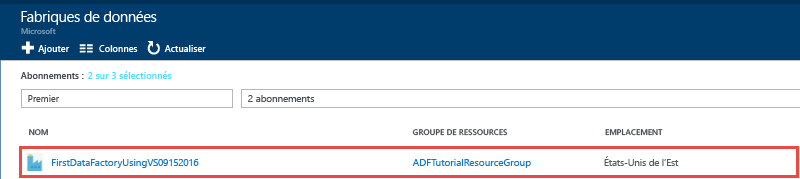
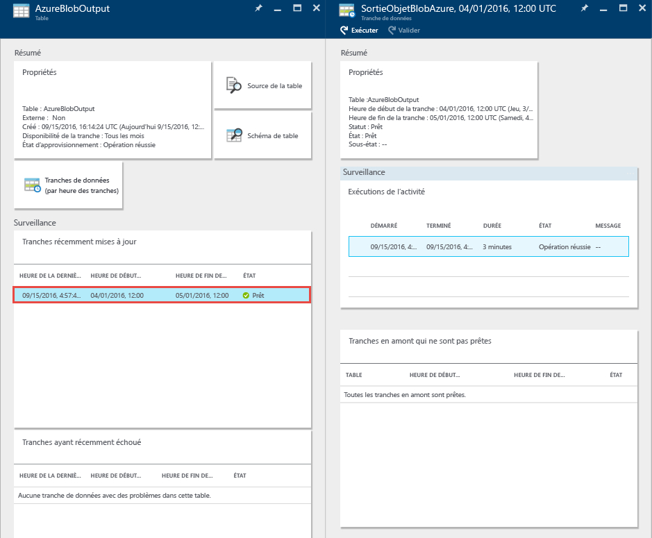
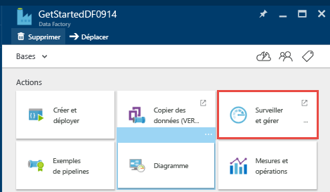
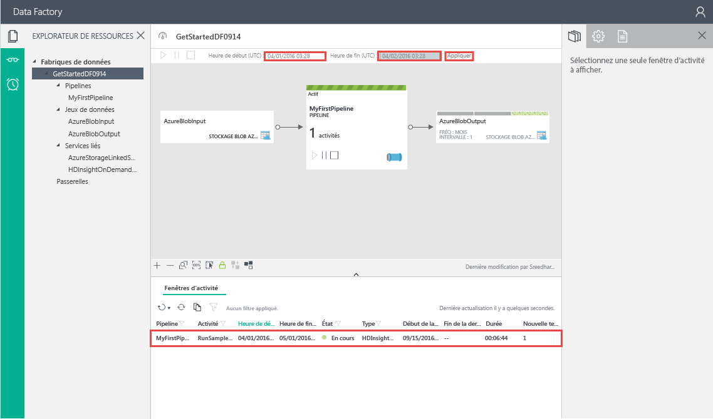
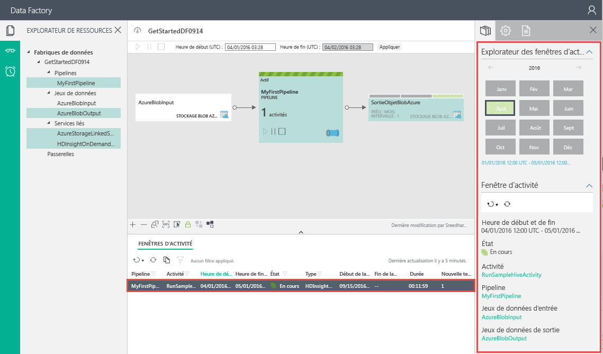

# Didacticiel : Créer votre première fabrique de données Azure à l’aide de Microsoft Visual Studio
> [!div class="op_single_selector"]
> * [Vue d’ensemble et étapes préalables requises](data-factory-build-your-first-pipeline.md)
> * [Portail Azure](data-factory-build-your-first-pipeline-using-editor.md)
> * [Visual Studio](data-factory-build-your-first-pipeline-using-vs.md)
> * [PowerShell](data-factory-build-your-first-pipeline-using-powershell.md)
> * [Modèle Resource Manager](data-factory-build-your-first-pipeline-using-arm.md)
> * [API REST](data-factory-build-your-first-pipeline-using-rest-api.md)
> 
> 

Dans cet article, vous utilisez Microsoft Visual Studio pour créer votre première fabrique de données Azure.

## Composants requis
1. Lisez l’article [Vue d’ensemble du didacticiel](data-factory-build-your-first-pipeline.md) et effectuez les étapes **préalables** .
2. Pour pouvoir publier des entités Data Factory de Visual Studio dans Azure Data Factory, vous devez être un **administrateur de l’abonnement Azure** .
3. Les composants suivants doivent être installés sur votre ordinateur : 
   * Visual Studio 2013 ou Visual Studio 2015
   * Téléchargez le Kit de développement logiciel (SDK) Azure pour Visual Studio 2013 ou Visual Studio 2015. Accédez à la [page de téléchargement d’Azure](https://azure.microsoft.com/downloads/), puis cliquez sur **VS 2013** ou **VS 2015** dans la section **.NET**.
   * Téléchargez le dernier plug-in Azure Data Factory pour Visual Studio : [VS 2013](https://visualstudiogallery.msdn.microsoft.com/754d998c-8f92-4aa7-835b-e89c8c954aa5) ou [VS 2015](https://visualstudiogallery.msdn.microsoft.com/371a4cf9-0093-40fa-b7dd-be3c74f49005). Vous pouvez également mettre à jour le plug-in en procédant comme suit : dans le menu, cliquez sur **Outils** -> **Extensions et mises à jour** -> **En ligne** -> **Galerie Visual Studio** -> **Outils Microsoft Azure Data Factory pour Visual Studio** -> **Mettre à jour**. 

À présent, utilisons Visual Studio pour créer une fabrique de données Azure. 

## Création d’un projet Visual Studio
1. Lancez **Visual Studio 2013** ou **Visual Studio 2015**. Cliquez sur **Fichier**, pointez le curseur de la souris sur **Nouveau**, puis cliquez sur **Projet**. La boîte de dialogue **Nouveau projet** doit s’afficher.  
2. Dans la boîte de dialogue **Nouveau projet**, sélectionnez le modèle **DataFactory**, puis cliquez sur **Projet Data Factory vide**.   
   
    
3. Entrez le **nom** du projet, son **emplacement** et le nom de la **solution**, puis cliquez sur **OK**.
   
    

## Créer des services liés
Une fabrique de données peut avoir un ou plusieurs pipelines. Un pipeline peut contenir une ou plusieurs activités. Par exemple, une activité de copie censée copier des données d’un magasin de données source vers un magasin de données de destination, et une activité Hive HDInsight pour exécuter un script Hive pour transformer des données d’entrée. Pour connaître l’ensemble des sources et des récepteurs pris en charge par l’activité de copie, consultez [Banques de données et formats pris en charge](data-factory-data-movement-activities.md##supported-data-stores-and-formats) . Pour obtenir la liste des services de calcul pris en charge par Data Factory, consultez [Services liés de calcul](data-factory-compute-linked-services.md) . 

Dans cette étape, vous liez votre compte Stockage Azure et un cluster Azure HDInsight à la demande à votre fabrique de données. Le compte Stockage Azure contient les données d’entrée et de sortie pour le pipeline de cet exemple. Le service lié HDInsight est utilisé pour exécuter le script Hive spécifié dans l’activité du pipeline de cet exemple. Identifiez les services de magasin de données/de calcul qui sont utilisés dans votre scénario et les lier à la fabrique de données en créant des services liés.  

Vous spécifiez le nom et les paramètres de la fabrique de données ultérieurement, quand vous publiez votre solution Data Factory.

#### Créer le service lié Azure Storage
Dans cette étape, vous liez votre compte Stockage Azure à votre fabrique de données. Pour les besoins de ce didacticiel, vous utilisez le même compte Stockage Azure pour stocker les données d’entrée/sortie et le fichier de script HQL. 

1. Dans l’Explorateur de solutions, cliquez avec le bouton droit sur **Services liés**, pointez sur **Ajouter**, puis cliquez sur **Nouvel élément**.      
2. Dans la boîte de dialogue **Ajouter un nouvel élément**, sélectionnez **Service lié Azure Storage** dans la liste, puis cliquez sur **Ajouter**. 
3. Remplacez **accountname** et **accountkey** par le nom de votre compte de stockage Azure et par sa clé. Pour découvrir comment obtenir votre clé d’accès de stockage, consultez [Affichage, copie et régénération de clés d’accès de stockage](../storage/storage-create-storage-account.md#view-copy-and-regenerate-storage-access-keys)
   
    
4. Enregistrez le fichier **AzureStorageLinkedService1.json** .

#### Créer le service lié Azure HDInsight
Dans cette étape, vous liez un cluster HDInsight à la demande à votre fabrique de données. Le cluster HDInsight est automatiquement créé lors de l’exécution, puis supprimé une fois le traitement effectué et au terme du délai d’inactivité spécifié. Vous pouvez utiliser votre propre cluster HDInsight au lieu d’utiliser un cluster HDInsight à la demande. Pour plus d’informations, consultez [Services de calcul liés](data-factory-compute-linked-services.md) . 

1. Dans l’**Explorateur de solutions**, cliquez avec le bouton droit sur **Services liés**, pointez sur **Ajouter** puis cliquez sur **Nouvel élément**.
2. Sélectionnez **Service lié à la demande HDInsight** puis cliquez sur **Ajouter**. 
3. Remplacez le code **JSON** par ce qui suit :
   
        {
          "name": "HDInsightOnDemandLinkedService",
          "properties": {
            "type": "HDInsightOnDemand",
            "typeProperties": {
              "version": "3.2",
              "clusterSize": 1,
              "timeToLive": "00:30:00",
              "linkedServiceName": "AzureStorageLinkedService1"
            }
          }
        }
   
    Le tableau suivant décrit les propriétés JSON utilisées dans l'extrait de code :
   
   | Propriété | Description |
   | --- | --- |
   |  Version |Indique que la version de service HDInsight doit être la version 3.2. |
   |  ClusterSize |Spécifie la taille du cluster HDInsight. |
   |  TimeToLive |Spécifie la durée d’inactivité du cluster HDInsight avant sa suppression. |
   |  linkedServiceName |Spécifie le compte de stockage utilisé pour stocker les journaux générés par HDInsight |
   
    Notez les points suivants : 
   
   * La fabrique de données crée pour vous un cluster HDInsight **Windows** avec le code JSON précédent. Vous pouvez également faire en sorte qu’elle crée un cluster HDInsight **Linux** . Pour plus d’informations, voir [Service lié à la demande Azure HDInsight](data-factory-compute-linked-services.md#azure-hdinsight-on-demand-linked-service) . 
   * Vous pouvez utiliser votre **propre cluster HDInsight** au lieu d’utiliser un cluster HDInsight à la demande. Pour plus d’informations, voir [Service lié Azure HDInsight](data-factory-compute-linked-services.md#azure-hdinsight-linked-service) .
   * Le cluster HDInsight crée un **conteneur par défaut** dans le stockage d’objets blob que vous avez spécifié dans le JSON (**linkedServiceName**). HDInsight ne supprime pas ce conteneur lorsque le cluster est supprimé. Ce comportement est normal. Avec le service lié HDInsight disponible à la demande, un cluster HDInsight est créé dès qu’une tranche est traitée, à moins qu’il n’existe un cluster actif (**timeToLive**). Ce cluster est supprimé, une fois le traitement terminé.
     
       Comme un nombre croissant de tranches sont traitées, vous voyez un grand nombre de conteneurs dans votre stockage d’objets blob Azure. Si vous n’en avez pas besoin pour dépanner les travaux, il se peut que vous deviez les supprimer pour réduire les frais de stockage. Le nom de ces conteneurs suit un modèle : « **nomdevotrefabriquededonnéesadf**-**nomduservicelié**-horodatage ». Utilisez des outils tels que [Microsoft Storage Explorer](http://storageexplorer.com/) pour supprimer des conteneurs dans votre stockage d’objets blob Azure.
     
     Pour plus d’informations, voir [Service lié à la demande Azure HDInsight](data-factory-compute-linked-services.md#azure-hdinsight-on-demand-linked-service) . 
4. Enregistrez le fichier **HDInsightOnDemandLinkedService1.json** .

## Créer des jeux de données
Dans cette étape, vous créez des jeux de données afin de représenter les données d’entrée et de sortie pour le traitement Hive. Ces jeux de données font référence au service **AzureStorageLinkedService1** que vous avez créé précédemment dans ce didacticiel. Le service lié pointe vers un compte de stockage Azure, et les jeux de données spécifient le conteneur, le dossier et le nom de fichier dans le stockage qui contient les données d’entrée et de sortie.   

#### Créer le jeu de données d’entrée
1. Dans l’**Explorateur de solutions**, cliquez avec le bouton droit sur **Tables**, pointez sur **Ajouter**, puis cliquez sur **Nouvel élément**. 
2. Sélectionnez **Objet blob Azure** dans la liste, changez le nom du fichier en **InputDataSet.json**, puis cliquez sur **Ajouter**.
3. Remplacez le **code JSON** dans l’éditeur par ce qui suit : 
   
    Dans l’extrait de code JSON, vous créez un jeu de données appelé **AzureBlobInput** , qui représente les données d’entrée pour une activité dans le pipeline. En outre, vous spécifiez que les données d’entrée se trouvent dans le conteneur d’objets blob nommé **adfgetstarted** et dans le dossier nommé **inputdata**
   
        {
            "name": "AzureBlobInput",
            "properties": {
                "type": "AzureBlob",
                "linkedServiceName": "AzureStorageLinkedService1",
                "typeProperties": {
                    "fileName": "input.log",
                    "folderPath": "adfgetstarted/inputdata",
                    "format": {
                        "type": "TextFormat",
                        "columnDelimiter": ","
                    }
                },
                "availability": {
                    "frequency": "Month",
                    "interval": 1
                },
                "external": true,
                "policy": {}
            }
        } 
   
    Le tableau suivant décrit les propriétés JSON utilisées dans l'extrait de code :
   
   | Propriété | Description |
   |:--- |:--- |
   | type |La propriété type est définie sur AzureBlob, car les données se trouvent dans le stockage d’objets blob Azure. |
   | linkedServiceName |fait référence au service AzureStorageLinkedService1 que vous avez créé précédemment. |
   | fileName |Cette propriété est facultative. Si vous omettez cette propriété, tous les fichiers spécifiés dans le paramètre folderPath sont récupérés. Dans le cas présent, seul le fichier input.log est traité. |
   | type |Les fichiers journaux sont au format texte : nous utilisons donc TextFormat. |
   | columnDelimiter |Les colonnes des fichiers journaux sont délimitées par une virgule (,) |
   | frequency/interval |La fréquence est définie sur Mois et l’intervalle est 1, ce qui signifie que les segments d’entrée sont disponibles mensuellement. |
   | external |Cette propriété a la valeur true si les données d’entrée ne sont pas générées par le service Data Factory. |
4. Enregistrez le fichier **InputDataset.json** . 

#### Créer un jeu de données de sortie
Vous allez maintenant créer le jeu de données de sortie pour représenter les données de sortie stockées dans le stockage d’objets blob Azure. 

1. Dans l’**Explorateur de solutions**, cliquez avec le bouton droit sur **Tables**, pointez sur **Ajouter**, puis cliquez sur **Nouvel élément**. 
2. Sélectionnez **Objet blob Azure** dans la liste, changez le nom du fichier en **OutputDataset.json**, puis cliquez sur **Ajouter**. 
3. Remplacez le **code JSON** dans l’éditeur par ce qui suit : 
   
    Dans l’extrait de code JSON, vous créez un jeu de données appelé **AzureBlobOutput**et spécifiez la structure des données produites par le script Hive. Indiquez aussi que les résultats sont stockés dans le conteneur d’objets blob appelé **adfgetstarted** et dans le dossier appelé **partitioneddata**. La section **availability** spécifie que le jeu de données de sortie est produit tous les mois.
   
        {
          "name": "AzureBlobOutput",
          "properties": {
            "type": "AzureBlob",
            "linkedServiceName": "AzureStorageLinkedService1",
            "typeProperties": {
              "folderPath": "adfgetstarted/partitioneddata",
              "format": {
                "type": "TextFormat",
                "columnDelimiter": ","
              }
            },
            "availability": {
              "frequency": "Month",
              "interval": 1
            }
          }
        }
   
    Consultez la section **Créer le jeu de données d’entrée** pour obtenir une description de ces propriétés. Vous ne définissez pas la propriété externe sur un jeu de données de sortie, car le jeu de données est produit par le service Data Factory.
4. Enregistrez le fichier **OutputDataset.json** .

### Création d’un pipeline
Dans cette étape, vous créez votre premier pipeline avec une activité **HDInsightHive** . La tranche d’entrée est disponible mensuellement (fréquence : Mois, intervalle : 1), la tranche de sortie est produite mensuellement et la propriété du planificateur pour l’activité est également définie sur Mensuellement. Les paramètres pour le jeu de données de sortie et le planificateur d’activité doivent correspondre. À ce stade, c'est le jeu de données de sortie qui pilote la planification : vous devez donc créer un jeu de données de sortie même si l’activité ne génère aucune sortie. Si l’activité ne prend aucune entrée, vous pouvez ignorer la création du jeu de données d’entrée. Les propriétés utilisées dans le code JSON suivant sont expliquées à la fin de cette section.

1. Dans l’**Explorateur de solutions**, cliquez avec le bouton droit sur **Pipelines**, pointez sur **Ajouter**, puis cliquez sur **Nouvel élément.** 
2. Sélectionnez **Pipeline de transformation Hive** dans la liste, puis cliquez sur **Ajouter**. 
3. Remplacez le code **JSON** par l'extrait suivant :
   
   > [!IMPORTANT]
   > remplacez **storageaccountname** par le nom de votre compte de stockage.
   > 
   > 
   
        {
            "name": "MyFirstPipeline",
            "properties": {
                "description": "My first Azure Data Factory pipeline",
                "activities": [
                    {
                        "type": "HDInsightHive",
                        "typeProperties": {
                            "scriptPath": "adfgetstarted/script/partitionweblogs.hql",
                            "scriptLinkedService": "AzureStorageLinkedService1",
                            "defines": {
                                "inputtable": "wasb://adfgetstarted@<storageaccountname>.blob.core.windows.net/inputdata",
                                "partitionedtable": "wasb://adfgetstarted@<storageaccountname>.blob.core.windows.net/partitioneddata"
                            }
                        },
                        "inputs": [
                            {
                                "name": "AzureBlobInput"
                            }
                        ],
                        "outputs": [
                            {
                                "name": "AzureBlobOutput"
                            }
                        ],
                        "policy": {
                            "concurrency": 1,
                            "retry": 3
                        },
                        "scheduler": {
                            "frequency": "Month",
                            "interval": 1
                        },
                        "name": "RunSampleHiveActivity",
                        "linkedServiceName": "HDInsightOnDemandLinkedService"
                    }
                ],
                "start": "2016-04-01T00:00:00Z",
                "end": "2016-04-02T00:00:00Z",
                "isPaused": false
            }
        }
   
     Dans l’extrait de code JSON, vous créez un pipeline qui se compose d’une seule activité utilisant Hive pour traiter des données sur un cluster HDInsight.
   
    Dans l’extrait de code JSON, vous créez un pipeline qui se compose d’une seule activité utilisant Hive pour traiter des données sur un cluster HDInsight.
   
    Le fichier de script Hive, **partitionweblogs.hql**, est stocké dans le compte de stockage Azure (spécifié par le service scriptLinkedService, appelé **AzureStorageLinkedService1**) et dans le dossier **script** du conteneur **adfgetstarted**.
   
    La section **defines** est utilisée pour spécifier les paramètres d’exécution passés au script Hive comme valeurs de configuration Hive (par exemple ${hiveconf:inputtable}, ${hiveconf:partitionedtable}).
   
    Les propriétés **start** et **end** du pipeline spécifient la période active du pipeline.
   
    Dans l’activité JSON, vous spécifiez que le script Hive s’exécute sur le calcul spécifié par le service **linkedServiceName** – **HDInsightOnDemandLinkedService**.
   
   > [!NOTE]
   > Consultez [Anatomie d’un pipeline](data-factory-create-pipelines.md#anatomy-of-a-pipeline) pour plus d’informations sur les propriétés JSON utilisées dans l’exemple. 
   > 
   > 
4. Enregistrez le fichier **HiveActivity1.json** .

### Ajouter partitionweblogs.hql et input.log comme dépendance
1. Cliquez avec le bouton droit sur **Dépendances** dans la fenêtre **Explorateur de solutions**, pointez sur **Ajouter**, puis cliquez sur **Élément existant**.  
2. Accédez au dossier **C:\ADFGettingStarted**, sélectionnez les fichiers **partitionweblogs.hql** et **input.log**, puis cliquez sur **Ajouter**. Vous avez créé ces deux fichiers dans le cadre de la configuration requise dans la [Vue d’ensemble du didacticiel](data-factory-build-your-first-pipeline.md).

Quand vous publiez la solution à l’étape suivante, le fichier **partitionweblogs.hql** est chargé dans le dossier scripts du conteneur d’objets blob **adfgetstarted**.   

### Publier/déployer des entités Data Factory
1. Dans l’Explorateur de solutions, cliquez avec le bouton droit sur le projet, puis cliquez sur **Publier**. 
2. Si la boîte de dialogue **Connectez-vous à votre compte Microsoft** s’affiche, saisissez vos informations d’identification pour le compte associé à l’abonnement Azure, puis cliquez sur **Se connecter**.
3. La boîte de dialogue suivante doit s’afficher :
   
   
4. Dans la page Configurer une fabrique de données, procédez comme suit : 
   
   1. Sélectionnez l’option **Créer une fabrique de données** .
   2. Entrez un **nom** unique pour la fabrique de données. Par exemple : **FirstDataFactoryUsingVS09152016**. Le nom doit être globalement unique.  

        > [AZURE.IMPORTANT] Si vous recevez l’erreur **Le nom de la fabrique de données « FirstDataFactoryUsingVS » n’est pas disponible** au moment de la publication, changez le nom (par exemple en votrenomFirstDataFactoryUsingVS). Consultez la rubrique [Data Factory - Règles d'affectation des noms](data-factory-naming-rules.md) pour savoir comment nommer les artefacts Data Factory.
3. Sélectionnez l’abonnement approprié pour le champ **Abonnement** .

        > [AZURE.IMPORTANT] Si vous ne voyez pas les abonnements, vérifiez que vous êtes connecté à l’aide d’un compte administrateur ou coadministrateur de l’abonnement.  

    4. Sélectionnez le **groupe de ressources** pour la fabrique de données à créer. 
    5. Sélectionnez la **région** pour la fabrique de données. 
    6. Cliquez sur **Suivant** pour basculer vers la page **Publier des éléments**. (Utilisez la touche **TABULATION** pour passer au champ Nom si le bouton **Suivant** est désactivé.) 
1. Dans la page **Publier des éléments**, vérifiez que toutes les entités de fabriques de données sont sélectionnées, puis cliquez sur **Suivant** pour basculer vers la page **Résumé**.     
2. Passez en revue le résumé, puis cliquez sur **Suivant** pour démarrer le processus de déploiement et afficher l’**état du déploiement**.
3. Dans la page **État du déploiement** , vous devez voir l’état du processus de déploiement. Une fois le déploiement terminé, cliquez sur Terminer. 

Quelques points importants à prendre en compte : 

* Si vous recevez le message d’erreur : «**L’abonnement n’est pas inscrit pour utiliser l’espace de noms Microsoft.DataFactory**», effectuez l’une des opérations suivantes et essayez de relancer la publication : 
  
  * Dans Azure PowerShell, exécutez la commande suivante pour enregistrer le fournisseur Data Factory. 
    
          Register-AzureRmResourceProvider -ProviderNamespace Microsoft.DataFactory
    
      Vous pouvez exécuter la commande suivante pour confirmer que le fournisseur Data Factory est bien enregistré. 
    
          Get-AzureRmResourceProvider
  * Connectez-vous au [portail Azure](https://portal.azure.com) à l’aide de l’abonnement Azure et accédez à un panneau Data Factory (ou) créez une fabrique de données dans le portail Azure. Cette action enregistre automatiquement le fournisseur.
* Le nom de la fabrique de données pourra être enregistré en tant que nom DNS et devenir ainsi visible publiquement.
* Pour créer des instances Data Factory, vous devez être administrateur ou co-administrateur de l’abonnement Azure

## Surveillance d’un pipeline
### Surveillance d’un pipeline à l’aide de la Vue de diagramme
1. Connectez-vous au [portail Azure](https://portal.azure.com/)et procédez comme suit :
   1. Cliquez sur **Plus de services**, puis sur **Fabriques de données**.
        
   2. Sélectionnez le nom de votre fabrique de données (par exemple : **FirstDataFactoryUsingVS09152016**) dans la liste des fabriques de données. 
       
2. Dans la page d’accueil de votre fabrique de données, cliquez sur **Diagramme**.
   
    
3. Dans la Vue de diagramme, une vue d’ensemble des pipelines et des jeux de données utilisés dans ce didacticiel s’affiche.
   
     
4. Pour afficher toutes les activités du pipeline, cliquez avec le bouton droit sur le pipeline dans le diagramme, puis cliquez sur Ouvrir un pipeline. 
   
    
5. Vérifiez que l’activité HDInsightHive est bien dans le pipeline. 
   
    
   
    Pour revenir à la vue précédente, cliquez sur **Fabrique de données** dans le menu de navigation du haut. 
6. Dans la **Vue de diagramme**, double-cliquez sur le jeu de données **AzureBlobInput**. Vérifiez que l’état du segment est **Prêt** . Plusieurs minutes peuvent être nécessaires avant que le segment n’apparaisse avec l’état Prêt. Si rien ne se produit au bout d’un moment, vérifiez que le fichier d’entrée (input.log) est placé dans le conteneur (adfgetstarted) et le dossier (inputdata) appropriés.
   
   
7. Cliquez sur **X** pour fermer le panneau **AzureBlobInput**. 
8. Dans la **Vue de diagramme**, double-cliquez sur le jeu de données **AzureBlobOutput**. La tranche est en cours de traitement.
   
   
9. Quand le traitement est terminé, l’état de la tranche est **Prêt** .
   
   > [!IMPORTANT]
   > La création d’un cluster HDInsight à la demande prend généralement un certain temps (environ 20 minutes). Le pipeline devrait donc traiter la tranche en **30 minutes environ** .  
   > 
   > 
   
        
10. Quand l’état du segment est **Prêt**, vérifiez la présence des données de sortie dans le dossier **partitioneddata** du conteneur **adfgetstarted** de votre stockage d’objets blob.  
    
    
11. Cliquez sur la tranche pour en afficher les détails dans le panneau **Tranche de données** .
    
      
12. Cliquez sur une exécution d’activité (activité Hive dans notre scénario) dans la **liste Exécutions d’activité** pour en afficher les détails dans la fenêtre **Détails de l’exécution d’activité**.   
        
    
    Dans les fichiers journaux, vous pouvez voir la requête Hive qui a été exécutée et son état. Ces journaux sont utiles pour résoudre les problèmes.  

Consultez [Surveiller les jeux de données et le pipeline](data-factory-monitor-manage-pipelines.md) pour obtenir des instructions sur l’utilisation du portail Azure afin de surveiller le pipeline et les jeux de données que vous avez créés dans ce didacticiel.

### Surveiller le pipeline à l’aide de l’application de surveillance et de gestion
Vous pouvez également utiliser l’application de surveillance et de gestion pour surveiller vos pipelines. Pour en savoir plus sur l’utilisation de cette application, consultez l’article [Surveiller et gérer les pipelines Azure Data Factory à l’aide de l’application de surveillance et gestion](data-factory-monitor-manage-app.md).

1. Cliquez sur la vignette Surveiller et gérer.
   
     
2. L’application de surveillance et de gestion devrait s’afficher. Modifiez l’**heure de début** et l’**heure de fin** pour qu’elles correspondent aux heures de début (04-01-2016 12:00 AM) et de fin (04-02-2016 12:00 AM) de votre pipeline, puis cliquez sur **Appliquer**.
   
     
3. Sélectionnez une fenêtre d’activité dans la liste des fenêtres d’activité pour en afficher les détails. 
    

> [!IMPORTANT]
> Le fichier d’entrée sera supprimé lorsque la tranche est traitée avec succès. Par conséquent, si vous souhaitez réexécuter la tranche ou refaire le didacticiel, chargez le fichier d’entrée (input.log) dans le dossier inputdata du conteneur adfgetstarted.
> 
> 

## Utiliser l’Explorateur de serveurs pour passer en revue la fabrique des données
1. Dans **Visual Studio**, cliquez sur **Affichage** dans le menu, puis sur **Explorateur de serveurs**.
2. Dans la fenêtre Explorateur de serveurs, développez **Azure**, puis **Data Factory**. Si la boîte de dialogue **Connectez-vous à Visual Studio** s’affiche, saisissez le **compte** associé à votre abonnement Azure, puis cliquez sur **Continuer**. Saisissez le **mot de passe**, puis cliquez sur **Se connecter**. Visual Studio essaie d’obtenir des informations sur toutes les fabriques de données Azure contenues dans votre abonnement. L’état de cette opération s’affiche dans la fenêtre **Liste des tâches de Data Factory** .
   
    
3. Vous pouvez cliquer avec le bouton droit sur une fabrique de données et sélectionner **Exporter la fabrique de données vers le nouveau projet** pour créer un projet Visual Studio basé sur une fabrique de données existante.
   
    

## Mettre à jour des outils Data Factory pour Visual Studio
Pour mettre à jour des outils Azure Data Factory pour Visual Studio, procédez comme suit :

1. Dans le menu, cliquez sur **Outils**, puis sélectionnez **Extensions et mises à jour**.
2. Dans le volet de gauche, sélectionnez **Mises à jour**, puis **Galerie Visual Studio**.
3. Sélectionnez **Outils Azure Data Factory pour Visual Studio**, puis cliquez sur **Mettre à jour**. Si cette entrée n’est pas affichée, c’est que vous possédez déjà la dernière version de ces outils. 

## Utiliser des fichiers de configuration
Vous pouvez utiliser des fichiers de configuration dans Visual Studio pour configurer les propriétés des services/tableaux/pipelines liés différemment pour chaque environnement. 

Examinez la définition JSON suivante pour un service lié Azure Storage. Spécifiez **connectionString** avec différentes valeurs pour accountname et accountkey, en fonction de l’environnement (dév./test/production) sur lequel vous déployez des entités Data Factory. Vous pouvez parvenir à ce comportement en utilisant un fichier de configuration distinct pour chaque environnement. 

    {
        "name": "StorageLinkedService",
        "properties": {
            "type": "AzureStorage",
            "description": "",
            "typeProperties": {
                "connectionString": "DefaultEndpointsProtocol=https;AccountName=<accountname>;AccountKey=<accountkey>"
            }
        }
    } 

### Ajouter un fichier de configuration
Ajoutez un fichier de configuration pour chaque environnement en effectuant les opérations suivantes :   

1. Cliquez avec le bouton droit de la souris sur le projet Data Factory dans votre solution Visual Studio, pointez sur **Ajouter**, puis cliquez sur **Nouvel élément**.
2. Sélectionnez **Config** dans la liste des modèles installés sur la gauche, choisissez **Fichier de configuration**, entrez un **nom** pour ce fichier, puis cliquez sur **Ajouter**.
   
    
3. Ajoutez les paramètres de configuration et leurs valeurs selon le format suivant.
   
        {
            "$schema": "http://datafactories.schema.management.azure.com/vsschemas/V1/Microsoft.DataFactory.Config.json",
            "AzureStorageLinkedService1": [
                {
                    "name": "$.properties.typeProperties.connectionString",
                    "value": "DefaultEndpointsProtocol=https;AccountName=<accountname>;AccountKey=<accountkey>"
                }
            ],
            "AzureSqlLinkedService1": [
                {
                    "name": "$.properties.typeProperties.connectionString",
                    "value":  "Server=tcp:spsqlserver.database.windows.net,1433;Database=spsqldb;User ID=spelluru;Password=Sowmya123;Trusted_Connection=False;Encrypt=True;Connection Timeout=30"
                }
            ]
        }
   
    Cet exemple configure la propriété connectionString d’un service lié Azure Storage et d’un service lié SQL Azure. Notez que la syntaxe de spécification du nom est [JsonPath](http://goessner.net/articles/JsonPath/).   
   
    Si JSON est doté d’une propriété ayant un tableau de valeurs comme indiqué dans le code suivant :  
   
        "structure": [
              {
                  "name": "FirstName",
                "type": "String"
              },
              {
                "name": "LastName",
                "type": "String"
            }
        ],
   
    Configurez les propriétés comme indiqué dans le fichier de configuration suivant (utilisez indexation de base zéro) : 
   
        {
            "name": "$.properties.structure[0].name",
            "value": "FirstName"
        }
        {
            "name": "$.properties.structure[0].type",
            "value": "String"
        }
        {
            "name": "$.properties.structure[1].name",
            "value": "LastName"
        }
        {
            "name": "$.properties.structure[1].type",
            "value": "String"
        }

### Noms de propriétés avec des espaces
Si un nom de propriété comporte des espaces, utilisez des crochets comme indiqué dans l’exemple suivant (nom de serveur de base de données) : 

     {
         "name": "$.properties.activities[1].typeProperties.webServiceParameters.['Database server name']",
         "value": "MyAsqlServer.database.windows.net"
     }

### Déployer une solution à l’aide d’une configuration
Lorsque vous publiez des entités Azure Data Factory dans Visual Studio, vous pouvez spécifier la configuration que vous souhaitez utiliser pour cette opération de publication. 

Pour publier des entités dans un projet Azure Data Factory à l’aide d’un fichier de configuration :   

1. Cliquez avec le bouton droit sur le projet Data Factory, puis cliquez sur **Publier** pour afficher la boîte de dialogue **Publier des éléments**. 
2. Dans la page **Configurer une fabrique de données**, sélectionnez une fabrique de données existante ou spécifiez les valeurs pour en créer une, puis cliquez sur **Suivant**.   
3. La page **Publier des éléments** contient une liste déroulante avec les configurations disponibles pour le champ **Sélectionner une configuration de déploiement**.
   
    
4. Sélectionnez le **fichier de configuration** que vous souhaitez utiliser, puis cliquez sur **Suivant**. 
5. Vérifiez que vous voyez bien le nom du fichier JSON dans la page **Résumé**, puis cliquez sur **Suivant**. 
6. Une fois l’opération de déploiement terminée, cliquez sur **Terminer** . 

Au cours du déploiement, les valeurs du fichier de configuration sont utilisées pour définir celles des propriétés des fichiers JSON pour les entités Data Factory avant que les entités ne soient déployées sur le service Azure Data Factory.   

## Résumé
Dans ce didacticiel, vous avez créé une fabrique de données Azure pour traiter des données en exécutant le script Hive sur un cluster Hadoop HDInsight. Vous avez effectué les étapes suivantes dans le portail Azure à l’aide de Data Factory Editor :  

1. Création d’une **fabrique de données**Azure.
2. Création de deux **services liés**:
   1. **Azure Storage** pour lier à la fabrique de données votre stockage d’objets blob Azure contenant les fichiers d’entrée/sortie.
   2. **Azure HDInsight** à la demande pour lier à la fabrique de données un cluster Hadoop HDInsight à la demande. Azure Data Factory crée un cluster Hadoop HDInsight juste-à-temps pour traiter les données d’entrée et produire des données de sortie. 
3. Création de deux **jeux de données**qui décrivent les données d’entrée et de sortie pour l’activité HDInsight Hive dans le pipeline. 
4. Création d’un **pipeline** avec une activité **Hive HDInsight**.  

## Étapes suivantes
Dans cet article, vous avez créé un pipeline avec une activité de transformation (Activité HDInsight) qui exécute un script Hive sur un cluster HDInsight à la demande. Pour voir comment utiliser une activité de copie pour copier des données depuis un objet blob Azure vers Azure SQL, consultez le [Didacticiel : copie de données depuis un objet blob Azure vers Azure SQL](data-factory-copy-data-from-azure-blob-storage-to-sql-database.md).

## Voir aussi
| Rubrique | Description |
|:--- |:--- |
| [Activités de transformation des données](data-factory-data-transformation-activities.md) |Cet article fournit une liste des activités de transformation de données (par exemple, la transformation Hive HDInsight que vous avez utilisée dans ce didacticiel) prises en charge par Azure Data Factory. |
| [Planification et exécution](data-factory-scheduling-and-execution.md) |Cet article explique les aspects de la planification et de l’exécution du modèle d’application Azure Data Factory. |
| [Pipelines](data-factory-create-pipelines.md) |Cet article vous aide à comprendre les pipelines et les activités dans Azure Data Factory, et à les utiliser dans l’optique de créer des workflows pilotés par les données de bout en bout pour votre scénario ou votre entreprise. |
| [Groupes de données](data-factory-create-datasets.md) |Cet article vous aide à comprendre les jeux de données dans Azure Data Factory. |
| [Surveiller et gérer les pipelines Azure Data Factory à l’aide de la nouvelle application de surveillance et gestion.](data-factory-monitor-manage-app.md) |Cet article décrit comment surveiller, gérer et déboguer les pipelines à l’aide de l’application de surveillance et gestion. |

<!--HONumber=Nov16_HO2-->

