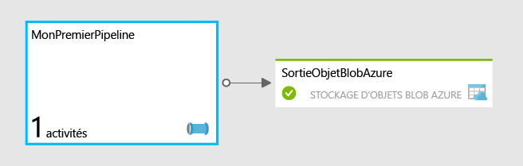

<properties
	pageTitle="Concevez votre premier pipeline en utilisant Azure Data Factory"
	description="Ce didacticiel vous montre comment créer un pipeline de données d'exemple qui transforme des données à l'aide d'Azure HDInsight."
	services="data-factory"
	documentationCenter=""
	authors="spelluru"
	manager="jhubbard"
	editor="monicar"/>

<tags
	ms.service="data-factory"
	ms.workload="data-services"
	ms.tgt_pltfrm="na"
	ms.devlang="na"
	ms.topic="get-started-article" 
	ms.date="10/06/2015"
	ms.author="spelluru"/>

# Concevez votre premier pipeline en utilisant Azure Data Factory
> [AZURE.SELECTOR]
- [Tutorial Overview](data-factory-build-your-first-pipeline.md)
- [Using Data Factory Editor](data-factory-build-your-first-pipeline-using-editor.md)
- [Using PowerShell](data-factory-build-your-first-pipeline-using-powershell.md)
- [Using Visual Studio](data-factory-build-your-first-pipeline-using-vs.md)

Cet article va vous aider à vous familiariser avec la création de votre premier pipeline et son déploiement vers Azure Data Factory.

> [AZURE.NOTE]Cet article ne fournit pas une vue d'ensemble conceptuelle du service Azure Data Factory. Pour obtenir une présentation détaillée de ce service, consultez l'article [Présentation d’Azure Data Factory](data-factory-introduction.md).

## Vue d'ensemble du didacticiel
Ce didacticiel présente les étapes nécessaires pour préparer et exécuter votre premier pipeline. Vous allez créer des pipelines et indiquer toutes les ressources nécessaires depuis le début.

Si vous souhaitez explorer rapidement les différentes fonctionnalités de la fabrique de données, sans partir de zéro, vous pouvez utiliser les exemples que nous mettons à disposition dans le portail Azure en version préliminaire. Voir [Mise à jour d’Azure Data Factory : exemple de déploiement simplifié](http://azure.microsoft.com/blog/2015/04/24/azure-data-factory-update-simplified-sample-deployment/) pour connaître la procédure à suivre pour déployer un exemple de projet concret à l'aide du portail Azure en version préliminaire.

## Conditions préalables
Avant de commencer ce didacticiel, vous devez disposer des éléments suivants :

1.	**Un abonnement Azure** : si vous n’en possédez pas, vous pouvez créer un compte d’essai Azure gratuit en quelques minutes. Consultez l’article [Essai gratuit](http://azure.microsoft.com/pricing/free-trial/) sur la façon d’obtenir un compte d'essai gratuit.

2.	**Stockage Azure** : dans ce didacticiel, vous allez utiliser un compte de stockage Azure pour stocker des données. Si vous ne possédez pas de compte de stockage Azure, consultez l’article [Créer un compte de stockage](../storage-create-storage-account/#create-a-storage-account). Après avoir créé le compte de stockage, vous devrez obtenir la clé du compte utilisée pour accéder au stockage. Voir [Affichage, copie et régénération de clés d’accès de stockage](../storage-create-storage-account/#view-copy-and-regenerate-storage-access-keys).

## Sujets traités dans ce didacticiel	
Azure Data Factory permet de composer des tâches de déplacement et de traitement de données dans le cadre d’un flux de travail orienté données. Vous allez apprendre à créer votre premier pipeline qui s’appuie sur HDInsight pour transformer et analyser des journaux Web sur une base mensuelle.

Dans ce didacticiel, vous allez effectuer les étapes suivantes :

1.	Créer une fabrique de données.
2.	Créer les services liés suivants :
	1.	**Compte de stockage Azure** : le compte de stockage Azure permet de stocker les fichiers utilisés par le cluster HDInsight à la demande.
	2.	**Cluster HDInsight à la demande** : un cluster HDInsight démarre sur demande pour transformer et analyser les données.
3.	Créer le jeu de données de sortie 
4.	Créez le pipeline qui exécute un script Hive et stocke le résultat dans le jeu de données de sortie. Le script Hive crée d'abord une table externe, en référençant les données brutes de journal Web stockées dans le compte de stockage blob Azure. L'étape suivante du script Hive consiste à partitionner les données brutes par année et par mois.

Votre premier pipeline, appelé **MyFirstPipeline**, utilise une activité Hive pour transformer et analyser des journaux Web qui seront déployés dans le cadre du cluster HDInsight et stockés dans **/HdiSamples/WebsiteLogSampleData/SampleLog/**.

Après l'exécution du script Hive, les résultats seront stockés dans un conteneur de stockage d'objets blob Azure : **data/partitioneddata**.

La disponibilité définie sur le jeu de données **AzureBlobOutput** détermine la fréquence d’exécution de l’activité Hive. Dans ce didacticiel, elle est définie sur une base mensuelle.

## Préparer le stockage Azure en vue du didacticiel
En premier lieu, vous devez préparer le compte de stockage Azure et ses fichiers nécessaires pour commencer ce didacticiel.

1. Ouvrez le Bloc-notes, collez le texte suivant, puis enregistrez-le sous le nom **partitionweblogs.hql** dans le dossier C:\\adfgettingstarted sur le disque dur. Les scripts Hive créent deux tables externes : **WebLogsRaw** et **WebLogsPartitioned**.

		set hive.exec.dynamic.partition.mode=nonstrict;
		
		DROP TABLE IF EXISTS WebLogsRaw; 
		CREATE TABLE WebLogsRaw (
		  date  date,
		  time  string,
		  ssitename string,
		  csmethod  string,
		  csuristem  string,
		  csuriquery string,
		  sport int,
		  susername string,
		  cipcsUserAgent string,
		  csCookie string,
		  csReferer string,
		  cshost  string,
		  scstatus  int,
		  scsubstatus  int,
		  scwin32status  int,
		  scbytes int,
		  csbytes int,
		  timetaken int
		)
		ROW FORMAT DELIMITED FIELDS TERMINATED BY ' '
		LINES TERMINATED BY '\n' 
		tblproperties ("skip.header.line.count"="2");
		
		LOAD DATA INPATH '/HdiSamples/WebsiteLogSampleData/SampleLog/909f2b.log' OVERWRITE INTO TABLE WebLogsRaw;
		
		DROP TABLE IF EXISTS WebLogsPartitioned ; 
		create external table WebLogsPartitioned (  
		  date  date,
		  time  string,
		  ssitename string,
		  csmethod  string,
		  csuristem  string,
		  csuriquery string,
		  sport int,
		  susername string,
		  cipcsUserAgent string,
		  csCookie string,
		  csReferer string,
		  cshost  string,
		  scstatus  int,
		  scsubstatus  int,
		  scwin32status  int,
		  scbytes int,
		  csbytes int,
		  timetaken int
		)
		partitioned by ( year int, month int)
		ROW FORMAT DELIMITED FIELDS TERMINATED BY ',' 
		STORED AS TEXTFILE 
		LOCATION '${hiveconf:partitionedtable}';
		
		INSERT INTO TABLE WebLogsPartitioned  PARTITION( year , month) 
		SELECT
		  date,
		  time,
		  ssitename,
		  csmethod,
		  csuristem,
		  csuriquery,
		  sport,
		  susername,
		  cipcsUserAgent,
		  csCookie,
		  csReferer,
		  cshost,
		  scstatus,
		  scsubstatus,
		  scwin32status,
		  scbytes,
		  csbytes,
		  timetaken,
		  year(date),
		  month(date)
		FROM WebLogsRaw
	
 
2. Pour préparer le stockage Azure en vue du didacticiel, procédez comme suit :
	1. Téléchargez la [dernière version d’**AzCopy**](http://aka.ms/downloadazcopy) ou la [version préliminaire la plus récente](http://aka.ms/downloadazcopypr). Consultez l’article [Utilisation d’AzCopy](../storage/storage-use-azcopy.md) pour obtenir des instructions sur l’utilisation de l’utilitaire.
	2. Après l'installation d'AzCopy, vous pouvez l'ajouter au chemin d'accès système en exécutant la commande suivante à une invite de commandes. 
	
			set path=%path%;C:\Program Files (x86)\Microsoft SDKs\Azure\AzCopy			 

	3. Accédez au dossier c:\\adfgettingstarted et exécutez la commande suivante pour charger le fichier .HQL de Hive dans le compte de stockage. Remplacez **StorageAccountName** par le nom de votre compte de stockage et **Storage Key** par la clé de compte de stockage.

			AzCopy /Source:. /Dest:https://<StorageAccountName>.blob.core.windows.net/script /DestKey:<Storage Key>

		> [AZURE.NOTE]La commande ci-dessus crée un conteneur nommé **script** dans votre stockage d'objets Blob Azure et copie le fichier **partitionweblogs.hql** depuis votre disque local dans le conteneur d'objets Blob.
	>
	5. Une fois que le fichier a été chargé, vous verrez la sortie suivante d’AzCopy.
	
			Finished 1 of total 1 file(s).
			[2015/06/15 15:47:13] Transfer summary:
			-----------------
			Total files transferred: 1
			Transfer successfully:   1
			Transfer skipped:        0
			Transfer failed:         0
			Elapsed time:            00.00:00:01

Effectuez les actions suivantes :

- Cliquez sur le lien [Utilisation de Data Factory Editor](data-factory-build-your-first-pipeline-using-editor.md) situé dans la partie supérieure pour effectuer le didacticiel à l'aide de Data Factory Editor, qui fait partie du portail Azure.
- Cliquez sur le lien [Utilisation de PowerShell](data-factory-build-your-first-pipeline-using-powershell.md) situé dans la partie supérieure pour effectuer le didacticiel à l'aide d'Azure PowerShell.
- Cliquez sur le lien [Utilisation de Visual Studio](data-factory-build-your-first-pipeline-using-vs.md) situé dans la partie supérieure pour suivre le didacticiel à l’aide de Visual Studio. 

## Envoyer des commentaires
Nous souhaiterions vraiment obtenir vos commentaires sur cet article. Prenez quelques minutes pour nous envoyer vos commentaires par [courrier électronique](mailto:adfdocfeedback@microsoft.com?subject=data-factory-build-your-first-pipeline.md).

<!---HONumber=Oct15_HO2-->