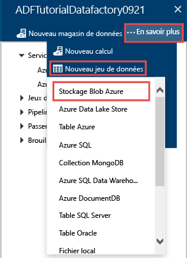
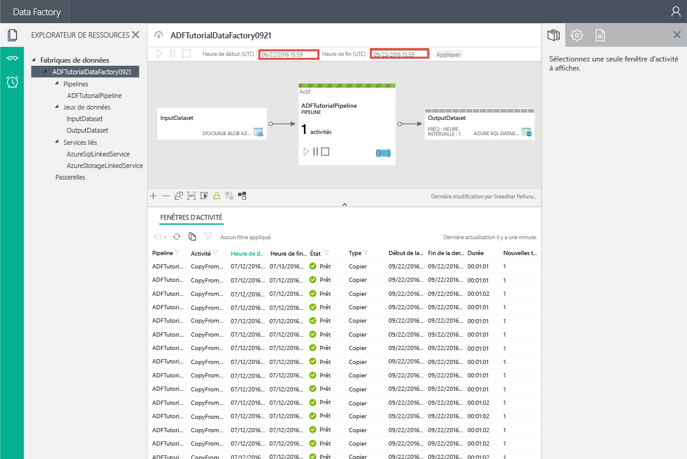
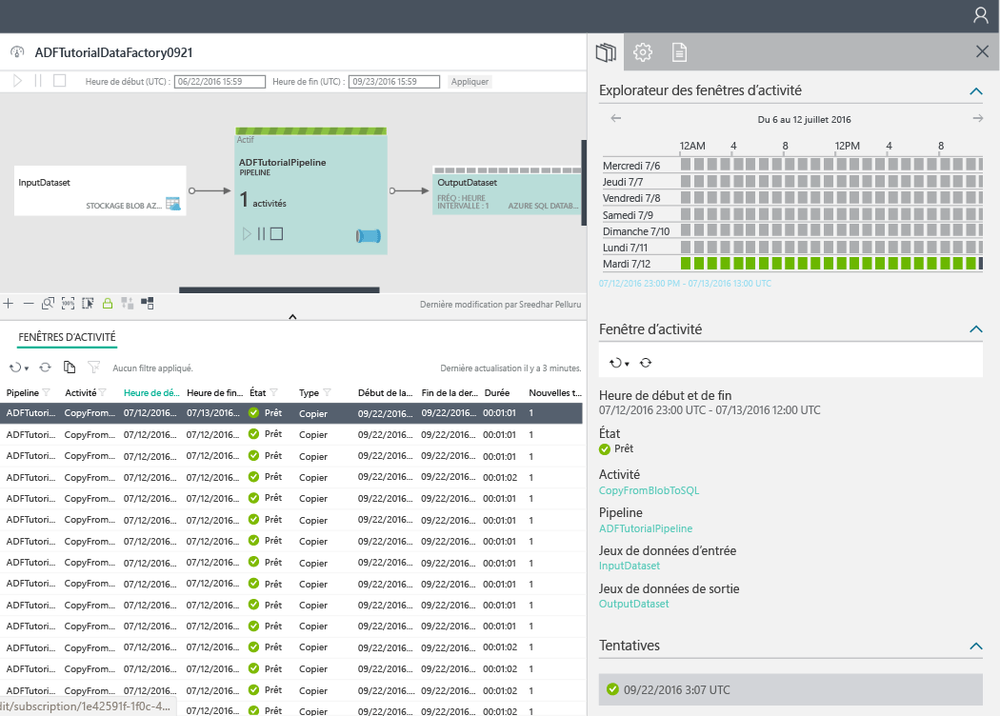
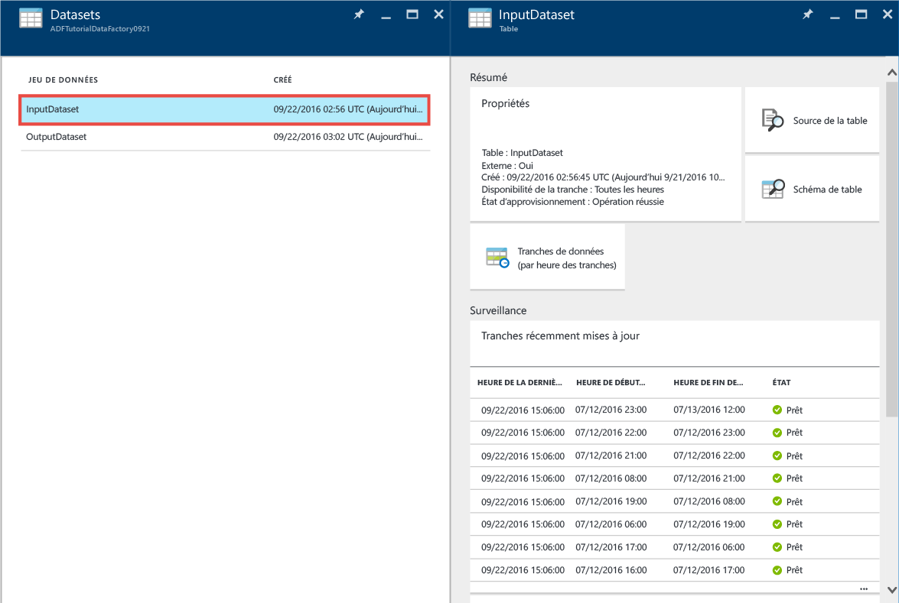
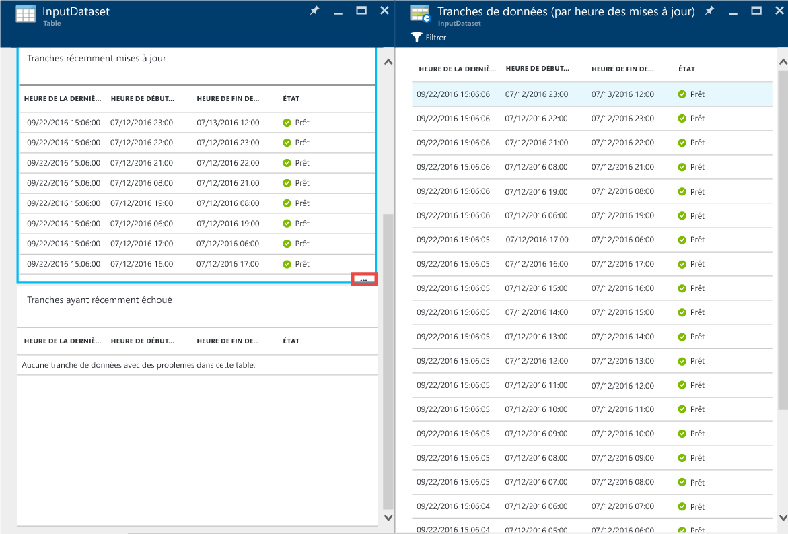

# <a name="tutorial-create-a-pipeline-with-copy-activity-using-azure-portal"></a>Didacticiel : Créer un pipeline avec l’activité de copie à l’aide du portail Azure
> [!div class="op_single_selector"]
> * [Vue d’ensemble et étapes préalables requises](data-factory-copy-data-from-azure-blob-storage-to-sql-database.md)
> * [Assistant de copie](data-factory-copy-data-wizard-tutorial.md)
> * [Portail Azure](data-factory-copy-activity-tutorial-using-azure-portal.md)
> * [Visual Studio](data-factory-copy-activity-tutorial-using-visual-studio.md)
> * [PowerShell](data-factory-copy-activity-tutorial-using-powershell.md)
> * [Modèle Azure Resource Manager](data-factory-copy-activity-tutorial-using-azure-resource-manager-template.md)
> * [API REST](data-factory-copy-activity-tutorial-using-rest-api.md)
> * [API .NET](data-factory-copy-activity-tutorial-using-dotnet-api.md)
> 
> 

Dans cet article, vous allez apprendre à utiliser le [portail Azure](https://portal.azure.com) pour créer une fabrique de données avec un pipeline qui copie les données d’un stockage Blob Azure dans une base de données SQL Azure. Si vous débutez avec Azure Data Factory, lisez l’article [Présentation d’Azure Data Factory](data-factory-introduction.md) avant de suivre ce didacticiel.   

Dans ce didacticiel, le pipeline de données copie les données d’un magasin de données source vers un magasin de données de destination. Il ne transforme pas les données d’entrée pour produire des données de sortie. Pour un didacticiel sur la transformation des données à l’aide d’Azure Data Factory, consultez [Tutorial: Build your first pipeline to transform data using Hadoop cluster](data-factory-build-your-first-pipeline.md) (Didacticiel : Créer un pipeline pour transformer des données à l’aide d’un cluster Hadoop).

Ce didacticiel utilise uniquement une activité de type : Copier. Un pipeline peut contenir plusieurs activités. En outre, vous pouvez chaîner deux activités (une après l’autre) en configurant le jeu de données de sortie d’une activité en tant que jeu de données d’entrée de l’autre activité. Pour plus d’informations, consultez [Planification et exécution dans Data Factory](data-factory-scheduling-and-execution.md#multiple-activities-in-a-pipeline). 

## <a name="prerequisites"></a>Composants requis
Assurez-vous que vous respectez la configuration requise décrite dans l’article [Configuration requise pour le didacticiel](data-factory-copy-data-from-azure-blob-storage-to-sql-database.md) avant de suivre ce didacticiel.

## <a name="steps"></a>Étapes
Voici les étapes à effectuer dans le cadre de ce didacticiel :

1. Créez une **fabrique de données** Azure. Dans cette étape, vous créez une fabrique de données nommée ADFTutorialDataFactory. 
2. Créez des **services liés** dans la fabrique de données. Au cours de cette étape, vous allez créer deux services liés de types : Stockage Azure et base de données SQL Azure. 
    
    AzureStorageLinkedService relie votre compte de stockage Azure à la fabrique de données. Vous avez créé un conteneur et chargé des données dans ce compte de stockage dans le cadre des [conditions préalables](data-factory-copy-data-from-azure-blob-storage-to-sql-database.md).   

    AzureSqlLinkedService lie votre base de données SQL Azure à la fabrique de données. Les données copiées à partir du stockage Blob sont stockées dans cette base de données. Vous avez créé une table SQL dans cette base de données dans le cadre des [conditions préalables](data-factory-copy-data-from-azure-blob-storage-to-sql-database.md).   
3. Créez des **jeux de données** d’entrée et de sortie dans la fabrique de données.  
    
    Le service lié Stockage Azure spécifie la chaîne de connexion que le service Data Factory utilise au moment de l’exécution pour se connecter à votre compte de stockage Azure. Le jeu de données blob d’entrée spécifie quant à lui le conteneur et le dossier qui contient les données d’entrée.  

    De même, le service lié Azure SQL Database spécifie la chaîne de connexion que le service Data Factory utilise au moment de l’exécution pour se connecter à votre base de données SQL Azure. Et le jeu de données de la table SQL de sortie spécifie la table de la base de données dans laquelle les données du stockage Blob sont copiées.
4. Créez un **pipeline** dans la fabrique de données. Dans cette étape, vous allez créer un pipeline avec une activité de copie.   
    
    L’activité de copie copie les données d’un objet blob du stockage Blob Azure dans une table de la base de données SQL Azure. Vous pouvez utiliser une activité de copie dans un pipeline pour copier les données d’une source prise en charge dans une destination prise en charge. Pour obtenir la liste des magasins de données pris en charge, consultez [Activités de déplacement des données](data-factory-data-movement-activities.md#supported-data-stores-and-formats). 
5. Surveillez le pipeline. Dans cette étape, vous **surveillez** les tranches de jeux de données d’entrée et de sortie à l’aide du portail Azure. 

## <a name="create-data-factory"></a>Créer une fabrique de données
> [!IMPORTANT]
> Assurez-vous de remplir les [conditions préalables à l’exécution du didacticiel](data-factory-copy-data-from-azure-blob-storage-to-sql-database.md) si ce n’est déjà fait.   

Une fabrique de données peut avoir un ou plusieurs pipelines. Un pipeline peut contenir une ou plusieurs activités. Par exemple, une activité de copie pour copier des données d’une source vers un magasin de données de destination, et une activité Hive HDInsight pour exécuter un script Hive pour transformer des données d’entrée et produire des données de sortie. Commençons par la création de la fabrique de données dans cette étape.

1. Une fois connecté au [portail Azure](https://portal.azure.com/), cliquez sur **Nouveau** dans le menu de gauche, sur **Données + Analytique**, puis sur **Data Factory**. 
   
       
2. Dans le panneau **Nouvelle fabrique de données** :
   
   1. Saisissez **ADFTutorialDataFactory** dans le champ **Nom**. 
      
         
      
       Le nom de la fabrique de données Azure doit être un nom **global unique**. Si l’erreur suivante s’affiche, changez le nom de la fabrique de données (par exemple, votrenomADFTutorialDataFactory), puis tentez de la recréer. Consultez la rubrique [Data Factory - Règles d'affectation des noms](data-factory-naming-rules.md) pour savoir comment nommer les artefacts Data Factory.
      
           Data factory name “ADFTutorialDataFactory” is not available  
      
       
   2. Sélectionnez l’**abonnement** Azure dans lequel vous voulez créer la fabrique de données. 
   3. Pour le **groupe de ressources**, effectuez l’une des opérations suivantes :
      
      - Sélectionnez **Utiliser l’existant**, puis sélectionnez un groupe de ressources existant dans la liste déroulante. 
      - Sélectionnez **Créer**, puis entrez le nom d’un groupe de ressources.   
         
          Certaines étapes de ce didacticiel supposent que vous utilisez le groupe de ressources nommé **ADFTutorialResourceGroup** . Pour plus d'informations sur les groupes de ressources, consultez [Utilisation des groupes de ressources pour gérer vos ressources Azure](../azure-resource-manager/resource-group-overview.md).  
   4. Sélectionnez **l’emplacement** de la fabrique de données. Seules les régions prises en charge par le service Data Factory sont affichées dans la liste déroulante.
   5. Sélectionnez **Épingler au tableau de bord**.     
   6. Cliquez sur **Create**.
      
      > [!IMPORTANT]
      > Pour créer des instances Data Factory, vous devez avoir un rôle de [collaborateur de fabrique de données](../active-directory/role-based-access-built-in-roles.md#data-factory-contributor) au niveau de l’abonnement/du groupe de ressources.
      > 
      > Le nom de la fabrique de données pourra être enregistré en tant que nom DNS et devenir ainsi visible publiquement.                
      > 
      > 
3. Sur le tableau de bord, vous voyez la mosaïque suivante avec l’état : **Déploiement de fabrique de données**. 

    
4. Une fois la création terminée, le panneau **Data Factory** s’affiche comme sur l’image.
   
   

## <a name="create-linked-services"></a>Créer des services liés
Vous créez des services liés dans une fabrique de données pour lier vos magasins de données et vos services de calcul à la fabrique de données. Dans ce didacticiel, vous n’utilisez pas n’importe quel service de calcul comme Azure HDInsight ou Azure Data Lake Analytics. Vous utilisez deux magasins de données de type Stockage Azure (source) et Base de données SQL Azure (destination). 

Vous créez ainsi deux services liés nommés AzureStorageLinkedService et AzureSqlLinkedService de types : AzureStorage et AzureSqlDatabase.  

AzureStorageLinkedService relie votre compte de stockage Azure à la fabrique de données. Ce compte de stockage est celui dans lequel vous avez créé un conteneur et chargé les données dans le cade des [conditions préalables](data-factory-copy-data-from-azure-blob-storage-to-sql-database.md).   

AzureSqlLinkedService lie votre base de données SQL Azure à la fabrique de données. Les données copiées à partir du stockage Blob sont stockées dans cette base de données. Vous avez créé une table emp dans cette base de données dans le cadre des [conditions préalables](data-factory-copy-data-from-azure-blob-storage-to-sql-database.md).  

### <a name="create-azure-storage-linked-service"></a>Créer le service lié Azure Storage
Dans cette étape, vous liez votre compte de stockage Azure à votre fabrique de données. 

1. Dans le panneau **Fabrique de données**, cliquez sur la mosaïque **Créer et déployer**.
   
    
2. **Data Factory Editor** devrait s’afficher comme suit : 

    
3. Dans l’éditeur, cliquez sur le bouton **Nouveau magasin de données** de la barre d’outils, puis sélectionnez **Stockage Azure** dans le menu déroulant. Le modèle JSON de création d’un service lié Stockage Azure doit apparaître dans le volet droit. 
   
        
3. Remplacez les éléments `<accountname>` et `<accountkey>` par le nom du compte et les valeurs de clé de compte de votre compte de stockage Azure. 
   
        
4. Dans la barre d’outils, cliquez sur **Déployer** . Le service lié **AzureStorageLinkedService** doit maintenant apparaître dans l’arborescence. 
   
    

    Pour plus d’informations sur les propriétés JSON dans la définition de service lié, consultez l’article [Connecteur de stockage Blob Azure](data-factory-azure-blob-connector.md#linked-service-properties).

### <a name="create-a-linked-service-for-the-azure-sql-database"></a>Création d’un service lié pour la base de données SQL Azure
Dans cette étape, vous liez votre base de données SQL Azure à votre fabrique de données.

1. Dans **Data Factory Editor**, cliquez sur le bouton **Nouvelle banque de données** de la barre d’outils et sélectionnez **Azure SQL Database** dans le menu déroulant. Le modèle JSON pour la création du service lié SQL Azure doit apparaître dans le volet droit.
2. Remplacez les éléments `<servername>`, `<databasename>`, `<username>@<servername>` et `<password>` par le nom de votre serveur, de la base de données, du compte d’utilisateur SQL Azure et le mot de passe associé. 
3. Cliquez sur l’option **Déployer** de la barre d’outils pour créer et déployer le service **AzureSqlLinkedService**.
4. Vérifiez que **AzureSqlLinkedService** apparaît dans l’arborescence sous **Services liés**.  

    Pour plus d’informations sur ces propriétés JSON, consultez [Connecteur de base de données SQL Azure](data-factory-azure-sql-connector.md#linked-service-properties).

## <a name="create-datasets"></a>Créer des jeux de données
Dans l’étape précédente, vous avez créé des services liés pour lier votre compte de stockage Azure et une base de données SQL Azure à votre fabrique de données. Dans cette étape, vous définissez deux jeux de données nommés InputDataset et OutputDataset, qui représentent les données d’entrée/sortie stockées dans les banques de données référencées par AzureStorageLinkedService et AzureSqlLinkedService, respectivement.

Le service lié Stockage Azure spécifie la chaîne de connexion que le service Data Factory utilise au moment de l’exécution pour se connecter à votre compte de stockage Azure. Le jeu de données blob d’entrée (InputDataset) spécifie quant à lui le conteneur et le dossier qui contient les données d’entrée.  

De même, le service lié Azure SQL Database spécifie la chaîne de connexion que le service Data Factory utilise au moment de l’exécution pour se connecter à votre base de données SQL Azure. Et le jeu de données de la table SQL de sortie (OututDataset) spécifie la table de la base de données dans laquelle les données du stockage Blob sont copiées. 

### <a name="create-input-dataset"></a>Créer le jeu de données d’entrée
Dans cette étape, vous créez un jeu de données nommé InputDataset qui pointe vers un fichier blob (emp.txt) dans le dossier racine d’un conteneur d’objets blob (adftutorial) du stockage Azure représenté par le service lié AzureStorageLinkedService. Si vous ne spécifiez pas de valeur pour fileName (ou si vous ignorez ce paramètre), les données de tous les objets blob du dossier d’entrée sont copiées dans la destination. Dans ce didacticiel, vous spécifiez une valeur pour fileName.    

1. Dans **l’éditeur** de la fabrique de données, cliquez sur **... Plus**, sur **Nouveau jeu de données**, puis sur **Stockage d’objets blob Azure** dans le menu déroulant. 
   
    
2. Remplacez le script JSON dans le volet droit par l'extrait de code JSON suivant : 
   
    ```json
    {
      "name": "InputDataset",
      "properties": {
        "structure": [
          {
            "name": "FirstName",
            "type": "String"
          },
          {
            "name": "LastName",
            "type": "String"
          }
        ],
        "type": "AzureBlob",
        "linkedServiceName": "AzureStorageLinkedService",
        "typeProperties": {
          "folderPath": "adftutorial/",
          "fileName": "emp.txt",
          "format": {
            "type": "TextFormat",
            "columnDelimiter": ","
          }
        },
        "external": true,
        "availability": {
          "frequency": "Hour",
          "interval": 1
        }
      }
    }
    ```   

    Le tableau suivant décrit les propriétés JSON utilisées dans l'extrait de code :

    | Propriété | Description |
    |:--- |:--- |
    | type | La propriété du type est définie sur **AzureBlob**, car les données se trouvent dans le stockage blob Azure. |
    | linkedServiceName | Fait référence au service **AzureStorageLinkedService** que vous avez créé précédemment. |
    | folderPath | Spécifie le **conteneur** d’objets blob et le **dossier** qui contient les objets blob d’entrée. Dans ce didacticiel, adftutorial est le conteneur d’objets blob et folder est le dossier racine. | 
    | fileName | Cette propriété est facultative. Si vous omettez cette propriété, tous les fichiers spécifiés dans le paramètre folderPath sont récupérés. Dans ce didacticiel, **emp.txt** est spécifié pour le paramètre fileName, si bien que seul ce fichier est récupéré pour le traitement. |
    | format -> type |Le fichier d’entrée étant au format texte, nous utilisons **TextFormat**. |
    | columnDelimiter | Les colonnes du fichier d’entrée sont délimitées par une **virgule (`,`)**. |
    | frequency/interval | La fréquence est définie sur **Heure** et l’intervalle est **1**, ce qui signifie que les segments d’entrée sont disponibles **toutes les heures**. En d’autres termes, le service Data Factory recherche les données d’entrée toutes les heures dans le dossier racine du conteneur d’objets blob (**adftutorial**) que vous avez spécifié. Il recherche des données entre les heures de début et de fin du pipeline, pas avant ni après.  |
    | external | Cette propriété a la valeur **true** si les données ne sont pas générées par ce pipeline. Dans ce didacticiel, les données d’entrée sont dans le fichier emp.txt, qui n’est pas généré par ce pipeline. Nous définissons donc cette propriété sur true. |

    Pour plus d’informations sur ces propriétés JSON, consultez l’article [Connecteur de stockage Blob Azure](data-factory-azure-blob-connector.md#dataset-properties).        
3. Dans la barre d’outils, cliquez sur **Déployer** pour créer et déployer le jeu de données **InputDataset**. Vérifiez que **InputDataset** apparaît dans l’arborescence.

### <a name="create-output-dataset"></a>Créer un jeu de données de sortie
Dans cette partie de l’étape, vous créez un jeu de données de sortie nommé **OutputDataset**. Ce jeu de données pointe vers une table SQL de la base de données SQL Azure représentée par **AzureSqlLinkedService**. 

1. Dans **l’éditeur** de la fabrique de données, cliquez sur **... Plus**, sur **Nouveau jeu de données**, puis sur **Azure SQL** dans le menu déroulant. 
2. Remplacez le script JSON dans le volet droit par l'extrait de code JSON suivant :

    ```json   
    {
      "name": "OutputDataset",
      "properties": {
        "structure": [
          {
            "name": "FirstName",
            "type": "String"
          },
          {
            "name": "LastName",
            "type": "String"
          }
        ],
        "type": "AzureSqlTable",
        "linkedServiceName": "AzureSqlLinkedService",
        "typeProperties": {
          "tableName": "emp"
        },
        "availability": {
          "frequency": "Hour",
          "interval": 1
        }
      }
    }
    ```       

    Le tableau suivant décrit les propriétés JSON utilisées dans l'extrait de code :

    | Propriété | Description |
    |:--- |:--- |
    | type | La propriété du type est définie sur **AzureSqlTable** car les données sont copiées dans une table de la base de données SQL Azure. |
    | linkedServiceName | Fait référence au service **AzureSqlLinkedService** que vous avez créé précédemment. |
    | TableName | Spécifie la **table** dans laquelle les données sont copiées. | 
    | frequency/interval | La fréquence est définie sur **Heure** et l’intervalle sur **1**, ce qui signifie que les tranches de sortie sont produites **toutes les heures** entre les heures de début et de fin du pipeline, pas avant ni après.  |

    La table emp de la base de données contient trois colonnes : **ID**, **FirstName** et **LastName**. ID étant une colonne d’identité, il vous suffit de spécifier **FirstName** et **LastName**.

    Pour plus d’informations sur ces propriétés JSON, consultez l’article [Connecteur SQL Azure](data-factory-azure-sql-connector.md#dataset-properties).
3. Dans la barre d’outils, cliquez sur **Déployer** pour créer et déployer le jeu de données **OutputDataset**. Vérifiez que **OutputDataset** apparaît dans l’arborescence sous **Jeux de données**. 

## <a name="create-pipeline"></a>Création d’un pipeline
Dans cette étape, vous créez un pipeline avec une **activité de copie** qui utilise **InputDataset** en entrée et **OutputDataset** en sortie.

Le jeu de données de sortie pilote actuellement la planification. Dans ce didacticiel, le jeu de données de sortie est configuré pour produire une tranche par heure. Les heures de début et de fin du pipeline sont distantes d’une journée, soit 24 heures. Par conséquent, 24 tranches de jeu de données de sortie sont générées par le pipeline. 

1. Dans **l’éditeur** de la fabrique de données, cliquez sur **... Plus**, puis sur **Nouveau pipeline**. Vous pouvez également cliquer sur **Pipelines** dans l’arborescence, puis sur **Nouveau pipeline**.
2. Remplacez le script JSON dans le volet droit par l'extrait de code JSON suivant : 

    ```json   
    {
      "name": "ADFTutorialPipeline",
      "properties": {
        "description": "Copy data from a blob to Azure SQL table",
        "activities": [
          {
            "name": "CopyFromBlobToSQL",
            "type": "Copy",
            "inputs": [
              {
                "name": "InputDataset"
              }
            ],
            "outputs": [
              {
                "name": "OutputDataset"
              }
            ],
            "typeProperties": {
              "source": {
                "type": "BlobSource"
              },
              "sink": {
                "type": "SqlSink",
                "writeBatchSize": 10000,
                "writeBatchTimeout": "60:00:00"
              }
            },
            "Policy": {
              "concurrency": 1,
              "executionPriorityOrder": "NewestFirst",
              "retry": 0,
              "timeout": "01:00:00"
            }
          }
        ],
        "start": "2017-05-11T00:00:00Z",
        "end": "2017-05-12T00:00:00Z"
      }
    } 
    ```   
    
    Notez les points suivants :
   
    - Dans la section des activités, il existe une seule activité dont le **type** a la valeur **Copy**. Pour plus d’informations sur l’activité de copie, consultez [Activités de déplacement des données](data-factory-data-movement-activities.md). Dans les solutions Data Factory, vous pouvez également utiliser [Activités de transformation des données](data-factory-data-transformation-activities.md).
    - L’entrée de l’activité est définie sur **InputDataset** et sa sortie, sur **OutputDataset**. 
    - Dans la section **typeProperties**, **BlobSource** est spécifié en tant que type de source et **SqlSink**, en tant que type de récepteur. Pour obtenir la liste des magasins de données pris en charge en tant que sources et récepteurs pour l’activité de copie, consultez [Magasins de données pris en charge](data-factory-data-movement-activities.md#supported-data-stores-and-formats). Pour apprendre à utiliser un magasin de données pris en charge spécifique en tant que source/récepteur, cliquez sur le lien dans le tableau.  
     
    Remplacez la valeur de la propriété **start** par le jour actuel et la valeur **end** par le jour suivant. Si vous le souhaitez, spécifiez uniquement la date et ignorez l'heure. Par exemple, « 2016-02-03 », qui équivaut à « 2016-02-03T00:00:00Z ».
     
    Les dates/heures de début et de fin doivent toutes deux être au [format ISO](http://en.wikipedia.org/wiki/ISO_8601). Par exemple : 2016-10-14T16:32:41Z. L’heure de fin ( **end** ) est facultative, mais nous allons l’utiliser dans ce didacticiel. 
     
    Si vous ne spécifiez aucune valeur pour la propriété **end**, cette dernière est calculée comme suit : « **start + 48 heures** ». Pour exécuter le pipeline indéfiniment, spécifiez **9999-09-09** comme valeur pour la propriété **end**.
     
    Dans l’exemple ci-dessus, il existe 24 tranches de données, car une tranche de données est générée toutes les heures.

    Pour obtenir une description des propriétés JSON dans une définition de pipeline, consultez l’article [Créer des pipelines](data-factory-create-pipelines.md). Pour obtenir une description des propriétés JSON dans une définition d’activité de copie, consultez [Activités de déplacement des données](data-factory-data-movement-activities.md). Pour obtenir une description des propriétés JSON prises en charge par BlobSource, consultez l’article [Connecteur de stockage Blob Azure](data-factory-azure-blob-connector.md). Pour obtenir une description des propriétés JSON prises en charge par SqlSink, consultez l’article [Connecteur de base de données SQL Azure](data-factory-azure-sql-connector.md).
3. Cliquez sur **Déployer** dans la barre d’outils pour créer et déployer le pipeline **ADFTutorialPipeline**. Vérifiez que le pipeline apparaît dans l’arborescence. 
4. Maintenant, fermez le panneau **Éditeur** en cliquant sur **X**. Cliquez sur **X** à nouveau pour afficher la page d’accueil **Data Factory** de **ADFTutorialDataFactory**.

**Félicitations !** Vous avez créé une fabrique de données Azure, avec un pipeline permettant de copier les données d’un stockage Blob Azure vers une base de données SQL Azure. 


## <a name="monitor-pipeline"></a>Surveillance d’un pipeline
Dans cette étape, vous utilisez le portail Azure pour surveiller ce qui se passe dans une fabrique de données Azure.    

### <a name="monitor-pipeline-using-monitor--manage-app"></a>Surveiller le pipeline à l’aide de l’application de surveillance et de gestion
Les étapes suivantes vous expliquent comment surveiller les pipelines de votre fabrique de données à l’aide de l’application Surveiller et gérer : 

1. Cliquez sur la mosaïque **Surveiller et gérer** sur la page d’accueil de votre fabrique de données.
   
     
2. **L’application Surveiller et Gérer** doit apparaître dans un onglet distinct. Modifiez **l’heure de début** et **l’heure de fin** pour qu’elles correspondent aux dates de début (2016-07-12) et de fin (2016-07-13) de votre pipeline, puis cliquez sur **Appliquer**. 
       
    > [!NOTE]
    > Si vous voyez que le navigateur web est bloqué au niveau « Autorisation ... », effectuez l’une des opérations suivantes : désactivez la case à cocher **Bloquer les cookies et les données de site tiers** (ou) créez une exception pour **login.microsoftonline.com**, puis réessayez d’ouvrir l’application.

     
3. Les **fenêtres d’activité** apparaissent dans la liste du volet central, associées à chaque heure entre les heures de début et de fin du pipeline. 
4. Pour afficher les détails d’une fenêtre d’activité, sélectionnez-la dans la liste des **fenêtres d’activité**. 
    

    Dans l’Explorateur de fenêtres d’activité situé à droite, vous voyez que les tranches sont traitées (en vert) jusqu'à l’heure UTC actuelle (20h12). Les tranches 20h-21h, 21h-22h, 22h-23h et 23h-minuit ne sont pas encore traitées.

    Vous pouvez cliquer sur une fenêtre d’activité dans la liste (ou) dans cette image pour afficher les détails à son sujet. 

    La section **Tentatives** fournit des informations sur l’exécution de l’activité de cette tranche de données. Si une erreur s’est produite, vous obtenez des détails sur l’erreur. Par exemple, si le dossier d’entrée ou le conteneur n’existe pas et que le traitement de la tranche échoue, vous voyez un message d’erreur indiquant que le conteneur ou le dossier n’existe pas.

     
4. Lancez **SQL Server Management Studio**, connectez-vous à la base de données SQL Azure, puis vérifiez que les lignes sont insérées dans la table **emp** de la base de données.
    
    

Pour en savoir plus sur l’utilisation de cette application, consultez l’article [Surveiller et gérer les pipelines Azure Data Factory à l’aide de l’application de surveillance et gestion](data-factory-monitor-manage-app.md).

### <a name="monitor-pipeline-using-diagram-view"></a>Surveillance d’un pipeline à l’aide de la Vue de diagramme
Vous pouvez également surveiller les pipelines de données à l’aide de la vue de diagramme.  

1. Dans le panneau **Data Factory**, cliquez sur **Diagramme**.
   
    
2. Le diagramme devrait ressembler à l’image suivante : 
   
      
5. Dans la vue de diagramme, double-cliquez sur **InputDataset** pour afficher les tranches du jeu de données.  
   
       
5. Cliquez sur le lien **En savoir plus** pour afficher toutes les tranches de données. Les 24 tranches horaires entre les heures de début et de fin du pipeline apparaissent. 
   
      
   
    Notez que toutes les tranches de données jusqu’à l’heure UTC actuelle présentent l’état **Prêt**, car le fichier **emp.txt** existe en permanence dans le conteneur d’objets blob **adftutorial\input**. Les tranches pour les heures futures ne sont pas encore à l’état Prêt. Vérifiez qu'aucune tranche n'apparaît dans la section inférieure **Tranches ayant échoué récemment** .
6. Fermez les panneaux jusqu’à voir la vue de diagramme (ou) faites défiler vers la gauche pour afficher la vue de diagramme. Ensuite, double-cliquez sur **OutputDataset**. 
8. Cliquez sur le lien **En savoir plus** dans le panneau **Table** pour **OutputDataset** pour voir toutes les tranches.

     
9. Notez que toutes les tranches jusqu’à l’heure UTC actuelle passent de l’état **En attente d’exécution** aux états **En cours** ==> **Prêt**. Par défaut, les tranches du passé (avant l’heure actuelle) sont traitées de la plus récente à la plus ancienne. Par exemple, si l’heure actuelle est 20h12 UTC, la tranche 19h-20h est traitée avant la tranche 18h-19h. La tranche 20h-21h est traitée à la fin de l’intervalle de temps par défaut, soit après 21h.  
10. Cliquez sur une tranche de données dans la liste pour afficher le panneau **Tranche de données** . Une donnée associée à une fenêtre d’activité est appelée une tranche. Une tranche peut être constituée d’un ou de plusieurs fichiers.  
    
     
    
     Si la tranche n’a pas l’état **Prêt**, vous pouvez voir les tranches en amont qui ne sont pas prêtes et qui empêchent l’exécution de la tranche actuelle dans la liste **Tranches en amont qui ne sont pas prêtes**.
11. Dans le panneau **TRANCHE DE DONNÉES** , vous devez voir toutes les exécutions d'activité dans la liste inférieure. Cliquez sur une **exécution d’activité** pour afficher le panneau **Détails de l’exécution de l’activité**. 
    
    

    Dans ce panneau, vous voyez la durée nécessaire à l’opération de copie, le débit, le nombre d’octets de données lus et écrits, l’heure de début d’exécution, l’heure de fin d’exécution, etc.  
12. Cliquez sur **X** pour fermer tous les panneaux et revenir au panneau d’accueil de l’élément **ADFTutorialDataFactory**.
13. (facultatif) cliquez sur la mosaïque **Jeux de données** ou **Pipelines** pour obtenir les panneaux que vous avez vus aux étapes précédentes. 
14. Lancez **SQL Server Management Studio**, connectez-vous à la base de données SQL Azure, puis vérifiez que les lignes sont insérées dans la table **emp** de la base de données.
    
    


## <a name="summary"></a>Résumé
Dans ce didacticiel, vous avez créé une fabrique de données Azure pour copier des données d'objet blob Azure dans une base de données SQL Azure. Vous avez utilisé le portail Azure pour créer la fabrique de données, les services liés, les jeux de données et un pipeline. Voici les étapes de premier niveau que vous avez effectuées dans ce didacticiel :  

1. Création d’une **fabrique de données**Azure.
2. Création de **services liés**:
   1. Un service lié **Stockage Azure** pour lier votre compte Stockage Azure contenant des données d’entrée.     
   2. Un service lié **Azure SQL** pour lier votre base de données Azure SQL contenant les données de sortie. 
3. Création de **jeux de données** qui décrivent les données d’entrée et de sortie des pipelines.
4. Création d’un **pipeline** avec une **activité de copie** avec **BlobSource** en tant que source et **SqlSink** en tant que récepteur.  

## <a name="next-steps"></a>Étapes suivantes
Dans ce didacticiel, vous avez utilisé le stockage Blob Azure comme magasin de données source et une base de données SQL Azure comme banque de données de destination dans une opération de copie. Le tableau ci-dessous contient la liste des magasins de données pris en charge en tant que sources et destinations par l’activité de copie : 

[!INCLUDE [data-factory-supported-data-stores](../../includes/data-factory-supported-data-stores.md)]

Pour plus d’informations sur les champs/propriétés affichés dans l’Assistant de copie d’un magasin de données, cliquez sur le lien du magasin de données dans la table.
