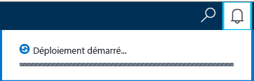
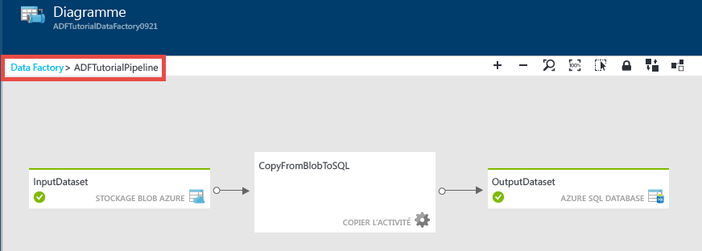
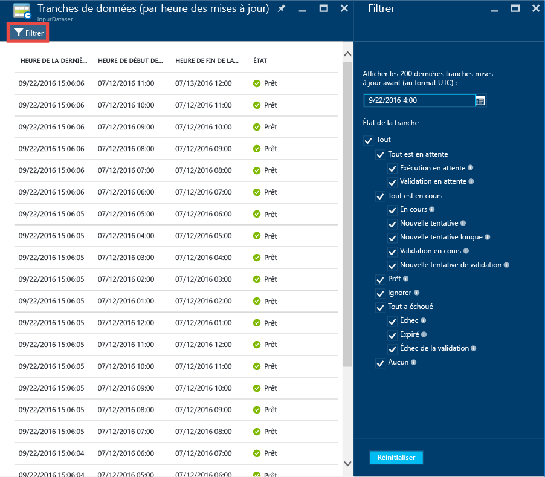

# <a name="tutorial-create-a-pipeline-with-copy-activity-using-azure-portal"></a>Didacticiel : Créer un pipeline avec l’activité de copie à l’aide du portail Azure
> [!div class="op_single_selector"]
> * [Vue d’ensemble et étapes préalables requises](data-factory-copy-data-from-azure-blob-storage-to-sql-database.md)
> * [Assistant de copie](data-factory-copy-data-wizard-tutorial.md)
> * [Portail Azure](data-factory-copy-activity-tutorial-using-azure-portal.md)
> * [Visual Studio](data-factory-copy-activity-tutorial-using-visual-studio.md)
> * [PowerShell](data-factory-copy-activity-tutorial-using-powershell.md)
> * [Modèle Azure Resource Manager](data-factory-copy-activity-tutorial-using-azure-resource-manager-template.md)
> * [API REST](data-factory-copy-activity-tutorial-using-rest-api.md)
> * [API .NET](data-factory-copy-activity-tutorial-using-dotnet-api.md)
> 
> 

Ce didacticiel vous montre comment créer et surveiller une fabrique de données Azure à l’aide du portail Azure. Le pipeline de la fabrique de données utilise une activité de copie pour copier les données d’un objet Stockage Blob Azure vers une base de données Azure SQL Database.

> [!NOTE]
> Dans ce didacticiel, le pipeline de données copie les données d’un magasin de données source vers un magasin de données de destination. Il ne transforme pas les données d’entrée pour produire des données de sortie. Pour un didacticiel sur la transformation des données à l’aide d’Azure Data Factory, consultez [Tutorial: Build your first pipeline to transform data using Hadoop cluster](data-factory-build-your-first-pipeline.md) (Didacticiel : Créer un pipeline pour transformer des données à l’aide d’un cluster Hadoop).
> 
> Vous pouvez chaîner deux activités (une après l’autre) en configurant le jeu de données de sortie d’une activité en tant que jeu de données d’entrée de l’autre activité. Pour des informations détaillées, consultez [Planification et exécution avec Data Factory](data-factory-scheduling-and-execution.md). 

Voici les étapes à effectuer dans le cadre de ce didacticiel :

| Étape | Description |
| --- | --- |
| [créer une fabrique de données Azure](#create-data-factory) |Dans cette étape, vous créez une fabrique de données Azure nommée **ADFTutorialDataFactory**. |
| [créer des services liés](#create-linked-services) |Dans cette étape, vous créez deux services liés : **AzureStorageLinkedService** et **AzureSqlLinkedService**. <br/><br/>AzureStorageLinkedService lie le stockage Azure et AzureSqlLinkedService lie la base de données SQL Azure à ADFTutorialDataFactory. Les données d’entrée pour le pipeline se trouvent dans un conteneur d’objets blob dans le stockage d’objets blob Azure et les données de sortie sont stockées dans une table dans la base de données SQL Azure. Par conséquent, vous ajoutez ces deux magasins de données en tant que services liés à la fabrique de données. |
| [Créer des jeux de données d'entrée et de sortie](#create-datasets) |Dans l'étape précédente, vous avez créé des services liés qui font référence à des magasins de données contenant des données d'entrée/sortie. Dans cette étape, vous définissez deux jeux de données, **InputDataset** et **OutputDataset**, qui représentent les données d’entrée/sortie stockées dans les banques de données. <br/><br/>Pour InputDataset, vous devez spécifier le conteneur qui contient un objet blob avec la source de données ; pour OutputDataset, vous spécifiez la table SQL qui stocke les données de sortie. Vous spécifiez également d’autres propriétés telles que la structure, la disponibilité et la stratégie. |
| [Créer un pipeline](#create-pipeline) |Dans cette étape, vous créez un pipeline nommé **ADFTutorialPipeline** dans la fabrique de données ADFTutorialDataFactory. <br/><br/>**activité de copie** qui copie les données d’entrée de l’objet blob Azure dans la table SQL Azure de sortie. L’activité de copie effectue le déplacement des données dans Azure Data Factory. Elle est mise en œuvre par un service disponible dans le monde entier, capable de copier des données entre différents magasins de données de façon sécurisée, fiable et évolutive. Pour plus d’informations sur l’activité de copie, consultez l’article [Activités de déplacement des données](data-factory-data-movement-activities.md) . |
| [Surveillance d’un pipeline](#monitor-pipeline) |Dans cette étape, vous surveillez les tranches de tables d’entrée et de sortie à l’aide du portail Azure. |

## <a name="prerequisites"></a>Composants requis
Assurez-vous que vous respectez la configuration requise décrite dans l’article [Vue d’ensemble du didacticiel](data-factory-copy-data-from-azure-blob-storage-to-sql-database.md) avant de suivre ce didacticiel.

## <a name="create-data-factory"></a>Créer une fabrique de données
Dans cette étape, vous allez utiliser le portail Azure pour créer une fabrique de données Azure nommée **ADFTutorialDataFactory**.

1. Une fois connecté au [portail Azure](https://portal.azure.com/), cliquez sur **Nouveau**, sélectionnez **Intelligence et analyse**, et cliquez sur **Data Factory**. 
   
       
2. Dans le panneau **Nouvelle fabrique de données** :
   
   1. Saisissez **ADFTutorialDataFactory** dans le champ **Nom**. 
      
         
      
       Le nom de la fabrique de données Azure doit être un nom **global unique**. Si l’erreur suivante s’affiche, changez le nom de la fabrique de données (par exemple, votrenomADFTutorialDataFactory), puis tentez de la recréer. Consultez la rubrique [Data Factory - Règles d'affectation des noms](data-factory-naming-rules.md) pour savoir comment nommer les artefacts Data Factory.
      
           Data factory name “ADFTutorialDataFactory” is not available  
      
       
   2. Sélectionnez votre **abonnement**Azure.
   3. Pour le groupe de ressources, effectuez l’une des opérations suivantes :
      
      - Sélectionnez **Utiliser l’existant**, puis sélectionnez un groupe de ressources existant dans la liste déroulante. 
      - Sélectionnez **Créer**, puis entrez le nom d’un groupe de ressources.   
         
          Certaines étapes de ce didacticiel supposent que vous utilisez le groupe de ressources nommé **ADFTutorialResourceGroup** . Pour plus d'informations sur les groupes de ressources, consultez [Utilisation des groupes de ressources pour gérer vos ressources Azure](../azure-resource-manager/resource-group-overview.md).  
   4. Sélectionnez **l’emplacement** de la fabrique de données. Seules les régions prises en charge par le service Data Factory sont affichées dans la liste déroulante.
   5. Sélectionnez **Épingler au Tableau d'accueil**.     
   6. Cliquez sur **Create**.
      
      > [!IMPORTANT]
      > Pour créer des instances Data Factory, vous devez avoir un rôle de [collaborateur de fabrique de données](../active-directory/role-based-access-built-in-roles.md#data-factory-contributor) au niveau de l’abonnement/du groupe de ressources.
      > 
      > Le nom de la fabrique de données pourra être enregistré en tant que nom DNS et devenir ainsi visible publiquement.                
      > 
      > 
3. Pour voir les messages d’état/notification, cliquez sur l’icône en forme de cloche dans la barre d’outils. 
   
    
4. Une fois la création terminée, le panneau **Data Factory** s’affiche comme sur l’image.
   
   

## <a name="create-linked-services"></a>créer des services liés
Les services liés se chargent de lier des magasins de données ou des services de calcul à une fabrique de données Azure. Pour connaître l’ensemble des sources et des récepteurs pris en charge par l’activité de copie, consultez [Banques de données et formats pris en charge](data-factory-data-movement-activities.md#supported-data-stores-and-formats) . Pour obtenir la liste des services de calcul pris en charge par Data Factory, consultez [Services liés de calcul](data-factory-compute-linked-services.md) . Dans ce didacticiel, aucun service de calcul n’est utilisé. 

Dans cette étape, vous créez deux services liés : **AzureStorageLinkedService** et **AzureSqlLinkedService**. Le service lié AzureStorageLinkedService lie un compte de stockage Azure Storage et AzureSqlLinkedService lie une base de données SQL Azure à la fabrique de données **ADFTutorialDataFactory**. Plus loin dans ce didacticiel, vous allez créer un pipeline qui servira à copier les données d’un conteneur d’objets blob dans AzureStorageLinkedService vers une table SQL dans AzureSqlLinkedService.

### <a name="create-a-linked-service-for-the-azure-storage-account"></a>Créer un service lié pour le compte de stockage Azure
1. Dans le panneau **Data Factory**, cliquez sur la mosaïque **Créer et déployer** pour lancer l’**éditeur** de la fabrique de données.
   
    
2. Dans l’**éditeur**, cliquez sur le bouton **Nouveau magasin de données** de la barre d’outils, puis sélectionnez **Stockage Azure** dans le menu déroulant. Le modèle JSON de création d’un service lié Stockage Azure doit apparaître dans le volet droit. 
   
        
3. Remplacez les éléments `<accountname>` et `<accountkey>` par le nom du compte et les valeurs de clé de compte de votre compte de stockage Azure. 
   
        
4. Dans la barre d’outils, cliquez sur **Déployer** . Le service lié **AzureStorageLinkedService** doit maintenant apparaître dans l’arborescence. 
   
    

> [!NOTE]
> Pour plus d’informations sur les propriétés JSON, consultez [Déplacer des données vers et depuis un objet Blob Azure](data-factory-azure-blob-connector.md#azure-storage-linked-service) .
> 
> 

### <a name="create-a-linked-service-for-the-azure-sql-database"></a>Création d’un service lié pour la base de données SQL Azure
1. Dans **Data Factory Editor**, cliquez sur le bouton **Nouvelle banque de données** de la barre d’outils et sélectionnez **Azure SQL Database** dans le menu déroulant. Le modèle JSON pour la création du service lié SQL Azure doit apparaître dans le volet droit.
2. Remplacez les éléments `<servername>`, `<databasename>`, `<username>@<servername>` et `<password>` par le nom de votre serveur, de la base de données, du compte d’utilisateur SQL Azure et le mot de passe associé. 
3. Cliquez sur l’option **Déployer** de la barre d’outils pour créer et déployer le service **AzureSqlLinkedService**.
4. Vérifiez que **AzureSqlLinkedService** apparaît dans l’arborescence. 

> [!NOTE]
> $$Pour plus d’informations sur les propriétés JSON, consultez [Déplacer des données vers et depuis SQL Azure Database](data-factory-azure-sql-connector.md#linked-service-properties) .
> 
> 

## <a name="create-datasets"></a>Créer des jeux de données
À l’étape précédente, vous avez créé les services liés **AzureStorageLinkedService** et **AzureSqlLinkedService** pour lier un compte Stockage Azure et une base de données SQL Azure à la fabrique de données **ADFTutorialDataFactory**. Dans cette étape, vous définissez deux jeux de données, **InputDataset** et **OutputDataset**, qui représentent les données d’entrée/sortie stockées dans les banques de données référencées par AzureStorageLinkedService et AzureSqlLinkedService, respectivement. Pour InputDataset, vous devez spécifier le conteneur qui contient un objet blob avec la source de données ; pour OutputDataset, vous spécifiez la table SQL qui stocke les données de sortie. 

### <a name="create-input-dataset"></a>Créer le jeu de données d’entrée
Dans cette étape, vous créez un jeu de données nommé **InputDataset** qui pointe vers un conteneur d’objets blob dans l’emplacement Azure Storage représenté par le service lié **AzureStorageLinkedService**.

1. Dans **l’éditeur** de la fabrique de données, cliquez sur **... Plus**, sur **Nouveau jeu de données**, puis sur **Stockage d’objets blob Azure** dans le menu déroulant. 
   
    
2. Remplacez le script JSON dans le volet droit par l'extrait de code JSON suivant : 
   
    ```JSON
    {
      "name": "InputDataset",
      "properties": {
        "structure": [
          {
            "name": "FirstName",
            "type": "String"
          },
          {
            "name": "LastName",
            "type": "String"
          }
        ],
        "type": "AzureBlob",
        "linkedServiceName": "AzureStorageLinkedService",
        "typeProperties": {
          "folderPath": "adftutorial/",
          "fileName": "emp.txt",
          "format": {
            "type": "TextFormat",
            "columnDelimiter": ","
          }
        },
        "external": true,
        "availability": {
          "frequency": "Hour",
          "interval": 1
        }
      }
    }
    ```   
    Notez les points suivants : 
   
    - Le **type** de jeu de données est défini sur **AzureBlob**.
    - Le paramètre **linkedServiceName** est défini sur la valeur **AzureStorageLinkedService**. Vous avez créé ce service lié à l’étape 2.
    - Le paramètre **folderPath** est défini sur le conteneur **adftutorial**. Vous pouvez également spécifier le nom d’un objet blob dans le dossier à l’aide de la propriété **fileName** . Étant donné que vous ne spécifiez pas le nom de l'objet blob, les données provenant de tous les objets blob du conteneur sont considérées comme données d'entrée.
    - Le**type** de format a la valeur **TextFormat**.
    - Le fichier texte contient deux champs, **FirstName** et **LastName**, séparés par une virgule (**columnDelimiter**).
    - Le paramètre **availability** est défini sur **hourly** (**frequency** a la valeur **hour** et **interval**, la valeur **1**). Le service Data Factory recherche les données d’entrée toutes les heures dans le dossier racine du conteneur d’objets blob (**adftutorial**) que vous avez spécifié. 
     
     Si vous ne spécifiez pas de nom (**fileName**) pour un jeu de données **d’entrée**, tous les fichiers/objets blob du dossier d’entrée (**folderPath**) sont considérés comme des entrées. Si vous spécifiez un fileName dans le JSON, seul le fichier/objet blob spécifié est considéré comme une entrée.
     
     Si vous ne spécifiez pas de nom (**fileName**) pour une **table de sortie**, les fichiers générés dans le **folderPath** sont nommés selon le format suivant : Data.&lt;Guid&gt;.txt (example: Data.0a405f8a-93ff-4c6f-b3be-f69616f1df7a.txt.).
     
     Pour affecter une valeur à **folderPath** et **fileName** de manière dynamique en fonction de l’heure de **SliceStart**, utilisez la propriété **partitionedBy**. Dans l’exemple suivant, folderPath utilise les valeurs Year, Month et Day à partir de SliceStart (heure de début de la partie en cours de traitement), alors que fileName utilise la valeur Hour à partir de SliceStart. Par exemple, si une partie est produite pour 2016-09-20T08:00:00, la valeur folderName est wikidatagateway/wikisampledataout/2016/09/20, alors que la valeur de fileName est 08.csv. 

    ```JSON     
    "folderPath": "wikidatagateway/wikisampledataout/{Year}/{Month}/{Day}",
    "fileName": "{Hour}.csv",
    "partitionedBy": 
    [
       { "name": "Year", "value": { "type": "DateTime", "date": "SliceStart", "format": "yyyy" } },
       { "name": "Month", "value": { "type": "DateTime", "date": "SliceStart", "format": "MM" } }, 
       { "name": "Day", "value": { "type": "DateTime", "date": "SliceStart", "format": "dd" } }, 
       { "name": "Hour", "value": { "type": "DateTime", "date": "SliceStart", "format": "hh" } } 
    ],
    ```
3. Dans la barre d’outils, cliquez sur **Déployer** pour créer et déployer le jeu de données **InputDataset**. Vérifiez que **InputDataset** apparaît dans l’arborescence.

> [!NOTE]
> Pour plus d’informations sur les propriétés JSON, consultez [Déplacer des données vers et depuis un objet Blob Azure](data-factory-azure-blob-connector.md#dataset-properties) .
> 
> 

### <a name="create-output-dataset"></a>Créer un jeu de données de sortie
Dans cette partie de l’étape, vous créez un jeu de données de sortie nommé **OutputDataset**. Ce jeu de données pointe vers une table SQL de la base de données SQL Azure représentée par **AzureSqlLinkedService**. 

1. Dans **l’éditeur** de la fabrique de données, cliquez sur **... Plus**, sur **Nouveau jeu de données**, puis sur **Azure SQL** dans le menu déroulant. 
2. Remplacez le script JSON dans le volet droit par l'extrait de code JSON suivant :

    ```JSON   
    {
      "name": "OutputDataset",
      "properties": {
        "structure": [
          {
            "name": "FirstName",
            "type": "String"
          },
          {
            "name": "LastName",
            "type": "String"
          }
        ],
        "type": "AzureSqlTable",
        "linkedServiceName": "AzureSqlLinkedService",
        "typeProperties": {
          "tableName": "emp"
        },
        "availability": {
          "frequency": "Hour",
          "interval": 1
        }
      }
    }
    ```       
    Notez les points suivants : 
   
    - Le **type** de jeu de données est défini sur **AzureSQLTable**.
    - Le paramètre **linkedServiceName** est défini sur **AzureSqlLinkedService** (vous avez créé ce service lié à l’étape 2).
    - Le paramètre **tablename** est défini sur **emp**.
    - La table emp de la base de données contient trois colonnes : **ID**, **FirstName** et **LastName**. ID étant une colonne d’identité, il vous suffit de spécifier **FirstName** et **LastName**.
    - **availability** est défini sur **hourly** (**frequency** a la valeur **hour** et **interval** est défini sur **1**).  Le service Data Factory génère une tranche de données de sortie toutes les heures dans la table **emp** de la base de données SQL Azure.
3. Dans la barre d’outils, cliquez sur **Déployer** pour créer et déployer le jeu de données **OutputDataset**. Vérifiez que **OutputDataset** apparaît dans l’arborescence. 

> [!NOTE]
> Pour plus d’informations sur les propriétés JSON, consultez [Déplacer des données vers et depuis SQL Azure Database](data-factory-azure-sql-connector.md#linked-service-properties) .
> 
> 

## <a name="create-pipeline"></a>Création d’un pipeline
Dans cette étape, vous créez un pipeline avec une **activité de copie** qui utilise **InputDataset** en entrée et **OutputDataset** en sortie.

1. Dans **l’éditeur** de la fabrique de données, cliquez sur **... Plus**, puis sur **Nouveau pipeline**. Vous pouvez également cliquer sur **Pipelines** dans l’arborescence, puis sur **Nouveau pipeline**.
2. Remplacez le script JSON dans le volet droit par l'extrait de code JSON suivant : 

    ```JSON   
    {
      "name": "ADFTutorialPipeline",
      "properties": {
        "description": "Copy data from a blob to Azure SQL table",
        "activities": [
          {
            "name": "CopyFromBlobToSQL",
            "type": "Copy",
            "inputs": [
              {
                "name": "InputDataset"
              }
            ],
            "outputs": [
              {
                "name": "OutputDataset"
              }
            ],
            "typeProperties": {
              "source": {
                "type": "BlobSource"
              },
              "sink": {
                "type": "SqlSink",
                "writeBatchSize": 10000,
                "writeBatchTimeout": "60:00:00"
              }
            },
            "Policy": {
              "concurrency": 1,
              "executionPriorityOrder": "NewestFirst",
              "retry": 0,
              "timeout": "01:00:00"
            }
          }
        ],
        "start": "2016-07-12T00:00:00Z",
        "end": "2016-07-13T00:00:00Z"
      }
    } 
    ```   
    
    Notez les points suivants :
   
    - Dans la section des activités, il existe une seule activité dont le **type** a la valeur **Copy**.
    - L’entrée de l’activité est définie sur **InputDataset** et sa sortie, sur **OutputDataset**.
    - Dans la section **typeProperties**, **BlobSource** est spécifié en tant que type de source et **SqlSink**, en tant que type de récepteur.
     
    Remplacez la valeur de la propriété **start** par le jour actuel et la valeur **end**, par le jour suivant. Si vous le souhaitez, spécifiez uniquement la date et ignorez l'heure. Par exemple, « 2016-02-03 », qui équivaut à « 2016-02-03T00:00:00Z ».
     
    Les dates/heures de début et de fin doivent toutes deux être au [format ISO](http://en.wikipedia.org/wiki/ISO_8601). Par exemple : 2016-10-14T16:32:41Z. L’heure de fin ( **end** ) est facultative, mais nous allons l’utiliser dans ce didacticiel. 
     
    Si vous ne spécifiez aucune valeur pour la propriété **end**, cette dernière est calculée comme suit : « **start + 48 heures** ». Pour exécuter le pipeline indéfiniment, spécifiez **9999-09-09** comme valeur pour la propriété **end**.
     
    Dans l’exemple ci-dessus, il existe 24 tranches de données, car une tranche de données est générée toutes les heures.
3. Cliquez sur **Déployer** dans la barre d’outils pour créer et déployer le pipeline **ADFTutorialPipeline**. Vérifiez que le pipeline apparaît dans l’arborescence. 
4. Maintenant, fermez le panneau **Éditeur** en cliquant sur **X**. Cliquez sur **X** à nouveau pour afficher la page d’accueil **Data Factory** de **ADFTutorialDataFactory**.

**Félicitations !** Vous avez correctement créé une fabrique de données Azure, les services liés, les tables et un pipeline et avez planifié le pipeline.   

### <a name="view-the-data-factory-in-a-diagram-view"></a>Afficher une vue schématique d'une fabrique de données
1. Dans le panneau **Data Factory**, cliquez sur **Diagramme**.
   
    
2. Le diagramme devrait ressembler à l’image suivante : 
   
    
   
    Vous pouvez faire un zoom avant, un zoom arrière, un zoom à 100 %, un zoom pour ajuster, positionner automatiquement les pipelines et les tables, et afficher les informations de lignage (mise en surbrillance des éléments en amont et en aval des éléments sélectionnés).  Vous pouvez double-cliquer sur un objet (table ou pipeline d’entrée/de sortie) pour afficher ses propriétés. 
3. Cliquez avec le bouton droit sur **ADFTutorialPipeline** dans la vue schématique et cliquez sur **Ouvrir le pipeline**. 
   
    
4. Les activités doivent apparaître dans le pipeline, ainsi que des jeux de données d'entrée et de sortie pour les activités. Dans ce didacticiel, il n’y a qu’une seule activité dans le pipeline (activité de copie), avec InputDataset comme jeu de données d’entrée et OutputDataset comme jeu de données de sortie.   
   
    
5. Cliquez sur **Fabrique de données** dans la barre de navigation située dans le coin supérieur gauche pour revenir à la vue schématique. La vue schématique affiche tous les pipelines. Dans cet exemple, vous avez créé un seul pipeline.   

## <a name="monitor-pipeline"></a>Surveillance d’un pipeline
Dans cette étape, vous utilisez le portail Azure pour surveiller ce qui se passe dans une fabrique de données Azure. 

### <a name="monitor-pipeline-using-diagram-view"></a>Surveillance d’un pipeline à l’aide de la Vue de diagramme
1. Cliquez sur **X** pour fermer la vue **Diagramme** et afficher la page d’accueil Data Factory de la fabrique de données. Si vous avez fermé le navigateur web, procédez comme suit : 
   1. Accédez au [portail Azure](https://portal.azure.com/). 
   2. Double-cliquez sur **ADFTutorialDataFactory** dans le **tableau d’accueil**, ou cliquez sur **Fabriques de données** dans le menu de gauche et recherchez ADFTutorialDataFactory. 
2. Vous devez voir le nombre et les noms de tables et de pipelines que vous avez créés sur ce panneau.
   
    
3. Cliquez maintenant sur la vignette **Jeux de données** .
4. Dans le panneau **Jeux de données**, cliquez sur **InputDataset**. Ce jeu de données est le jeu de données d’entrée pour **ADFTutorialPipeline**.
   
       
5. Cliquez sur **…** (points de suspension) pour afficher toutes les tranches.
   
      
   
    Notez que toutes les tranches de données jusqu’à l’heure actuelle présentent l’état **Prêt**, car le fichier **emp.txt** existe en permanence dans le conteneur d’objets blob **adftutorial\input**. Vérifiez qu'aucune tranche n'apparaît dans la section inférieure **Tranches ayant échoué récemment** .
   
    Les listes **Tranches récemment mises à jour** et **Tranches ayant échoué récemment** sont triées en fonction de **L’HEURE DE LA DERNIÈRE MISE À JOUR**. 
   
    Cliquez sur l’option **Filtre** de la barre d’outils pour filtrer les tranches.  
   
    
6. Fermez les panneaux jusqu’à ce que vous voyiez le panneau **Jeux de données** . Cliquez sur **OutputDataset**. Ce jeu de données est le jeu de données de sortie pour **ADFTutorialPipeline**.
   
    
7. Vous devez voir le panneau **OutputDataset** tel qu’il apparaît dans l’image suivante :
   
     
8. Notez que les tranches de données jusqu'à l'heure actuelle ont déjà été produites et sont **prêtes**. Aucune tranche n'apparaît dans la section inférieure **Tranches problématiques** .
9. Cliquez sur **… (points de suspension)** pour voir toutes les tranches.
   
    
10. Cliquez sur une tranche de données dans la liste pour afficher le panneau **Tranche de données** .
    
     
    
     Si la tranche n’a pas l’état **Prêt**, vous pouvez voir les tranches en amont qui ne sont pas prêtes et qui empêchent l’exécution de la tranche actuelle dans la liste **Tranches en amont qui ne sont pas prêtes**.
11. Dans le panneau **TRANCHE DE DONNÉES** , vous devez voir toutes les exécutions d'activité dans la liste inférieure. Cliquez sur une **exécution d’activité** pour afficher le panneau **Détails de l’exécution de l’activité**. 
    
    
12. Cliquez sur **X** pour fermer tous les panneaux et revenir au panneau d’accueil de l’élément **ADFTutorialDataFactory**.
13. (facultatif) Cliquez sur **Pipelines** dans la page d’accueil de l’élément **ADFTutorialDataFactory**, cliquez ensuite sur **ADFTutorialPipeline** dans le panneau **Pipelines**, puis extrayez les tables d’entrée (**Consumed**) ou les tables de sortie (**Produced**).
14. Lancez **SQL Server Management Studio**, connectez-vous à la base de données SQL Azure, puis vérifiez que les lignes sont insérées dans la table **emp** de la base de données.
    
    

### <a name="monitor-pipeline-using-monitor--manage-app"></a>Surveiller le pipeline à l’aide de l’application de surveillance et de gestion
Vous pouvez également utiliser l’application de surveillance et de gestion pour surveiller vos pipelines. Pour en savoir plus sur l’utilisation de cette application, consultez l’article [Surveiller et gérer les pipelines Azure Data Factory à l’aide de l’application de surveillance et de gestion](data-factory-monitor-manage-app.md).

1. Cliquez sur la mosaïque **Surveiller et gérer** sur la page d’accueil de votre fabrique de données.
   
     
2. **L’application de surveillance et de gestion** devrait s’afficher. Modifiez **l’heure de début** et **l’heure de fin** pour qu’elles correspondent aux dates de début (2016-07-12) et de fin (2016-07-13) de votre pipeline, puis cliquez sur **Appliquer**. 
   
     
3. Sélectionnez une fenêtre d’activité dans la liste des **fenêtres d’activité** pour en afficher les détails. 
    

## <a name="summary"></a>Résumé
Dans ce didacticiel, vous avez créé une fabrique de données Azure pour copier des données d'objet blob Azure dans une base de données SQL Azure. Vous avez utilisé le portail Azure pour créer la fabrique de données, les services liés, les jeux de données et un pipeline. Voici les étapes de premier niveau que vous avez effectuées dans ce didacticiel :  

1. Création d’une **fabrique de données**Azure.
2. Création de **services liés**:
   1. Un service lié **Stockage Azure** pour lier votre compte Stockage Azure contenant des données d’entrée.     
   2. Un service lié **Azure SQL** pour lier votre base de données Azure SQL contenant les données de sortie. 
3. Création de **jeux de données** qui décrivent les données d’entrée et de sortie des pipelines.
4. Création d’un **pipeline** avec une **activité de copie** avec **BlobSource** en tant que source et **SqlSink** en tant que récepteur.  

## <a name="see-also"></a>Voir aussi
| Rubrique | Description |
|:--- |:--- |
| [Pipelines](data-factory-create-pipelines.md) |Cet article vous aide à comprendre les pipelines et les activités dans Azure Data Factory. |
| [Groupes de données](data-factory-create-datasets.md) |Cet article vous aide à comprendre les jeux de données dans Azure Data Factory. |
| [Planification et exécution](data-factory-scheduling-and-execution.md) |Cet article explique les aspects de la planification et de l’exécution du modèle d’application Azure Data Factory. |

