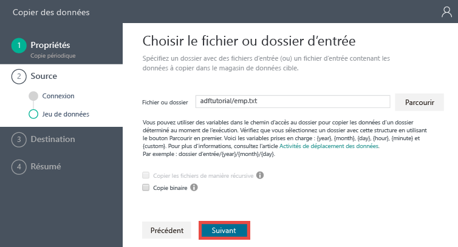
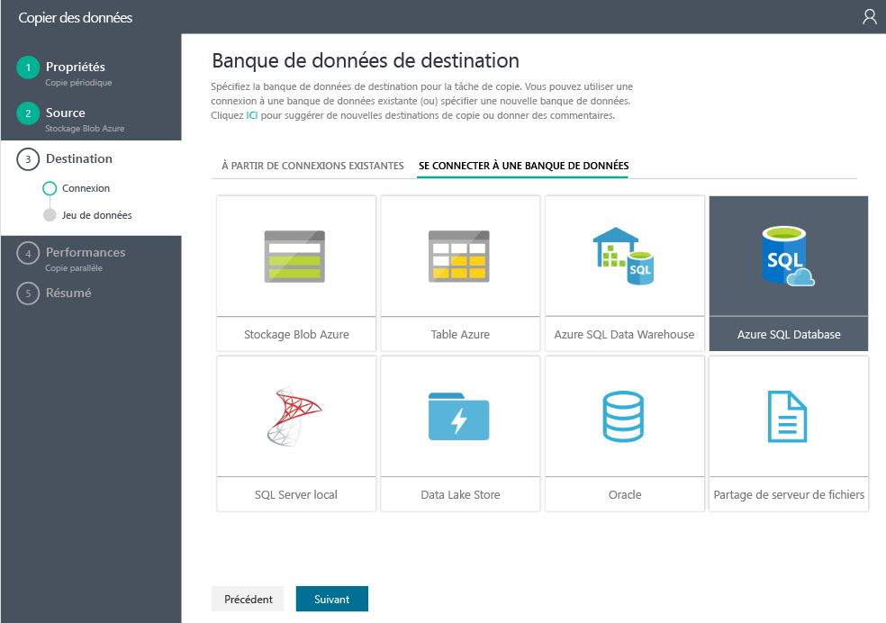
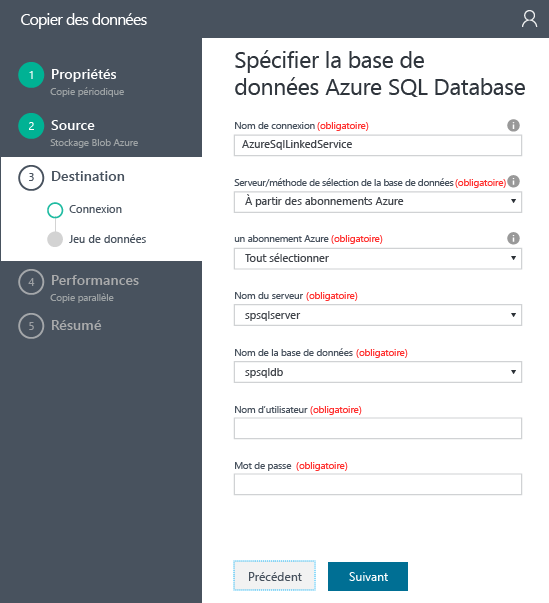
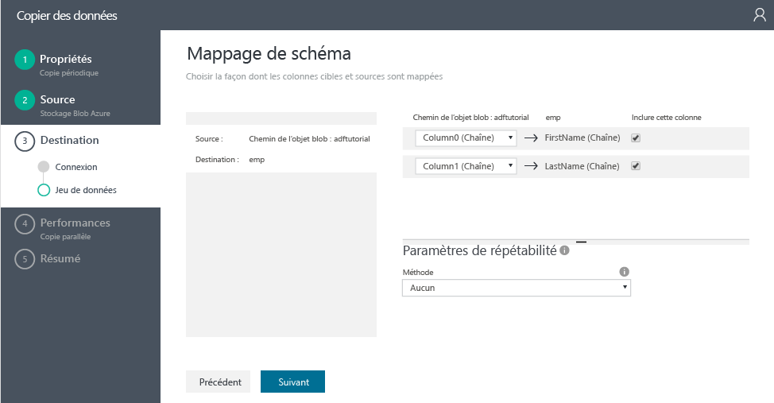
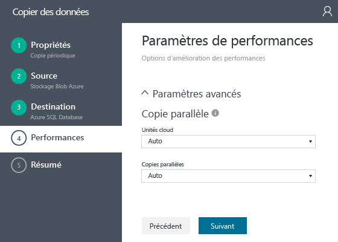
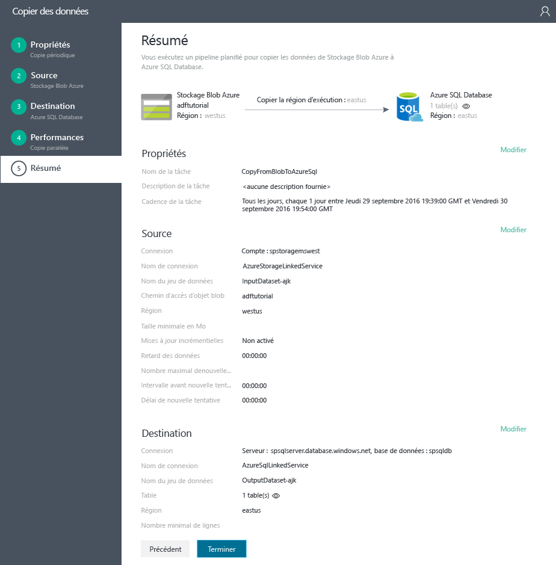

# Didacticiel : Créer un pipeline avec l’activité de copie à l’aide de l’Assistant Data Factory Copy
> [!div class="op_single_selector"]
> * [Vue d’ensemble et étapes préalables requises](data-factory-copy-data-from-azure-blob-storage-to-sql-database.md)
> * [Assistant de copie](data-factory-copy-data-wizard-tutorial.md)
> * [Portail Azure](data-factory-copy-activity-tutorial-using-azure-portal.md)
> * [Visual Studio](data-factory-copy-activity-tutorial-using-visual-studio.md)
> * [PowerShell](data-factory-copy-activity-tutorial-using-powershell.md)
> * [Modèle Azure Resource Manager](data-factory-copy-activity-tutorial-using-azure-resource-manager-template.md)
> * [API REST](data-factory-copy-activity-tutorial-using-rest-api.md)
> * [API .NET](data-factory-copy-activity-tutorial-using-dotnet-api.md)
> 
> 

**L’Assistant Copie** d’Azure Data Factory vous permet de créer facilement et rapidement un pipeline mettant en œuvre le scénario d’ingestion/déplacement de données. Par conséquent, nous vous recommandons d’utiliser l’Assistant en vue de créer un exemple de pipeline pour le scénario de déplacement de données. Ce didacticiel vous montre comment créer une fabrique de données Azure, lancer l’Assistant Copie et suivre une série d’étapes pour fournir des informations sur votre scénario d’ingestion/déplacement de données. Une fois les étapes de l’Assistant terminées, celui-ci crée automatiquement un pipeline avec une activité de copie pour copier des données d’un stockage d’objets blob Azure à une base de données SQL Azure. Pour plus d’informations sur l’activité de copie, consultez l’article [Activités de déplacement des données](data-factory-data-movement-activities.md) . 

> [!IMPORTANT]
> Lisez l’article [Vue d’ensemble et étapes préalables requises](data-factory-copy-data-from-azure-blob-storage-to-sql-database.md) pour obtenir une présentation du didacticiel et effectuer les **étapes préalables requises** avant de suivre ce didacticiel.
> 
> 

## Créer une fabrique de données
Dans cette étape, vous allez utiliser le portail Azure pour créer une fabrique de données Azure nommée **ADFTutorialDataFactory**.

1. Une fois connecté au [portail Azure](https://portal.azure.com), cliquez sur **+ NOUVEAU** en haut à gauche, sur **Intelligence et analyse**, puis sur **Data Factory**. 
   
   
2. Dans le panneau **Nouvelle fabrique de données** :
   
   1. Entrez **ADFTutorialDataFactory** comme **nom**.
       Le nom de la fabrique de données Azure doit être un nom global unique. Si l'erreur suivante s'affiche, changez le nom de la fabrique de données (par exemple, votrenomADFTutorialDataFactory), puis tentez de la recréer : **Le nom de la fabrique de données « ADFTutorialDataFactory » n'est pas disponible**. Consultez la rubrique [Data Factory - Règles d'affectation des noms](data-factory-naming-rules.md) pour savoir comment nommer les artefacts Data Factory.  
      
       
      
      > [!NOTE]
      > Le nom de la fabrique de données pourra être enregistré en tant que nom DNS et devenir ainsi visible publiquement.
      > 
      > 
   2. Sélectionnez votre **abonnement**Azure.
   3. Pour Groupe de ressources, effectuez l’une des opérations suivantes : 
      
      - Sélectionnez **Utiliser l’existant** pour sélectionner un groupe de ressources existant.
      - Sélectionnez **Créer un nouveau** pour entrer un nom pour un groupe de ressources.
         
          Certaines étapes de ce didacticiel supposent que vous utilisez le groupe de ressources nommé **ADFTutorialResourceGroup** . Pour plus d'informations sur les groupes de ressources, consultez [Utilisation des groupes de ressources pour gérer vos ressources Azure](../azure-resource-manager/resource-group-overview.md).
   4. Sélectionnez un **emplacement** pour la fabrique de données.
   5. Sélectionnez la case à cocher **Épingler au tableau de bord** en bas du panneau.  
   6. Cliquez sur **Create**.
      
                   
3. Une fois la création terminée, le panneau **Data Factory** s’affiche comme sur l’image suivante :
   
   

## Lancer l’Assistant de copie
1. Dans la page d’accueil Fabrique de données, cliquez sur la vignette **Copier les données** pour lancer l’**Assistant de copie**. 
   
   > [!NOTE]
   > Si vous voyez que le navigateur web est bloqué au niveau « Autorisation... », désactivez/décochez l’option **Block third party cookies and site data** (Bloquer les cookies et les données de site tiers) (ou) laissez cette option activée et créez une exception pour **login.microsoftonline.com**, puis essayez de relancer l’Assistant.
   > 
   > 
2. Dans la page **Propriétés** :
   
   1. Saisissez **CopyFromBlobToAzureSql** dans **Nom de la tâche**.
   2. Saisissez une **Description** (facultative).
   3. Modifiez les champs **Date et heure de début** et **Date et heure de fin** de manière à définir la date de fin sur la date du jour et la date de début cinq jours avant la date du jour.  
   4. Cliquez sur **Next**.  
      
       
3. Dans la page **Source data store** (Magasin de données source), cliquez sur la vignette **Stockage d’objets blob Azure**. Cette page sert à spécifier le magasin de données source pour la tâche de copie. Vous pouvez utiliser un service lié de magasin de données existant (ou) spécifier un nouveau magasin de données. Pour utiliser un service lié existant, vous devez cliquer sur **FROM EXISTING LINKED SERVICES** (À PARTIR DES SERVICES LIÉS EXISTANTS) et sélectionner le service lié approprié. 
   
    
4. Dans la page **Specify the Azure Blob storage account** (Spécifier le compte de stockage d’objets blob Azure) :
   
   1. Saisissez **AzureStorageLinkedService** dans **Nom du service lié**.
   2. Vérifiez que l’option **À partir des abonnements** est sélectionnée pour **Account selection method** (Méthode de sélection du compte).
   3. Sélectionnez votre **abonnement**Azure.  
   4. Sélectionnez un **compte de stockage Azure** dans la liste des comptes de stockage Azure disponibles dans l’abonnement sélectionné. Vous pouvez également choisir de saisir manuellement les paramètres du compte de stockage en sélectionnant l’option **Saisir manuellement** dans **Account selection method** (Méthode de sélection de compte). Cliquez ensuite sur **Suivant**. 
      
      
5. Dans la page **Choose the input file or folder** (Choisir le fichier ou le dossier d’entrée) :
   
   1. Accédez au dossier **adftutorial** .
   2. Sélectionnez **emp.txt**, puis cliquez sur **Choisir**.
   3. Cliquez sur **Next**. 
      
      
6. Sur la page **Choose the input file or folder (Choisir le fichier ou le dossier d’entrée)**, cliquez sur **Suivant**. Ne sélectionnez pas **copie binaire**. 
   
     
7. Dans la page **File format settings** (Paramètres de format de fichier), vous pouvez voir les délimiteurs et le schéma qui sont détectés automatiquement par l’Assistant en analysant le fichier. Vous pouvez également entrer les délimiteurs manuellement pour que l’Assistant copie arrête leur détection automatique ou pour remplacer les délimiteurs détectés. Une fois que vous avez vérifié les délimiteurs et afficher un aperçu des données, cliquez sur **Suivant**. 
   
      
8. Dans la page de la banque de données de destination, cliquez sur la vignette **Azure SQL Database**, puis sur **Suivant**.
   
    
9. Dans la page **Specify the Azure SQL database** (Spécifier la base de données Azure SQL Database) :
   
   1. Saisissez **AzureSqlLinkedService** dans le champ **Nom de la connexion**.
   2. Vérifiez que l’option **À partir des abonnements** est sélectionnée pour **Server / database selection method** (Méthode de sélection du serveur/de la base de données).
   3. Sélectionnez votre **abonnement**Azure.  
   4. Sélectionnez le **Nom du serveur** et la **Base de données**.
   5. Saisissez le **Nom d’utilisateur** et le **Mot de passe**.
   6. Cliquez sur **Next**.  
      
      
10. Dans la page **Mappage de table**, sélectionnez **emp** dans la liste déroulante du champ **Destination**, puis cliquez sur **Flèche vers le bas** (facultatif) pour afficher le schéma et un aperçu des données.
    
      
11. Dans la page **Mappage de schéma** cliquez sur **Suivant**.
    
    
12. Dans la page **Paramètres de performances** cliquez sur **Suivant**. 
    
    
13. Passez en revue les informations contenues dans la page **Résumé**, puis cliquez sur **Terminer**. L’Assistant crée deux services liés, deux jeux de données (entrée et sortie) et un pipeline dans la fabrique de données (d’où vous avez lancé l’Assistant Copie). 
    
    

## Lancer l’application Surveiller et gérer
1. Dans la page **Déploiement**, cliquez sur le lien : `Click here to monitor copy pipeline`.
   
     
2. Suivez les instructions de la section [Surveiller et gérer les pipelines Azure Data Factory à l’aide de la nouvelle application de surveillance et gestion](data-factory-monitor-manage-app.md) pour en savoir plus sur la surveillance du pipeline que vous venez de créer. Cliquez sur l’icône **Actualiser** dans la liste de **FENÊTRES D’ACTIVITÉ** pour afficher la tranche. 
   
    
   
   > [!NOTE]
   > Cliquez sur le bouton **Actualiser** dans la liste **FENÊTRES D’ACTIVITÉ** en bas pour afficher le dernier état. L’état n’est pas actualisé automatiquement. 
   > 
   > 

## Voir aussi
| Rubrique | Description |
|:--- |:--- |
| [Activités de déplacement des données](data-factory-data-movement-activities.md) |Cet article fournit une description détaillée de l’activité de copie que vous avez utilisée dans ce didacticiel. |
| [Planification et exécution](data-factory-scheduling-and-execution.md) |Cet article explique les aspects de la planification et de l’exécution du modèle d’application Azure Data Factory. |
| [Pipelines](data-factory-create-pipelines.md) |Cet article vous aide à comprendre les pipelines et les activités dans Azure Data Factory, et à les utiliser dans l’optique de créer des workflows pilotés par les données de bout en bout pour votre scénario ou votre entreprise. |
| [Groupes de données](data-factory-create-datasets.md) |Cet article vous aide à comprendre les jeux de données dans Azure Data Factory. |
| [Surveiller et gérer les pipelines Azure Data Factory à l’aide de la nouvelle application de surveillance et gestion.](data-factory-monitor-manage-app.md) |Cet article décrit comment surveiller, gérer et déboguer les pipelines à l’aide de l’application de surveillance et gestion. |

<!--HONumber=Dec16_HO1-->

