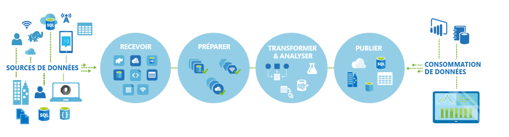
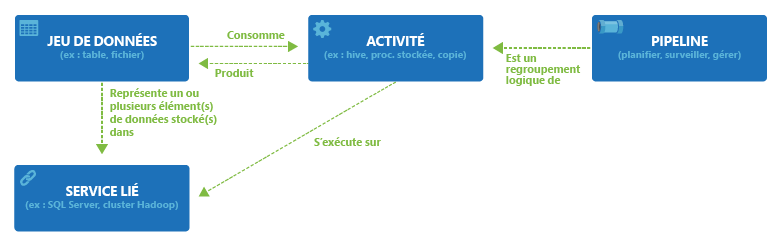

<properties 
	pageTitle="Présentation d'Azure Data Factory" 
	description="Découvrez comment utiliser le service Azure Data Factory pour composer des services de traitement de données, de stockage de données et de déplacement de données pour créer des pipelines qui génèrent des informations fiables." 
	services="data-factory" 
	documentationCenter="" 
	authors="spelluru" 
	manager="jhubbard" 
	editor="monicar"/>

<tags 
	ms.service="data-factory" 
	ms.workload="data-services" 
	ms.tgt_pltfrm="na" 
	ms.devlang="na" 
	ms.topic="get-started-article" 
	ms.date="11/18/2015" 
	ms.author="spelluru"/>

# Présentation du service Azure Data Factory

## Vue d'ensemble
Data Factory est un service d’intégration de données dans le cloud qui gère et automatise le déplacement et la transformation des données. À la manière d’une usine de fabrication, qui utilise des machines visant à transformer des matières premières en produits manufacturés, Data Factory orchestre des services existants qui collectent des données brutes et les transforment en informations prêtes à l'emploi.

Data Factory fonctionne pour des sources de données locales et dans le cloud et avec les SaaS pour réceptionner, préparer, transformer, analyser et publier vos données. Utilisez Data Factory pour constituer des services dans des pipelines de flux de données gérés afin de transformer vos données à l'aide de services tels qu’[Azure HDInsight (Hadoop)](http://azure.microsoft.com/documentation/services/hdinsight/) et [Azure Batch](http://azure.microsoft.com/documentation/services/batch/) pour vos besoins en calcul de Big Data, et avec [Azure Machine Learning](http://azure.microsoft.com/documentation/services/machine-learning/) pour configurer vos solutions d'analyse. Car une simple vue tabulaire pour surveiller vos projets ne suffit plus, utilisez les affichages élaborés de Data Factory et visualisez d’un seul coup d’œil le lignage et les dépendances de vos pipelines de données. Analysez tous vos pipelines de flux de données à partir d'une vue unifiée pour identifier les problèmes et configurer des alertes d'analyse en toute simplicité.

**Figure 1.** Collectez les données de nombreuses sources de données locales, réceptionnez-les et préparez-les, organisez-les et analysez-les en vous appuyant sur toute une série de transformations. Publiez ensuite ces données prêtes à l’emploi en vue de leur consommation.

Vous pouvez utiliser Data Factory à tout moment dès que vous en avez besoin pour collecter des données de différentes formes et tailles, les transformer et les publier pour extraire des informations détaillées. Le tout, avec un calendrier fiable. Data Factory permet de créer des pipelines de flux de données hautement disponibles pour de nombreux scénarios, à travers des secteurs différents, pour leurs besoins en matière de pipeline d’analyse. Les détaillants en ligne peuvent l’utiliser pour générer des [recommandations de produits](data-factory-product-reco-usecase.md) personnalisées basées sur le comportement de navigation du client. Des studios de jeux l'utilisent pour comprendre [l'efficacité de leur campagnes](data-factory-customer-profiling-usecase.md) marketing. Découvrez directement auprès de nos clients comment et pourquoi ils utilisent Data Factory en consultant les [Études de cas client](data-factory-customer-case-studies.md).

> [AZURE.VIDEO azure-data-factory-overview]

## Concepts clés

Azure Data Factory contient quelques entités clés qui fonctionnent conjointement pour définir les données d’entrée et de sortie, les événements de traitement et le calendrier et les ressources nécessaires pour exécuter le flux de données souhaité.

**Figure 2 :** Relations entre jeu de données, activité, pipeline et service lié

### Activités
Les activités définissent les actions à effectuer sur les données. Chaque activité accepte ou non des [jeux de données](data-factory-create-datasets.md) en tant qu’entrées et produit au moins un jeu de données en tant que sortie. Une activité est une unité d'orchestration dans Azure Data Factory. Par exemple, vous pouvez utiliser une [activité de copie](data-factory-data-movement-activities.md) pour orchestrer la copie de données d’un jeu de données vers un autre. De même, vous pouvez utiliser une [activité Hive](data-factory-data-transformation-activities.md) qui exécutera une requête Hive sur un cluster Azure HDInsight afin de convertir ou d’analyser vos données. Azure Data Factory fournit un large éventail d'activités de transformation, d’analyse et de déplacement de données.

### Pipelines
Les [pipelines](data-factory-create-pipelines.md) constituent un regroupement logique d’activités. Ils sont utilisés pour regrouper des activités dans une unité. Ces activités exécutent alors conjointement une tâche. Par exemple, une séquence de plusieurs activités de transformation peut être nécessaire pour nettoyer les données d’un fichier journal. Cette séquence peut présenter un calendrier et des dépendances complexes qui doivent être orchestrés et automatisés. Toutes ces activités pourraient être regroupées en un seul pipeline nommé « CleanLogFiles ». « CleanLogFiles » pourrait ensuite être déployé, planifié ou supprimé sous la forme d'une seule unité. Plus besoin de gérer chaque activité de manière indépendante.

### Jeux de données
Les [jeux de données](data-factory-create-datasets.md) englobent des références/liens nommés vers les données que vous souhaitez utiliser en tant qu’entrées ou sorties d’activités. Les jeux de données identifient les structures de données dans différents magasins de données, notamment des tables, des fichiers, des dossiers et des documents.

### Service lié
Les services liés définissent les informations nécessaires à Data Factory pour se connecter à des ressources externes. Data Factory fait appel aux services liés pour deux raisons :

- Pour représenter un magasin de données et notamment un partage de fichiers SQL Server, Oracle DB local ou un compte de stockage Azure Blob. Comme expliqué ci-dessus, les jeux de données représentent les structures que l’on retrouve dans des magasins de données connectés à Data Factory via un service lié.
- Pour représenter une ressource de calcul qui peut héberger l'exécution d'une activité. Par exemple, l'activité « HDInsightHive » s'exécute sur un cluster HDInsight Hadoop.

Avec ces quatre concepts simples de jeux de données, activités, pipelines et services liés, plus instant à perdre pour vous y mettre ! Vous pouvez [créer votre premier pipeline](data-factory-build-your-first-pipeline.md) de A à Z ou déployer un exemple prêt à l’emploi en suivant les instructions présentées dans l’article [Azure Data Factory - Exemples](data-factory-samples.md).

<!---HONumber=Nov15_HO4-->