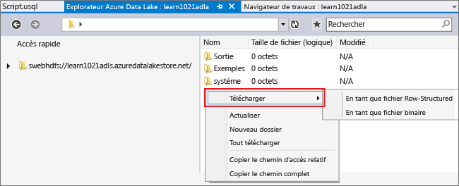
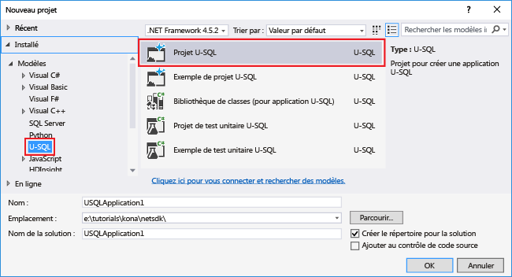
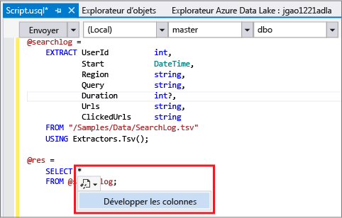
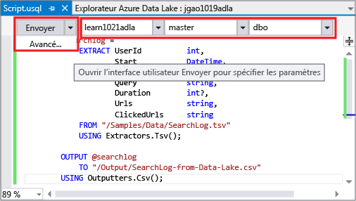
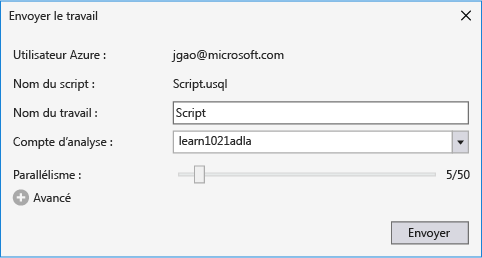
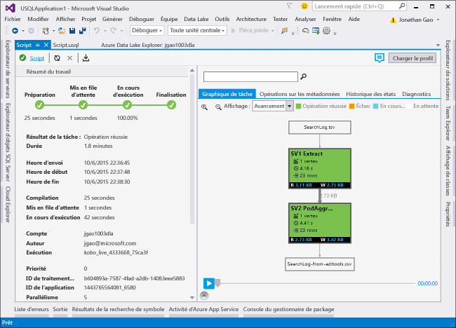
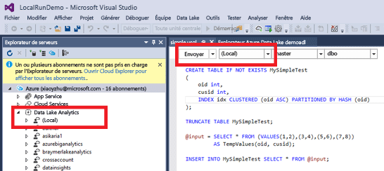
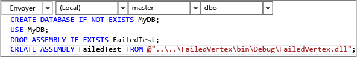

<properties 
   pageTitle="Développer des scripts U-SQL avec Data Lake Tools pour Visual Studio | Azure" 
   description="Découvrez comment installer Data Lake Tools Visual Studio et développer et tester des scripts U-SQL." 
   services="data-lake-analytics" 
   documentationCenter="" 
   authors="mumian" 
   manager="paulettm" 
   editor="cgronlun"/>
 
<tags
   ms.service="data-lake-analytics"
   ms.devlang="na"
   ms.topic="get-started-article"
   ms.tgt_pltfrm="na"
   ms.workload="big-data" 
   ms.date="03/15/2016"
   ms.author="jgao"/>

# Didacticiel : Développer des scripts U-SQL avec Data Lake Tools pour Visual Studio

[AZURE.INCLUDE [get-started-selector](../../includes/data-lake-analytics-selector-get-started.md)]

Découvrez comment installer Data Lake Tools pour Visual Studio et utiliser Data Lake Tools pour Visual Studio pour écrire et tester des scripts U-SQL.

U-SQL est un langage hyper évolutif et hautement extensible conçu pour préparer, transformer et analyser toutes les données dans le lac de données et au-delà. Pour plus d'informations, consultez [Référence U-SQL](http://go.microsoft.com/fwlink/p/?LinkId=691348).

###Composants requis

- **Visual Studio 2015, Visual Studio 2013 mise à jour 4 ou Visual Studio 2012. Les éditions Enterprise (Ultimate/Premium), Professional et Community sont prises en charge ; l’édition Express n’est pas prise en charge.** 
- **Kit de développement logiciel (SDK) Microsoft Azure pour .NET version 2.7.1 ou ultérieure**. Installez-le avec [Web Platform Installer](http://www.microsoft.com/web/downloads/platform.aspx).
- **[Data Lake Tools pour Visual Studio](http://aka.ms/adltoolsvs)**. 

    Une fois les outils Data Lake pour Visual Studio installés, vous verrez un nœud « Data Lake Analytics » dans l’Explorateur de serveurs sous le nœud « Azure » (vous pouvez ouvrir l’Explorateur de serveurs en appuyant sur Ctrl+Alt+S).

- **Consultez les deux sections suivantes dans [Prendre en main Azure Data Lake Analytics à l’aide du portail Azure](data-lake-analytics-get-started-portal.md)**.

	- [Créer un compte Azure Data Lake Analytics](data-lake-analytics-get-started-portal.md#create_adl_analytics_account).
	- [Télécharger SearchLog.tsv sur le compte Data Lake Storage par défaut](data-lake-analytics-get-started-portal.md#update-data-to-the-default-adl-storage-account).

    Pour votre commodité, vous pouvez trouver un exemple de script PowerShell pour la création d’un service Data Lake Analytics et le téléchargement d’un fichier de données source dans [Annexe A - Exemple PowerShell pour la préparation du didacticiel](data-lake-analytics-data-lake-tools-get-started.md#appx-a-powershell-sample-for-preparing-the-tutorial).
    
	Data Lake Tools ne prend pas en charge la création de comptes Data Lake Analytics. Par conséquent, vous devez le créer avec le portail Azure, Azure PowerShell, le Kit de développement logiciel (SDK) .NET ou Azure CLI. Pour lancer une tâche Data Lake Analytics, vous aurez besoin de données. Bien que Data Lake Tools prenne en charge le téléchargement de données, vous allez utiliser le portail pour télécharger les exemples de données, ce qui facilitera la progression dans ce didacticiel.

## Connexion à Azure

**Se connecter à Data Lake Analytics**

1. Ouvrez Visual Studio.
2. Dans le menu **Affichage**, cliquez sur **Explorateur de serveurs** pour ouvrir la fenêtre du même nom. Ou appuyez sur **[CTRL] + [ALT] + S**.
3. Cliquez avec le bouton droit sur **Azure**, cliquez sur Se connecter à un abonnement Microsoft Azure, puis suivez les instructions.
4. Dans l’**Explorateur de serveurs**, développez **Azure**, puis **Data Lake Analytics**. Le cas échéant, la liste de vos comptes Data Lake Analytics s'affiche. Vous ne pouvez pas créer de comptes Data Lake Analytics à partir de Visual Studio. Pour créer un compte, consultez [Prendre en main Azure Data Lake Analytics avec le portail Azure](data-lake-analytics-get-started-portal.md) ou [Prendre en main Azure Data Lake Analytics avec Azure PowerShell](data-lake-analytics-get-started-powershell.md).

## Téléchargement des fichiers de données source

Vous avez téléchargé des données dans la section **Configuration requise** précédemment dans le didacticiel.

Si vous voulez utiliser vos propres données, voici les procédures de téléchargement des données à partir de Data Lake Tools.

**Pour charger les fichiers dans le compte Azure Data Lake dépendant**

1. À partir de l’**Explorateur de serveurs**, développez successivement **Azure**, **Data Lake Analytics**, votre compte Data Lake Analytics, **Comptes de stockage**. Le compte de stockage Data Lake par défaut doit s'afficher, ainsi que les comptes de stockage Data Lake liés et les comptes Azure Storage liés. Le compte Data Lake par défaut a une étiquette « Compte de stockage par défaut ».
2. Cliquez avec le bouton droit sur le compte de stockage Data Lake par défaut, puis cliquez sur **Explorer**. Le volet de l'Explorateur Data Lake Tools pour Visual Studio s'ouvre. Une arborescence est affichée à gauche, l'affichage du contenu se trouve à droite.
3. Accédez au dossier où vous souhaitez télécharger des fichiers, 
4. Cliquez avec le bouton droit sur n’importe quel espace vide, puis cliquez sur **Télécharger**. 

	

**Pour charger les fichiers dans un compte Azure Blob Storage lié**

1. À partir de l’**Explorateur de serveurs**, développez successivement **Azure**, **Data Lake Analytics**, votre compte Data Lake Analytics, **Comptes de stockage**. Le compte de stockage Data Lake par défaut doit s'afficher, ainsi que les comptes de stockage Data Lake liés et les comptes Azure Storage liés. 
2. Développez le compte Azure Storage.
3. Cliquez avec le bouton droit sur le conteneur dans lequel vous souhaitez télécharger des fichiers, puis cliquez sur **Explorer**. Si vous ne disposez pas d’un conteneur, vous devez commencer par en créer un à l’aide du portail Azure, d’Azure PowerShell ou d’autres outils.
4. Accédez au dossier où vous souhaitez télécharger des fichiers, 
5. Cliquez avec le bouton droit sur n’importe quel espace vide, puis cliquez sur **Télécharger**. 

## Développer des scripts U-SQL 

Les travaux Analytique Data Lake sont écrits en langage U-SQL. Pour en savoir plus sur U-SQL, consultez [Prise en main langage U-SQL](data-lake-analytics-u-sql-get-started.md) et [Référence du langage U-SQL](http://go.microsoft.com/fwlink/?LinkId=691348).

**Pour créer et soumettre une tâche Data Lake Analytics**

1. Dans le menu **Fichier**, cliquez sur **Nouveau**, puis sur **Projet**.
2. Sélectionnez le type **Projet U-SQL**.

	

3. Cliquez sur **OK**. Visual Studio crée une solution avec un fichier **Script.usql**.
4. Insérez le script suivant dans le fichier **Script.usql** :

        @searchlog =
            EXTRACT UserId          int,
                    Start           DateTime,
                    Region          string,
                    Query           string,
                    Duration        int?,
                    Urls            string,
                    ClickedUrls     string
            FROM "/Samples/Data/SearchLog.tsv"
            USING Extractors.Tsv();

		@res =
		    SELECT *
		    FROM @searchlog;        

        OUTPUT @res   
            TO "/Output/SearchLog-from-Data-Lake.csv"
        USING Outputters.Csv();

	Ce script U-SQL lit le fichier de données source avec **Extractors.Tsv()**, puis crée un fichier .csv avec **Outputters.Csv()**.
    
    Ne modifiez pas les deux chemins d'accès, sauf si vous avez copié le fichier source dans un autre emplacement. Data Lake Analytics créera le dossier de sortie s'il n'existe pas encore.
	
	Il est plus simple d’utiliser des chemins d’accès relatifs pour les fichiers stockés dans les comptes Data Lake par défaut. Vous pouvez également utiliser des chemins d’accès absolus. Par exemple :
    
        adl://<Data LakeStorageAccountName>.azuredatalakestore.net:443/Samples/Data/SearchLog.tsv
        
    Vous devez utiliser des chemins d’accès absolus pour accéder aux fichiers dans les comptes de stockage liés. La syntaxe des fichiers stockés dans le compte de stockage Azure lié est la suivante :
    
        wasb://<BlobContainerName>@<StorageAccountName>.blob.core.windows.net/Samples/Data/SearchLog.tsv

    >[AZURE.NOTE] Les conteneurs d'objets Blob Azure avec des autorisations d'accès aux objets Blob publics ou aux conteneurs publics ne sont pas pris en charge actuellement.

	Notez les caractéristiques suivantes :

	- **IntelliSense**
	 
		Nom renseigné automatiquement et les membres seront affichés pour Ensemble de lignes, Classes, Bases de données, Schémas et Objets définis par l'utilisateur (UDO).
		 
		IntelliSense pour les entités de catalogue (Bases de données, Schémas, Tables, UDO, etc.) est lié à votre compte de calcul. Vous pouvez vérifier le compte de calcul, la base de données et le schéma actifs actuels dans la barre d'outils supérieure et les faire commuter via les listes déroulantes.
 
    - **Développez les colonnes ***

        Cliquez à droite de *. Un trait de soulignement bleu doit s’afficher sous *. Placez le curseur sur le trait de soulignement bleu, puis cliquez sur la flèche vers le bas. 

        Cliquez sur **Développer les colonnes**. L’outil remplace alors * par le nom des colonnes.
    
	- **Mise en forme automatique**
	
		Les utilisateurs peuvent modifier la mise en retrait du script Scope basé sur la structure de code sous Modifier->Avancé :
  
		- Mettre le document en forme (Ctrl+E, D) : met en forme l'ensemble du document   
		- Mettre la sélection en forme (Ctrl+K, Ctrl+F) : met en forme la sélection. Si aucune sélection n'a été effectuée, ce raccourci met en forme la ligne où se trouve le curseur.  
		
		Toutes les règles de mise en forme peuvent être configurées sous Outils->Options->Éditeur de texte->SIP->Mise en forme.  
	- **Mise en retrait intelligente**
	 
		Data Lake Tools pour Visual Studio peut mettre en retrait automatiquement les expressions lorsque vous écrivez des scripts. Cette fonctionnalité est désactivée par défaut. Les utilisateurs doivent l'activer sous U-SQL->Options et paramètres->Commutateurs->Activer la mise en retrait intelligente.

	- **Accès à la définition et recherche de toutes les références**
	
		Cliquez avec le bouton droit sur le nom d'un ensemble de lignes/paramètre/d'une colonne/d'un UDO, etc. et cliquez sur Atteindre la définition (F12) pour accéder à sa définition. Cliquez sur Rechercher toutes les références (Maj+F12) pour afficher toutes les références.

	- **Insertion du chemin d'accès Azure**
		
		Plutôt que de mémoriser le chemin d'accès du fichier Azure et de le taper manuellement lors de l'écriture du script, Data Lake Tools pour Visual Studio offre une méthode facile : cliquez avec le bouton droit dans l'éditeur, cliquez sur Insérer le chemin d'accès Azure. Accédez au fichier dans la boîte de dialogue de l'Explorateur d'objets Blob Azure. Cliquez sur **OK** pour insérer le chemin d'accès dans votre code.

5. Spécifiez le compte Data Lake Analytics, la base de données et le schéma. Vous pouvez sélectionner **(local)** pour exécuter le script en local à des fins de test. Pour plus d’informations, consultez [Exécuter U-SQL localement](#run-u-sql-locally).

	

    Pour plus d’informations, consultez [Utilisation du catalogue U-SQL](data-lake-analytics-use-u-sql-catalog.md).

5. Dans l’**Explorateur de solutions**, cliquez avec le bouton droit sur **Script.usql**, puis cliquez sur **Générer le script**. Vérifiez le résultat dans le volet Sortie.
6. Dans l’**Explorateur de solutions**, cliquez avec le bouton droit sur **Script.usql**, puis cliquez sur **Soumettre le script**. Si vous le souhaitez, vous pouvez également cliquer sur **Soumettre** dans le volet Script.usql. Consultez la capture d’écran précédente. Cliquez sur la flèche vers le bas en regard du bouton Soumettre pour envoyer à l'aide des options avancées :
7. Indiquez le **nom du travail**, vérifiez le **compte Analytics**, puis cliquez sur **Soumettre**. Les résultats de la soumission et le lien vers la tâche sont disponibles dans la fenêtre Résultats de Data Lake Tools pour Visual Studio à l'issue de la soumission.

	

8. Vous devez cliquer sur le bouton Actualiser pour afficher le dernier état du travail et actualiser l'écran. Si le travail réussit, vous verrez le **Graphique** associé, les **Opérations sur les métadonnées**, l’**Historique de l’état**, les **Diagnostics** :

	

	* Résumé du travail. Affiche les informations de résumé du travail en cours, par exemple : état, progression, durée d'exécution, nom de l'exécution, demandeur, etc.   
	* Détails du travail. Informations détaillées sur ce travail, y compris le script, les ressources, la vue d'exécution du vertex.
	* Graphique du travail. Quatre graphiques permettent de visualiser les informations du travail : progression, données lues, données écrites, durée d'exécution, durée d'exécution moyenne par nœud, débit d'entrée, débit de sortie.
	* Opérations sur les métadonnées. Affiche toutes les opérations sur les métadonnées.
	* Historique de l'état. 
	* Diagnostics. Data Lake Tools pour Visual Studio diagnostique automatiquement l'exécution du travail. Vous recevrez des alertes lorsqu'il y a des erreurs ou des problèmes de performances dans les travaux. Consultez la section Diagnostics de travaux (lien TBD) pour plus d'informations. 
	
**Pour vérifier l'état du travail**

1. À partir de l’Explorateur de serveurs, développez successivement **Azure**, **Data Lake Analytics**, le nom du compte Data Lake Analytics.
2. Double-cliquez sur **Travaux** pour répertorier les travaux.
2. Cliquez sur un travail pour en afficher l'état.

**Voir le résultat de la tâche**

1. Dans l’**Explorateur de serveurs**, développez **Azure**, **Analytique Data Lake**, puis votre compte Analytique Data Lake et **Comptes de stockage**. Cliquez avec le bouton droit sur le compte de stockage Data Lake par défaut, puis sur **Explorateur**. 
2.  Double-cliquez sur **sortie** pour ouvrir le dossier
3.  Double-cliquez sur **SearchLog-From-adltools.csv**.

###Lecture de travail 

La lecture de travail vous permet de surveiller la progression de l'exécution du travail et de détecter visuellement les anomalies de performance et les goulots d'étranglement. Cette fonctionnalité peut être utilisée avant la fin de l'exécution du travail (c'est-à-dire, pendant que le travail est en cours d'exécution), ainsi que lorsque l'exécution est terminée. Exécuter la lecture pendant l'exécution du travail permet à l'utilisateur de lire la progression jusqu'à l'heure actuelle.

**Pour afficher la progression de l'exécution du travail**

1. Cliquez sur **CHARGER LE PROFIL** dans le coin supérieur droit. Reportez-vous à la capture d'écran précédente.
2. Cliquez sur le bouton Lecture dans le coin inférieur gauche pour passer en revue la progression de l'exécution du travail. 
3. Lors de la lecture, cliquez sur **Pause** pour l’arrêter ou faites glisser directement la barre de progression sur des positions spécifiques. 

###Carte thermique 

Data Lake Tools pour Visual Studio fournit des superpositions en couleurs sélectionnables par l'utilisateur dans la vue du travail pour indiquer la progression, les E/S de données, la durée d'exécution, le débit E/S de chaque étape. Grâce à cela, les utilisateurs peuvent déterminer les problèmes potentiels et la distribution des propriétés du travail directement et de façon intuitive. Vous pouvez choisir une source de données à afficher dans la liste déroulante.

## Exécuter U-SQL localement

Grâce à l’exécution locale dU-SQL dans Visual Studio, vous pouvez :

- Exécuter des scripts U-SQL localement, ainsi que des assemblys C#. 
- Déboguer des assemblys C# localement. 
- Créer/supprimer/afficher des tables, schémas, assemblys et bases de données locaux dans l’Explorateur de serveurs, tout comme vous pouvez le faire pour le service Azure Data Lake Analytics. 

Un compte *Local* est répertorié dans Visual Studio et le programme d’installation crée un dossier *DataRoot* sous *C:\\LocalRunRoot*. Le dossier DataRoot sera utilisé pour :

- Stocker les métadonnées, notamment des tables, des bases de données, des fonctions à valeurs de tables (TVF), etc.
- Pour un certain script : si un chemin d'accès relatif est référencé dans les chemins d'entrée/sortie, nous examinerons le dossier DataRoot (ainsi que le chemin du script)
- Le dossier DataRoot ne sera PAS référencé si vous tentez d'inscrire un assembly et d'utiliser un chemin d'accès relatif (voir la rubrique « Utilisation d'assemblys lors de l'exécution locale » pour plus de détails)

La vidéo suivante présente la fonctionnalité d'exécution locale U-SQL :

>[AZURE.VIDEO usql-localrun]

### Problèmes connus et limitations

- L'exécution locale d'U-SQL ne prend pas en charge l'interrogation locale de jeux de fichiers. Consultez [Ensembles de fichiers U-SQL](https://msdn.microsoft.com/library/azure/mt621294.aspx). Ce problème sera résolu prochainement.
- Baisse des performances en raison d'un faible parallélisme car les plans de tâches sont exécutés en série dans un processus unique. 
- L’exécution locale ne permet pas d’afficher les graphiques de tâches dans Visual Studio. Ce problème sera corrigé prochainement. 
- Impossible de créer la table/base de données etc. dans l'Explorateur de serveurs pour le compte local.
- Lorsqu'un chemin d'accès relatif est référencé :

    - Dans l'entrée du script (EXTRACT * FROM "/path/abc") - le chemin d'accès à DataRoot et le chemin d'accès au script seront explorés. 
    - Dans la sortie du script (OUTPUT TO "path/abc") : le chemin d'accès au dossier DataRoot sera utilisé comme dossier de sortie. 
    - Dans l'enregistrement de l'assembly (CREATE ASSEMBLY xyz FROM "/path/abc") : le chemin d'accès du script est exploré, mais pas celui du dossier DataRoot. 
    - Dans les entités TVF/View ou autres entités métadonnées inscrites : le chemin d'accès au dossier DataRoot est exploré, mais pas celui du script. 
    
    Pour les scripts exécutés sur le service Data Lake, le compte de stockage par défaut sera utilisé comme dossier racine et exploré en conséquence.

### Tester les scripts SQL-U localement
Pour obtenir des instructions sur le développement de scripts SQL-U, consultez [Développer des scripts U-SQL](#develop-and-test-u-sql-scripts). Pour générer et exécuter des scripts SQL-U localement, sélectionnez **(Local)** dans la liste déroulante du cluster, puis cliquez sur **Envoyer**. Vérifiez que vous avez les bonnes données référencées - faites référence au chemin d'accès absolu ou placez les données dans le dossier DataRoot.

Vous pouvez également cliquer avec le bouton droit sur un script, puis cliquer sur **Exécuter le plan local** dans le menu contextuel, ou appuyer sur **CTRL+F5** pour lancer l’exécution locale.

### Utiliser des assemblys dans l'exécution locale

Il existe deux manières d'exécuter les fichiers C# personnalisés :

- Écrire des assemblys dans fichier code-behind ; les assemblys seront automatiquement inscrits et supprimés une fois le script terminé. 
- Créer un projet d'assembly C# et inscrire la dll de sortie dans le compte local via un script comme ci-dessous. Notez que le chemin d'accès est relatif au script plutôt qu'au dossier DataRoot.

 
### Déboguer localement des scripts et des assemblys C#

Vous pouvez déboguer des assemblys C# sans les envoyer ni les inscrire auprès du service Azure Data Lake Analytics. Vous pouvez définir des points d'arrêt à la fois dans les fichier code-behind et dans un projet C# référencé.

**Pour déboguer le code local dans le fichier code-behind**
1.	Définissez des points d'arrêt dans le fichier code-behind. 
2.	Appuyez sur **F5** pour déboguer le script localement.

La procédure suivante fonctionne uniquement dans Visual Studio 2015. Dans les versions Visual Studio plus anciennes, vous devrez peut-être ajouter manuellement les fichiers pdb.

**Pour déboguer le code local dans un projet C# référencé**
1.	Créez un projet d'assembly C# et générez-le pour obtenir la dll de sortie.
2.	Inscrivez la dll à l'aide d'une instruction SQL-U :

        CREATE ASSEMBLY assemblyname FROM @"..\..\path\to\output\.dll";
3.	Définissez des points d'arrêt dans le code C#.
4.	Appuyez sur **F5** pour déboguer le script en faisant référence à la dll C# localement.  

##Voir aussi

Pour commencer à utiliser Data Lake Analytics à l'aide de différents outils, consultez :

- [Prendre en main Data Lake Analytics à l'aide du portail Azure](data-lake-analytics-get-started-portal.md)
- [Prise en main de Data Lake Analytics à l'aide d'Azure PowerShell](data-lake-analytics-get-started-powershell.md)
- [Prise en main de Data Lake Analytics à l'aide du Kit de développement logiciel (SDK) .NET](data-lake-analytics-get-started-net-sdk.md)

Pour afficher les autres rubriques sur le développement :

- [Analyser les journaux web à l'aide de Data Lake Analytics](data-lake-analytics-analyze-weblogs.md)
- [Développer des scripts U-SQL avec Data Lake Tools pour Visual Studio](data-lake-analytics-data-lake-tools-get-started.md)
- [Prise en main du langage U-SQL Azure Data Lake Analytics](data-lake-analytics-u-sql-get-started.md)
- [Développer des opérateurs définis par l'utilisateur U-SQL pour des travaux Data Lake Analytics](data-lake-analytics-u-sql-develop-user-defined-operators.md)

##Exemple PowerShell pour la préparation du didacticiel

Le script PowerShell suivant prépare un compte Azure Data Lake Analytics et la source de données pour vous. Vous pouvez donc passer à [Développer des scripts U-SQL](data-lake-analytics-data-lake-tools-get-started.md#develop-u-sql-scripts).

    #region - used for creating Azure service names
    $nameToken = "<Enter an alias>" 
    $namePrefix = $nameToken.ToLower() + (Get-Date -Format "MMdd")
    #endregion

    #region - service names
    $resourceGroupName = $namePrefix + "rg"
    $dataLakeStoreName = $namePrefix + "adas"
    $dataLakeAnalyticsName = $namePrefix + "adla"
    $location = "East US 2"
    #endregion

    # Treat all errors as terminating
    $ErrorActionPreference = "Stop"

    #region - Connect to Azure subscription
    Write-Host "`nConnecting to your Azure subscription ..." -ForegroundColor Green
    try{Get-AzureRmContext}
    catch{Login-AzureRmAccount}
    #endregion

    #region - Create an Azure Data Lake Analytics service account
    Write-Host "Create a resource group ..." -ForegroundColor Green
    New-AzureRmResourceGroup `
        -Name  $resourceGroupName `
        -Location $location

    Write-Host "Create a Data Lake account ..."  -ForegroundColor Green
    New-AzureRmDataLakeStoreAccount `
        -ResourceGroupName $resourceGroupName `
        -Name $dataLakeStoreName `
        -Location $location 

    Write-Host "Create a Data Lake Analytics account ..."  -ForegroundColor Green
    New-AzureRmDataLakeAnalyticsAccount `
        -Name $dataLakeAnalyticsName `
        -ResourceGroupName $resourceGroupName `
        -Location $location `
        -DefaultDataLake $dataLakeStoreName

    Write-Host "The newly created Data Lake Analytics account ..."  -ForegroundColor Green
    Get-AzureRmDataLakeAnalyticsAccount `
        -ResourceGroupName $resourceGroupName `
        -Name $dataLakeAnalyticsName  
    #endregion

    #region - prepare the source data
    Write-Host "Import the source data ..."  -ForegroundColor Green
    $localFolder = "C:\Tutorials\Downloads" # A temp location for the file. 
    $storageAccount = "adltutorials"  # Don't modify this value.
    $container = "adls-sample-data"  #Don't modify this value.

    # Create the temp location  
    New-Item -Path $localFolder -ItemType Directory -Force 

    # Download the sample file from Azure Blob storage
    $context = New-AzureStorageContext -StorageAccountName $storageAccount -Anonymous
    $blobs = Azure\Get-AzureStorageBlob -Container $container -Context $context
    $blobs | Get-AzureStorageBlobContent -Context $context -Destination $localFolder

    # Upload the file to the default Data Lake Store account    
    Import-AzureRmDataLakeStoreItem -AccountName $dataLakeStoreName -Path $localFolder"SearchLog.tsv" -Destination "/Samples/Data/SearchLog.tsv"

    Write-Host "List the source data ..."  -ForegroundColor Green
    Get-AzureRmDataLakeStoreChildItem -Account $dataLakeStoreName -Path  "/Samples/Data/"
    #endregion

<!---HONumber=AcomDC_0406_2016-->